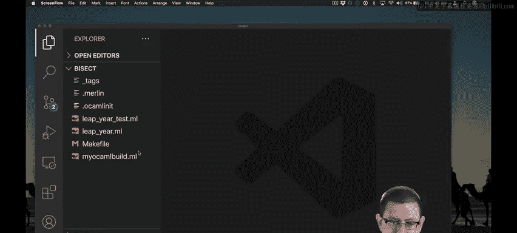
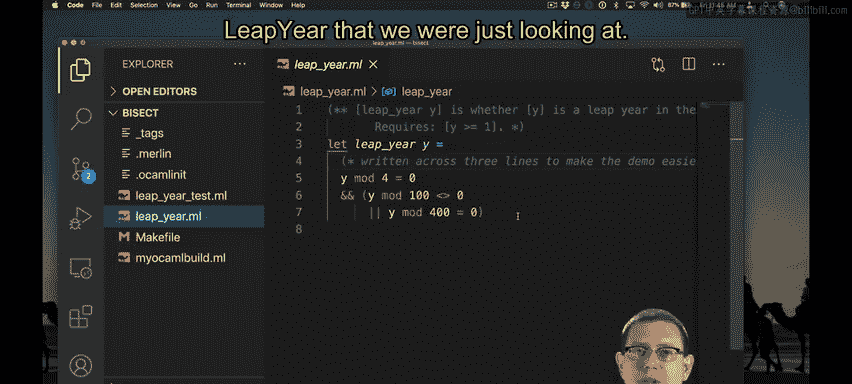
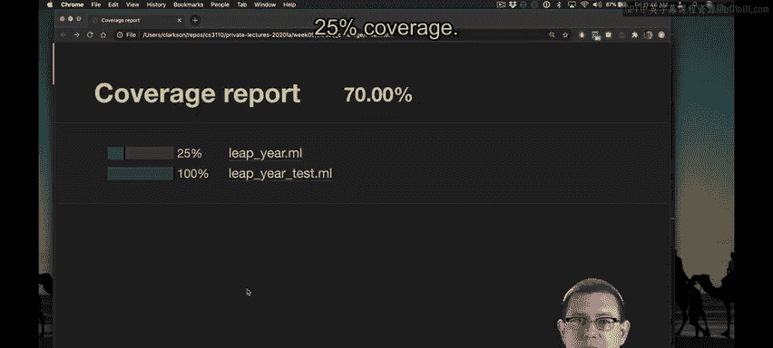
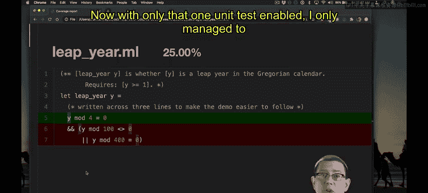
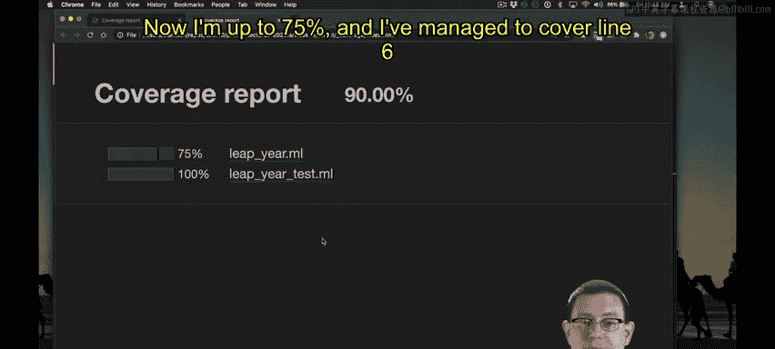
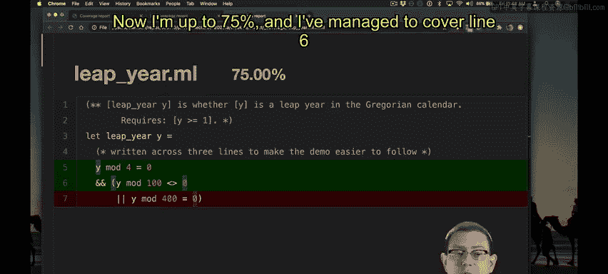
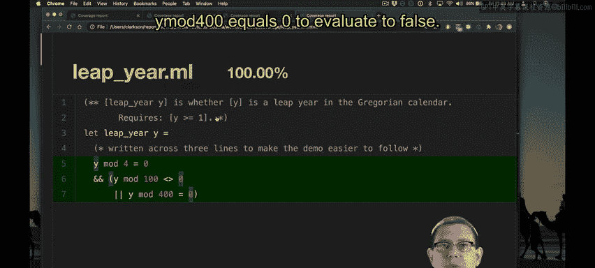
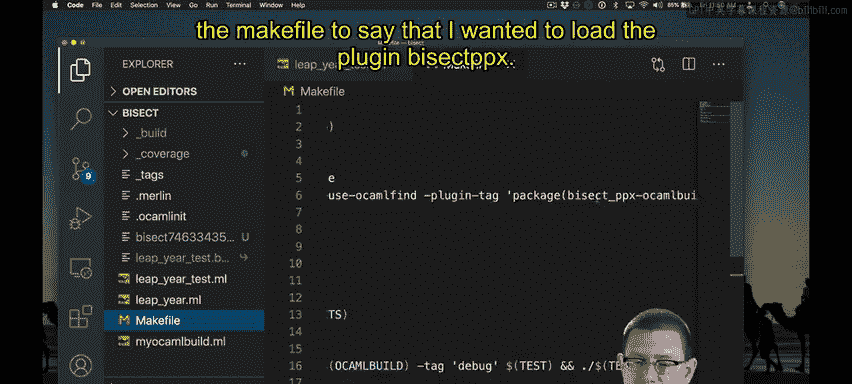

# 康奈尔大学《OCaml编程｜CS3110：OCaml Programming： Correct + Efficient + Beautiful》中英字幕 - P88：-088-Bisect Chap6 Video 18.zh_en - GPT中英字幕课程资源 - BV1Tx4y1s7sP

Glass box testing is something that the computer itself can help you do。

Many languages provide some sort of support for figuring out whether you've actually managed to exercise every statement in the program or in a functional language。

 every expression。Java has some support for this， so does Ocal。

Ocael's support comes in the form of a tool named biSect。

Here's a simple demo of how you can use biSect to do glass box testing。

I've created a file leap year that has the code for the function leap year that we were just looking at。

I've also created some unit tests for it in this file。

I'm going to go ahead and comment out two of those unit tests to get started here。Now。

 let's go ahead and run our test suite。 It passes。I have created a new make file target。

 I'll show it to you in a second called BiecC。When I run Make biSect。

 it produces a report to tell me about the code coverage。That report goes into coverage。

I can open that in my web browser。And you can see that the file leapier dot M is getting only 25% coverage。

 If I drill down into that file， you'll see that the first line of the body of the function has been highlighted to show that there was a unit test that made it to that expression。

 but the rest of it has not been。

All of these little characters here that themselves have a little highlight behind them are program points。

That bisect instrumented。So when I linked in biSect as part of the compilation process of testing this code。

 it actually injected some code into the runtime to record whether program execution had gone past those points or not。

That's how it's figuring out whether I cover all of the expressions in the program。Now。

 with only that one unit test enabled， I only managed to cover that first line。

 That unit test was testing the year 2010， which is not。

I can uncomment the next line and get a little bit better of coverage。Now I'm left to 75%。

And I've managed to cover line six as well。

Because that unit test。Looked at a year that was not asc to me。Finally。

 if I want to get up to 100% statement coverage， I can uncomment the final unit test and rerun biSect。

And look at the results again。Now I'm at 100% coverage and I can be very happy。As you can see。

 this is statement coverage， not path coverage because I didn't have to add another unit test in order to force y mod 400 equals0 to evaluate to false。

Going back to the source code， there's a few things I had to do to enable biSect here。

 One of them was to update the tags file to say that I wanted to cover some of the source code。

 as well as to link in the package bisect PPX。I didn't have to do anything in particular to the Merlin file。

I did have to add a new file named my OMmobilbi。ml。

 and the main thing I had to do after that was to update the make file to say that I wanted to load the plugin bySecPX and issue some additional commands when I was wanting to test the source code as well as produced。

You'll find all of that documented in the test。