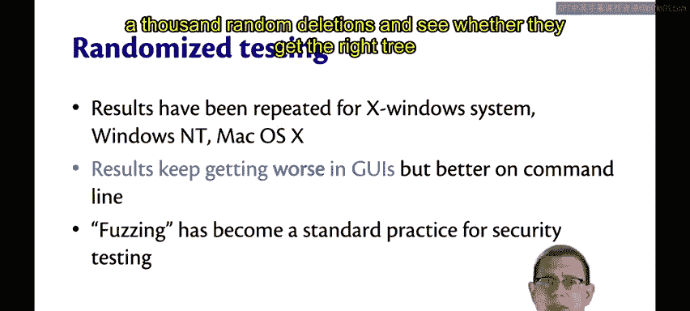
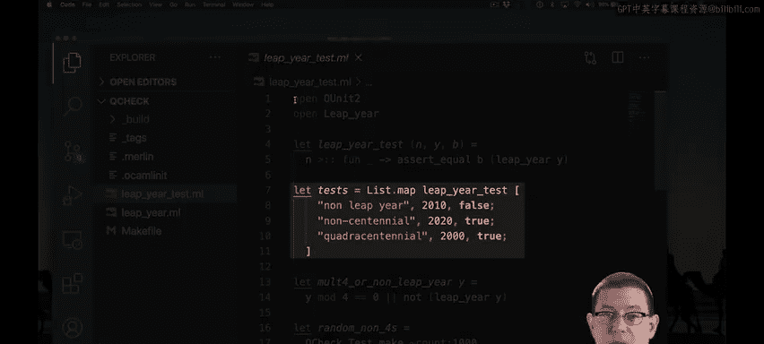
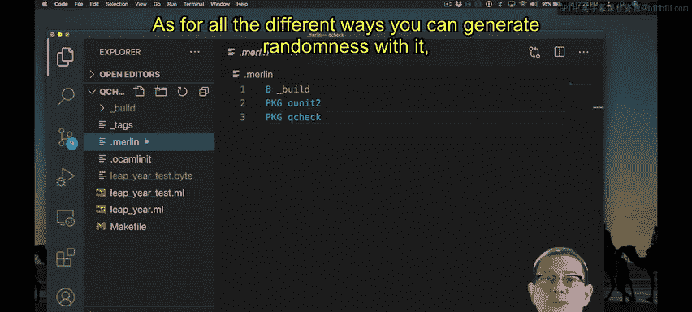
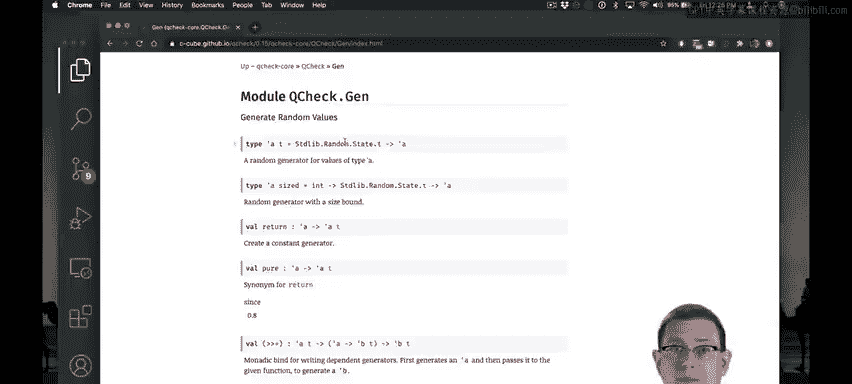

# 康奈尔大学《OCaml编程｜CS3110：OCaml Programming： Correct + Efficient + Beautiful》中英字幕 - P89：-089-Randomized Testing and QCheck Chap6 Video 19.zh_en - GPT中英字幕课程资源 - BV1Tx4y1s7sP

In addition to black box testing and glass box。Another really important methodology for testing is randomized testing。

This testing methodology really was discovered in a story that literally begins。

 it was a dark and stormy night。A researcher was using their dialup modem to connect to their university's computer cluster。

And there was an electrical storm going on at the time。

 The electrical strikes were introducing noise into the line。

 and that caused random characters to be inserted in what the researcher was typing。

Those random characters caused some of the utilities the researcher was using to crash on that remote computer。

Inspired by that idea， the researcher decided to test and see how much crashing could occur if random characters were fed as input to programs。

So that's the idea behind randomized testing。Generate random inputs and feed them to programs to see what happens。

😡，Maybe the program crashes。Maybe it hangs or goes into an infinite loop。

Maybe it terminates normally， but gets a right or a wrong alpha。

Back when this was first done in 1989 of the 90 or so utilities that were tested。

 about a quarter to a third of them would crash when fed random inputs in various flavors of Eix。

A crash is a bad thing。It means there's possibly a buffer overflow vulnerability in the program。

That an attacker might exploit to get control of the computer system。Since then。

 these results have been retested on X windows， on Windows， on Mac OOS， and guess what。

 do you think the results are getting better or worse？Well， in Gos， the results keep getting worse。

 but getting better on the command。So we're generally fixing the vulnerabilities of command line utilities。

 but testing Gooys is a really hard problem， and so it's not surprising that those might be getting worse。

Since then， this kind of testing， which often goes by the nameFuzz testing。

 like feeding fuzz to the program， has become a standard practice in security testing。

It's also really useful in testing our own code。In fact， in some later programming assignments。

 the course staff routinely does this as a way of testing your implementation of data structures there's no better way to see whether someone's balanced binary tree implementation really works correctly than feed at a thousand random insertions followed by a thousand random deletions and see whether they get the right tree as a result OCMel also has support for randomized testing。

Let's go back to our leap year function。

I've got the same usual three tests that we had before。

 but now I've added some new tests built from a library called Qeche， which stands for Quick Check。

This is a library for doing quick， randomized testing of properties of functions。

So let's look at what this first test is doing。It's testing random non4s。

 the name of this test is non multiples of four cannot be leap years。Let's pause think about that。

Yeah， a year like 2001， which is not a multiple of four， can never be a leap you。

So what this test does is to make 1 thousand different random tests。

All of which generate an input that is randomly in the range 1 through 3000。

And then checks for each of those inputs， whether the function that I've listed here on the last line returns true。

😡，So we're checking a property of that input。😡，And the property we're checking is up here。

 this function molt4 or non leap year， we're checking whether either that year is a multiple of four。

 in which case it might or might not be a leap year。

 but we're not going to check any further than that。But if it's not a multiple four。

 then it had better not be a leap here。😡，So that's a property of the year。😡，Now。

 why are we checking properties instead of the exact right output， you know。

 whether the leap year gets two or false on it？Well。

 it's because I can't predict in advance for a random number， whether it's a leap year or not。

If I already had code that I knew did that correctly， then I could use that code， but guess what。

 that's exactly the code I'm trying to test right here， that's not going to work。😡。

So randomized testing is usually not about testing where you get exactly the right output for an input。

😡，It's about property based testing。😡，Testing whether some property holds of the input and output。

Here we're testing the property of whether it's a multiple four or a non leap year。Then here。

 I have another randomized test。This is checking for years that are centuries。

Hundreds cannot be leap years unless there' are also 400。

So I've written the property here to check whether the year is a multiple of 400， if so， that's fine。

 I'm not going to deal any further with it。But if it's not a multiple of 400。

 I'm going to check and see whether it's a leap year。As long as I'm only passing in 100s。

 that ought to always return true。So what I've done is to generate random numbers in the range 1 through 30 here with Qcheck。

And then map each of those numbers through a function that multiplies it by 100。

So that gets me anywhere from 100 up to 3，000 as random numbers， and I'm checking that property。

There is a function in Qche to convert these to O unit2 tests。

 I apply that function to each of those tests， and now I can throw them in my O unit test suite along with all my other O unit tests。

There we go Now you only see five tests here because each of those quick check tests。

 despite the fact that there were 1000 random elements checked at each one of them only counts as one little dot in the output here if any one of those 1000 elements had failed during that test we would have gotten a failure here and Quick check would have told us what the random input was that triggered that failure。

To make quick check work with your source code is really pretty easy。

 you just have to link it as a package， so it goes in the tags file as a package Q check。

 and it goes in the Merlin file as another package as well。As for all the different ways。

 you can generate randomness with it。

The documentation for the library has all the generators for all the types。

 so we've been using the generator here for an int range。

 but there's all kinds of other random generators like corner cases for integers。Small integers。

 small natural numbers， and even many other generators for other types， like floats， shuffled lists。

 all kinds of higher order functions for manipulating these。

 and there's even functionality for generating random elements of variant types too。

