# 康奈尔大学《OCaml编程｜CS3110：OCaml Programming： Correct + Efficient + Beautiful》中英字幕 - P90：-090-Debugging Chap6 Video 20.zh_en - GPT中英字幕课程资源 - BV1Tx4y1s7sP

When a test fails， you find yourself in the position of having to debug a program。

Debugging is like being the detective in a crime movie where you are also the murderer。😡。

You're the one who' done it and you're trying to catch yourself。

So testing reveals a fault in a program， debugging reveals the cause of that fault。😡。

And debugging takes more time than programming。So try to get it right the first time and spare yourself all the time spent debugy。

But if you find yourself in the position of having to debug。

Try to first understand exactly why you think the code works before launching it into debugging。

That time spent upfront thinking can save you a lot of time later。

 Here's some advice for how to debug successfully。

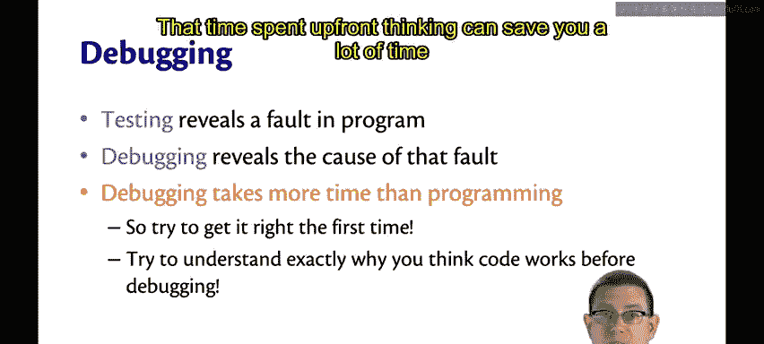

Follow the scientific method。 formulate a falsifiable hypothesis first。

Then create an experiment that can refute that hypothesis。

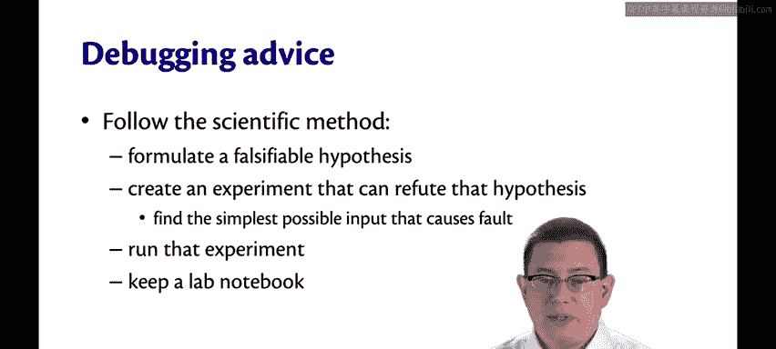

Typically， what that means is finding the simplest possible input that causes the fault。

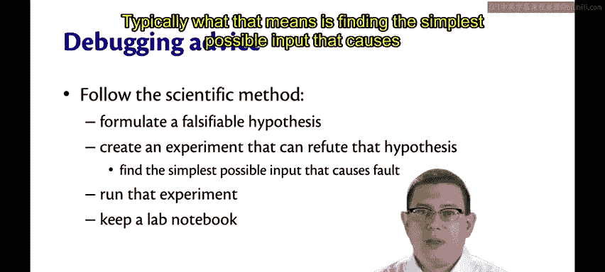

You run that experiment。And then， keep a notebook。Because a lot of debugging tasks get pretty complicated。

So write down what you're doing。The faults that you're observing。

The inputs that you were trying as those experiments。

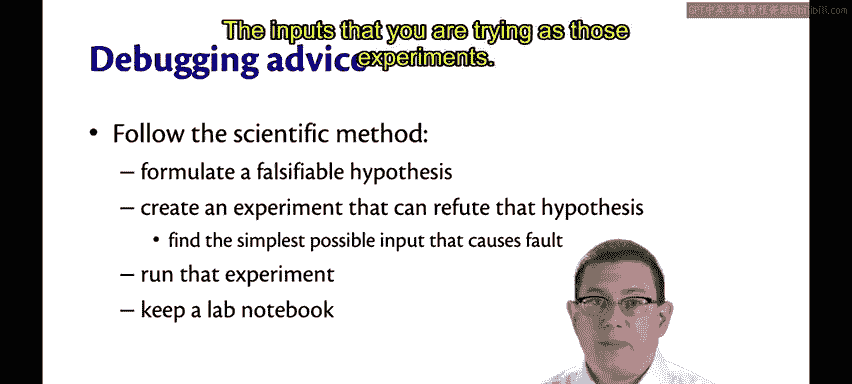

And the results that you get。By keeping a notebook instead of trying to keep all the information tuck away in your brain。

 you will make yourself more efficient in those midnight debugging sessions when you find yourself getting flumoxed。

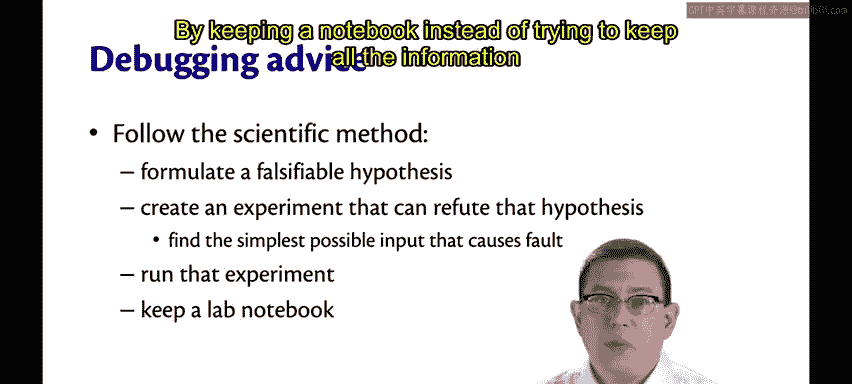

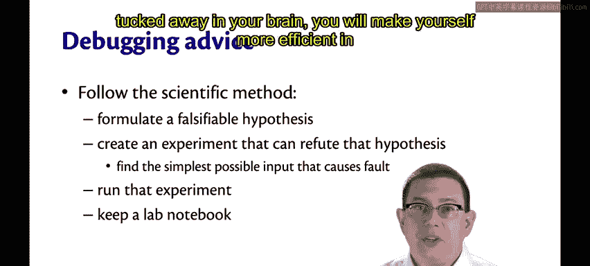

Chances are， it means the bug is not where you think it is。So ask yourself， where could it not be？😡。

And then start investigating those places as well。Another great strategy is to get someone else to help you。

One wonderful way to do this is with a rubber duck。

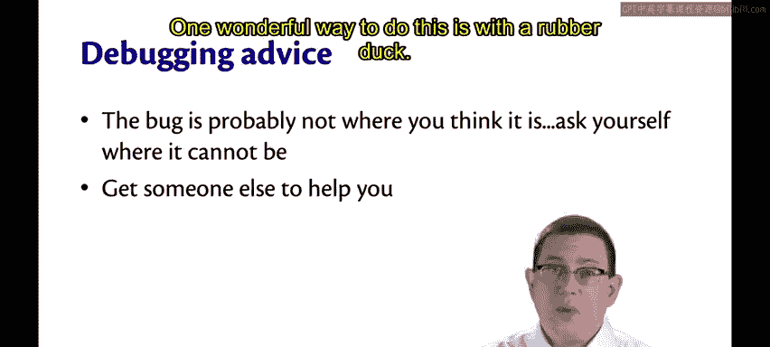

I actually keep a rubber duck on my office shelf in gates。

 perhaps one day you'll get to drop by and see it yourself。

 it was given to be by some former students。Just verbalize out loud。

 It doesn't have to be to a rubber duck。 Talk to someone else imaginary。

 Talk to a stuffy or a pillow if you need to。 But get your brain going as if you're trying to explain the problem to another human。

 It's amazing how effective that can be。

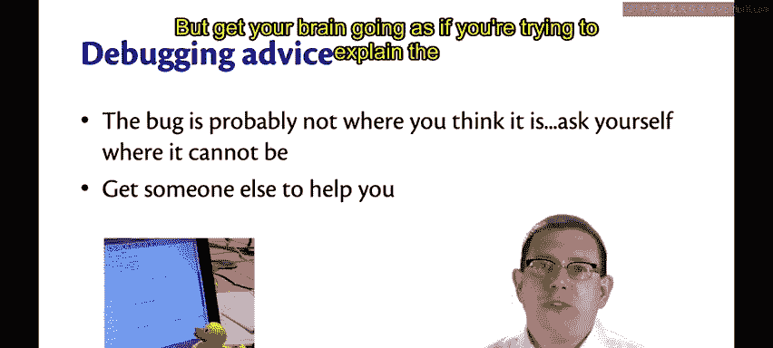

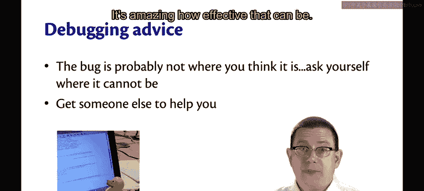

If all else is failing。Question your own sanity about what might be going on。

Do you really have the right version of the compiler？😡。

Are you really working with the right version of the source code。

 or is there maybe another parallel directory that you're working and you didn't realize that？

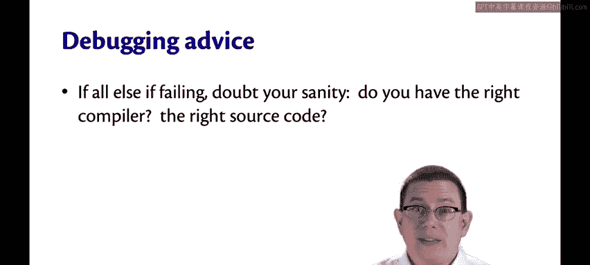

If you find yourself getting angry or tired， stomp。It's very hard to debug。

 and it's only harder when you're emotion。So give it a break。

And come back refreshed when you're feeling more rational。

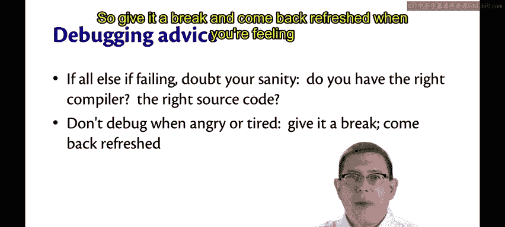

Think through any fixes you make carefully。It is a common phenomenon that fixing a bug actually introduces new bugs。

 so be very careful when you make those patches。

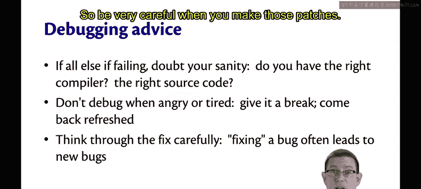

Defensive programming is a great way to speed up your debugging。

 but you do it in advance before you ever get to the point of debugging。

 so you can think of it as a kind of proactive debugging。

The idea is to make it easier to detect faults。By writing fault detection code as you're implementing the rest of the code。

You're already familiar with some techniques for this， so let me just remind you of them。

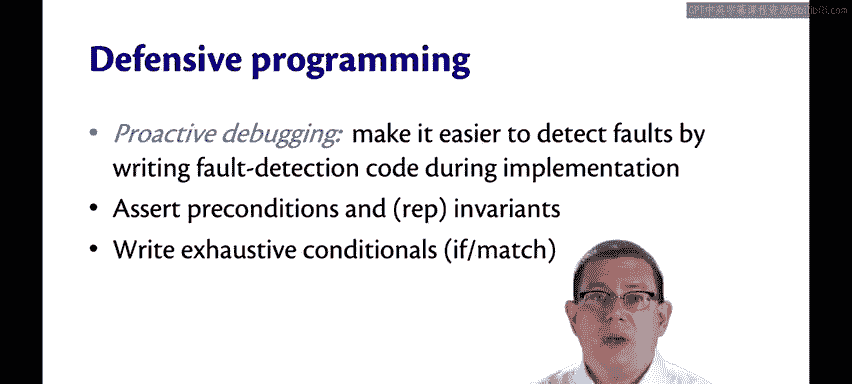

Assert preconditions， it's not required by the specification。

 but it's a great defensive programming technique。😡。

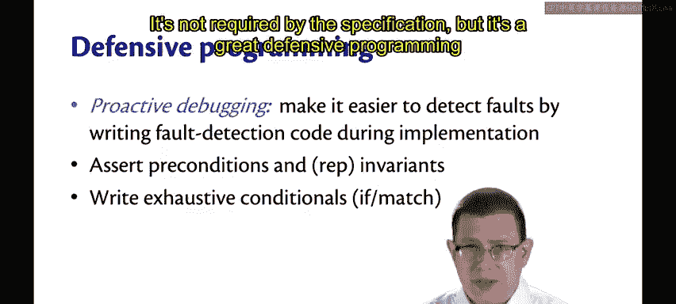

Assert invaris， like representation invari。

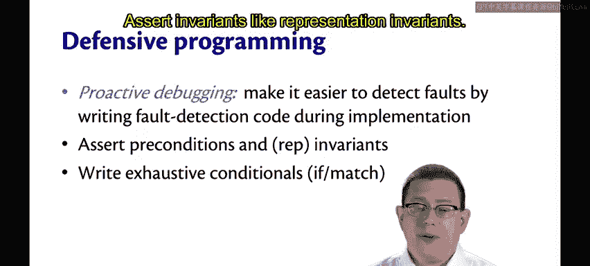

Write exhaustive conditionals， make sure every match expression has exhaustive pattern matches and the compiler is not giving you any warnings。

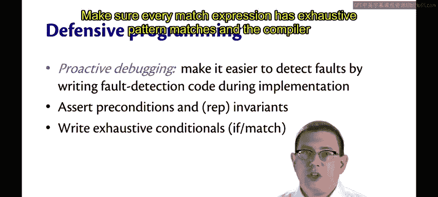

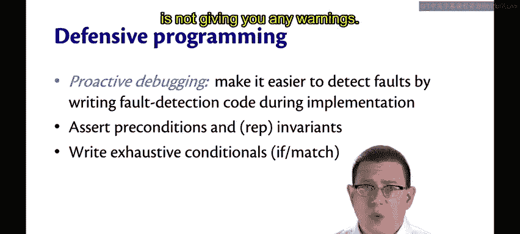

Some people might ask，I't defensive programming expensive？😡。

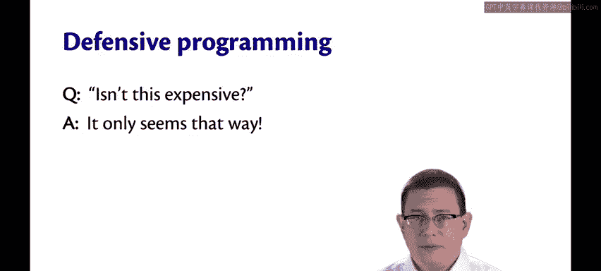

The answer is it only seems that way。For the implementer。

 defensive code actually pays off in terms of the faults that it catches early rather than later on when you're trying to deal with bugD reports from。

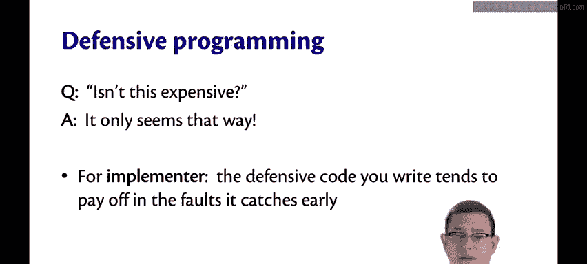

In terms of performance， sometimes the defensive programming can be a little expensive。

 but the faults you catch in production might save more money to your company than the runtime cost of the checks。

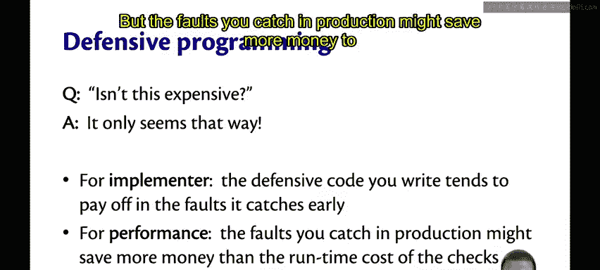

