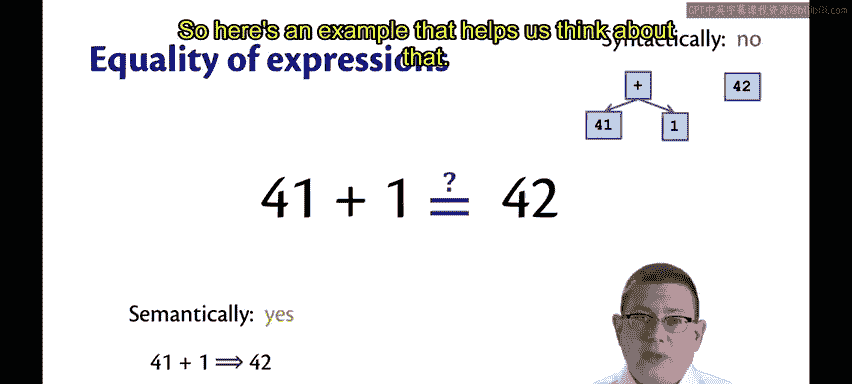
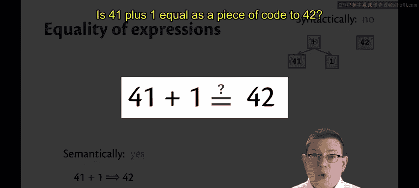
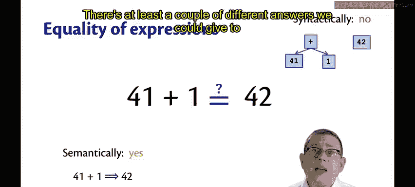
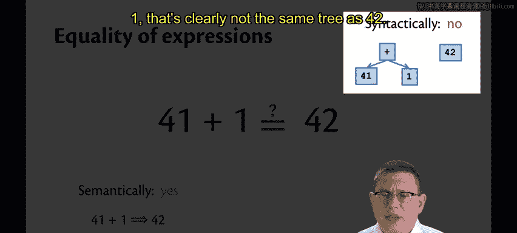
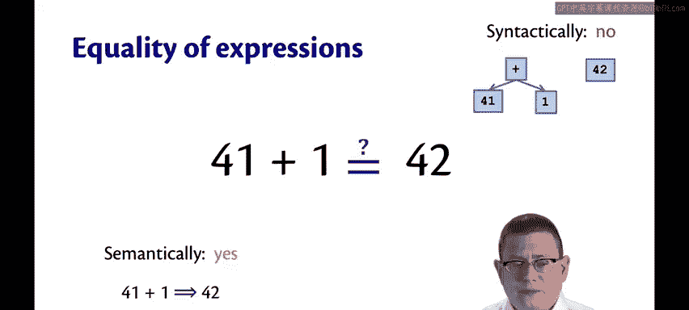
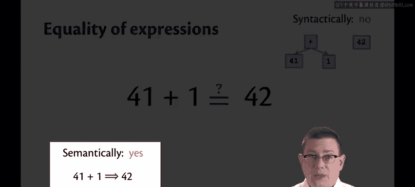
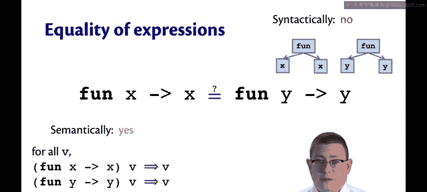
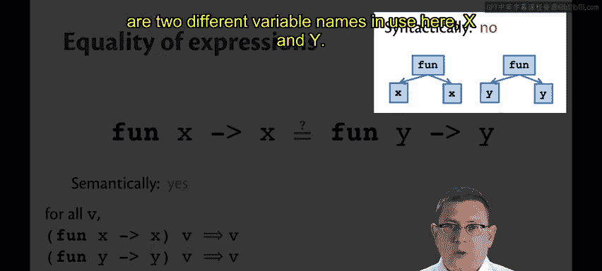
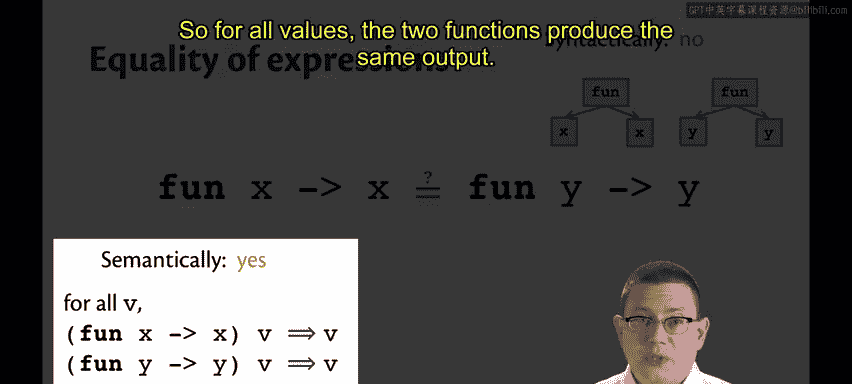
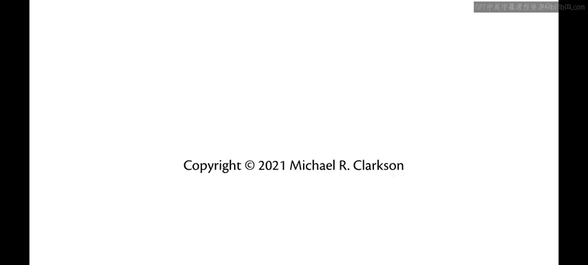

# OCaml编程：6.22：表达式相等性 🧮

在本节课中，我们将学习如何证明程序的正确性，其核心在于理解“表达式相等性”这一概念。我们将探讨如何判断两段代码是否“相等”，这不仅是程序规范的基础，也是后续进行正确性证明的关键。

## 程序正确性与规范

证明程序正确性意味着什么？如何做到这一点？

我们从一个**规范**的立场出发。假设这里有一个计算阶乘的程序。实际上，我还没有给出函数的具体实现，但更重要的是，我还没有给出它的**规范**。

这个规范中包含一个**后置条件**。正如本学期我所教授的，我倾向于将这类后置条件写成**等式**的形式。这个等式位于函数输出和它的另一种描述之间，后者通常是英语和数学的混合体，用于描述输出如何与输入相关联。

我们的正确性证明将基于**表达式之间的相等性**，就像我们的规范一直基于这种相等性概念一样。

## 代码相等性的挑战

然而，推理代码和自然语言描述之间的相等性非常困难。你如何知道一段OCaml代码正确地实现了某个英语句子？这是一个非常棘手的问题，我们暂不解决。

更简单的方法是推理**两段代码之间的相等性**。因此，在学习过程中，我们会看到如何将一段代码视为规范，而将另一段代码视为实现。

但这立刻意味着，我们需要一种方法来思考**表达式之间、代码片段之间的相等性**。这里我指的不是OCaml的布尔相等运算符（`=`），而是更根本的：**两段代码何时是相等的？**

## 相等性的不同层面：语法与语义

以下是一个帮助我们思考的例子：

**问题：** 代码 `41 + 1` 是否等于代码 `42`？

对于这个问题，至少可以给出两种不同的答案。

**1. 语法层面的答案：**
从语法上讲，这两段代码并不相同。你可以将它们表示为树结构（正如你在CS 2110中将Java表达式表示为树所学到的）。包含一个“+”节点及其子节点“41”和“1”的树，显然与表示“42”的树不同。因此，**语法上，它们不相等**。

**2. 语义层面的答案：**
从语义上讲，它们都**求值**到**相同的值**。这正是我在此处所考虑的代码相等性概念：**如果两段代码求值到相同的值，那么它们就是相等的**。

## 函数的相等性

上面的例子是针对相当简单的表达式。让我们看一个稍微复杂一点的：**函数**。

**问题：** 恒等函数的两个版本 `fun x -> x` 和 `fun y -> y` 是否相等？

*   **语法上**，答案必须是否定的，因为这里使用了两个不同的变量名 `x` 和 `y`。
*   **语义上**，这个问题回答起来有点困难，因为“函数求值到相同的东西”意味着什么？我们目前还没有一个清晰的答案。

实际上，答案是：**如果两个函数在接收到相同的输入时，总是求值到相同的值，那么它们就是相等的**。换句话说，对于所有值 `v`：
*   将 `(fun x -> x)` 应用于 `v`，会得到 `v`。
*   将 `(fun y -> y)` 应用于 `v`，也会得到 `v`。

因此，对于所有输入，这两个函数产生相同的输出。这种函数相等性的概念被称为**外延相等性**。外延性在数理逻辑中广为人知，你可能以前接触过，也可能没有。这将是我们对函数使用的相等性概念。

## 定义与前提条件

综上所述，我们可以给出定义：**两个表达式 `e` 和 `e'` 是相等的，当且仅当它们求值到相同的值**。

这里需要补充一些重要的前提说明（但我不想在此过分强调）：
1.  这两个表达式必须是**良类型**的。我们不考虑类型错误的表达式。
2.  它们必须是**纯**的，即我之前讨论过的没有副作用。
3.  它们必须是**可终止的**，也就是说，它们必须能正常结束，而不会引发异常或陷入无限循环。

---

**本节课总结：**
我们一起学习了程序正确性证明的基础——**表达式相等性**。我们区分了语法相等和语义（求值结果）相等，并明确了在程序推理中我们关注的是后者。对于函数，我们引入了**外延相等性**的概念，即两个函数相等当且仅当它们对所有输入都产生相同输出。理解这些概念是后续进行严谨程序推导和证明的第一步。