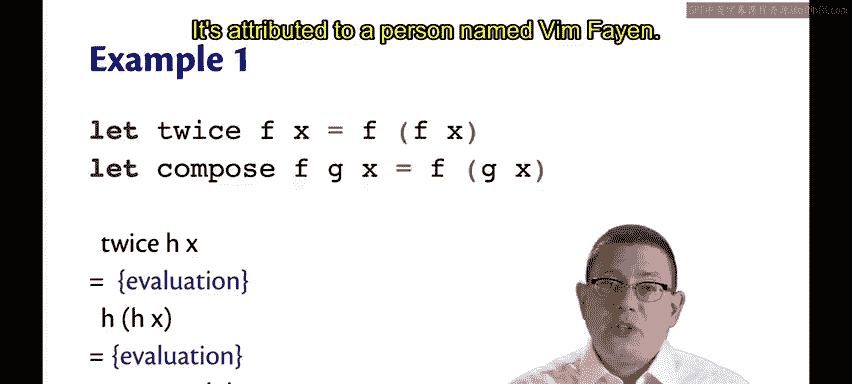
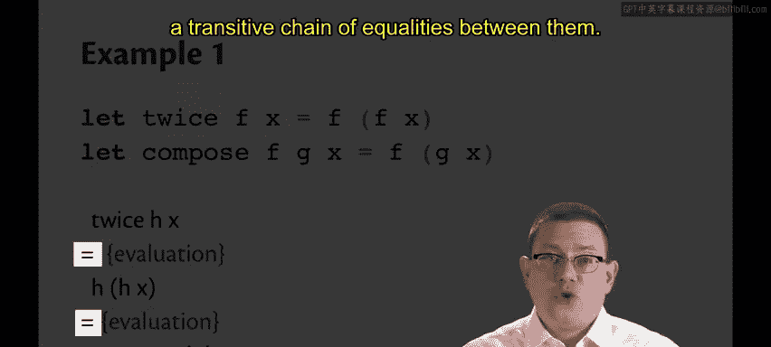
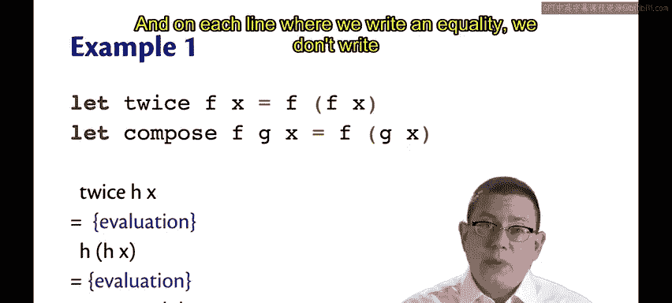
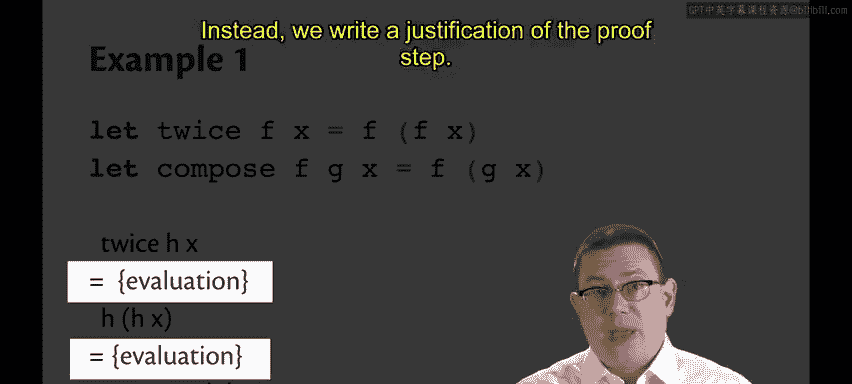
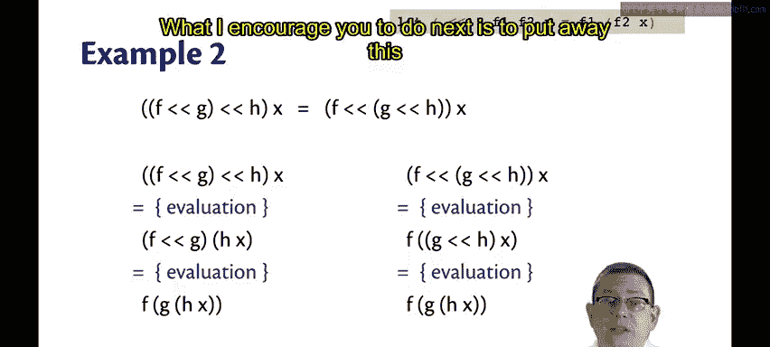
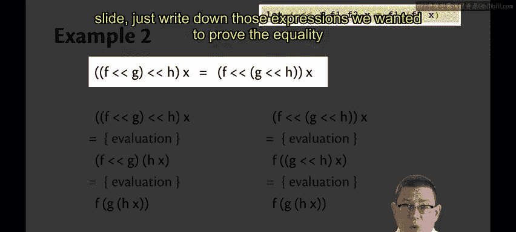
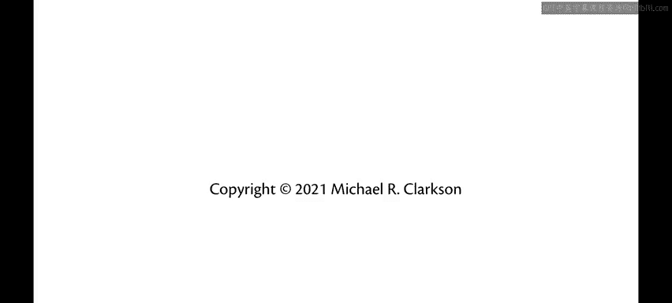

# OCaml编程：6.23：等式推理 🧮

在本节课中，我们将学习一种名为“等式推理”的编程推理方法。这是一种通过表达式相等的概念，来论证两个程序是否等价的技术。我们将通过高阶函数的例子来理解其核心思想，并学习一种结构化的证明格式。

## 高阶函数与等式推理

上一节我们介绍了高阶函数的概念，本节中我们来看看如何运用等式推理来分析它们。

我们曾学习过函数 `twice`，它将其参数函数 `f` 应用到输入 `x` 上两次。我们也学习了函数组合，例如，组合两个函数 `f` 和 `g` 可以定义为：先对 `x` 应用 `g`，再对结果应用 `f`。

这里我们可以注意到一个现象。对于某个函数 `h` 和输入 `x`，`twice h x` 会求值成什么？根据OCaml的求值语义，我们将 `h` 代入 `f`，因此得到 `h (h x)`。假设你将 `h` 同时作为 `compose` 的第一个和第二个参数（即同时作为 `f` 和 `g`）传入，那么 `compose h h x` 也会求值为 `h (h x)`。

因此，涉及 `twice` 和 `compose` 的这两段代码最终会求值成相同的中间表达式。所以，`twice h x` 等于 `compose h h x`。这是因为通过传递性，从 `twice` 到 `h (h x)` 再到 `compose`，所有这些表达式都将求值为相同的值，所以它们相等。



## 结构化证明格式



以下是一种结构化表述上述结论的方式，它是验证领域一种广为人知的证明格式，归功于Vim Fayan。





```
twice h x
= { 根据 `twice` 的定义求值 }
h (h x)
= { 根据 `compose` 的定义求值 }
compose h h x
```

我们从顶部的一段代码开始，以底部的另一段代码结束。在它们之间是一个具有传递性的等式链。等式是凸出的，而代码是缩进的。在每一行写有“=”的地方，我们不写代码，而是写下该证明步骤的理由（用花括号括起）。

请你在学习这部分内容时使用这种证明格式，它是该领域“词汇”的一部分。

## 函数组合的结合律证明

让我们更详细地看看函数组合。我们已经有了 `compose` 函数，让我引入一个二元运算符 `<<` 来表示它（尽管我仍将其读作“组合”）。这个助记符暗示我们从右向左运行：如果你有 `f << g`，那么将其应用于参数 `x` 时，会先通过 `g` 运行 `x`，然后再通过 `f`。

我想证明的定理是：组合操作满足结合律。即 `(f << g) << h` 等于 `f << (g << h)`。

要证明这一点，我们需要使用外延性原理，因为我们试图证明两个函数的相等性。根据外延性，如果两个函数在应用于相同输入时产生相同的输出，那么它们相等。因此，我们需要证明对于所有 `x`，左边的表达式 `((f << g) << h) x` 等于右边的表达式 `(f << (g << h)) x`。

以下是证明过程。我在顶部写下了我们想要证明的命题，并提醒了我们组合的定义。

```
定义: (f << g) x = f (g x)

命题: ((f << g) << h) x = (f << (g << h)) x
```

进行此类证明的一种策略是采用类似两列的格式。我从左边的表达式开始写一列，右边的表达式写另一列。我的目标是让两列最终到达同一个地方，即在每一列中采取一系列等式变换步骤，最终在底部得到相同的表达式。

以下是证明步骤：

```
左边列:                     | 右边列:
((f << g) << h) x           | (f << (g << h)) x
= { 根据组合定义求值 }       |
(f << g) (h x)              | = { 根据组合定义求值 }
= { 再次根据组合定义求值 }   | f ((g << h) x)
f (g (h x))                 | = { 根据组合定义求值 }
                            | f (g (h x))
```

现在，两列都结束于相同的地方 `f (g (h x))`。因此，我证明了最初左右两边的表达式相等。证明完毕（QED）。

我鼓励你接下来合上这份教程，仅写下我们想要证明相等的表达式和组合的定义，然后在不回看的情况下自己完成证明。这将有助于在你的大脑中巩固进行此类证明的思维过程。



## 总结





本节课中我们一起学习了“等式推理”。我们了解到，这是一种通过表达式求值来论证程序等价性的方法。我们通过 `twice` 和 `compose` 的例子直观理解了其思想，并学习了一种结构化的证明格式。最后，我们详细证明了函数组合操作满足结合律，巩固了使用等式推理和外延性原理进行严谨证明的步骤。掌握这种方法，有助于我们更深入地理解程序的行为并验证其正确性。