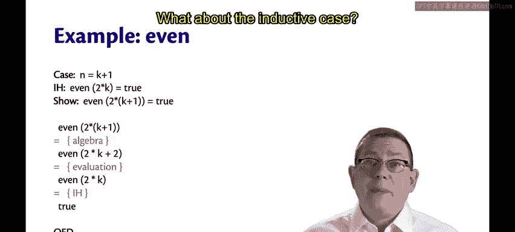
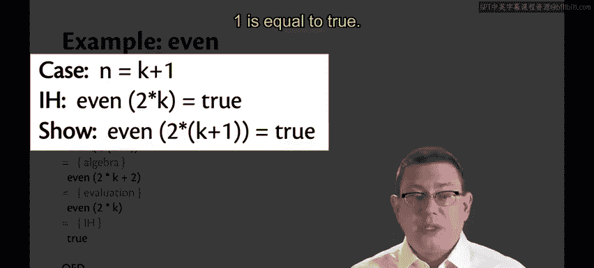
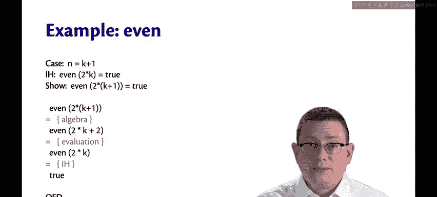

# 康奈尔大学《OCaml编程｜CS3110：OCaml Programming： Correct + Efficient + Beautiful》中英字幕 - P94：-094-Inductive Proofs about Recursive Functions Chap6 Video 24.zh_en - GPT中英字幕课程资源 - BV1Tx4y1s7sP

Now let's prove the correctness of more interesting functions that use recursion。

Here's a function that determines whether a natural number n is even。Of course。

 there are simpler implementations of this， but we'll use this as an example to get us started。

We'll match n with0 and return true on one we'll return false and on any other natural number N。

 well we'll just deduct2 from n and then recursively call even Eventually we get down to0 or 1。

 and then eventually we can decide whether。Okay， so what I'd like to claim here is that for all natural numbers n。

 even of two times n is going to be true。You add in a factor or two。 you do have an even number。 Now。

 you know that from mathematics， of course， but this is a piece of code。

 How do we reason about that piece of code。What we can't exactly do it with the equational reasoning we've seen so far。

 you know， we can do a case analysis and say， well， if n is zero， then it returns true， if n is1。

 it returns false， but what about the arbitrary case where we don't know what n is？

And it just is equal to even of n minus2， and now we have to reason about whether n minus2 is even or not。

We're kind of stuck at that point。What we have here is a case where we want to do a proof about whether a number is even。

 and that reduces to needing to do a proof about whether a smaller number is even。

Hopefully this feels familiar from CS 2800。Because what we need here is proof by induction。

Specifically， weak induction is what we need here as a proof technique。

So you'll recall that to do induction or weak induction on natural numbers。

What we're trying to do is prove a theorem that says for all natural numbers， n。

 some property P holds of n。And the proof technique we're going to use is induction on N。

And there will be two cases in this group， a base case， and an inductive case。In the base case。

We are going with the smallest natural number， which is 0。

 and we're going to show that the property P holds of that natural number 0。In the inductive case。

 we're going to work with a natural number， I'm going to call it K here。

 sometimes people will say M or n prime， I find those difficult to understand in the midst of a video or lecture so K is nicely different than n so you can hear the difference in pronunciation。

😡，So we're going to say that in the inductive case， we're working with a natural number K plus 1。

 that's what n is equal to in that。And we need to show。That the property P holds of K plus 1。

And we get to assume that the property P holds of that smaller natural number， K。

So if we can show those two things， the base case and the inductive case。

Than were allowed to conclude by induction that that property P holds of all natural numbers。

So I want to ask you once more to use this proof format， at least for 3110。And by that。

 I mean explicitly state what the property P is that you're trying to prove。😡。

Explicitly state what the base case is。And explicitly say all of that information about the inductive case。

 What the smaller number is。 think in this case， it's K。How it's related to the bigger number N。

Exactly what the inductive hypothesis is。And exactly what you're trying to show。

Doing this will get you in the habit of correctly identifying the induction hypothesis。

 and I find that's one of the errors that many people make as they are becoming more proficient at induction is getting that inductive hypothesis wrong。

 so it might seem like a little bit of bookkeeping that you need to do it's worth your while to do that bookkeeping it will keep you on the straight and narrow path for using induction。

Let's do an example of this， let's prove that claim about our function even。

we were trying to prove a property P holds， and that property is that for any number n。

 even of two times n is equal to true。There's a base case， which is where n is0。In that case。

 we want to show that property P instantiated on zero。

So we want to show that even of two times zero is equal to true。

Now we go into our equational reasoning。 We start with the left hand side expression。

 even of two times 0。 What does that evaluate to， Why I'm skipping a couple steps of evaluation here。

 I don't need to show all of them。 Remember， we're trying to be rigorous。

 but not 100 per formal here。I know that2 times zero will evaluate to zero。

 and I know that even by its definition， when applied to zero。

 it matches against zero and returns true。So that reduces to truth。Okay， that's it for the base case。

What about the inductive case， My natural number N。

 I'm going to express as a smaller natural number K plus  one。

The inductive hypothesis is the property P instantiated on that smaller number。

 so I get to assume that even of two times k equals true。

And I want to show the property P on the larger number， which is K plus1。

So I want to show that even of two times k plus 1 is equal to true。

I'll start on the left hand side， even if two times k plus1。Well， how is that going to evaluate。

 we know how algebra evaluates， we know how numbers work。

That's not always the same as how Ocal ingers work right。

 We know that Ocal integers are only 63 bits。 we know that they can overflow。

 but we're going to ignore those corner。We wouldn't have to。

 it is possible to do formal reasoning about 63 bit integers。

 it's just not something we're going to tackle here because it's harder。

So I'm going to justify this by algebra， not exactly by evaluation， because I know that by algebra。

 this is how numbers ought to work if they weren't limited in sizeizing it。So by algebra。

2 times k plus1 is going to be 2 times k plus2 according to the definition of even。

 that will evaluate even of two times k why because even is going to pattern match against the arguments that's passed in it's not going to be0 or1 because k had to be a natural number here right So K was at least zero。

 therefore the value being passed even here is at least two。

So that's going to evaluate to its argument minus2， that's how even was defined。

So now we have even of two times k。Well， now we have the inductive hypothesis。

 or specifically the left hand side of the inductive hypothesis。

And we know that according to the inductive hypothesis， even if two times k is equal to true。

So I'll take one more step， which is to say that even of two times k equals true by the induct。

And now I'm done because I've shown that the left hand side of what I wanted to show is equal to the right。

And furthermore， I'm done with the entire inductive proof at that point because that was the induct。

So QED， we have now proved that even always returns true when applied to something that you've doubled。

