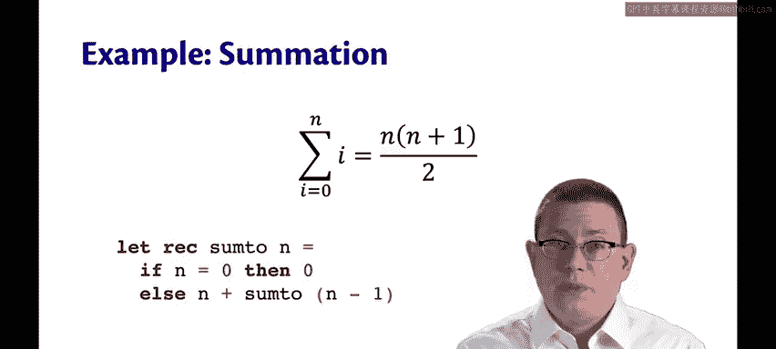
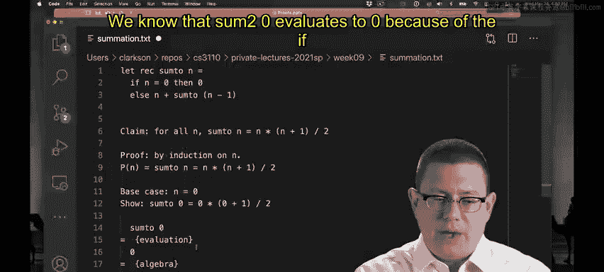
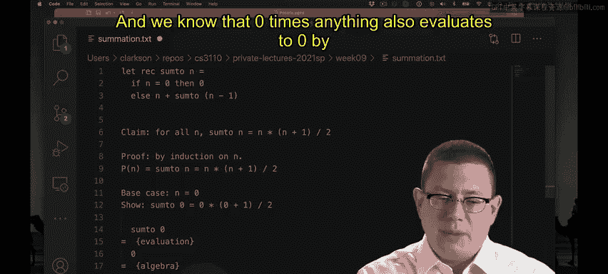
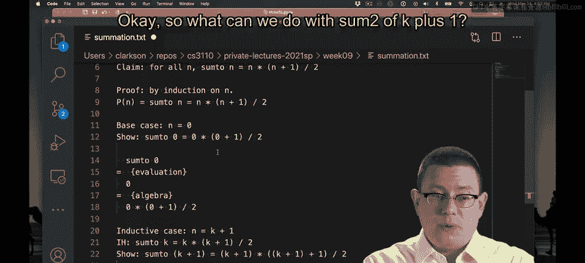
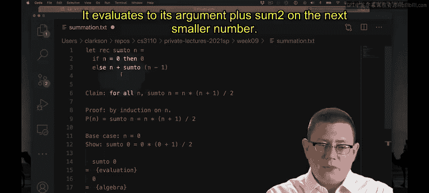
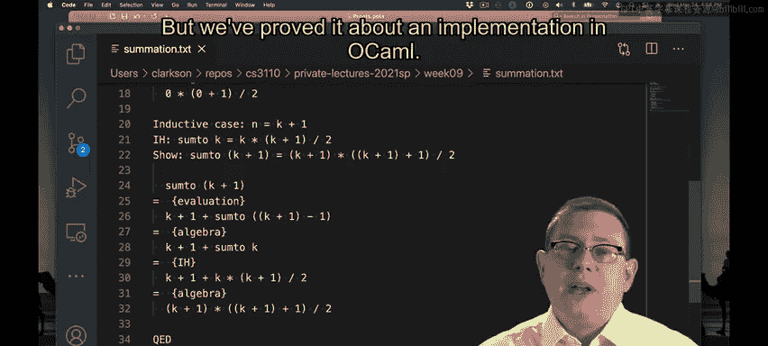
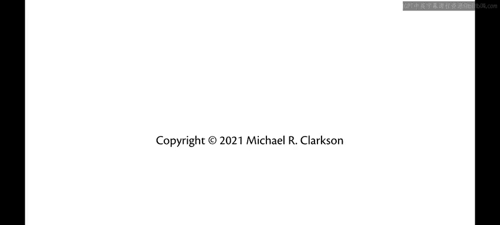

# 康奈尔大学《OCaml编程｜CS3110：OCaml Programming： Correct + Efficient + Beautiful》中英字幕 - P95：-095-Example Proof_ Summation Chap6 Video 25.zh_en - GPT中英字幕课程资源 - BV1Tx4y1s7sP

Let's do another example of an inductive proof about a recursive program。

So you'll recall that the sum from I equals0 to n of I actually has a closed form expression as n times n plus 1 over 2。

Let's do something similar with code， with a program。

So we could express the summation on the left hand side here as a recursive function。

 I'll call it sum2 of n， so this sums up the values of all integers from0 up to n。

 and it doesnt recursively by saying well first if is equals 0， then just return0。

 otherwise return n plus a recursive call on n minus1。So we're going from the top down。

 not the bottom up。Well， of course， sum to a n ought to be equal to n times n plus1 over 2。

Let's prove it。So there's the code that we want to do the proof about。

 as well as the claim that we want to prove。So let's do this proof。 it's going to be by induction。

So I'm starting off my proof by induction， I'm stating what the property P is that I want to show holds of all natural numbers at。

😡，First， we'll do the base case。Okay， the base case was really easy to do。

 we know that sum to0 evaluates to0 because of the if expression up here that returns0。

 and we know that zero times anything also evaluates to zero by algebra。

Next， let's do the inductive case。Now let's pause here。

 make sure we get the inductive hypothesis right， This is where I see people mess up the most。

So we want to take that property P and instantiate it on the smaller natural number K。

So that means we take P here and everywhere we see in and it replace it with K。On the other hand。

 we want to show that that property P holds of the larger natural number K plus 1。Okay。

 so what can we do with sum2 of k plus1。 Well， does the function tell us anything。

If we pass it in and it's equal to0 then we turn zero， otherwise， well。

 that's not going to be equal to zero right because we're taking a natural number k。

 which has to be at least zero and adding one to it， so that's at least one。Therefore。

 we're definitely going to be in the else branch， so we know how that piece of sum evaluates to its argument plus sum2 on the next smaller number。

Okay， we'll pause there。 We've taken a step of evaluation， and we've simplified by algebra。

 and now we have a simpler expression that involves sum2 k。 Now we're stuck there。

 We don't know what K is。 we don't know how to evaluate that。

 but we do have our inductive hypothesis， which says what sum2 k is K times k plus1 over 2。

Let's use that。Next， if we manipulate these terms a little。

 we'll see that it does reduce to the right hand side of what we wanted to show by algebra。

 I won't bore you with those manipulations， I'm sure you can work them out yourself。

And that finishes off our proof by induction QE D， we're done。

So now we've shown that that piece of code evaluates the way that we learn from CS2800 or that we learn from mathematics in terms of the closed form formula it should produce。

 but we've proved it about an implementation in OAL。

