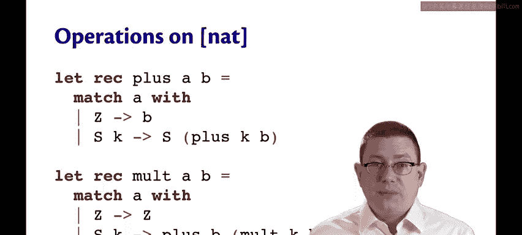
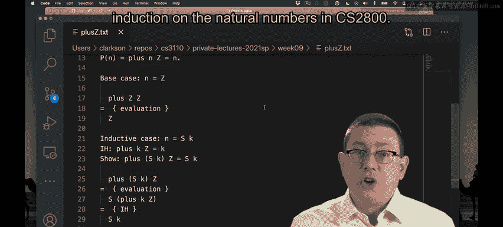
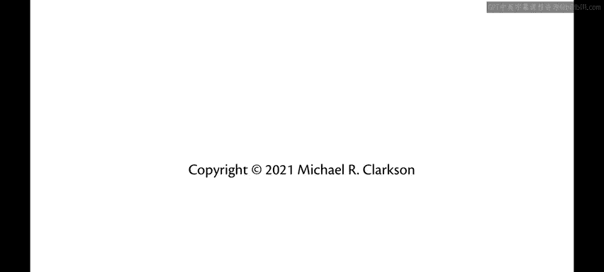

# 康奈尔大学《OCaml编程｜CS3110：OCaml Programming： Correct + Efficient + Beautiful》中英字幕 - P97：-097-Induction on an ADT for Natural Numbers Chap6 Video 27.zh_en - GPT中英字幕课程资源 - BV1Tx4y1s7sP

So far， we've been doing induction on natural numbers。

Which has enabled us to reason a little bit about recursive programs on OamMl's ins。

But let's try to do something more sophisticated next。

Let's try to do proofs about programs involving variants or algebraic data types。

We'll start off on familiar ground in a way by coat up a variant to represent natural numbers。

That will enable us to see how the inductive proof techniques we've been using carry over to variant。

So here's my type for natural numbers， I'm going to represent them in unary。😡。

So I'll have two constructors Z and S Z stands for0。

 it's meant to represent the number0 and S stands for successor。

It carries along another natural number with it。And it represents the number that is one more than that number that is carried。

So the abstraction function here is that the number of s's is the natural number that's being represented in unary。

So z is0， Sz is 1， SS Z is 2， and so forth and so on。

Now we can code up recursive functions that implement the standard mathematical operations。

 they just have to do it in unary。So here， for example。

 is an implementation of the plus operation on our typeNe。😡，To add together two naturals， A and B。

 we can implement it by pattern matching。So you could choose which one you want to pattern match on here。

 I'm going to do a match a， if it's0， well then we're trying to add0 into some other number。

 well that should leave the other number unchanged， so we'll just return the other number。

 which is B。😡，But if a is the successor of some other natural number， let's call it K。

Then we'll recursively compute the result of calling plus on that smaller natural number K along with B。

😡，And then we'll add one， we'll take the successor of the return value。

So this is a correct but slow implementation of addition。

You can also implement all the other operations， some of them are trickier to implement than others。

 here's an example of how to implement multiply， I won't walk us through this one other than to point out it's basically doing the same thing plus just repeatedly adds1 Mt just repeatedly adds B。

Now， if we want to do induction on one of these variants on a value of this variant type。

 how do we do it， You're familiar with how to do induction on naturals when there are numbers。

 But how do you do when they're represented this way with。Code。It's really no different。

 Take a look at the proof format for induction on net。In the base case。

 we start off with n equal to z， which of course represents zero。

 it's the same thing as we did before with a base case where we were looking at a natural number that was0。

And we try to show that the property P holds of Z。In the inductive case， once more， just like before。

 we're looking at a natural number， which is one more than another natural number。

So here the way we express that is that n is equal to Sk。The inductive hypothesis is P instantd on K。

 and we want to show。That P holds when instantd on the successor of K， that is one more than K。Okay。

 so the proof format really doesn't change at all。We're just using different notions of what the base values are and what it means to be one bigger than another。

So let's prove a theorem about this， let's prove that if the second argument to plus is Z。

 then that just returns n its first argument。😡，Now why did I pick it this way。

 why did I go for the second argument being Z well it's because if the first argument is Z it's a trivial proof right in that case just by evaluation we automatically return the second。

😡，Okay but this one is more interesting right because we can't take a step of evaluation of plus in Z here because we don't know what n is Look back at this implementation here。

 the first argument is what we're talking about immediately we pattern match on that first argument and we don't know whether it's going to be zero or greater than0。

😡。

So we're going to need an inductive proof here。Okay。

 I've put the code for nett and Flss in here and the claim that we're trying to show。

 We're going to do this by induction。The base case is really easy。

We instantiate that property P on Z， so we're trying to show that plus Zz equals z。

Well we can take just one step of evaluation of plus Z that of course pattern matches on its first argument and returns its second argument。

 so we know that that evaluates to Z and we're done with that case。For the inductive case。

 I've set up my inductive hypothesis and what I want to show here。All right， let's do that。

Let's pause here。 We know how to evaluate plus a little bit in this case because we do know that that first argument there is not Z right。

 it can't be Z， it's actually got a match successor of K here。

 so we know what that's going to evaluate to it's going to be the successor of the recursive call。

Now we can't step the evaluation of+ again there because now we're down to a natural number K that we don't know whether it's0 or S。

But the inductive hypothesis applies so we can rewrite the plus Kz here as。

And that's what we wanted to show。 so we're done QED。

The takeaway here is that we can do induction on algebraic data types in very much the same way that you've learned to do induction on the natural numbers in CS2800。

