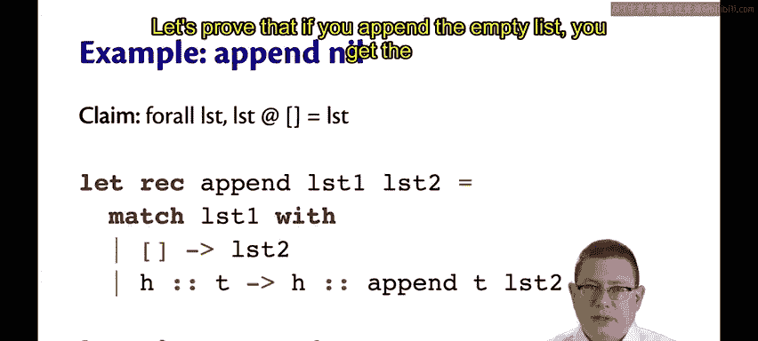
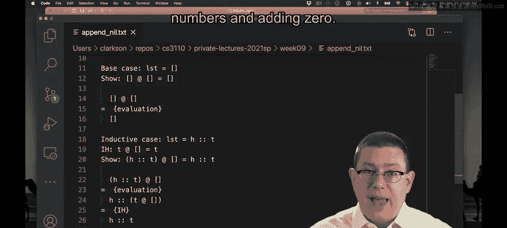
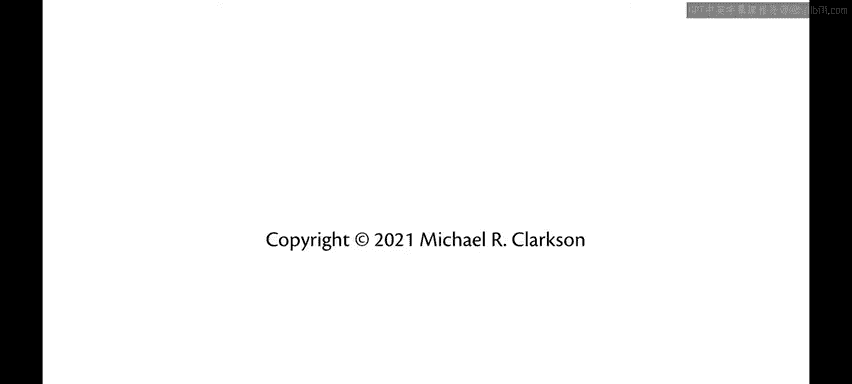

# OCaml编程：6.28：列表归纳法 🧾

在本节课中，我们将学习如何对列表（List）这种数据类型进行归纳证明。上一节我们介绍了对自定义自然数类型（NAP）的归纳法，本节中我们来看看如何将同样的逻辑应用到列表上。

列表归纳法的结构与之前所学的非常相似。

## 证明结构

归纳证明的**基础情况**是空列表。这类似于自然数归纳法中的零（Z构造器）或数学自然数中的数字0。我们需要证明性质 **P** 在基础情况（即空列表）上成立。

**归纳情况**则考虑如何构造一个“更大”的列表。在自然数中，“更大”意味着加一；在列表中，“更大”意味着在列表头部添加一个新元素。因此，在归纳情况下，列表的形式是 `h :: t`，其中 `t` 是原类型中更小的元素（即尾部）。归纳假设是性质 **P** 在这个更小的值 `t` 上成立。我们需要证明性质 **P** 对整个列表 `h :: t` 也成立。

## 实践：证明一个性质



让我们运用这个结构来证明一个性质：将一个列表与空列表进行 `append` 操作，会返回原列表本身。

以下是 `append` 操作的源代码（以中缀运算符形式表示）以及我们要证明的命题：

```ocaml
let rec ( @ ) lst1 lst2 =
  match lst1 with
  | [] -> lst2
  | h :: t -> h :: (t @ lst2)

(* 要证明的性质：对于所有列表 lst, lst @ [] = lst *)
```

我们将通过归纳法来证明此性质。

### 基础情况

基础情况针对空列表 `[]`。我们需要证明 `[] @ [] = []`。

这很容易证明，只需一步求值：`append` 运算符会对其左参数进行模式匹配，发现它是空列表，于是直接返回其右参数（在这里也是 `[]`）。因此等式成立。

### 归纳情况

现在考虑归纳情况。列表形式为 `h :: t`，其中 `t` 是一个更小的列表。我们需要证明 `(h :: t) @ [] = h :: t`。

以下是证明步骤：



1.  根据 `append` 的定义，当左参数是 `h :: t` 时，结果为 `h :: (t @ [])`。因此，`(h :: t) @ []` 求值得到 `h :: (t @ [])`。
2.  此时，我们无法直接对 `t @ []` 进一步求值，因为不知道 `t` 的具体形式。
3.  这时，我们的归纳假设就派上用场了。归纳假设是性质 **P** 对更小的列表 `t` 成立，即 `t @ [] = t`。
4.  将归纳假设应用到表达式 `h :: (t @ [])` 中，用 `t` 替换 `t @ []`，我们得到 `h :: t`。

这正是我们在归纳情况下想要证明的结果。证明完成。

## 与自然数归纳法的对比

接下来，我们可以做一个有趣的对比：将刚才的列表归纳证明，与之前对自然数证明 `n + 0 = n` 的过程进行比较。

以下是两个证明的并排对比：

| 自然数证明 (`n + 0 = n`) | 列表证明 (`lst @ [] = lst`) |
| :--- | :--- |
| 运算符 `+` 对第一个参数进行模式匹配。 | 运算符 `@` 对第一个参数进行模式匹配。 |
| 基础情况（`Zero`）：返回第二个参数。 | 基础情况（`[]`）：返回第二个参数。 |
| 递归情况（`Succ n`）：调用 `n + m`。 | 递归情况（`h::t`）：调用 `t @ lst2`。 |
| 证明：`n + 0 = n`。 | 证明：`lst @ [] = lst`。 |
| 证明结构：归纳法。 | 证明结构：归纳法。 |
| 证明步骤（归纳情况）：求值后应用归纳假设。 | 证明步骤（归纳情况）：求值后应用归纳假设。 |

可以看到，两个证明的结构完全一致，甚至归纳情况中的证明步骤（先求值，再应用归纳假设）也完全相同。这本质上是在两种不同的数据类型（一次是自然数 `Nat`，另一次是列表 `list`）上进行的同一个证明。

## 总结



本节课中我们一起学习了如何对列表进行归纳证明。我们首先回顾了归纳证明的一般结构（基础情况和归纳情况），然后将其具体应用到列表上，证明了 `lst @ [] = lst` 这一性质。最后，通过对比列表归纳与自然数归纳的证明过程，我们发现其核心逻辑是相通的，这体现了归纳法作为证明技巧的强大通用性。掌握这种对递归数据结构的归纳推理方法，对于理解和验证函数式程序的正确性至关重要。