# OCaml编程：6.29：列表长度与追加的归纳证明示例 🧮

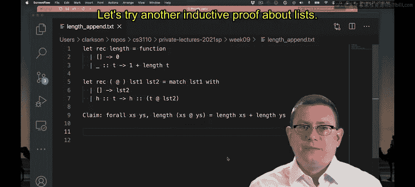

在本节课中，我们将学习如何对列表进行归纳证明。具体来说，我们将证明一个关于列表长度和列表追加操作的定理：两个列表追加后的长度，等于这两个列表各自长度的和。

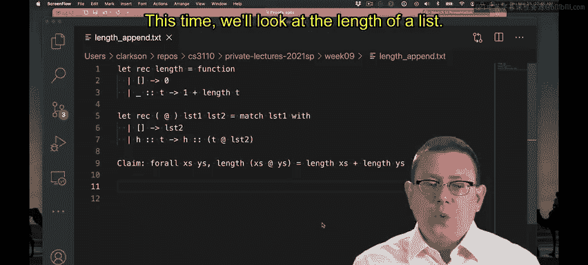

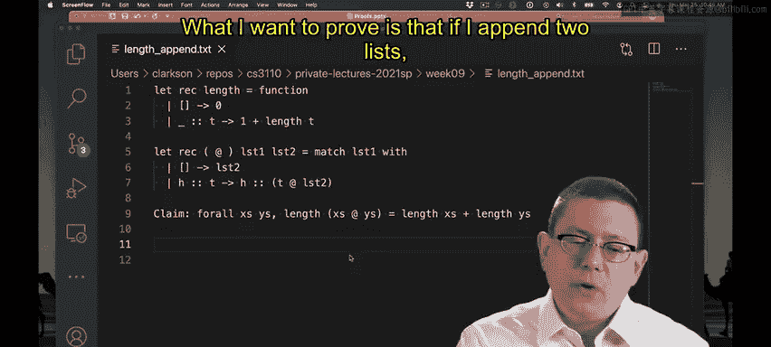

## 概述

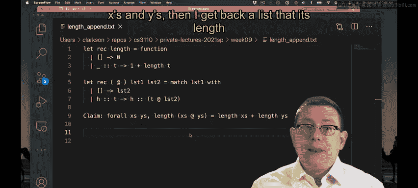

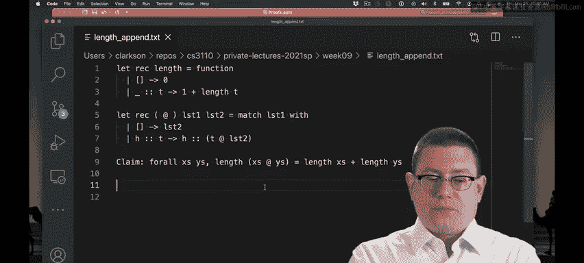

我们将要证明的定理是：对于任意两个列表 `xs` 和 `ys`，`length (xs @ ys) = length xs + length ys` 成立。这可以理解为长度操作在特定方式下对追加操作具有分配律。

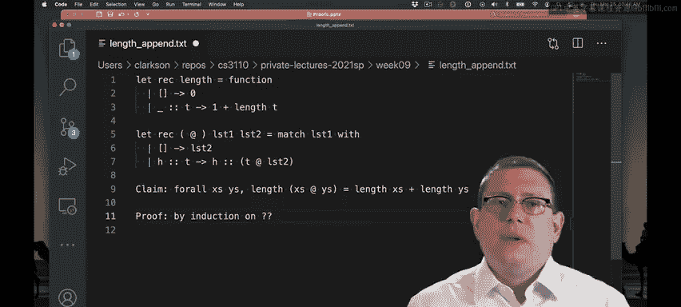

为了证明这个定理，我们将采用归纳法。但首先需要决定对哪个变量进行归纳。一个关键的线索是观察 `@`（追加）操作符的模式匹配方式：它对其左参数进行模式匹配。这通常意味着，在进行关于追加操作的归纳证明时，我们希望对作为该操作符左参数的变量进行归纳。在本例中，左参数是 `xs`，因此我们将对 `xs` 进行归纳。

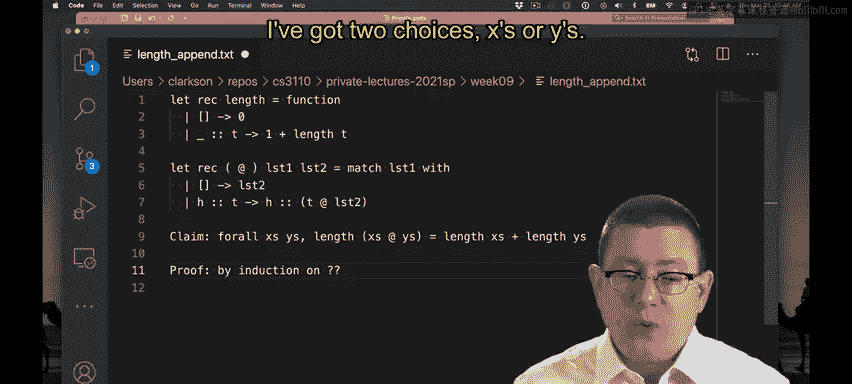

## 定义性质 P

随着证明的深入，明确我们要证明的命题以及归纳性质 `P` 变得愈发重要。由于我们对 `xs` 进行归纳，性质 `P` 应该是关于 `xs` 的一个命题，即原命题中剩余的部分：对于所有的 `ys`，`length (xs @ ys) = length xs + length ys` 成立。

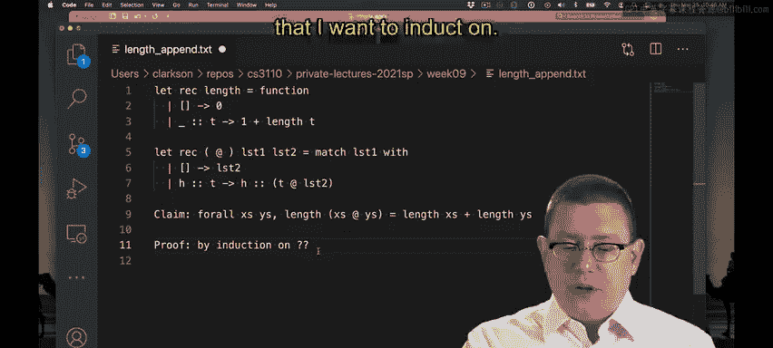

因此，我们将证明：`∀ ys, length (xs @ ys) = length xs + length ys`。

## 基础步骤

首先，我们处理基础情况，即 `xs` 为空列表 `[]` 的情况。

我们需要证明：`∀ ys, length ([] @ ys) = length [] + length ys`。

以下是证明步骤：

1.  根据 `@` 操作符的定义，当左参数为空列表时，`[] @ ys` 直接返回 `ys`。因此，等式左边简化为 `length ys`。
2.  根据 `length` 函数的定义，`length []` 返回 `0`。因此，等式右边简化为 `0 + length ys`。
3.  根据加法运算，`0 + length ys` 等于 `length ys`。

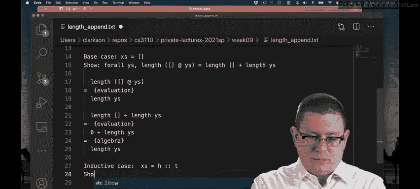

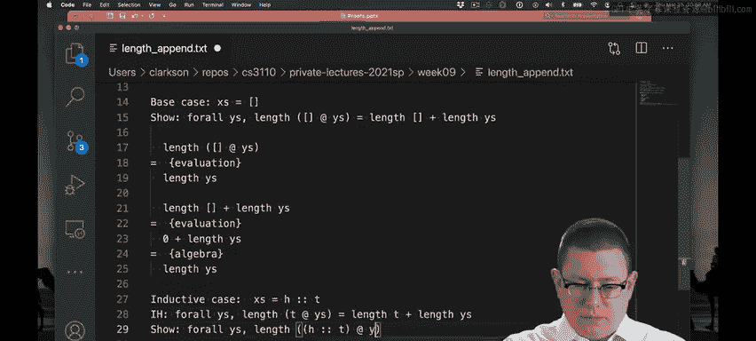

至此，我们证明了在基础情况下，等式左右两边相等，均为 `length ys`。基础步骤完成。

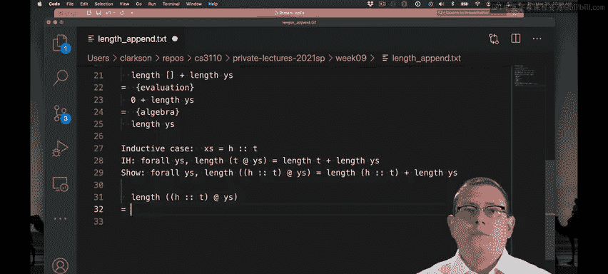

## 归纳步骤

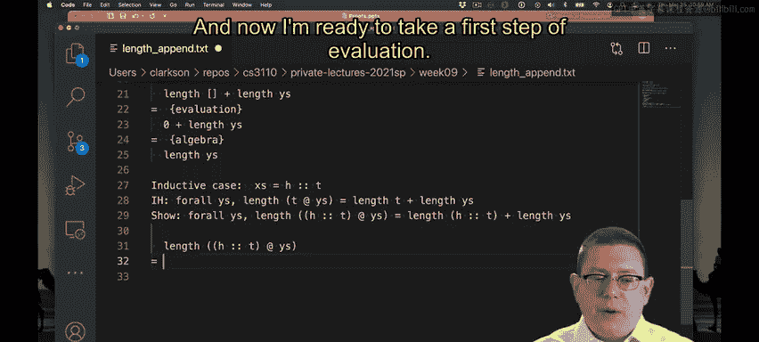

现在，我们进入归纳步骤。我们假设归纳假设（IH）对某个列表 `t` 成立，即：
`∀ ys, length (t @ ys) = length t + length ys`

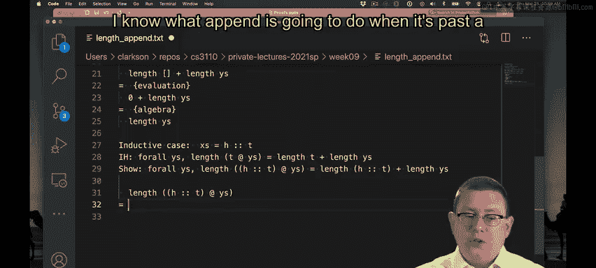

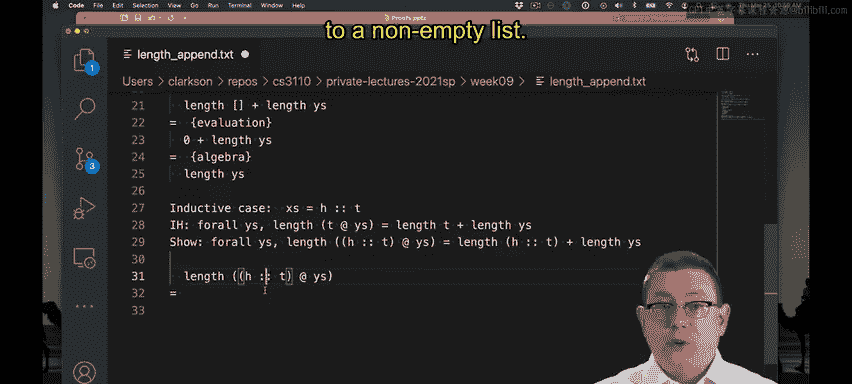

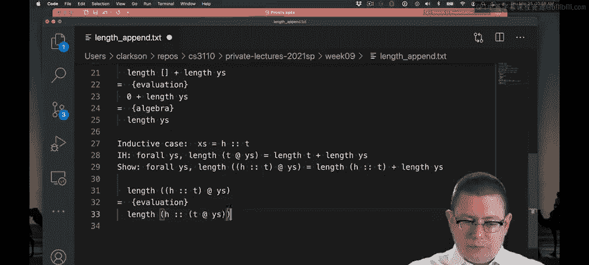

我们需要证明，对于由头元素 `h` 和尾列表 `t` 构成的列表 `h :: t`，性质 `P` 也成立。即，我们需要证明：
`∀ ys, length ((h :: t) @ ys) = length (h :: t) + length ys`

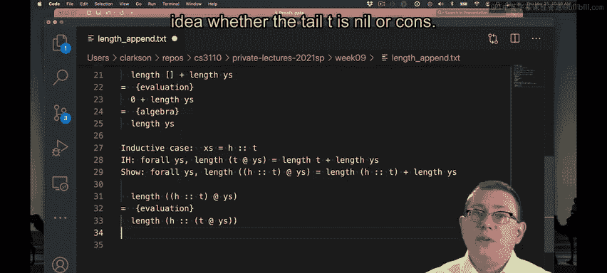

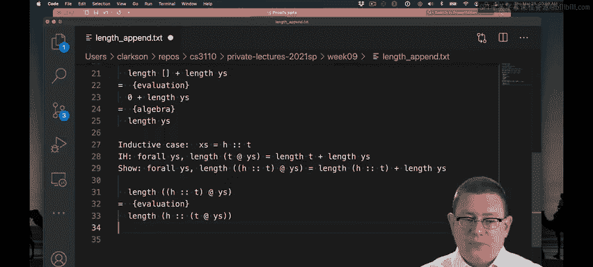

以下是证明过程：

1.  **处理等式左边**：根据 `@` 操作符的定义，`(h :: t) @ ys` 会求值为 `h :: (t @ ys)`。因此，等式左边变为 `length (h :: (t @ ys))`。
2.  根据 `length` 函数的定义，`length (h :: (t @ ys))` 会求值为 `1 + length (t @ ys)`。
3.  此时，表达式 `length (t @ ys)` 出现了。这正是我们的归纳假设（IH）中左边部分的形式。根据归纳假设，我们可以将其替换为 `length t + length ys`。
4.  经过替换，等式左边最终简化为 `1 + (length t + length ys)`。

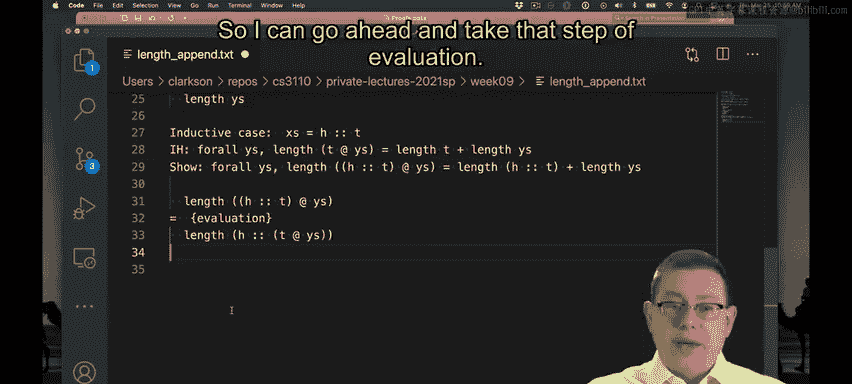

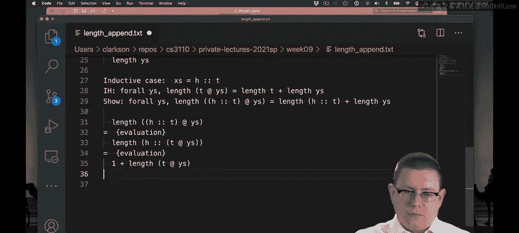

5.  **处理等式右边**：根据 `length` 函数的定义，`length (h :: t)` 求值为 `1 + length t`。因此，等式右边变为 `(1 + length t) + length ys`。
6.  根据加法的结合律，`(1 + length t) + length ys` 等于 `1 + (length t + length ys)`。

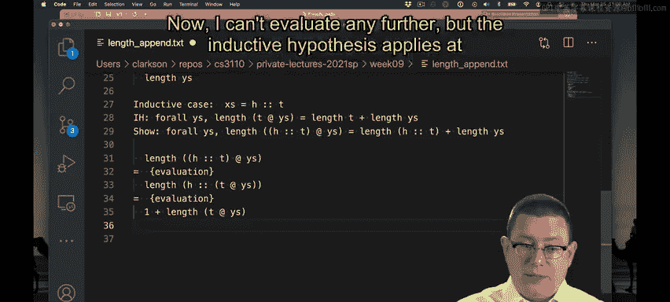

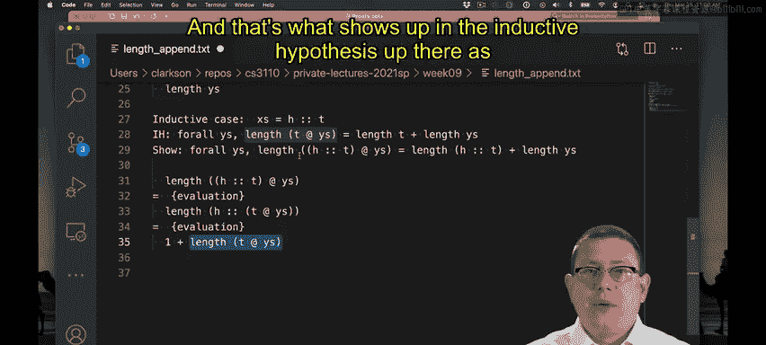

现在，等式左边和右边都化简为相同的表达式 `1 + (length t + length ys)`。因此，我们证明了在归纳步骤中，等式也成立。

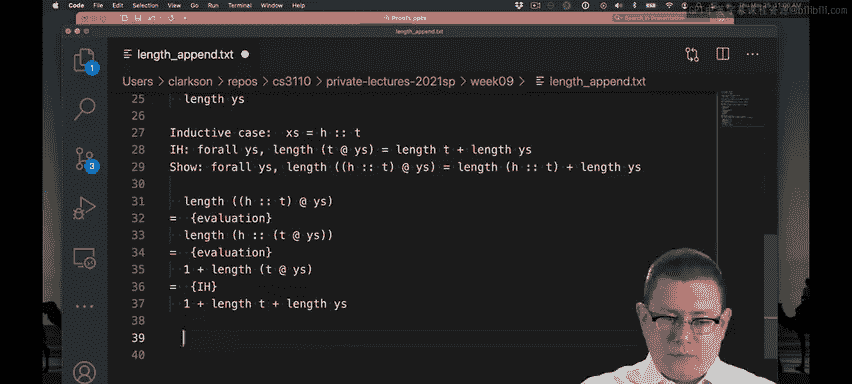

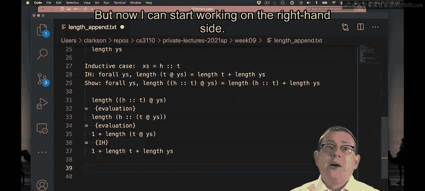

## 总结

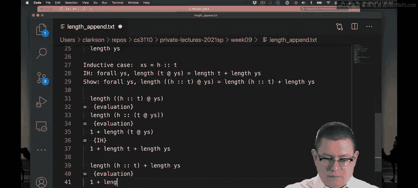

本节课中，我们一起学习了如何对列表进行归纳证明。我们通过一个具体的例子，证明了列表长度函数对追加操作满足分配律：`length (xs @ ys) = length xs + length ys`。

证明的关键步骤包括：
*   **选择归纳变量**：根据操作符的模式匹配特性，选择对 `@` 的左参数 `xs` 进行归纳。
*   **明确定义性质 P**：将定理表述为关于归纳变量 `xs` 的性质：`∀ ys, length (xs @ ys) = length xs + length ys`。
*   **完成基础步骤**：证明当 `xs` 为空列表 `[]` 时，性质成立。
*   **完成归纳步骤**：
    *   假设性质对较小的列表 `t` 成立（归纳假设）。
    *   证明对于列表 `h :: t`，性质也成立。这通常涉及根据函数定义进行求值化简，并巧妙地应用归纳假设。

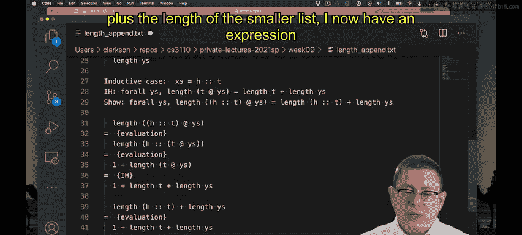

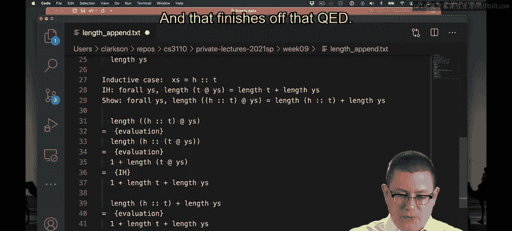

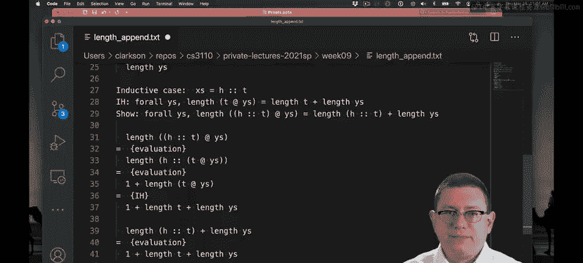

这个证明展示了归纳法在验证递归函数性质时的强大能力，是理解和构建正确程序的重要工具。QED（证明完毕）。