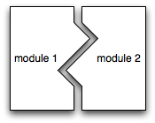

# 第九讲：模块

我们一直在构建非常小的程序。当一个程序足够小，我们可以一次性记住程序的所有细节。真实的应用程序比你可能编写或参与开发的任何程序大 100 到 10000 倍；它们太大且太复杂，无法一次性记住所有细节。它们也是由多个作者编写的，否则将会花费太长时间。构建大型软件系统需要我们迄今为止尚未讨论的技术。

管理大型软件复杂性的一个关键解决方案是*模块化编程*：代码由许多不同的代码模块组成，这些模块是分开开发的。这使得不同的开发人员可以负责系统的离散部分，并设计和实现它们，而无需理解所有其他部分。然而，要有效地从模块构建大型程序，我们需要能够编写我们可以确信*在与程序的其余部分隔离*时是正确的代码模块。与其在开发代码模块时必须考虑程序的每一部分，我们需要能够使用*局部推理*：即仅仅考虑模块和它需要满足的与程序的其余部分相关的合同。如果每个人都做好了自己的工作，分开开发的代码模块可以被连接在一起形成一个可运行的程序，而不需要每个开发人员都理解团队中每个其他开发人员所做的一切。这就是*模块化编程*的理念。



因此，要构建可运行的大型程序，我们必须使用*抽象*来使得思考程序变得可管理。抽象简单来说就是去除细节。一个写得很好的程序具有这样的特性，我们可以抽象地思考它的组件（比如函数），而不必关心这些组件是如何实现的所有细节。

模块通过给出它们应该做什么的*规范*来进行抽象。一个好的模块规范是清晰的、可理解的，并提供足够的关于模块做什么的信息，以便客户成功使用它。这种抽象使程序员的工作变得更容易；即使只有一个程序员在开发一个中等规模的程序，这也是有帮助的，而当有多个程序员时则至关重要。

语言通常包含直接支持模块的机制。OCaml 就是其中之一，我们很快就会看到。一般来说，模块规范称为*接口*，它向客户提供有关模块功能的信息，同时隐藏*实现*。面向对象的语言支持使用*类*进行模块化编程。Java 的`interface`构造是指定类接口的机制之一（但绝非唯一的机制）。Java 的`interface`向客户端提供了任何实现它的类可用功能的信息，而不会透露实现的细节。但即使是类的公共方法也构成了更一般意义上的接口——模块能做什么的抽象描述。

一旦我们定义了一个模块及其接口，与该模块一起工作的开发人员承担了不同的角色。大多数开发人员可能是模块的*客户*，他们理解接口但不需要理解模块的实现。负责模块实现的开发人员是*实现者*。模块接口是客户和实现者之间的*合同，定义了双方的责任*。合同非常重要，因为当出现问题时，它们帮助我们隔离问题的根源。

将客户和实现者都纳入模块接口设计是一个很好的实践。仅由其中一方设计的接口可能存在严重缺陷，因为双方可能对最终产品的外观有不同看法，而这些观点可能不一致。因此，对合同的相互同意至关重要。在全局模块结构和接口方面**提前**进行深思熟虑也很重要，甚至在进行任何编码之前，因为随着开发的进行和更多的代码依赖于接口，改变接口变得越来越困难。最后，在规范中完全明确也很重要。在 OCaml 中，*签名* 是编写明确规范的一部分，但绝不是全部。虽然超出了本课程的范围，但接口描述（或定义）语言（IDL）用于以语言无关的方式指定接口，以便不同的模块甚至不需要用相同的语言实现。

在模块化编程中，模块仅通过其声明的接口使用，语言可能有助于强制执行。即使客户端和实现者是同一个人，这也是正确的。模块将系统设计和实现问题解耦为可以基本独立进行的任务。当模块仅通过其接口使用时，实现者有灵活性更改模块，只要模块仍然满足其接口。接口确保模块与其客户端*松耦合*。松耦合使实现者和客户端能够基本独立地工作，这也意味着一个代码模块的更改不太可能需要更改其他模块。

## 抽象机制

我们将关注两种抽象：

+   *通过参数化进行抽象*。与其编写提及计算要发生的特定值的代码，我们编写函数。函数描述了在适当类型的所有可接受值上运行的计算。因此，具体值的细节被移除。参数化类型是通过参数化进行抽象的另一个例子，尽管在那里参数是类型而不是值。

+   *通过规范进行抽象*。一个设计良好的规范消除了关于实际类型或值的不必要细节。规范充当实现者和用户（客户端）之间的契约，使双方的工作更简单，使代码更具可扩展性和可维护性。这个想法在面向对象的世界中也被称为*信息隐藏*或*封装*。

## 模块

在 OCaml 中，模块由具有以下语法的`module`声明实现：

```
module *ModuleName* = struct *implementation* end

```

模块名*ModuleName*必须以大写字母开头。

模块将命名空间划分，因此在名为`Module`的模块的实现中绑定的任何符号`x`在模块的实现之外必须通过限定名称`Module.x`引用（除非命名空间已经使用`open`暴露）。

模块的实现可以包含`type`定义、`exception`定义、`let`定义、`open`语句以打开其他模块的命名空间、`include`语句以包含其他模块的内容以及`signature`定义。

像结构一样，OCaml 中的模块（以及下面讨论的签名）不是一等对象。这与函数是一等对象的情况形成对比。模块不能作为参数传递给函数，也不能作为函数的结果返回。

## 签名

要成功开发大型程序，我们需要的不仅仅是能够将相关操作组合在一个模块中的能力。我们需要能够使用编译器强制执行不同模块之间的分离，以防止发生不良事件。签名是强制执行这种分离的机制。

签名声明具有以下语法：

```
module type *SIGNAME* = sig *definitions* end

```

按照惯例，签名名称*SIGNAME*全部使用大写字母。签名的定义声明了任何实现它的模块必须提供的一组类型和值。签名的定义可以是`type`定义，`val`定义来定义名称的类型签名，以及`exception`定义来指定模块可以引发的异常。

实现特定签名的模块在其定义中指定该签名的名称，在模块名称之后用<cod>分隔。签名必须在模块定义之前定义。

```
module *ModuleName* : *SIGNAME* = struct *implementation* end

```

实现签名的模块必须为签名中的抽象类型指定具体类型，并提供签名中的所有声明。除非签名公开定义，否则只有抽象类型在模块外部可访问。只有签名中的声明在模块外部可访问（例如，在实现中定义但不在签名中定义的函数是不可访问的）。

例如，这是一个简单集合数据抽象的签名，以及使用列表实现该接口的两个实现：

```
(* Set data abstraction with union and intersection *)

module type SET = sig
  type 'a set
  val empty : 'a set
  val mem : 'a -> 'a set -> bool
  val add : 'a -> 'a set -> 'a set
  val rem : 'a -> 'a set -> 'a set
  val size: 'a set -> int
  val union: 'a set -> 'a set -> 'a set
  val inter: 'a set -> 'a set -> 'a set
end

(* Implementation of sets as lists with duplicates *)

module Set1 : SET = struct
  type 'a set = 'a list
  let empty = []
  let mem = List.mem
  let add x l = x :: l
  let rem x = List.filter ((<>) x)
  let rec size l = 
    match l with
    | [] -> 0
    | h :: t -> size t + (if mem h t then 0 else 1)
  let union l1 l2 = l1 @ l2
  let inter l1 l2 = List.filter (fun h -> mem h l2) l1
end

(* Implementation of sets as lists without duplicates *)

module Set2 : SET = struct
  type 'a set = 'a list
  let empty = []
  let mem = List.mem
  (* add checks if already a member *)
  let add x l = if mem x l then l else x :: l 
  let rem x = List.filter ((<>) x)
  let size = List.length (* size is just length if no duplicates *)
  let union l1 l2 = (* check if already in other set *)
    List.fold_left (fun a x -> if mem x l2 then a else x :: a) l2 l1
  let inter l1 l2 = List.filter (fun h -> mem h l2) l1
end

```

这是另一个栈抽象的示例。

```
(* A specification of an immutable stack of elements of type 'a. *)

module type STACK = sig
  type 'a stack
  exception EmptyStack
  val empty : 'a stack
  val is_empty : 'a stack -> bool
  val push : 'a -> 'a stack -> 'a stack
  val pop : 'a stack -> 'a * 'a stack
  val map : ('a -> 'b) -> 'a stack -> 'b stack
end

(* An implementation using lists, where the top of the stack is
 * represented by the head of the list. *)

module Stack : STACK = struct
  type 'a stack = 'a list
  exception EmptyStack

  let empty = []
  let is_empty l = l = []
  let push x l = x :: l

  let pop l =
    match l with
    | [] -> raise EmptyStack
    | x :: xs -> (x, xs)

  let map = List.map
end
```

最后，这里是多项式的一个示例。

```
(* Univariate polynomials with integer coefficients. *)

module type POLYNOMIAL = sig
  type poly
  val zero : poly
  (* monomial (c, d) is the polynomial cx^d. Requires d >= 0\. *)
  val monomial : int * int -> poly
  (* degree is the largest exponent with a nonzero coefficient *)
  val degree : poly -> int
  (* evaluate p at integer value x *)
  val evaluate : poly * int -> int
  (* coeff (p, d) is the coefficient of the of the degree-d term,
   * or zero if there is no such term. Requires: d >= 0\. *)
  val coeff : poly * int -> int
  (* ring operations *)
  val plus : poly * poly -> poly
  val minus : poly * poly -> poly
  val times : poly * poly -> poly
  (* conversion to printable form *)
  val to_string: poly -> string
end

module Polynomial : POLYNOMIAL = struct
  (* Univariate polynomials represented as a list of coefficients.
   * Degree is based on position in the list, low degrees first. *)
  type poly = int list
  let zero = []

  (* A monomial cx^d is a list of length d with c last and all
   * other elements 0 *)
  let rec monomial (coeff, degree) =
    if degree < 0 then failwith "negative degree" else
    match (coeff, degree) with
      | (0, _) -> zero
      | (c, 0) -> [c]
      | (c, d) -> 0 :: monomial (c, d - 1)

  let degree p =       
    match p with
      | [] -> 0
      | _ -> List.length p - 1

  let rec coeff (p, n) =
    match p with
      | [] -> 0
      | h :: t -> if n = 0 then h else coeff (t, n - 1)

  (* plus and minus both operate on two polynomials term by term,
   * so this function abstracts out the common pattern *)
  let rec termapply (f, p, q) =
    match (p, q) with
      | ([], []) -> []
      | ([], b :: q2) -> f (0, b) :: termapply (f, [], q2)
      | (a :: p2, []) -> f(a, 0) :: termapply (f, p2, [])
      | (a :: p2, b :: q2) -> f (a, b) :: termapply (f, p2, q2)

  let plus (p, q) = termapply ((fun (a, b) -> a + b), p, q)
  let minus (p, q) = termapply ((fun (a, b) -> a - b), p, q)
  let times (p, q) = failwith "not implemented"

  let evaluate (p, x) =
    List.fold_right (fun h a -> h + x * a) p 0

  let to_string p =
    let term (d, s) c =
      if c = 0 then (d + 1, s) else 
      (d + 1, (if s = "" then "" else s ^ " + ") ^
      (if c = 1 then "" else (if c = (-1) then "-" else string_of_int c)) ^
      (if d > 0 then "x" ^ (if d > 1 then "^" ^ string_of_int d else "")
      else "")) in
    match List.fold_left term (0, "") p with (d, s) -> s

end

(* some test cases *)

let px2 = Polynomial.monomial (1, 2);;
let p3x2 = Polynomial.monomial (3, 2);;
let p2x3 = Polynomial.monomial (2, 3);;
let p3x4 = Polynomial.monomial (3, 4);;
let px5 = Polynomial.monomial (1, 5);;
let tp1 = Polynomial.plus (px2, px2);;
let tp2 = Polynomial.plus (tp1, Polynomial.plus (p2x3, px5));;
Polynomial.evaluate (tp2, 2);;
Polynomial.to_string tp2;;
```
