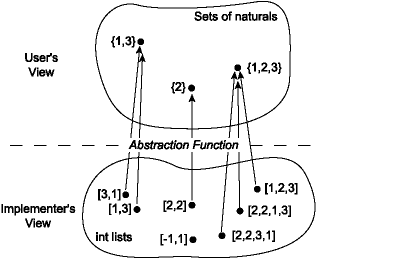
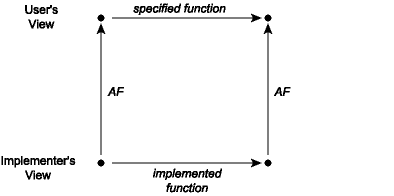

# 第 11 讲：抽象函数和表示不变量

我们观察到编程语言的“注释”功能最重要的用途是提供已声明函数行为的规范，以便程序模块可以在不检查其代码的情况下使用（*模块化编程*）。

现在让我们考虑在模块*实现*中使用注释。我们必须问自己的第一个问题是谁将阅读模块实现中编写的注释。因为我们将努力使模块用户只需阅读其接口即可编写针对模块的程序，显然用户不是预期的受众。相反，实现注释的目的是向其他实现者或模块维护者解释实现。这是通过编写能够使读者确信实现正确地实现了其接口的注释来实现的。

将模块接口中发现的函数规范复制到模块实现中是不合适的。复制可能会在程序演变过程中引入不一致性，因为程序员不会同步复制品。复制代码和规范是程序错误的一个主要来源（如果不是*主要*的来源）。在任何情况下，实现者都可以查看接口以获取规范。

实现注释分为两类。第一类是因为模块实现可能定义了对模块内部完全私有的新类型和函数。如果它们的重要性不明显，则应该以与我们建议用于文档化接口的方式文档化这些类型和函数。通常，在编写代码时，很明显地会发现模块中定义的新类型和函数形成了内部数据抽象或至少是一组作为独立模块的功能集合。这表明内部数据抽象可能会被移动到一个单独的模块，并且只能通过其操作来操作。

实现注释的第二类与*数据抽象*的使用相关。假设我们正在为类型为`'a`的一组项目实现一个抽象。接口可能看起来像这样：

```
module type SET = sig
  type 'a set
  val empty : 'a set
  val mem : 'a -> 'a set -> bool
  val add : 'a -> 'a set -> 'a set
  val rem : 'a -> 'a set -> 'a set
  val size: 'a set -> int
  val union: 'a set -> 'a set -> 'a set
  val inter: 'a set -> 'a set -> 'a set
end

```

在真实的集合签名中，我们希望像`map`和`fold`这样的操作，但为了简单起见，我们现在省略这些。有许多实现此抽象的方法。一种简单的方法是作为一个列表：

```
(* Implementation of sets as lists with duplicates *)

module Set1 : SET = struct
  type 'a set = 'a list
  let empty = []
  let mem = List.mem
  let add x l = x :: l
  let rem x = List.filter ((<>) x)
  let rec size l = 
    match l with
    | [] -> 0
    | h :: t -> size t + (if mem h t then 0 else 1)
  let union l1 l2 = l1 @ l2
  let inter l1 l2 = List.filter (fun h -> mem h l2) l1
end

```

这种实现具有简单性的优势。对于很少具有重复元素的小集合来说，它将是一个不错的选择。对于具有大量重复项或具有许多重复项的应用程序，其性能将很差，但对于某些应用程序来说，这并不是问题。

请注意，函数的类型不需要在实现中写下。这是因为它们已经存在于签名中，就像签名中的规范也不需要在结构中复制一样。

这里是另一种使用`'a list`的`SET`实现，但要求列表不包含重复项。这个实现也是正确的（对于大型集合也很慢）。请注意，我们使用相同的表示类型，但实现的一些重要方面是完全不同的。

```
(* Implementation of sets as lists without duplicates *)

module Set2 : SET = struct
  type 'a set = 'a list
  let empty = []
  let mem = List.mem
  (* add checks if already a member *)
  let add x l = if mem x l then l else x :: l 
  let rem x = List.filter ((<>) x)
  let size = List.length (* size is just length if no duplicates *)
  let union l1 l2 = (* check if already in other set *)
    List.fold_left (fun a x -> if mem x l2 then a else x :: a) l2 l1
  let inter l1 l2 = List.filter (fun h -> mem h l2) l1
end

```

另一种实现可能会使用某种树结构（我们将在本学期后期讨论）。你可能会想到比这些更复杂的实现方式（通常更好）。我们将很快在讲座中讨论选择良好实现的问题。

我们引入函数规范的一个重要原因是为了实现*局部推理*：一旦函数有了规范，我们就可以判断函数是否按照预期工作，而无需查看程序的其余部分。我们还可以判断程序的其余部分是否正常工作，而无需查看函数的代码。然而，我们无法对刚刚给出的三个模块实现中的各个函数进行局部推理。问题在于我们对具体类型（例如`int list`、`bool vector`）和相应的抽象类型（`set`）之间的关系缺乏足够的信息。通过向实现添加两种新类型的注释：*抽象函数*和抽象数据类型的*表示不变量*，可以解决这种信息不足的问题。

## 抽象函数

任何`SET`实现的用户不应该能够根据其功能行为将其与其他实现区分开。就用户而言，操作就像对数学理想中的集合进行操作一样。在第一个实现中，列表`[3; 1]`、`[1; 3]`和`[1; 1; 3]`对于实现者是可以区分的，但对于用户来说不是。对用户而言，它们都代表抽象集合{1, 3}，并且不能通过`SET`签名的任何操作来区分。从用户的角度看，抽象数据类型描述了一组抽象值和相关操作。实现者知道这些抽象值由可能包含用户视图中看不到的附加信息的具体值表示。这种信息的丢失由*抽象函数*描述，它是从具体值空间到抽象空间的映射。实现`Set1`的抽象函数如下：



请注意，几个具体值可能映射到一个抽象值；即，抽象函数可能是*多对一*的。也有可能一些具体值不映射到任何抽象值；抽象函数可能是*部分的*。这在`Set1`中并不是这种情况，但在其他实现中可能会发生。

抽象函数对于确定实现是否正确非常重要，因此它应该作为任何抽象数据类型实现中的注释。例如，在`Set1`模块中，我们可以将抽象函数描述如下：

```
module Set1 : SET = struct
  (* Abstraction function: the list [a1; ...; an] represents the
   * smallest set containing all the elements a1, ..., an.
   * The list may contain duplicates.
   * [] represents the empty set.
   *)
  type 'a set = 'a list
  ...

```

此注释明确指出列表可能包含重复项，这有助于加强第一句的内容。同样，空列表的情况被明确提及以确保清晰，尽管这是多余的。

对于不允许重复项的第二个实现的抽象函数，暗示了一个重要的区别：我们可以更简单地为这个第二个表示写出抽象函数，因为我们知道元素是不同的。

```
module Set2 : SET = struct
  (* Abstraction function: the list [a1; ...; an] represents the set
   * {a1, ..., an}.  [] represents the empty set.
   *)
  type 'a set = 'a list
  ...

```

在实践中，“抽象函数”这个短语通常被省略。然而，包含它并不是一个坏主意，因为它是一个有用的提醒，当你编写像上面那样的注释时，你正在做什么。每当你编写代码来实现所谓的抽象数据类型时，你都应该明确写下抽象函数，并当然要记住它。

## 可交换图表

使用抽象函数，我们现在可以谈论抽象实现何时*正确*。当且仅当在具体空间中发生的每个操作通过抽象函数映射到抽象空间时都是合理的时，它才是正确的。这可以被可视化为一个*可交换图表*：



可交换图表意味着如果我们沿着图表的两条路径前进，我们必须到达相同的地方。假设我们从一个具体值开始，并对其应用某些操作的实际实现以获得新的具体值或值。在抽象上看，具体结果应该是一个抽象值，它是将抽象视图作为实际输入的描述按照规范应用函数的可能结果。例如，考虑上次讨论的使用重复元素列表实现的集合的并函数。当将此函数应用于具体对[1; 3]、[2; 2]时，它对应于图表的左下角。这个操作的结果是列表[2; 2; 1; 3]，其对应的抽象值是集合{1, 2, 3}。请注意，如果我们将输入列表[1; 3]和[2; 2]应用到抽象函数 AF 上，我们将得到集合{1, 3}和{2}。可交换图表要求在这种情况下{1, 3}和{2}的并集是{1, 2, 3}，这当然是正确的。

## 表示不变性

## 一些缺失的信息

抽象函数解释了模块内部信息如何被模块客户端抽象地看待。然而，这并不是确保实现正确性所需的全部信息。考虑两种实现中的`size`函数。对于`Set2`，其中整数列表没有重复项，大小就是列表的长度：

```
let size = List.length

```

但对于`Set1`，允许重复的情况，我们需要确保不重复计算重复元素：

```
let rec size l = 
  match l with
  | [] -> 0
  | h :: t -> size t + (if mem h t then 0 else 1)

```

我们如何知道在`Set2`中不需要进行此检查？因为代码没有明确说明没有重复项，实现者将无法就`size`等函数是否正确实现进行局部推理。

这里的问题是，在`Set2`表示中，并非所有具体数据项都代表抽象数据项。也就是说，抽象函数的*域*不包括所有可能的列表。有一些列表，比如`[1; 1; 2]`，包含重复项，绝不能出现在`Set2`实现中集合的表示中；抽象函数在这些列表上是未定义的。我们需要包含第二个信息，*表示不变量*（或*rep invariant*，或*RI*），以确定哪些具体数据项是抽象数据项的有效表示。对于以不重复列表表示的集合，我们将其作为注释的一部分与抽象函数一起写出：

```
module Set2 : SET = struct
  (* Abstraction function: the list [a1; ...; an] represents the set
   * {a1, ..., an}.  [] represents the empty set.
   *
   * Representation invariant: the list contains no duplicates.
   *)
  type 'a set = 'a list
  ...

```

如果我们从可交换图的角度思考这个问题，我们会发现确保正确性所必需的一个关键属性：即，所有具体操作都保持表示不变量。如果这个约束被打破，诸如`size`之类的函数将无法返回正确答案。表示不变量和抽象函数之间的关系在这个图中描述如下：


我们可以使用表示不变量和抽象函数来判断单个操作的实现是否正确*与模块的其余部分隔离开来*。如果假设：

1.  函数的前提条件适用于参数值

1.  参数的具体表示满足表示不变量

我们可以证明

1.  所有创建的新表示值都满足表示不变量，并且

1.  可交换图成立。

表示不变量使得编写可证明正确的代码变得更容易，因为这意味着我们不必为所有可能的传入具体表示编写代码——只需满足表示不变量的那些。例如，在实现`Set2`中，我们不关心代码在包含重复元素的列表上的操作。然而，我们确实需要关注的是，在返回时，我们只生成满足表示不变量的值。如上图所示，如果表示不变量对输入值成立，那么对输出值也应该成立，这就是为什么我们称之为*不变量*。

## repOK

当实现一个复杂的抽象数据类型时，编写一个内部函数通常很有帮助，该函数可用于检查给定数据项的表示不变量是否成立。按照惯例，我们将这个函数称为`repOK`。如果模块接受在模块外部创建的抽象类型的值，比如通过在签名中公开类型的实现，那么应该对这些值应用`repOK`以确保表示不变量得到满足。此外，如果实现创建了任何新的抽象类型的值，可以将`repOK`应用于它们作为健全性检查。通过这种方法，可以早期捕获错误，并且一个函数中的错误不太可能造成另一个函数中出现错误的现象。

### `repOK`作为一个恒等函数

一种方便编写`repOK`的方法是将其设置为一个恒等函数，如果表示不变量成立，则只返回输入值，如果失败则引发异常。

```
(* Checks whether x satisfies the representation invariant. *)
let repOK (x : int list) : int list = ...

```

这是一个使用与`Set2`相同的数据表示的`SET`的实现，但包含大量的`repOK`检查。请注意，`repOK`应用于所有输入集合和任何被创建的集合。这确保了如果创建了一个错误的集合表示，则会立即检测到。如果我们在创建时不小心错过了一个检查，我们还将`repOK`应用于传入的集合参数。如果有错误，这些检查将帮助我们快速找出表示不变量被破坏的地方。

```
Turn on Javascript to see the program.

```

### 生产代码与开发代码

对生产版本的程序在每个参数上调用`repOK`可能过于昂贵。上面的`repOK`非常昂贵（尽管可以更便宜地实现）。对于生产代码，可能更适合使用一个只检查易于检查的表示不变量部分的`repOK`版本。当有要求不要有运行时成本时，可以将`repOK`更改为恒等函数（或宏），以便编译器优化掉对它的调用。但是，最好保留`repOK`的完整代码（也许在注释中），以便在未来调试时可以轻松地恢复。

一些语言提供对条件编译的支持，比如 Java 和 OCaml 中的`assert`语句。这些构造非常适合检查表示不变量和其他类型的健全性检查。有一个编译器选项，允许在开发过程中打开此类断言，并在最终的生产版本中关闭它们。

## 模块不变式

即使编写的模块不容易被视为提供抽象数据类型，对数据的不变式也是有用的。有时很难确定模块提供的数据的抽象视图，并且可能根本没有任何抽象类型。即使没有抽象函数，不变式也很重要，因为它们记录了代码预期正确处理的合法状态和表示。一般情况下，我们将**模块不变式**称为模块强制执行的不变式。在 ADT 的情况下，表示不变式是模块不变式。模块不变式对于理解代码的工作方式非常有用，也对维护很重要，因为维护者可以避免违反模块不变式的代码更改。

### 模块不变式与代码演变

强模块不变式并不总是最佳选择，因为它限制了对模块的未来更改。我们将接口规范描述为模块实现者与用户之间的契约。模块不变式是模块各个实现者之间的契约，包括当前和未来。一旦建立了不变式，ADT（抽象数据类型）操作可以实现，假定表示不变式保持不变。如果表示不变式曾被削弱（变得更宽松），则可能会破坏实现的某些部分。因此，*表示不变式最重要的目的之一是准确记录模块实现可安全更改的内容*。弱不变式会迫使实现者更加努力地生成正确的实现，因为对具体表示值的假设较少，但反之，它为将来的代码更改提供了最大的灵活性。

### 模块化与模块不变式

良好代码设计的一个标志是对程序数据的不变式在模块内以局部化的方式强制执行，这样程序员就可以推理出不变式是否得到了执行，而无需考虑程序的其余部分。要做到这一点，必须找出各个模块暴露的恰当操作，以便提供有用的功能同时确保不变式得到维护。

相反，常见的设计错误是将程序分解为一组简单封装数据并提供低级访问操作的模块，同时将程序的所有有趣逻辑都放在一个主模块中。这种设计的问题在于所有有趣（且难！）的代码仍然集中在一个地方，而主模块负责在数据之间执行许多复杂的不变式。这种设计没有将程序分解为可以独立推理的较简单部分。它显示了抽象不正确的重大危险信号：所有代码都是无聊的代码，或者是难以推理的过于复杂的代码。

举个例子，假设我们正在实现一个图形化的国际象棋游戏。游戏状态包括一个棋盘和一堆棋子。我们可能想要追踪每个棋子的位置，以及每个棋盘方格上的内容。图形显示中可能也有很多状态。一个良好的设计应该确保棋盘、棋子和图形显示在代码中与国际象棋游戏的详细规则处理代码分离的情况下保持同步。

## 模块化设计原则

给定一个大的编程任务，我们希望以有效的方式将其分解为模块。有几个目标。为了让软件的用户满意，我们希望程序是正确的、安全的，并且性能可以接受。但为了降低开发和维护成本，以及增加程序正确性的可能性，我们需要一个具有松散耦合并允许局部推理的模块化设计。这些目标是有张力的。我们可以在松散耦合和紧密耦合之间的轴线上粗略地划分设计权衡：

| 问题 | 松散耦合 | 紧密耦合 |
| --- | --- | --- |
| 接口大小 | *窄*接口：少量操作 | *宽*接口：多量操作 |
| 复杂性 | 简单的规范 | 复杂的规范 |
| 不变性 | 局部 | 全局 |
| 先/后条件 | 弱，非确定性 | 强，确定性 |
| 正确性 | 更容易做对 | 更难做对 |
| 性能 | 可能会牺牲性能 | 可能会暴露出优化 |

因此，如果我们想要非常模块化且相对容易构建正确的软件，我们应该设计具有简单、窄接口以及相对较少操作、简单规范的模块。在某些情况下，我们可能需要比积极模块化设计提供的性能更多，并且可能需要使我们的规范更复杂或添加新操作。

一个好的经验法则是尽可能以模块化和简单的设计开始。接口应该是窄的，只暴露出客户端执行任务所需的操作。不变性应该简单且在本地执行。避免过早进行会导致程序复杂、耦合紧密的优化，因为很多时候性能瓶颈并非所预期的那样。你不想为后来证明是不必要的复杂性付出代价。如果性能成为问题，一个简单、清晰的设计通常是改进性能的良好起点。

一般来说，沿着这个轴线的正确选择取决于正在构建的系统，需要工程判断。软件设计师必须平衡成本、性能、正确性、可用性和安全性等问题。他们一直被期望做出在这些问题之间权衡的判断调用。良好软件工程的关键在于意识到何时需要做出这些判断，并了解选择的后果。
