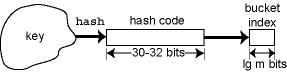

# 第 13 讲：哈希表

## 哈希表

假设我们需要一个数据结构来实现一个可变元素的集合（包括包含、添加和移除等操作，该操作以一个元素作为参数），或者实现一个从键到值的可变映射（包括获取、放置和移除等操作，该操作以一个键作为参数）。可变映射也被称为**关联数组**。我们现在已经看到了一些数据结构，可以用于这两个实现任务。

我们考虑实现集合和映射的问题，因为大多数可以实现集合的数据结构也可以实现映射。一组键-值对可以充当映射，只要我们比较键-值对的方式是比较键。或者，我们可以将从集合到映射的转换视为从一个实现键集合的数据结构开始，然后为每个存储键的数据结构节点添加一个关联值。

到目前为止，我们已经看到的数据结构以及它们各自关键操作的渐近复杂度如下：

| 数据结构 | 查找（包含/获取） | 添加/放置 | 移除 |
| --- | --- | --- | --- |
| 数组 | O(n) | O(1) | O(n) |
| 函数 | O(1) | O(n) | N/A |
| 链表 | O(n) | O(1) | O(n) |
| 搜索树 | O(lg n) | O(lg n) | O(lg n) |

自然地，我们可能会想知道是否有一种数据结构可以做得更好。事实证明确实有：**哈希表**，它是最好的、最有用的数据结构之一——当正确使用时。

已经开发了许多哈希表的变体。我们将逐步探索最常见的那些。

## 步骤 1：直接寻址表

当我们不知道要查找的索引时，数组作为数据结构会很慢，但当你知道索引时，所有操作都非常快。这就是**直接寻址表**背后的见解。假设对于我们想要存储在数据结构中的每个元素，我们都可以确定一个在范围 0..m–1 内的唯一整数索引。也就是说，我们需要一个将元素（或键）映射到范围内整数的**单射**函数。然后我们可以使用函数产生的索引来决定在大小为 m 的数组中存储元素的位置。

例如，假设我们正在维护一个表示同一条街上房屋的对象集合。我们可以使用街道地址作为直接地址表的索引。并不是每个可能的街道地址都会被使用，因此一些数组条目将为空。只要空条目不太多，这并不是一个问题。然而，通常很难想出一个不需要太多空条目的单射函数。例如，假设我们要维护一组按社会安全号码查找的员工。使用社会安全号码作为直接地址表的索引意味着我们需要一个包含 100 亿元素的数组，几乎所有元素都可能未被使用。即使假设我们的计算机有足够的内存来存储这样一个**稀疏**数组，它也将是一种浪费内存的方式。此外，在大多数计算机硬件上，使用缓存意味着对大数组的访问实际上明显比对小数组的访问慢得多——有时慢两个数量级！

## 步骤 2：哈希

不要求键被映射到一个没有任何冲突的索引，而是允许发生冲突，即两个键映射到同一个数组索引的情况。为了避免发生许多冲突，这种映射是由一个**哈希函数**执行的，它以可复现但“随机”的方式将键映射到一个合法的数组索引**哈希**。如果哈希函数很好，冲突的发生就像完全随机一样。假设我们使用一个具有 13 个条目的数组，我们的键是表示为 `long` 值的社会安全号码。那么我们可能使用**模数哈希**，其中数组索引计算为 `key % 13`。这不是一个非常随机的哈希函数，但除非有人故意制造冲突，否则可能足够好。

## 步骤 3：解决冲突

### 开放哈希（链式哈希）

处理冲突的两个主要思路。最好的方法通常是**链式**：每个数组条目对应一个包含可变元素集的**桶**。（令人困惑的是，这种方法也被称为**闭合寻址**或**开放哈希**。）通常，桶被实现为一个链表，因此每个数组条目（如果非空）都包含指向链表头部的指针。

要检查一个元素是否在哈希表中，首先将键进行哈希以找到要查找的正确桶。然后，扫描链表以查看所需元素是否存在。如果链表很短，则此扫描非常快。

添加或删除元素是通过将其哈希来找到正确的桶来完成的。然后，检查桶以查看元素是否在其中，最后按照通常的方式从桶中适当地添加或删除元素。

### 封闭哈希（探查法）

值得了解的冲突解决方法之一是**探测**。（令人困惑的是，这种技术也被称为**开放寻址**或**闭散列**。）与其将碰撞的元素放在链表中，不如将所有元素存储在数组中。当向哈希表中添加新元素创建冲突时，哈希表会在数组中找到其他位置来放置它。找到空索引的简单方法是通过数组索引以固定步长（通常为 1）向前搜索，寻找未使用的条目；这种**线性探测**策略往往会在表中产生大量元素聚集，导致性能不佳。更好的策略是使用第二个哈希函数来计算探测间隔；这种策略称为**双重哈希**。然而，无论如何实现探测，搜索或添加元素所需的时间都会随着哈希表填满而迅速增加。相比之下，链接的性能下降更为温和，即使哈希表并未填满，链接通常也比探测快。因此，通常更喜欢使用链接而不是探测。

最近流行的闭散列变体是 Cuckoo 散列，其中使用了两个哈希函数。每个元素存储在这些哈希函数计算的两个位置之一，因此最多只需查看两个表位置以确定元素是否存在。如果两个可能的位置都被占用，新添加的元素将*替换*那里的元素，然后将此元素重新添加到表中。一般来说，会发生一系列的替换。

## 哈希表的性能

假设我们正在使用具有 m 个桶的链接哈希表，哈希表中的元素数量为 n。那么每个桶中的平均元素数量为 n/m，称为哈希表的**负载因子**，表示为α。当搜索不在哈希表中的元素时，预期遍历的链表长度为α。由于哈希的初始（常数）成本始终存在，具有良好哈希函数的哈希表操作的成本平均为 O(1 + α)。如果我们能确保负载因子α永远不会超过某个固定值α[max]，那么所有操作都将是 O(1 + α[max]) = O(1)。

在实践中，当α在约为 1/2 到 2 之间的窄范围内时，哈希表的性能最佳。如果α小于 1/2，则桶数组变得稀疏，较小的数组可能会提供更好的性能。如果α大于 2，则遍历链表的成本限制了性能。

达到所需α范围的一种方法是为添加到其中的元素数量分配正确大小的桶数组。然而，一般来说，很难提前知道这个大小会是多少，而且无论如何，哈希表中的元素数量可能会随着时间的推移而改变。

## 步骤 4: 可调整大小的数组

由于我们无法预测何时才能使桶数组的大小达到所需大小，为什么不动态调整其大小呢？我们可以使用一个**可调整大小的数组**数据结构来实现这一点。我们不再将哈希表表示为桶数组，而是引入一个包含指向当前桶数组的指针的头对象，并且还跟踪哈希表中元素的数量。

每当添加一个元素会导致α超过α[max]时，哈希表就会生成一个新的桶数组，其大小是原始大小的倍数。通常，新的桶数组是当前桶数组大小的两倍。然后，*所有*元素都必须被重新哈希到新的桶数组中。这意味着哈希函数的变化；通常，哈希函数被设计为以数组大小 m 作为参数，因此只需要更改此参数。

## 摊销复杂度

由于一些 add()操作会导致所有元素被重新哈希，每个这样的操作的成本是元素数量的 O(n)。对于大型哈希表，这可能需要足够的时间，导致程序出现问题。然而，令人惊讶的是，每个操作的成本仍然始终为 O(1)。特别地，哈希表上的任何 n 个操作序列总是需要 O(n)时间，或者每个操作为 O(1)。因此，我们说哈希表操作的摊销渐近复杂度为 O(1)。

要看到为什么这是正确的，考虑一个哈希表，其中α[max] = 1。我们可以做的最昂贵的 n 个操作序列是一系列 n 个 add()调用，其中 n = 2^j，这意味着哈希表在最后一次 add()调用时调整大小。操作的成本可以通过哈希函数的使用次数来衡量。添加元素时会有 n 个初始哈希。当哈希表达到大小的 2 的幂时会调整大小，因此由调整大小引起的额外哈希是 1 + 2 + 4 + 8 + ... + 2^j。这个和被 2*2^j = 2n 所限制，所以总哈希数小于 3n，即 O(n)。

注意，数组大小呈几何增长（翻倍）是至关重要的。固定增量（例如，每次增加 100 个元素）可能会很诱人，但这会导致平均情况下有 n 个元素被重新哈希 O(n)次，导致 O(n²)的总插入时间，或者摊销复杂度为 O(n)。

## 哈希函数

哈希表是有史以来最有用的数据结构之一。不幸的是，它们也是最被滥用的之一。使用哈希表构建的代码通常远远达不到可实现的性能水平。造成这种情况的原因有两个：

+   客户端选择了不像随机数生成器一样工作的差劲哈希函数，使得简单均匀哈希假设无效。

+   哈希表抽象并未充分指定哈希函数的要求，或者使得提供一个良好的哈希函数变得困难。

显然，糟糕的哈希函数会破坏我们对恒定运行时间的努力。很多明显的哈希函数选择都是糟糕的。例如，如果我们要将姓名映射到电话号码，那么将每个姓名哈希为其长度将是一个非常糟糕的函数，同样的，只使用名字或只使用姓氏的哈希函数也是如此。我们希望我们的哈希函数能够利用键中的所有信息。这有点像一门艺术。虽然哈希表在使用得当时非常有效，但常常使用糟糕的哈希函数来破坏性能。

回想一下，哈希表在哈希函数满足简单均匀哈希假设时表现良好——即哈希函数应该看起来是随机的。如果要看起来是随机的，这意味着对键的任何更改，即使是很小的更改，也应该以明显随机的方式更改桶索引。如果我们想象将桶索引写成二进制数，那么对键进行一点小的更改应该以 1/2 的概率随机翻转桶索引中的位。这称为**信息扩散**。例如，对键进行一位的更改应该导致索引中的每一位以 1/2 的概率翻转。

## 客户端与实现者

正如我们所描述的，哈希函数是将键类型映射到桶索引的单个函数。实际上，哈希函数是*两个*函数的组合，一个由客户端提供，一个由实现者提供。这是因为实现者不了解元素类型，客户端不知道有多少个桶，而且实现者可能不信任客户端能实现扩散。

客户端函数 h[client] 首先将键转换为整数哈希码，而实现函数 h[impl] 将哈希码转换为桶索引。实际的哈希函数是这两个函数的组合，即 h[client]∘h[impl]：



要看到问题出在哪里，假设我们对象的哈希码函数是对象的内存地址，就像在 Java 中一样。这是通常的选择。并且假设我们的实现哈希函数类似于 SML/NJ 中的函数；它将哈希码取模为桶的数量，其中桶的数量始终是 2 的幂。这也是通常的实现选择。但是内存地址通常对 16 取模等于零，所以最多只有 1/16 的桶会被使用，并且哈希表的性能将比预期慢 16 倍。

### 测量聚集

当键被分配到桶中的分布不是随机时，我们称哈希表表现出**聚集**。测试函数以确保它在数据中不表现出聚集是一个好主意。使用任何哈希函数，都有可能生成导致其表现不佳的数据，但好的哈希函数会使这种情况不太可能发生。

确定哈希函数是否工作良好的一种好方法是测量聚集度。 如果桶 *i* 包含 *x*[*i*] 个元素，则聚集度的一个很好的度量是以下内容：

*C* = (*m*/*n*−1)(∑*i*/*n*) - 1)

均匀散列函数会产生接近 1.0 的聚集 *C*，其概率很高。 *C* 大于一的聚集度意味着散列表的性能受到了聚集的影响，大约减慢了 *C* 倍。例如，如果 *m*=*n* 并且所有元素都散列到一个桶中，那么聚集度评估为 *n*。如果散列函数完美且每个元素都落入其自己的桶中，则聚集度将为 0。如果聚集度小于 1.0，则散列函数将元素更均匀地分布在桶中，而不是依靠随机散列函数！

不幸的是，大多数哈希表实现都不提供客户端测量聚集度的方法。 这意味着客户端无法直接判断哈希函数的性能如何。 哈希表设计者应该在接口的一部分中提供一些聚集度估计。 请注意，不需要计算 *所有* 桶长度的平方和； 随机选择几个更便宜且通常足够了。

聚集度工作的原因是因为它基于对桶大小分布的 **方差** 的估计。 如果发生聚集，一些桶将具有比预期更多的元素，而一些将具有更少的元素。 因此，桶的大小范围将比从随机散列函数中预期的要宽。

> **对于那些已经学过一些概率论的人：**考虑包含 *x*[*i*] 个元素的桶 *i*。 对于每个 *n* 个元素，我们可以想象一个随机变量 *e*[*j*]，如果元素落入桶 *i*（概率为 1/*m*），则其值为 1，否则为 0。 桶大小 *x*[*i*] 是所有这些随机变量的总和：
> 
> > *x*[*i*] = ∑[*j*∈1..*n*]*e*[*j*]
> > 
> 让我们用 ⟨*x*⟩ 表示变量 *x* 的 **期望值**，用 Var(*x*) 表示 *x* 的 **方差**，它等于 ⟨(*x* - ⟨*x*⟩)²⟩ = ⟨*x*²⟩ - ⟨*x*⟩²。 那么我们有：
> 
> > ⟨*e[j]*⟩ = 1/*m*
> > 
> > ⟨*e[j]*²⟩ = 1/*m*
> > 
> > Var(*e[j]*) = 1/*m* - 1/*m²*
> > 
> > ⟨*x[i]*⟩ = *n*⟨*e[j]*⟩ = α
> > 
> 独立随机变量的总和的方差等于它们的方差之和。 如果我们假设 *e[j]* 是独立的随机变量，则：
> 
> > Var(*x*[*i*]) = *n* Var(*e*[*j*]) = α - α/*m* = ⟨*x*[*i*]²⟩ - ⟨*x*[*i*]⟩²
> > 
> > ⟨*x*[*i*]²⟩ = Var(*x*[*i*]) + ⟨*x*[*i*]⟩²
> > 
> > = α(1 - 1/*m*) + α²
> > 
> 现在，如果我们将所有 *m* 个变量 *x[i]* 加起来，并按照公式除以 *n*，我们应该有效地将其除以 α：
> 
> > (1/*n*) ⟨∑ *x*[*i*]²⟩ = (1/α)⟨*x*[*i*]²⟩ = 1 - 1/*m* + α
> > 
> 减去 1，我们得到 (*n*−1)/*m*。 聚集度将其乘以其倒数以获得 1。
> 
> 假设我们有一个哈希函数，它只命中每个*c*个桶中的一个，但在这些桶中是随机的。在这种情况下，对于非空桶，我们将有
> 
> > ⟨*e[j]*⟩ = ⟨*e[j]²*⟩ = *c*/*m*
> > 
> > ⟨*x[i]*⟩ = α*c*
> > 
> > (1/*n*) ⟨∑ *x*[*i*]²⟩ - 1 = α*c* − *c*/*m*
> > 
> > = *c*(*n*-1)/*m*
> > 
> 因此，此时的聚类度量评估为*c*。换句话说，如果聚类度量给出的值显著大于 1，则像具有未命中大部分桶的哈希函数。

### 设计哈希函数

为了使哈希表正常工作，我们希望哈希函数具有两个特性：

+   **注入**：对于两个不同的密钥*k*[1] ≠ *k*[2]，哈希函数应该以概率*m*-1/*m*给出不同的结果*h*(*k*[1]) ≠ *h*(*k*[2])。

+   **扩散**（比注入更强）：如果*k*[1] ≠ *k*[2]，则知道*h*(*k*[1])对*h*(*k*[2])不提供任何信息。例如，如果*k*[2]与*k*[1]完全相同，除了一个位，则*h*(*k*[2])中的每个位应该与*h*(*k*[1])相比以 1/2 的概率更改。知道*h*(*k*[1])的位不提供有关*h*(*k*[2])的位的任何信息。

作为哈希表设计者，您需要弄清楚客户端哈希函数和实现哈希函数哪个将提供扩散。例如，Java 哈希表提供（稍弱的）信息扩散，允许客户端哈希码计算仅针对注入属性。在 SML/NJ 哈希表中，实现仅提供注入属性。无论如何，哈希表规范都应说明是否期望客户端提供具有良好扩散的哈希码（不幸的是，很少有这样的）。

如果客户足够精明，将扩散推到他们身上是有意义的，这样可以使哈希表实现尽可能简单和快速。实现这一点的简单方法是将桶索引的计算分为三个步骤。

1.  序列化：将密钥转换为包含原始密钥中所有信息的字节流。两个相等的密钥必须产生相同的字节流。只有当密钥实际上相等时，两个字节流才应该相等。如何做到这一点取决于密钥的形式。如果密钥是一个字符串，那么字节流将简单地是字符串的字符。

1.  扩散：以一种使流中的每个变化似乎随机影响*x*的位的方式将字节流映射到一个大整数*x*中。有许多很好的现成方法可以做到这一点，性能与随机性（和安全性）之间存在权衡。

1.  计算哈希桶索引为*x* mod *m*。如果*m*是 2 的幂，则这尤其便宜，但请参见下面的注意事项。

因此，客户端哈希函数*h*client 定义为(*h*[diff] ∘ *h*[serial])(*k*) mod *m*，其中*h*[diff]*实现扩散。

有几种不同的好方法可以实现扩散（步骤 2）：乘法哈希、模块化哈希、循环冗余检查和安全哈希函数，如 MD5 和 SHA-1。它们在冲突抵抗力和性能之间提供了一种权衡。

通常，哈希表的设计不允许客户完全控制哈希函数。相反，客户端应该实现步骤 1 和 2 以生成整数**哈希码**，就像 Java 中那样。然后，实现方面使用哈希码和 *m* 的值（通常不向客户端公开，遗憾的是）来计算桶索引。

一些哈希表实现期望哈希码看起来完全随机，因为它们直接使用哈希码的低阶位作为桶索引，丢弃了高阶位的信息。其他哈希表实现采用哈希码并经过额外的步骤，应用一个提供额外扩散的**整数哈希函数**。对于这些实现，客户端不必太小心地生成好的哈希码，

任何哈希表接口都应该指定哈希函数是否被期望看起来是随机的。如果客户端无法从接口中判断是否是这种情况，最安全的做法是通过哈希到所有整数空间来计算高质量的哈希码。这可能会重复实现方面的工作，但比有很多冲突要好。

### 模块化哈希

对于**模块化哈希**，哈希函数简单地是 *h*(*k*) = *k* mod *m*，其中 *m* 为某个数（通常是桶的数量）。值 *k* 是从键生成的整数哈希码。如果 *m* 是二的幂（即，*m*=2^(*p*)），那么 *h*(*k*) 就是 *k* 的 *p* 个最低位。SML/NJ 的哈希表实现使用 *m* 等于二的幂的模块化哈希。这非常快，但客户端需要仔细设计哈希函数。

Java `Hashmap` 类稍微友好一些，但速度较慢：它使用 *m* 等于素数的模块化哈希。模运算可以通过预先计算 *1/m* 作为定点数来加速，例如（2³¹/*m*）。因此，有一个预先计算的各种素数及其定点倒数的表对这种方法非常有用，因为实现可以使用乘法而不是除法来实现模运算。

### 乘法哈希

更快但经常被误用的替代方法是**乘法哈希**，其中哈希索引计算为⌊*m ** frac(*ka*)⌋。这里*k*再次是一个整数哈希码，*a*是一个实数，frac 是返回实数的小数部分的函数。乘法哈希通过将*k*乘以一个大实数的小数部分来设置哈希索引。如果使用固定点而不是浮点进行此计算，则速度更快，这可以通过计算(*ka*/2*^q*) mod *m*来实现，其中*a, m,*和*q*是适当选择的整数值。因此*q*确定了*a*小数部分的精度位数。

这里是一个乘法哈希代码的示例，假设字长为 32 位：

```
val multiplier: Word.word = 0wx678DDE6F (* a recommendation by Knuth *)
  fun findBucket({arr, nelem}, e) (f:bucket array*int*bucket*elem->'a) =
    let
      val n = Word.fromInt(Array.length(arr))
      val d = (0wxFFFFFFF div n)+0w1
      val i = Word.toInt(Word.fromInt(Hash.hash(e)) * multiplier div d)
      val b = Array.sub(arr, i)
    in
      f(arr, i, b, e)
    end

```

乘法哈希之所以有效，原因与线性同余乘数生成表面上随机数的原因相同——就像使用哈希码作为种子生成伪随机数一样。乘数*a*应该很大，其二进制表示应该是 1 和 0 的“随机”混合。乘法哈希比模哈希更便宜，因为乘法通常比除法（或模）快得多。它还可以很好地与大小为*m*=2*^p*的桶数组配合使用，这很方便。

在固定点版本中，除以 2^(*q*)是至关重要的。在进行乘法哈希时的常见错误是忘记执行此操作，实际上您可以找到谷歌高排名的网页，解释乘法哈希而没有这一步。如果没有这个除法，乘以*a*就没有意义，因为*ka* mod *m* = (*k* mod *m*) * (*a* mod *m*) mod *m*。这不比具有模*m*的模哈希更好，而且很可能更糟。

### 循环冗余校验（CRC）

对于较长的序列化关键数据流，循环冗余校验（CRC）是一个不错的、相当快速的哈希函数。数据流的 CRC 是在执行数据的长除法后的余数（将其视为一个大二进制数），但在每个长除法步骤中使用异或而不是减法。这相当于在具有二进制系数的多项式域中计算余数。CRC 可以在专用硬件上非常快速地计算。快速软件 CRC 算法依赖于预先计算的数据表。一般来说，CRC 比乘法哈希慢大约 3-4 倍。

### 密码哈希函数

有时软件系统会被对手使用，他们可能会尝试选择在哈希函数中发生碰撞的密钥，从而使系统性能不佳。**密码哈希函数**是一种尝试使其计算上不可逆的哈希函数：如果你知道*h*(*x*)，那么没有比尝试所有可能的值并查看哪个值哈希到正确结果更快的方法来计算*x*。通常，这些函数还试图使找到导致碰撞的不同值*x*变得困难；它们是**抗碰撞**的。密码哈希函数的示例包括 MD5 和 SHA-1。MD5 并不像曾经想象的那样强大，但它大约比 SHA-1 快四倍，通常仍然适用于生成哈希表索引。粗略地说，MD5 的速度大约是使用 CRC 的两倍。

### 预先计算哈希码

高质量的哈希函数可能很昂贵。如果相同的值被重复哈希，一个技巧是预先计算它们的哈希码并将其与值一起存储。哈希表还可以存储值的完整哈希码，这使得快速扫描一个桶变得快速。实际上，如果哈希码很长且哈希函数是高质量的（例如，64 位以上的正确构造的 MD5 摘要），具有相同哈希码的两个密钥几乎可以肯定是相同的值。那么你的计算机更有可能因为宇宙射线击中它而得到错误答案，而不是因为哈希码碰撞。
