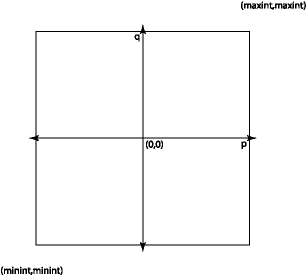

# 第 16 讲：保证

## 保证

所以，您已经使用上几节课中概述的规范方法来实现您的程序了。但它真的有效吗？您需要**保证**：对程序有效的信心。获得保证的两种主要策略是**验证**和**测试**，以及许多变体。理想情况下，我们希望能够有令人信服的证明，证明程序对可能提供的所有可能输入都能正确运行。这通常是一个过于强大的目标；我们必须采取一种增加我们对程序正确运行的信心的保证过程，或者甚至证明它明确地避免了某些类型的错误。

### 验证

在 *验证* 方法中，我们使用程序及其规范来形式化或非正式地论证程序是否满足所有规范，因此在所有可能的输入上都能正确运行。验证的价值在于，如果彻底进行，它会产生一个令人信服的证明，证明程序确实在所有可能的输入上都有效。例如，OCaml 类型检查器是一个有限的验证器，它确保程序不包含运行时类型错误，无论输入是什么。但它不保证程序不包含其他类型的错误。甚至有一些工具可用于帮助进行程序验证，基于自动定理证明器。在接下来的讲座中，我们将看到一些关于正确性的形式化和非正式论证。

### 测试

在 *测试* 方法中，我们实际上运行程序或程序的部分，并在各种输入上观察代码的行为是否符合预期。通过将程序的实际结果与预期结果进行比较，我们可以发现程序是否真的在我们尝试的特定输入上工作。测试的一个弱点是，除非我们尝试对程序的所有可能输入，否则我们不能确定它是否在所有输入上都有效。另一个弱点是，一些程序是不确定性的（特别是如果它们使用并发），同一个测试用例可能在不同的运行中产生不同的结果。这与验证相对应，我们试图证明程序总是有效的。然而，如果进行仔细，测试可以以较低的成本为我们提供程序有效的保证，甚至比正式或非正式验证更低。

学期初，我们谈到了编写单元测试。让我们回过头再思考一下，利用我们此后学到的知识。

## 覆盖率

我们希望知道程序在所有可能的输入上都能运行。测试的问题在于通常不可能尝试所有可能的输入。例如，假设我们正在实现一个提供有理数抽象数据类型的模块。其中一个操作可能是加法函数 `plus`，例如：

```
(* AF: (p,q) represents the rational number p/q
   RI: q is not 0 and either p=0 or gcd(p,q)=1 *)
type rational = int*int

(* Creates the rational number p/q.
 * Checks: q is not 0 *)
let create(p:int, q:int) : rational = ...
let toReal(r: rational): real = ...
...
(* plus(r1,r2) is r1 + r2\. *)
let plus(r1: rational, r2: rational) : rational = ...

```

要彻底测试这个函数需要什么？我们想要尝试所有可能的有理数作为`r1`和`r2`参数。有理数由两个整数组成，在大多数计算机上有 2³²个整数。因此，`plus`函数的可能输入为 2³²�2³²�2³²�2³² = 2¹²⁸。即使我们每纳秒测试一次加法（可能通过并行使用大量机器），也需要大约 10²⁹年才能完成对这个函数的测试。

显然，我们无法对软件进行彻底测试。但这并不意味着我们应该放弃测试。这只意味着我们需要仔细考虑我们的测试用例应该是什么，以便它们尽可能有效地说服我们代码是有效的。

考虑上面的`create`函数。它以两个整数`p`和`q`作为参数。我们应该如何选择一些相对较小的测试用例，以确信函数在所有可能的输入上都正确工作？我们可以将所有可能的输入空间视为一个大方形：



这个方形中大约有 2⁶⁴个点，所以我们负担不起测试它们所有。而且测试它们所有基本上是浪费时间的——大多数可能的输入都没有提供新的信息。我们需要找到一种方法，在这个空间中找到一组有趣的点来测试，这些点将给我们一个对整个空间内程序行为的良好感觉。输入空间通常由若干个子集组成，在这些子集中代码的行为在某种重要的方式上在整个子集中是相似的。我们通过测试每个这样的子集中超过一个输入来获得任何额外的信息。如果我们测试了输入空间的所有有趣区域，我们就实现了**覆盖**。我们希望测试在某种有用的意义上**覆盖**了可能的程序输入空间。

## 根据规范进行测试

在选择覆盖率良好的测试用例时，我们可能想要考虑被测试的程序或程序模块的规范和实现两方面。事实证明，我们通常可以通过仅查看规范并忽略实现来很好地选择测试用例。回想一下本学期早些时候，这被称为**黑盒测试**。这个想法是我们把代码想象成一个黑盒，我们只能看到它的表面：它的规范。我们通过观察规范如何隐含地引入将可能的输入空间分成不同区域的边界来选择测试用例。

在编写黑盒测试用例时，我们会问自己什么样的测试用例会产生符合规范预测的特殊行为。尝试典型输入和“边界情况”输入是很重要的。一个常见的错误是只测试典型输入，结果程序通常工作但在不太频繁的情况下失败。有时，这些情况是我们真正需要代码正常工作的情况！

以下是一些测试`create`函数的想法：

+   看看上面的方框，我们发现它的边界在`minint`（通常为-2³¹）和`maxint`（通常为 2³¹-1）处。我们想要尝试在方框的角落和边上构建有理数，例如`create(minint, minint)`，`create(maxint, 2)`等等。

+   p=0 的直线很重要，因为 p/q 在整条直线上都是零。我们应该尝试（0，q）以及各种 q 的值。

+   我们应该在空间的四个象限中尝试一些典型的（p，q）对。

+   我们应该尝试 q 能够整除 p 的（p，q）对，以及 q 不能整除 p 的对。

+   对于各种 p 和 q，形式为（1，q），（-1，q），（p，1），（p，-1）的对也可能很有趣，考虑到有理数的属性。

规范还指出，代码将检查 q 是否为零。我们应该构造一些测试用例来确保此检查是否按照广告进行。尝试（1,0），（maxint,0），（minint,0），（-1,0），（0,0）可能是一个足够的黑盒测试集。

当然，我们不能简单地通过创建一个有理数来了解很多；在测试中，我们将不得不使用有理数的其他函数，例如`toReal`，来*观察*所创建的有理数，并看到它是否符合我们的期望。但我们不应该将这与`toReal`的测试混淆；我们还将测试该函数，通过使用与实数空间划分方式相对应的参数调用 create。

这里是另一个例子：考虑函数`max`：

```
(* Return the maximum element in the list. *)
let max: int list -> int

```

一个好的黑盒测试用例集是什么？在这里，输入空间是所有可能的 int 列表的集合。我们需要尝试一些典型的输入，还要考虑边界情况。根据这个规范，边界情况包括以下内容：

+   包含一个元素的列表。实际上，空列表可能是我们首先考虑的第一个边界情况。查看上面的规范，我们意识到它没有规定在空列表的情况下会发生什么。因此，在识别规范错误时，考虑边界情况也是有用的。

+   包含两个元素的列表。

+   最大值为第一个元素的列表。或者是最后一个元素。或者在列表的中间某个位置。

+   每个元素都相等的列表。

+   元素按升序排列的列表，以及元素按降序排列的列表。

+   最大元素为`maxint`的列表，以及最大元素为`minint`的列表。

### 别名

当一个函数具有副作用或操作可变数据结构时，我们要检查的另一类重要边界条件是**别名**两个不同参数的调用。例如，如果我们有一个从一个集合复制元素到另一个集合的函数，我们应该尝试将这个函数应用到相同的集合上，看看是否得到预期的结果。当输入被别名时，这个函数可能很容易被实现为导致它不在别名时工作。

```
(* copy(s1,s2): add all the elements of s2 into the set s1 *)
let copy: set * set -> unit
...
(* test case: *)
let s: set = ...
copy(s,s)

```

经常程序员们没有足够地考虑到别名的可能性。

### 摘要

黑盒测试具有一些重要的优点：

+   它不要求我们看到我们正在测试的代码。有时代码将不可用于源代码形式，但我们仍然可以构造有用的测试用例。编写测试用例的人不需要了解实现。

+   测试用例不依赖于实现。它们可以与或在实现之前并行编写。此外，即使实现被完全重写，好的黑盒测试用例也不需要更改。

+   构造黑盒测试用例会使程序员仔细思考规范及其含义。许多规范错误都是通过这种方式捕获的。

黑盒测试的缺点是，它的覆盖范围可能不如我们希望的那样高，因为它必须在没有实现的情况下工作。但这是写测试用例时的一个很好的起点。

## 针对实现进行测试

### 使用表示不变式

查看实现会给我们更多关于什么可能为我们提供对可能输入的空间的良好覆盖的信息。回想一下学期初，利用实现知识进行测试被称为**白盒**或**玻璃盒测试**。一个简单的第一步是查看抽象函数和表示不变式，以获取关于数据抽象操作的值空间中可能存在的边界的提示。rep 不变式是构造有用测试用例的一个特别有效的工具。

查看上述有理数数据抽象的 rep 不变式，我们看到它要求 q 非零，并且 p 和 q 的 gcd 为 1。因此，我们应该构造尽可能使 q 接近 0（1 或-1）的测试用例，p 为 0 的测试用例，以及使 gcd 以相对有趣的方式为 1 的测试用例，例如通过 p=1 或 q=1 或算法中的错误可能破坏 gcd 属性的测试用例（例如，3/5 + -3/5，7/20+13/20）。

### 路径完整性

另一种我们可以确定输入空间的有趣区域的方法是尝试找到一组测试用例，通过程序文本的每一条**路径**。集体执行所有路径的测试用例称为**路径完备**。至少，路径完备性要求对于代码的每一行，甚至对于程序中的每一个表达式，都应该有一个测试用例导致其被执行。任何未执行的代码都可能包含错误，如果从未经过测试。

例如，这是我们用列表表示的两个集合取并集的代码：

```
let union(s1, s2) =
  fold_left (function (x,s) -> if contains(x,s) then s else x::s) s1 s2

```

路径完备性要求至少编写测试用例，以执行`if`语句的“`then`”和“`else`”分支。

对于真正的路径完备性，我们必须考虑从每个函数的开始到结束的所有可能的执行路径，并尝试执行每个不同的路径。一般来说，这是不可行的，因为路径太多。例如，一个含有循环的程序至少有一个路径，每次循环执行时都会执行一次。`union`的代码实际上有许多路径，因为`foldl`可能多次调用其函数，不同的执行可能会采用不同的分支。如果有几个这样的循环，路径的数量很容易变得难以处理。一个好的方法是将路径集合视为我们试图探索的空间，并在这个空间内识别值得测试的边界情况。例如，对于包含循环的程序，我们希望测试用例导致循环执行 0、1 和一些*n*>=2 次。如果循环内有几条路径，我们将希望测试用例能够对每个循环迭代次数执行所有这些路径。

## 测试策略

到目前为止，我们主要谈论了选择测试用例以确保模块符合其规范的方法。我们应该如何进行测试呢？有两种方法，它们都很有用：**集成测试**和**单元测试**。在集成测试中，我们尝试将程序作为一个整体，并检查其行为是否符合预期。我们使用上面描述的技术构建测试用例。例如，如果一个程序读取一个输入文件，我们将考虑边界情况，比如文件不存在、文件为空或格式不正确，以及上面讨论的数据特定边界情况。

集成测试的问题在于，我们不太可能通过以适当选择的输入运行程序来完全测试程序模块；程序通常不会执行组成它们的模块的全部功能。集成测试可能会留下未发现的错误，当程序以某种方式更改时，这些错误可能会在以后暴露出来。

因此，我们也应该执行单元测试来检查程序的各个模块。要测试模块，我们必须编写代码，其目的仅仅是为了测试模块。这段代码被称为**测试驱动程序**。测试驱动程序应该彻底测试模块提供的每个操作，以便容器程序对模块的任何可能的使用也能正常工作。通常，测试驱动程序是用与模块本身相同的编程语言编写的。写代码不会成为最终程序的一部分可能会让人难以自我激励，但通过单元测试获得的增加的保证通常是值得的。

### 利用表示不变量

如果被测试的模块有一个`repOK`操作或等价物，则在测试中可以非常有用。抽象数据类型的问题在于它们只能通过它们的接口来操作；即使数据结构已经出了问题，通过外部接口找到问题的方式可能也很困难。因为`repOK`以彻底的方式检查了表示的内部一致性，所以测试驱动程序可以在每个模块操作之后使用它来获得对模块正常工作的额外信心。

### 穷尽测试：小反例假设

真正的穷尽测试是不可行的，但是一种有限形式通常很成功地找到错误。观察表明，程序中的错误通常可以通过一个小的测试用例重现。如果这是真的，我们可以通过穷尽尝试小测试用例来找到该测试用例。通过将自己限制在小于某个固定大小的测试用例上，我们可以使测试用例的数量可控。例如，如果我们正在测试红黑树，我们可以尝试构造高达 6 个元素的所有可能的红黑树并对其进行操作。通常需要一些思考来防止输入状态空间爆炸。例如，我们知道，对算法来说只有元素的顺序才重要，因此我们不需要尝试所有可能的 6 个值集合；我们可以将数字 1 到 6 按所有可能的顺序插入红黑树中。这样做结果只有 720 个单独的情况，我们可以编写一个测试驱动程序自动生成，或者如果允许重复元素，则为 6⁶ = 46656 个情况。测试这么多情况是可行的，并且经常是有用的。

## 回归测试

一旦我们构建了一套良好覆盖率的测试用例，并且确信代码在它们上面运行正常，那么我们该怎么处理这些测试用例呢？也许我们应该把它们丢掉 —— 毕竟，程序是正常工作的；我们为什么需要测试用例呢？一个原因是软件不是静态的；随着其中的错误被修复和新功能被添加，它随着时间的推移而演变。为软件的一个版本开发的测试用例很可能也对以后的版本有用。在开发好的测试用例上投入的时间可以在开发的整个生命周期中分摊。事实上，在一个长期运行的软件项目中，测试用例形成了项目的一部分，是项目的代码一起存储的。每当软件更新时，都会执行**回归测试**：已经开发的测试用例会在程序上重新运行，以确保程序仍然正常工作。

常常，回归测试可以被自动化；当程序在现有的测试用例上运行时，其输出被保存在一个文件中。当程序的新版本在回归测试上运行时，它的输出被与先前的输出进行比较，以确保它没有改变 —— 即程序没有“退化”。有一些可用的工具，比如[expect](http://expect.nist.gov/)，可以使编写复杂回归测试的测试框架变得更容易。Expect 使得生成程序输入以及自动比较输出与预期输出变得容易，同时忽略不重要的差异。

当现有程序更新时，通常需要向回归测试套件中添加新的测试用例。如果程序更新以修复错误，则应添加导致错误出现的测试用例。如果添加了新功能，则还应添加与该功能相关的新测试用例。

## 测试和调试

测试只告诉我们一个程序是否正确；它通常不告诉我们错误在哪里。但是，对程序进行仔细的单元测试在调试时可以起到相当大的帮助。调试复杂程序中最困难的事情之一就是知道什么是可信的，因为你不知道错误在哪里。如果程序的各个模块已经经过了仔细的单元测试，这可以帮助你进行调试，因为你会对这些模块能够执行其功能而感到有信心。良好的规范也是有用的，因为它们允许你决定一个给定的代码片段是否在与程序的其余部分隔离的情况下执行它应该执行的操作。

一旦发现一个 bug，很容易就想着快速修复代码然后继续。这是非常危险的。行业统计数据显示，大约*三分之一*的 bug 修复会引入新的 bug！如果一个 bug 很难找到，通常是因为程序逻辑复杂且难以理解。你应该仔细思考为什么 bug 会发生以及问题的正确解决方案是什么。太多程序员只是简单地在代码上贴上"创可贴"，希望它能奏效。每当引入 bug 修复时，回归测试都是重要的，但没有什么能取代对代码的仔细思考。

### 更多阅读

+   S.L. Pfleeger，*软件工程：理论与实践*。

+   G.J. Myers，*软件测试的艺术*。
