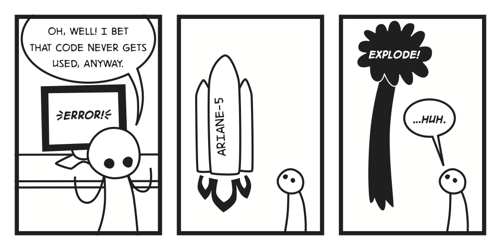

# 计算机科学领域指南

# 序言

> 原文出处：[`csfieldguide.org.nz/`](http://csfieldguide.org.nz/)

“计算机科学领域指南”是新西兰坎特伯雷大学开发的面向高中学生学习计算机科学的在线互动资源。

# 1\. 介绍

## 1.1\. 大局观是什么？

为什么人们对计算机有爱恨交加的情感？为什么有些人对特定类型的计算机如此狂热，而另一些人对数字设备如此愤怒以至于对它们进行了暴力行为？这与计算机科学有什么关系？计算机科学到底是什么？

很高兴你问！简而言之，计算机科学是关于设计和构建非常快速、拥有出色界面、可靠、安全、有帮助甚至有趣的应用程序的工具和技术。

许多人将计算机科学与编程混淆。有人说“计算机科学与编程的关系就像天文学与望远镜的关系一样”（[迈克·费洛斯](http://en.wikiquote.org/wiki/Computer_science)）。编程是计算机科学家用来实现伟大想法的工具，但仅仅知道如何向计算机发出编程指令并不足以创建令人愉悦和赋予人力量的软件。

例如，计算机每秒可以执行数十亿次操作，然而人们经常抱怨它们太慢。人类可以感知大约一秒钟的延迟，如果你的程序响应时间超过这个时间，它将被视为迟缓、卡顿或令人沮丧。你只有不到一秒钟的时间来让用户感到愉悦！如果你正在搜索数百万条数据，或者显示数百万像素（百万像素），你不能承担以错误的方式处理事情的代价，你也不能告诉用户他们应该购买一台更快的计算机... 他们可能只会去购买别人更快的软件！

这里有一些建议来自弗雷德·威尔逊，他投资了许多知名科技公司：

> 首先，我们相信速度不仅仅是一个特性。速度是最重要的特性。如果你的应用程序很慢，人们就不会使用它。我觉得这种情况在普通用户中更为常见，而不是在高级用户中。我认为高级用户有时对构建真正快速的网络应用程序的挑战有些同情，也许他们愿意忍受，但当我看着我的妻子和孩子时，他们是我对世界的主流看法。如果某样东西很慢，他们就会离开。... 速度不仅仅是一个特性。这是一个要求。
> 
> —[弗雷德·威尔逊](http://en.wikipedia.org/wiki/Fred_Wilson_(financier)) ([来源](http://triple-networks.com/2011/12/06/10-golden-principles-of-successful-web-apps/))

计算机科学中的一个关键主题是如何让事物运行更快，尤其是如果你希望能够将软件销售给使用旧一代智能手机的大量市场，或者在一个按分钟计费的数据中心中运行它。你不能只是告诉你的客户购买一个更快的设备 — 你需要提供高效的软件。

尝试使用以下两个计算器进行简单计算。它们都具有相同的功能（可以进行相同的计算），但哪一个更好用？为什么？

（本书中有很多类似的交互式内容。如果第一个计算器无法正常工作，可能需要使用更新的浏览器。本书中的交互式材料在大多数最新的浏览器中都可以使用；谷歌浏览器是一个特别靠谱的选择。）

上面的第二个计算器速度较慢，这可能令人沮丧。但它有一个更复杂的界面 — 按钮在你指向它们时会展开，以突出显示你正在做的事情。这会使使用更加容易吗？你是否因为“C”和“=”键靠得太近而遇到问题？

界面如何工作是计算机科学的核心部分。美学 — 图像和布局 — 是重要的，但更关键的是人们如何交互的心理学。例如，假设对话框中的“确定”和“取消”按钮偶尔被颠倒。你总是需要在点击其中一个之前仔细检查，而不是像以前那样凭直觉进行操作。基于人们思考和行为方式的一些非常简单的原则可以被利用来设计人们喜爱的系统。

制作能够扩展的软件是另一个重要主题。想象一下，你建立了一个网络界面，并吸引了成千上万的客户。一切都很顺利，直到你的网站一夜之间爆红，突然间有了数百万的客户。如果系统变得繁忙不堪，人们等待响应时会感到沮丧，明天你就没有客户了 — 他们都会转向别人的系统。但是，如果你的程序设计得足够扩展，可以处理如此大量的数据，那么你的主要问题将是如何处理收购你公司的要约！

这些问题中的一些可以通过购买更多的设备来解决，但这可能是一种昂贵且浪费的选择（不仅仅是成本，还包括对环境的影响，包括用于不高效处理的浪费电力）。对于移动计算，保持事物的精简和高效更加重要 — 重型程序会消耗宝贵的电池寿命，处理和内存必须节俭使用，因为这些会影响设备的大小、重量甚至散热。

如果您的系统继续取得成功，很快就会有人试图黑入系统，窃取有价值的客户数据或密码。你如何设计系统，以确保它们免受此类攻击，并让您的客户相信您能够保护他们的个人信息或业务交易？

所有这些问题以及更多问题都由计算机科学领域解决。本指南的目的是向你介绍这些想法，以便你更好地了解这个领域是否适合你。它面向高中水平，并旨在使你对该领域有一个良好的概述，并为进一步深入学习以成为专家做好准备。

我们将计算机科学分解成了许多你经常在全球课程中找到的主题，比如算法、人机交互、压缩、密码学、计算机图形学和人工智能。事实上，所有这些主题都相互作用，所以要留意它们之间的联系。

本指南不是一份供你记忆的事实清单，也不是一份可供复制粘贴到项目中的内容！它主要是一份指导你可以做的事情的指南——这些经历将使你与主题产生联系。事实上，我们不会详细介绍所有的主题，但会为你提供网站和书籍的参考资料，这些资料会对事情有很好的解释。这个指南的想法是为你提供足够的背景知识来理解这些主题，并且能够用它们做一些有意义的事情。

编程方面又如何呢？在阅读整个指南的过程中，你可以不进行任何编程，尽管我们会建议一些练习。然而，所有这里的概念最终都反映在人们编写的程序中。如果你想学习编程，有许多优秀的课程可供选择。学习编程需要时间和练习，但与阅读本指南中的主题并行进行是非常值得的。有许多免费在线系统和书籍可供您自学编程。一个关于学习编程选项的数据库正在由[code.org](http://www.code.org/)编制，那里还有一些知名的计算机高手的受欢迎视频，很适合用来展示课堂。以下是一些可能适合您的其他来源：

+   [NCEA 年 12 级工作手册](http://www.cs.otago.ac.nz/year12dt/) 是一本关于 Java 和 Python 编程的书籍（实际上有两本），适用于新西兰的成就标准。作者正在开发第二本适用于 13 年级编程标准的书籍。

+   [CodeAvengers](http://www.codeavengers.com/) 是一个在线系统，您可以通过挑战来学习 Javascript 编程。该系统与新西兰的编程成就标准相匹配，从 1 级到 3 级。

+   [Interactive Python](http://interactivepython.org/) 有一本免费的在线“书”叫做“如何像计算机科学家一样思考：互动版”（也被称为“思考 Python”），教授 Python 语言，并使学生能够在网络浏览器中编辑和运行 Python 示例。原始书籍是开源的，也有各种非交互式版本可用。

+   [Codecademy](http://www.codecademy.com/) 是一个在线系统，你可以学习包括 Python 和 Javascript 在内的语言。

+   [Coder Dojo](http://coderdojo.com/) 是一个“围绕免费非营利性编程俱乐部和定期为年轻人举办会议的运动”。

+   [TryPython](http://trypython.org/) 是一个可以在你的网络浏览器中运行的即时 Python 教程。

+   [CodingBat](http://codingbat.com/) 有数百个编程挑战，你可以尝试检查你学习编程的进度。

+   [Greenfoot](http://greenfoot.org/) 是一个可视化、交互式系统，用 Java 教授对象导向。你可以创建‘演员’在‘世界’中建立游戏、模拟和其他图形程序。

+   [Khan Academy](http://www.khanacademy.org/cs/) 有一个“计算机科学”部分；这里的大部分材料都是关于编程而不是一般的计算机科学。

+   [Grok learning](https://groklearning.com/) 是一个学习编程的新网站。

以下编程教学系统更适合年轻学生，或者基于“拖放”语言，仅用作教学工具：

+   [ScratchEd](http://scratched.media.mit.edu/) 为 Scratch 提供大量教育资料，这是一个以创建 2D 动画为中心的拖放式编程语言。Scratch 具有许多更传统语言的功能。[Snap (BYOB)](http://byob.berkeley.edu/) 系统基于 Scratch，并具有一些更高级的功能。

+   [Scratch 中的计算机科学概念](http://stwww.weizmann.ac.il/g-cs/scratch/scratch_en.html) 是一本关于 Scratch 编程的书籍。

+   [Alice](http://alice.org/) 是一个围绕创建 3D 动画的教育性编程语言。

+   [Kodu](http://www.kodugamelab.com/) 是一个可在 Xbox 上使用的可视化编程工具。

+   [儿童的蛇编程](http://briggs.net.nz/snake-wrangling-for-kids.html) 是一本免费下载的书，向年轻学生介绍 Python 编程。

编程只是成为计算机科学家所需技能之一。在本书中，你将锻炼许多其他技能 —— 数学、心理学和沟通都是重要的技能之一。

## 1.2\. 如何使用本指南

该指南旨在支持各种课程设置，并将提供用于在不同环境中使用它的教师指南。对于学生，我们大多数章节都设计为可以单独使用；一些依赖于前一章节的章节在开始时解释了您需要做的准备工作（最有用的一般准备工作是关于数据表示的章节，因为计算机上的所有内容都是使用二进制数存储的，因此它们在计算机科学的许多领域中起着重要作用。）

每一章都以关于“大局观”的部分开头 —— 为什么该主题对于理解和设计计算机系统是有用的，以及通过该章节的主要思想可以实现什么。然后，您将通过示例介绍该主题的关键思想和应用，并在可能的情况下，我们将有一些交互式活动，使您可以亲身体验这些思想。有时，这些活动将是计算机科学家需要处理的完整问题的简化版本 - 我们的意图是让您实际与这些思想互动，而不仅仅是阅读它们。确保您尝试一下！

我们在每一章结束时都会谈论“整体故事”，提供有关我们因不想使章节过于压倒而省略的主题部分的提示。将会有进一步阅读的指引，但请注意，其中一些可能相当深入，并且需要高级数学或编程技能。

如果您是为正式学习而进行此项工作，最终将不得不进行某种形式的评估。各章提供了可用于此目的的项目和活动的想法，附录中还有更详细的项目（目前设计用于新西兰 NCEA 要求）。

## 1.3\. 关于这个指南

这个指南免费供您复制、分享甚至修改。我们计划将其在线提供，作为可下载的 PDF 文件，并提供 ePub 格式（例如 iBooks）和 MOBI 格式（例如 Kindle），尽管在其他格式中查看效果更好，因为您可以观看视频并使用交互式活动。

该指南采用 [知识共享署名-非商业性使用-相同方式共享许可协议](http://creativecommons.org/licenses/by-nc-sa/3.0/)，这意味着您可以复制并修改它们。如果您进行了改进，请分享这些改进，并通过链接回我们的网站来承认此指南。您可以免费提供该指南（或任何衍生作品），但不允许销售。

该指南的制作部分资金来自 Google 公司的慷慨资助，并得到了坎特伯雷大学的支持。当然，我们欢迎捐赠以支持进一步完善指南的工作。

## 1.4\. 进一步阅读

每一章都为特定主题提供了进一步阅读的建议。此外，还有许多关于计算机科学的一般书籍和网站，您可能希望阅读以扩展您对该主题的视野。

[“嵌套”Youtube 频道](https://www.youtube.com/channel/UCp-hlYynzR5VW18ITtrcMtQ)是一个介绍不同计算机科学主题（例如：二分查找）的视频系列，与 Field Guide 中的主题非常匹配。

我们特别推荐的书籍包括：

+   《算法冒险：从知识到魔法》，作者为 Jurag Hromkovic

+   图灵百科全书，作者为 A.K. Dewdney

+   算法学，作者为 David Harel

+   计算机科学童话，作者为 Jeremy Kubica

维基百科有一个相当广泛的[关于计算机科学的条目](http://en.wikipedia.org/wiki/Computer_science)。

AQA 计算机 A2 书籍，作者为 Sylvia Langfield 和 Kevin Bond，对这些主题进行了更详细的说明。

还有一些关于计算机科学的优秀的通用网站，其中许多我们已经引用过：

+   [计算机科学娱乐](http://www.cs4fn.org/) —— 一个关于计算机科学主题实际应用的非常易读的短文集

+   [巴贝奇的包袱](http://www.i-programmer.info/babbages-bag/)是一个涵盖了计算领域许多主题的技术文章的优秀集合。

+   [CS 字节](http://www.nsf.gov/cise/csbytes/)提供了有关计算机科学应用的最新文章。

+   [在我们的数字世界中蓬勃发展](http://www.cs.utexas.edu/~engage/) 提供了一些关于计算机科学主题的优秀信息和交互材料。

+   [弗吉尼亚理工大学在线互动教学计算机科学模块](http://courses.cs.vt.edu/csonline/)涵盖了一系列相关主题。

+   [CS 动画](http://www.csanimated.com/)具有关于计算机科学的交互式活动。

+   [CS for All](http://www.cs.hmc.edu/csforall/)

# 2\. 算法

## 2.1\. 这是什么大背景？

你曾经使用过的每台计算机设备，从学校的电脑到计算器，都在使用算法告诉它如何完成它所做的任何事情。 算法是计算机科学中非常重要的话题，因为它们帮助软件开发人员创建高效且无误的程序。 关于算法最重要的一点是要记住，对于同一个问题可能会有许多不同的算法，但其中一些比其他的好得多！

单击图像以播放排序动画


**选择排序**


**快速排序**

*动画由 David Martin 提供，来源于 [www.sorting-algorithms.com](http://www.sorting-algorithms.com/)*

计算机在操作、移动和查看数据方面速度非常快。 但是，计算机使用的数据量通常非常大，以至于计算机速度多快都无关紧要，它将花费太长时间来检查每一条数据（像 Google、Facebook 和 Twitter 这样的公司每天处理约 10 亿个事务）。 这就是算法的作用。 如果计算机被给予更好的算法来处理数据，那么无论它要查看多少信息，它仍然能够在合理的时间内完成。

如果你已经阅读了介绍章节，你可能会记得应用程序在计算机上的速度对于使用它的人来说非常重要。如果你创建的应用程序太慢，人们会对它感到沮丧，不会使用它。如果你的程序可以解决所有他们的生活问题，但是花费的时间太长，他们简单地会感到厌倦，然后关闭它！

### 2.1.1\. 算法、程序和非正式指令

在这个阶段，你可能会认为算法和计算机程序听起来有点像，但它们实际上是两个非常不同的概念。对于这些和另一个重要概念的描述，非正式指令，如下。它们是描述如何做某事的不同方式：

+   **非正式指令**：使用自然语言的指令。它们不精确，因此计算机无法理解，但人类能够利用自己的智慧来解释它们。这是我们对做事情的三种描述中最不精确的，通常用于对算法的一般概念进行非常简单的描述。

+   **算法**：一种逐步描述如何解决问题和/或完成任务的过程，总是会产生一个结果。它们比非正式指令更精确，不需要任何知识或智能来遵循，但仍然不够精确，无法被计算机遵循。这些通常使用[伪代码](http://en.wikipedia.org/wiki/Pseudocode)来表达，它与编程语言相当接近，但省略了稍后可以由程序员轻松添加的细节，并且不指定可以使用的命令类型。

+   **程序**：算法的具体实现，以特定的编程语言编写，并将给出特定的结果。这是这三种描述中最精确的，计算机能够遵循和理解这些描述。

例如…

+   **非正式指令**：“给我一杯水”。人类可以理解这意味着什么，并且可以通过思考来解决这个任务，但计算机不知道如何做到这一点！

+   **算法**：1）去厨房。2）拿起一个玻璃杯。3）打开水龙头。4）将玻璃杯放在流水下，待水几乎满了时取出。5）关闭水龙头。6）将玻璃杯带回给出指示的人。人类可以轻松地遵循这些说明，但计算机无法准确地弄清楚该做什么。

+   **程序**：用编程语言编写的计算机程序，会告诉机器人如何取得一杯水并把它带回向要水的人。

### 2.1.2\. 算法成本

当计算机科学家比较算法时，他们经常谈论算法的“成本”。算法的成本可以有多种不同的解释，但它总是与算法根据其输入大小 *n* 的表现有关。在本章中，我们将讨论算法的成本，无论是作为程序（执行算法的程序）完成所需的时间，还是算法完成之前进行的比较次数。

执行算法的程序完成所需的时间可能看起来是我们可以考虑的最简单的成本，但实际上，这可能受到许多不同因素的影响，例如使用的计算机的速度或编程语言编写的程序。这意味着，如果使用程序完成所需的时间来衡量算法的成本，则在测试具有不同输入数量的算法时，使用相同的程序和相同的计算机（或具有相同速度的另一台计算机）非常重要。

算法进行的比较次数不会因计算机的速度或使用算法的程序的编程语言而改变。某些算法对于特定的输入大小将始终进行相同数量的比较，而其他算法可能会有所不同。

如果您想了解有关如何在工业中描述算法成本的“大 O 符号”的更多信息，请查看本章末尾的“整个故事！”部分。

### 2.1.3\. 搜索和排序

在本章中，我们将介绍两种最常见和重要的算法类型，搜索和排序。您可能在使用计算机时每次都会遇到这些类型的算法，甚至都没有意识到！

## 2.2\. 搜索

在数据集合中进行搜索是计算机经常要做的事情。每当您在 Google 上输入搜索或在计算机上输入文件名进行搜索时，它都会发生。计算机处理如此大量的数据，以至于我们需要快速的算法来帮助我们快速找到信息。让我们通过一个游戏来研究搜索...


您可能已经注意到游戏中的怪物和宠物上的数字是随机排序的，这意味着找到宠物基本上是运气！您可能在第一次尝试时找到了它，或者如果您运气不佳，您可能不得不查看几乎所有礼物才能找到它。这可能看起来并不那么糟糕，因为您有足够的生命来查看所有的盒子，但是想象一下如果有 1,000 个盒子，或者更糟糕的是 1,000,000 个盒子！查看所有盒子将花费太长时间，宠物可能永远都找不到。

这个接下来的游戏略有不同。你有更少的生命，这让事情变得有些挑战，但这次箱子里的数字将是有序的。最小数字的怪物，或者说是宠物，位于最左边的礼物中，而具有最大数字的怪物位于最右边的礼物中。让我们看看你能否在不耗尽生命的情况下收集所有的宠物...


现在你已经玩过了整个游戏（希望你找到了所有迷失的宠物！），你可能已经注意到，即使在游戏的第二部分你的生命比较少，而且要搜索的礼物很多，你仍然能够找到宠物。这是为什么呢？

### 2.2.1\. 两种对比的搜索算法

由于第一个游戏中的箱子是随机排列的，所以你真的没有任何策略可以用来找到宠物，除了简单地一个接一个地打开礼物，直到你找到宠物为止。这与线性搜索算法（有时称为顺序搜索）非常相似。用简单的英语来说，这个算法如下：

+   检查列表中的第一个项目是否是你正在搜索的项目，如果是你正在寻找的项目，则完成。

+   如果它不是你正在寻找的物品，请继续并检查下一个物品。

+   持续检查项目，直到找到你正在寻找的那个。

如果你使用这个算法，你可能会幸运地在第一次尝试时找到你要找的东西，但如果你真的很不幸，你可能必须在找到正确的对象之前查看列表中的所有内容！对于一个包含 10 个项目的列表，这意味着你平均只需要查看 5 个项目才能找到你要找的东西，但对于一个包含 10000 个项目的列表，你平均需要查看 5000 个项目。

**好奇心：Bozo 搜索**

如果你在章节开始时观看了视频，你可能会认为你在搜索礼物的游戏中所做的事情更像是 Bozo Search 而不是线性搜索，但实际上 Bozo Search 比这还要愚蠢！如果你在打开一个礼物并发现里面有怪物后，你会重新包装这个礼物，然后再继续下一个！这意味着你可能会一遍又一遍地检查同一个礼物，你可能永远找不到宠物，即使只有很少的礼物！

一个更好的算法是二分搜索。在当前搜索游戏的第二部分，箱子是有序的，这意味着当你搜索宠物时，你可以更聪明一些，你可能在不知不觉中使用了二分搜索...

如果你在每个级别上都使用了二分搜索，那么你总是有足够的生命来找到宠物！非正式地，二分搜索算法如下。

+   查看列表中心的项目，并将其与你正在搜索的内容进行比较。

+   如果它是你正在寻找的东西，那么你就完成了。

+   如果它比你要找的项大，那么你可以忽略列表中所有大于该项的项（如果列表是从最小到最大排列的，这意味着你可以忽略中心项右侧的所有项）。

+   如果它更小，那么你可以忽略列表中所有小于该中心项的项。

+   现在在列表的剩余一半上重复该算法，检查列表的中间并选择其中的一半，直到找到你要搜索的项。

二进制搜索是一个非常强大的算法。如果你要搜索 1000 份礼物，那么用二进制搜索最多只需要 10 次检查就能找到东西，而用线性搜索最多需要 1000 次检查，但如果你要搜索的礼物数量翻倍，这会如何改变二进制搜索和线性搜索的检查次数？

希望你已经注意到，这些算法的答案都是不同的。

重要的是要记住，只有在搜索的项被排序为顺序时才能执行二进制搜索。这使得我们接下来将要看的排序算法变得更加重要，因为没有排序算法，我们将无法使用二进制搜索来快速查找数据！

以下文件将在各种语言中运行线性和二进制搜索：

+   [Scratch](http://csfieldguide.org.nz/_static/algorithms/files/linear-binary-search-scratch.zip)

+   [Python (Version 2)](http://csfieldguide.org.nz/_static/algorithms/files/linear-binary-search-python2.py)

+   [Python (Version 3)](http://csfieldguide.org.nz/_static/algorithms/files/linear-binary-search-python3.py)

## 2.3\. 排序算法

排序是算法的另一个非常重要的领域。计算机通常需要根据数据的某些属性对大量数据进行排序，例如根据文件名或大小对文件列表进行排序，或根据收件日期对电子邮件进行排序，或根据人名对客户列表进行排序。大多数情况下，这样做是为了使搜索更容易。例如，你可能有大量数据，每条数据都可能是某人的姓名和电话号码。如果你想通过姓名搜索某人，首先将数据按照每个人的姓名按字母顺序排序将会很有帮助，但如果你想搜索电话号码，将数据按照人们的电话号码排序将更有用。

像搜索一样，有许多不同的排序算法，但有些比其他的要慢得多。在本节中，你将介绍两种较慢的算法和一种更好的算法。

### 2.3.1\. SCALES 交互式

在本节中，您可以使用排序交互功能来测试我们讨论的算法。在使用时，请务必注意屏幕底部的比较情况，每次比较两个框时，算法都会进行一次“比较”，因此每个算法的总比较次数是对 8 个框进行该算法的成本。

使用天平比较框（一次只能比较两个框），然后将它们沿屏幕底部排列。将它们排列，以便最轻的框在最左边，最重的框在最右边。一旦您认为它们按顺序排列，请单击“测试顺序”。

如果交互式在您的计算机上运行不正常，则可以使用一组物理天平来代替 - 只需确保您只能确定一个框比另一个框重，而不能确定它们的确切重量（因此不能使用显示确切重量的数字天平）。


### 2.3.2\. 选择排序

将一组框按从最轻到最重的顺序排序的最直观方法之一是首先找到最轻（或最重）的框，并将其放在一边。尝试使用天平交互式进行此操作。

找到最轻的框后，只需重复此过程，直到找到次轻的框，然后将其放在最轻的框旁边。如果您不断重复此过程，最终会发现已将每个框都按顺序放置。尝试使用此方法将天平交互式中的整组框排序，并计算您必须进行多少比较。

提示：首先将所有框移动到屏幕右侧，然后一旦找到最轻的框，请将其放在最右侧（如果您想首先找到最重的框，则将它们全部移动到左侧）。

如果您记录了每次找到下一个最轻的框时必须进行的比较次数，您可能会注意到一个模式（提示：找到最轻的应该需要 7 次比较，然后找到次轻的应该需要 6 次比较……）。如果您能看到这种模式，那么您认为要对 9 个框进行排序需要多少次比较？20 个呢？如果您知道要对 1000 个框进行排序需要多少次比较，那么要对 1001 个框进行排序需要多少次比较？

此算法称为选择排序，因为每次查看列表时，您都在“选择”下一个最轻的框并将其放入正确的位置。如果您返回页面顶部的算法竞速交互式部分，现在您可能能够观察选择排序列表并理解它在每一步中所做的事情。

选择排序算法可以描述如下。

+   找到列表中最小的项目并将其放在一侧。这将是您的已排序列表。

+   接下来在剩余列表中找到最小的项，将其移除并将其放在你之前放到一边的项旁边。

+   重复这个过程，直到所有的项都被选择并移动到排序列表中的正确位置。

你可以将“最小的”一词替换为“最大的”，算法仍然有效，只要你保持一致，每次寻找最小项或最大项都没有关系。

### 2.3.3\. 插入排序

这个算法通过将原始箱组中的每个箱子移出并将其插入到一个新的排序列表的正确位置来工作。与选择排序类似，它非常直观，人们在自己排序物体时经常执行它，比如手中的卡片。

试试用这个称 Interactive 进行尝试。首先将所有箱子移到屏幕的一侧，这是您的原始和未排序的组。现在随机选择一个箱子，并将其放在屏幕的另一侧，这是您已排序组的开始。

要将另一个箱子插入已排序的组中，请将其与已排序组中的箱子进行比较，然后将这两个箱子按正确顺序排列。然后添加下一个箱子时，将其与这些箱子进行比较（根据箱子的重量，您可能只需要与一个进行比较！），然后将这三个箱子按正确顺序排列。继续插入箱子，直到排序列表完成。不要忘记计算你做了多少次比较！

这个算法叫做插入排序。如果你还不太确定自己是否已经理解了这个算法的思想，那就看看[Wikipedia](http://en.wikipedia.org/wiki/Insertion_sort)上的[这个动画](http://upload.wikimedia.org/wikipedia/commons/0/0f/Insertion-sort-example-300px.gif)。

插入排序可以用非正式的指令描述如下：

+   从未排序的列表中取出一个项目并将其放到一边，这将成为您的已排序列表。

+   逐个从未排序的列表中取出每个项目，并将其插入已排序列表的正确位置。

+   重复此操作，直到所有项目都已排序。

人们经常在他们物理排序物品时执行此操作。如果您已经有一个排序好的数据集，并且想要将一个新的数据添加到数据集中，那么使用这个算法会非常有用。例如，如果你拥有一个图书馆，并购买了一本新书，你不会对整个图书馆进行选择排序，只是为了放置这本新书，你只需将新书插入到它的正确位置即可。

### 2.3.4\. 快速排序

当插入排序和选择排序用于大量数据时，它们可能看起来像是将事物排序的逻辑方法，但是当它们用于大量数据时，它们都需要太多的比较。请记住，计算机经常需要搜索大量的数据，所以即使它们使用了像二分搜索这样的良好搜索算法来搜索它们的数据，如果它们首先使用了一个糟糕的排序算法来对数据进行排序，那么找到任何东西都会花费太长时间！

更好的排序算法是快速排序！（这个名字有点暴露）


此算法略微复杂，但非常强大。要使用此排序交互执行此算法，请先随机选择一个箱子并将其放在天平上。现在将所有其他箱子与您选择的箱子进行比较；较重的箱子应放在第二行的右侧，较轻的箱子应放在左侧。完成后，将您用于比较其他所有内容的箱子放在这两个组之间，但为了帮助您跟踪事物，将其放在下面的行中。以下示例显示了此步骤完成后的外观。请注意，所选块位于最终排序顺序的正确位置，左右两侧的所有内容将保持在其所在的一侧。


现在将此过程应用于两组箱子中的每一组（较轻的箱子，然后是较重的箱子）。一直这样做，直到它们全部排序完毕。然后箱子应按排序顺序排列！

也许值得尝试此算法几次并计算每次执行的比较次数。这是因为有时您可能不走运，碰巧首先选择到最重或最轻的箱子。另一方面，您可能会非常幸运，首先选择要比较其他所有内容的中间箱子。根据这一点，您执行的比较次数将发生变化。

快速排序可以描述如下：

+   从列表中选择一个项目，并将列表中的每个其他项目与此进行比较（此项目通常称为枢轴）。

+   将所有大于它的项目放入一个子组，将所有小于它的项目放入另一个子组。将枢纽项目放置在这两个子组之间。

+   选择一个子组并重复此过程。最终，每个子组将只包含一个项目，在此阶段项目将按排序顺序排列。

以下文件将在各种语言中运行快速排序：

+   [Scratch](http://csfieldguide.org.nz/_static/algorithms/files/selection-quicksort-scratch.zip)

+   [Python（版本 2）](http://csfieldguide.org.nz/_static/algorithms/files/selection-quicksort-python2.py)

+   [Python（版本 3）](http://csfieldguide.org.nz/_static/algorithms/files/selection-quicksort-python3.py)

## 2.4\. 算法中的其他主题

+   还有另一种搜索算法，其性能甚至比二分搜索更好。它被称为哈希，可以通过 CS Unplugged 的[战舰游戏](http://csunplugged.org/searching-algorithms)进行研究。

+   有一些问题没有找到好的算法（许多人认为永远不会找到）。有关这些类型的算法的更多信息，请参阅 Field Guide 中的复杂性和可解性章节。

## 2.5\. 整个故事！

在本章中，我们只是简单地介绍了算法的表面，因为有数百万种不同的算法用于解决数百万种不同的问题！算法被用于数学、路径规划、网络规划和运营、问题解决、人工智能、遗传编程、计算机视觉，等等！但是通过阅读本章，您应该已经了解了算法的关键概念，并且将为将来处理更复杂的算法做好了充分准备。

在本章中，我们只谈到了算法所进行的比较次数以及程序完成所需的时间作为算法的“成本”。实际上，有许多其他方法来衡量算法的成本。这些方法包括算法使用的内存量以及其计算复杂性。计算机科学家使用“大 O 符号”来更准确地描述算法的性能或复杂性，在研究算法性能时，您很快就会遇到这种符号。它描述了算法所需的资源，并且通常应用于所需的执行时间，有时也适用于算法使用的空间。

这里是一些大 O 的示例：

+   O(1) - 具有 O(1) 复杂度的算法将始终在相同的时间内执行，无论您提供多少数据来处理

+   O(n) - 具有 O(n) 复杂度的算法执行所需的时间将线性增加，与您提供的数据量成正比。请记住，大 O 描述的是最坏情况，因此算法有时可能花费较少的时间，但它所需的最长时间将与所提供的数据量成正比增加。

+   O(n2) - 具有这种复杂度的算法的性能与输入数据集大小的平方成正比。

+   O(2n) - 具有这种复杂度的算法将随着每增加一个元素到数据集中而将完成时间加倍！这是否让你想起了本章中看过的某些算法？

但是，大 O 符号需要一些高级数学知识来深入探讨，因此它被有意地省略在了这个主要章节中，但如果您想了解更多，请查看有用链接部分。这些主题在复杂性和可解性章节中更深入地研究。

为了使事情更加复杂，实际上算法是在具有缓存内存和虚拟内存的计算机上运行的，其中访问特定值的时间可能特别短或特别长。有一整套用于此类情况的算法，以确保算法在这种环境中仍然有效运行。这些算法仍然基于本章所介绍的思想，但需要一些巧妙的调整来确保它们运行良好。

## 2.6\. 深入阅读

### 2.6.1\. 有用的链接

+   CS Unplugged [搜索算法](http://csunplugged.org/searching-algorithms)

+   CS Unplugged [排序算法](http://csunplugged.org/sorting-algorithms)

+   [搜索算法游戏，可能不太适合](http://csunplugged.org/divideAndConquer)

+   Wikipedia 上有更多关于 [线性搜索](http://en.wikipedia.org/wiki/Linear_search)、[二分搜索](http://en.wikipedia.org/wiki/Binary_search)、[选择排序](http://en.wikipedia.org/wiki/Selection_sort)、[插入排序](http://en.wikipedia.org/wiki/Insertion_sort) 和 [快速排序](http://en.wikipedia.org/wiki/Quicksort) 的详细信息。

+   [排序砖块游戏](http://mathsite.math.berkeley.edu/sorting/brick.html) 是学习多种排序算法的好方法（需要 Java）。

+   [排序算法可视化](http://www.sorting-algorithms.com/) 展示了几种不同的排序算法竞赛，并包含了每种算法的信息和伪代码。

+   [大 O 表示法初学者指南](http://rob-bell.net/2009/06/a-beginners-guide-to-big-o-notation/)

# 3\. 人机交互

## 3.1\. 总体情况

人们经常对计算机感到沮丧。在使用这些设备的某个时刻，你会因为计算机做了你不想要的事情而感到恼火，而且你无法弄清楚如何让计算机做你想要的事情，但为什么呢？计算机是人类制造的，为什么计算机经常让人类感到沮丧呢？

计算机每十年变得强大数百倍，然而计算机系统中一个重要的组成部分在性能上自 1940 年代的第一台计算机开发以来没有显著改变：人类。要使计算机系统真正运行良好，需要由了解系统人类部分的人设计。

本章我们将看一下通常构成好与坏界面的因素。其目的是让你对主要问题变得敏感，这样你就可以批评现有的界面，并开始思考如何设计好的界面。

通常，软件开发人员为一个需要用户花费一些时间学习如何使用程序的设备创建计算机程序或系统。这些界面可能对于开发者来说很容易使用，因为他们非常了解系统，但用户只想快速完成任务，而不想花费太多时间学习软件（如果使用起来太困难，他们可能会切换到另一个程序）。开发者可能会把程序和用户分开对待，但用户是系统的一部分，开发者需要以用户为考虑对象，设计一个他们会觉得易于使用和直观的程序。

人机交互（HCI）致力于使程序对人类有用、可用和易于访问。它远不止于选择界面中的布局、颜色和字体（不使用卡通字体）。它受到人们如何与数字设备互动的心理学的强烈影响，这意味着要了解人们如何行为，他们如何感知事物，以及他们如何理解事物，以便他们感到系统正在帮助他们而不是妨碍他们。HCI “涉及人（用户）与计算机之间互动的研究、规划和设计。它通常被认为是计算机科学、行为科学、设计和其他几个学科交叉的地方。” 通过了解 HCI，开发人员更有可能创建有效和受欢迎的软件。如果你问人们是否曾经在使用计算机系统时感到沮丧，你可能会清楚地得到一个信息，即 HCI 并不总是做得很好。

尝试以下交互式任务，并让一些朋友也试一试：

尽可能回答多的问题

开始

还剩 15 秒

即使你认为自己回答正确了，有人也会答错问题吗？你可能已经注意到，“是”和“否”按钮有时会交换位置。在界面中，不一致通常是一件非常糟糕的事情，因为它很容易让用户犯错。

人机交互的研究涉及大量的心理学（人们的行为），因为这影响着他们如何使用系统。举一个简单的例子，人类的短期记忆只能持续几秒钟（即使在年轻人身上也是如此！）如果一个设备延迟了超过大约 10 秒的响应，用户就必须有意识地记住他们正在做什么，这对用户来说是额外的工作（从他们的角度来看，这使得系统更加费力）。另一个例子是人们会被“困住”在序列中：如果你每天骑车去一个固定的地方，你很快就会发现自己到达目的地而不用想着沿途的每一个转弯，这是好事，除非你应该在途中去其他地方。类似的效果也会出现在确认对话框中；也许你经常无意中关闭一个未保存的文件，然后系统会说“你要保存吗？”，于是你点击“是”。当你这样做几次后，你就会被困在这个序列中，所以在你不想覆盖旧文件的一次事件中，你可能还是会不小心点击“是”。很多人可能会责怪自己犯了这样的错误，但基本的心理学告诉我们这是一个自然的错误，一个好的系统应该保护用户免受这样的错误（例如，通过允许他们撤消操作）。

设计良好的界面是非常困难的。就在你认为自己有一个聪明的主意时，你会发现一整群人在尝试弄清楚如何使用它，或者在某些情况下它事与愿违。更糟糕的是，一些计算机开发人员认为他们的用户是笨蛋，任何界面问题都是用户的错而不是开发人员的错。但真正的问题是，开发人员非常了解系统，而用户只是想要在不必花费大量时间学习软件的情况下完成工作 - 如果软件太难使用，他们将只是找到其他更容易的东西。好的界面在市场上价值不菲。

有许多评估和微调界面的方法，在本章中我们将介绍其中一些。一个重要的原则是，评估界面的最糟糕的人之一是设计和编程的人。他们知道它的所有细节，他们可能已经思考了几个星期，他们知道你不应该触摸的部分和不应该选择的选项，当然，他们对发现它有什么*正确*之处比发现有什么*错误*之处更感兴趣。由一个典型用户评估界面也很重要；如果你让一个 12 岁的孩子评估一个退休规划系统，他们可能不知道用户会对什么感兴趣；如果你让一名教师尝试一下学生将使用的系统，他们将知道答案是什么，以及正确的流程是什么。

通常通过让典型用户尝试它们，并仔细记录他们遇到的任何问题来评估界面。有一些公司专门做这类用户测试 - 他们会得到一个原型产品，并支付一群人来尝试它。然后会制作关于产品的报告，并交给正在开发它的人。这是一个昂贵的过程，但它会使产品变得更好，并且很可能使其比竞争对手具有巨大优势。通过一个独立的公司评估它意味着你避免了自己公司中那些想要证明（甚至是下意识地）他们在设计上做得很好的人的任何偏见，而不是发现软件中可能会让用户感到烦恼的任何微小问题。

在我们讨论不同评估界面的方法之前，我们需要考虑界面发生了什么。

## 3.2\. 用户和任务

设计或评估界面时一个非常重要的考虑因素是用户可能是谁。例如，用户的典型年龄可能很重要：非常年幼的孩子可能会有困难阅读一些单词，更喜欢图像和动画，而经常使用界面的商务人士会希望它使用起来非常快，可能只使用键盘快捷键。

对于以下用户群体，你会考虑哪些因素？

+   老年人

+   游戏玩家

+   临时用户

+   外国游客

界面是程序中用户看到的唯一部分（这就是界面的定义！），所以如果界面对他们不起作用，程序就不起作用。

在设计和评估界面时，另一件重要的事情是考虑它正在用于什么任务。 数字设备的广告经常隐藏任务的复杂性，仅指出用于执行任务的可用功能。 例如，假设智能手机被宣传为具有高分辨率相机。 某人可能想做的真正任务是拍摄他们刚刚发现的东西，并将其发送给朋友。 如果你看看现实中发生了什么，智能手机可能在他们的口袋或包里，如果他们看到一些酷的东西经过，他们需要拿出来，也许解锁它，打开相机应用程序，调整照明和其他设置，按下按钮（拿着相机时是否容易找到？），选择照片，选择电子邮件选项，输入朋友的地址（系统是否有帮助？），发送它（如果你在接收范围之外会发生什么？），然后把手机放回。 如果任何一个步骤缓慢或难以记住，整个体验可能会令人沮丧，而且可能会错过拍照机会，或者因为某种原因朋友收不到照片。

描述任务时，考虑整个上下文非常重要。 作为一项练习，你能为以下每个实例提供一个真实的任务示例吗，包括上下文，为真实人士：

+   设置闹钟

+   展示幻灯片（Powerpoint）演示

当讨论界面时，思考任务的所有部分非常重要，因为任务中的小步骤在实际情况下对比设备的一些功能演示会产生重大差异。

### 3.2.1\. 活动：从多个设备发送电子邮件

对于这个活动，请尝试从计算机和手机发送电子邮件。 注意从你开始使用设备直到发送电子邮件所需的所有步骤。

你可能会注意到两个界面之间有很多差异。

### 3.2.2\. 活动：设计炉灶顶部/遥控器

对于这个活动，你将设计一个烹饪灶的顶部。 这不是一个计算机系统，但将帮助演示一些问题。 你的任务是为炉灶顶部草绘三种不同的配置，其中包括 4 个元素和 4 个控制旋钮的排列。

任务在[人机界面设计 HCI CS Unplugged 活动中详细描述](http://csunplugged.org/human-interface-design)。

## 3.3\. 界面可用性

设备通常使用“用户友好”和“直观”等口号销售，但这些是难以明确的模糊术语。在本节中，我们将使用更技术性的术语[可用性](http://en.wikipedia.org/wiki/Usability)，这个术语被人机交互专家广泛理解，并为我们提供了一些评估界面对特定任务的适用性的方法。可用性不仅仅是关于界面是否易于使用：糟糕的可用性可能导致严重问题，并且已经导致了重大灾难，比如飞机失事、金融灾难和医疗事故。这也很重要，因为一个需要很多灵巧、快速反应或良好记忆的界面会使大部分人难以接触，而可接近性既可以是道德期望，也可以是法律期望。

在可用性中有许多因素可以考虑，我们将提及一些在评估日常界面时可能会遇到的因素。请记住，界面可能不仅仅是一个计算机 —— 任何数字设备，如闹钟、空调遥控器、微波炉或防盗警报器都可能存在可用性问题。

可用性的一个“黄金法则”是*一致性*。如果一个系统不断变化，使用起来会很令人沮丧。之前我们提到过一个是/否按钮对有时会交换位置的例子。一个积极的例子是在许多不同程序中一贯使用“控制-C”和“控制-V”来复制和粘贴文本或图像。这也有助于*可学习性*：一旦你学会了在一个程序中复制和粘贴，你就知道如何在许多其他程序中使用它。想象一下，如果每个程序都使用不同的菜单命令和按键组合来实现这个功能！

一个相关问题是[*模式错误*](http://en.wikipedia.org/wiki/Mode_error#Mode_errors)，其中一个动作的行为取决于你所处的模式。一个简单的例子是按下大写锁定键（特别是在输入密码时，你看不到模式的效果）。一个经典的例子是在 Excel 电子表格中，点击单元格的效果取决于模式：有时它选择单元格，有时它将你点击的单元格名称放入另一个单元格中。模式在界面设计中被认为是不良实践，因为它们很容易导致用户执行错误操作，如果可能的话应该避免使用。

界面响应速度（其*反应时间*）对可用性有显著影响。这与人类对时间的感知密切相关。如果某事发生得足够快，我们会感觉它是瞬间发生的。

以下互动让你找出“即时”对你来说有多快。当你点击每个单元格时，有时会出现随机延迟才会出现；其他单元格不会有延迟。点击每个单元格，如果它似乎立即响应，请将其保持原样。但是，如果你感觉在图像出现之前有一点延迟，请再次点击（这会使单元格变得稍微浅一些）。你无法返回并更改单元格，所以第一次点击每个单元格时请做出快速的、直观的决定。延迟可能非常短暂，但只有当你相当确定你注意到了延迟时才将单元格变成灰色。


点击所有单元格后，点击“感知延迟的概率”栏，以查看你认为有延迟的频率与实际延迟有多长的图表。100 毫秒是一秒钟的十分之一；对于大多数人来说，这是他们可能开始察觉到延迟的地方；任何较短的延迟（特别是约 50 毫秒左右）都很难注意到。较长的延迟（例如，超过三分之一秒的 350 毫秒）非常容易注意到。

这样做的目的是，任何需要超过 100 毫秒才能响应的界面元素（例如按钮或复选框）都可能被用户认为是不工作的，甚至他们可能会再次点击它。对于复选框来说，这可能会导致它保持关闭状态（两次点击），使用户认为它不工作。

点击复选框

已点击 0 次

因此，在评估界面时，请记住，即使是非常小的延迟也会使系统难以使用。

另一个需要牢记的重要时间是我们的*短期记忆*时间，通常是几秒钟的事情。要想记住更长时间的东西，用户需要复述它（重复一遍）或记录下信息，比如写下来。如果系统花费了一些时间来响应（比如，10 秒），那么用户可能已经忘记了他们打算如何使用系统的某些细节。例如，如果你有一个刚刚被告知的电话号码要输入，而在你能输入之前需要花费 12 秒，你可能会忘记这个号码，而如果你可以在几秒钟内访问界面，你可能可以毫不费力地输入这个号码。因此，系统中任何需要超过大约 10 秒来响应的部分都会迫使用户复述或写下关键信息，这会更加疲惫。

另一个重要的可用性考虑因素是*空间记忆*——我们记住事物位置的能力（比如按钮或图标的位置）。人类的空间记忆容量很高（你可能能记住许多地方和物体的位置），它持久耐久（去一个长大的小镇的人通常能记得那里的布局），而且我们可以很快记住事物。从这里产生的可用性的一个非常简单的方面是，界面的布局不应该经常变化。本章开始时的交互任务是故意设置成令人沮丧的，因为偶尔交换两个按钮；人们在那种情况下经常犯错误的原因是他们的空间记忆接管了，所以按钮的位置比上面写的内容更重要。不一致地安置“确定”和“取消”按钮的系统会让人沮丧。

界面布局迅速改变的另一个地方是当平板电脑或智能手机旋转时。一些设备重新排列新方向的图标，这样就失去了空间布局，而另一些则保持不变（除了在新旋转中可能看起来不正确）。尝试一些不同的设备，看看哪些在旋转时改变了布局。

还有什么因素会突然改变界面的布局呢？

与空间记忆相关的是我们的*肌肉记忆*，它帮助我们在不必仔细查看的情况下找到物品的位置。通过一些练习，你可能只需移动手的距离就能用鼠标选择一个常见的按钮，而不必仔细查看。例如，使用新键盘可能意味着必须重新学习你已经形成的肌肉记忆，所以可能会使你的速度慢下来。

界面需要考虑的一个常见人为错误是*偏移一个错误*，即用户意外点击或键入他们打算点击的项目旁边的项目。例如，如果“保存”菜单项旁边是“删除”菜单项，那是有风险的，因为一个小失误可能导致用户删除文件而不是保存文件。键盘上也会出现类似的问题；例如，Ctrl-W 可能只会关闭浏览器中的一个窗口，而 Ctrl-Q 可能会关闭整个浏览器，因此选择这两个相邻的键是一个问题。当然，这可以通过检查用户是否退出来修复，或者通过保存所有窗口使用户只需要再次打开浏览器即可恢复工作。这也可能发生在网络表单中，其中重置按钮在提交按钮旁边，偏移一个错误导致用户丢失了刚刚输入的所有数据。

HCI 设计师使用的另一个概念是*等效努力原则*，它指出频繁进行的简单任务应该易于完成，但对于复杂任务需要复杂的步骤也是可以接受的。例如，在文字处理器中，打印显示的页面应该很容易，但如果需要将其双面打印，每页两张，并在左上角装订，那么需要一些努力也是可以接受的。事实上，有时候如果命令有严重后果，比如删除文件、擦除设备或关闭账户，可能需要更多的*确认*。在这种情况下，可能会添加人为任务，比如询问“您确定吗？”，或者在设备上设置一个极端值（比如为电源供应设置电压）可能需要多次按“上”按钮，而不是让用户输入额外的几个零。

这些只是 HCI 中的一些想法，将帮助您意识到界面可能存在的问题。在接下来的项目中，您可以通过观察*其他人*使用界面来直接观察这些问题，注意他们遇到的任何问题。观察别人使用界面比自己做这件事要容易得多，部分原因是很难同时集中精力在界面上并做笔记，部分原因是您可能已经熟悉了界面并学会了克服一些不太易用的功能。

### 3.3.1\. **项目：认知漫步**

*认知漫步*是 HCI 专家用来快速评估界面的技术。[如何进行认知漫步的详细信息请参考 cs4fn 网站](http://www.cs4fn.org/usability/cogwalkthrough.php)。

在[Wikipedia 的认知漫步条目](http://en.wikipedia.org/wiki/Cognitive_walkthrough)中有更多信息。

## 3.4\. **可用性启发式**

评估界面最好的方法是让许多潜在用户尝试使用并提供反馈。然而，这可能会很昂贵且耗时，因此 HCI 专家提出了一些快速的经验法则，帮助我们快速发现明显的问题。经验法则的正式名称是*启发式*，在本节中我们将介绍一些常见的启发式，用于批评界面。

人们提出了各种用于评估界面的启发式集，但一位名为 Jakob Nielsen 的丹麦研究人员提出了一套广泛使用的 10 个启发式，我们将在本节中描述它们。如果在界面中遇到可用性问题，几乎肯定是违反了这些启发式中的一个，甚至几个。设计一个不违反任何启发式的系统并不容易，有时您可能不想严格遵循它们 — 这就是它们被称为启发式而不是规则的原因。

你可以在 Jakob Nielsen 的网站上找到[启发式原则](http://www.nngroup.com/articles/ten-usability-heuristics/)的在线版本；以下是每个原则的解释。

### 3.4.1\. **系统状态的可见性**

*系统应始终通过合理的时间内适当的反馈向用户提供信息。*

这个启发式规定用户应该随时能够看到设备在做什么（系统的状态）。 这与用户能否判断设备是开启还是关闭有关，以及一系列动作。 一个经典的例子是“大写锁定”键，它可能不清楚地显示是否打开，并且在输入密码时用户可能不知道为什么会被拒绝； 这种情况的一个积极例子是密码输入框警告您大写锁定键已打开。

设备的最简单状态之一是开启或关闭，通常是计算机外部的彩色灯。 但是，一些设备需要一段时间才能显示状态（例如，一些 DVD 播放器在开启时需要一段时间才能响应），用户可能会再次按下电源按钮或以其他方式对状态感到困惑。

用户要求计算机执行的许多任务都需要一些时间，包括复制文件、下载文件和加载视频游戏。 在这种情况下，向用户通报任务进度的最常见方式之一是进度条。

85% 完成


但是，进度指示器并不总是有帮助的； 上面的旋转图标无法指示您是否需要等待几秒钟、几分钟（甚至几小时）才能完成任务，这可能会让人感到沮丧。

在“合理的时间”内提供反馈非常重要，“合理的时间”通常比您想象的要短。 在上面的部分中进行了一个实验，以找出人们感知延迟反应的临界点； 您可能发现它大约是十分之一秒。 如果计算机的响应时间超过这个时间，那么使用起来可能会令人困惑。 在前一节中还有更多相关内容。

在界面评估中存在一些其他重要的延迟时期：大约 1 秒的延迟是自然对话开始变得尴尬的时候，而约 10 秒的延迟会让用户难以记住他们正在做什么。 Nielsen 撰写了一篇关于这些时间段重要性的[文章](http://www.nngroup.com/articles/response-times-3-important-limits/)。 如果您想测试这些想法，请尝试与某人进行对话，在每次回复之前等待 3 秒钟； 或者在完成任务时随机延迟 10 秒钟！

让计算机快速响应通常取决于所使用的算法（在算法章节中有介绍），也可能取决于程序的设计（例如它是将数据存储在磁盘上，还是在继续之前等待网络响应）。这在像智能手机这样的小型设备上特别明显，这些设备的计算能力有限，可能需要一两秒钟来打开应用程序或响应某些输入。在评估系统时，很容易发现这种延迟。

### 3.4.2\. 系统与现实世界的匹配

*系统应该使用用户熟悉的词语、短语和概念，而不是系统导向的术语。遵循现实世界的惯例，使信息以自然和逻辑的顺序出现。*

界面中的语言、颜色和符号应该与用户的世界相匹配，虽然这似乎是显而易见和合理的，但往往会被忽视。比如下面的两个按钮——你能看出有什么令人困惑的地方吗？

确认

取消

下面的界面来自一个用于向他人支付款项的银行系统。假设您收到一封电子邮件，要求某人支付给您$1699.50 美元购买一辆二手车；尝试将“$1699.50”输入到框中。

付款金额：

符号“$1699.50”是表达美元金额的常用方式，但是这个系统强制你遵循它自己的惯例（可能是为了让编写系统的程序员更容易些）。

是否有其他有效的表达美元金额的方式，但是这个系统会拒绝？这个系统应该对输入的文本灵活处理，以防止错误（我们稍后会详细讨论这个问题）。

### 3.4.3\. 用户控制和自由

*用户经常误选系统功能，并需要一个明确定义的“紧急退出”以离开不需要的状态，而不必经过长时间的对话。支持撤销和重做。*

犯一个错误而无法摆脱它非常令人沮丧。如果一个小操作可以清除无法恢复的大量工作，那就特别糟糕了（一些网络表单上的重置按钮以此而臭名昭著——它经常位于提交按钮旁边，你可能会因为一个错位而清除所有数据）。提供用户自由的一种常见方式是“撤销”功能，这意味着不仅可以轻松纠正错误，而且鼓励用户进行实验，尝试界面的功能，因为他们知道他们可以轻松地“撤销”回到以前的状态，而不是担心会陷入无法解决的状态。如果“重做”也可用，他们可以来回切换，决定哪种方式更好。事实上，重做实际上是撤销的撤销！

这是一个不提供用户控制的按钮示例；如果您按下它，您将丢失整个页面，并且不得不找回去（我们警告过您！）

您是否希望关闭此窗口？

是

否

有时候界面可能会强迫用户做一些用户不想做的事情。例如，操作系统或程序可能会自动执行需要重新启动的更新。有时候界面可能不会给他们取消或延迟此操作的机会，而是仍然重新启动。如果这种情况发生在用户正要进行演示时，那就糟糕了。

另一种常见的问题形式是无法退出系统。一个积极的例子是智能手机上的“主页”按钮，几乎总是停止当前正在使用的应用程序。

### 3.4.4\. 一致性和标准

*用户不应该想知道不同的词语、情境或行动是否意味着相同的事情。遵循平台约定。*

一致性（每次都是相同的东西）对于使用接口的人非常有用，有时被称为“HCI 的黄金法则”。如果一个接口与其他接口一致，那么在一个接口中学习的内容直接转移到另一个接口。在计算机程序中一致性的最大例子之一是复制和粘贴，在大多数软件中都以相同的方式工作，因此用户只需要学习一次这个概念。复制和粘贴的快捷键在程序之间也是相当一致的。但在一些软件中，复制/粘贴的行为不同，这可能会让用户感到困惑。

一种不一致性的例子通常在电子表格程序中找到，在那里按下“control-A”（选择全部）的结果取决于您是正在编辑单元格还是只是选择了单元格（这个特定的问题是一种‘模式’问题）。虽然这对于熟悉电子表格的用户可能有意义，但新用户在相同的操作导致不同的响应时可能会感到非常困惑。

不一致性常常是人们不喜欢新系统的原因。在 Mac 和 Windows 用户之间尤其明显；只用过一个系统的人可能会发现另一个系统非常令人沮丧，因为有许多事情都不同（首先考虑窗口控件，它们位于不同的位置并具有不同的图标）。一个接口的经验丰富的用户会认为它是“显而易见的”，而不理解为什么另一个人会感到沮丧，这可能导致关于哪种界面更好的宗教狂热的讨论。当操作系统的一个完全不同的版本出现时（比如 Windows 8），类似的问题可能会发生；之前系统上的大部分学习都需要被废弃，而且不一致性（即失去之前的学习）是令人沮丧的。

### 3.4.5\. 错误预防

*比良好的错误消息更好的是仔细设计，防止问题在第一次发生。要么消除容易出错的条件，要么在用户承诺执行操作之前检查它们并向用户提供确认选项。*

计算机程序不应该让人们轻易犯严重错误。许多程序中找到的错误预防的例子是工具栏或下拉菜单中的菜单项被“灰化”或停用。它阻止用户在该情况下使用不应该使用的功能，比如在没有选定任何内容的情况下尝试复制。一个好的程序还会告诉用户为什么某个项目不可用（例如在工具提示中）。

下面是一个日期选择器；你能看出它可能产生哪些错误吗？

1 2 3 4 5 6 7 8 9 10 11 12 13 14 15 16 17 18 19 20 21 22 23 24 25 26 27 28 29 30 31   一月 二月 三月 四月 五月 六月 七月 八月 九月 十月 十一月 十二月   20152014201320122011201020092008200720062005200420032002200120001999199819971996199519941993199219911990198919881987198619851984198319821981198019791978197719761975197419731972197119701969196819671966196519641963196219611960195919581957195619551954195319521951195019491948194719461945194419431942194119401939193819371936

与日期相关的一个问题是当用户需要选择开始和结束日期时（例如，订票航班或酒店房间）；系统应该防止在第一个日期之前选择第二个日期。

每当出现一个对话框，告诉你不能执行某个动作时，系统未能防止错误。当然，这可能很难做到，因为错误可能取决于用户的很多选择，但理想情况下，系统不会提供它无法执行的内容。

菜单

### 3.4.6\. 识别而不是回忆

*通过使对象、动作和选项可见来减少用户的记忆负担。用户不应该记住对话框的一部分信息到另一部分。系统使用说明应在适当时可见或容易检索。*

人类通常很擅长识别物品，但计算机擅长准确地记住它们。一个很好的例子是菜单系统；如果你在软件中点击“编辑”菜单，它会提醒你所有可用的编辑任务，并且你可以轻松选择适当的任务。如果相反地，你必须凭记忆输入命令，那将给用户增加更多负担。一般来说，让计算机“记住”细节是好的，而让用户呈现选项而不是必须记住它们是好的。

### 3.4.7\. 灵活性和使用效率

*加速器 - 对初学者用户不可见 - 可以加快经验丰富的用户的互动，使系统可以满足无经验和有经验的用户。允许用户定制频繁的操作。*

当有人每天使用软件时，他们很快就会有常见的操作序列（比如“打开文件，找到下一个空白处，记录刚刚发生的事情”）。提供快速执行这些操作的方法是很好的，比如“宏”可以通过单个按键来执行一系列操作。

类似地，能够通过为频繁操作分配按键（例如“将此电子邮件归档到‘待处理’文件夹”）来自定义软件是很好的。常见任务如复制和粘贴通常会添加快捷键，这使得经验丰富的用户可以在无需鼠标的情况下执行任务。

### 3.4.8\. 美学和极简主义设计

*对话框不应包含无关或很少需要的信息。对话框中的每个额外信息单元都会与相关信息单元竞争，并降低它们的相对可见性。*

软件可能包含许多功能，如果它们同时都可见（例如在工具栏上），这对于新用户来说可能会很压倒。

### 3.4.9\. 帮助用户识别、诊断和从错误中恢复

*错误消息应该用简单的语言（没有代码）表达，准确指出问题，并建议解决方案。*

很容易找到并不真正告诉你出了什么问题的错误消息！最常见的例子是“杂项错误”，“错误编号-2431”或“输入值中的错误”。这些强迫用户进行调试任务，以找出出了什么问题，可能是从断开的电缆或无法修复的兼容性问题，到数字中缺失的数字等任何问题。

另一种是提供两个选择的消息，例如“文件可能不存在，或者可能已在使用中”。更好的消息会避免用户不得不弄清楚这两者哪个是问题。

### 3.4.10\. 帮助和文档

*即使最好的情况是系统可以在没有文档的情况下使用，但可能需要提供帮助和文档。任何此类信息都应易于搜索，专注于用户的任务，列出要执行的具体步骤，并且不应过于庞大。*

点我获取帮助

帮助通常是事后想法，并且往往以功能为中心（例如菜单项目目录），而不是以任务为中心（完成典型任务所需的一系列操作，对用户更有用）。当用户需要帮助时，他们通常有一个要完成的任务（例如从相机上传照片），良好的文档应该解释如何完成常见任务，而不是解释每个功能（例如“将相机设置为 USB 模式”）。

## 3.5\. 整个故事！

在本章中，我们主要讨论了如何批评界面，但我们并没有谈论如何设计良好的界面。这是一个全新的问题，尽管能够看出界面有何问题是一个关键的想法。许多商业系统都是使用上述思想进行测试，以确保人们会发现它们易于使用；事实上，在发布新应用程序之前，它们通常会被多次测试，使用多个用户进行测试。进行改进，然后需要运行更多的测试来检查改进是否会使界面的其他方面变得更糟！难怪好的软件可能会很昂贵——在发布之前需要投入许多人力和时间来确保它易于使用。

我们还没有谈论太多关于可访问性的内容：使系统对残障人士，如视力受损或肢体受损的人士可用，会带来额外的挑战，但也非常值得，因为设备本身可能会提高可访问性（例如，使用音频接口浏览网页的软件，或者可以避免与障碍物碰撞的计算机控制轮椅）。

人机交互专家必须利用心理学、生理学、社会学甚至人类学等许多其他思想。涉及的内容包括[心理模型](http://en.wikipedia.org/wiki/Mental_model)，即某人认为系统如何运作与实际运作方式的差异（这些几乎从不相同，例如双击只需要单击的图标），[费茨定律](http://en.wikipedia.org/wiki/Fitts's_law)，即在屏幕上指向对象所需的时间（例如点击一个小按钮），[希克-海曼定律](http://en.wikipedia.org/wiki/Hick's_law)，即在多个选择之间做出决策所需的时间（例如从菜单中选择），[米勒定律](http://en.wikipedia.org/wiki/The_Magical_Number_Seven,_Plus_or_Minus_Two)，即一个人可以同时思考的项目数量，[可供性](http://en.wikipedia.org/wiki/Affordance)，即对象的属性如何帮助我们对其执行操作，[交互设计（IxD）](http://en.wikipedia.org/wiki/Interaction_design)，即创建为将使用该产品的人而设计的数字设备，[NASA TLX（任务负荷指数）](http://en.wikipedia.org/wiki/NASA-TLX)用于评估任务对用户的感知负荷，以及许多其他法律、观察和指南，涉及设计考虑人类行为以及人体功能的界面。

## 3.6\. 进一步阅读

+   《**设计中的心灵**》是 Jeff Johnson 撰写的一本书，为本章讨论的许多问题提供了优秀的背景阅读。

+   [cs4fn 网站上有大量有关人机交互的文章和活动](http://www.cs4fn.org/fundamentals/hci.php)，如[报告界面问题的问题](http://www.cs4fn.org/chi-med/reportingincidents.php)、[界面设计中的文化问题](http://www.cs4fn.org/usability/tzeltal.php)和[寿司的重要性](http://www.cs4fn.org/usability/importanceofsushi.php)。

+   与可用性相关的经典书籍是唐·诺曼（Don Norman）的《日常物品的心理学》（后来改名为《日常物品的设计》）。它涉及日常物品如门和电话，虽然写于一段时间之前，但包含许多发人深省且常常幽默的例子。

### 3.6.1\. 有用的链接

+   [Nielsen 网站上有十大可用性启发式法则](http://www.nngroup.com/articles/ten-usability-heuristics/)，以及[有关可用性启发式法则的文章集合](http://www.nngroup.com/topic/heuristic-evaluation/)。

+   有一个[关于人机交互的 CS 取消活动](http://csunplugged.org/sites/default/files/activity_pdfs_full/unplugged-19-human_interface_design_0.pdf)，其中包括背景信息。

+   在[cs4fn 网站上有大量关于人机交互的资料](http://www.cs4fn.org/fundamentals/hci.php)。

+   一个[可用性术语表](http://www.usabilityfirst.com/glossary/)。

# 4\. 编程语言

## 4.1\. 整体概览

编程，有时称为编码，是计算机科学的一项基础活动。虽然本书不会教您如何编程（在引言中我们提供了一些可以做到这一点的网站链接），但我们将探讨编程语言是什么，以及计算机科学家如何使语言活跃起来。从程序员的角度来看，他们键入一些指令，计算机就会执行它们。但是计算机如何知道该做什么？请记住，您可能正在使用诸如 Python、Java、Scratch、Basic 或 C#之类的许多语言，但是计算机只有硬件来遵循一种特定的语言，通常是一种非常简单的“机器码”，这对人类来说很难读写。如果您发明了一种新的编程语言，该如何告诉计算机如何使用它？

在本章中，我们将看看当您编写和运行程序时会发生什么，以及这如何影响您将程序分发给他人使用的方式。

我们首先有一个关于编程是什么的可选小节，针对那些以前从未编程过但想了解程序是什么的人。提供了 Python 中非常简单的程序示例，这些示例可以运行并稍作修改。通过完成本节，您应该能够理解本章的其余部分；我们不会教您如何编程，但您将了解程序员用来使程序运行的过程。如果您已经对编程有所了解，请随时跳过本节。

紧接着是本章重点的一个小节。每个人都应该阅读那一部分。

### 4.1.1\. 什么是编程？

注意：本节面向那些对编程不熟悉的人。如果你已经了解一些编程知识，可以跳过本节。否则，它将为你提供一个快速概述，以便后面的章节更容易理解。

最简单类型的程序示例如下 — 它有五条指令（每行一条），按顺序执行。

```
print("************************************************")
print("************************************************")
print("*** Welcome to computer programming, Student ***")
print("************************************************")
print("************************************************") 
```

这个程序是用一种叫做 Python 的语言编写的，当程序运行时，它将把以下文本打印到屏幕上

```
************************************************
************************************************
*** Welcome to computer programming, Student ***
************************************************
************************************************ 
```

要运行一个 Python 程序，我们需要一个叫做 Python 解释器的东西。Python 解释器能够读取你的程序并处理它。下面是一个 Python 解释器，你可以用它来运行你自己的程序。如果你的电脑上已经安装了 Python 解释器（如果你在课堂上使用这本书并感到困惑，请向你的老师询问），并且知道如何启动它和运行程序，你可以使用它。

运行

输出：

尝试修改程序，使其显示你的名字而不是*学生*。当你认为修改正确时，尝试再次运行程序查看结果。确保你不要误删程序中的双引号或括号（圆括号）。如果你拼错了“编程”会发生什么？计算机会自动纠正吗？如果你完全卡住了，在继续之前向你的老师寻求帮助。

希望你已经弄清楚如何让程序打印你的名字。你也可以将星号（*）改成其他符号。如果你删除一个双引号或一个括号会发生什么？试试看！

如果你改变了程序中的一个关键符号，你可能会发现 Python 解释器会给出一个错误消息。在上面链接的在线 Python 解释器中，它会显示“ParseError: bad input on line 1”，尽管不同的解释器会以不同的方式表达错误。如果你在修复错误时遇到困难，只需将程序从上面复制回 Python 中。

编程语言不仅可以打印文本。以下程序能够打印一个数字的倍数。尝试运行这个程序。

```
print("I am going to print the first 5 multiples of 3")
for i in range(5):
    print(i*3) 
```

第一行是一个 print 语句，就像你之前看到的那样，它只是告诉系统将消息放在屏幕上。第二行是一个*循环*，它说要重复之后的行 5 次。每次循环，i 的值都会改变。即第一次 i 是 0，然后是 1，然后是 2，然后是 3，最后是 4。它可能看起来很奇怪，它从 0 到 4 而不是从 1 到 5，但程序员倾向于从 0 开始计数，因为这样做使某些事情变得更简单一些。第三行表示要打印 i 的当前值乘以 3（因为我们想要 3 的倍数）。请注意，最后一个打印语句周围*没有*双引号，因为它们仅在我们想要将某些内容文本文字打印出来时使用。如果我们把它们放进去，这个程序会打印出文本“i*3”而不是我们想要的值！

尝试对程序进行以下更改。

+   使其打印 5 的倍数而不是 3 的倍数。提示：你需要更改不止第一行 —— 你还需要在第三行进行更改。

+   使其打印前 10 个倍数而不是前 5 个。确保它打印了 10 个倍数，而不是 9 个或 11 个！

您还可以循环遍历数据列表。尝试运行下面的程序。它将生成一系列“垃圾邮件”消息，每个消息都寄给收件人列表中的一个人！

注意，# 符号告诉计算机它应该忽略这一行，因为它是程序员的注释。

```
#List of recipients to generate messages for
spam_recipients = ["Heidi", "Tim", "Pondy", "Jack", "Caitlin", "Sam", "David"]
#Go through each recipient
for recipient in spam_recipients:
   #Write out the letter for the current recipient
   print("Dear " + recipient + ", \n")
   print("You have been successful in the random draw for all  people ")
   print("who have walked over a specific piece of ground located 2 meters ")
   print("from the engineering road entrance to Canterbury University.\n")
   print("For being successful in this draw you, " + recipient + ", win ")
   print("a prize of 10 million kilograms of chocolate!!!\n")
   print("And " + recipient + " if you phone us within the next 10 minutes ")
   print("you will get a bonus 5 million kilograms of chocolate!!! \n")
   print("\n\n\n") #Put some new lines between the messages 
```

尝试更改收件人或信件内容。仔细查看用于包含收件人姓名的所有符号。

**行话解析**

编程语言的详细要求，关于需要使用哪些字符以及在何处使用，称为其*语法*。在上面的示例中，名称列表的语法需要在列表周围使用方括号，在名称周围使用引号，并在每个名称之间使用逗号。如果出现错误，例如漏掉了一个方括号，系统将出现*语法错误*，并且无法运行程序。每个符号都很重要，在程序中的一个小错误可能会导致程序停止运行，或者使其执行错误的操作。

程序也可以使用*变量*来存储计算结果，接收用户输入，并做出决策（称为*条件语句*，如*if*语句）。尝试运行此程序。当被询问时输入要转换的英里数。不要在输入的数字上加单位；例如只输入“12”。

```
print("This program will convert miles to kilometers")
number_of_miles = int(input("Number of miles: "))
if number_of_miles < 0:
    print("Error: Can only convert a positive number of miles!")
else:
    number_of_kilometers = number_of_miles / 0.6214
    print("Calculated number of kilometers...")
    print(number_of_kilometers) 
```

第一行是一个*print*语句（现在你应该对这个很熟悉！）第二行要求用户输入一个英里数，该数从输入文本（称为字符串）转换为整数，第三行使用一个*if*语句来检查输入的数字是否小于 0，以便在小于 0 时打印错误。否则，如果数字没问题，程序就跳到*else*部分（因为*if*不为真，所以错误不会打印出来），计算出千米数（一英里等于 0.6214 千米），将其存储在一个叫做 number_of_kilometers 的*变量*中以便以后使用，然后最后一行将其打印出来。同样，我们在最后一行没有引号围绕 number_of_kilometers，因为我们想要打印出存储在 number_of_kilometers 变量中的值。如果这听起来不合理，别担心。在这一章中，你不需要知道如何编程，这个介绍只是为了让你对程序是什么以及它能做什么有一些想法。

如果你感兴趣，你可以修改这个程序来计算其他东西，比如将磅转换为千克或将华氏度转换为摄氏度。最好使用安装在你电脑上的 Python 解释器，而不是网络版本，因为网络版本在程序出错时可能会给出非常不友好的错误消息（尽管所有的解释器至少有时都会给出糟糕的错误消息！）

程序还可以做许多其他事情，比如拥有图形用户界面（就像你熟悉的大多数计算机程序一样），能够将图形打印到屏幕上，或者能够在计算机上读写文件，以便在每次运行程序时保存信息。

### 4.1.2\. 我们要去哪里？

当你运行程序时，可能会觉得电脑能够立即给你输出是非常神奇的。然而，在幕后，电脑正在通过另一个程序运行你的示例程序，以将它们转换为它能够理解并运行的形式。

首先，你可能想知道为什么我们需要像 Python 这样的语言，以及为什么我们不能用英语给计算机发指令。如果我们在计算机上键入“好的计算机，打印给我前 5 个 3 的倍数”，它没有理由能够理解。首先，它不会知道“倍数”是什么意思。它甚至不知道如何执行这个任务。计算机不能被告知每个词的含义，它们也不能知道如何完成每个可能的任务。理解人类语言对计算机来说是一项非常困难的任务，你将在人工智能章节中发现这一点。与人类不同，人类对世界有一定的了解，并能够理解含义，计算机只能遵循您给出的精确指令。因此，我们需要的是一种受限且不含歧义的语言，使计算机“理解”指令。这些指令可以用来给计算机发出指令，就像前一节中的那些指令一样。

但事情并不是这么简单的，计算机不能直接运行以这些语言直接给出的指令。在最低层次上，计算机必须使用物理硬件来运行指令。诸如加法、减法、乘法和除法之类的算术运算，或者简单的比较，如小于、大于或等于，是通过将电流通过包含晶体管的物理计算机芯片上的数字来完成的。输出也是用二进制表示的数字。构建一个快速且廉价的电路来执行这样的简单算术并不难，但是人们想要给计算机的那种指令（比如“打印以下句子”或“重复以下操作 100 次”）要难得多，为此构建电路。

**术语解释**

计算机中的电子学使用电路，主要只使用两个值（表示为高电压和低电压）来使其可靠且快速。这种系统称为*二进制*，通常使用零和一在纸上书写。有关二进制的更多信息，请参阅[*数据表示*](http://csfieldguide.org.nz/DataRepresentation.html#data-representation)章节，并且如果你之前没有接触过二进制，现在最好快速查看一下该章节的第一部分。

因此，我们不是构建能够理解像 Python（或 Java、Basic、JavaScript、C 等）这样的高级指令的计算机，而是构建能够执行一组非常有限的指令的计算机，然后编写程序，将人们编写程序时使用的标准语言中的指令转换为电路可以直接执行的简单指令。这些简单指令的语言通常称为机器语言，是一种低级编程语言。

从高级语言到低级语言的转换可能涉及到*编译*，它将高级指令替换为可以运行的机器码指令，或者可以通过*解释*来完成，其中每个指令被转换并按顺序执行，因为程序正在运行。实际上，很多语言都是这两种方式的混合，有时将程序编译成中间语言，然后解释它（Java 就是这样做的）。我们之前看过的语言 Python 是一种解释性语言。其他语言如 C++是编译的。我们稍后会更多地讨论编译和解释。

我们将首先看一些程序员用来向计算机发出指令的其他编程语言，然后我们将看一看低级语言以及计算机如何实际执行其中的指令，最后我们将讨论如何将由人类用高级语言编写的程序转换为计算机可以执行的低级语言。

## 4.2\. 机器码（低级语言）

计算机必须在物理电路上执行指令。这些电路包含以特殊方式布置的晶体管，根据输入给出正确的输出。

数据，如数字（使用二进制表示），必须被放入称为寄存器的存储位置中，而电路正在处理它们。可以将寄存器设置为值，或者将来自内存的数据放入寄存器中。一旦在寄存器中，它们可以被相加、相减、相乘、相除，或者被检查是否相等、大于或小于。输出被放入一个寄存器中，可以从中检索或在进一步的算术中使用。

所有的计算机都有一种机器码语言（通常称为指令集），用于告诉计算机将值放入寄存器中，在某些寄存器中的值进行算术运算并将结果放入另一个指定的寄存器中，就像我们上面讨论的那样。机器码还包含从内存中加载和保存值的指令（进入或退出寄存器），跳转到程序中的某一行（在当前行之前或之后），或者仅在满足某些条件时跳转到该行（通过对寄存器中的值进行指定的比较）。还有一些用于处理简单输入/输出以及与计算机上的其他硬件交互的指令。

指令与你之前在高级语言中见过的指令非常不同。例如，下面的程序是用一种叫做 MIPS 的机器语言编写的；在一些嵌入式计算机系统上使用。我们将在本章的示例中使用 MIPS。

它首先将两个数字相加（这些数字已经放在寄存器$t0 和$t1 中），然后打印出结果。然后它打印“Hello World！”别担心，我们不打算让你真正学习如何使用这种语言编程！如果你不太理解这个程序，也没关系，因为很多软件工程师也不会理解！（我们向你展示这个程序是为了帮助你欣赏高级语言！）

```
.data
str:  .asciiz "\nHello World!\n"
#You can change what is between the  quotes if you like

.text
.globl main

main:
#Do the addition
#For this, we first need to put the values to add into registers  ($t0 and $t1)
li $t0, 10 #You can change the 10
li $t1, 20 #You can change the 20
#Now we can add the values in $t0 and $t1, putting the result in special register $a0
add $a0, $t0, $t1
#Set up for printing the value in $a0\. A 1 in $v0 means we want to print an int
li $v0, 1
#The system call looks at what is in $v0 and $a0, and knows to print what is in $a0
syscall

#Now we want to print Hello World
#So we load the (address of the) string into $a0
la $a0, str
#And put a 4 in $v0 to mean print a string
li $v0, 4
#And just like before syscall looks at $v0 and $a0 and knows to print the string
syscall

#Nicely end the program
li $v0, 0
jr $ra 
```

你可以使用在线 MIPS 模拟器来运行此程序。这需要分两步进行：

+   [将代码复制粘贴到此链接页面上的黑色框中](http://alanhogan.com/asu/assembler.php)（删除框中所有现有文本），然后点击“Assemble”按钮。

+   [将“Assembler Output”框中的输出复制粘贴到此链接页面上的框中](http://alanhogan.com/asu/simulator.php)（删除框中所有现有文本），然后点击“Simulate Execution”按钮，输出应该会出现在页面顶部附近的一个框中。

当你的程序运行起来后，尝试改变被添加的数值。注释告诉你可以改变这些数字的位置。你也应该可以轻松地改变所打印的字符串（文本）。作为挑战，你能使它减去而不是加上这些数字吗？提示：指令名称通常非常简短。不幸的是，你不能使用这个模拟器来进行乘法或除法运算，因为目前似乎不支持这些操作。记住，在修改程序后重新运行程序，你需要重新执行步骤 1 和 2。

你可能想知道为什么必须执行这两个步骤。因为计算机以 1 和 0 的形式工作，指令需要简单地转换为十六进制。十六进制是二进制数的简写。*不要将此过程与编译或解释混淆！*与这些过程不同，它要简单得多，因为通常源代码中的每个指令最终都成为十六进制中的一行。

在阅读可能的指令时，你可能注意到 MIPS 中没有循环指令。然而，使用几个指令，实际上可以使用这种简单的语言编写循环。再次阅读描述 MIPS 各种指令的段落。你有没有想法来解决这个问题？这需要相当有创造力！

跳转到一行，以及如果满足条件就跳转到一行，可以用来创建循环！我们可以编写一个非常简单的程序，需要一个循环，该程序从五倒数到一，然后在倒数到一时说“Go!!!!”。在 Python 中，我们可以用三行代码轻松编写这个程序。

```
for i in range(5,0,-1): #Start at 5, count down by 1 each time, when we get to 0 stop
    print(i)
print("GO!!!!!") 
```

但是在 MIPS 中，情况并不那么简单。我们需要将值放入寄存器，并且需要使用跳转语句构建循环。首先，我们如何设计循环？

这个完整的 MIPS 程序如下所示。你可以离开并进行修改。

```
#Define the data strings
.data
go_str:   .asciiz "GO!!!!!\n"
new_line: .asciiz "\n"

.text
#Where should we start?
.globl main

main:
    li $t0, 5    #Put our starting value 5 into register $t0\. We will update it as we go
    li $t1, 0    #Put our stopping value 0 into register $t1
start_loop:      #This label is just used for the jumps to refer to
    #This says that if the values in $t0 and $t1 are the same, it should jump down to the end_loop label.
    #This is the main loop condition.
    beq $t0, $t1, end_loop
    #These three lines prepare for and print the current int
    move $a0, $t0 # It must be moved into $a0 for the printing
    li $v0, 1
    syscall
    #These three lines print a new line character so that each number is on a new line
    li $v0, 4
    la $a0, new_line
    syscall
    addi $t0, $t0, -1 #Add -1 to the value in $t0, i.e decrement it by 1
    j start_loop  #Jump back up to the start_loop label
end_loop: #This is the end loop label that we jumped to when the loop is false
    #These three lines print the “GO!!!!” string
    li $v0, 4
    la $a0, go_str
    syscall
    #And these 2 lines make the program exit nicely
    li $v0, 0
    jr $ra 
```

你能修改 Python 程序让它从 10 倒数吗？然后在 5 停下来呢？（你可能需要尝试几次，因为这有点违反直觉。请记住，当 i 是停止数时，它会停在那里并且不运行该值的循环！）那么减少 2 而不是 1 呢？还有改变末尾打印的字符串（文本）呢？

你可能觉得修改 Python 程序并不太困难。看看你能否对 MIPS 程序进行相同的更改。

如果这对你来说太容易了，你能让这两个程序都打印出“GO!!!!”两次而不是一次吗？（你不必使用循环来做到这一点）。如果那也太容易了，那么让每个程序都打印出“GO!!!!”10 次呢？因为在程序中重复一行 10 次而不使用循环会是糟糕的编程实践，你需要使用循环来完成这个任务。

很可能，你现在感到非常困惑，无法使用所有这些建议修改 MIPS 程序。如果你的 MIPS 程序中有一个额外的循环正确地打印出“GO!!!”10 次，那么你就是一名优秀的程序员了！

所以，这一切的目的是什么呢？这些低级指令可能看起来很乏味，有点傻，但由于它们的简单性，计算机能够直接在硬件上运行它们。如果程序员知道这种语言，他们就可以用这种语言编写程序，计算机将能够直接运行它而不需要进行任何进一步的处理。但正如你可能意识到的，以这种方式编程是非常耗时的。在寄存器中移动数据，使用跳转和分支语句实现循环，并使用一个你可能从未想过用于打印的三行模式打印字符串和整数，即使我们没有告诉你，也会为程序中的错误留下更多的机会。更不用说，由此产生的程序极其难以阅读和理解。

因为计算机不能直接运行程序员喜欢的语言中的指令，仅靠高级编程语言是不够的。解决这个不同需求的问题的方法是使用一个编译器或解释器，它能够将程序员使用的高级编程语言编写的程序转换为计算机能够理解的机器码。

如今，很少有程序员直接使用这些语言进行编程。在计算机早期，直接用机器语言编写的程序往往比从高级语言编译的程序运行得更快。这是因为编译器在最小化机器语言指令数量方面表现不佳，被称为*优化*，而且熟悉机器码编写的人更擅长。然而，如今编译器变得更加智能，可以比大多数人更好地优化代码。直接用机器码编写程序可能导致比从高级语言编译的程序*更*不优化。不要在你的报告中写低级语言更快！

这并不是全部；这里描述的 MIPS 机器码是一种称为精简指令集体系结构（RISC）的东西。如今许多计算机使用的是复杂指令集体系结构（CISC）。这意味着计算机芯片可以更聪明一些，可以在一步中完成更多工作。然而，这远远超出了本书的范围，了解 RISC 机器码可以做的事情以及 MIPS 与高级语言之间的区别对于大多数计算机科学家和软件工程师来说已经足够了。

总之，我们需要低级编程语言，因为计算机能够理解它们，而我们需要高级编程语言，因为人类能够理解它们。后面的部分将更多地讨论编译器和解释器；这些程序用于将用高级语言（针对人类）编写的程序转换为低级语言（针对计算机）。

## 4.3\. **程序设计语言的多样性**

存在许多不同的程序设计语言。在这里，我们包含了一小部分语言，以展示语言被用于的各种目的。还有许多，许多其他语言被用于各种目的，并有一大批人群积极使用它们来满足他们的应用需求。

如果你想要更大的列表，你可以[在这里查看维基百科](http://en.wikipedia.org/wiki/List_of_programming_languages)。

### 4.3.1\. **Python 语言**

Python 是一种广泛使用的语言，也因其成为教学语言而变得非常流行。许多人将 Python 作为他们的第一种编程语言进行学习。在介绍中，我们看了一些 Python 程序的示例，供那些之前从未编程过的人参考。

然而，最初 Python 是用作脚本语言的。脚本语言具有使其快速编写文件处理程序和在计算机上执行重复任务的语法。

作为 Python 非常有用的一个例子，想象一下你的老师在一年中给出了 5 个测验，并记录了每个学生的结果，格式如下（它可能包括超过 6 个学生），其中每个学生的姓名后面跟着他们的分数。一些学生并没有参加所有的测验，所以记录的结果少于 5 个。

```
Karen 12 12 14 18 17
James 9 7 1
Ben 19 17 19 13
Lisa 9 1 3 0
Amalia 20 20 19 15 18
Cameron 19 15 12 9 3 
```

她意识到她需要知道每个学生的平均分（假设 5 个测验），而且由于有很多其他事情要做，她不想在这个任务上花费太多时间。使用 Python，她可以在不到 10 行的代码中非常快速地生成她需要的数据。

注意，理解这段代码的细节与本章无关，特别是如果你还不是程序员的话。如果你不明白，请阅读注释（以“＃”开头的内容），以便大致了解问题是如何解决的。

```
raw_scores_file = open("scores.txt", "r") #Open the raw score file for reading
processed_scores_file = open("processed_scores.txt", "w") #Create and open a file for writing the processed scores into
for line in raw_scores_file.readlines(): #For each line in the file
    name = line.split()[0] #Get the name, which is in the first part of the line
    scores_on_line = [int(score) for score in line.split()[1:]] #Get a list of the scores, which are on the remainder of the line after the name
    average = sum(scores_on_line)/5 #Calculate the average, which is the sum of the scores divided by 5
    processed_scores_file.write(name + " " + str(average) + "\n") #Write the average to the processed scores output file
raw_scores_file.close() #Close the raw scores file
processed_scores_file.close() #Close the processed scores file 
```

这将生成一个文件，其中包含每个学生的姓名，后面是将他们的分数相加并除以 5 的结果。如果你的计算机安装了 Python，你可以尝试运行这段代码（它在在线解释器上不起作用，因为它需要访问文件系统）。只需将原始数据放入一个名为“scores.txt”的文件中，格式与上面显示的相同。只要它与你为代码制作的源代码文件在同一个目录中，它就会起作用。

这个问题当然可以用任何语言解决，但有些语言比其他语言简单得多。标准的软件工程语言，比如我们稍后会谈到的 Java，不提供这样直接的文件处理。Java 要求程序员指定如果打开文件失败要做什么，以防止程序崩溃。Python 不需要程序员这样做，尽管程序员可以选择处理文件打开失败的情况。这两种方法在不同的情况下都有优势。对于写一个快速处理测验结果的脚本的教师来说，如果程序崩溃无所谓，所以最好不要浪费时间编写代码来处理它。对于许多人使用的大型软件系统，崩溃是不方便的，也是安全隐患。强制所有在该系统上工作的程序员正确处理这种潜在的崩溃可能会在以后防止很多麻烦，这就是 Java 的方法有所帮助的地方。

除了直接的文件处理之外，Python 不需要将代码放在类或函数内部，并且提供了一些非常有用的内置函数来解决问题。例如，找到列表总和的函数，以及能够将原始文本行转换为数字列表的代码行（使用了非常常用的模式）。

这个用 Java 写的同样的程序将需要至少两倍的代码行数。

除了 Python 之外，还有许多其他的脚本语言，例如 Perl、Bash 和 Ruby。

### 4.3.2\. SCRATCH

Scratch 是一种用于教人如何编程的编程语言。使用拖放界面，这样新程序员就不必过多担心语法，而 Scratch 中的程序主要围绕着控制屏幕上的卡通角色或其他精灵展开。

Scratch 在工业界从不用于编程，只用于教学。如果你有兴趣尝试 Scratch，[你可以在这里在线尝试](http://scratch.mit.edu/projects/editor/?tip_bar=getStarted)，无需下载或安装任何东西。


单击上面的图片加载项目并自行尝试。

这是一个在 Scratch 中的简单程序示例，类似于我们上面介绍的 Python 和 Java 程序。它询问用户直到他们说“停止”，然后找出给定数字的平均值。


当点击绿旗时将显示的输出如下：


Scratch 可以用于简单的计算、创建游戏和动画。但它并没有其他语言的所有功能。

其他教育性语言包括 Alice 和 Logo。Alice 也使用拖放功能，但是在 3D 环境中。Logo 是一种非常古老的基于 Lisp 的通用语言。它现在用得不多了，但是它因为有一个能在屏幕上画画的海龟而出名，很像 Scratch。Scratch 的设计部分受到 Logo 的影响。这些语言不会用于除教育目的以外的用途，因为它们速度慢且效率低下。

### 4.3.3\. JAVA

Java 是一种流行的通用软件工程语言。它用于构建涉及可能有数百甚至数千名软件工程师的大型软件系统。与 Python 不同，它强制程序员说明应如何处理某些错误，并强制他们声明变量的数据类型，例如 *int*（即没有小数点的数字）或 *String*（一些文本数据）。Python 不要求像这样声明类型。所有这些功能有助于减少代码中的错误数量。此外，它们可以使其他程序员更容易阅读代码，因为他们可以轻松地看到每个变量的类型意图（在 Python 程序中找出这一点有时可能具有挑战性，这使得很难在不破坏其代码的情况下修改别人的代码！）

这是用 Java 解决我们在 Python 中看到的同一个问题的代码；生成一个平均数文件。

```
import java.io.*;
import java.util.*;
public class Averager
{
        public static void main() {
            try {
                Scanner scanner = new Scanner(new File("scores.txt"));
                PrintStream outputFile = new PrintStream(new File("processed_scores.txt"));
                while (scanner.hasNextLine()) {
                    String name = scanner.next();
                    Scanner numbersToRead = new Scanner(scanner.nextLine());
                    int totalForLine = 0;
                    while (numbersToRead.hasNextInt()) {
                        totalForLine += numbersToRead.nextInt();
                    }
                    outputFile.println(name + " " + totalForLine/5.0 + "\n");
                }
                outputFile.close();
            }
            catch (IOException e) {
                System.out.println("The file could not be opened!" + e);
            }
     print("I am finished!");
        }
} 
```

虽然代码更长，但它确保程序在出现问题时不会崩溃。它告诉你*尝试*打开和读取文件，如果发生错误，那么它应该*捕获*该错误并打印出错误消息来告诉用户。另一种方法（比如在 Python 中）是直接崩溃程序，阻止其他任何东西能够运行它。无论是否发生错误，“我完成了！”这一行都会被打印出来，因为错误被安全地“捕获”了。Python 能够像这样处理错误，但这取决于程序员是否这样做。如果没有这样做，Java 甚至不会编译代码！这可以防止程序员忘记或者只是懒惰。

还有许多其他的通用软件工程语言，比如 C#和 C++。Python 有时用于制作大型软件系统，尽管通常不被认为是这种角色的理想语言。

### 4.3.4\. JAVASCRIPT

+   在 Web 浏览器中解释

+   类似语言：Actionscript（Flash）

请注意，本节将在未来版本的领域指南中完成。目前，您应该参考维基百科页面以获取更多信息。

### 4.3.5\. C

+   具有高级语言语法的低级语言

+   通常用于编程操作系统和嵌入式系统

+   用 C 编写的程序往往非常快（因为它设计得可以轻松将其编译为机器码）

+   由于低级细节，容易出错。最好不在不必要的情况下使用

+   相关语言：C++（有些）

请注意，本节将在未来版本的领域指南中完成。目前，您应该参考维基百科页面以获取更多信息。

### 4.3.6\. MATLAB

+   用于编写涉及高级数学（微积分，线性代数等）的程序

+   不免费提供

+   相关语言：Mathematica，Maple

请注意，本节将在未来版本的领域指南中完成。目前，您应该参考维基百科页面以获取更多信息。

### 4.3.7\. 奇异编程语言

任何人都可以制作自己的编程语言。这样做涉及到为您的语言设计一种语法，并编写解析器和编译器或解释器，以便能够运行您语言中的程序。大多数人制作的编程语言从未被广泛使用。

除了有实际用途的编程语言之外，人们还制作了许多编程语言，这些语言旨在不仅仅是玩笑，或者测试编程语言可以有多么晦涩。其中一些使您早些时候看到的低级机器语言似乎相当合乎逻辑！维基百科上有一份这样的语言列表。[`en.wikipedia.org/wiki/Esoteric_programming_language`](http://en.wikipedia.org/wiki/Esoteric_programming_language)

你甚至可以制作自己的编程语言！

## 4.4\. 计算机如何处理您的程序？

诸如 Python 或 Java 这样的编程语言是使用程序本身实现的 —— 将你的 Python 程序运行起来的程序是其他人编写的程序！

由于计算机硬件只能运行低级语言（机器码）的程序，因此编程系统必须使你的 Python 指令能够仅使用机器语言执行。有两种主要方法可以做到这一点：解释和编译。

[这段 1983 年的视频](http://www.youtube.com/watch?v=_C5AHaS1mOA) 提供了解释器和编译器之间差异的很好类比。

主要区别在于编译器是将你的程序转换为机器语言的程序，然后在计算机上运行该程序。解释器是一个逐行读取你的程序，弄清楚那些指令是什么，并立即执行它们的程序。

两种方法都有其优点，每种方法都更适合某些语言。实际上，大多数现代语言使用编译和解释的混合。例如，大多数 Java 程序都被编译成一种称为 ByteCode 的“中间语言”，它比 Java 更接近机器码。然后解释器执行这个 ByteCode。

如果你的程序需要被广泛使用，通常你会希望它是机器码，因为这样它会运行得更快，用户不必安装你特定语言的解释器，当有人下载机器码时，他们并不会得到你原始高级程序的副本。这种情况发生在包括 C#、Objective C（用于编程 iOS 设备）、Java 和 C 的语言中。

解释型程序的优势在于编程更容易，因为你可以快速测试它们，更容易追踪它们中发生的情况，甚至有时可以输入单个指令来查看它们的作用，而无需经过整个编译过程。因此，它们被广泛用于入门语言（例如，Scratch 和 Alice 是解释型的），也用于执行简单任务的脚本等简单程序，因为它们可以快速编写和测试（例如，PHP、Ruby 和 Python 这些语言在这些情况下使用）。

下面的图示展示了如果你编写并运行一个排序一些数字的程序，解释器和编译器之间发生的事情的区别。编译器生成一个将进行排序的机器码程序，并将数据输入到第二个程序中以获得排序结果。解释器只是通过立即遵循程序中的指令对输入进行排序。编译器生成一个可以分发的机器码程序，但这涉及到进程中的一个额外阶段。


## 4.5\. 故事的全部内容！

有许多不同的编程语言，新的语言也在不断被发明。每种新语言都需要开发一个新的编译器和/或解释器来支持它。幸运的是，有很好的工具可以帮助快速完成这项工作，其中一些想法将在*形式语言*章节中提到，其中像正则表达式和语法可以用来描述一种语言，并且可以从描述中自动生成编译器。

在本章中讨论的语言是你在初级编程中可能会遇到的，但还有一些完全不同风格的语言，它们有非常重要的应用。有一种编程方法称为[函数式编程](http://en.wikipedia.org/wiki/Functional_programming)，其中所有操作都被制定为数学函数。使用函数式技术的常见语言包括 Lisp、Scheme、Haskel、Clojure 和 F#；甚至一些传统语言（如 Python）也包含了函数式编程的思想。纯函数式编程风格消除了一个叫做*副作用*的问题，没有了这个问题，确保程序完全按照预期运行会更容易。另一种重要的编程类型是[逻辑编程](http://en.wikipedia.org/wiki/Logic_programming)，在这种编程中，程序可以被看作是一组规则，规定了它应该做什么，而不是如何做。最著名的逻辑编程语言是 Prolog。

## 4.6\. 进一步阅读

### 4.6.1\. 有用链接

+   [TeachICT 关于编程语言的课程](http://www.teach-ict.com/gcse_computing/ocr/216_programming/programming_languages/miniweb/index.htm)涵盖了本章中的许多主题。

+   CS Online 对这个主题有一个[快速概述](http://courses.cs.vt.edu/~csonline/ProgrammingLanguages/Lessons/Introduction/index.html)。

+   Wikipedia 上关于[编程语言](http://en.wikipedia.org/wiki/Programming_language)、[高级语言](http://en.wikipedia.org/wiki/High-level_programming_language)和[`](http://csfieldguide.org.nz/ProgrammingLanguages.html#id2)低级语言 ’_ 的条目。

+   由塞缪尔·威廉姆斯（Samuel Williams）制作的包含比较编程语言海报的网站[链接](http://programming.dojo.net.nz/)。

+   [比较编程语言的教程](http://holowczak.com/programming-concepts-tutorial-programmers/)。

+   一个关于解释器和编译器的讨论[链接](http://pathfinder.scar.utoronto.ca/~dyer/csca57/book_P/node7.html)。

+   一个包含在可执行文件中的文件内容完整细节的海报（exe 格式）[链接](http://code.google.com/p/corkami/wiki/PE101?show=content)。

+   大卫·博尔顿（David Bolton）解释了一个[编程语言](http://cplus.about.com/od/introductiontoprogramming/p/programming.htm)、[编译器](http://cplus.about.com/od/introductiontoprogramming/p/compiler.htm)以及[编译器和解释器之间的区别](http://cplus.about.com/od/introductiontoprogramming/a/compinterp.htm)。

+   [《计算机世界》关于编程语言 A 到 Z 的文章](http://www.computerworld.com.au/article/344826/z_programming_languages/)

+   [Python 是什么？](http://python.about.com/od/gettingstarted/ss/whatispython_4.htm)（与其他语言相比）

+   一张展示编程语言发展时间线的[非常大的海报](http://www.levenez.com/lang/)

+   [用数百种编程语言编写的“Hello World”程序](http://www.roesler-ac.de/wolfram/hello.htm)

+   [用数百种编程语言演唱《99 瓶啤酒》歌曲](http://99-bottles-of-beer.net/)

# 5\. 数据表示

## 5.1\. 大局观是什么？

计算机是处理信息的机器。它们让你可以查看、听取、创建和编辑文档、图片、视频、声音、电子表格和数据库中的信息。它们让你在模拟世界中玩游戏，这些世界实际上并不存在，只存在于计算机内存中并显示在屏幕上的信息中。它们让你使用数字信息进行计算和计算；它们让你在网络上发送和接收信息。所有这些的基础是计算机必须以某种方式在计算机内存中表示该信息，并将其存储在磁盘上或通过网络发送。

为了使计算机更易于构建并保持可靠性，一切都是用只有两个值来表示的。你可能已经看到这两个值表示为 0 和 1，但在计算机上它们是由可以处于两种状态的任何东西表示的。例如，在内存中，高或低电压用于存储每个 0 或 1。在磁盘上，它以令人惊讶的方式存储，即磁性（磁盘上的微小点是磁化的北极还是南极）。

当我们将计算机上存储的内容写在纸上时，我们通常使用“0”表示其中一种状态，“1”表示另一种状态。如果一块计算机内存具有以下电压：“低”、“低”、“高”、“低”、“高”、“高”、“高”、“高”、“低”、“高”、“低”、“低”，我们可以将“0”分配给“低”，将“1”分配给“高”，并将这个序列写下来为 001011110100。虽然这种表示法被广泛使用，你可能经常听到数据被称为“0”和“1”，但重要的是要记住计算机实际上*不*存储 0 和 1；它没有办法这样做。它们只是使用高低电压、北极性或南极性以及光或暗材料等物理机制。

**行话解释**

使用两个数字 0 和 1 是如此普遍，以至于一些最著名的计算机行话用于它们。由于只有两个数字，该系统被称为二进制。一个“二进制数字”的简短词是通过取前两个字母和最后一个字母组成的——*位*只是一个可以有两个值的数字。

您保存的每个文件，制作的每张图片，下载的每个内容，都只是一大堆位。计算机科学家并不花很多时间自己阅读位，但知道它们是如何存储的真的很重要，因为它影响了数据将使用的空间量，将数据发送给朋友所需的时间量（因为占用更多空间的数据发送时间更长！）以及存储的内容的质量。您可能已经遇到过类似“24 位色彩”、“128 位加密”、“32 位 IPv4 地址”或“8 位 ASCII”的东西。了解位是如何运作的，使您能够计算出为获得高质量的颜色、难以破解的秘密代码、全球每个设备的唯一标识符或使用比通常的英语字母更多字符的文本所需的空间量。

本章介绍了计算机用于在这些位的模式中编码不同类型信息的一些不同方法，以及这如何影响计算机上所做的工作的成本和质量，甚至是否可行。

## 5.2\. 入门

200 多年前，一名 15 岁的法国男孩发明了一种用平坦和凸起的点的组合来表示文字的系统，以便盲人通过触摸来阅读。这个系统非常受视觉障碍人士的欢迎，因为它提供了一种相对快速和可靠的方式来“阅读”文字而不是看到它。路易斯·布莱叶的系统是“二进制”数据表示的早期示例——只有两种符号（凸起和平坦），但它们的组合可以用来表示参考书籍和文学作品。盲文中的每个字符都用一个 6 点的单元表示。每个点可以是凸起的或不凸起的。使用不同的凸起和不凸起点的不同图案可以制作出不同的数字和字母。


让我们计算一下在盲文字符的 6 个点中可以制作多少不同的模式。在本节的材料中，一个在纸上绘制盲文而不必真正制作凸起点的好方法是在一个矩形中绘制 6 个小圆圈，并将凸起的圆圈涂色，而不是涂色。

如果盲文只使用了 2 个点，那么就会有 4 种模式。


并且有 3 个点的话，将会有 8 种模式。


您可能已经注意到有 3 个点的模式比有 2 个点的模式多一倍。事实证明，每增加一个额外的点，就会产生两倍于之前的模式（为什么？），所以有 4 个点就有 16 种模式，5 个点有 32 种模式，6 个点有 64 种模式。

所以，盲文可以制作 64 种模式。这足以表示字母表中的所有字母，以及数字和标点符号等其他符号。

盲文也说明了为什么二进制表示如此流行。有可能有三种点：平的、半提起的和提起的。一个熟练的盲文读者可以区分它们，每个点三个值，你只需要 4 个点就可以表示 64 个图案。问题在于，你需要更准确的设备来制造这些点，人们需要更准确地感知它们。如果一页被压扁了，即使是稍微一点，都可能使信息无法阅读。

数字设备几乎总是使用两个值（二进制），原因是类似的：如果计算机磁盘和内存只需要能够区分两个极端值（如高电压和低电压），而不需要对电压的非常微小的差异进行细粒度区分，那么它们就可以更便宜、更小。二进制值也很容易进行算术运算；如果你只有两个数字（0 和 1），那么就没有太多的规则要学习 - 只需要电路来计算 0+0、0+1、1+0 和 1+1。如果你正在进行传统算术，你可能想算一下你需要能够相加多少组十进制数字！

实际上，计算机上的每一种文件都只是用大量的二进制数字表示的 —— 文本、图片、电子表格、网页、歌曲 —— *所有东西* 都是只用两个值来存储的。即使是你运行的程序（应用）也使用二进制表示 —— 有时计算机可以运行的程序文件被称为“二进制文件”，这有点奇怪，因为计算机上的每个文件都是二进制的！

## 5.3\. 使用比特表示文本

我们之前看到，用 6 个点可以制作 64 个唯一的盲文图案。计算一下，你可以用键盘向文本编辑器中插入多少个不同的大写字母、小写字母、数字和符号。（别忘了要同时计算共享数字键的两个符号，以及标点符号旁边的符号！）这些的统称为 *字符*，例如，a、D、1、h、6、*、] 和 ~ 都是字符。

6 个点（可以表示 64 个图案）足以表示所有这些字符吗？如果你计算正确，你应该会发现有超过 64 个字符！你需要多少位才能表示键盘上你计算的所有字符？

结果发现，7 个点足够了，因为这给出了 128 种可能的图案，这正是用于文本的 ASCII 码所做的。ASCII 是计算机用来表示英文文本的主要系统之一。它在 1963 年首次商业使用，尽管自那时以来计算机发生了很大变化，但它仍然是存储英文文本的基础。

ASCII 为每个字符分配了不同的比特模式，还有一些其他的“控制”字符，你暂时不需要担心。由于我们稍后会讨论的原因，ASCII 中的每个模式通常以 8 位存储，有一个浪费的比特，而不是 7 位。然而，每个 8 位模式的第一个比特是 0，意味着仍然只有 128 个可能的模式。

下面是一个表格，显示 ASCII 为每个字符使用的比特模式。

| 二进制 | 字符 | 二进制 | 字符 | 二进制 | 字符 |
| --- | --- | --- | --- | --- | --- |
| 0100000 | 空格 | 1000000 | @ | 1100000 | [`](http://csfieldguide.org.nz/DataRepresentation.html#id2) |
| 0100001 | ! | 1000001 | A | 1100001 | a |
| 0100010 | “ | 1000010 | B | 1100010 | b |
| 0100011 | # | 1000011 | C | 1100011 | c |
| 0100100 | $ | 1000100 | D | 1100100 | d |
| 0100101 | % | 1000101 | E | 1100101 | e |
| 0100110 | & | 1000110 | F | 1100110 | f |
| 0100111 | ‘ | 1000111 | G | 1100111 | g |
| 0101000 | ( | 1001000 | H | 1101000 | h |
| 0101001 | ) | 1001001 | I | 1101001 | i |
| 0101010 | * | 1001010 | J | 1101010 | j |
| 0101011 | + | 1001011 | K | 1101011 | k |
| 0101100 | , | 1001100 | L | 1101100 | l |
| 0101101 | - | 1001101 | M | 1101101 | m |
| 0101110 | . | 1001110 | N | 1101110 | n |
| 0101111 | / | 1001111 | O | 1101111 | o |
| 0110000 | 0 | 1010000 | P | 1110000 | p |
| 0110001 | 1 | 1010001 | Q | 1110001 | q |
| 0110010 | 2 | 1010010 | R | 1110010 | r |
| 0110011 | 3 | 1010011 | S | 1110011 | s |
| 0110100 | 4 | 1010100 | T | 1110100 | t |
| 0110101 | 5 | 1010101 | U | 1110101 | u |
| 0110110 | 6 | 1010110 | V | 1110110 | v |
| 0110111 | 7 | 1010111 | W | 1110111 | w |
| 0111000 | 8 | 1011000 | X | 1111000 | x |
| 0111001 | 9 | 1011001 | Y | 1111001 | y |
| 0111010 | : | 1011010 | Z | 1111010 | z |
| 0111011 | ; | 1011011 | [ | 1111011 | { |
| 0111100 | < | 1011100 | \ | 1111100 |  |  |
| 0111101 | = | 1011101 | ] | 1111101 | } |
| 0111110 | > | 1011110 | ^ | 1111110 | ~ |
| 0111111 | ? | 1011111 | _ | 1111111 |  |

例如，表格中的小写字母 c 具有模式“01100011”（前面的 0 只是额外的填充，使其达到 8 位）。字母 o 的模式为“01101111”。你可以使用这个代码编写一个单词，如果你把它交给别人，他们应该能够准确地解码它。

计算机可以用这些模式的序列来表示文本片段，就像盲文一样。例如，单词“computers”（全小写）的表示为 01100011 01101111 01101101 01110000 01110101 01110100 01100101 01110010 01110011。

你将如何用 ASCII 表示单词“science”？“Wellington”呢（注意它以大写的“W”开头）？你将如何表示“358”在 ASCII 中（它是三个字符，尽管看起来像一个数字）？还有句子“Hello, how are you？”（在 ASCII 表中查找逗号、问号和空格字符）。

**好奇心**

如果你*只想*表示 26 个字母表中的字母，并不担心大小写，你可以只用 5 位，这样可以有 32 种不同的模式。看看 ASCII 中每个 26 个小写字母的最后 5 位。26 个小写字母中有哪些字母的最后 5 位相同？再看看 26 个大写字母。有哪些大写字母的最后 5 位相同？

你可能已经注意到，没有任何小写字母的最后 5 位相同，但它们的对应大写字母的最后 5 位是相同的！

例如，a = 1100001，A = 1000001，它们的最后 5 位都是 00001。再举个例子，s = 1110011，S = 1010011，它们的最后 5 位都是 10011。

在这个 5 位系统中分配模式的简单方法是只使用 ASCII 表中每个字符的最后 5 位。因此 A 将是 00001，b 将是 00010，c 将是 00011，等等。

“水”这个词的编码是 10111 00001 10111 10100 10010

这里有一个活动，使用[隐藏在音乐中的五位文本编码](http://csunplugged.org/modem)。

英文文本可以很容易地用 ASCII 表示，但是对于中文等有成千上万个不同字符的语言呢？128 种模式远远不足以表示这样的语言！这就是使用超过 7 位的编码变得重要的地方，在后面的部分我们将看看这些，但首先我们需要探讨二进制数表示和开发一些有效的方法来讨论更长的二进制数。

**好奇心**

“ASCII”这个名字代表“美国信息交换标准代码”，这是一种特定的方式，将比特模式分配给打字机上的字符。ASCII 系统甚至包括“字符”用于响铃（在旧电报系统中引起注意很有用），删除前一个字符（一种早期的“撤销”），以及“传输结束”（让接收者知道消息已完成）。如今这些字符很少使用，但它们的编码仍然存在（它们是上表中缺失的模式）。如今 ASCII 已被一种称为“UTF-8”的编码取代，如果额外的左位为 0，则与 ASCII 相同，但如果左位为 1，则可以打开大量字符的范围。

在 ASCII 之前有几种其他流行的编码，包括[Baudot code](http://en.wikipedia.org/wiki/Baudot_code)和[EBCDIC](http://en.wikipedia.org/wiki/EBCDIC)。Baudot code 的一个广泛使用的变体是“Murray code”，以新西兰出生的发明家[Donald Murray](http://en.wikipedia.org/wiki/Donald_Murray_(inventor))命名。Murray 的一个重要改进是引入“控制字符”的概念，例如回车（换行）。现代键盘上仍然存在“控制”键。

## 5.4\. 使用比特表示数字

人类通常使用的数字系统是以 10 为基数的（也称为十进制）。值得迅速复习，因为二进制数使用与十进制数相同的思想，只是数字更少！

在十进制中，一个数字中每个数字的值取决于它在数字中的位置。例如，在金额 $123 中，3 代表 $3，而 1 代表 $100。数字中的每个位置价值比右边的位置价值高 10 倍，即有“个位数”，“十位数”，“百位数”，“千位数”，“万位数”，“十万位数”，“百万位数”等。此外，有 10 个不同的数字（0,1,2,3,4,5,6,7,8,9）可以出现在每个位置上。

如果你只能用一个数字来表示一个数字，那么最大的数字将是 9。之后，你需要第二个数字，它在左边，给出下一个十个数字（10, 11, 12... 19）。这是因为我们有 10 个数字，每个数字的价值是它右边数字的 10 倍。

你可能遇到过用“展开形式”表示数字的不同方法。例如，如果你想将数字 90328 写成展开形式，你可能会写成：

90328 = 90000 + 300 + 20 + 8

更复杂的写法是：

90328 = (9 x 10000) + (0 x 1000) + (3 x 100) + (2 x 10) + (8 x 1)

如果你学过指数，你可以将其写成 90328 = (9 x 104) + (0 x 103) + (3 x 102) + (2 x 101) + (8 x 100)

记住，任何数的 0 次方都是 1。也就是说，8 x 100 是 8，因为 100 是 1。

从中可以注意到的关键思想是右边的数字（例如 90328 中的 8）是价值最低的数字，并且因为我们有 10 个数字，每个位置的价值是右边位置的 10 倍（例如 90328 中的 2 是十位数，3 是百位数，依此类推）。二进制数字也完全相同。

### 5.4.1\. 二进制数

正如前面所讨论的，计算机只能使用比特来存储信息，比特只有 2 种可能的状态。这意味着它们无法使用数字 0 到 9 来表示十进制数，就像我们用十进制书写数字一样；相反，它们使用基于 2 的数字系统，也称为二进制。

**好奇心**

十进制（十进制）系统有时被称为十进制，这更符合二进制系统的名称二进制。词“十进制”还指的是罗马铜币“denarius”，它相当于十个“as”（“as”是铜币或青铜币）。

因为二进制是基于 2 的，所以只有 2 种可能的数字（0 和 1），而不是我们标准数字系统中的 10 种，并且每个位置的价值是其右边的 2 倍（与我们的十进制数字系统不同，其中每个位置的价值是 10 倍）。

下面的互动展示了这个二进制数字系统如何表示十进制数字。玩弄一下，看看能发现什么模式。互动在最右边给出了当前显示的二进制数字的十进制（基数 10）表示。


为了确保你正确理解了如何使用该互动，请验证当你输入二进制数 101101 时，它显示十进制表示是 45；当你输入 100000 时，它显示十进制表示是 32；当你输入 001010 时，它显示十进制表示是 10。

你应该尝试使用这个互动将一个十进制数转换为二进制。例如，选择一个小于 61 的数字（也许是你的家庭编号，朋友的年龄，或者你出生的月份的日期），将所有二进制数字设置为零，然后从*最左边*的数字（32）开始，尝试它应该是零还是一。看看能否找到一种不需要太多试错的方法来转换数字。

你能在不使用互动的情况下找出 23 的二进制表示吗？4、0 和 32 呢？使用互动验证所有你的答案以确保它们是正确的。

这个二进制互动能组成的最大数字是多少？最小数字呢？在最大和最小数字之间有任何你无法组成的整数值吗？有没有多种表示？为什么/为什么不？

你可能已经从互动中注意到，当设置为 1 时，最左边的位（“最高有效位”）会给总数加 32，接下来的位会加 16，然后其余的分别加 8、4、2 和 1。当设置为 0 时，位不会给总数加任何东西。所以思路是通过将 32、16、8、4、2 和 1 中的一些或全部相加来制作数字，每个数字只能包含一次。

与其只是试错来弄清楚一个十进制数在二进制中是什么，你能找到一个系统的方法吗？看看 100000 在二进制中是什么。011111 呢？如果最高有效位设置为 0，是否可能得到一个大于 32 的数字？为什么？001000 和 000111 呢？你能看到导致将十进制数转换为二进制的系统方式的模式吗？提示：从决定最左边的位开始，然后逐位向右工作。

那么如果比 6 位更少会发生什么？例如，使用 5 位时，位值将是 16、8、4、2 和 1，因此最大值是二进制中的 11111，或十进制中的 31。使用 4 位能存储的最大值是多少？3 位呢？

如果我们有 7 位而不是 6 位会发生什么？第七位将具有 64 的值，可以存储的数字将达到 127。

**专家级额外内容**

你能想出一个系统的方法来在二进制中计数吗？即从数字 0 开始，然后递增到 1，然后 2，然后 3，等等，一直到使用 7 位可以得到的最大数字。尝试从 0 数到 16，看看是否能发现模式。提示：想想如何在十进制中将 1 加到一个数字上。例如，如何计算 7+1，38+1，19+1，99+1，230899999+1 等？你能将相同的思想应用到二进制吗？

使用你对二进制数字系统的新知识，你能想出一种方法来用你的 10 根手指计数到更高的数字吗？你能用你的 10 个手指代表的最大数字是多少？如果你还包括了你的 10 个脚趾（所以你有 20 个手指和脚趾可以用来计数）呢？

二进制数字的一个重要概念是可以用给定位数表示的值的范围。一个位可能看起来并不是很有用，但足以存储像复选框的状态（选中或未选中）这样的东西。当我们有 8 位时，二进制数字开始变得有用 — 它们可以表示从 0 到 255 的值，因此足以存储某人的年龄，月份的日期等。

**术语解释**

8 位组是如此有用，它们有自己的名称：一个**字节**。计算机内存和磁盘空间通常被分割成字节，而更大的值则使用多个字节存储。例如，两个字节（16 位）足以存储从 0 到 65,535 的数字。四个字节（32 位）可以存储高达 42,94,967,295 的数字。您可以通过计算位的位置值来检查这些数字。每添加一个位都会使数字的范围加倍。

**好奇心**

生日蛋糕上的蜡烛使用的是基数为 1 的编号系统，其中每个位置的值是其右边的 1 的倍数（！）。例如，数字 3 是 111，而 10 是 1111111111。随着年龄的增长，这可能会导致问题 —— 如果你曾经见过一个有 100 根蜡烛的蛋糕，你会意识到这是一个严重的火灾隐患。


幸运的是，可以用二进制记数法来表示生日蜡烛 —— 每支蜡烛要么点亮，要么熄灭。例如，如果你是 18 岁，二进制表示法是 10010，你需要 5 根蜡烛（其中只有两根点亮）。

这里有一个[关于如何使用二进制记数法在你的手上计数到 1023 以及在生日蛋糕上使用它的视频](http://www.youtube.com/watch?v=GUqle9RE3Y8)。


### 5.4.2\. 二进制数字的简写

大多数情况下，二进制数字被电子存储，我们不需要担心理解它们。但有时候，能够写下并分享数字是很有用的，比如为每个数字设备分配的唯一标识符（MAC 地址），或者 HTML 页面中指定的颜色。

写出长长的二进制数很麻烦——例如，假设你需要复制下 16 位数 0101001110010001。一个广泛使用的快捷方式是将数字分成 4 位组（在这种情况下，0101 0011 1001 0001），然后写下每组代表的数字（得到 5391）。只有一个小问题：每组 4 位可以达到 1111，即 15，而数字只能达到 9。

解决方案很简单：我们引入了符号来表示从 1010（10）到 1111（15）的数字，它们就是字母 A 到 F。所以，例如，16 位二进制数 1011 1000 1110 0001 可以更简洁地写成 B8E1。 “B” 代表二进制数 1011，即十进制数 11，而 E 代表二进制数 1110，即十进制数 14。

因为我们现在有了 16 位数字，这种表示被称为十六进制（或简称为十六进制）。在二进制和十六进制之间进行转换非常简单，这就是为什么十六进制是写大型二进制数字的一种非常常见的方式。

下面是所有的 4 位数及其十六进制数字等价物的完整表格：

| 二进制 | 0000 | 0001 | 0010 | 0011 | 0100 | 0101 | 0110 | 0111 | 1000 | 1001 | 1010 | 1011 | 1100 | 1101 | 1110 | 1111 |
| --- | --- | --- | --- | --- | --- | --- | --- | --- | --- | --- | --- | --- | --- | --- | --- | --- |
| 十六进制 | 0 | 1 | 2 | 3 | 4 | 5 | 6 | 7 | 8 | 9 | A | B | C | D | E | F |

例如，最大的 8 位二进制数是 11111111。这可以写成十六进制中的 FF。这两种表示在我们的传统十进制系统中都意味着 255（您可以通过将二进制数转换为十进制来验证）。

最大的 16 位二进制数是 1111111111111111，或者在十六进制中是 FFFF。这两个表示都代表十进制中的 65535。

十六进制系统也被称为 16 进制。以下交互式将十六进制数转换为十进制（十进制），这提供了另一种思考它们的方式。但不要忘记，十六进制是二进制表示的一种简便方式。


你使用哪种表示法取决于情况；二进制数字表示实际存储的内容，但可能难以阅读和编写；十六进制数字是一个很好的简写；十进制数字则用于理解数字的含义。这三种方式在计算机科学中都会被使用。

### 5.4.3\. 二进制数对我们有什么影响？

二进制数的长度决定了它可以表示的值的范围。在计算机上，我们通常处理的是文本、图像和声音，而不是数字，但它们确实出现在很多地方，它们的表示精度会影响我们在计算机上可以做的事情。

例如，电子表格中的数字通常具有有限的精度。尝试将公式“=1/3”输入电子表格，并使其以最大精度表示。它存储了多少位小数？这将由电子表格存储的二进制位数决定。

许多编程语言允许程序员指定用于表示每个变量的位数（例如，在 C 语言中，“short int”为 16 位或更多，“long int”至少为 32 位）；如果您正在使用一种语言，则可以调查关于数字表示的限制。请注意，包括 Python 在内的一些语言，如果整数的表示过大，它会自动更改表示的大小，因此在 Python 中探索这些问题更加困难。

另一个表示中不同位数重要的情况是设备的 IP（Internet Protocol）和 MAC（媒体访问控制）地址；最近从 IPv4 到 IPv6 的变化是由你可以表示的设备数量驱动的，如果你对网络感兴趣，可以探索用于地址的位数，以及在我们用完数字之前可能存在的设备数量。

## 5.5\. 用位表示图像

警告

这一部分假定您理解二进制数字。如果您对二进制数字感到困惑，应该返回到二进制数字部分，并再次学习那里的材料，直到您理解为止。这一部分的第一部分可能可以在不理解二进制数字的情况下理解，尽管为了实际将材料用于评估目的，您需要理解二进制数字，因为关键思想是使用*位*表示颜色，而颜色中的位取决于数字。

在学校或美术课上，您可能已经混合了不同颜色的油漆或染料，以制造新颜色。如果您的调色板上没有您想要的确切颜色，这可能非常有帮助，除了只是很有趣地进行实验！混合油漆时，红色和蓝色会得到紫色。如果你混合黄色和蓝色，你会得到绿色。如果你混合红色和黄色，你会得到橙色。如果你将 3 种基本颜色——蓝色、红色和黄色的相等数量混合在一起，你应该得到黑色，尽管通常会是一种浑浊的棕色。通过混合不同数量的三原色，以及白色和黑色，你可以制造出许多不同的颜色。

实际上，尽管蓝色、红色和黄色在艺术课上常用，但更适合印刷的非常相似的原色是青色、品红和黄色（CMY），这些颜色在计算机打印机和印刷机中常见。这种混合称为“减法混合”，因为它从白色画布或纸张开始，并从中减去颜色。下面的交互允许您尝试这些颜色，以防您不熟悉它们，或者只是喜欢混合颜色。我们还添加了一个“黑色”混合；虽然不是绝对必要的（您可以通过将所有其他颜色设置为最大值来获得黑色），但对于打印机来说很有用，因为它是一种常见颜色。

#### CMY 颜色混合器

青色

0182255

品红

0183255

黄色

036255

计算机屏幕和相关设备也依赖于混合颜色，只不过它们的方式大不相同 —— 它们使用一组不同的原色，因为它们是*添加*的，从黑屏开始并向其添加颜色。在计算机上的添加颜色中，使用红色、绿色和蓝色（RGB）。屏幕上的每个像素都有 3 个微小的灯；一个红色、一个绿色和一个蓝色。通过增加和减少这 3 个灯中每一个发出的光的量，可以制作出所有不同的颜色��

你可以在以下交互中尝试添加颜色；尝试每个滑块的不同组合。如何生成黄色？如果它们全部为零会发生什么？全部为最大值（255）会怎样？中间值呢？如果一种颜色为最大值，另外两种颜色为中间值会怎样？如何获得紫色、黄色、橙色和粉色的色调？当每种颜色数量相同时会发生什么？如何获得黑色？如何获得白色？

关键思想是您可以使用三个数字指定像素的颜色。在上面的示例中，每个数字的范围是从 0 到 255。对于每个三个组件有 256 个可能的值，这给出了 256 x 256 x 256 = 16,777,216 种可能的颜色，这比人眼能够检测到的颜色还要多。换句话说，只需三个数字，您就可以指定几乎任何您想要的颜色 —— 也可能有很多您不想要的颜色。

当然，计算机屏幕或打印品上不只有一种颜色 —— 它有数百万个小像素，每个像素都有特定的颜色。

以下交互允许您放大图像以查看用于表示它的像素。每个像素都是一个实色正方形，计算机需要为每个像素存储颜色。如果您放大到足够程度，交互将向您显示每个像素的红绿蓝值。您可以选择一个像素并将值放在上面的滑块上 - 它应该与像素的颜色相同。


**术语解释**

“像素”一词缩写为“picture element”。在计算机屏幕和打印机上，图像是由像素网格创建的，每个像素设置为所需的颜色。一个像素通常跨越几分之一毫米，并且图像可以由数百万像素组成（一个百万像素等于一百万像素）。


**好奇心**

人眼中有数百万个光感受器，其中检测颜色的被称为“锥体”。有三种不同类型的锥体，分别检测红色、蓝色和绿色光。颜色通过其中的红色、蓝色和绿色光的量来感知。计算机屏幕像素通过释放红色、蓝色和绿色光的量来利用这一点，这些光将被您的眼睛感知为所需的颜色。所以当你看到“紫色”时，实际上是刺激了你眼睛中的红色和蓝色锥体，而你的大脑将其转化为一种感知到的颜色。

有关 RGB 显示的更多信息，请参阅[Wikipedia 上的 RGB](http://en.wikipedia.org/wiki/Rgb)；有关眼睛感知三种颜色的更多信息，请参阅 Wikipedia 上的[Cone cell](http://en.wikipedia.org/wiki/Cone_cell)和[trichromacy](http://en.wikipedia.org/wiki/Trichromacy)。

即使是最小的计算机屏幕上也有数百万个*像素*，计算机需要为每个像素表示一种颜色。如今，照片的尺寸是以*百万像素*（百万像素）为单位的。为了存储图像，您的计算机正在为其中的每一个像素存储一种颜色，并且其中的每一个像素都可以使用上述三个数字。因此，一个 2 百万像素的照片，在其最简单的形式中，需要记录 600 万个数字才能准确表示它。

### 5.5.1\. 使用位表示高质量图像

所以现在，计算机如何使用位来表示每种可能的颜色呢？您可能已经注意到，在上面的交互式中，对于红色、绿色和蓝色，滑块可以有 256 个不同的位置（不要忘记将滑块设置为 0）。从数字部分，您可能记得要获得 256 种不同的可能性，您需要 8 位。所以例如，要表示红色滑块的当前值，您需要 8 位（28 = 2 x 2 x 2 x 2 x 2 x 2 x 2 x 2 = 256）。

因为有三种原色，每种原色都有 256 种不同的可能值，所以我们需要 24 位才能有足够的可能位模式来表示此方案可以表示的所有可能颜色（3 x 8 = 24）。

如果你计算 224（即使用 24 位可以获得的位模式数量）和 256 x 256 x 256（即上述交互中可以表示的可能颜色的数量），你会发现这两个计算的结果是相同的；16,777,216。这意味着使用这种方案可以表示 16,777,216 种不同的可能颜色，这比大多数人能够区分的颜色还要多，这就是为什么 24 位颜色被视为高质量的原因。

现在我们知道我们需要 24 位来表示从交互方案中可以制作出的所有可能颜色，那么我们如何将颜色分配给位模式呢？

合理的方法是使用 3 个二进制数来表示每个像素中的红色、绿色和蓝色的量。为了做到这一点，你可以简单地将指定结果颜色中每种基本颜色的数量的十进制值转换为二进制，并将它们并排放置以形成 24 位的完整模式。因为一致性对于计算机理解位模式是很重要的，所以红色的二进制数应该首先放置，然后是绿色，最后是蓝色。


举个例子，假设你有一个颜色，其中红色 = 145，绿色 = 50，蓝色 = 123（它是上面方块中显示的一种紫色；如果你将滑块设置为这些值，你就可以看到它）。你需要将每个 3 个数字转换为二进制，每个使用 8 位。你可以手工操作，如果你对二进制数字很有信心，使用 [这个具有 8 列的二进制数交互](http://csfieldguide.org.nz/_static/widgets/DR/DR-base-conversion/public_html/index.html?base=16&columns=7&lines=A,B,C&offset=0)，或者使用 [二进制钢琴](http://csfieldguide.org.nz/_static/files/DR-BinaryPianoUC.pdf)。你应该得到红色 = 10010001，绿色 = 00110010，蓝色 = 01111011。这可以写为 100100010011001001111011，这是表示这种紫色的位模式。请注意，3 个数字之间没有空格，因为这是一种位模式，而不是实际的 3 个二进制数，而且计算机根本没有这种位模式之间的概念——一切都必须是 0 或 1。你可以使用空格来使其更易于阅读，并表示它们可能存储在 3 个 8 位字节中，但在计算机内存中只是一系列高低电压，所以即使写成 0 和 1 也是一种任意的表示。请注意，每个组件上的所有前导和尾随 0 都保留了下来——如果没有它们，它将表示一个较短的数字。确保自己操作此示例，以了解其工作原理。

只要计算机知道这是一种颜色（通常是因为它是从指定颜色的文件中获取的，比如 GIF 或 HTML），它就会知道前 8 位指定红色的量，接下来的 8 位指定绿色的量，最后的 8 位指定蓝色的量。计算机实际上不会将数字转换为十进制，因为它直接使用二进制——大部分将位转换为正确像素的过程通常由显卡或打印机完成。

24 位颜色有时在设置中被称为“真彩色”（因为它比人眼能看到的更准确）。在苹果系统中，它被称为“百万色”。

### 5.5.2. 十六进制颜色代码

在编写 HTML 代码时，通常需要为文本、背景等指定颜色。一种方法是指定颜色名称，例如“红色”、“蓝色”、“紫色”或“金色”。使用名称会限制您可以表示的颜色数量，而且颜色可能不会完全符合您想要的颜色。更好的方法是直接指定 24 位颜色。问题在于，24 位二进制数字串很难阅读，因此 HTML 中的颜色使用十六进制代码作为快速编写 24 位的方法，例如#00FF9E。井号只是表示应将其解释为十六进制表示，由于每个十六进制数字对应 4 位，6 个数字表示 24 位颜色信息。这种“十六进制三元组”格式用于 HTML 页面中指定诸如页面背景、文本和链接颜色之类的颜色。它还用于 CSS、SVG 和其他应用程序。

在之前的 24 位颜色示例中，24 位模式为 100100010011001001111011。这可以分成 4 位组：1001 0001 0011 0010 0111 1011。为每个 4 位组替换一个十六进制数字（使用上面的表）得到 91327B。这是这种颜色的十六进制代码！

十六进制表示法对于人们阅读或编写非常有用，因为在指定颜色时，键入 6 个字符要比键入 24 个 1 和 0 要容易得多！

例如，在 HTML 中指定页面背景颜色，body 标签可以添加一个十六进制颜色，如下所示：

```
<body bgcolor="#00FF9E"> 
```

您可以使用 HTML 页面来尝试使用十六进制颜色。

了解这些十六进制颜色代码是如何派生的还允许您稍微更改它们，而无需参考颜色表，当颜色不完全符合您想要的颜色时。请记住，在 24 位颜色代码中，前 8 位指定红色的量（因此这是十六进制代码的前 2 位数字），接下来的 8 位指定绿色的量（十六进制代码的下 2 位数字），最后的 8 位指定蓝色的量（十六进制代码的最后 2 位数字）。要增加任何一种颜色的量，您可以更改相应的十六进制字母。

举例来说，#000000 代表红、绿、蓝三种颜色都为零，所以将中间两位数字设为较高的值（如 #002300）会加入一些绿色到颜色中。以下代码会产生什么颜色？#FF0000，#FF00FF，#FFFFFF？（你可以使用 HTML 文件尝试它们）。

### 5.5.3\. 使用更少的位表示颜色

如果我们使用少于 24 位来表示每种颜色，即每个滑块没有那么多可能的位置会发生什么？以下交互式展示了受到此限制时会发生什么。您可以通过点击左侧的图像来选择颜色，然后尝试使用 24 位颜色滑块来匹配它（如果太困难，系统将提供帮助；要以小幅度移动滑块，您可以使用箭头键）。

使用 24 位颜色应该可以获得完美匹配。现在尝试 8 位滑块。这些滑块只有 8 个红色和绿色值，蓝色只有 4 个值！

上述系统使用 3 位来指定红色的量（8 个可能值），3 位来指定绿色的量（同样是 8 个可能值），以及 2 位来指定蓝色的量（4 个可能值）。这总共是 8 位（因此得名），可用于生成 256 种不同的位模式，因此可以表示 256 种不同的颜色。

使用这种方案来表示图像的所有像素仅需 24 位色彩所需位数的三分之一，但它不太适合显示颜色的平滑变化或微妙的色调，因为每个像素仅有 256 种可能的颜色。这是数据表示中的一个重要权衡：你是分配更少的空间（更少的位），还是要更高的质量？

**行话解释**

用于表示特定图像像素颜色的位数有时被称为其“颜色深度”或“位深度”。例如，具有 8 位颜色深度的图像或显示器每个像素有 256 种颜色选择。在维基百科中有关此的[更多信息](http://en.wikipedia.org/wiki/Color_depth)。大幅减少图像的位深度可能会使其看起来非常奇怪；有时这被用作名为“色调分离”的特殊效果（即使其看起来像是只用几种颜色印刷的海报）。

以下交互式展示了当您使用更少的颜色范围（甚至可以降至零位！）时图像会发生什么变化。您可以使用菜单选择图像。在哪些情况下变化最为明显？哪些情况下不是？您实际上关心图像中的颜色吗？在哪些情况下颜色实际上并不必要（即我们只需要两种颜色）？

另一个有趣的问题是我们是否需要超过 24 位颜色。事实证明，人眼只能区分大约 1000 万种颜色，所以 24 位颜色提供的 1600 万种颜色已经超出了我们眼睛可以区分的范围。然而，如果图像被某些增强对比度的软件处理，可能会发现 24 位颜色不够。选择表示形式并不简单！

那么为了节省空间而忍受质量较低的图像值得吗？使用 24 位颜色表示的图像每个像素有 24 位。在 600 x 800 像素的图像中（这对于一张照片来说是一个合理的大小），这将包含 600 x 800 = 480,000 像素，因此将使用 480,000 x 24 位 = 11,520,000 位。这大约相当于 1.44 兆字节。如果我们改用 8 位颜色，它将使用三分之一的内存，因此将节省近 1 兆字节的存储空间。

8 位颜色不再经常使用，尽管在某些情况下仍然有用，比如在慢速互联网连接上远程访问计算机桌面时，可以使用 8 位颜色而不是 24 位颜色发送桌面图像。尽管这可能导致桌面看起来有点奇怪，但这并不妨碍你完成需要完成的任务。还有其他一些情况，颜色根本不重要，例如图表和黑白打印图像。

如果空间确实是一个问题，那么减少颜色范围的这种粗糙方法通常不会被使用；相反，会使用诸如 JPEG、GIF 和 PNG 之类的压缩方法。这些方法做出更加巧妙的妥协，以减少图像占用的空间，而不会使其看起来那么糟糕，包括选择更好的颜色调色板，而不仅仅使用上面讨论的简单表示。然而，压缩方法需要更多的处理，图像需要被解码为本章讨论的表示形式，然后才能显示出来。我们将在后面的章节中讨论压缩方法。本章中的思想更常见地出现在设计系统（如图形界面）和处理高质量图像（如 RAW 照片）时，通常的目标是选择最佳的表示形式，而不浪费太多空间。

对于新西兰 NCEA 标准，减少图像的位深度作为与专门的压缩方法（JPEG、PNG、GIF 等）进行比较的第二种压缩方法是可以接受的，但不太适合解释压缩原理（在达到水平要求中）。

现在您已经了解了 24 位和 8 位颜色方案的工作原理以及如何使用位表示它们，那么这在实践中意味着什么？以下交互式内容可用于上传您自己的图像，并尝试为每种颜色分配不同数量的位。您可以使用它来演示不同位数对此数据表示的影响。

## 5.6\. 文本的一般表示

在介绍中，我们看到了文本的 8 位 ASCII 表示（实际上使用了 7 位，允许 128 个不同的符号）。与任何其他以二进制表示的数据一样，考虑更大（或更小）的表示形式可以获得改进。

在[*好奇心部分*](http://csfieldguide.org.nz/DataRepresentation.html#curiosity-music)中，我们观察到 5 位对于简单编码英文字母以及对于非常慢的编码系统（例如使用音符隐藏文本的视频）是足够的，使用 5 位而不是 8 位可以节省一些时间。盲文系统每个字符仅使用 6 位，允许 64 个不同的字符，这也比使用 8 位更好，因为如果使用更长的代码，则需要更多纸张和更多时间来阅读。

但是一些语言的字母表中的字符数量远远超过 32、64 甚至 128 个。事实上，世界上大多数人口使用这样的语言！在这种情况下，需要更长的代码，而最常用的方法是一种称为*Unicode*的系统。常用的 Unicode 版本允许每个字符使用 16 位。因为每增加一个额外的位数都会使可能的模式数量加倍，16 位代码比 8 位代码有更多的表示形式。事实上，使用 16 位有 2 x 2 x 2 x 2 x 2 x 2 x 2 x 2 x 2 x 2 x 2 x 2 x 2 x 2 x 2 x 2 = 216 = 65,536 种可以表示的模式。这足以为最常见的语言中的主要字符分配唯一的位模式，尽管也有允许每个字符使用 32 位（4 字节）的标准。

Unicode 表太大，无法在本书中显示，但您可以在互联网上找到各种表格，并使用它们查找代码。[这个网站显示所有 Unicode 字符](http://unicode-table.com/en/)，并提供适当字符的地理数据。16 位和 32 位代码通常使用十六进制编写，因为这是长二进制代码的简便缩写，Unicode 字母表的部分（不同语言）往往是 16 的倍数。

与 Unicode 相关的现代代码通常在表示大小上很灵活，因此如果足够的话可以使用 8 位字符，但对于更大的字母表，可以调用 16 位或 32 位字符。如果你正在研究这些代码，你会遇到诸如通用字符集（UCS）、Unicode/UCS 转换格式（UTF-8、UTF-16 等）以及 GB 18030 标准（从 2000 年起在中华人民共和国强制实施）等标准。

## 5.7\. 计算机中的数字表示实践

计算机上存储数字的常见地方是电子表格或数据库。我们可能认为的一些东西，比如电话号码（03）555-1234，并不实际存储为数字，因为它们包含重要字符（如破折号和空格），以及前导 0，如果存储为数字则会丢失（上述号码将显示为 35551234，这不太正确）。另一方面，看起来不像数字的东西（如“2014 年 1 月 30 日”）通常使用转换为对读者有意义的格式的值来存储（尝试在 Excel 中输入两个日期，然后相减——结果是一个有用的数字）。数字通常用于存储诸如学生分数、价格、统计数据和科学读数等各种事物。

任何存储数字的系统都需要在存储数字的位数和可存储值的范围之间做出妥协。例如，Excel 电子表格有一个可以存储的最大值——尝试计算 1/3，并尽可能多地显示精度。在一些系统中（如 Java 和 C 编程语言和数据库），可以指定存储数字的精度；在其他系统中，精度是提前固定的（例如在电子表格中）。一些系统可以通过根据需要增加用于存储它们的空间来处理任意大的数字（例如 Python 编程语言中的整数）。

有两种常用的数字类型：整数和浮点数。整数是你可能知道的整数，可以是正数或负数，而浮点数可以包含小数点，并且也可以是正数或负数。在本节中，我们将专注于整数，因为表示浮点数更难理解（但如果你经常使用它们，理解它们是非常值得的）！

在前一节中的二进制数表示中，我们只能表示正数。在实践中，我们也希望能够表示负数（比如当赚得的钱数变成负数，或者温度降到零以下时！）。在我们对十进制数的正常表示中，我们通过在数字前面加上一个减号来表示负数。在计算机上，我们没有减号，但我们可以通过分配一个额外的位，称为*符号*位，来表示减号。我们可以选择最左边的位作为符号位 — 当符号位设置为“0”时，意味着数字是正数，当符号位设置为“1”时，数字是负数（就好像前面有一个减号）。例如，如果我们想用 6 位（如上所述）来表示数字 41，并且额外添加第 7 位作为符号位，假设符号位在最前面，我们会用 0101001 来表示它。第一位是 0，表示数字是正数，然后剩下的 6 位给出 41，表示数字是+41。如果我们想表示-59，那么就是 1111011。第一位是 1，表示数字是负数，然后剩下的 6 位给出 59，表示数字是-59。

使用上述描述的 7 位（一个用于符号，6 个用于实际数字），数字 1，-1，-8，34，-37，-88 和 102 的二进制表示分别是什么？

假设我们有 8 位数字，最左边的位作为符号位。对于以下数字 10000110，01111111，它们的十进制值分别是多少？10000000 呢？

表示 10000000 突显了这种表示法的一个问题，因为它表示的是-0，与 0 相同。也就是说，有两种表示数字 0 的方式，这是浪费的，也可能会引起混淆。

原来有一种称为“二进制补码”的负数表示法，可以避免这种浪费，更重要的是，使得负数的算术运算更容易。这超出了本主题所需的范围，但以下内容提供了一些更多信息，如果您想了解更多，请查看以下内容。

**专家额外内容**

负数更常使用一种称为“二进制补码”的系统在计算机上存储。这个系统使得进行算术运算变得非常容易，无需将负数视为特殊情况，因此速度更快，电路使用量更少。该原理基于一个相当简单的思想：例如，在十进制中，如果你需要从一个值中减去 4，那么如果你加 6 并减去 10，结果是一样的。使用数字-4（即 6）的补码以及表示其为负数的指示符可以使计算更快，更简单。类似的方法也适用于二进制，并且更简单，因为只有两个数字。关于负数运算的更多[信息请点击此处](http://www.i-programmer.info/babbages-bag/200-binary-negative-numbers.html?start=1)，以及关于[二进制补码的维基百科页面](http://en.wikipedia.org/wiki/Two%27s_complement)上也有，尽管内容相当技术性。

**好奇心**

在一些编程语言中，没有检查数字是否变得太大（溢出）的检查。例如，如果你有一个使用二进制补码的 8 位数字，那么 01111111 是最大的数字（127），如果不进行检查地加 1，它将变成 10000000，这恰好是数字-128。如果没有进行检查，这可能会导致严重的问题，并且是 Y2K 问题的一个变体，称为[2038 年问题](http://en.wikipedia.org/wiki/Year_2038_problem)，涉及到 32 位数字在 2038 年 1 月 19 日星期二的日期溢出。


因为计算机内存的构造方式，内存通常以每次 8 位或 32 位（甚至 64 位）的块来使用。这意味着，如果计算机将整数表示为带有符号位的二进制数，它通常会使用 32 位，其中第一个位是符号位，其他 31 位表示数值。

在使用 32 位数字的计算机中，它可以表示多少不同的数字？它能表示的最大数字是多少？请记住，每增加一位，你可以制造的数字就会加倍。如果你将 64 加倍另外 25 次（使其达到 31 位），即 128、256、512、1024、2048……你最终得到的结果是 2,147,483,648。这意味着有 2,147,483,648 个数字可以用 31 位表示，其中最高的是 2,147,483,647。这个数字略大于 20 亿。有了第 32 位，即符号位，这意味着数字可以是正数或负数。这称为*有符号 32 位整数*。因此，有了有符号 32 位整数，你可以表示介于-2,147,483,647 和+2,147,483,647 之间的任何数字。

还有一种称为**32 位*无符号*整数**的东西。这个没有符号位，并且第 32 位包含在值的一部分中。因此，它可以表示两倍于上面 32 位*有符号*整数的正数（但没有负数）。这将是 4,294,967,296 个不同的数字，其中 4,294,967,295 是最高的。

世界上有多少人？像上面描述的 32 位整数足够大，可以为世界上的每个人存储一个不同的标识符号码吗？你想要允许多少位的精度来考虑可能的人口增长？

| 数字类型 | 无符号范围 | 有符号范围 |
| --- | --- | --- |
| 8 位有符号 | 0 到 255 | -128 到 127 |
| 16 位有符号 | 0 到 65,535 | -32,768 到 32,767 |
| 32 位有符号 | 0 到 4,294,967,295 | −2,147,483,648 到 2,147,483,647 |
| 64 位有符号 | 0 到 18,446,744,073,709,551,615 | −9,223,372,036,854,775,808 到 9,223,372,036,854,775,807 |

所以当你在计算机上存储值时，由于空间非常有限，你需要小心选择一个合适的整数类型，它有足够的空间，但不会浪费空间。你还需要考虑一个数字是否可能是负数。

想一些不同大小的整数的不同示例（有符号和无符号的），你可以在那个大小的整数中存储一些数据。例如，一个人的年龄可以存储在 8 位无符号整数中（人不能是负年龄！），你学校的学生人数可以存储在 8 位或 16 位整数中，这取决于你学校有多大！你还能想到哪些其他例子？

有哪些数字的例子你不能用任何这些整数表示？

**专家额外内容**

计算机系统中使用的另一种数字类型是“浮点”值。虽然我们不会详细讨论它，但为了体会其中的含义，考虑一下 4 位数字中的比特值，它们是 8、4、2 和 1。位于一个比特右边的比特的值会是多少？再右边的是什么？

下面版本的基本转换交互式具有比 1 位还小的位。试着用这个系统表示十进制数 3.5。用这个系统表示 2.8125 如何？2.8 呢？

这个系统是一个固定点数系统；浮点数基于这个思想，但允许数字的位数是固定的，但点的位置可以改变（通过给出指数值）。


### 5.7.1\. 编程语言中的数字

如果你正在使用一种语言进行编程（例如 Python、Java、C、C++、C#），那么数据表示的限制很快就会变得非常重要，因为你将不得不选择想要使用的数据表示形式，并且如果它太小，那么它可能会“溢出”。例如，如果你分配一个变量来存储为 16 位无符号整数，并且你正在计算文件中有多少个字符，那么它将在 65,535 个字符之后失败 —— 这只是一个 65 千字节的文件。

如果计算机用于存储数据的内存量非常有限（例如，在小型便携设备上），则如果数字永远不会超过 100，您可能不希望为数字保留 32 位。即使内存充足，如果您存储了数百万个数据值，那么使用 16 位整数而不是 8 位整数将浪费数百万字节的内存。

计算特定编程语言中使用的整数的大小可能需要一些调查，因为它们通常以诸如“int”和“long”之类的名称声明，这些名称并不明确说明它们使用多少位。例如，在 Java 编程语言中，有一种称为“byte”的数据类型，它是一个 8 位整数，包括负数（范围从-128 到 127），而“short”整数是 16 位，“int”是 32 位，“long”是 64 位。在某些情况下（例如 C 中的“int”类型），整数的长度取决于语言的版本或计算机类型，而在其他情况下（例如 Python 中的整数），如果数字太大，表示会自动更改！

## 5.8\. 整个故事！

这里涵盖的图像表示形式是大多数数字系统中使用的基本形式，本章的主要观点是理解数字表示的工作原理，以及在位数、存储使用和质量之间所需的妥协。

所讨论的颜色表示通常称为“原始”或“位图”（bmp）表示。对于大图像，实际系统使用诸如 JPEG、GIF 或 PNG 等压缩方法来减少存储图像所需的空间，但在捕获或显示图像的时候，图像不可避免地使用本章所描述的原始位表示，捕获和显示图像的基本选择将影响设备的质量和成本。压缩被视为一种编码形式，将在后面的章节中介绍。

数字的表示是一个独立的研究领域。表示的选择影响对数字进行算术运算的速度、结果的准确性以及存储数据所使用的内存或磁盘空间的多少。甚至整数也存在诸如大数如何跨越多个字节的顺序之类的问题。浮点数通常遵循常见标准（IEEE 754 标准是最常见的），以便设计兼容的硬件来处理它们。电子表格通常使用浮点格式存储数字，这限制了计算的精度（每个数字通常使用约 64 位）。可以进行许多实验（例如计算 1/3，或将一个非常大的数字加到一个非常小的数字中），这些实验展示了浮点表示的局限性。

本章尚未涵盖其他形式的数据表示，您可能希望将其作为替代方案来探索。常见的包括：

+   声音（波形文件及相关存储；例如，16 位样本用于“CD 音质”，但专业系统使用 24 位甚至更高）——有关一些信息，请参阅[ICT 教学页面上的声音表示](http://teachwithict.weebly.com/6/post/2014/01/teaching-computer-science-day-15-everything-is-sound.html#sthash.8LIc3W01.dpbs)。

+   视频（基于多个图像连续播放；但是，这些文件通常几乎不以“原始”表示形式存储）

## 5.9\. 进一步阅读

可以使用二进制数的模式解决这个谜题：[`www.cs4fn.org/binary/lock/`](http://www.cs4fn.org/binary/lock/)

[这个网站](http://courses.cs.vt.edu/~csonline/NumberSystems/Lessons/index.html)有更复杂的二进制数活动，包括分数、乘法和除法。

### 5.9.1\. 有用的链接

+   [二进制数的基础知识](http://csunplugged.org/binary-numbers)

+   [使用声音表示比特](http://csunplugged.org/modem)

+   [十六进制游戏](http://www.purposegames.com/game/049fc90a)

+   [在数字世界中蓬勃发展](https://onramps.instructure.com/courses/723227)有很好的数据表示图示

# 6\. 编码 —— 介绍

## 6.1\. 大局观是什么？

计算机科学中，“code”一词有许多含义。通常用来谈论编程，而程序则可以称为“source code”。然而，在本章节（以及接下来的三章），我们将用它来讨论以有用的方式表示信息，比如秘密代码。在上一章中，我们讨论了使用二进制表示法来存储各种数据——数字、文本、图像等等。但是，简单的二进制表示法通常并不那么有用。有时它们占用的空间太大，有时数据中的小错误会导致大问题，有时我们担心别人很容易读到我们的消息。大多数时候，这三个问题都是一个问题！我们将要看的代码克服了所有这些问题，并被广泛用于存储和传输重要信息。

我们使用更复杂的二进制数据表示的三个主要原因是：

+   **压缩：**这减少了数据所需的空间（例如，使用 MP3 压缩编码音频文件可以将音频文件的大小减小到原始大小的 10%以下）

+   **加密：**这改变了数据的表示方式，以便您需要一个“密钥”来解锁消息（例如，每当您的浏览器使用“https”而不是“http”与网站通信时，加密都被用来确保任何窃听连接的人无法理解信息）。

+   **错误控制：** 这会向您的数据添加额外的信息，以便在存储设备或传输中发生轻微故障时，可以检测到数据已损坏，甚至重建信息（例如，每个条形码都会添加一个额外的数字，以便如果在结帐时错误扫描条形码，它会发出警告声音而不是为您收取错误的产品费用）。

通常，所有这三种方法都被应用于相同的数据；例如，相机拍摄的照片通常使用 JPG 进行压缩，使用错误校正存储在相机卡上，并使用加密存储在备份磁盘上，以便如果磁盘被盗取，则无法访问数据。

没有这些编码形式，数字设备将非常缓慢，容量有限，不可靠，并且无法保护您的信息隐私。

## 6.2\. **整个故事！**

对数据进行编码以使表示更紧凑，更健壮或更安全的想法已经存在几个世纪了，但在 20 世纪 40 年代开发了支持信息时代的固体理论 —— 这并不奇怪，考虑到技术在第二次世界大战中起了如此重要的作用，效率，可靠性和保密性都非常重要。这个领域中最著名的研究者之一是克劳德·香农，他开发了“信息论”领域，这个领域关注的是数据如何有效地表示。

香农工作中的一个关键概念是一种称为“熵”的信息度量，它建立了数学限制，例如文件可以被压缩到多小，以及必须向消息添加多少额外位才能达到给定可靠性水平。虽然熵的概念超出了本节的范围，但有一些有趣的游戏可以提供一种感觉，即您可以通过猜测下一个字母来测量信息内容；有一个名为[Twenty Guesses](http://csunplugged.org/information-theory)的非插电活动，以及一个用于猜测句子的[在线游戏](http://www.math.ucsd.edu/~crypto/java/ENTROPY)。

## 6.3\. **进一步阅读**

詹姆斯·格莱克的书[《信息：一个历史，一个理论，一场洪水》](http://www.amazon.com/The-Information-History-Theory-Flood/dp/1400096235)提供了与编码相关的几个领域历史的有趣视角。

### 6.3.1\. **有用链接**

+   有关所有三种编码的资源的良好集合可在[布莱切利公园编码资源](http://www.cimt.plymouth.ac.uk/resources/codes/)找到

+   [熵和信息理论](http://en.wikipedia.org/wiki/Entropy_(information_theory))

+   [信息论的历史及其与热力学中的熵的关系](http://en.wikipedia.org/wiki/History_of_entropy#Information_theory)

+   [信息论时间表](http://en.wikipedia.org/wiki/Timeline_of_information_theory)

+   [香农在信息论中的开创性工作](http://en.wikipedia.org/wiki/A_Mathematical_Theory_of_Communication)

# 7\. **压缩编码**

## 7.1\. **整体看问题**

数据压缩减少了存储文件所需的空间。如果你能将文件大小减半，你可以以相同的成本存储两倍数量的文件，或者你可以以两倍的速度下载文件（如果你为下载付费的话，成本会减半）。即使磁盘变得更大，高带宽变得普遍，通过使用更小、压缩的文件来获得更多价值也是一件好事。对于像谷歌和 Facebook 这样的大型数据仓库，减少占用空间的一半可以大大减少所需的空间和计算量，因此可以节省大量的能源消耗和冷却成本，并且对环境影响大大减少。

目前使用的常见压缩形式包括 JPEG（用于照片）、MP3（用于音频）、MPEG（用于视频，包括 DVD）和 ZIP（用于许多种类的数据）。例如，JPEG 方法将照片减小到原始大小的十分之一或更小，这意味着相机可以存储十倍数量的照片，而网页上的图像可以下载十倍快。

那么有什么问题吗？嗯，数据质量可能会有问题——例如，高度压缩的 JPEG 图像看起来不像未压缩的图像那么清晰。而且，压缩和解压缩数据需要处理时间。在大多数情况下，这种权衡是值得的，但并非总是如此。

移动你的光标或点击图片来比较这两张图片


**左侧是低质量 JPEG（20Kb）- 右侧是高质量 JPEG（88Kb）**

在本章中，我们将看看如何进行压缩，压缩的好处是什么，以及在决定是否压缩数据时需要考虑的与使用压缩数据相关的成本。我们将从一个简单的示例开始——运行长度编码——这个示例可以让我们了解压缩的好处和问题。

在这个活动中，学生们模拟使用了 Jean-Dominique Bauby 使用的方法来写一些文本，他完全不能移动，除了眨眼。通过一个简单的二进制接口（眨眼或不眨眼），他能够写作一整本书。让学生成对工作，并让其中一名学生尝试仅通过眨眼来传达一个单词或短语，这是非常值得的。这引发了许多问题，包括如何以最短的时间和最小的努力来完成。当然，第一步是弄清楚如何传达任何文本！

## 7.2\.  运行长度编码

想象一下我们有以下简单的黑白图片。


计算机可以存储此图像的一种非常简单的方法是使用一个格式，其中 0 表示白色，1 表示黑色。上述图像将以以下方式表示

```
011000010000110
100000111000001
000001111100000
000011111110000
000111111111000
001111101111100
011111000111110
111110000011111
011111000111110
001111101111100
000111111111000
000011111110000
000001111100000
100000111000001
011000010000110 
```

有 15（行）乘以 15（列）= 225 位来表示这张图像。我们能够用更少的位来表示相同的图像吗，以一种计算机仍能理解的方式呢？想象一下，如果你不得不向某人读出来... 过了一会儿，你可能会说“五个零”而不是“零零零零零”。这种技术被用来节省存储数字图像的空间，并且被称为运行长度编码（RLE）。在运行长度编码中，我们用数字替换每一行，这些数字表示连续的像素有多少个相同的颜色，*始终以白色像素的数量开始*。例如，上图中的第一行包含 1 个白色像素、2 个黑色像素、4 个白色像素、1 个黑色像素、4 个白色像素、2 个黑色像素和 1 个白色像素。这可以表示为;

```
1, 2, 4, 1, 4, 2, 1 
```

对于第二行，因为我们需要在说出黑色像素的数量之前说明白色像素的数量，所以我们需要明确表示在行的开头有多少个白色像素。这将得到

```
0, 1, 5, 3, 5, 1 
```

第三行包含 5 个白色像素、5 个黑色像素和 5 个白色像素。这将得到

```
5, 5, 5 
```

因此，我们已经确定文件的前三行可以使用 RLE 表示为：

```
1, 2, 4, 1, 4, 2, 1
0, 1, 5, 3, 5, 1
5, 5, 5 
```

计算出其他行会是什么样子，并将它们写出来。

哪种表示方法需要更少的存储空间？

一种简单的考虑方法是想象你在输入这些表示时，每个原始位被存储为一个字符，而每个 RLE 代码使用一个字符表示每个数字和逗号（这有点粗糙，但这是一个起点）。

在原始表示中，需要 225 位来表示图像。数一下新表示中的逗号和数字的数量（但不包括空格或换行符，忽略这些）。这是用新表示来表示图像所需的字符数（为了确保你走在正确的轨道上，给你的前三行包含 29 个字符）。

假设你已经正确地获得了新的图像表示，并且正确地计数了，你应该已经发现新图像中有 119 个字符（如果你的数字不同，请再检查一下！）这意味着新表示仅需要大约原来字符数的 53% 来表示（使用 119/225 计算）！这大大减少了存储图像所需空间的量。新的表示是旧表示的一种*压缩*形式。

在实践中，这种方法（加上一些额外的技巧）可以将图像压缩到其原始大小的约 15%。在真实系统中，图像仅使用一个比特来存储黑色和白色值（而不是一个字符，我们用于计算）。运行长度数字也以更有效的方式存储，再次使用几乎不占用空间的位模式来表示数字。使用的位模式通常基于一种称为哈夫曼编码的技术，但这超出了我们想要探讨的范围。

目前，黑白扫描图像主要用于传真机上，传真机使用这种压缩方法。它能够在扫描页中工作得如此出色的一个原因是连续白色像素的数量是巨大的。事实上，会有整行的扫描线都是白色像素。典型的传真页宽度为 200 像素或更多，因此用一个数字代替 200 位是一个很大的节省。这个数字本身可能需要几位来表示，并且在扫描页的某些地方，只有几个连续的像素被一个数字替代，但总体上节省很大。事实上，如果不使用压缩，传真机发送页面会慢 7 倍。

为了确保我们能够逆转压缩过程，这个（压缩的）图像的原始表示（零和一）是什么？

```
4, 11, 3
4, 9, 2, 1, 2
4, 9, 2, 1, 2
4, 11, 3
4, 9, 5
4, 9, 5
5, 7, 6
0, 17, 1
1, 15, 2 
```

图像是什么？这张图像的压缩效果如何？（回顾上面计算的压缩量。）


由汉娜·泰勒创建

由于图像的压缩表示可以转换回原始表示，并且当计算机读取时，原始表示和压缩表示会给出相同的图像，所以这种压缩算法被称为*无损*，即从压缩图像中没有丢失任何数据，因此压缩可以完全恢复。

并非所有的压缩算法都是无损的。在某些类型的文件中，特别是照片、声音和视频中，我们愿意牺牲一点质量（即丢失一些代表图像的数据），如果这样做可以使文件大小变得更小。对于下载非常大的文件，比如电影，这是至关重要的，以确保文件大小不会太大而无法下载！这些压缩方法被称为*有损*。如果丢失了一些数据，就无法将文件转换回使用有损压缩时的确切原始形式，但是如果文件更小，观看电影或听音乐的人可能不会在意较低的质量。在本章的后面，我们将研究一些有损压缩算法对图像和声音的影响。

现在你知道了如何运用行程长度编码，你可以想出并压缩你自己的黑白图像，以及解压别人给你的图像。

首先用 1 和 0 制作你自己的图片。（确保它是矩形的 — 所有行应该具有相同的长度。）你可以在纸上画，也可以在电脑上准备（使用等宽字体，否则会变得非常沮丧和混乱！）为了更容易，你可以先在方格纸上（比如数学练习册上）上描绘出你想要的图片，用方块涂黑表示黑色的部分，留白表示白色的部分。一旦你做到了，你可以写出图片的零和一。

使用游程长度编码计算图像的压缩表示，即由上面解释过的逗号分隔的游程长度形成的形式。

现在，用同学的一份*压缩表示*副本（游程长度代码，而不是原始的未压缩表示）交换一下。你们每个人都应该解压缩对方的图像，以恢复到原始的未压缩表示。通过确保转换回未压缩表示的正确性来检查，确保图像是相同的。

想象你和你的朋友都是计算机，通过这样做，你表明了使用这些表示系统的图像可以在一台计算机上进行压缩，并在另一台计算机上进行解压缩。压缩算法具有这一属性非常重要。如果一个朋友把他们在自己的计算机上压缩的歌曲给了你，但是你的计算机无法理解压缩的歌曲使用的表示方法，那就不太好了！

**专家专用**

你能想出哪种压缩效果最好的图像（即尺寸非常小，是原始图像的很小百分比）？这是该压缩算法的最佳性能情况。

那最差的压缩呢？你能找到一个压缩表示实际上比原始表示*更大*的图像吗？（别忘了我们使用的版本中的逗号！）这是该压缩算法的最差性能情况。

实际上，任何*无损*压缩算法都会存在一种情况，即文件的压缩版本比未压缩版本更大！计算机科学家甚至已经证明了这一点，这意味着任何人都不可能提出一种无损压缩算法，使*所有*可能的文件都变小。不过在大多数情况下，这并不是一个问题，因为一个良好的无损压缩算法通常会在常见的数据模式上获得最佳压缩，在高度不太可能发生的数据模式上获得最差的压缩。

**专家专用**

实际上有一种图像格式使用了我们在本节开始时使用的简单的每像素一个字符的表示方法。该格式称为便携式位图格式（PBM）。PBM 文件以扩展名“.pbm”保存，并包含一个简单的标题，以及图像数据。文件中的数据可以通过在文本编辑器中打开它来查看，就像打开.txt 文件一样，图像本身可以通过在支持 PBM 文件的绘图或图像查看程序中打开它来查看（它们支持得不是很好，但许多图像查看和编辑程序可以显示它们）。用于前面使用的钻石图像的 pbm 文件如下：

```
P1
15 15
011000010000110
100000111000001
000001111100000
000011111110000
000111111111000
001111101111100
011111000111110
111110000011111
011111000111110
001111101111100
000111111111000
000011111110000
000001111100000
100000111000001
011000010000110 
```

前两行是标题。第一行指定文件的格式（P1 表示文件包含 ASCII 的零和一）。第二行指定图像的宽度，然后是像素的高度。这使得计算机即使在文件中缺少分隔行的换行符的情况下也能知道图像的大小和尺寸。其余的数据就是图像，就像上面一样。如果你愿意，你可以复制并粘贴这个表示（包括标题）到一个文本文件中，并将其保存为文件扩展名为.pbm。如果您的计算机上有能够打开 PBM 文件的程序，您可以使用它查看图像。你甚至可以编写一个程序来输出这些文件，然后将它们显示为图像。

这种格式有将像素打包成位而不是字符的变体，还有用于灰度和彩色图像的变体。有关此格式的更多信息，请参见[维基百科](http://en.wikipedia.org/wiki/Netpbm_format)。

## 7.3\. 图像压缩：JPEG

图像可能占用大量空间，在大多数情况下，图片存储在计算机上时都会进行压缩，以避免浪费太多空间。对于许多图像（尤其是照片），没有必要完全按照原样存储图像，因为它包含的细节远远超过了任何人可以看到的。这可以节省大量空间，特别是如果丢失的细节是人们难以感知的那种。这种压缩称为有损压缩。还有其他一些情况，图像需要完全按照原样存储，例如医学扫描或非常高质量的照片处理，这些情况下使用无损方法，或者根本不压缩图像（例如在相机上使用 RAW 格式）。

在数据表示部分，我们看到了如何通过使用较少的位来描述每个像素的颜色来减少图像文件的大小。然而，诸如 JPEG 之类的图像压缩方法利用图像中的模式来减少表示它所需的空间，而不会对图像造成不必要的影响。

以下三幅图展示了减少位深度和使用专门的图像压缩系统之间的区别。左侧图像是原始图像，每个像素为 24 位。中间图像使用 JPEG 压缩到原始大小的三分之一；虽然这是原始图像的“有损”版本，但差异不太可能被察觉。右侧图像将颜色数量减少到 256，因此每个像素有 8 位而不是 24 位，这意味着它也以原始大小的三分之一存储。尽管失去了同样多的位，但删除的信息对外观产生了更大的影响。这就是 JPEG 的优势：它删除了图像中对感知质量影响不大的信息。此外，使用 JPEG，您可以选择质量和文件大小之间的权衡。

减少位数（颜色深度）是相当粗糙的，我们实际上不将其视为一种压缩方法，而只是一种低质量的表示。像 JPEG、GIF 和 PNG 这样的图像压缩方法旨在利用图像中的模式，以在不失去比必要更多的质量的情况下获得良好的文件大小缩减。


例如，下面的图像显示了从上述（高质量）图像中眼睛周围细节的像素的放大视图。


请注意，相邻像素的颜色通常非常相似，即使在这幅细节丰富的图片中也是如此。例如，下面红色框中显示的像素从非常暗逐渐变为非常亮。


在这种情况下，游程编码不起作用。您可以使用一种变体，指定一个像素的颜色，然后说明接下来的像素中有多少个是相同颜色的，但是尽管大多数相邻像素几乎相同，它们完全相同的机会非常低，几乎没有相同颜色的序列。

但是有一种方法可以利用逐渐变化的颜色。对于上面红色框中的像素，您可以通过仅指定第一个和最后一个像素，并让计算机平滑地插值中间的像素来生成这些颜色的近似版本。只需要存储 2 个像素值，而不是 5 个像素值，但观看者可能不会注意到任何差异。这将是*有损*的，因为您无法精确复制原始图像，但对于许多目的来说，这将足够好，并节省大量空间。

用于照片的广泛使用的 JPEG 系统使用了这个想法的更复杂版本。与上面我们所做的 5×1 像素运行不同，它使用 8×8 像素块。而且，它不是用线性函数估计值，而是使用余弦波的组合。

**术语解释**

余弦波形是三角函数中经常用于计算三角形边的函数。如果你绘制从 0 到 180 度的余弦值，你会得到一个平滑的曲线，从 1 到 -1。这种曲线的变化可以用来近似像素值，从一种颜色过渡到另一种颜色。如果加入更高频率的余弦波，你可以产生有趣的形状。理论上，通过组合不同的余弦波，可以创建任何像素模式！


如果你放大一个经过严重压缩的 JPEG 图像，你会看到 8 x 8 像素块。例如，下面的图像经过 JPEG 严重压缩（仅为原始大小的 1.5%）。


如果我们放大眼睛区域，你可以看到 8 x 8 像素块：


注意每个块之间的变化很小。在下面的图像中，红色框中的块只在上下方向变化，可能只需要给出两个值，中间的值由解码器计算，就像之前的线条示例一样。绿色方块只在左右方向变化，可能只需要存储 2 个值而不是 64 个。蓝色块中只有一种颜色！黄色块更复杂，因为图像的这部分活动更多，这就是余弦波的作用。一个“波”值上下变化，因此可以通过从暗到亮再到暗的左右变化，以及从暗到亮的主要上下变化来表示。因此，仍然只需要存储少量值，而不是全部 64 个。


质量相当低，但节省的空间巨大 — 它比原始大小小 60 多倍（例如，下载速度会快 60 倍）。质量更高的 JPEG 图像为每个 8 x 8 块存储更多细节，使其更接近原始图像，但因为存储了更多细节，文件更大。你可以通过以不同质量选择保存 JPEG 图像来尝试这些权衡，并查看文件大小的变化。大多数图像处理软件在将图像保存为 JPEG 时提供此选项。

**行话解释**

“JPEG” 的名称缩写为 “联合摄影专家小组”，这是一个于 1980 年代成立的委员会，旨在制定标准，以便数字照片可以在不同品牌的设备上捕捉和显示。由于某些文件扩展名仅限于三个字符，因此通常看到的是“.jpg” 扩展名。

**专家专用**

用于 JPEG 图像的余弦波基于“离散余弦变换”。 “离散”意味着波形是数字化的 — 与连续相反，连续波形可以取任何值。在 JPEG 波形中，每个块只有 8 x 8 个值，并且每个值只能有一定范围的数字（二进制整数），而不是任意值。

一个重要的问题是 JPEG 将图像表示为平滑变化的颜色：如果颜色突然改变会发生什么？在这种情况下，需要存储大量值，以便将大量余弦波相加以形成颜色的突然变化，否则图像的边缘会变得模糊。你可以将它想象成余弦波在突然变化时过度振荡，产生像下图中边缘凌乱的伪影。


原图有锐利的边缘，但这个 JPEG 版本的放大视图显示，边缘不仅是渐变的，而且一些较暗的像素出现在白色空间的更深处，看起来有点像阴影或回声。


出于这个原因，JPEG 用于照片和自然图像，但其他技术（如 GIF 和 PNG，我们将在另一节中讨论）对于像这样的人工图像效果更好。

## 7.4\. 图像压缩：GIF 和 PNG

[即将出现！]

## 7.5\. 通用目的压缩

通用目的的压缩方法需要是无损的，因为您不能假设用户不介意数据被更改。最广泛使用的通用目的压缩算法（如 ZIP、gzip 和 rar）基于一种称为“Ziv-Lempel 编码”的方法，由雅各布·齐夫和亚伯拉罕·伦佩尔在 1970 年代发明。

我们将以文本文件为例来看看这个问题。Ziv-Lempel 编码的主要思想是文件中的字符序列经常重复出现（例如，在本章中，“image ”的字符序列经常出现），因此，您只需将重复出现的内容替换为它最后出现的位置的引用。只要引用小于被替换的短语，您就会节省空间。基于这种方法的系统通常可以将文本文件减少到原始大小的四分之一，这几乎与任何已知的压缩文本的方法一样好。

以下交互式内容允许您探索这个想法。空白框已用对前文的引用替换。您可以单击框以查看引用的位置，您可以键入引用的字符以解码文本。如果一个引用指向另一个引用会发生什么？只要按顺序解码它们，信息就会在您需要之前可用。

你也可以通过点击“文本”选项卡输入自己的文本。你可以粘贴一些自己的文本来查看有多少字符可以用引用替换。

引用实际上是两个数字：第一个数字表示向前数多少个字符到达前一个短语的起始位置，第二个数字表示引用短语的长度。每个引用通常需要大约一个或两个字符的空间，因此只要替换两个字符，系统就可以节省空间。上面的选项允许你要求替换的长度至少为两个字符，以避免用引用替换单个字符。当然，所有字符都计算在内，不仅是字母，所以系统也可以引用单词之间的空格。事实上，一些最常见的序列是句号后面跟着一个空格。

这种方法对于黑白图像也非常有效，因为像“10 个白色像素”这样的序列很可能之前已经出现过。这里是本章前面示例中的一些位，你可以将它们粘贴到上面的交互中，看看需要多少指针来表示它。

```
011000010000110
100000111000001
000001111100000
000011111110000
000111111111000
001111101111100
011111000111110
111110000011111 
```

事实上，这基本上就是 GIF 和 PNG 图像的工作原理；像素值使用 Ziv-Lempel 算法进行压缩，如果有很多连续的像素颜色相同，则该算法效果很好。但对于照片来说，情况就非常糟糕了，因为像素模式很不可能重复。

**好奇心**

我们在这里描述的方法被称为“Ziv-Lempel”压缩，以杰克·齐夫和亚伯拉罕·莱姆佩尔命名，这两位计算机科学家在 1970 年代发明了它。不幸的是，有人在写一篇关于它的文章时弄混了他们的名字顺序，并将其称为“LZ”压缩，而不是“ZL”压缩。因此，许多人都复制了这个错误，以至于齐夫和莱姆佩尔的方法现在通常被称为“LZ 压缩”！

## 7.6\. 音频压缩

最常用于压缩音乐的方法之一是 MP3，实际上来自视频压缩标准。影像专家组（MPEG）是一个由公司和研究人员组成的联盟，他们聚集在一起达成一个标准，以便人们可以在不同品牌的设备上轻松播放相同的视频（特别是来自 DVD）。他们标准的第一个版本（称为 MPEG 1）有三种存储音轨的方法（层 1、2 和 3）。其中一种方法（MPEG 1 层 3）因为在压缩音乐方面非常流行，被缩写为 MP3。

大多数其他音频压缩方法采用与 MP3 方法类似的方法，尽管有些方法在相同存储量下提供更好的质量（或者在相同质量下需要更少的存储空间）。了解这个方法的工作原理并不是必需的，但一般的想法是将声音分解成不同频率的频段，然后通过将这些频段的值相加得到一个简单公式的值（准确来说是余弦波的总和）来表示每个频段。

关于 MP3 编码的详细信息，请参阅 cs4fn 网站的[更多详细信息](http://www.cs4fn.org/mathemagic/sonic.html)，以及 I 程序员网站上的[一篇文章](http://www.i-programmer.info/babbages-bag/1222-mp3.html)。

你可能会遇到的其他音频压缩系统包括 AAC、ALAC、Ogg Vorbis 和 WMA。每种系统都有其它系统相比的各种优势，并且有些比其他系统更兼容或更开放。

压缩音频的主要问题是文件可以变得多小以及人耳的音质如何。（还有一个问题是编码文件需要多长时间，这可能会影响系统的实用性。）音频文件质量和大小之间的权衡取决于你所处的情况：如果你正在慢跑并听音乐，那么质量可能不太重要，但减少用于存储音乐的空间是不错的。另一方面，如果有人在家里用好的音响系统收听录音，那么只要质量高，拥有大型设备来存储音乐可能并不重要。

要评估音频压缩，你应该选择多种你有高质量原始文件的录音，通常是在 CD 上（或使用无压缩的 WAV 或 AIFF 文件）。选择不同风格的音乐和其他种类的音频，例如演讲，甚至可能创建一个完全沉默的录音。现在将这些录音转换为不同的音频格式。一个可免费下载的执行此操作的系统是苹果的 iTunes，它可用于将 CD 转换为各种格式，并提供了质量和大小的选择。许多其他音频系统能够转换文件，或者具有能够进行转换的插件。

使用各种方法压缩每个录音，确保每个压缩文件都是由高质量原始文件创建的。制作一张表格，显示处理每个录音所需的时间，压缩文件的大小以及与原始文件相比声音质量的评估。讨论所涉及的权衡——你是否需要更大的文件来存储良好质量的声音？你能把文件做得越小声音还是正常的？一些方法对话音的效果更好吗？沉默的 2 分钟录音比 1 分钟的沉默录音占用更多空间吗？音乐的 1 分钟录音比 1 分钟的沉默录音占用更多空间吗？

## 7.7\. 故事的全貌！

本章中忽略了压缩系统的工作细节，因为我们更关心的是文件大小和方法的速度，而不是它们的工作原理。大多数压缩系统都是这里介绍的思想的变体，尽管我们没有提到的一个基本方法是哈夫曼编码，它被证明对于上述所有方法的最后阶段是有用的，并且通常是讨论压缩的教科书中首先提到的主题之一（这里有一个简短的[解释](http://www.cimt.plymouth.ac.uk/resources/codes/codes_u17_text.pdf)）。一个密切相关的系统是算术编码（这里有一个[解释](http://www.cimt.plymouth.ac.uk/resources/codes/codes_u18_text.pdf)）。此外，尽管压缩视频比大多数压缩方法节省更多空间，但动画压缩已被省略。大多数视频压缩都是基于“MPEG”标准（运动图像专家组）。在“电影魔术”上有关于这个工作原理的一些信息[CS4FN 文章](http://www.cs4fn.org/films/mpegit.php)。

所示的齐夫-莱姆佩尔方法是所谓的“LZ77”方法的变体。许多更流行的压缩方法都是基于这个方法的，尽管有许多变体，还有一个叫做“LZW”的方法也被广泛使用。另一种高压缩通用压缩方法是基于一个非常聪明的方法称为 Burrows-Wheeler 变换的 bzip。

像“最大可以实现多少压缩”这样的问题是由信息论领域解决的。在 CS Unplugged 网站上有一个关于信息论的[活动](http://csunplugged.org/information-theory)，还有一个[有趣的活动来说明信息论](http://www.math.ucsd.edu/~crypto/java/ENTROPY/)。根据这个理论，英文文本在最好的情况下不能压缩到原始大小的 12%以下。图像、声音和视频可以获得更好的压缩，因为它们可以使用有损压缩，并且不必完全复制原始数据。

## 7.8\. 进一步阅读

+   马克·尼尔森和让-卢·盖利的《数据压缩书》是这个主题的一个很好的概述

+   有关此主题的书籍列表（以及有关压缩的大量其他信息）可从[数据压缩站点](http://www.data-compression.info/Books/)获取。

+   格雷克的书《信息》对压缩和编码有一些背景知识。

### 7.8.1\. 有用链接

+   图像，行程编码 [`csunplugged.org/image-representation`](http://csunplugged.org/image-representation) 这也与一般的二进制表示相关，尽管可能最好在压缩部分中使用。

+   [维基百科上关于 JPEG 编码的详细部分](http://en.wikipedia.org/wiki/Jpeg)。

+   文本压缩 [`csunplugged.org/text-compression`](http://csunplugged.org/text-compression)

# 8\. 加密编码

## 8.1\. **整体情况如何？**

加密用于保持数据机密。在其最简单的形式中，文件或数据传输被加密，以便只有授权的人员使用秘密密钥才能解锁原始文本。如果你使用数字设备，那么你将始终在使用基于加密的系统：当你使用在线银行时，当你通过 wifi 访问数据时，当你的网络浏览器记住你的密码时，当你用信用卡支付某物（无论是刷卡、插入还是轻点）时，事实上，几乎每个活动都会涉及到加密的层面。没有加密，你的信息将对世界敞开 —— 任何人都可以在房子外面停下来，阅读你 wifi 上传输的所有数据，而丢失的笔记本电脑、硬盘和 SIM 卡将提供关于你的各种信息 —— 所以加密对于使计算机系统正常运行至关重要。

当然，如果我们生活在一个人人诚实且值得信任的世界，任何人都可以访问所有你的个人信息，如健康记录、在线讨论、银行账户等，并且你知道没有人会干扰到飞机控制系统和计算机控制武器等事物，那么我们就不需要加密。然而，信息价值连城，人们重视他们的隐私，安全是重要的，所以加密已经成为计算机系统设计的基础。甚至破解交通信号系统的安全性都可以用于个人利益！

**好奇心**

一个有趣的例子是在秘密消息之外使用加密的价值，两名工程师因改变交通信号灯的模式以在罢工期间造成混乱而被判有罪[`latimesblogs.latimes.com/lanow/2009/12/engineers-who-hacked-in-la-traffic-signal-computers-jamming-traffic-sentenced.html`](http://latimesblogs.latimes.com/lanow/2009/12/engineers-who-hacked-in-la-traffic-signal-computers-jamming-traffic-sentenced.html)。在美国的一个相关问题是交通信号灯可以响应紧急车辆的代码而变为绿色；最初这些代码并没有使用加密，人们可以想办法触发它们以获得自己的利益。

像所有技术一样，加密可用于良好和不良的目的。一个人权组织可能会使用加密将侵犯人权的照片秘密发送给媒体，而毒品走私者可能会使用它来避免调查人员阅读他们的计划。了解加密的工作原理以及可能性可以帮助做出关于言论自由、人权、追踪犯罪活动、个人隐私、身份盗窃、在线银行和支付以及可能被“黑入”的系统安全的知情决策。

加密系统实际上是两个程序：一个用于将一些数据（称为明文）加密为看起来像无意义的形式（密文），另一个程序可以将密文解密回明文形式。

加密系统的一个重大问题是想要破解它们并在没有密钥的情况下解密消息的人。许多年前使用过的一些系统被发现因为受到攻击而不再安全，因此不能再使用了。现在有可能有人会找到一种有效的方法来破解我们这些天使用的广泛系统，这将导致很多混乱！

**行话解释**

有各种各样的词语可以用来指代从密文中获取明文的过程，包括解密、破解和密码分析。经常将试图破解加密称为“攻击”。术语“黑客”有时也会被使用，但它有其他内涵，只是非正式的用法。

当然，加密并不能解决我们所有的安全问题，而且由于我们有这么好的加密系统可用，信息窃贼必须转向其他方法，尤其是社会工程。获得用户密码的最简单方法是询问他们！钓鱼攻击就是这样做的，据估计，多达 20 名电脑用户曾经通过这种方式泄露过秘密信息。

还可以使用的其他社会工程方法包括贿赂或敲诈那些有权访问系统的人，或者简单地寻找写在某人监视器上的便条上的密码！获得某人的电子邮件帐户访问权限是获取许多密码的特别简单的方法，因为许多“丢失密码”系统会将新密码发送到他们的电子邮件帐户。

**行话解释**

在描述加密场景时，密码学家经常使用虚构的人物“爱丽丝”和“鲍勃”，一个消息从爱丽丝发送给鲍勃（A 到 B）。我们总是假设有人正在窃听对话（事实上，如果你正在使用无线连接，只要你在无线网络的范围内，就很容易捕获到爱丽丝和鲍勃之间的传输）。窃听者的虚构名通常是伊芙。


尝试解密消息的人称为密码分析员；更非正式的术语如黑客和破解者有时会被使用，通常暗示他们有恶意。成为密码分析员通常是一件好事：使用加密系统的人实际上希望知道它们是否存在弱点，并且不希望等到坏人替他们发现。这就像一个保安检查建筑物的门；保安希望他们无法进入，但如果发现有门没锁，他们可以采取措施确保坏人无法进入。当然，如果保安发现一扇敞开的门，并利用它偷走了东西，他们就不再适合做好自己的工作了！

**好奇心**

有几个其他字符用于描述围绕加密协议的活动：例如 Mallory（一个恶意攻击者）和 Trudy（一个入侵者）。维基百科有一份[爱丽丝和鲍勃的朋友列表](http://en.wikipedia.org/wiki/Alice_and_Bob)。

## 8.2\. 替换密码

对于这些活动，你需要在你面前准备纸和笔来解决本节中的问题。

与你的 1 或 2 位同学一起（如果周围没有其他人，则可以自己操作），你能否弄清楚以下用简单密码加密的消息是什么？

```
DRO BOCMEO WSCCSYX GSVV ECO K ROVSMYZDOB,
KBBSFSXQ KD XYYX DYWYBBYG.
LO BOKNI DY LBOKU YED KC CYYX
KC IYE ROKB DRBOO
LVKCDC YX K GRSCDVO.
S'VV LO GOKBSXQ K BON KBWLKXN. 
```

+   你的小组使用了什么技巧来解密消息？

+   如果你还没有，写出字母表中的每个字母，然后写出它在密码中对应的字母（对于已知的那些，即实际上在密码中的）。你能看出一种模式吗？

+   如果你要用同样的密码制作自己的秘密消息，你会怎么做？

+   对于你永远不想让别人知道的秘密使用这种密码方法会有什么问题？

你可能已经意识到原始消息中的字母与解码后的字母对应有一种模式：原始消息中的一个字母解码为字母表中它之前 10 个位置的字母。你绘制的转换表应该已经突显了这一点。以下是字母对应关系表，其中字母“K”转换为“A”。


相同的思想可以生成其他代码，比如下面这个代码，其中每个字母被其前 8 个字母替换。


我们有时说字母表被*旋转*了 8 位。将文本中的每个字母按一定数量旋转以加密它的系统被称为凯撒密码，以朱利叶斯·凯撒命名，他使用旋转 3 来掩盖消息。

你可以使用这个交互式工具来尝试这个密码。

#### 明文

加密

#### 旋转数量

#### 密文

解密

在这个系统中，旋转的数量被称为*密钥*，因为如果你知道密钥，就可以解锁消息。通常发送方和接收方会事先（并且亲自）商定一个密钥，以便接收方可以轻松解锁消息。

然而，这种加密方法并不是很安全，你可能已经想出了如何破译编码信息。实际上，你只需要计算出一个对应字母是什么，然后用它来计算旋转是多少，这立即给你提供了密钥。

例如，如果你确定加密消息中的字母“Y”代表字母“R”，你可以通过计算 R 在字母表中在 Y 之前多少个位置（可能需要在纸上写出字母表，以便可以数出位置，因为大多数人说字母表倒着说是相当具有挑战性的！）由于 R 在 Y 之前 7 个位置，这意味着此密码的旋转必须为 7，你应该能够通过从中减去 7 来将加密消息中的所有字母转换为可理解的消息。不过，最快的方法是写出一个像上面那样的转换表。

**好奇心**

使用密钥为 13 的凯撒密码与一种称为[ROT13（旋转 13 个字符）](http://en.wikipedia.org/wiki/Rot_13)的方法相同，有时用于模糊事物，如笑话的结尾，故事的剧透，问题的答案，或可能令人反感的文本。它很容易解码（有很多自动系统可以做到），但用户必须有意要求查看解密版本。凯撒密码的密钥为 13 具有有趣的特性，即加密方法与解密方法相同，即相同的程序可以用于两者。实际上，许多强加密方法试图使加密和解密过程尽可能相似，以便可以使用相同的软件和/或硬件来执行任务的两个部分，也许只需进行轻微调整。

利用只需找出 1 个字母来决定的想法，你能猜出以下消息说了什么吗？哪个字母是最好的猜测？为什么？旋转是多少？在弄清楚之前，你可能会猜错几次，所以要做好准备！一旦你认为知道密文中的一个字母可能对应明文中的哪个字母，就计算旋转是多少，然后根据该转换表解码消息的开头，看看是否有意义。如果前几个单词似乎毫无意义，那么该旋转可能不正确。

```
P  OVWL  AOPZ  TLZZHNL  DHZ  UVA  AVV  KPMMPJBSA  MVY  FVB! 
```

现在你知道如何解密使用凯撒密码加密的消息而不实际知道密钥，你应该能够看到如果知道密钥，解密消息将非常容易。以下消息是使用旋转 6 加密的。生成旋转 6 的转换表。这应该让你轻松解密以下消息。消息是什么？（仅使用转换表来解密！）

```
ZNK WAOIQ HXUCT LUD PASVY UBKX ZNK RGFE JUM. 
```

应该不难看出如何使用凯撒密码加密消息。以前，你生成的转换表是从密文转换为明文。以非常相似的方式，你可以生成从明文到密文的转换表。唯一的区别是，你不是减去旋转，而是加上它。即如果旋转是 5，那么明文中的字母“H”将转到字母表中向前 5 个位置的字母，“M”。

使用旋转 3，生成一个转换表，然后是以下消息的密文。

```
HOW ARE YOU 
```

现在所有这些都搞定了，你可以加密自己的消息（假设如果有人解密它们并不太重要——正如你上面看到的，这不是一个非常安全的密码！）。决定要加密的消息和旋转密钥。生成一个转换表，然后加密你的消息。

如果一个朋友也在做这个活动，一旦你有了加密的消息，你可以给他们密文和旋转密钥（并让他们给你他们的），看看你是否可以解密彼此的消息（记得生成一个转换表）。

**术语解释**

凯撒密码是*替换密码*的一个例子，其中每个字母都被替换为另一个字母。其他替换密码通过不按顺序排列所有字母来改进凯撒密码，一些较旧的书面密码使用不同的符号代替每个符号。然而，替换密码易受攻击，因为统计攻击非常容易：你只需寻找一些常见的字母和字母序列，并将其与语言中的常见模式匹配。

## 8.3\. 替换密码的问题

我们已经看过破解凯撒密码的一种方法：利用文本中的模式。通过寻找诸如单字母单词、其他短词、双字母模式、撇号位置等模式，并知道规则，例如所有单词（当然不包括一些首字母缩写词和用 txt 语言书写的词）必须至少包含一个 a、e、i、o、u 或 y，你可能能够轻松解密书中的消息。

在本节中，我们将看看破解凯撒密码的许多其他方法。了解对密码的各种常见攻击在查看更复杂密码的安全性时非常重要。

### 8.3.1\. 频率分析攻击

频率分析意味着查看加密消息中每个字母出现的次数，并利用此信息破解消息。在消息中出现多次的字母更有可能是“T”而不是“Z”！

例如，尝试将以下文本复制并粘贴到[`www.richkni.co.uk/php/crypta/freq.php`](http://www.richkni.co.uk/php/crypta/freq.php)的统计分析器中。代码中最常见的字母是什么？这可能是哪个英文字母？

```
F QTSL RJXXFLJ HTSYFNSX QTYX TK XYFYNXYNHFQ HQZJX YMFY HFS GJ ZXJI YT FSFQDXJ BMFY YMJ RTXY KWJVZJSY QJYYJWX FWJ, FSI JAJS YMJ RTXY HTRRTS UFNWX TW YWNUQJX TK QJYYJWX HFS MJQU YT GWJFP YMJ HTIJ 
```

大多数英文文本中最常见的字母是字母 E，因此猜测密文中最常见的字母对应于 E 是有道理的。

如果这行不通，您可以查看密文中第二常见的字母是否是 E，依此类推。

**好奇心**

尽管几乎所有英文文本中字母 E 是最常见的字母，但并非总是如此。例如，1939 年厄内斯特·文森特·赖特（Ernest Vincent Wright）的小说*Gadsby*就没有一个字母 E（这被称为唇音法）。此外，您攻击的文本可能不是英文。在一战和二战期间，美国军方有许多美洲原住民*密码破译员*将消息翻译成他们自己的语言，这在当时提供了强大的安全保障。

**好奇心**

比凯撒密码略强的密码是*维吉尼亚密码*，它是通过使用多个凯撒密码创建的，其中有一个关键短语（例如“acb”），关键短语中的每个字母都给出偏移量（在示例中，这将是 1、3、2）。这些偏移量被重复使用以给出对明文中每个字符进行编码的偏移量。

通过使用多个凯撒密码，常见字母如 E 将不再如此突出，使频率分析变得更具挑战性。以下网站显示了分布的影响。[`www.simonsingh.net/The_Black_Chamber/vigenere_strength.html`](http://www.simonsingh.net/The_Black_Chamber/vigenere_strength.html)

然而，尽管这使得破解维吉尼亚密码比破解凯撒密码更具挑战性，但已经找到了破解它的方法。实际上，一旦您知道了密钥长度，它只是分解为破解几个凯撒密码（正如您已经看到的那样简单！）。已经制定了几种统计方法来计算密钥长度。

对于维吉尼亚密码，暴力破解更加困难，因为可能的密钥要多得多。原则上，可能的关键短语数没有限制，尽管如果短语太长，则跟踪密钥将会很困难。

维吉尼亚密码被称为*多字母替换密码*，因为它使用多个替换规则。

### 8.3.2\. 明文攻击

另一种攻击方式是*已知明文*攻击，其中您知道部分或全部解决方案。例如，如果您知道我所有的消息都以“HI THERE”开头，那么以下消息的密钥是什么？

```
AB MAXKX LXVKXM FXXMBGZ TM MPH TF MANKLWTR 
```

即使你不知道密钥是旋转，你已经学会了 A->H，B->I，M->T，X->E 和 K->R。这在解密消息方面帮助很大！

对于凯撒密码来说，已知明文攻击是微不足道的，但是一个好的代码不应该有这种漏洞，因为对于某人来说，知道特定消息正在被发送可能会非常容易。例如，一个常见的消息可能是“没有报告”，或者在线银行可能会有像银行帐户标题或网页的部分这样的常见消息。

更糟糕的是*选择性明文攻击*，其中您欺骗某人通过他们的系统发送您选择的消息。

出于这个原因，任何好的加密系统都必须是无法破解的，即使攻击者拥有一些明文以及相应的密文也是如此。

此外，加密系统不应在加密相同明文消息时每次产生不同的密文。这一开始听起来可能不可能实现，尽管真实加密系统使用了几种巧妙的技术。

### 8.3.3\. 猜测密钥的穷举攻击

破解密文的另一种方法是*穷举攻击*，它涉及尝试所有可能的密钥，看看它们中的任何一个是否产生可理解的文本。这对于凯撒密码很容易，因为只有 25 个可能的密钥。例如，以下密文是一个单词，但对于统计攻击来说太短了。尝试将其放入上面的解码器中，并尝试密钥直到解密它。

```
EIJUDJQJYEKI 
```

如今，加密密钥通常是 128 位或更长的数字。如果一台计算机每秒可以测试一百万个（包括测试每个解码文本是否包含英文单词），您可以计算尝试每个可能的 128 位数字需要多长时间。它最终会破解消息，但在那么长时间后是否还有用呢？

**一般替代密码的密钥大小**

尽管凯撒密码具有指定旋转的密钥，但更一般的替代密码可以随机打乱整个字母表。这需要一个由 26 个字母或数字组成的密钥，指定了每个字母映射到其他字母的顺序。例如，密钥的第一部分可以是“D，Z，E”，这意味着 D -> A，Z -> B，E ->C。密钥还必须包含另外的 23 个字母，以指定映射的其余部分。

这增加了可能的密钥数量，从而减少了穷举攻击的风险。A 可以替代字母表中的任何一个字母，然后 B 可以替代剩余的 25 个字母中的任何一个（26 减去已替代 A 的字母），然后 C 可以替代剩余的 24 个字母中的任何一个……

这给了我们 26 个 A 的可能性乘以 25 个 B 的可能性乘以 24 个 C 的可能性..一直到 2 个 Y 的可能性和 1 个 Z 的可能性。26*25*24*23*22*21*20*19*18*17*16*15*14*13*12*11*10*9*8*7*6*5*4*3*2*1 = 26! 表示这些可能性需要大约 88 位，使得密码的密钥大小约为 88 位！

然而，这只解决了其中一个问题。我们已经看过的破解凯撒密码的其他技术在所有替换密码上仍然非常有效。因此，实际上我们需要更好的密码，我们很快会看到！

**术语解释**

现在你应该熟悉的主要术语是，*明文*通过使用*加密密钥*加密以创建*密文*。没有加密密钥的人想要*攻击*密码可能会尝试各种方法，包括*暴力破解攻击*（尝试所有可能的密钥）、*频率分析攻击*（寻找统计模式）和*已知明文攻击*（将一些已知文本与密码匹配以找出密钥）。

**隐写术**

密码学是关于隐藏消息内容的，但有时隐藏消息的*存在*也很重要。否则，敌人可能会因为发送了更多的消息而猜测到正在计划某事，即使他们无法阅读这些消息。实现这一目标的一种方法是通过*隐写术*，在一个看似无害的消息中隐藏一个秘密消息。一个经典的场景可能是在报纸的公告中发布一条消息，或者从监狱寄出一封信，其中每个单词的字母数代表一个代码。对于一个随意读者来说，这条消息可能看起来不重要（甚至说出隐藏消息的反面），但了解代码的人可以解读出来。消息可以通过对像素进行微不可见的更改来隐藏在数字图像中，以便存储一些信息。你可以在维基百科上找到[更多关于隐写术的信息](http://en.wikipedia.org/wiki/Steganography)，或者在这个[关于隐写术的讲座](http://www.youtube.com/watch?v=Py-qu9KWXhk#t=29)中了解更多。

你可以尝试自己解码的两种有趣的隐写术用途是一个[关于包含隐藏密码的密码的电影（名为“托马斯·比尔密码”）](http://www.thomasbealecipher.com/)，以及一个在音乐中隐藏了[五位文本代码的活动](http://csunplugged.org/modem)。

## 8.4\. **公钥系统**

### 8.4.1\. **密钥分发问题**

艾丽斯向鲍勃发送加密消息在加密中引起了一个有趣的问题。密文本身可以安全地通过“不安全”的网络（即夏娃正在监听的网络）发送，但密钥不能。艾丽斯如何将密钥传递给鲍勃？请记住，密钥是告诉鲍勃如何将密文转换回明文的东西。所以艾丽斯不能将它包含在加密消息中，因为那样鲍勃将无法访问它！艾丽斯也不能将其作为明文包含，因为那样夏娃将能够获得并使用它来解密使用它的任何消息！你可能会问为什么艾丽斯不只是使用不同的加密方案加密密钥，但那么鲍勃如何知道新密钥？艾丽斯需要告诉鲍勃用于加密的密钥...依此类推...这个想法绝对不可行！

请记住，艾丽斯和鲍勃可能在不同的国家，并且只能通过互联网进行通信。这也排除了艾丽斯简单地亲自传递密钥给鲍勃的可能性。

将密钥物理分发非常昂贵，直到 1970 年代，大量资金被用于物理发送密钥国际间。这样的系统称为*对称*加密，因为艾丽斯和鲍勃都需要一份相同的密钥副本。突破在于意识到你可以设计一个使用不同密钥进行编码和解码的系统！

### 8.4.2\. 通过公钥系统解决问题

20 世纪 70 年代计算机科学中一个显著的发现是一种称为*公钥加密*的方法，其中可以告诉每个人用于加密任何消息的密钥，但需要一个特殊的私密密钥来解密它。因为艾丽斯和鲍勃使用不同的密钥，所以这被称为一个*非对称*加密系统。

这就像给所有朋友分发挂锁，这样任何人都可以锁上盒子并把它寄给你，但如果你拥有唯一（私密）密钥，那么只有你才能打开盒子。一旦你的朋友锁上盒子，即使他们自己也无法打开。分发挂锁非常容易。公钥也是一样的 - 你可以完全公开它们 - 通常人们将它们放在他们的网站上或附加到他们发送的所有电子邮件上。这与不得不雇佣安全公司将它们递送给你的同事完全不同。

公钥加密在在线商务中被广泛使用（例如互联网银行和信用卡支付），因为您的计算机可以使用公钥系统自动与企业或银行建立连接，而无需您事先会面设置密钥。公钥系统通常比对称系统慢，因此通常使用公钥系统一次向会话发送一个新的对称系统密钥，然后从那时起使用更快的对称加密系统。

一个非常流行的公钥系统是 RSA。以下互动使用 RSA，这样你就可以尝试使用公钥系统。

首先，您需要使用密钥生成器交互式生成一对密钥。请注意，每个密钥都由两个数字组成，交互式用“+”分隔它们（这并不意味着加法）。您应该保密私钥，并公开宣布公钥，以便您的朋友可以向您发送消息（例如，将其放在白板上，或将其电子邮件给一些朋友）。确保您将密钥保存在某个地方，以防忘记它们 — 最好是一个文本文件。

RSA 密钥生成器

公钥

私钥

第二个交互式是加密器，用于使用密钥加密或解密消息。为了为您加密消息，您的朋友应该使用您的公钥（并在交互式上选择“加密”按钮）。为了解密您的朋友发送给您的消息，您应该使用您的私钥（并在交互式上选择“解密”按钮）。

RSA 加密器和解密器

模式

加密 解密

密钥

文本

输出

即使是您的敌人知道您的公钥（因为您公开宣布了它），他们也不能使用它来解密使用公钥加密的您的消息。

**数字签名** 为了加密一条消息，使用公钥。为了解密它，必须使用相应的私钥。但是如果使用 *私钥* 加密消息会发生什么呢？你能用公钥解密吗？起初，这可能听起来很愚蠢，因为为什么你要用全世界都可以访问的密钥来加密一条消息呢？事实证明，使用私钥加密消息然后使用公钥解密是有效的，并且有一个非常有用的应用！能够 *加密* 消息的唯一人是拥有私钥的人。只有在使用私钥加密的消息确实是公钥的相应私钥时，公钥才能解密消息！如果消息无法解密，则不能用该私钥加密。这使得发送者能够证明消息确实来自他们，被称为数字签名。

通过给予某人一句话并用他们的私钥加密，你可以检查某人是否是真正的私钥持有者。然后，你用公钥解密它来检查他们是否加密了你给他们的短语。

请注意，此交互式的 RSA 实现仅使用约 50 位的加密，并具有其他弱点。这只是为了演示这里的概念，并不完全与实际加密系统中使用的实现相同。在 RSA 章节中，我们将看到一个更实际的实现。

有一个 [视频以挂锁类比说明公钥系统如何工作，可能有助于理解非对称密钥如何工作。](http://www.youtube.com/watch?v=a72fHRr6MRU)

**术语解释**

公钥系统依赖于*单向函数*，这是数学函数，对于特定输入很容易计算输出，但很难根据输出计算出输入。在物理世界中，电话簿是一个单向函数：如果给定一个名字，很容易找到号码，但给定某人的电话号码，从电话簿中找到他们的名字很困难。在密码学中，一个广泛使用的单向函数是乘法。给定两个大数，你可以很快地将它们相乘，但是给定乘法的结果，很难找出它的因数是什么。例如，看看你能否计算出哪些数字相乘得到 806,849,546,124,373,268,247,678,601。你可以尝试编写一个程序来尝试每种因数的组合，但你可能会发现这需要太长时间。虽然这个特定数字可以被现代软件分解，但更大的数字无法分解，这是数学家和计算机科学家找不到有效解决方案的问题。

**术语解释**

我们在本章开头考虑的方法是*对称密钥*系统，这意味着您使用相同的密钥来编码和解码文本。公钥系统通常被称为*非对称密钥*系统，发送方和接收方有不同的密钥。非对称系统可以使分发加密密钥变得更容易，因为如果窃听者获得了密钥，他们只能加密消息，而不能解密消息，因此对于攻击消息是无用的。

## 8.5. RSA 加密系统

RSA 加密系统是公钥系统的广泛使用算法。许多现实世界的加密系统都是基于 RSA 的。因为它是一个公钥系统，这意味着密钥是成对的；一个私钥和一个公钥。使用公钥加密的消息只能使用私钥解密。这意味着密钥所有者能够保持他们的私钥秘密，并将他们的公钥分发给世界。

简而言之，RSA 加密系统使用一些聪明的数学，基于未解决的数学问题，即有效地*分解*两个质数的乘积。如果您需要提醒什么是质数和分解一个数字，请阅读下面的术语解释。

**术语解释**

记住一个数字的因数是所有能够整除它而不产生余数的数字。例如：12 的因数是 1、2、3、4、6 和 12。像 5 和 7 这样的数字不是 12 的因数，因为 12 除以 7 余 1 余 5。

如果一个数字只有 1 和它自己作为因数（即所有其他数字如果被除以它会产生余数），那么它是一个质数（例如，37 的因数只有 1 和 37，使其成为质数）。

分解意味着找到一个数字的所有因数。

目前已知的唯一算法是通过蛮力法来查找相乘的两个质数，需要尝试大多数小于该数本身的可能性。如果这个数字非常大，那么需要检查的可能性就会非常多，即使使用大量的计算能力，也无法在太阳预计燃尽之前完成！这个问题被称为*因子分解问题*。公钥和私钥对具有与使用的质数的数学关系。

如果有人找到了一个可以处理大数字的好解决方案，那么 RSA 将不再安全，解锁全球许多重要的计算机系统，包括银行！数学家相当有信心，没有这样的解决方案存在。我们在这里不打算进一步探讨数学细节。

以下互动提供了 RSA 的密钥生成器和加密器/解密器。[`travistidwell.com/jsencrypt/demo/`](http://travistidwell.com/jsencrypt/demo/)

可以生成各种大小的密钥，然后用于加密消息。加密使用*公钥*进行，解密使用*私钥*进行。

**计算机科学中的简单与困难问题**

如果你被要求计算下面两个大质数的乘积，你可能会觉得手动计算有点累（尽管肯定是可以做到的！），但是通过将其输入到大数字计算器中，你可以在毫秒内得到答案！（包含在此框的正下方）。

```
97394932817749829874327374574392098938789384897239489848732984239898983986969870902045828438234520989483483889389687489677903899 
```

```
34983724732345498523673948934032028984850938689489896586772739002430884920489508348988329829389860884285043580020020020348508591 
```

另一方面，如果有人问你要得到下面这个大数的两个质数，你会遇到更多麻烦！（如果你找到了答案，请告诉我们！我们会非常感兴趣听到！）

```
3944604857329435839271430640488525351249090163937027434471421629606310815805347209533599007494460218504338388671352356418243687636083829002413783556850951365164889819793107893590524915235738706932817035504589460835204107542076784924507795112716034134062407 
```

那么为什么尽管这两个问题相似，一个“简单”而另一个“难”呢？嗯，这归结于我们用来解决每个问题的算法。你可能在学校里通过为第二个数字的每个数字都划出一行，然后将所有行加在一起来做长乘法。我们可以分析这个算法的速度，就像我们在算法章节对排序和搜索所做的那样。假设每个数字具有相同的位数，我们将其称为 n（“数字位数”），我们需要写 n 行。对于这 n 行中的每一行，我们将需要大约 n 次乘法。这给我们带来了 n*n 个小乘法。我们还需要在最后将这 n 行加在一起，但那不需要太长时间，所以让我们忽略那部分。我们已经确定了将两个大数相乘所需的小乘法数量大约是数字位数的平方。所以对于两个有 1000 位数的数字来说，那就是 100 万个小乘法操作。一个计算机可以在不到一秒的时间内完成这个操作！如果你了解大 O 符号，这是一个 O(n²)的算法，其中 n 是数字的位数！请注意，已经设计了一些稍微好一点的算法，但是这个估计已经足够满足我们的需求。

对于第二个问题，我们需要一个能够找到相乘的两个数字的算法。你可能一开始会说，为什么我们不能简单地将乘法倒过来呢？乘法的倒数是除法，所以我们不能只是除以得到这两个数字吗？这是一个好主意，但是不起作用。对于除法，我们需要知道大数和我们想要除以的其中一个小数，这样就可以得到另一个小数。但在这种情况下，我们**仅仅**知道大数。所以这根本不是一个简单的长除法问题！事实证明，没有已知的好算法来解决这个问题。一种方法是尝试每一个比这个数小的数字（好吧，我们只需要一直尝试到平方根，但这并没有帮助多少！）我们仍然需要检查数十亿亿亿个数字。即使是一个可以每秒检查 10 亿个可能性的计算机也不会对我们有太大帮助！如果你了解大 O 符号，这是一个 O(10^n)的算法，其中 n 是数字的位数 - 即使是小位数也太难处理了！有稍微好一点的解决方案，但是它们都没有减少足够的时间来真正对上述问题大小有用！

关于复杂性和可解性的章节涵盖了更多令人惊讶的难以解决的计算机科学问题。如果你觉得这些东西有趣，请在完成这里的阅读后阅读关于复杂性和可解性的内容！


不过，不知道的是，是否破解 RSA 的一般问题实际上是否像分解问题一样困难。换句话说，是否有一种完全不涉及分解数字的方式来破解它？

当我们尝试我们可以用来破解凯撒密码的技巧时会发生什么？

### 8.5.1\. RSA 密文中是否显露出任何模式？

您需要向上滚动到凯撒密码交互以进行此练习。

使用您选择的凯撒密码密钥，加密一句简短的句子，例如：

```
“I HAVE A PET CAT” 
```

现在，使用相同的密钥加密一个非常相似的句子，例如：

```
“I HAVE A PET BAT” 
```

将每个密文并排放置。正如你可能预料的那样，它们看起来非常相似。鉴于如果伊芙拥有第一条消息，她可能会用它来猜测第二条消息！这意味着凯撒密码不是*语义安全*的。在实践中使用的密码必须是!

但是 RSA 呢？当使用 RSA 时，类似的明文消息是否会导致类似的密文消息？

为了找出，生成一个 RSA 密钥并使用它来加密上述两条消息。你观察到了什么？

由于 RSA 加密消息的方式，每个字符的混淆方式取决于消息中的所有其他字符。这使得我们用来破解凯撒密码的许多分析技术对于破解 RSA 来说毫无用处！好吧，几乎……

**术语解释：语义安全**

语义安全意味着没有已知的有效算法可以使用密文获取有关明文的任何信息，除了消息的长度。实践中使用的密码系统非常重要的是语义安全的。

### 8.5.2\. 向明文添加填充

但是，普通的 RSA 算法实际上没有满足一个好的密码系统的一个重要要求！如果伊芙认为她知道爱丽丝使用公钥加密发送给鲍勃的消息是什么，她可以尝试使用公钥加密该消息，然后看看她得到的密文是否与爱丽丝发送的相同。如果是，她现在知道爱丽丝发送给鲍勃的内容！

幸运的是，已经找到了这个问题的一个简单解决方案。爱丽丝可以向明文消息中添加随机*填充*，然后将其混合到她的消息中以生成密文。只要鲍勃的计算机知道消息上有多少填充，以便在解密消息后，它可以丢弃填充，这将起作用。

例如，假设已经向爱丽丝的消息末尾添加了 5 个字符的填充。嗨，鲍勃，想要一起吃午饭吗？1si98 即使伊芙知道爱丽丝很可能是在邀请鲍勃和她一起吃午饭，她也无法知道使用了什么随机填充。她可能会尝试嗨，鲍勃，想要一起吃午饭吗？72kld

尝试使用相同的公钥加密这两条消息。有办法从密文中知道它们甚至是相同的消息吗？

实施 RSA 的加密系统使用填充以抵消 RSA 在实践中的这种弱点。这使它们在语义上是安全的。

### 8.5.3\. 我们可以猜测 RSA 密钥吗？

你可能还记得算法章节中提到，问题可以有好的和坏的算法来解决，而好的算法在解决大规模问题时也能够迅速运行。尽管我们没有好的算法来破解用 RSA 加密的消息而不使用密钥，但是我们有很好的算法来加密或解密消息，只要有适当的密钥。这意味着可以使用大型密钥，这将需要很长时间才能用暴力方法猜测。

如果我们使用 1024 位的密钥大小（这是相当标准的），这意味着有 2¹⁰²⁴ 种不同的可能密钥。即使世界上的每台计算机都在工作以猜测密钥，并且能够每秒检查一百万个组合，宇宙仍将在密钥被猜出之前结束！

你可能想要计算各种加密级别被破解需要多长时间。例如，256、1024、2048 和 4096 使用大型数字计算器。

RSA 通常使用 1024 位到 4096 位的密钥范围。这使得有人猜测密钥的可能性极小！

### 8.5.4\. RSA 的一个陷阱

到目前为止，RSA 对我们所关注的潜在攻击表现得非常出色。但是，存在一个大问题。Alice 如何确保她即将使用的公钥实际上是 Bob 的？这个问题并不是微不足道的，因为 Eve 很容易发布一个公钥属于 Bob，而事实上是 Eve 拥有它的私钥！她所要做的就是让 Alice 使用那个错误地相信是 Bob 的公钥加密消息，然后她就可以拦截并读取使用她持有的私钥的消息了！

没有数学解决方案，尽管存在实际解决方案。公钥证书由公钥证书颁发机构（CA）分发，以证明公钥的所有权。这现在假定 CA 是值得信任的，并且它们不会被欺骗或被破坏。大部分情况下它是有效的，尽管也有一些[令人担忧的例外情况…](http://en.wikipedia.org/wiki/Certificate_authority#CA_compromise)

## 8.6\. 故事的全部！

本章中的许多示例使用非常薄弱的加密方法来说明概念，但绝不会用于商业或军事系统。

计算机安全除了加密之外还有许多方面。例如，访问控制（如密码系统和智能卡上的安全性）对保持系统安全至关重要。另一个主要问题是编写安全软件，不会留下用户获取不应获取的信息的方法（例如，在网站查询中键入数据库命令并使系统意外运行它，或者用长输入溢出缓冲区，可能会意外替换程序的某些部分）。此外，系统需要受到“拒绝服务”（DOS）攻击的保护，即它们因请求（例如查看网站）过多而超负荷，服务器无法应对，并且合法用户从系统获得的响应非常缓慢，或者甚至可能完全失败。

关于计算机安全的其他类型攻击，请参阅[黑客的维基百科条目](http://en.wikipedia.org/wiki/Hacker_(computer_security))。

当前所有加密方法的安全性都笼罩着一层阴影：[量子计算](http://en.wikipedia.org/wiki/Quantum_computer)。量子计算处于初级阶段，但如果这种计算方法成功，它有可能以非常快的算法运行攻击我们最安全的加密系统（例如，它可能被用于快速因式分解数字）。事实上，量子算法已经被发明出来，但我们不知道量子计算机是否能够运行它们。这样的计算机不太可能一夜之间出现，而且如果它们变得可能，它们也将为新的加密算法打开可能性。这是计算机科学中的另一个未解之谜，我们不知道未来会发生什么变化，未来可能会发生重大变化。但在那个时候，我们将需要非常有能力的计算机科学家来处理这些变化！

在积极的一面，[量子信息传输协议](http://en.wikipedia.org/wiki/Quantum_cryptography_protocol)存在并且在实践中被使用（使用专门的设备生成量子位）；这些在理论上提供了完美的加密系统，不依赖于攻击者无法解决特定的计算问题。由于需要专门的设备，它们仅在银行等高安全环境中使用。

## 8.7\. 进一步阅读

[密码学的维基百科条目](http://en.wikipedia.org/wiki/Cryptography)具有相当易懂的入口，介绍了本章节使用的主要术语（以及更多）。

当今使用的加密方法依赖于相当先进的数学；因此，关于加密的书籍往往要么超出高中水平，要么是关于实际上并未使用的密码。

加密领域有许多引人入胜的故事，包括其在战时和间谍活动中的应用等。

+   如何发现第二次世界大战最伟大的间谍和其他情报和密码的故事（大卫·卡恩）

+   解密的秘密：密码学的方法与格言（弗里德里希·L·鲍尔）

+   秘密历史：密码学的故事（克雷格·鲍尔）

+   破译者：从古至今的秘密通信全面历史（大卫·卡恩）——这本书是他新书的旧版本，可能很难获取。

以下活动探讨了使用脱机方法的加密协议；这些方法不足以在实践中使用，但可以提供一些了解：

+   [`csunplugged.org/information-hiding`](http://csunplugged.org/information-hiding)

+   [`csunplugged.org/cryptographic-protocols`](http://csunplugged.org/cryptographic-protocols)

+   [`csunplugged.org/public-key-encryption`](http://csunplugged.org/public-key-encryption)

[第五域的战争](http://www.economist.com/node/16478792) 研究了加密和安全如何是我们防御一种新型战争的关键。

有很多关于密码学的文章，包括导致斩首的统计攻击。

书籍《用 Python 破译秘密密码：一本关于密码学和使用 Python 进行计算机编程的初学者指南》（作者：阿尔·斯维加特）介绍了一些简单的密码，包括本章中提到的密码，以及如何使用 Python 程序进行编程（和攻击）。

### 8.7.1\. 有用的链接

+   [加密的工作原理](http://www.howstuffworks.com/encryption.htm)

+   [Cryptool](http://www.cryptool.org/) 是一个免费的系统，用于尝试经典和现代加密方法。其中一些超出了本章的范围，但许多对于在密码学中进行演示和实验是有用的。

+   [维基百科关于密码键的条目](http://en.wikipedia.org/wiki/Key_%28cryptography%29)

+   [维基百科关于凯撒密码的条目](http://en.wikipedia.org/wiki/Caesar_cypher)

+   [关于现代加密方法的视频](http://simonsingh.net/media/online-videos/cryptography/the-science-of-secrecy-going-public/)

+   [简单密码的在线互动](http://www.braingle.com/brainteasers/codes/index.php)

# 9\. 错误控制编码

## 9.1\. 大局是什么？

平均数魔术（在上面的视频中）使魔术师能够在他们不看的时候检测到已经翻转的数十张卡片中的哪一张。这个魔术的技巧实际上是计算机科学，使用与计算机在数据中检测和纠正错误时相同类型的技术。我们将在下一节讨论它是如何工作的。

计算机上存储的数据也发生了同样的事情——当您（或计算机）转身时，由于小故障，一些数据可能会意外更改。当计算机读取数据时，您不希望它只是使用不正确的值。至少，您希望它能够检测到出现了错误，并且理想情况下，它应该像魔术师一样做，将其纠正。

本章讨论的是防范数据中错误的多种不同形式 — 存储在硬盘上的数据，存储在光盘、软盘、固态硬盘上的数据（如手机、相机或 MP3 播放器内部的数据），目前存储在 RAM 中的数据（特别是在数据正确性至关重要的服务器上），在 RAM 和硬盘之间或在外部硬盘与内部硬盘之间传输的数据，目前在处理器中处理的数据或通过有线或无线网络传输的数据，例如从您的计算机到世界另一端的服务器。甚至包括产品上打印的条形码或您的信用卡号。

如果我们没有检测到数据由于某种物理问题（如 CD 上的小划痕或闪存驱动器中的电路故障）而发生更改，那么信息将会以不正确的值使用。一个编写非常糟糕的银行系统可能会导致您的银行余额发生更改，如果计算机内存中的值受到宇宙射线的影响而更改了一个位！如果从商店购买的薯片袋上的条形码被错误扫描，您可能会被收取洗发水的费用。如果您从笔记本电脑转移到 MP3 播放器的音乐文件中有一些位传输不正确，MP3 播放器可能会在音乐中播放烦人的故障。错误控制编码防范所有这些问题，使得（大部分时间）事情只是正常运行，而无需担心此类错误。

数据可能会因多种原因而发生意外更改。网络上可能存在大量的“噪音”（由于质量低劣的布线、电气干扰或无线网络中其他网络的干扰）。硬盘上的位非常非常小，表面的瑕疵最终可能导致部分存储失败。光盘和 DVD 的表面是裸露的，容易受到存储（如高温或湿度）和处理（如划痕或灰尘）的损害。在输入数字时也可能出错，比如输入用于付款的银行账号，或者正在装载到船上的集装箱号码。产品上的条形码可能会有轻微划痕或黑色污渍，或者包装被弯曲或由于扫描仪快速移动而无法正确读取。在永久存储介质（如硬盘、光盘和固态硬盘）上发生位变化有时被称为位腐败，[位腐败的维基百科页面](http://en.wikipedia.org/wiki/Bit_rot)列出了更多这些错误可能发生的方式。

没有人希望计算机不可靠，因为位被更改而无法按照预期运行！那么，我们如何处理这些问题呢？

错误控制编码涉及到检测这些错误的发生，并在实践和可能的情况下将数据更正为其应有的值。

一些错误控制方案中内置了错误校正，比如在本节开头简要介绍的奇偶校验方法。也许你还不明白奇偶校验技巧是如何工作的，但在卡片翻转后，魔术师*检测到*哪张卡片被翻动了，并且能够*纠正*它。

其他的错误控制方案，比如处理从海外服务器发送到您计算机的数据，会将数据分成非常小的片段，称为数据包（网络协议章节介绍了这一点），每个数据包都会添加错误检测信息。

条形码上也使用了错误检测，用于您购买的产品，以及所有图书都有的唯一的 ISBN（国际标准图书编号），甚至是信用卡上的 16 位数。如果其中任何一个号码输入或扫描错误，很有可能会检测到错误，并要求用户重新输入数据。

本章结束时，你应该理解错误控制编码的基本概念，我们为什么需要它，能够检测错误和能够检测和纠正错误之间的算法的区别，以及错误控制编码的一些应用方式，特别是奇偶校验（重点放在奇偶校验魔术技巧上）和用于确保书号、条形码号和信用卡号正确输入的检查位。

## 9.2\. 奇偶校验魔术技巧

如果你以前从未见过奇偶校验魔术技巧，请查看上面“更大的图景是什么？”部分的视频。本节假设您知道奇偶校验魔术技巧是什么意思，但现在我们将解释它是如何实际工作的！

一个魔术师要求一个观察者摆出一个双面卡片的正方形网格，然后魔术师说他们要让它变得更难一些，并在正方形上增加一行和一列。然后，当观察者翻转一张卡片时，魔术师背过身去。魔术师再次转过身来，告诉观察者哪张卡片被翻动了！

现在的问题是，魔术师如何在没有看到卡片被翻动或记忆布局的情况下知道哪张卡片被翻动了呢？简短的答案是错误控制编码。让我们更仔细地看看...

### 9.2.1\. 执行奇偶校验技巧

现在，您将扮演魔术师的角色，并执行这个技巧。下面的互动将让您练习它。

在交互式中，计算机有一个 7x7 的黑白卡片网格。你必须为每行（在右边）和每列（在底部）选择一个额外卡片的颜色，形成一个 8x8 的卡片网格。每个额外卡片应该被选择，以便每行和每列都有偶数个黑色卡片（因为有 8 张卡片，所以也会有偶数个白色卡片）。右下角的卡片可以从其行或列中选择；它们应该都给出相同的颜色。一旦你认为这个正确，你应该告诉计算机翻转一张卡片。一个动画会出现几秒钟，然后卡片将重新出现，其中一张卡片被翻转（其余都与之前相同）。你的任务是识别被翻转的卡片。你应该能够在没有记住布局的情况下完成这个任务。记住你用添加的额外卡片做成的图案？这就是解决问题的关键。一旦你认为你已经识别出了卡片，点击它查看你是否正确！交互式将指导你完成这些说明。如果你完全卡在识别翻转的卡片上，交互式后面会有一个提示，但你应该尝试自己解决问题！确保你正确添加了额外卡片；计算机不会告诉你如果你选择错了，如果额外卡片选择错误，你可能无法识别翻转的卡片。


记得你是怎样做的，以使得每一列都有偶数个黑色卡片吗？当一张卡片被翻转时，这导致了卡片所在的行和列的黑色卡片数量为奇数。因此，你所需要做的就是确定有奇数个黑色和白色卡片的行和列，并且位于它们交点处的卡片必须是被翻转的那张！

我们上面看到的是一个简单的错误控制编码算法，称为*二维奇偶校验*。

这些卡片代表位，它们有黑色和白色两种状态（在“数据表示”章节中，我们看到位可以通过任何可以处于两种状态中的事物来存储：闪亮/不闪亮，磁化/未磁化，高电压/低电压，黑/白等）。计算机为你摆出的原始 7x7 卡片可以是某种数据，例如使用位表示的一些文本，或者图像，或者一些数字。虽然它们是按网格布置的，但在计算机上，位的行将依次存储或传输（作为 8 组 8 位）。

你添加的额外卡片被称为*奇偶校验位*。奇偶校验简单地表示一个数字是偶数还是奇数（这个词源自“pair”）。通过以确保每行和每列中的黑色卡片数量为偶数的方式添加额外卡片，你使得行和列具有所谓的*偶校验*。

当一张卡片被翻转时，这就模拟了数据中发生错误的情况（比如一粒灰尘落在存储在 CD 上的位上，或者宇宙射线改变了存储在硬盘上的位，或者电气干扰改变了通过网络电缆发送的位）。因为你知道每行和每列应该有偶数张黑卡和白卡，你可以从有一列和一行中有奇数张黑卡的事实中知道有错误发生。这意味着该算法能够检测错误，即具有**错误检测**功能。被翻转的具体卡片位于具有奇数张黑卡和白卡的行和列的交叉点，因为你能够准确地识别哪张卡片被翻转，所以你能够纠正错误，即该算法具有**错误纠正**功能。

如果你没有添加奇偶校验位，你甚至都不知道发生了错误，除非你记住了整个卡片的布局！如果有多个位被翻转了呢？我们稍后再讨论这个问题。

**成为一个魔术师**

现在你已经学会了奇偶校验的技巧，你可能想尝试用视频中的街头艺人那样的实体卡片集，或者你可以使用任何具有两个不同面的物体，比如硬币或杯子。你可以使用扑克牌，但是上面的标记可能会分散注意力，而具有两种颜色的卡片最容易（你可以通过剪裁带有两种颜色的卡片或单色卡片的一面上有涂鸦或贴纸来制作它们）。

你可以在这里找到关于这个技巧的详细信息和许多想法，或者按照以下说明操作：

1.  请求一个朋友在 5x5 的网格中摆放 25 张卡片，尽量让黑卡和白卡有一个相对随机的混合（这比互动中的要小，但为了避免下一步中的错误，卡片数量较少更容易！）

1.  拿起剩下的所有卡片，然后说实际上，5x5 太容易了，所以你要把它变成 6x6。但是，你不是随机添加新的行和列，而是按照你在互动中所做的方式添加（偶校验）。尽量快速地做到没有错误（如果你练习过，这看起来可能非常随意，尽管卡片是精心选择的）。

1.  告诉你的朋友，你要背对着他们，让他们在你不看的时候翻一张卡片。确保他们只翻了一张卡片。

1.  他们翻转一张卡片后再次转身，浏览行和列，识别有奇数张黑卡的行和列。被翻转的卡片将位于该行和列的交叉点处。将该卡片翻回去。

需要一些练习才能添加额外的卡片，并且在观察者没有注意到你在认真思考的情况下识别出被翻转的卡片。通过练习，你应该能够在进行随意对话的同时做到这一点。一旦掌握了这个技巧，你就有了一个很棒的派对把戏，甚至可以用来卖艺。

为了更具吸引力，你可以假装自己能够读取他人的思维，在卡片上挥动手。一个特别令人印象深刻的变化是在卡片被翻转后让助手进入房间；即使他们没有看到任何设置，他们仍然能够检测到错误。

### 9.2.2\. 进一步探讨奇偶校验技巧

此时，你应该能够熟练地执行奇偶校验技巧，以证明你理解如何做到这一点。本节的其余部分侧重于探索与奇偶校验相关的错误控制编码的更多想法。你可以继续阅读本节的其余部分并探索引起兴趣的问题，或者跳转到其他部分。

此时最理想的情况是你有一些物理奇偶校验卡，可以在你面前摆出来，玩弄一下，以探索所提出的问题。

错误控制编码算法通常更容易检测错误，而不是纠正错误。涉及多个位的错误有时甚至可能被忽略。如果计算机（或者如果你正在用实际的奇偶校验卡做魔术时，你的朋友）偷偷地翻转了两张卡片怎么办？你可以请一个朋友或同学来实际操作一下。重复几次。你总是能够纠正错误吗，还是会出错？

请记住，使用这种算法来*检测*错误，你知道如果一行或多行和/或一列或多列中有奇数个黑色和白色，那么必定至少有一个错误。为了*纠正*错误，你必须能够准确定位被翻转的具体卡片。

如果翻转了 2 张卡片，你总是能够检测到错误吗？为什么？你能够纠正错误吗？那么 3 张卡片呢？

实际上有一种方法可以翻转 4 张卡片，使得错误*无法被检测*，这意味着算法将无法检测到错误。你能找到一种方法吗？

有了更多的奇偶校验卡，我们可以检测并可能纠正更多的错误。让我们探索一个非常简单的系统，只有最少的奇偶校验卡。我们可以有一个 7x7 的数据网格，只有一张奇偶校验卡。那张奇偶校验卡使得整个布局中（包括奇偶校验卡在内）的黑卡数量是偶数。你如何利用这一点来检测错误？在这个系统中你能够纠正错误吗？在什么情况下错误会被忽略（考虑当有多个错误时，即多张卡片被翻转）？

回到实际的偶校验技巧，即 7x7 网格和 15 个偶校验卡，令人感兴趣的是，只需要额外的 1 张卡片就能检测到发生了错误，但需要额外的 15 张卡片才能纠正错误。 就算法成本而言，纠正错误所需的空间成本远远高于仅仅检测错误所需的空间成本！

当你使用不同大小的网格时会发生什么？ 网格不必具有偶数张黑卡和偶数张白卡，只是每当你在带有偶校验位的偶数大小网格上增加奇校验位（例如，在本节中我们主要使用的 8x8），并且你有偶数张黑卡时，你也必须有偶数张白卡，这样更容易跟踪。

尝试使用带有偶校验卡的 6x6 网格使其变为 7x7。 偶校验卡只需要使每行和每列都有偶数张黑卡（在这种情况下，每行和每列总会有奇数张白卡）。 然后，错误检测正在寻找具有奇数张黑卡（但偶数张白卡）的行和列。 有趣的是，网格甚至不必是正方形！ 你可以使用 4x7，它也会起作用！

大小没有限制。 你可以创建一个 10x10 的网格（100 张卡片），仍然能够检测到哪张卡片被翻转了。 更大的网格会使魔术效果更加令人印象深刻。

## 9.3\. 条形码和其他数字的校验位

如果你通过输入国际标准书号（ISBN）在线购买一本书，但收到的却是错误的书，或者在你下单几天后，收到一封电子邮件说你输入的信用卡号不是你的，而是一个数字不同的卡号，另一个持卡人投诉了虚假费用。 或者如果你去商店买一罐饮料，而扫描器将其读成更贵的产品。 有时，扫描器甚至根本无法读取条形码，收银员必须手动将编号输入计算机——但如果他们输入的编号与条形码上的完全不同，你可能会被收取错误的产品费用。 这些都是错误控制编码可以帮助防止的情况的示例。

条形码号码、信用卡号码、ISBN 号码、NHI（国家卫生指标，分配给所有新西兰卫生系统用户的唯一标识符）、IRD 号码（新西兰所有纳税人的税务局号码）都有错误控制编码，以帮助减少错误的机会。这些数字中的最后一位是一个校验位，通过对号码中的所有其他数字进行特殊计算获得。例如，如果你在网页表单中输入你的信用卡号码来购买东西，它将使用前 15 位数字和特殊计算来计算第 16 位应该是什么。如果它期望的第 16 位不是你输入的那个，它可以知道在输入号码时出现了错误，并会通知你该信用卡号码无效。

在本节中，我们首先将介绍你从超市和其他商店购买的大多数产品上使用的最常见的条形码编号格式之一。然后我们将看看信用卡号码。你不必理解*为什么*计算如此有效（这是高级数学，对于理解整体思想并不重要），虽然你知道计算是什么很好，但也不是必需的。所以如果数学对你来说很具挑战性和令人担忧，不要太担心，因为我们在这一部分看的东西并不像它一开始看起来的那么困难！

### 9.3.1\. 检查产品条形码的校验位

你在商店里买的大多数产品上都有一个带有 13 位全球贸易商品编号（称为 GTIN-13）的条形码。前 12 位是产品的实际识别号码，第 13 位是从其他 12 位计算出来的校验位。并非所有的条形码都是 GTIN-13，周围还有几个其他的。如果条形码中有 13 个数字，它几乎肯定是 GTIN-13。

以下的电子表格检查 GTIN-13 条形码。在交互式中输入一个条形码号码，它会告诉你你是否输入正确！首先使用一盒 30 罐可乐的条形码号码；“9 300675 036009”。如果你把其中一个数字改成其他的会发生什么？

[点击这里下载电子表格。](http://csfieldguide.org.nz/_static/interactives/ec/isbncreditcardcheckerv2.xlsx)

找一个另外有条形码的产品，比如你午餐的食物，或者一个文具项目。你的老师也可能会带来各种有条形码的包装让你试试。请注意，有些条形码可能略有不同。确保你使用的条形码有 13 位数字（尽管你可能想去了解其他条形码上的校验位是如何工作的）。希望你会发现这个交互式工具总是能够确定你是否正确输入了条形码！

以下产品编号中有一个数字错误。你能告诉哪个产品是错的吗？

+   9 400550 619775

+   9 400559 001014

+   9 300617 013199

如果你在超市扫描上述条形码，错误的那个将需要重新扫描，系统可以在甚至不需要查找的情况下知道这是一个错误的数字。

你可以尝试和同学交换条形码编号，但在给他们编号之前，先抛一枚硬币，如果是正面，就在给他们编号之前改变一位条形码数字。他们能确定自己被给了一个错误的条形码吗？

如果其中一个数字不正确，这个计算将产生与校验和不同的值，并且会发出错误信号。因此，单个数字错误总是会被检测到，但是如果两个数字发生变化会怎样——那总是会检测到错误吗？

如果错误出现在校验和本身而不是其他数字上——那会被检测到吗？

### 9.3.2\. 检验位如何防止常见的人为错误？

当人们将数字输入计算机时，可能会出错，甚至条形码扫描仪也可能出错。检查数字试图检测是否发生错误，并通知计算机和/或人员。假设你把你的手机号码给一个朋友，以便他们以后联系你。为了确保你把号码告诉他们正确，你可能让他们立即发短信给你确认一下（这样你也有了他们的号码）。如果你没有收到短信，你可能会再次检查号码，并发现你的朋友出错了，例如他们错误地输入了一个数字，或者他们颠倒了相邻的 2 位数字。错误是常有的事，而良好的系统能够防止这些错误带来烦人甚至严重的后果。如果使用检验位，当检验位不符合计算机的期望值时，很可能会检测到错误。

一些真正常见的错误包括：

+   错一个数字（替换）

+   交换相邻的两个数字（转位）

+   漏掉一个数字

+   添加一个数字

最后两个错误将从数字的期望长度中被捕获；例如，GTIN-13 有 13 个数字，因此如果输入了 12 或 14，计算机立即知道这不对。前两个依赖于检验位以便被检测到。有趣的是，所有的一位数错误都将被常见的校验和系统检测到，并且*大多数*转位都将被检测到（你能找到使用上面的交互式工具无法检测到的转位的例子吗？）

人们还会犯一些较少见的错误——在两个或更多不同的地方把一个数字弄错——加倍错误的数字，例如，输入 3481120 而不是 3481220——混淆 3 个数字，例如，输入 14829 而不是 12489——当数字是通过听或者自己在打字时阅读时，可能会出现听觉错误。例如，“三百四十”（340）可能被听成“三十四”（314），而在信号不好的电话线上，数字 5 和 9 可能听起来相似。

进一步尝试与产品条形码和/或信用卡号交互。哪些错误被检测到？你能找到哪些没有被检测到的错误？真的常见错误几乎总是被检测到吗？你能找到任何情况下它们没有被检测到的例子吗？尽量找到尽可能多种不同类型的错误的检测和未检测的示例。

编写一个计算校验和的程序是一个很好的编程练习。可以通过单独输入每个数字或将其分开来使其变得简单。也不难创建一个电子表格来进行这些计算。

### 9.3.3\. 产品条形码的检验位是如何计算的？

条形码的前 12 个数字表示信息，例如国家/地区来源，制造商和产品标识符。第 13 位数字是检验位，它是从前 12 位数字计算得出的。

给定条形码号码的前 12 位数字，第 13 位数字是如何计算的呢？使用以下算法（也请参见下面的示例）。

1.  将每个第二个数字（从第二个数字开始）乘以 3，将其他每个数字乘以 1（保持不变）。

1.  将所有乘以的数字相加以得到*总和*。

1.  检验位是必须添加到总和中以使其成为 10 的倍数的数字（即总和的最后一位应为 0）。或者更正式地说，取总和的最后一位数字，如果它为 0，则检验位为 0。否则，从 10 中减去最后一位数字以获得检验位。

让我们看一个例子来说明这个算法。我们想要确认一瓶可乐的条形码上放置的检验位是否正确。它的条形码号码是 9300675032247。最后一位数字 7 是检验位。所以我们取前 12 位数字，分别乘以 1 或 3，取决于它们的位置（9x1+3x3+0x1+0x3+6x1+7x3+5x1+0x3+3x1+2x3+2x1+4x3）。然后我们将所有乘以的数字相加，得到总和为 73。我们想要添加检验位，使总和接近 10 的倍数，即 80。这个数字是 7，它确实是可乐瓶条形码上的检验位。

用于检查条形码号码是否输入正确的算法非常相似。这次，我们使用了所有 13 位数字。

1.  将每个第二个数字（从第二个数字开始）乘以 3，将其他每个数字乘以 1。这包括第 13 位数字。

1.  将所有乘以的数字相加以得到*总和*。

1.  如果总和的最后一位是 0，则输入的数字是正确的。

**提示**

一个可以通过一些实践在头脑中完成的快速添加校验和的方法是将要乘以 3 的数字分开，将它们相加，然后乘以 3。对于上面的例子（9300675032247），两组数字分别是 9+0+6+5+3+2+7 = 32 和 3+0+7+0+2+4= 16。因此我们将 32 + 16x3 相加，得到总和为 80，包括检验位。

**对于专家：为什么这个算法如此有效？**

为了有效，算法需要确保如果稍微改变数字，则乘以数字的乘积将不再总和为 10 的倍数。乘数的选择影响了检测输入中小改变的可能性。可以对这些进行数学分析，以确定可以检测到什么样的错误。

条形码上的校验位在 > 中描述。基本上，每隔一个数字乘以 3，这些倍数的总和添加到剩余的数字中。

让我们看一些带有 5 位数字（4 个常规数字和一个校验位）的较小示例，因为相同的思想将适用于 13 位数字。

如果我们需要 8954 的校验位，我们将计算 (8x1)+(9x3)+(5x1)+(4x3)=52，并且为了将其增加到 60，我们需要添加 8。这使得完整数字为 89548。

我们应该观察到的第一件事是，每个添加的数字的个位数（最后一位）对校验位都有影响。8+27+5+12=52，而 8+7+5+2=22（只关注我们要添加的每个数字的个位数）。这两个都以 2 结尾，因此需要 8 将它们增加到最接近的 10 的倍数。如果您考虑从十位数中删除的“2”和“1”，您可能能够看出为什么。它们等于 10+20=30，是 10 的倍数。减去它们只会影响十位数及其之后的部分。这总是如此，因此我们可以通过只将每个数字的个位数添加到总和中来简化问题。（这也可以用作在头脑中计算校验和的快捷方式）。

*对单个数字错误的保护*

接下来，让我们看看为什么改变数字中的 *一个* 数字为另一个数字将始终被此算法检测到。每个数字将为总和贡献一个介于 0 到 9 之间的数字（现在只关心个位数）。只要改变数字导致其对总和贡献的金额不同，它就不可能仍然总和为 10 的倍数。记住，每个数字在其个位数被加到总和之前都会被乘以 1 或 3。

被乘以 1 的数字将始终将其自身贡献给总和。例如，如果数字应该是 9，那么没有其他单个数字可以为总和贡献 9。因此，那些乘以 1 的数字是可以的。

但是那些乘以 3 的数字呢？为了回答这个问题，我们需要看一下每个不同数字在被乘以 3 时对总和贡献了什么。

> +   1 -> 3
> +   
> +   2 -> 6
> +   
> +   3 -> 9
> +   
> +   4 -> 2 (从 1*2*)
> +   
> +   5 -> 5 (从 1*5*)
> +   
> +   6 -> 8 (从 1*8*)
> +   
> +   7 -> 1 (从 2*1*)
> +   
> +   8 -> 4 (从 2*4*)
> +   
> +   9 -> 7 (从 2*7*)
> +   
> +   0 -> 0

如果你看右边的列，你会发现没有数字重复两次。这意味着当乘以 3 时，没有数字对总和贡献相同的金额！

因此，我们知道所有单个数字错误都将被检测到。

*对换相邻数字错误的保护*

看出为什么算法能够防止大多数换位错误是非常具有挑战性的。

如果两个数字相邻，其中一个必须乘以 1，另一个必须乘以 3。如果它们被交换，那么这个过程将被颠倒。例如，如果之前的数字 89548 改为 8*59*48，那么（5x3）+（9x1）=24 将被加到总和中，而不是（9x3）+（5x1）=32。因为 24 和 32 在个位数上有不同的值，对总和的贡献是不同的，因此将检测到错误。

但是是否存在任何情况，其中总和将在它们的个位数上具有相同的值？另一种看待这个问题的方法是从上面的表中取一对行，例如：

> +   8 -> 4
> +   
> +   2 -> 6

请记住，第一列是由数字乘以 1 贡献给总和的量，而第二列是由数字乘以 3 的量。因为相邻的数字分别被乘以不同的量（一个乘以 3，另一个乘以 1），所以在所选对角线上对角线上的数字将被加起来。

例如，如果数字中的前两个数字是“28”，那么我们将把 2+4=6 加到总和中。如果它们被颠倒，我们将加上 8+6=14，这等价于 4，因为“10”部分再次不影响总和。8+6 和 2+4 是这对的对角线！

> +   *8* -> **4**
> +   
> +   **2** -> *6*

所以现在的问题是，你能看到任何对角线的数字和是相同的吗？有一个！

*对双重错误的保护*

双重错误是指一个数字中重复出现两次的数字被改成另一个重复出现两次的数字。例如，如果数字中有“22”，某人可能会将其某种方式改成“88”。

当两个数字并排时，一个被乘以 3，另一个被乘以 1。所以对总和的贡献量是上表中数字的总和。例如，2 的行是“2->6”。这意味着 2+6=8 将作为这两个数字的结果贡献给总和。

如果任何行的总和相同，这可能是一个问题。当和超过 10 时，十位已被去除。

> +   1 -> 3 加起来是“4”
> +   
> +   2 -> 6 加起来是“8”
> +   
> +   3 -> 9 加起来是“2”
> +   
> +   4 -> 2 加起来是“6”
> +   
> +   5 -> 5 加起来是“0”
> +   
> +   6 -> 8 加起来是“4”
> +   
> +   7 -> 1 加起来是“8”
> +   
> +   8 -> 4 加起来是“2”
> +   
> +   9 -> 7 加起来是“6”
> +   
> +   0 -> 0 加起来是“0”

一些行的总和相同！因为 4 和 9 都加起来是 6，如果数字中的“44”改成“99”，那么错误将不会被检测到！

不加的行将被检测到。从上面的例子来看，如果 22 变成 88，这将被检测到，因为 22 的总和是 8，88 的总和是 2。

*永远不会被检测到的错误*

有时人们会犯的另一个错误是跳跃换位错误。这是指两个数字中间有一个数字的数字被交换，例如，812 变成 218。

两个数字之间相差两个像这样的一对数字将始终以相同的倍数相乘，要么是 1，要么是 3。这意味着数字的位置变化不会影响它们相乘的数量，因此也不会影响它们对总和的贡献。因此，这种错误永远不会被检测到。

### 9.3.4\. 信用卡号的校验位

信用卡号也有校验位。在线购买系统可以使用这些校验位来确保输入的信用卡号在与银行核对之前是正确的。这不是对抗欺诈的良好保护措施，但它确实检查了一个合法用户是否犯了一个简单的错误，使其看起来像是在试图实施欺诈，或者输入了一个完全随机的号码。信用卡号有 16 位数字：前 15 位组成数字，然后最后一位是校验位。

在我们进一步调查信用卡号之前，我们必须考虑一些伦理和隐私问题。虽然信用卡号不是秘密的，就像你的家庭地址一样，你不会把你的信用卡号随便给别人。有些欺诈者会收集信用卡号，并试图使用他人的信用卡。（Paypal 存在的主要原因之一是它将信用卡号隐藏在卖方处，只有 Paypal 需要信任这些敏感信息，而不是你在互联网上向每个收款人付款时都需要信任。）

在一份评估报告中包含你的信用卡号或父母的信用卡号的实验并不是一个好主意。你还需要注意编造信用卡号，因为你编造的号码有可能是别人的有效信用卡号。有一系列仅用作测试号码的信用卡号，以`5413 30`开头。如果你在报告中使用信用卡作为示例，我们建议你使用这个范围内的号码。你可以使用以下生成器生成该范围内的测试信用卡号。

杰克在这里放置了信用卡号生成器

下面的交互式界面允许你使用上面的生成器中的数字进行实验，并查看检测到的错误和未检测到的错误的种类（使用前面章节的信息来指导你的实验）。请注意，它仅接受来自上面生成器的数字，因为我们不希望你使用这个交互式界面检查真实的信用卡号！

### 9.3.5\. 计算信用卡号校验位的算法

## 9.4\. 故事的全貌！

本章讨论的代码都是广泛使用的，但用于数据存储的最广泛使用的代码更为复杂，因为它们需要处理比单个位更复杂的错误。例如，如果光盘划伤或硬盘有小故障，很可能会影响许多相邻的位。这些系统使用基于更高级数学概念的代码。用于存储和数据传输的最广泛使用的代码是 [Reed-Solomon codes](http://en.wikipedia.org/wiki/Reed_Solomon) 和 [Cyclic Redundancy Check (CRC)](http://en.wikipedia.org/wiki/CRC32)。对于像条形码、银行账号、税号、社会保障号等人类可读的数字， [校验和](http://en.wikipedia.org/wiki/Checksum) 非常常见，其中 [Luhn algorithm](http://en.wikipedia.org/wiki/Luhn_algorithm) 是其中较广泛使用的。更大的校验和也用于检查下载的文件是否正确。奇偶校验方法是 [Hamming code](http://en.wikipedia.org/wiki/Hamming_code) 的一种形式。

## 9.5\. 进一步阅读

### 9.5.1\. 有用链接

+   [CS Unplugged 奇偶校验技巧](http://csunplugged.org/error-detection)

+   [CS4FN](http://csfieldguide.org.nz/cs4fn.org) 提供了一本 [免费书](http://www.cs4fn.org/magic/)，其中包含奇偶校验技巧和许多与计算机科学相关的其他技巧。

+   Techradar 提供了更多关于 [错误检测和纠正的信息](http://www.techradar.com/news/computing/how-error-detection-and-correction-works-1080736)。

+   [纠错码的解释](http://www.multiwingspan.co.uk/as1.php?page=error)

+   [常见条形码的校验位计算器](http://www.gs1.org/barcodes/support/check_digit_calculator)

# 10\. 人工智能

## 10.1\. 大局观

人工智能引发了各种各样的想象 —— 或许你会想到可以与你交谈并解决棘手问题的友好系统；或者狂热的机器人试图统治世界？有无人驾驶汽车的承诺，比人类驾驶员更安全；还有担心的医疗建议系统，掌握着人们生命的虚拟掌控权。人工智能领域是计算机科学的一部分，具有很多承诺，同时也引发了很多关注。它可以用于在像飞机或 [自动卡车](http://www.komatsu.com/ce/currenttopics/v09212/index.html) 这样的大型系统中做出决策，也可以用于在手机这样的小型系统中准确预测输入的文本。它们的共同点是试图模仿人类智能的某些方面。而且，这样的系统在人们的日常生活中可以提供重要帮助。

人工智能（也称为智能系统）主要是计算机科学的一个分支，但它从其他领域，特别是[数学](http://zh.wikipedia.org/wiki/数学)（特别是逻辑、组合学、统计学、概率论和优化理论）、[生物学](http://zh.wikipedia.org/wiki/生物学)、[心理学](http://zh.wikipedia.org/wiki/心理学)、[语言学](http://zh.wikipedia.org/wiki/语言学)、[神经科学](http://zh.wikipedia.org/wiki/神经科学)和[哲学](http://zh.wikipedia.org/wiki/哲学)中借鉴了许多概念和思想。

在本章中，我们将探讨一系列这样的智能系统。这必然意味着也要涉及道德和哲学问题 — 我们真的想让机器接管我们的一些工作吗？我们能相信它们吗？有一天会不会走得太远？我们所说的计算机智能到底是什么意思？虽然我们不会在本章直接回答这些问题，但是了解一些人工智能的技术知识将使你能够更加明智地对待更深层次的问题。

## 10.2\. 聊天机器人和图灵测试


许多人都认为他们可以轻松与其他人进行对话，并根据对话选择适当的话语，这一点理所当然。能够做到这一点是一种智能的表现，对于计算机来说并不容易！已经有许多尝试设计可以与人类对话并听起来智能的计算机程序。这些计算机程序被称为*聊天机器人*，或者只是*聊天机器人*。本书使用前一种术语，尽管你可能会在其他书籍或网站中看到两者都在使用。

### 10.2.1\. 与聊天机器人艾丽莎的治疗会话

其中一个这样的聊天机器人是**艾丽莎**。艾丽莎试图模仿罗杰斯心理治疗师的风格，在这种治疗会话中最显得智能。（[罗杰斯心理治疗](http://zh.wikipedia.org/w/index.php?title=罗杰斯心理治疗)是一种围绕着试图通过提问和反映他们的陈述来理解客户的技术）。

警告

艾丽莎是一个旨在让人们思考人工智能的系统，你不应该将其用于你自己的治疗用途。你永远不应该在计算机中输入你不希望任何其他人阅读的个人信息，因为你无法确定网站是否会存储信息或将其传递给其他人。所以你不应该告诉艾丽莎人们在治疗会话中会说的那种事情 — 只需在与艾丽莎交谈时编造东西！出于同样的原因，不要告诉任何其他聊天机器人你的其他个人信息，如你的全名、出生日期或地址。

点击下面的链接，与艾丽莎进行一次对话（请记住她被认为是一位罗杰斯心理治疗师，所以会像一个人一样回应）。

[点击此处查看 nlp-addiction 上的 Eliza 聊天机器人](http://nlp-addiction.com/eliza/)


你认为 Eliza 和人一样聪明吗？如果有人告诉你她是一个人，你会相信吗？

你可能会同意，虽然 Eliza 有时听起来有些聪明，但她的回复非常模糊和笼统，忘记了对话的早期部分，并且说一些听起来非常奇怪的事情！例如，这是一个与 Eliza 的对话：

**Eliza**：你好，我是 Eliza。 **Human**：你好，我是一个人 **Eliza**：你认为做一个人是正常的吗？ **Human**：是的 **Eliza**：你确定吗？ **Human**：是的 **Eliza**：你为什么重复你自己？

Eliza 经常根据你刚刚输入的内容寻找合适的规则来给出非常笼统的回复，这经常会导致一些非常奇怪的对话，就像上面的那个！在这种情况下，Eliza 使用模式匹配来确定可能适合问我“你认为做一个人是正常的吗？”，因为我说我是一个人；如果我说“我是一个香蕉”，那么相同的规则就会回答“你认为做一个香蕉是正常的吗？”。当我回答“是的”时，Eliza 实际上并不理解我说“是”的*含义*，所以只是简单地问我是否确定，因为它有一个通用的回复，说对于某人说“是”的一个好的回应方式是问他们是否确定。Eliza 还有一些规则，如果有人重复自己，她应该问他们为什么。因为 Eliza 实际上并不理解含义，而只是遵循规则，说可能是适当的回应是什么，所以她无法知道我两次回答“是”实际上*是*有意义的！这是 Eliza 实际上并不那么聪明的一个很大的线索，她实际上并不理解对话中的含义，甚至不知道对她自己问题的回答是否真的合理。

现在回去再与 Eliza 进行一次对话。还有许多其他 Eliza 说一些毫无意义的东西的例子，如上述对话。你能找到多少个？此外，当你做以下事情时，Eliza 会如何回应？

+   尝试成为一个“鹦鹉”，只是复制 Eliza 说的一切。

+   当你对她的问题不给出有意义的回答时会发生什么？

+   如果你在对话中重复你之前说过的话，Eliza 是否总是以相同的方式回答？（当你第二次立即重复时，她可能不会，因为她会评论你第二次重复自己的事实！）

+   当你谈论与治疗会话中会说的内容无关的事情时，即你试图与 Eliza 进行一般性对话时会发生什么？（请记住，Eliza 工作在一个受限的领域，即她假设自己是一名治疗师）。

### 10.2.2\. ALICE THE CHATTERBOT

我们以上看到，Eliza 是一个 chatterbot，她的工作领域受限（试图扮演心理医生的角色），并试图通过给出非常笼统的回答来表现出智能。但正如你可能发现的那样，这很快就表明 Eliza 其实并不聪明，只会一遍又一遍地重复同样的事情。此外，你可能还注意到 Eliza 经常讲不通，会说出对人类来说毫无意义的句子。

尝试与另一个 chatterbot —— Alice 进行对话。请注意，她把你称为“评委”。一旦你阅读了下面关于图灵测试的部分，你可能会明白为什么她会这样称呼你！

[点击这里查看 pandorabots.com 上的 Alice chatterbot](http://www.pandorabots.com/pandora/talk?botid=f5d922d97e345aa1)


Alice 听起来比 Eliza 更聪明吗？她听起来像一个人类那样聪明吗，还是你可以用同样的技巧来愚弄她，让她说出毫无意义的话？试试看用来愚弄 Eliza 的同样技巧，看看它们是否也能愚弄 Alice。（回头看看上面 Eliza 部分的项目列表）。

与 Eliza 一样，Alice 也使用硬编码规则来知道该说些什么，尽管她拥有更多的这些规则和一个更复杂的算法来选择应该使用哪些规则来确定该说什么。如果你想了解更多，请问 Alice 她是如何工作的，她会告诉你的！

Alice 可能有的一些可能的规则是，

+   如果提到“最喜欢的颜色”，就说你最喜欢的颜色是“绿色”，

+   如果提到了家庭成员（例如“妈妈”、“爸爸”或“兄弟”），就说些关于家庭的事情。

要使用这些规则，chatterbot 通过将句子与其规则中的模式进行匹配来分析你最后的句子（可能还有之前的句子）。如果句子与规则模式匹配，则“激活”规则。规则将指定一个回复。有时回复只是一个句子的模板，chatterbot 分析你输入的文本以提取可以插入模板的单词。这就是为什么回复有时会使用你输入的部分内容。

这些规则的质量决定了 chatterbot 的听起来有多聪明。

尽管 Alice 无疑比 Eliza 更聪明，但 Alice 仍然有她的局限性。有时她甚至承认这些局限性！

**评委**：2000 年会发生什么**ALICE**：我不能预测未来。**评委**：那是过去**ALICE**：是的，这是过去之一。**评委**：那你为什么说你不能预测未来呢？**ALICE**：这是一个完全由你的陈述确定的预设响应。

我想我有点刻薄，骗她说“将要”这样的话。她的规则假定一个人类不会像那样误导她。

### 10.2.3\. 从人类学习的 chatterbots

在前面的部分中，我们看到了两个聊天机器人的例子，它们有规则来帮助它们确定适合说的事情。其中一个聊天机器人只在一个受限领域内工作，扮演心理医生的角色，无法进行非常一般性的对话，而另一个能够进行更一般性的对话。这两个聊天机器人的*规则*在编程时由程序员确定，除非程序员决定更改这些规则，否则这些规则永远不会改变。

还有其他聊天机器人能够从与人类对话中*学习*它们的规则。通过观察人类如何回应各种对话，聊天机器人试图学习在不同情况下应该如何回应。其想法是，如果它的回应方式类似于人类的方式，那么也许它会听起来像一个人类。大多数这些聊天机器人的目标是进行非常一般性的对话，即它们不受限于像心理医生艾丽莎那样的一个领域。

如果你试图模拟人类智能，那么也许从人类那里学习是一个好方法？

警告

请注意，以下练习涉及与这些聊天机器人之一进行互动。由于聊天机器人是从人类那里学习的，它很可能已经被教导说一些你可能会觉得非常冒犯的话。虽然我们已经尽量选择那些大多不会冒犯的聊天机器人，但无法保证这一点，所以请谨慎使用；你可以跳过这一部分，仍然涵盖本章的主要概念。因为艾丽莎和爱丽丝不会从人类那里学习，除非你先这样做，否则它们不会说冒犯性的话！

再次强调，不要告诉聊天机器人你的个人信息（比如你的全名、出生日期、地址，或者任何你不愿意与所有人分享的信息）。必要时编造一些内容。一个从人类那里学习的聊天机器人很可能*会*把你说的话传给其他人，以试图对*他们*显得聪明！

这些警告在你学会这些聊天机器人如何工作之后会更有意义。

一个从人类那里学习的聊天机器人的例子是 Cleverbot。

[点击这个链接与 Cleverbot 进行对话](http://www.cleverbot.com/)


与 Eliza 和 Alice 不同，其说话规则由程序员确定，Cleverbot 的规则是基于人们说的话学习的。例如，当 Cleverbot 对一个人说“嗨”时，它会追踪人们对此的所有不同回应，如“嗨”，“你好！”，“嘿”，“嗨，你好”。制定了一个规则，即如果有人对你说“嗨”，那么人们对 Cleverbot 说“嗨”的常见回应是适合作为对“嗨”回应的事情。反过来，当 Cleverbot 说类似“嘿！”或“你好！”之类的话时，它将查看人们对此如何回应，以学习适当的回应。然后它会学习对这些回应的回应。这使 Cleverbot 能够建立起越来越庞大的数据库。

从人类学习的一个含义是，Cleverbot 假设人类实际上是聪明的，并且会教它说聪明的话。例如，如果人们对 Cleverbot 说“嗨”的回应是“学校很无聊”，那么 Cleverbot 可能会学到，当一个人对它说“嗨”时，它应该说“学校很无聊”！

**好奇心：由 Cleverbot 编写的短片**

观看由 Chris R Wilson 与 Cleverbot 合作编写的短片[“Do You Love Me”](http://www.youtube.com/watch?v=QkNA7sy5M5s)（约 3 分钟）。

### 10.2.4\. 还有更多的聊天机器人！

你可以和更多的聊天机器人交谈。试着看看维基百科上的[列表](http://en.wikipedia.org/wiki/List_of_chatterbots)，或者在 Google 上搜索聊天机器人。此列表上的每个聊天机器人都有自己的维基百科页面。你应该能够通过互联网搜索或查看维基百科页面的参考资料找到这些聊天机器人。其中一些将具有由程序员确定的规则，而其他一些将具有从人类那里学到的规则。

如果你有一台运行 Apple iOS 的设备（例如 iPhone），可以查看设备帮助系统中的[Siri](http://en.wikipedia.org/wiki/Siri_%28software%29)聊天机器人。Siri 是一个聊天机器人的例子，其工作是*帮助*人类，而不像大多数聊天机器人那样只是网络娱乐的目的。它还具有语音识别功能，因此您可以与它交谈而不仅仅是与它打字。

### 10.2.5\. 图灵测试

在上面的部分中，你遇到了一些聊天机器人，并且（希望！）已经得出结论，它们在听起来像人类方面并不完全令人信服（尽管有些比其他人更好！）。但也许很快就会有新的聊天机器人，它们没有相同的限制。我们应该认为它们是智能的吗？我们怎么知道？有没有一种正式的方法可以确定聊天机器人是否达到了人类智能的水平？

一位非常著名的计算机科学家，艾伦·图灵，于 1950 年回答了这个问题，甚至在第一个聊天机器人出现之前！艾伦·图灵对未来有着非凡的愿景，并知道创造智能计算机将成为一件大事，并且我们需要一种方法来知道我们何时成功地创造出真正智能的计算机。

他思考了智能如何被定义（定义智能出奇地困难！），并决定一个方法是说一个人是智能的，如果一个计算机能够像人类一样令人信服地进行交流，那么它也必须是智能的。这个定义并不涵盖所有智能，因为它只考虑了一个人或计算机所说的内容，并忽略了智能的其他组成部分，比如确定最佳的步行方式（或迷宫中的行走方式）或在特定情况下（比如在社交活动中，在工作中下一步该怎么做，或者在迷路时）决定如何行动。然而，交流仍然是人类智能的一个非常重要的组成部分。

为了测试计算机程序是否能像人类一样进行交流，图灵提出了一个测试。除了计算机程序外，还需要两名人类来进行测试。其中一名人类充当询问者，另一名充当与计算机程序进行比较的“人类”。询问者与运行计算机程序和“人类”的计算机分开放置在另一个房间。询问者与人类和计算机程序进行对话，但在每次对话中都不会被告知他们正在与哪个进行对话。这些对话都通过类似即时消息传递程序进行，因此计算机程序不需要进行实际语音交流。在对话过程中，人类必须说服询问者他们确实是人类，而计算机程序必须说服询问者它实际上是人类。在对话结束时，询问者必须说出哪个是计算机，哪个是人类。如果他们无法可靠地判断，则认为计算机通过了测试。

图灵提出的这个测试最终变得非常著名，并得名为“图灵测试”。编写聊天机器人的一个动机是尝试制作一个通过图灵测试的聊天机器人。不幸的是，成功通过图灵测试的聊天机器人尚未实现，甚至是否可能实现仍然是计算机科学中一个悬而未决的问题，与本章后面将遇到的许多其他人工智能问题一样。

图灵测试还有其他形式存在。动作游戏有时会有计算机控制的角色与你的角色战斗，而不是第二个由人类控制的角色。图灵测试的一种变体可以用来确定计算机控制的玩家是否具有人类智能，方法是让一个审讯员同时对抗计算机角色和人类角色，看看他们能否区分出它们。

实际上，人类智能的许多部分都可以使用图灵测试的变体来进行测试。如果你想要一个看起来像人类而不是计算机的国际象棋程序（因为有些人可能更喜欢与人类对弈而不是与计算机对弈），你也可以使用图灵测试！你还能想到哪些可能的图灵测试呢？

在下一节中，你将会对一个闲聊机器人进行图灵测试。

**好奇心：真实的图灵测试**

艾伦·图灵实际上首先建议了一个简单的三人派对游戏，其中第一个玩家是女性，第二个玩家是男性，第三个玩家可以是男性也可以是女性，他扮演“审讯员”的角色。审讯员将与其他两名玩家分开在一个房间里，只能通过传递书面笔记与他们交流（例如，通过门底传递笔记）。男性必须试图说服审讯员他实际上是女性，而女性必须试图说服审讯员她就是女性。最后，审讯员必须说出谁是男性，谁是女性，如果审讯员猜错了，那么男性“赢了”。

### 10.2.6\. 活动：进行你自己的图灵测试

在这一节中，你将会亲自进行图灵测试。在开始之前，请仔细阅读整个章节（如果你还没有这样做，请阅读前一节），确保你理解了所有内容。

在科学课上，比如生物学、物理学和化学课上，进行实验是很常见的。如果你上过这样的课，你可能知道，如果实验没有进行正确（例如，在化学中，有些学生可能会加入比说明书上说的更多的化学物质，或者在时间控制方面容易出错），那么结果可能不会是你想要的，你的实验基本上是毫无意义的。你还必须注意其他因素不会影响结果。例如，在涉及培养微生物的生物学实验中控制温度和湿度。

进行图灵测试就像进行实验一样，就像在化学课上进行实验一样。就像化学实验一样，进行图灵测试需要小心遵循正确的指示，并控制可能影响结果但不是被测试的因素。在进行这个项目时，请记住这一点。

例如，大多数聊天机器人是以文本形式进行交流，而不是口头交流。口头交流不仅涉及选择智能的发言内容，还涉及拥有令人信服的声音和正确发音。语调或口音可能会让询问者很明显地知道哪个对话是与人类进行的，哪个是与计算机进行的，甚至不需要考虑对话中实际说了什么。这不是图灵测试应该测试的内容！因此，图灵测试将让计算机和人类以书面形式进行交流。

另一个例子是，回应速度可能会产生影响。计算机可能能够立即回复，而人类需要时间思考然后写出他们的回复。为了防止询问者基于速度而不是内容做出决定，还需要控制回应速度。下面描述的进行图灵测试的方式试图控制这些额外因素。

从维基百科的列表中选择一个聊天机器人（请参见上面的聊天机器人部分），或者可能使用 Alice 或 Cleverbot（Eliza 不推荐用于此）。你将扮演询问者的角色，但需要另一个人扮演“人类”的角色。因此建议选择一个你不太了解的班上的人。不要选择你在班上最好的朋友，因为你会太了解他们对问题的回答，所以会根据他们的个性而不是聊天机器人的质量来识别他们。

除了聊天机器人和你的同学扮演人类角色外，你还需要进入一个带有互联网的计算机的房间（这可能只是计算机教室），以及房间外的另一个房间（走廊也可以），纸张，2 支笔，以及一枚硬币或一个骰子。

聊天机器人应该加载在要使用的计算机上，你的同学应该在同一个房间里。你应该在那个房间外面。作为询问者，你将首先与你的同学或计算机进行对话，然后与另一个进行对话。你不应该知道你将与他们中的哪一个先交谈；为了确定你先与哪个交谈，你的同学应该使用骰子或硬币随机决定（并且不告诉你）。

为了进行对话，首先在纸的顶部写下一些东西，比如“你好”或“嗨”或“你好吗？”。在该行旁边做个标记，以明确表明该行是由你写的。将纸张传递到你的同学和计算机所在的房间（如果可以的话，可以将其滑到门下面），你的同学会在上面写下回复，并将其传递回给你。然后你应该写下一个回复，重复这个过程。每个对话应该在一张独立的纸上进行，并且大约有 20 到 40 行（这意味着每个人/计算机在每个对话中应该说大约 10 - 20 行）。在你写的每一行旁边做个标记，以便清楚地表明是谁写的哪些行。

如果你的同学目前应该正在进行对话（而不是 chatterbot），他们将根据自己会说的话写回复。

如果当前 chatterbot 应该正在进行对话，你的同学应该将你说的话输入 chatterbot，并在纸上写下它的回复。在提交给 chatterbot 之前，他们应该仔细检查是否输入正确。

一个问题是，由于需要你的同学将你对 chatterbot 说的话输入，所以你和 chatterbot 之间的对话会比你和同学之间的对话时间更长。你不希望由于这个因素而明显地让计算机和人类区分开来！为了解决这个问题，你可以在每次回复之前故意延迟一段时间，以确保它们都花费一分钟。

你可以询问任何你想问的问题，尽管请记住你应该假设你还不认识你的同学，所以不要在你问同学或 chatterbot 的问题中提及关于以前发生的事情的常识，比如在课堂上或周末发生的事情。这对 chatterbot 是不公平的，因为它不可能知道这些事情。记住你是在评估 chatterbot 的展示人类智能的能力，而不是它不知道的东西。

好的对话话题可能是最喜欢的颜色、游戏、食物、天气，以及你与不认识但在工作、超市或派对上友好交谈的人会谈论的话题类型。想出好的问题是有挑战性的，但只需问问自己是否需要某些事件的知识，而不是每个人都可以预期具备这些知识。

一旦两个对话都完成了，你作为审问者必须说出哪个是你的同学，哪个是 chatterbot。你的同学应该告诉你你是否正确。

在进行图灵测试后，你可以考虑一些问题：

+   你是如何能够分辨出哪个是 chatterbot，哪个是你的同学的呢？

+   你是否提出了任何“不公平”的问题 —— 这些问题依赖于你的同学可能知道但其他地方（无论是计算机还是人）都不可能知道的知识？

+   是回答的内容更容易暴露问题，还是内容表达的方式更容易暴露问题？


### 10.2.7\. 项目：调查聊天机器人和图灵测试

在这个项目中，你将撰写一份关于你对聊天机器人和图灵测试的调查的报告。

报告分为两部分。第一部分涉及通过进行自己的图灵测试来证明你理解图灵测试，并回答一些关于图灵测试的问题。第二部分涉及与几个聊天机器人进行对话，并调查它们用来表现得像有人类智能的一些常见技巧。

如果你还没有在上述部分的项目中进行图灵测试，请进行图灵测试。一旦你完成了图灵测试并有了两次对话，回答以下问题以展示你理解图灵测试。*确保在报告中包含这两次对话！*

用你对聊天机器人的经验举例解释图灵测试的目的。

描述你进行图灵测试的过程，包括两次对话的副本。

在进行图灵测试时，你必须小心避免暴露哪个是计算机哪个是人类的外部因素。解释其中一些因素以及避免它们的重要性。 （有些因素在上面的文本中提到！）

解释图灵测试如何用于评估新的聊天机器人。讨论图灵测试或类似测试在其他被认为具有智能的程序的其他可能应用。

讨论图灵测试是否是智能的良好测试，给出你的答案理由，并使用你对聊天机器人实验的例子。图灵测试无法捕捉到哪些*人类*智能的部分？

在完成报告的第二部分之前，你应该确保至少与三个聊天机器人交谈过（可以是本书中提到的那些，也可以是你找到的其他聊天机器人）。

聊天机器人试图实现什么目标？

描述你调查过的聊天机器人。展示每个聊天机器人的简短对话，以说明它们的功能（每次对话不超过 10 行）。

选择至少两种聊天机器人用来试图表现得像有人类智能的技巧。你选择的技巧可能是关键词的识别、固定回复、从人类那里学习、给出非常一般性的回复，或者你注意到的聊天机器人倾向于说话或反应的任何其他技巧，这些技巧试图使其听起来像人类（包括在某些情况下聊天机器人使用它们有意义，但在其他情况下不适用的技巧！）

对于你选择的每一种技巧，都要做以下事情。

+   使用具体示例解释技术的工作原理。

+   提供使用此技术的特定聊天机器人的示例，以及与这些聊天机器人的对话示例，其中显然它们正在使用这些技术。

+   用示例解释所示技术。

+   讨论这些技术在何时运作良好以及何时会出现问题。

如果有的话，哪些技术似乎最有效？你如何能够知道这些聊天机器人实际上并不是人类？聊天机器人的主要局限是什么？在你谈论的聊天机器人中，你认为哪个最聪明？哪个最笨？为什么？

这里你看过的大多数聊天机器人仅存在于网络娱乐的目的，或者作为通过图灵测试的尝试。然而，这并不是聊天机器人的唯一应用。讨论一下聊天机器人在其他应用中可能有用，例如帮助系统和游戏？你能想到其他可能的聊天机器人应用吗？

## 10.3\. 整个故事！

到目前为止，在本章中，我们只谈到了人工智能的一个应用。人工智能包含许多更令人兴奋的应用，例如能够与人类玩棋盘游戏的计算机，能够学习的计算机，以及能够控制机器人的计算机，这些机器人正在自主地探索对人类来说太危险的环境。

最终，本章节将添加有关人工智能其他主题的进一步内容。

## 10.4\. 进一步阅读

+   [人工智能的强与弱 - 程序员](http://www.i-programmer.info/babbages-bag/297-artificial-intelligence.html)

+   [人工智能的悖论 - 程序员](http://www.i-programmer.info/programming/artificial-intelligence/2437-the-paradox-of-artificial-intelligence.html)

### 10.4.1\. 有用链接

+   [CS Unplugged - 编程语言 - 哈罗德机器人](http://csunplugged.org/programming-languages-0) - 与为什么人工智能如此棘手有关

+   [CS Unplugged - 人工智能 - 智能纸](http://csunplugged.org/intelligent-paper)

+   [CS Unplugged - 图灵测试 - 与计算机的对话](http://csunplugged.org/turing-test)

+   [维基百科 - 人工智能大纲](http://en.wikipedia.org/wiki/Outline_of_artificial_intelligence)

+   [维基百科 - 图灵测试](http://en.wikipedia.org/wiki/Turing_test)

+   [维基百科 - 机器学习](http://en.wikipedia.org/wiki/Machine_learning)

+   [有趣的计算机科学 - 见见聊天机器人](http://www.cs4fn.org/ai/meetthechatterbots.php)

+   [有趣的计算机科学 - 智能的幻觉](http://www.cs4fn.org/ai/illusionintelligence.php)

+   [Alice Bot](http://www.alicebot.org/)

+   [IEEE Spectrum](http://spectrum.ieee.org/robotics/artificial-intelligence)

+   [TED 对话与人工智能的匹配](http://www.ted.com/conversations/topics/artificial+intelligence)

# 11\. 复杂性和可处理性

## 11.1\. 大局是什么？

计算机会遇到太难的问题吗？是的。在人工智能章节中，我们会看到，仅仅进行对话——聊天——是计算机无法做到的事情，不是因为它们不能说话，而是因为它们无法理解或者想出明智的话来说。然而，这并不是我们在这里讨论的那种难题——不是因为计算机无法进行对话，而更多是因为我们自己不知道该怎么做，所以无法告诉计算机该做什么。

在这一章中，我们将研究一些问题，我们很容易告诉计算机该怎么做——通过编写程序——但是计算机*无法*做到我们想要的，因为这需要太长的时间：也许需要数百万个世纪。买一个更快的计算机也没有多大用处：如果它快了一百倍，仍然需要数百万年；即使是快了一百万倍，也需要数百年。这就是所谓的*难*问题——一个需要比想象中最快的计算机的寿命还要长得多的时间来得到解决方案的问题！可处理性的领域探讨了那些除了可能是问题的非常小的示例之外，解决起来需要不可能的计算量的问题和算法。我们稍后会定义我们所说的*可处理性*，但粗略地说，一个可处理的问题是我们可以为其编写程序并在合理的时间内完成的问题，而一个不可处理的问题则是通常会花费太长时间的问题。

知道你正在尝试解决的问题是否是这些难题之一非常重要。否则，很容易浪费大量时间尝试发明一个聪明的程序来解决它，却毫无进展。计算机科学家需要能够识别一个问题是否是一个不可处理的问题，以便他们可以使用其他方法。一个非常常见的方法是放弃追求完美答案，而是只追求一个大致正确的答案。有各种技术可以获得良好的近似解来解决难题；一种得到的答案并不能保证给出精确正确答案的方法有时被称为*启发式*。

本章要讨论的一个重要例子是旅行推销员问题（TSP 简称）。这是一个简单的问题；如果您有一系列需要访问的地方，并且您知道每对地方之间的旅行距离，那么访问所有地方的最短路线是什么？这是一个非常实际的问题，在快递车辆选择路线来递送包裹、摇滚乐队计划巡回演出，甚至是指定驾驶员在活动结束后送朋友回家时都会遇到。实际上，城市之间的距离测量并不一定是距离。它实际上可以是每对城市之间旅行的美元成本。例如，如果您需要依次访问皇后镇、基督城、奥克兰和惠灵顿，并且要最小化机票费用，并且您知道这 4 个城市之间的机票费用，那么您可以计算出去这些城市中的每一个的最便宜的飞行方式是什么。这仍然是 TSP 的一个例子。

以下互动程序可以根据您选择的城市数量解决问题，方法是尝试所有可能的路线，并记录迄今为止最佳路线。通过观察互动解决不同大小地图的问题所需的时间，您可以对难以解决的问题有所了解。尝试生成一个大约有 5 个城市的地图，并按“开始”来解决这个问题。

现在尝试 10 个城市（是原来的两倍）。用时会是两倍吗？再尝试两倍的数量（20 个城市）呢？那么 50 个城市呢？你能猜出需要多长时间吗？你开始对问题“难以解决”有了一些感觉。

当然，对于某些情况来说，难以解决的问题是一件好事。特别是，大多数安全和加密算法都是基于难以解决的问题；密码可能会被破解，但需要数十亿年，所以这是徒劳的。实际上，如果有人找到了一种快速解决这些问题的算法，那么很多计算机安全系统将在一夜之间失去安全性！因此，计算机科学家的工作之一就是确保这样的解决方案*不存在*！

在本章中，我们将探讨 TSP 和其他一些问题，这些问题没有已知的可行解决方案，这些问题需要计算机数百万个世纪才能解决。我们将遇到计算机科学中无疑是最大的谜团之一：*没有人知道*是否存在更高效的解决这些问题的方法！也许只是还没有人提出一个好方法，或者可能根本就没有好方法。我们不知道是哪种情况。


但是，让我们从一个我们实际上可以解决的熟悉问题开始。

## 11.2\. 算法、问题和速度限制

[*复杂性*](http://csfieldguide.org.nz/appendices/Glossary.html#term-complexity)是解决问题和解决方案的算法中的一个重要概念。通常复杂性只是解决问题所需的时间，但我们可以用几种方式来衡量“时间”。使用特定计算机上的实际时间可能很有用，但为了大致了解算法的固有行为，计算机科学家通常从估计算法对*n*个项目所需的步骤开始。例如，线性搜索可能最终检查正在搜索的每个*n*个项目，因此该算法将需要*n*步。一个比较列表中*n*个项目中每对值的算法将不得不进行 n2 次比较，因此我们可以将其描述为大约需要 n2 步。这为我们提供了关于算法的好坏的许多信息，而不必深入研究在哪台计算机上运行，使用哪种语言，以及程序编写得有多好。术语*复杂性*通常用于指代这些粗略的度量。

大致了解问题的复杂性有助于你估计它可能需要多长时间。例如，如果你编写一个程序并用简单输入运行它，但 10 分钟后它还没有完成，你应该放弃吗，还是它即将完成？如果你能估计它需要执行的步骤数量，然后从其他程序找到相关解决方案所需的时间进行推断，那就更好了。

**术语解释：渐近复杂度**

如果你正在阅读关于复杂性的内容，你可能会遇到一些术语，比如“大 O 符号”和“渐近复杂度”，其中一个大约需要 n2 步的算法被称为 O(n2)。我们在本章不会深入讨论这些内容，但如果你在其他阅读中遇到这些术语，这里有一些信息。 “大 O 符号”是一个精确描述复杂性的方式，通常与“渐近复杂度”一起使用，它简单地表示算法在*n*的大值情况下的表现。 “渐近”部分意味着当*n*变得非常大时 — 当这种情况发生时，你不太担心运行时间的细节。如果一个算法需要七天才能完成，了解它实际上是 7 天 1 小时 3 分钟 4.33 秒并不那么有趣，也不值得浪费时间精确计算。

我们不会使用精确的渐近复杂度符号（它说你可以安全忽略哪些速度计算的部分），但我们会粗略估计算法将经历的操作数量。不需要过于纠结于精确性，因为计算机科学家习惯于简单的表征，给出速度的大致指示。

例如，考虑使用选择排序将一组*n*个值按升序排列。（这在算法章节中有解释）。假设有人告诉你，排序一千个项目需要 30 秒。这听起来像是一个好算法吗？首先，你可能想知道它运行在什么样的计算机上 - 如果是超级计算机那就不太好；如果是像智能手机这样的微型低功耗设备，那也许还可以。

另外，单个数据点并不能告诉你系统在处理更大问题时的效果如何。如果上面的选择排序算法要排序一万个项目，那可能需要大约 50 分钟（3000 秒） - 这是处理输入增加了十倍所需时间的 100 倍。

对于特定计算机的这些数据点对于了解算法的性能（即复杂性）是有用的，但它们并不能给出一个清晰的图景。事实证明，我们可以准确地计算出选择排序算法对*n*个项目需要多少步骤：它将需要大约 n(n-1)/2 个操作，或者展开形式为 n2/2 - n/2 个操作。这个公式适用于计算机的类型，虽然它不告诉我们需要多少时间，但它可以帮助我们判断是否合理。

从上面的公式中我们可以看出为什么在*n*的大值上会变得糟糕：所需的步骤数随着输入大小的平方增加。为*n*输入值放入 1 千告诉我们它将使用 1,000,000/2 - 1,000/2 个步骤，即 499,500 个步骤。

注意，第二部分（1000/2）对计算几乎没有影响。如果我们只使用公式的 n2/2 部分，估计将偏离 0.1%，而且坦率地说，用户不会注意到它需要 20 秒还是 19.98 秒。这就是渐近复杂度的要点 - 我们只需要关注公式中最重要的部分，其中包含 n2。

另外，由于测量步骤数与将要运行的计算机无关，因此它是否描述为 n2/2 或 n2 并不重要。所花费的时间将与这两个公式成比例，所以我们可以简化为 n2。这只是对选择排序算法的粗略描述，但它告诉了我们很多信息，而且这种精度水平被广泛用于快速但相当准确地描述算法的复杂性。在本章中，我们将使用类似的粗糙描述，因为它们通常足以判断算法是否可能在合理的时间内完成。

如果你学过算法，你会知道一些排序算法，比如归并排序和快速排序，本质上比其他算法，比如插入排序、选择排序或冒泡排序更快。显然最好使用更快的算法。前两种的复杂度是 n log(n) 时间（也就是说，它们所需的步骤数量大致与 n log(n) 成比例），而后三种的复杂度是 n2。通常使用错误的排序算法的后果是用户必须等待很多分钟（或者也许几个小时）而不是几秒钟或几分钟。

这里我们将考虑另一种可能的排序算法，称为*排列排序*。排列排序说：“让我们列出要排序的值的所有可能排序（“排列”），并检查每一个是否已排序，直到找到排序顺序”。这个算法很容易描述，但它好吗？

例如，如果你要排序数字 45, 21 和 84，那么它们可以被放置的每种可能顺序（即所有排列）将被列出为：

45, 21, 84

45, 84, 21

21, 45, 84

21, 84, 45

84, 21, 45

84, 45, 21

通过上面的列表，唯一按顺序排列的是 21, 45, 84，所以这就是解决方案。这是一种非常低效的方法，但它将帮助说明我们所说的可处理性。

为了理解这是如何工作的，以及其含义，选择四个不同的单词（在下面的示例中我们使用了颜色）并列出这四个单词的所有可能排序。每个单词在每个排序中应该只出现一次。你可以自己做，也可以使用在线排列生成器，比如[JavaScriptPermutations](http://users.telenet.be/vdmoortel/dirk/Maths/permutations.html)或[Text Mechanic](http://textmechanic.com/Permutation-Generator.html)。

例如，如果你选择了红色、蓝色、绿色和黄色，前几个排序可能是：

红色，蓝色，绿色，黄色

红色，蓝色，黄色，绿色

红色，黄色，蓝色，绿色

红色，黄色，绿色，蓝色

它们不需要按任何特定顺序排列，尽管建议采用系统化方法以确保不遗漏任何一个！

一旦你的排列列表完成，沿着列表搜索那个按字母顺序排序的。你刚刚完成的过程是使用排列排序来排序单词。

现在再添加一个单词。有 5 个单词时会有多少种可能的排序？对于只有 2 个和 3 个单词，会有多少种排序？如果你放弃了写出所有 5 个单词的排序，现在能想出可能有多少种吗？你能找到一个模式吗？你认为 10 个单词可能有多少种排序？（你不必全部写出！）

如果您找不到排序数量的模式，请考虑使用阶乘。对于 3 个单词，有 3！（“3 的阶乘”）个排序。对于 5 个单词，有 5！个排序。如果您不知道“阶乘”是什么，或者如果您忘记了，请查看下面的术语解释！

**术语解释**

阶乘计算非常简单；只需将从该数字到 1 的所有整数相乘即可。例如，要计算 5！，您只需乘以：5 x 4 x 3 x 2 x 1 = 120。对于 8！，您只需乘以 8 x 7 x 6 x 5 x 4 x 3 x 2 x 1 = 40,320。

如上所述，一个数字的阶乘告诉您有多少个排列（排序）可能性（假设它们都不同）。这意味着如果您正在安排 8 个单词，将有 40,320 种排列方式（这就是为什么您在第一个练习中没有被要求尝试这样做的原因！）

您的计算器可能有一个“！”按钮用于计算阶乘，而电子表格通常具有“FACT”函数，尽管在本节中阶乘小于 10 的情况下，我们建议您按照传统方法计算它们，然后使用计算器进行双重检查。确保您理解如何计算阶乘对于理解本节的其余部分至关重要！

对于较大数字的阶乘，大多数桌面计算器效果不佳；例如，100！有 158 位数字。您可以使用下面的计算器来处理大数（尤其是在使用阶乘和指数时）。


尝试使用此计算器计算 100！- 这是旅行推销员可能选择访问 100 个地方的不同路线的数量（不包括起始地点）。使用此计算器，您可以复制并粘贴结果回输入框，以便进行进一步的计算。如果您正在为报告进行这些计算，还应将每个计算步骤复制到报告中，以显示您是如何得出结果的。

在线提供其他大数计算器；例如，[大整数计算器](http://www.javascripter.net/math/calculators/100digitbigintcalculator.htm)。其他大型计算器可在网上找到，或者您可以寻找一个用于桌面机或智能手机的下载版本。

作为排列排序的最后一个练习，请计算计算机使用排列排序对 100 个数字进行排序需要多长时间。请记住，您可以使用上面链接的计算器。假设您不必担心生成排列需要多长时间，只需检查它们需要多长时间。假设您有一台每纳秒创建和检查一个排序的计算机。

+   排序 100 个数字需要检查多少种排列？

+   一秒钟内可以检查多少种排列？

+   一年内可以检查多少种排列？

+   检查所有排序需要多少年？

作为一个有趣的思考问题，根据下面列出的假设进行一些计算。使用置换排序对 100 个数字排序需要多长时间？算法会先完成，还是宇宙会先终结？

+   宇宙中有 1082 个原子。

+   在宇宙结束之前还有 140 亿年。

+   假设宇宙中的每个原子都是一个可以每纳秒检查一个排序的计算机。

到目前为止，你应该已经非常清楚正在传达的观点。置换排序是如此低效，以至于用它对 100 个数字进行排序需要的时间是非常长的，以至于基本上是不可能的。试图用置换排序处理非常多的值根本行不通。虽然选择排序比快速排序或归并排序慢得多，但 Facebook 使用选择排序对其 10 亿用户列表进行排序不会是不可能的。它会比快速排序慢得多，但是可以做到。另一方面，使用置换排序将是不可能的！

在这一点上，我们现在需要区分基本可用的算法和即使在一个小的输入（如 100 个值）上运行也需要数十亿年才能完成的算法。

计算机科学家们称算法为“无法解决的”，如果它在合理大小的输入上运行需要完全不合理的时间。置换排序是一个无法解决的算法的好例子。术语“无法解决的”在计算机科学中使用得更加正式；在下一节中会解释。

但是将项目排序的*问题*并非是无法解决的 - 即使置换排序算法是无法解决的，也有许多其他有效和不那么有效的算法可以用来在合理的时间内解决排序问题：快速排序、归并排序、选择排序，甚至是冒泡排序！然而，有些问题的唯一已知算法是这些无法解决的算法之一。这一类问题被称为*无法解决的问题*。

**好奇心：汉诺塔**

汉诺塔问题是一种挑战，其中一个柱子上有一叠逐渐增大的圆盘，而另外两个柱子为空。挑战是将所有圆盘从一个柱子移到另一个柱子，但是你不能把一个较大的圆盘放在一个较小的圆盘上面。在[Wikipedia](http://en.wikipedia.org/wiki/Tower_of_Hanoi)上有关于它的描述。

这个问题不能在少于 2n-1 步中解决，因此它是一个无法解决的问题（一个列出所有步骤的计算机程序至少需要 2n-1 步）。对于 6 个圆盘，只需要 63 步，但对于 50 个圆盘来说，这将是 1,125,899,906,842,623 步。

我们通常将这样的问题描述为具有 2n 的复杂度，因为减去一个以获得精确值几乎没有影响，并且更短的表达方式更简单地传达给他人。

汉诺塔问题是一个我们确定需要指数时间解决的问题。有许多棘手的问题并非如此——我们没有它们的可解决方案，但我们不确定是否不存在。此外，这并不是一个真正的问题——它只是一个游戏（尽管基于它有一个备用系统）。但它是指数时间算法的一个很好的例子，添加一个盘子将使得产生解决方案所需的步骤数量加倍。

## 11.3\. 可解性

计算机科学家用一个非常简单的规则来判断算法是否可解，该规则基于算法的复杂性（估计的步骤数量）。基本上，如果算法对于大小为 n 的输入需要指数级时间或更多时间，那么它被标记为不可解。这个简单规则有点粗糙，但它被广泛使用并提供了有用的指导。（请注意，阶乘数量的时间，n！，不可解，因为它比指数函数更大。）

为了看清楚这意味着什么，让我们考虑各种算法可能运行的时间。以下交互式将为您进行计算，估算算法可能运行的时间。您可以选择运行时间是否是指数级（即，2n，这是解决汉诺塔问题所需的时间，有 n 个盘子），或者是阶乘级（即，n！，这是检查旅行推销员除了起点之外访问 n 个地方所有可能路线所需的时间）。您可以使用下面的交互式计算时间。

例如，尝试为 TSP 选择阶乘时间，并将 n 的值设为 20（即，这是为了检查旅行推销员访问 20 个地方的所有可能路线）。按回车或制表键以更新计算。计算器将显示程序运行所需的大量秒数；您可以将单位更改为年来查看其持续时间。


到目前为止，计算假设计算机每秒只执行 1 次操作；尝试将其更改为一百万（1,000,000）次操作每秒，这更真实，看看那需要多长时间。

解决问题更快的另一种方法是让多个处理器同时处理不同的解决方案。如果您购买了 1,000 个处理器（例如 1,000 台计算机或 250 台 4 核计算机）并让每个处理器测试不同的路线，那么解决方案将找到 1,000 倍快。尝试将处理器数量更改为 1,000，看看需要多长时间（您可能需要将单位更改回来——是秒？小时？天？）

上面的交互式估计了各种算法在给定要处理的*n*值时运行的时间量。让我们假设我们有一台非常快的计算机，比任何现有的都快。试试假设计算机每秒可以执行一百万亿（1,000,000,000,000）步骤。这是可行的吗？但是如果你将问题的位置增加两个（即 n=22 而不是 n=20）呢？

现在，考虑一个时间复杂度为 n²的算法（有很多算法大致需要这么多步骤，包括前面提到的选择排序）。键入一个值为 1,000,000 的*n*，看看在单个处理器上对一百万个项目进行排序需要多长时间（保持每秒步骤数为 1,000,000,000,000，但将处理器数设置为 1）——它应该显示在我们假设的非常快的机器上只需要大约 1 秒钟。现在为*n*放入 10,000,000——尽管它在排序一个大小为 10 倍的列表，但花费的时间不止是 10 倍长，现在需要几分钟而不是几秒钟。在*n*的什么值上，时间量会变得难以接受——也就是说，问题需要有多大才能花费数年的时间完成？有人会真的排序这么多值吗——例如，如果出于某种原因你要对世界上每个人的名字进行排序，或者对人类基因组中的每个碱基进行排序呢？

对于时间复杂度为 n³的算法呢？它能在合理的时间内处理的最大输入大小是多少？

现在尝试相同的步骤数为 2n，但*n*的值从 10 开始，然后尝试 30、40、50 等等。你可能会发现，对于约 70 个项目的输入，需要的时间是不合理的。对于 80 个项目来说，情况是否会更糟？

现在尝试将每秒的操作次数增加到 10 倍。这有助于解决更大的问题吗？

尝试这些数字，你可能已经遇到了“可解”和“不可解”问题之间的障碍。需要 n²、n³甚至 n⁴时间来解决问题（例如对列表进行排序）的算法并不是太好，但至少对于足够快的计算机和我们可能会遇到的输入大小，我们有机会在人类一生内运行它们，这些被视为*可解*的。然而，对于需要 2ⁿ、3ⁿ甚至更多步骤的算法，即使对于相当小的问题，花费的时间也可能达到数十亿年，即使使用速度快一千倍的计算机也无法解决更大的问题。这样的问题被视为*不可解*的。从数学上讲，可解和不可解之间的界限在于多项式步骤（多项式是由 n²、n³、n⁴等组成的公式）和指数步骤（2ⁿ、3ⁿ、4ⁿ等）之间。

两个公式 n2 和 2n 看起来非常相似，但它们实际上差异巨大，可能意味着程序完成的时间从几秒到许多千年的差距。本章的整个重点是要意识到我们有许多已知可解算法的问题，但也有许多我们尚未找到可解算法的问题。了解这些问题非常重要，因为编写难以解决的程序将是徒劳的，除非你只处理非常小的问题。

注意，需要阶乘时间（n！，或 1 \times 2 \times 3 \times \ldots n）的算法属于难以解决的范畴（事实上，它们所需的时间远远超过 2n）。

本质上，任何尝试尝试所有输入组合的算法都将不可避免地难以解决，因为组合数量可能是指数级或阶乘。因此，一个重要的观点是，通常设计一个系统，仅尝试所有可能的解决方案以找到最佳解决方案是行不通的。

虽然我们提供了 n6 作为可解时间的示例，但你可能会遇到的几乎所有算法都是 n3 和更好的，或者是 2n 和更差的 —— 只有很少专业化的算法属于这之间的差距。因此，在可解和难以解决的问题之间存在很大的鸿沟，试图解决它是计算机科学中最大的问题之一！

那么摩尔定律呢？它说计算能力呈指数增长？也许这意味着如果我们等一段时间，计算机就能解决目前难以解决的问题？不幸的是，这个论点是错误的；难以解决的问题也是指数级的，所以由于摩尔定律带来的改进速度只能让稍微大一点的难以解决的问题得到解决。例如，如果计算速度每 18 个月翻倍一次（摩尔定律的乐观看法），而我们有一个需要 2n 次操作才能解决的难以解决的问题（许多问题需要更长的时间），那么在 18 个月内我们将能够解决一个大一点的问题。例如，如果你可以在 24 小时内为 50 个项目（地图上的 50 个国家着色，推销员要游览的 50 个城市，或者汉诺塔问题中的 50 个环）解决指数级的时间问题，那么在 18 个月内你可以期望购买一台能够在最好的情况下为 51 个项目解决问题的计算机！而在 20 年内，你可能能够获得一台能够在一天内为 55 个项目解决问题的计算机。如果你希望摩尔定律能够帮助解决这个问题，那么你必须耐心等待几十年的时间！

记住，如果你需要计算大数，这里有一个你可以使用的计算器：


## 11.4\. 旅行推销员问题

一个不可解决问题的例子是旅行推销员问题（TSP）。TSP 涉及到一堆地点（城市，房屋，机场，...）你可以在这些地点之间旅行。目标是找到一条通过所有地点的最短路径，这就是本章开始处的互动所做的事情。

研究人员花了很多时间尝试找到旅行推销员问题的高效解决方案，但未能找到一个可行的算法来解决它。正如您在前一节中学到的，不可解决的算法非常慢，甚至不可能使用。由于 TSP 的唯一解决方案是不可解决的，因此 TSP 被称为不可解决的问题。

实际上并没有被证明 TSP 没有可行的解决方案，尽管世界上许多顶级计算机科学家在过去的 40 年中一直致力于解决这个问题，但没有成功。他们设法找到了成千上万其他同样不可解决的问题，更重要的是，如果为任何一个问题找到了解决方案，我们知道如何将其转换为其他任何问题的解决方案（这些被称为 NP 完全问题）。他们一起站着和倒下，包括 TSP 问题。因此，如果你放弃寻找最优 TSP 算法，这并不仅仅是懒惰——人们已经尝试了几十年，没有找到可行的算法。当然，这也是一个强有力的动力，试图找到一个——如果你找到了，你将同时解决成千上万其他问题！这对于一个研究人员来说是一件很好的事情，但如果你有一个计划在月底完成的程序，那么这不是一个好的赌注去做。

目前寻找最优 TSP 解决方案的算法并不比简单地尝试地图上所有可能路径（就像本章开始的互动一样）好多少。可能路径的数量变得无法控制；这是一种不可解决的方法。在下面的项目中，您将估计需要多长时间。

尽管 TSP 最初被确定为销售人员在驾驶到不同地点并希望按照最短路线的顺序访问它们时面临的问题（使用更少的汽油），但同样的问题也适用于许多其他情况。快递和送货公司也有这个问题的变种——通常有额外的约束条件，例如驾驶员工作时间的限制，或者允许左转比右转更快（至少在新西兰是这样）！

由于这些问题对于真实的公司来说非常重要，简单放弃并说没有解决方案是不合理的。相反，当面对一个棘手的问题时，计算机科学家会寻找产生近似解决方案的算法——这些解决方案可能不是完全正确或最优的，但希望它们足够接近以至于有用。通过放宽解决方案必须完全正确的要求，通常可以提出可行的算法，在合理的时间内找到足够好的解决方案。这种算法被称为*启发式算法*——它使用经验法则来建议好的选择，并构建由相当好的选择组成的解决方案。

一个简单的启发式算法通常是可以的，它是一种*贪婪*启发式算法——一种只在每一步中选择看起来最好的选择的算法。例如，对于 TSP，一个贪婪的启发式算法可能会反复选择通往下一个最近城市的路线。这并不总是最佳选择，但它非常快速，经验表明它通常不会比最优解差超过 25%。设计近似算法的更复杂的方式可以做得更好（一些可以在 TSP 上达到最优的 3%），但运行时间更长。

有一些软件公司致力于开发越来越好的近似算法，用于通过 GPS 引导车辆进行交付路线。如果某公司编写了更好的算法，可以收取很多钱，因为其路线更快，可以节省燃料和时间。

关于棘手性的一个有趣之处在于，你可以有两个非常相似的问题，一个是棘手的，另一个是可解的。例如，找到两点之间的最短路线（就像 GPS 设备通常所做的）是一个可解的问题，但找到穿过多个点的最短路线（TSP）却不是。顺便说一下，找到两点之间的*最长*路径（不沿任何路径两次）也是棘手的，尽管找到*最短*路径是可解的！

### 11.4.1\. 项目：CRAYPOTS 问题

你应该在一份书面报告中呈现你对这个项目的发现，包括你对练习的答案，你制作的地图，以及书面解释来解释你发现和学到了什么。

这个项目基于一个场景，其中有一位捕虾人在开放水域放置了大约 18 个捕虾笼。每天，这位捕虾人都会使用小船在捕虾笼之间穿行，并检查每一个捕虾笼里是否有龙虾。

螃蟹捕捞者开始思考应该采取什么样的最短路径来检查所有的螃蟹笼，并请求你的帮助。因为每隔几周螃蟹笼都需要移动一次，捕捞者更希望有一种通用的解决问题的方法，而不是针对单个螃蟹笼布局的解决方案。因此，你的调查必须考虑多种可能的螃蟹笼布局，并且所调查的布局应该将螃蟹笼随机放置，即不是排成一行、模式或几何形状。

当要求生成一个螃蟹笼的随机地图时，取一堆硬币（或计数器），数量与所需的螃蟹笼相同，并将它们散落在一张 A4 纸上。如果有硬币叠在一起，请将它们放在一起，以便彼此接触但不重叠。逐个移除硬币，在纸上每个硬币原来所在位置的中心做一个点。给每个点编号。每个点代表着一个螃蟹笼，捕螃蟹的人需要检查。你应该标记纸的左上角或船坞，螃蟹捕捞者将船停放在那里。

使用上述描述的随机地图生成方法生成一个有 7 或 8 个螃蟹笼的地图。*额外制作一份此地图的副本，因为稍后你会再次需要它。*

利用你的直觉，找出螃蟹笼之间的最短路径。

现在用与上述相同的方法生成一个有 15 到 25 个螃蟹笼的地图。*制作此地图的多个副本，因为稍后你会再次需要它。*

现在在这张新地图上，试着用直觉找出螃蟹笼之间的最短路径。不要在这个任务上花费超过 5 分钟；你不需要在报告中包含解决方案。为什么这个任务非常具有挑战性？你能确定你有一个最优解吗？

除非你的位置布局成圆形或椭圆形，否则你可能会发现很难找到最短路径。对于计算机来说，它会更难，因为你至少可以利用你的视觉搜索和直觉使任务变得更容易。计算机一次只能考虑两个位置，而你可以看到两个以上。但即使对于你来说，这个问题也会很具有挑战性！即使你测量了每个位置之间的距离，并在地图上画线，以便你不必在脑海中估计位置之间的距离，这对你来说仍然是非常具有挑战性的！

确保你找到最短路径的一个简单算法是检查*所有*可能的路径。这涉及计算所有可能的路径，然后逐个检查。一条可能的路径可以写成一个位置列表（即网格上的数字），按顺序连接它们。假设你已经完成了上面讨论的排列排序，这应该听起来很熟悉了。就像在那个活动中，你列出了列表中值的所有可能排序一样，这个算法需要列出所有网格的可能排序，这是等效的（尽管你不需要为这个项目列出所有排序！）。

你已经生成的较大示例有多少可能的路线？这与排列排序和阶乘有什么关系？假设计算机每秒可以检查 10 亿（1,000,000,000）个可能的路线（即它可以每纳秒检查一条路线），那么计算你的地图的最短路径需要多长时间？关于这个算法的成本，你能得出什么结论？这对捕鱼者决定采取哪条路径是否是一个好方法？

确保你在上述问题的回答中展示*所有*的数学工作！

因此，这个算法是不可处理的，但也许有一个更聪明的算法是可处理的？答案是否定的。

你应该能够确定这个问题等效于 TSP，因此它是不可处理的。你怎么知道的？在这种情况下，一个城镇的等价物是什么？一条道路的等价物是什么？

由于我们知道这个网格问题是 TSP 的一个例子，并且对于 TSP 没有已知的可处理算法，我们知道对于网格问题也没有可处理的算法。虽然比我们上面使用的算法稍微好一些，但它们仍然是不可处理的，如果有足够多的网格，那么在捕鱼者再次移动网格之前，计算一个新路线将是不可能的！

而不是浪费时间试图发明一个没有人能找到的聪明算法，我们需要依靠一个能够生成近似解的算法。捕获龙虾者可以接受一个近似解，比最佳路径长 10%左右，但计算机可以快速找到它。

有几种方法可以解决这个问题。一些方法一般而言比其他方法更好，有些方法在特定布局下比其他方法更好。其中一个比较明显的近似算法是，从地图的左上角的船坞开始，去到最近的螃蟹捕捞笼。从那里，您应该去到从该螃蟹捕捞笼到达的最近的螃蟹捕捞笼，然后反复前往尚未检查过的最近的螃蟹捕捞笼。这种方法被称为*贪婪启发式算法*，因为它总是在当前时间做出看起来最好的决定，而不是现在做出一个不那么好的决定，试图以后获得更大的回报。在完成以下练习后，您将了解为什么这不一定会导致最优解。

在您生成的每个地图的副本上，画出连接螃蟹捕捞笼的线条，以显示您将遵循贪婪算法找到的路线（您应该制作每个地图的多个副本！）

对于螃蟹捕捞笼数量较少的地图（7 或 8 个），比较您的最优解和近似解。它们是否相同？还是不同？如果它们相同，在所有情况下它们都会相同吗？展示一个它们会有不同的地图（您可以自行选择放置螃蟹捕捞笼的位置，只需使用尽可能多的螃蟹捕捞笼来阐明观点）。

对于您的较大地图，请说明您为什么没有最优解。最好的方法是展示一条类似但比近似解更短的路线。您找到的更短的解不一定是最优解，只需要比近似算法识别出的解更短即可（如果找不到更短的路线，请与您的老师交谈，他们将就是否应该生成新地图提供建议）。您需要展示一张具有贪婪路线和更短路线标记的地图。解释您用来证明存在更短解的技术。记住，新解的长度有多少并不重要，只要它比近似解稍微短一点即可——您只是在说明近似解不可能是最优解，因为您正在展示比近似解更短的解。

即使贪婪算法只生成近似解，而不是最优解，也要解释为什么它比生成最优解更适合捕捞螃蟹者？

为什么对螃蟹渔民来说找到螃蟹锅之间的短路径很重要，而不是随机访问它们？ 讨论现实世界公司每天遇到的与 TSP 等价的其他问题。 对于这些公司找到好的 TSP 解决方案很重要吗？ 如果他们的交付路线比最佳路线差 10％，一家快递公司在一年内可能浪费多少钱？ 他们的 TSP 解决方案可能必须能够处理多少不同的位置/城镇等？

找到一个螃蟹锅布局，将导致贪婪算法找到最短路径。 你怎么知道这是最短路径？ 似乎对这种贪婪算法效果良好的一般模式是什么？

找到一个螃蟹锅布局，使贪婪算法找到似乎是一个非常低效的路线。 为什么效率低？ 不要担心试图找到一个真正的最坏情况，只需找到一个看起来相当糟糕的情况。 似乎使这种贪婪算法低效的一般模式是什么？

不要忘记在报告中包含一个介绍性段落，概述关键思想。 它应该包括对什么是棘手问题以及计算机科学家如何处理这种问题的简要描述。 报告还应以自己的话描述旅行推销员问题和螃蟹锅问题。 解释为什么螃蟹锅问题是一个现实问题，可能对某人有所重要。

## 11.5\. 其他棘手问题

有成千上万像 TSP 这样的问题，其中没有已知的可行解决方案。 这里最终会添加额外的部分，以介绍其中一些问题，但与此同时，如果您有兴趣，您可能想探索其中一些问题：

+   [地图和图着色](http://csunplugged.org/graph-colouring)（这些可以归约为一个时间表问题，反之亦然，展示了 NP 完全问题如何相互关联）

+   [背包问题](http://en.wikipedia.org/wiki/Knapsack_problem)

+   [装箱问题](http://en.wikipedia.org/wiki/Bin_packing_problem)

+   [哈密尔顿路径](http://en.wikipedia.org/wiki/Hamiltonian_path)（对于这个问题没有已知的可行解决方案，但是非常类似的欧拉路径，通常被称为七桥问题，有一个容易的可行解决方案）

+   [斯坦纳树](http://www.csunplugged.org/steiner-trees)

+   [支配集](http://www.csunplugged.org/dominating-sets)

+   [最长路径](http://en.wikipedia.org/wiki/Longest_path) （这很有趣，因为找到最长路径是不可解的，而找到最短路径是可解的——当 GPS 设备计算出到目的地的最短路径时，就计算了最短路径。此外，汉密尔顿问题可以轻松地减少到最长路径，显示了一个 NP 完全问题用于解决另一个问题的概念）。这里还有一首歌！ [`www.youtube.com/watch?feature=player_embedded&v=a3ww0gwEszo`](https://www.youtube.com/watch?feature=player_embedded&v=a3ww0gwEszo)

+   [战舰游戏问题](http://en.wikipedia.org/wiki/Battleship_(puzzle))

## 11.6\. 整个故事！

计算机科学中的可解性问题是一个重要的问题——事实上，被普遍认为是计算机科学中最大的未解决问题围绕着它。你可能还记得我们提到过有成千上万的问题我们还没有可解的解决方案，但其中一个可解的问题可以适应所有其他问题。这组问题被称为“NP 完全”（NP 代表非确定性多项式，如果你真的想知道的话；complete 意味着它们都可以相互转换！）重要的问题是是否存在一个多项式时间算法，解决了其中任何一个问题，这样所有 NP 问题都将有一个 P（多项式时间）解决方案。这个问题经常被称为 P 是否等于 NP。

实际上，情况变得更糟。到目前为止，我们已经讨论了不可解的问题——这些问题可以解决，但可能需要计算机上数十亿年的时间。如果你认为有些问题需要解决那么长时间很糟糕，那还不算什么！有一些众所周知的问题，我们知道永远也无法在计算机上解决。例如，编写一个可靠地告诉你另一个程序是否会完成的程序是不可能的！这里还有其他一些这样的问题的例子：-[`www.cs4fn.org/algorithms/tiles.php`](http://www.cs4fn.org/algorithms/tiles.php) - [`www.cs4fn.org/algorithms/uncomputable.php`](http://www.cs4fn.org/algorithms/uncomputable.php) - [`www.cs4fn.org/algorithms/haltingproblem.php`](http://www.cs4fn.org/algorithms/haltingproblem.php)

了解这些问题很重要，以避免陷入编写不可能的程序中。这也是一个引人入胜的研究领域，可以发现可能改变计算机世界的发现，以及对我们所能和不能计算的理解的贡献。

## 11.7\. 进一步阅读

这个主题在大卫·哈雷尔（David Harel）的一本通俗书籍《计算机公司：它们到底做不到什么》中被非常全面地涵盖，可以让非专业人士轻松理解。

### 11.7.1\. 有用链接

+   [`en.wikipedia.org/wiki/Computational_complexity_theory`](http://en.wikipedia.org/wiki/Computational_complexity_theory)

+   [`www.tsp.gatech.edu/games/index.html`](http://www.tsp.gatech.edu/games/index.html)

+   [`csunplugged.org/graph-colouring`](http://csunplugged.org/graph-colouring)

+   [`en.wikipedia.org/wiki/Travelling_salesman_problem`](http://en.wikipedia.org/wiki/Travelling_salesman_problem)

+   [`en.wikipedia.org/wiki/Knapsack_problem`](http://en.wikipedia.org/wiki/Knapsack_problem)

+   [`en.wikipedia.org/wiki/Bin_packing_problem`](http://en.wikipedia.org/wiki/Bin_packing_problem)

+   [`en.wikipedia.org/wiki/Hamiltonian_path`](http://en.wikipedia.org/wiki/Hamiltonian_path)

+   [`en.wikipedia.org/wiki/Brute-force_search`](http://en.wikipedia.org/wiki/Brute-force_search)

# 12\. 形式语言

## 12.1\. 大局观是什么？

如果你曾经编写过基于文本的程序，很有可能在某个阶段系统告诉你程序中有错误，甚至在运行之前就告诉你。


这些“语法错误”是程序员痛苦地熟悉的恼人消息...这意味着他们在某种程度上没有遵循规则，即使只是一个小错误。例如，假设你打算写：

```
x = (a+b)*(c+d) 
```

但你不小心漏掉了一个括号：

```
x = (a+b)*c+d) 
```

当你尝试编译或运行程序时，计算机会告诉你有错误。如果真的很有帮助，它甚至可能会建议错误出现在哪里，但在你修复错误之前它不会运行程序。

这可能看起来很烦人，但实际上通过强制精确和细节注意力，它有助于在程序中出现错误之前准确定位错误，而不至于直到有人使用它抱怨它无法正常工作时才发现错误。

每当你遇到这样的错误时，你正在处理一个*形式语言*。形式语言规定了严格的规则，比如“所有括号必须平衡”，“程序中的所有命令必须是从一个小集合中选择的关键字”，或者“日期必须包含用短横线分隔的三个数字”。

形式语言不仅仅用于编程语言 — 它们在任何输入格式严格规定的地方都有用，比如在网页表单中输入电子邮件地址。

在所有这些情况下，你输入的命令（无论是在 Python、Scratch、Snap!、C、Pascal、Basic、C#、HTML 还是 XML 中）都会被计算机程序读取。（没错...Python 是一个读取 Python 程序的程序。）事实上，编程语言的编译器通常是用其自身的语言编写的。大多数 C 编译器都是用 C 编写的 — 这引出了一个问题，谁编写了第一个 C 编译器（如果它有错误会怎么样）？！计算机科学家已经发现了编写处理其他程序的程序的好方法，其中一个关键因素是你必须非常准确地指定程序中允许出现的内容。这就是形式语言的用武之地。

在本章中，我们将研究的许多概念在各种其他情况下使用：检查网页输入；分析用户界面；搜索文本，特别是使用“通配符”字符串的文本，可以匹配任何字符序列；创建逻辑电路；指定通信协议；以及设计嵌入式系统。

一旦您熟悉了形式语言的概念，您将拥有一个强大的工具，可以使用易于指定的格式将复杂系统缩小。


## 12.2\. **入门**

为了让你了解可以做什么，让我们尝试搜索符合特定模式的单词。假设你正在寻找包含名字“tim”的单词。

前往[正则表达式词典](http://www.visca.com/regexdict/)，并在“字符串：”框中输入：

```
tim 
```

然后按“搜索”按钮查找所有包含“tim”的单词。

这是一个相当简单的搜索（虽然结果可能让你感到惊讶！）。但现在我们引入了*通配符*代码，这在这种情况下是 ”.” —— 一个广泛使用的约定。这匹配任何字符。所以现在你可以进行这样的搜索

```
tim.b 
```

并且你将会得到任何同时包含“tim”和“b”，中间只有一个字符——任何字符——的单词。有匹配“tim..b”吗？“tim...b”吗？您可以通过在符号后面放置“*”（这是一个广泛使用的约定）来指定符号的任意数量，因此：

```
tim.*b 
```

将匹配任何后跟“tim”的单词，中间用任意数量的字符——包括零个——分隔。

尝试以下搜索。它找到了什么样的单词？

```
x.*y.*z 
```

+   你能找到包含你的名字或缩写的单词吗？

+   那么包含按正确顺序排列的你的名字的字母的单词呢？

+   是否有包含所有元音字母按顺序排列（a、e、i、o、u）的单词？

您上面使用的代码是一种名为“正则表达式”的形式语言的一部分。接受键入输入的计算机程序使用正则表达式来检查日期、信用卡号码和产品代码等项目。它们被编程语言的编译器和解释器广泛使用，以理解程序员键入的文本。我们将在[*正则表达式*](http://csfieldguide.org.nz/FormalLanguages.html#fl-regex)章节中更详细地研究它们。

接下来，我们将研究一个简单的读取输入的系统，称为[*有限状态自动机*](http://csfieldguide.org.nz/appendices/Glossary.html#term-finite-state-automaton)，这与我们稍后将发现的正则表达式密切相关。稍后我们将探讨*语法*的概念，这是另一种可以处理更复杂输入形式的形式语言。

## 12.3\. **有限状态自动机**

这是一个 Trainsylvania 镇的通勤列车系统地图。问题是，它没有显示列车去哪里——你只知道每个车站有两列火车，A 列车和 B 列车。Trainsylvania 的居民似乎不介意这一点——在每个车站选择火车是非常有趣的，在一段时间后，你通常会发现自己抵达了预期的地方。


你可以使用以下交互式工具自己在 Trainsylvania 周围旅行。你从城市商场车站开始，需要找到通往郊区之城的路。在每个车站，你可以选择 A 列车或 B 列车——点击按钮查看它会带你去哪里。但是，就像 Trainsylvania 的居民一样，你可能会想要开始绘制铁路地图，因为后来你可能会被要求找到通往其他地方的路。如果你想要一个绘制的模板，你可以[从这里打印一个](http://csfieldguide.org.nz/_static/formal_languages/FL-trainsylvania-blank.pdf)。

你找到了从城市商场到郊区之城的列车序列了吗？你可以通过在下面的交互式中输入列车序列来测试它。例如，如果你乘坐了 A 列车，然后是 B 列车，然后是 A 列车，请输入 ABA。

你能找到一条从城市商场到郊区之城的路线吗？你能找到另一条路线吗，也许是更长的一条？假设你想要走一条非常长的路线……你能找到一条 12 次跳跃的序列把你带到那里吗？20 次跳跃？

这是另一张地图。这是一个不同的城市的地图，车站只有编号，没有名称（但你可以自己起名字）。


假设你从 1 号车站开始，需要到达 3 号车站（它有一个双圈表示那就是你要去的地方）。

+   从 1 号车站到 3 号车站的最短路线是什么？

+   如果你从 1 号车站开始，乘坐 ABAA 列车，最终会到达哪里？

+   如果你从 1 号车站开始，连续进行 20 次列车跳跃，始终是 A、B、A、B、A、B 的话，你会在哪里停下来？

+   你能提供一个易于描述的 100 次或更多跳跃的序列，让你到达 3 号车站吗？

我们在这里使用的地图，有圆圈和箭头，实际上是来自计算机科学中的一个强大概念，叫做[*有限状态自动机*](http://csfieldguide.org.nz/appendices/Glossary.html#term-finite-state-automaton)，简称为 FSA。熟悉这样的结构对计算机科学家来说是一种有用的技能。

**术语解释**

名称[*有限状态自动机*](http://csfieldguide.org.nz/appendices/Glossary.html#term-finite-state-automaton)（FSA）可能看起来很奇怪，但每个词都很简单。“有限”只是意味着地图中有限数量的状态（例如火车站）。“状态”只是我们使用的火车站的另一个名称。“自动机”是一个古老的词，意思是一个按照简单规则行动的机器（例如，报时钟中的布谷鸟）。有时候，FSA 被称为**有限状态机**（FSM），甚至只是“状态机”。顺便说一句，“Automaton”的复数可以是“Automata”或“Automatons”。通常使用有限状态*自动机*的形式语言的人，简称为“FSA”。

对于火车地图来说，FSA 并不是很有用，但这种符号用于许多其他用途，从检查计算机程序的输入到控制界面的行为。当你拨打电话号码并听到“按 1 进行这个操作...按 2 进行那个操作...按 3 与人工操作员通话”时，你的按键是电话线另一端的[*有限状态自动机*](http://csfieldguide.org.nz/appendices/Glossary.html#term-finite-state-automaton)的输入。对话可能非常简单，也可能非常复杂。有时候你会被带到一个奇怪的循环中，因为有限状态自动机中存在一个奇怪的循环。如果发生这种情况，那是系统设计的错误 — 对于呼叫者来说可能会非常令人沮丧！

另一个例子是空调遥控器。它可能有半打主要按钮，按下这些按钮会改变操作模式（例如，制热、制冷、自动）。要到达你想要的模式，你必须按下恰到好处的顺序，如果按下的按钮太多，就像到达了你想要的火车站，但不小心又上了一趟火车。可能需要花费很长时间才能回到原点，你可能会探索各种模式才能到达目的地！如果遥控器有说明书，很可能会包含一个看起来像[*有限状态自动机*](http://csfieldguide.org.nz/appendices/Glossary.html#term-finite-state-automaton)的图表。如果没有说明书，你可能会想要画一张地图，就像上面的火车一样，这样你就能更好地理解它。

我们上面使用的地图采用了标准符号。这里是一个更小的示例：


请注意，此地图有一些路线直接回到它们的起点！例如，如果你从 1 开始并选择路线“b”，你立即回到 1。这可能看起来毫无意义，但它可以非常有用。每个“火车站”都称为状态，这是一个通用术语，表示在某些输入或决策序列之后你所处的位置。它的实际含义取决于 FSA 用于何种目的。状态可以表示操作模式（如在选择洗衣机甩干周期时的快速、中速或慢速），也可以表示锁定或警报的状态（打开、关闭、退出模式），或者其他许多内容。我们很快会看到更多示例。

其中一个状态有一个双重圆圈。按照惯例，这表示一个“最终”或“接受”状态，如果我们到达那里，就实现了某个目标。还有一个“起始”状态 —— 就是那个箭头从无处来的状态。通常的想法是找到一系列的输入，将你从起始状态带到一个最终状态。在上面的示例中，到达状态 2 的最短输入是“a”，但你也可以用“aa”、“aba”或“baaaaa”到达那里。人们说这些输入是“被接受”的，因为它们将你从起始状态带到了最终状态 —— 它不一定是最短的路径。

如果输入是字母“a”重复 100 次，你会处于什么状态？

当然，并非所有的输入都会将您带到状态 2。例如，“aab”甚至只是“b”都不被这个简单的系统接受。你能描述出哪些输入会被接受吗？

这是一个遵循上述 FSA 规则的交互式内容。您可以使用它来测试不同的输入。

这里是另一个[*FSA*](http://csfieldguide.org.nz/appendices/Glossary.html#term-fsa)，它看起来类似于上一个，但行为完全不同。您可以在下面的交互式中测试它。


弄清楚它接受以下哪些输入。记得每次都从状态 1 开始！

+   “aaa”

+   “abb”

+   “aaaa”

+   “bababab”

+   “babababa”

+   字母“a”重复 100 次

+   字母“a”重复 1001 次

+   字母“b”重复一百万次，然后是一个“a”，然后是另外一百万个字母“b”

你能说出一个被接受的输入的一般规则吗？

为了保持准确性，我们将定义另外两个技术术语。其中一个是[*字母表*](http://csfieldguide.org.nz/appendices/Glossary.html#term-alphabet)，它只是可能发生的所有输入的列表。在最后几个示例中，[*字母表*](http://csfieldguide.org.nz/appendices/Glossary.html#term-alphabet)由两个字母“a”和“b”组成，但对于处理输入到计算机的文本的 FSA 来说，[*字母表*](http://csfieldguide.org.nz/appendices/Glossary.html#term-alphabet)将必须包含键盘上的每个字母。

状态之间的连接称为*转换*，因为它们涉及状态的改变。我们输入到有限状态自动机中的字符序列通常被称为[*字符串*](http://csfieldguide.org.nz/appendices/Glossary.html#term-string)（它只是一串字母），而能够被特定有限状态自动机接受的所有[*字符串*](http://csfieldguide.org.nz/appendices/Glossary.html#term-strings)的集合称为其*语言*。对于上一个示例中的有限状态自动机，其语言包括“a”、“aaa”、“bab”、“ababab”等许多字符串，因为它们被其接受。然而，它不包括“bb”或“aa”这样的字符串。

许多有限状态自动机的语言都很庞大。事实上，我们刚刚看过的这些是无限的。您可以整天列举它们接受的模式。它们可以接受的字符串长度没有限制。

这很好，因为许多现实生活中的有限状态自动机必须处理“无限”的输入。下图显示了洗衣机旋转速度的有限状态自动机，其中每次按旋转按钮都会更改设置。


如果您只能更改旋转设置 50 次，然后就再也无法接受输入，那将会令人沮丧。如果您愿意，您可以通过按旋转按钮 3002 次来从快速旋转切换到慢速旋转。或者 2 次也可以。或者 200 万次（如果您不相信，请尝试一下）。

下图总结了我们介绍的术语。注意，此有限状态自动机有两个接受状态。你可以有任意多个接受状态，但只能有一个起始状态。


对于这个有限状态自动机，“aa”和“aabba”将被接受，“aaa”和“ar”则不会。顺便说一句，注意我们经常在[*字符串*](http://csfieldguide.org.nz/appendices/Glossary.html#term-strings)周围加上引号以清楚地表示它们的起始和结束。当然，引号不是字符串的一部分。

有时您会看到有限状态自动机被称为有限状态机，或 FSM，还有其他名称类似的密切相关的系统。我们将在本章后面提到一些。

现在在继续之前，我们必须解决一个问题。如果我们谈论的是哪些[*字符串*](http://csfieldguide.org.nz/appendices/Glossary.html#term-strings) 的输入会使你进入特定状态，而系统从该状态开始，则*空字符串* — 也就是，一个没有任何字母的字符串 —— 是其中之一的解决方案！例如，这是一个简单的[*有限状态自动机*](http://csfieldguide.org.nz/appendices/Glossary.html#term-finite-state-automaton)，只有一个输入（按钮 a），表示一种奇怪的灯开关。重置按钮不是有限状态自动机的一部分；它只是让你返回到起始状态的一种方法。看看你能否找出哪些输入模式会点亮灯：

你有没有想出哪些按键序列会点亮灯？现在想想从重置开始能点亮灯的*最短*序列。

由于它在重置后已经打开，最短序列是*零*个按钮按下。这很难写下来（尽管你可以使用“”），所以我们专门为它设置了一个符号，即希腊字母 epsilon: ϵ。在形式语言中，你会经常遇到 ϵ。

这可能有点令人困惑。例如，上述有限状态自动机的语言（即所有接受的输入列表）包括“aaa”、“aaaaaa”和 ϵ。如果你试图告诉别人“什么都不做就能点亮灯”，这可能会让人困惑 —— 它可能意味着你永远无法打开灯 —— 所以能够说*空字符串* （或 ϵ）会点亮灯是很方便的。有不同类型的“什么都不做”，我们需要确切地指出我们指的是哪一种！

这是奇怪的灯开关的有限状态自动机。你可以看出 ϵ 是语言的一部分，因为起始状态也是最终状态（事实上，它是唯一的最终状态）。其实，这个开关并不那么奇怪 — 数据投影仪经常需要按两次电源按钮，以避免意外关闭它们。


计算机科学文化的一个重要组成部分是始终考虑极端情况。一种极端情况是根本没有输入：如果一个程序给出一个空文件，或者你的数据库中没有条目会怎么样？确保已经考虑到这些情况非常重要。因此，有一个表示空字符串的符号并不奇怪。只是为了变化，你偶尔会发现一些人使用希腊字母 lambda (λ) 来代替 ϵ 表示空字符串。

顺便说一句，上述三态有限状态自动机的语言是无限大的，因为它是包含字母“a”的倍数的所有[*字符串*](http://csfieldguide.org.nz/appendices/Glossary.html#term-strings) 的集合，即 {ϵ, aaa, aaaaaa, aaaaaaaaa, ...}。对于这样一个小机器来说，这相当令人印象深刻。

当我们正在考虑极端情况时，这是另一个需要考虑的 FSA。它使用“a”和“b”作为其[*字母表*](http://csfieldguide.org.nz/appendices/Glossary.html#term-alphabet)。


它会接受[*字符串*](http://csfieldguide.org.nz/appendices/Glossary.html#term-string)“aaa”吗？还是“aba”？还是三个或更多字符的任何东西？

一旦你得到第三个字符，你就会进入第四个状态，这被称为*陷阱状态*，因为你无法摆脱。如果这是我们在本节开头所拥有的通勤火车系统的地图，这将会造成问题，因为最终每个人都会陷入陷阱状态，而且你会有严重的过度拥挤。但在其他情况下，这可能是有用的——特别是如果输入有错误，所以不管发生什么，你都不想继续进行。

对于上面的示例，FSA 的语言是任意混合的“a”和“b”，但最多只有两个字符。不要忘记空[*字符串*](http://csfieldguide.org.nz/appendices/Glossary.html#term-string)也是被接受的。这是一个非常小的语言；它只有以下这些*字符串*：{ϵ，a，b，aa，ab，ba，bb}。

这里有另一个需要考虑的 FSA：


很明显它将会接受：像“ab”、“abab”、“abababababab”和当然还有ϵ这样的*字符串*。但有一些缺失的转换：如果你在状态 1 并且得到一个“b”，那么就没有地方可以去。如果一个输入不能被接受，它将被拒绝，就像在这种情况下一样。我们可以加入一个陷阱状态来澄清这一点：


但事情可能失控。如果[*字母表*](http://csfieldguide.org.nz/appendices/Glossary.html#term-alphabet)中有更多的字母呢？我们需要类似这样的东西：


因此，我们只是说任何未指定的转换都会导致输入被拒绝（也就是说，它的行为就像进入了一个陷阱状态）。换句话说，使用上面的简单版本是可以的，只有两个转换。

现在我们已经搞清楚了术语，让我们来探讨一些应用这个简单但强大的“机器”——[*有限状态自动机*](http://csfieldguide.org.nz/appendices/Glossary.html#term-finite-state-automaton)。

### 12.3.1\. 谁使用有限状态自动机？

有限状态自动机在数字电路的设计（例如硬盘中的电子设备）和嵌入式系统（例如防盗警报或微波炉）的设计中被广泛使用。任何有几个按钮的东西，当你按下这些按钮时会进入不同状态（例如警报开/关，高/中/低功率）都实际上是一种 FSA。

有了这样的小工具，设计师们可以使用 FSAs 来规划每种情况下每个输入的结果，但它们也可以用来分析设备的界面。如果描述设备的 FSA 非常复杂，那么这是一个警告，表示界面可能很难理解。例如，这是一个微波炉的 FSA。它揭示了，例如，你无法在不经过 timer1 的情况下从 power2 转到 power1。这样的限制对用户来说会非常沮丧。例如，如果他们尝试设置 power1，在他们设置了 timer1 之前是不会起作用的。一旦你知道了这个顺序，就很容易了，但是设计师应该考虑是否有必要强迫用户按照这种顺序。当你查看 FSA 时，这些问题会变得很清楚。但我们已经偏离了人机交互领域！这并不奇怪，因为大多数计算机科学领域最终都会相互关联 - 但让我们回到 FSAs 的其他应用领域。


正如我们将在下一节中看到的，计算机科学中 FSA 最有价值的用途之一是检查输入到计算机中的内容，无论是键入到对话框中的值，提交给编译器的程序，还是要在大型文档中找到的一些搜索文本。还有一些数据压缩方法使用 FSAs 来捕捉数据中的模式，并且 FSA 的变体用于模拟大型计算机系统，以查看在实际构建之前如何最佳配置它。

**好奇心**

世界上最大的 FSA 是什么，许多人每天都在使用它？那就是万维网。每个网页都像一个状态，该页面上的链接是它们之间的转换。在 2000 年，网页有 10 亿个。到 2008 年，谷歌公司宣布他们已经发现了 1 万亿个不同的网页地址。那是很多。一本有 10 亿页的书会有 50 公里厚。有 1 万亿页的书，其厚度将超过地球的周长。

但是网页只是一个有限状态自动机。为了为您生成可用的索引，像谷歌这样的搜索引擎公司必须检查所有页面，看看它们包含哪些单词。他们通过跟踪所有链接来探索网络，就像你在火车旅行练习中所做的那样。只不过，因为它被称为“网”，探索被称为“爬行” - 就像蜘蛛一样。

### 12.3.2\. 活动：练习创建 FSAs

这项活动涉及构建和测试你自己的 FSA，使用你自己可以下载的免费软件。在进行此操作之前，我们将介绍一些根据描述创建 FSA 的一般方法。如果你想在一个实际的 FSA 上尝试这里的示例，请阅读下面关于使用 Exorciser 和 JFLAP 的两个部分，它们允许你输入 FSAs 并对其进行测试。

一个很好的起点是考虑需要特定描述的最短字符串。例如，假设你需要一个接受所有包含偶数个字母“b”的字符串的有限状态自动机。最短的这样的字符串是 ϵ，这意味着起始状态也必须是一个终止状态，所以你可以从这里开始绘制：


如果相反，你需要设计一个最短接受的字符串是“aba”的有限状态自动机，你需要一个类似这样的 4 个状态的序列：


然后你需要考虑接下来会发生什么。例如，如果我们接受包含偶数个“b”的字符串，一个单独的“b”将把你从起始状态带到一个非接受状态：


但是另一个“b”会使数字变成偶数，所以这是可以接受的。对于任何更多的输入，即使到目前为止所有的文本都没有发生，结果也是相同的，所以你可以回到起始状态：


通常你可以为一个状态找到一个“含义”。在这个例子中，处于状态 1 意味着到目前为止你已经看到了偶数个“b”，而状态 2 意味着到目前为止数量是奇数。

现在我们需要考虑每个状态的缺失转换。到目前为止，从状态 1 出去没有���a”。考虑状态 1，一个“a”不会影响到已经看到的“b”的数量，所以我们应该保持在状态 1 中：


对于状态 2 也是一样的：


现在每个状态都有每个输入符号的转换，所以有限状态自动机已经完成。现在你应该尝试一些例子，检查偶数个“b”总是将其带到状态 1。

亲自练习一下吧！这里有两个不同程序的说明，让你可以输入和测试有限状态自动机。

#### 12.3.2.1\. EXORCISER

本节展示了如何使用名为“Exorciser”的一些教育软件。（下一节介绍了一个叫做 JFLAP 的更难使用的替代方案。）Exorciser 具有进行形式语言高级练习的功能；但我们只使用最简单的练习。

Exorciser 可以在[这里](http://www.swisseduc.ch/compscience/exorciser/index.html)下载。

运行时，选择“构建有限自动机”（第一个菜单项）；当你想要一个新的练习时，点击“初学者”链接。每个有限状态自动机练习的挑战在大括号（即花括号）中的|后面。例如，在下面的图中，你被要求绘制一个接受输入[*字符串*](http://csfieldguide.org.nz/appendices/Glossary.html#term-string) w 的有限状态自动机，如果“w 的长度至少为 3”。你应该绘制并测试你的答案，尽管最初可能发现点击“解决练习”只是为了得到一个解决方案，然后跟随解决方案周围的字符串来看它是如何工作的可能会有所帮助。这就是我们做出下面图表的方法。


在 Exorciser 系统中绘制 FSA，右键单击空白处，您将获得一个菜单，其中包含添加和删除状态、选择[*字母表*](http://csfieldguide.org.nz/appendices/Glossary.html#term-alphabet)等选项。 要进行转换，请从一个状态的外部圆圈拖动到另一个状态（或者从外部拖回到状态以形成循环）。 您可以右键单击状态和转换来更改它们。 符号“a|b”表示将使用“a”或“b”进行转换（它相当于两个并行转换）。

如果您的 FSA 无法解决挑战，您将以一个[*字符串*](http://csfieldguide.org.nz/appendices/Glossary.html#term-string)的形式获得提示，指出您的 FSA 处理不正确，因此您可以逐渐修复它直到正确为止。 如果卡住了，请单击“解决练习”。 您还可以在输入时跟踪输入：右键单击选择该选项。 有关更多说明，请参见 [SwissEduc 网站](http://www.swisseduc.ch/compscience/)。


接下来的章节提供了一些示例供尝试。 如果您正在为报告做这个，请保留您所做的自动机和测试的副本。 右键单击图像以获取“另存为”选项，或者拍摄图像的屏幕截图。

#### 12.3.2.2\. JFLAP

另一个用于尝试 FSA 的广泛使用的系统是一个名为 JFLAP 的程序（从 [`jflap.org`](http://jflap.org/) 下载）。 如果需要，您可以将其用作 Exorciser 的替代方案。 您需要仔细遵循说明，因为它具有比您需要的更多功能，并且可能很难返回到起始状态。

以下是使用 JFLAP 构建 FSA 的方法。 作为示例，我们将使用以下 FSA：


要构建此内容，请运行 JFLAP 并：

+   单击控制面板中的“有限自动机”按钮。

+   在编辑器窗口中，单击一个带有小写字母 q 的状态的图片，然后在窗口中单击创建状态。

+   要移动状态，请单击工具栏中的箭头工具（最左侧的图标）。 状态放置在哪里无关紧要，但您希望它们易于查看。

+   要在两个状态之间放置转换，请单击转换工具（第三个图标），在两个状态之间拖动一条线，键入转换的标签（对于本练习，“a”或“b”），然后按回车键。（系统将提供空字符串（λ）作为标签，但请不要使用！）

+   要使转换循环回到状态，只需使用转换工具单击状态。

+   您可以通过选择箭头工具（最左侧的图标），右键单击状态，并选择“初始”来选择起始状态。 只能有一个状态作为起始状态，但您可以通过右键单击它们来设置多个“最终”（接受）状态。

如果需要更改某些内容，可以使用删除工具（骷髅图标）删除内容。 或者，选择箭头工具，双击转换标签以进行编辑，或右键单击状态。 您可以使用箭头工具拖动状态。

要观察您的 FSA 处理某些输入，请使用“Input”菜单（位于顶部），选择“Step with closure”，输入一个简短的字符串，如“abaa”，然后单击“OK”。然后在窗口底部，您可以通过按“Step”一次一个字符地跟踪[*字符串*](http://csfieldguide.org.nz/appendices/Glossary.html#term-string)，当它逐步通过字符串时会突出显示当前状态。如果您完整地通过[*字符串*](http://csfieldguide.org.nz/appendices/Glossary.html#term-string)并最终处于最终（接受）状态，则面板将显示为绿色。要返回到编辑器窗口，请转到“文件”菜单，然后选择“Dismiss Tab”。


您可以一次运行多个测试。从“输入”菜单中选择“多次运行”，然后将您的测试输入到表格中，或者从文本文件中加载它们。


您甚至可以通过在表格中留下空行来对空[*字符串*](http://csfieldguide.org.nz/appendices/Glossary.html#term-string)进行测试，方法是按“输入 Lambda”按钮。

接下来的部分有一些 FSA 示例。如果您正在为报告做这个，请保留您进行的自动机和测试的副本（JFLAP 的“文件”菜单有一个“保存图像为...”选项，用于拍摄您的工作快照；或者您可以将创建的 FSA 保存在文件中以供以后打开）。

#### 12.3.2.3\. 要尝试的例子

使用 Exorciser 或 JFLAP，构建一个接受由字母“a”和“b”组成的输入的 FSA，如果满足以下要求之一，则接受输入。对于每个挑战，您应该构建一个单独的 FSA。

+   [*字符串*](http://csfieldguide.org.nz/appendices/Glossary.html#term-strings)以字母“a”开头的（例如“aa”，“abaaa”和“abbbb”）。

+   [*字符串*](http://csfieldguide.org.nz/appendices/Glossary.html#term-strings)以字母“a”结尾的（例如“aa”，“abaaa”和“bbbba”）。

+   [*字符串*](http://csfieldguide.org.nz/appendices/Glossary.html#term-strings)中有偶数个字母“a”的（例如“aa”，“abaaa”，“bbbb”；不要忘记空字符串ϵ）。

+   [*字符串*](http://csfieldguide.org.nz/appendices/Glossary.html#term-strings)中有奇数个字母“a”的（例如“a”，“baaa”，“bbbab”，但不包括ϵ）。

+   [*字符串*](http://csfieldguide.org.nz/appendices/Glossary.html#term-strings)中出现的“a”的次数是 3 的倍数的（例如“aabaaaa”，“bababab”）。

+   [*字符串*](http://csfieldguide.org.nz/appendices/Glossary.html#term-strings)中每次出现“a”时，它后面都跟着一个“b”（例如“abb”，“bbababbbabab”，“bbb”）。

+   [*字符串*](http://csfieldguide.org.nz/appendices/Glossary.html#term-strings)以“ab”结尾的

+   [*字符串*](http://csfieldguide.org.nz/appendices/Glossary.html#term-strings)以“ab”开头并以“ba”结尾，并且中间只有“b”的（例如“abba”，“abbbbba”）

对于您构建的 FSA，检查它们接受有效输入，但也确保它们拒绝无效输入。

这里有一些你可以构建 FSAs 以检测的字符序列。输入[*字母表*](http://csfieldguide.org.nz/appendices/Glossary.html#term-alphabet)不仅仅是“a”和“b”，但是你不需要在每个状态中为每个可能的字符添加转换，因为 FSA 可以自动拒绝使用你没有给出转换的字符的输入。尝试做两到三个：

+   国际标准纸张尺寸的名称（A1 到 A10，B1 到 B10 等）

+   一个有效的三个字母的月份名称（一月，二月，三月等）

+   一个有效的月份数字（1，2，... 12）

+   一个有效的星期几名称（星期一，星期二，...）

FSA 的一个经典例子是一个老式的只接受几种硬币的自动售货机。假设你有一台只接受 5 和 10 美分硬币的机器，你需要投入 30 美分才能让它工作。机器的[*字母表*](http://csfieldguide.org.nz/appendices/Glossary.html#term-alphabet)是 5 和 10 美分硬币，我们简称为 F 和 T。例如，TTT 表示投入 3 个十美分硬币，这将被接受。TFFT 也会被接受，但 TFFF 则不会。你能设计一个 FSA，在机器中投入 30 美分或更多时接受输入吗？你可以为不同的硬币面额和所需总数制定自己的版本。

如果你已经使用过二进制数字，看看你能否弄清楚这个 FSA 的作用。尝试将每个二进制数字作为输入：0、1、10、11、100、101、110 等。


你能推断出如果 FSA 在状态 q1 中完成意味着什么吗？状态 q2 呢？

### 12.3.3\. 活动：寻找日常生活中的有限状态自动机

周围有很多使用有限状态自动机（FSA）的系统。你可以选择一个系统，解释它如何用 FSA 表示，并展示它处理的输入序列的示例。例如：

+   棋盘游戏。简单的棋盘游戏通常只是一个 FSA，下一步由某些输入决定（例如通过掷骰子得到的数字），最终状态意味着你已经完成了游戏——所以第一个到达最终状态的人获胜。大多数游戏太复杂，无法绘制完整的 FSA，但是像《蛇和梯子》这样的简单游戏可以作为例子。有哪些骰子投掷序列会让你结束游戏？有哪些序列不会？！

+   一些只有几个按钮的简单设备通常有您可以识别的状态。 例如，用于汽车报警器的遥控器可能有两个按钮，汽车发生的情况取决于您按下它们的顺序以及汽车的当前状态（是否已经报警）。 对于在一段时间后自动打开或关闭的设备，您可能必须包含一个输入，例如“等待 30 秒”。 要考虑的其他设备包括数字手表（具有“显示时间”，“显示日期”，“显示秒表”，“秒表正在运行”的状态），CD 播放器上的电源和弹出按钮，电视遥控器上的频道选择（仅数字），设置时钟，将预置存储在汽车收音机上，以及防盗报警控制面板上。

### 12.3.4\. 活动：KARA，瓢虫

[SwissEduc](http://www.swisseduc.ch/compscience/)拥有一个名为[Kara](http://www.swisseduc.ch/compscience/karatojava/kara/)的编程环境（需要安装 Java），它是一个可编程的瓢虫，在由有限状态自动机输出的动作控制的想象世界中行走（在其最简单的版本中）。 瓢虫有（模拟的）探测器，能感知其周围的环境；这些作为 FSA 的输入。

## 12.4\. 正则表达式

注意

对于教师

正则表达式（简称 regex）与 FSAs 密切相关，正如我们将看到的那样。 大部分所需的术语已经在前一部分中涵盖了：我们将使用语言，[*字母表*](http://csfieldguide.org.nz/appendices/Glossary.html#term-alphabets)，字符串，ϵ / λ，最终有限状态自动机。 因此，在着手处理正则表达式之前，需要先了解 FSAs 的前一部分。

也许学生们已经使用过正则表达式，因为它们内置在许多编程语言中，而且在编写脚本程序时经常使用。 我们将简要地看一下这些应用程序 - 它们非常相关 - 但在形式语言中，我们还对可以表示的内容的限制以及如何将正则表达式转换为 FSA 感兴趣。 因此，即使学生在使用正则表达式进行编程方面是专家，也应该有一些东西可以让他们思考。

我们已经在[*入门*](http://csfieldguide.org.nz/FormalLanguages.html#fl-gettingstarted)部分尝试了正则表达式。 它们只是在输入中搜索内容或指定将被接受为合法的输入类型的简单方法。 例如，许多网络脚本程序使用它们来检查模式（如日期，电子邮件地址和 URL）。 它们变得如此流行，以至于现在它们已内置到大多数编程语言中。

你可能已经怀疑正则表达式与有限状态自动机有关。而且你是对的，因为事实证明，每个[*正则表达式*](http://csfieldguide.org.nz/appendices/Glossary.html#term-regular-expression)都有一个可以检查匹配项的[*有限状态自动机*](http://csfieldguide.org.nz/appendices/Glossary.html#term-finite-state-automaton)，而且每个[*有限状态自动机*](http://csfieldguide.org.nz/appendices/Glossary.html#term-finite-state-automaton)都可以转换为一个[*正则表达式*](http://csfieldguide.org.nz/appendices/Glossary.html#term-regular-expression)，显示出它确切匹配（或不匹配）的内容。对于人类来说，正则表达式通常更容易阅读。对于机器来说，计算机程序可以将任何正则表达式转换为 FSA，然后计算机可以遵循非常简单的规则来检查输入。

最简单的匹配是输入一些文本以进行匹配。通过点击以下挑战，打开“Rubular”系统的新窗口（下面显示了一张截图）：

使用[此链接打开 Rubular，并在标有“Your regular expression”的框中输入文本“cat”](http://rubular.com/r/vCD1OSfjAc)


如果你只输入了 3 个字符“cat”，那么它应该找到 6 个匹配项。

现在尝试将点（句号）作为第四个字符输入：“cat.”。在正则表达式中，“.” 可以匹配任何单个字符。尝试在“cat”之前和之后添加更多的点。比如“cat.s”或“cat..n”？

如果你搜索“ ... ”（前后有一个空格的三个点），你会得到什么？

现在尝试搜索“ic.”。 “.” 匹配任何字母，但如果你真的想要一个句号，你需要像这样写“ic.” — 使用这个搜索来找到句子结尾的“ic”。

另一个特殊符号是“\d”，它匹配任何数字。尝试连续匹配 2、3 或 4 个数字（例如，两个连续的数字是“\d\d”）。

要从一个小字符集中选择，请尝试“[ua]ff”。方括号中的任何一个字符都将匹配。尝试编写一个[*正则表达式*](http://csfieldguide.org.nz/appendices/Glossary.html#term-regular-expression)，它将匹配“fat”，“sat”和“mat”，但不匹配“cat”。

“[mnopqrs]” 的快捷方式是“[m-s]”；尝试“[m-s]at” 和 “[4-6]”。

另一个有用的快捷方式是能够匹配重复的字母。有四条常见规则：

+   a* 匹配 0 或多次重复的 a

+   a+ 匹配 1 或多次重复的 a

+   a? 匹配 0 或 1 次重复的 a（即，a 是可选的）

+   a{5} 匹配 “aaaaa” （即，重复 5 次）

尝试尝试这些。以下是一些要尝试的示例：

```
f+
pf*t
af*
f*t
f{5}
.{5}n 
```

如果你想要在选项之间选择，竖线是很有用的。尝试以下内容，并找出它们匹配的内容。如果你想要进行实验，你可以在测试[*string*](http://csfieldguide.org.nz/appendices/Glossary.html#term-string)区域输入额外的文本：

```
was|that|hat
was|t?hat
th(at|e) cat
[Tt]h(at|e) [fc]at
(ff)+
f(ff)+ 
```

注意使用括号来分组正则表达式的部分。如果你想要“+”或“*”应用于多个字符，这是有用的。

**行话解释**

名称[*正则表达式*](http://csfieldguide.org.nz/appendices/Glossary.html#term-regular-expression)有时被缩写为“regex”，“regexp”或“RE”。它是“regular”的，因为它可以用来定义来自一种非常简单的语言类别“正则语言”的字符串集合，而且它是一个“expression”，因为它是一组遵循一些规则的符号组合。

[点击这里尝试另一个挑战：你应该尝试写一个简短的正则表达式来匹配前两个单词，但不匹配最后三个](http://rubular.com/r/AdmyZ5aPtD)。

当然，正则表达式主要用于更严肃的目的。点击以下挑战获取一些新的文本进行搜索：

[在 Rubular 中打开这个挑战并尝试以下表达式](http://rubular.com/r/kun5ZaJqlL)。

以下[*正则表达式*](http://csfieldguide.org.nz/appendices/Glossary.html#term-regular-expression)将在示例文本中找到常见的 NZ 车牌，但你能找到使用{n}符号的更短版本吗？

```
[A-Z][A-Z][A-Z]\d\d\d 
```

如何在文本中找到日期的表达式？这是一个选择，但并不完美：

```
\d [A-Z][a-z][a-z] \d\d\d\d 
```

你能改进它吗？

那电话号码呢？你需要考虑常见的电话号码的哪些变化！找电子邮件地址呢？


正则表达式很有用！

我们一直在使用的特定形式的[*正则表达式*](http://csfieldguide.org.nz/appendices/Glossary.html#term-regular-expression)是用于 Ruby 编程语言的（一种用于网站开发的流行语言），尽管它非常类似于其他语言中使用的正则表达式，包括 Java、JavaScript、PHP、Python 和 Microsoft 的.NET Framework。甚至一些电子表格也有[*正则表达式*](http://csfieldguide.org.nz/appendices/Glossary.html#term-regular-expression)匹配功能。

但正则表达式也有它们的局限性——例如，你无法创建一个可以匹配回文（单词和短语从前往后读和从后往前读都相同，例如“kayak”，“rotator”和“hannah”）的正则表达式，也无法使用一个来检测由字母“a”的*n*重复后跟由字母“b”的*n*重复组成的[*字符串*](http://csfieldguide.org.nz/appendices/Glossary.html#term-strings)。我们将在*语法*部分讨论其他执行此操作的系统。但尽管如此，正则表达式对于许多常见的[*模式匹配*](http://csfieldguide.org.nz/appendices/Glossary.html#term-pattern-matching)需求非常有用。

### 12.4.1\. 正则表达式和有限状态自动机

正则表达式和 FSA 之间有直接的关系。例如，考虑以下正则表达式，它匹配以偶数个字母“a”开头��以偶数个字母“b”结尾的[*字符串*](http://csfieldguide.org.nz/appendices/Glossary.html#term-strings)：

```
(aa)+(bb)+ 
```

现在看看以下 FSA 如何处理这些[*字符串*](http://csfieldguide.org.nz/appendices/Glossary.html#term-strings) — 你可以尝试“aabb”，“aaaabb”，“aaaaaabbbb”，还可以看看对于“aaabb”，“aa”，“aabbb”等[*字符串*](http://csfieldguide.org.nz/appendices/Glossary.html#term-strings)会发生什么。


你可能已经注意到 q2 是一个“陷阱状态”。我们可以通过以下 FSA 实现相同的效果，其中所有转移到陷阱状态的转换都已被移除 — FSA 可以在需要不存在的转换时立即拒绝输入。


像 FSA 一样，每个[*正则表达式*](http://csfieldguide.org.nz/appendices/Glossary.html#term-regular-expression)代表一个[*语言*](http://csfieldguide.org.nz/appendices/Glossary.html#term-language)，这只是所有匹配正则表达式的[*字符串*](http://csfieldguide.org.nz/appendices/Glossary.html#term-strings)的集合。在上面的例子中，语言中最短的[*字符串*](http://csfieldguide.org.nz/appendices/Glossary.html#term-string)是“aabb”，然后是“aaaabb”和“aabbbb”，当然还有无限多个。还有无限多个*不*在这个语言中的[*字符串*](http://csfieldguide.org.nz/appendices/Glossary.html#term-strings)，比如“a”，“aaa”，“aaaaaa”等等。

在上面的例子中，FSA 是检查[*正则表达式*](http://csfieldguide.org.nz/appendices/Glossary.html#term-regular-expression)的一种非常简单的方法 — 你可以编写一个非常快速和小的程序来实现它（事实上，这是一个很好的练习：通常你会有一个包含每个状态的条目的数组或列表，每个条目告诉你在每个字符上下一个要去的状态，以及它是否是最终状态。在每一步，程序只需查找下一个要去的状态。）

幸运的是，*每个*[*正则表达式*](http://csfieldguide.org.nz/appendices/Glossary.html#term-regular-expression)都可以转换为一个 FSA。我们这里不会讨论这个过程，但 Exorciser 和 JFLAP 都可以为您完成（请参见下面的活动）。

这也内置在大多数编程语言中。程序员通常通过调用传递正则表达式和要搜索的[*字符串*](http://csfieldguide.org.nz/appendices/Glossary.html#term-string)的函数或方法来使用正则表达式。但在幕后，[*正则表达式*](http://csfieldguide.org.nz/appendices/Glossary.html#term-regular-expression)会转换为有限状态自动机，然后检查您的[*正则表达式*](http://csfieldguide.org.nz/appendices/Glossary.html#term-regular-expression)的工作就变得非常容易。

### 12.4.2\. 活动：设计正则表达式

以下是一些用于尝试创建的正则表达式的想法。您可以像我们之前一样使用[Rubular](http://rubular.com/)来检查它们，但您需要自己编写文本来检查。在测试您的表达式时，请确保它们不仅接受正确的字符串，而且拒绝不匹配的字符串，即使只有一个字符丢失。

您可能会发现将“Your test string”中的每个测试匹配为一行更容易。您可以通过在正则表达式之前放置“^”（行的开头）和在其后放置“$”（行的结尾）来强制您的[*regular expression*](http://csfieldguide.org.nz/appendices/Glossary.html#term-regular-expression)匹配整行。例如，“^a+$”只匹配只有“a”的行。

以下是一些尝试创建正则表达式的挑战：

+   非个性化车牌的本地形式（例如新西兰的 AB1234 或 ABC123）

+   “hello”一词的任何扩展形式，例如“helloooooooooooo”

+   “aaaarrrrrgggggghhhh”的变体

+   24 小时制时间（例如 23:00）或 12 小时制时间（例如 11:55 pm）

+   银行账号或信用卡号

+   信用卡到期日期（必须有 4 位数字，例如 01/15）

+   必须包含至少 2 位数字的密码

+   一个日期

+   一个电话号码（选择您的格式，例如仅限移动电话、国内号码或国际号码）

+   在银行网站中键入的美元金额，应接受各种格式，如“$21.43”、“$21”、“21.43”和“$5,000”，但不接受“21$”、“21.5”、“5,0000.00”和“300$”。

+   您编程语言中可接受的标识符（通常是一个字母后面跟着一些字母、数字和一些标点符号的组合）

+   您编程语言中的整数（允许在前面带+和-，某些语言允许后缀如 L，或者前缀如 0x）

+   IP 地址（例如 172.16.5.2 或 172.168.10.10:8080）

+   设备的 MAC 地址（例如 e1:ce:8f:2a:0a:ba）

+   几个国家的邮政编码，例如：NZ：8041，Canada：T2N 1N4，US：90210

+   一个（有限的）http URL，例如“[`abc.xyz`](http://abc.xyz/)”、“[`abc.xyz#conclusion`](http://abc.xyz/#conclusion)”、“[`abc.xyz?search=fgh`](http://abc.xyz/?search=fgh)”。

### 12.4.3\. 项目：将正则表达式转换为 FSA

对于此项目，您将制作一个正则表达式，将其转换为 FSA，并演示如何处理一些[*字符串*](http://csfieldguide.org.nz/appendices/Glossary.html#term-strings)。

有一个技巧你需要知道：我们正在使用的软件没有我们上面使用的所有符号，这些符号在编程语言中很常见，但在纯正式语言理论中不太常用。事实上，唯一可用的是：

+   a* 匹配 0 个或多个 a 的重复

+   a|b 匹配 a 或 b

+   (aa|bb)* 括号将命令组合在一起；在这种情况下，它给出了“a”对和“b”对的混合。

只有这三种符号并不是太大的问题，因为您可以使用它们获得所有其他符号。例如，“a+”等同于“aa*”，而 “\d” 等同于 “0|1|2|3|4|5|67|8|9”。这有点繁琐，但我们主要会使用只使用几个字符的练习。

#### 12.4.3.1\. 使用 Exorciser 进行转换

如果您正在使用 Exorciser，请使用此部分；如果您正在使用 JFLAP，则跳转至 [`](http://csfieldguide.org.nz/FormalLanguages.html#id8)使用 JFLAP 进行转换`~。

Exorciser 非常简单。事实上，除非您更改了默认设置，否则它只能使用两个字符来转换正则表达式：“a” 和 “b”。但即使如此也足够了（事实上，理论上任何输入都可以用两个字符表示 — 这就是二进制数的含义！）

值得一提的是，Exorciser 有空的[*字符串*](http://csfieldguide.org.nz/appendices/Glossary.html#term-string)符号可用 — 如果你输入“e”，它将被转换为 ϵ。因此，例如，“(a| ϵ)”意味着输入中的可选“a”。

要使用 Exorciser 进行此项目，请转到开始（“主页”）窗口，并选择第二个链接，“正则表达式到有限自动机转换”。现在在以“R =”开头的文本输入框中键入您的[*正则表达式*](http://csfieldguide.org.nz/appendices/Glossary.html#term-regular-expression)。

作为热身，尝试：

```
aabb 
```

然后单击“解决练习”（这是一种快捷方式 — 该软件旨在让学生创建自己的 FSA，但这超出了我们在本章中所做的范围）。

您应该得到一个非常简单的 FSA！

要测试您的 FSA，请右键单击背景，然后选择“跟踪输入”。

现在尝试一些更复杂的正则表达式，例如以下内容。对于每个正则表达式，输入它，单击“解决练习”，然后跟踪一些样本输入，以查看它如何接受和拒绝不同的字符串。

```
aa*b
a(bb)*
(bba*)*
(b*a)*a 
```

您的项目报告应展示正则表达式，解释它们匹配的[*字符串*](http://csfieldguide.org.nz/appendices/Glossary.html#term-strings)，展示相应的 FSA，展示一些样本测试[*字符串*](http://csfieldguide.org.nz/appendices/Glossary.html#term-strings)将经过的状态序列，并且您应该解释 FSA 的组件如何与[*正则表达式*](http://csfieldguide.org.nz/appendices/Glossary.html#term-regular-expression)的部分相对应，使用示例说明。

#### 12.4.3.2\. 使用 JFLAP 进行转换

如果您正在为您的项目使用 [JFLAP](http://www.jflap.org/)，则几乎可以将任何字符用作输入。主要的例外是 “*”，“+”（令人困惑的是，“+” 用于替代品而不是 “|”），以及 ”!”（它是空的*字符串*) — 在首选项中，您可以选择它显示为 λ 还是 ϵ）。

因此 JFLAP 中主要可用的运算符有：

+   a* 匹配 0 或更多个 a 的重复

+   a+b 匹配 a 或 b

+   (aa+bb)* 括号将命令组合在一起；在这种情况下，它给出了“a”的对和“b”的对的混合。

JFLAP 软件可以处理各种形式的形式语言，因此您需要忽略它提供的许多选项！本节将指导您完成确切的操作步骤。

关于 JFLAP 在正则表达式中使用的格式的一些细节，请阅读以下教程的“定义”和“创建正则表达式”部分。

[`www.jflap.org/tutorial/regular/index.html`](http://www.jflap.org/tutorial/regular/index.html)

作为热身，我们将把这个正则表达式转换为 FSA：

```
ab*b 
```

在 JFLAP 的主控制窗口上点击“正则表达式”，然后在 JFLAP 中键入您的[*正则表达式*](http://csfieldguide.org.nz/appendices/Glossary.html#term-regular-expression)：


从“转换”菜单中选择“转换为 NFA”。这将仅开始转换；按“全部执行”按钮完成它（该系统设计为显示转换的所有步骤，但我们只想要最终结果）。对于示例，我们得到了以下非确定性有穷自动机（NFA），它并不是我们想要的，可能看起来相当凌乱：


我们需要一个 DFA（确定性有穷自动机），而不是一个 NFA。要将 NFA 转换为 DFA，请按“导出”按钮，然后从“转换”菜单中选择“转换为 DFA”，按“完成”按钮完成转换，然后按“完成？”按钮，这将把它放在一个新窗口中：


我们快到了。如果阅读 FSA 很困难，您可以通过选择箭头工具（位于工具栏左侧 — 如果在抓取它们时状态不会移动，请确保在尝试移动之前单击箭头图标）来移动状态。状态可能在其下方具有一些多余的标签；您可以通过选择箭头工具，在窗口的白色部分右键单击并取消选中“显示状态标签”来隐藏它们。


如果 FSA 足够简单，现在只需手工复制图表并尝试整理它们，否则您可以将其保存为图像以放入您的项目中。

现在尝试一些示例输入。起始状态标记为 q0 并将有一个指向它的大箭头。您可以通过使用“输入”菜单让 JFLAP 为您运行一些输入。“逐个状态”将按状态跟随您的输入，“快速运行”将显示您的输入访问的状态序列，“多次运行”允许您加载要测试的[*字符串*](http://csfieldguide.org.nz/appendices/Glossary.html#term-strings)列表。

多次运行适用于在您的正则表达式上显示大量测试：


例如，“ab”被拒绝，因为它只能到达状态 2。

现在你应该想出自己的正则表达式，测试出有趣的模式，并为它们生成 FSA。在 JFLAP 中，你可以为一些我们之前使用过的正则表达式创建 FSAs，比如（简单的）日期、电子邮件地址或 URL。

你的项目报告应该展示正则表达式，解释它们匹配的[*字符串*](http://csfieldguide.org.nz/appendices/Glossary.html#term-strings)，展示相应的 FSAs，展示一些示例测试[*字符串*](http://csfieldguide.org.nz/appendices/Glossary.html#term-strings)可能经历的状态序列，你应该解释 FSA 的组成部分如何对应[*regular expression*](http://csfieldguide.org.nz/appendices/Glossary.html#term-regular-expression)的部分，使用例子加以说明。

### 12.4.4\. 项目和活动的其他想法

这里有一些你可以用来研究正则表达式的更多想法：

+   在[regexdict 网站](http://www.visca.com/regexdict/)上阅读有关它可以执行的[*pattern matching*](http://csfieldguide.org.nz/appendices/Glossary.html#term-pattern-matching)类型的说明，并编写用于查找诸如以下单词的正则表达式：

> +   包含“aa”的单词
> +   
> +   所有 3 个字母的单词
> +   
> +   所有 8 个字母的单词
> +   
> +   所有超过 8 个字母的单词
> +   
> +   包含你名字中字母的单词
> +   
> +   仅由你名字中的字母组成的单词
> +   
> +   包含所有元音字母的反向顺序
> +   
> +   只能使用钢琴音符（即字母 A 到 G 和 a 到 g）制作的单词
> +   
> +   除了“在 c 之后除外，i 之前”的规则外的单词 - 确保你找到像“forfeit”和“science”这样的单词。

+   如果选择“使用通配符”选项，Microsoft Word 的*查找*命令将使用正则表达式。有关更多详情，请参阅[Graham Mayor](http://word.mvps.org/AboutMVPs/graham_mayor.htm)的[使用通配符查找和替换字符](http://word.mvps.org/FAQs/General/UsingWildcards.htm)。

+   在电子表格中探索正则表达式。Google 文档电子表格有一个名为 RegExMatch、RegExExtract 和 RegExReplace 的函数。在 Excel 中，它们通过 Visual Basic 可用。

+   编织图案是一种正则表达式形式。如果你对编织感兴趣，可以通过[CS4FN 网站上关于编织和正则表达式的文章](http://www.cs4fn.org/regularexpressions/knitters.php)了解它们是如何相关的。

+   Chesapeake NetCraftsmen 网站提供了一个[练习编写正则表达式的系统](http://www.netcraftsmen.net/presos/Regex_Practice/player.html)。

+   “grep”命令在许多命令行系统中都可用，并在输入文件中将命令中的[*regular expression*](http://csfieldguide.org.nz/appendices/Glossary.html#term-regular-expression)与行匹配（名称来自“全局正则表达式解析器”）。演示 grep 命令用于各种正则表达式。

+   大多数编程语言都有用于与正则表达式匹配的函数。如果你喜欢的语言有这个功能，你可以使用样本正则表达式和字符串来演示它是如何工作的。

+   高级：免费工具*lex*和*flex*可以接受正则表达式的规范，并创建根据规则解析输入的程序。它们通常用作编译器的前端，输入是正在编译的程序。你可以调查这些工具并演示一个简单的实现。

## 12.5\. 语法和解析

警告

本节尚未撰写；下面的材料只是一个简介

在《星球大战》中，尤达说话有一种不寻常的*语法*。然而，人们仍然能理解他。英语*语法*规则的灵活性意味着如果你不太正确，通常也能被理解，但这也意味着规则变得非常复杂和难以应用。

形式语言中的语法比人类语言中的语法可预测得多 —— 这就是它们被称为形式语言的原因！当你在处理英语时，*语法*可能是一个棘手的话题，因为不仅有很多规则，而且还有很多例外 —— 例如，如果你写“计算机的 USB 端口”，你需要一个撇号，但如果你说“它的 USB 端口”，你必须去掉撇号。计算机科学中的语法主要用于指定编程语言和文件格式，即使只漏掉一个括号或逗号，编译器也会大惊小怪！但至少它们是可预测的。

在本节中，我们将看一下在计算机科学中广泛使用的语法类型。它们非常强大，因为它们允许用非常简洁的方式指定一个复杂的系统（比如编译器或 HTML 这样的格式），并且有程序可以自动接受*语法*并为您构建系统。传统编程语言的语法有点笨拙，不能用作初始示例（它们通常需要写几页），所以我们在这里将使用一些小的例子，包括编程语言的语法部分。

注意：本节的其余内容将在 2013 年开发。

### 12.5.1\. 项目想法

（请注意，在前面介绍语法完成之后，这些将更有意义！）

+   演示编译器、解释器、解析器或验证器如何在形式语言中找到错误，例如向已编译的程序、XML 文档文件或网页引入错误，并展示错误的影响。

+   找到一种编程语言的[*语法*](http://csfieldguide.org.nz/appendices/Glossary.html#term-grammar)，并展示如何使用该语法解析样例程序。

+   使用示例来展示一个正确和一个不正确的程序片段的[*解析树*](http://csfieldguide.org.nz/appendices/Glossary.html#term-parse-tree)（或[*语法*](http://csfieldguide.org.nz/appendices/Glossary.html#term-syntax)树），或者展示一系列[*语法*](http://csfieldguide.org.nz/appendices/Glossary.html#term-grammar)产生式来构造一个正确的程序片段。

+   探索平衡括号的[*语法*](http://csfieldguide.org.nz/appendices/Glossary.html#term-grammar) S -> SS, S -> (S), S -> ( )

+   找到一种简单算术表达式的[*语法*](http://csfieldguide.org.nz/appendices/Glossary.html#term-grammar)，并展示样例表达式（如 (a+b)*(c-d) ）的[*解析树*](http://csfieldguide.org.nz/appendices/Glossary.html#term-parse-tree)。

### 12.5.2\. 项目：艺术和音乐中的语法


*上下文无关艺术*程序（[`www.contextfreeart.org/`](http://www.contextfreeart.org/)）使您能够使用上下文无关语法指定图像。例如，以下关于树的图片只需几个基于树林由树构成，树由树枝构成，而树枝又由树枝构成的规则即可定义！这些简单的定义可以创建具有大量细节的图像，因为绘图过程可以将[*语法*](http://csfieldguide.org.nz/appendices/Glossary.html#term-grammar)分解为所需的层次。您可以定义自己的语法来生成图像，甚至制作一个生成过程的视频，就像下面的视频一样。当然，如果您将其作为一个项目来做，请确保您理解系统的工作原理，并能够解释您创作背后的形式语言。

我们一直在使用的 JFLAP 程序也具有渲染“L 系统”（[`en.wikipedia.org/wiki/L-system`](http://en.wikipedia.org/wiki/L-system)）的功能，这是另一种使用语法创建结构化图像的方法。您需要阅读 JFLAP 教程（www.jflap.org/tutorial/index.html）了解它们的工作原理，还有一个更详细的教程在[`www.cs.duke.edu/csed/pltl/exercises/lessons/20/L-system.zip`](http://www.cs.duke.edu/csed/pltl/exercises/lessons/20/L-system.zip)。这里有一些样例文件可以激发您的灵感：（以“ex10...”开头的文件 www.cs.duke.edu/csed/jflap/jflapbook/files/）这是一个可以生成的图片的例子：


使用 JFLAP 中的 L 系统绘制的树

生成 L 系统图像的在线系统也是有的：[`www.kevs3d.co.uk/dev/lsystems/`](http://www.kevs3d.co.uk/dev/lsystems/)

语法已被用于音乐记谱：

+   下面是 ABC 音乐格式的 BNF[*语法*](http://csfieldguide.org.nz/appendices/Glossary.html#term-grammar)：[`www.norbeck.nu/abc/bnf/abc20bnf.htm`](http://www.norbeck.nu/abc/bnf/abc20bnf.htm)

+   [`abc.sourceforge.net/`](http://abc.sourceforge.net/)

+   [`meta.wikimedia.org/wiki/Music_markup`](https://meta.wikimedia.org/wiki/Music_markup)

+   [`www.emergentmusics.org/theory/15-implementation`](http://www.emergentmusics.org/theory/15-implementation)

+   根据形式语法分析简单的音乐片段。

## 12.6\. 整个故事！

如果你觉得本章的材料有趣，那么这里有一些你可能想进一步了解的主题，因为我们只是初步介绍了形式语言的应用。

形式语言在计算机科学的各个领域都有应用，并为计算机科学家提供了无价的工具，用于将极其复杂的系统简化为简洁的描述，反之亦然，从几个简单的规则创建非常复杂的系统。它们对于编写编译器至关重要，因此每当有人编写程序时，它们就被激活！它们还与自动机理论和与可计算性相关的问题有关，并且在自然语言处理中某种程度上得到应用，其中计算机试图理解人类语言。

在[有限状态自动机](http://csfieldguide.org.nz/FormalLanguages.html#finite-state-automata)部分中我们使用的有限状态自动机（FSA）的技术上属于一种被称为*确定性有限自动机*（DFA）的类型，因为在每一步决定要采取的转移是明确的。有时它被称为*有限状态接受器*，因为它根据是否到达最终状态而接受或拒绝输入。我们没有提及各种变体，包括 Mealy 和 Moore 机器（它们对每个转移或达到的状态产生输出），嵌套状态机（其中每个状态都可以是 FSA 本身），非确定性有限自动机（其在一个状态的多个转移上可以具有相同的标签），以及λ-NFA（其可以包括对空字符串的转移，λ）。信不信由你，所有这些变体本质上都是等效的，你可以从一个转换到另一个。它们被用于各种实际情况，用于设计用于处理输入的系统。

然而，还有更复杂的计算模型，如下推自动机（PDA），它能够遵循上下文无关语法的规则，以及被称为图灵机的最一般的计算模型。这些模型变得越来越复杂和抽象，图灵机等结构不被用作物理设备（除了娱乐之外），而是作为一种推理工具，用于思考能够进行计算的限制。

图灵机以艾伦·图灵的名字命名，他在 20 世纪初研究了这些概念（这就是我们从中得到 AI 图灵测试的同一个人，这是完全不同的东西——图灵的工作涉及计算机科学的许多领域！）如果你想探究图灵机的概念，并且喜欢巧克力，cs4fn 网站上有[一个活动](http://www.cs4fn.org/turing/turingmachines.php)展示了它的工作原理。Kara 编程环境也有一个[Turing 机的演示](http://www.swisseduc.ch/compscience/karatojava/turingkara/)

这一章讨论了两种主要的形式语言：[*正则表达式*](http://csfieldguide.org.nz/appendices/Glossary.html#term-regular-expression)（RE）和上下文无关的[*文法*](http://csfieldguide.org.nz/appendices/Glossary.html#term-grammar)（CFG）。这些代表了在编译器和文件处理系统中广泛使用的语言类型。正则表达式适用于在文件中查找简单模式，比如程序中的标识符、关键字和数字，HTML 文件中的标签，或者网络表单中的日期和 URL。上下文无关文法适用于具有嵌套结构的情况，例如，当一个表达式由其他表达式组成，或者当“if”语句包含一块语句时，这块语句又可以是“if”语句，以此类推。还有更强大的文法形式存在，最常见的是上下文敏感文法和无限制文法，允许你在产生式的左侧有多个非终结符；例如，你可以有 xAy → aBb，这样更灵活但更难处理。语言学家诺姆·乔姆斯基描述了主要文法类型之间的关系，并经常被称为[*乔姆斯基层次*](http://csfieldguide.org.nz/appendices/Glossary.html#term-chomsky-hierarchy)。

“机器”（如 FSA）和语言（如正则表达式）之间存在直接对应关系，因为每种越复杂的语言需要相应复杂的机器来处理。例如，FSA 可用于确定输入是否与给定的正则表达式匹配，但需要 PDA 来将[*字符串*](http://csfieldguide.org.nz/appendices/Glossary.html#term-string)与 CFG 匹配。形式语言的研究探讨了这些关系，并提出了为给定语言创建适当机器以及反之的方法。

有许多工具可用于读取语言规范并生成另一个用于解析语言的程序；一些常见的工具包括“Lex”和“Flex”（都执行正则表达式的词法分析），“Yacc”（“yet another compiler compiler”）和“Bison”（Yacc 的改进版本）。这些系统使得编写自己的编程语言并构建其编译器相对容易，尽管它们确实需要相当一系列技能才能使整个过程正常运行！

因此，我们只是刚刚开始讨论形式语言的可能性，但本章的目的是让您了解计算机科学家使用的结构类型，并介绍用于使用小型描述处理无限复杂系统的强大工具。

## 12.7\. 术语表

这一章涉及的主要术语和概念如下。

[*字母表*](http://csfieldguide.org.nz/appendices/Glossary.html#term-alphabet)

[*字符串*](http://csfieldguide.org.nz/appendices/Glossary.html#term-string)

[*有限状态自动机*](http://csfieldguide.org.nz/appendices/Glossary.html#term-finite-state-automaton)

[*正则表达式*](http://csfieldguide.org.nz/appendices/Glossary.html#term-regular-expression)

[*模式匹配*](http://csfieldguide.org.nz/appendices/Glossary.html#term-pattern-matching)

[*词法分析*](http://csfieldguide.org.nz/appendices/Glossary.html#term-lexical-analysis)

[*语法*](http://csfieldguide.org.nz/appendices/Glossary.html#term-grammar)

[*解析*](http://csfieldguide.org.nz/appendices/Glossary.html#term-parsing)

[*解析树*](http://csfieldguide.org.nz/appendices/Glossary.html#term-parse-tree)

[*句法*](http://csfieldguide.org.nz/appendices/Glossary.html#term-syntax)

[*语法图*](http://csfieldguide.org.nz/appendices/Glossary.html#term-syntax-diagram)

[*语法上正确*](http://csfieldguide.org.nz/appendices/Glossary.html#term-syntactically-correct)

[*乔姆斯基层次*](http://csfieldguide.org.nz/appendices/Glossary.html#term-chomsky-hierarchy)

## 12.8\. 进一步阅读

这一章的部分内容灵感来自 [`www.ccs3.lanl.gov/mega-math/workbk/machine/malearn.html`](http://www.ccs3.lanl.gov/mega-math/workbk/machine/malearn.html)

有关有限状态机的好文章请参阅 [`www.i-programmer.info/babbages-bag/223-finite-state-machines.html`](http://www.i-programmer.info/babbages-bag/223-finite-state-machines.html)

形式语言的教科书将包含比高中水平更高级的材料和更多的数学严谨性，但是对于真正想要阅读更多内容的学生来说，“Introduction to the Theory of Computation” by Michael Sipser 是一本流行的书。

关于正则表达式及其与 FSAs 的关系，Robert Sedgewick 的书“Algorithms”中有很好的解释。

### 12.8.1\. 有用链接

+   [`en.wikipedia.org/wiki/Formal_language`](http://en.wikipedia.org/wiki/Formal_language)

+   [`en.wikipedia.org/wiki/Context-free_grammar#Examples`](http://en.wikipedia.org/wiki/Context-free_grammar#Examples)

+   [`en.wikipedia.org/wiki/Abstract_syntax_tree`](http://en.wikipedia.org/wiki/Abstract_syntax_tree)

+   [`en.wikipedia.org/wiki/Regular_expression`](http://en.wikipedia.org/wiki/Regular_expression)

+   [`csunplugged.org/finite-state-automata`](http://csunplugged.org/finite-state-automata)

+   [`www.i-programmer.info/babbages-bag/223-finite-state-machines.html`](http://www.i-programmer.info/babbages-bag/223-finite-state-machines.html)

+   [`www.jflap.org/`](http://www.jflap.org/)

+   [`en.wikipedia.org/wiki/Deterministic_finite_automaton`](http://en.wikipedia.org/wiki/Deterministic_finite_automaton)

+   [`en.wikipedia.org/wiki/Finite-state_machine`](http://en.wikipedia.org/wiki/Finite-state_machine)

# 13\. 计算机图形

## 13.1\. 整体概况是什么？

计算机图形在游戏、电影和图像中是常见的，有许多令人惊叹的软件可用于创建图像，但这些软件是如何工作的呢？计算机科学家的角色不仅仅是*使用*图形系统，而是*创建*它们，特别是发明新技术。

娱乐行业始终在努力开发新的图形软件，以便推动界限并创造新的体验。我们已经看到了动画电影的演变，从简单的 2D 电影到具有详细 3D 图像的逼真计算机生成电影。

电影和游戏公司不能总是只使用现有软件来制作下一个伟大作品 — 他们需要计算机科学家提出更好的图形技术，以创造前所未见的东西。创意的可能性是无限的！

计算机图形在各种情况下被使用：游戏和动画电影是常见的例子，但图形技术也被用于可视化大量数据（比如一天内所有手机通话），显示和动画化图形用户界面，创建虚拟现实和增强现实世界等等。

在本章中，我们将介绍一些用于创建计算机图形的基本技术。这些将让你了解图形编程中使用的技术，尽管这只是可能性的开始。

对于本章，我们使用了一个名为 WebGL 的系统，它可以在您的浏览器中渲染 3D 图形。如果您的浏览器设置正确，您应该在右侧看到一个茶壶，并且您可以点击“animate”按钮使其旋转。如果这不起作用，或者性能不佳，这里有关于如何让它运行的[信息](http://csfieldguide.org.nz/appendices/Interactives.html)。

## 13.2\. 图形转换

计算机图形图像只是大量数学计算的结果。实际上，你在图像中看到的每个像素通常都经历了许多计算，以确定它应该是什么颜色，并且通常在典型图像中有数百万个像素。

让我们从一些简单但常见的用于图形编程的计算开始。以下图像显示了一个带有每个面写字的立方体。你可以使用所谓的*变换*来移动它，这简单地调整了它在空间中的位置。

在这个例子中，我们提供的唯一变换是在三维空间中对它进行*平移*。这些维度是*x*（左右）、*y*（上下）和*z*（进出屏幕）。你的目标是键入在每个方向上应该转换多远，以便你可以在每个面上看到符号，并将这些符号放在显示的旋转轮上。（符号的顺序无关紧要）。


你刚刚对立方体应用了 3D *平移变换*。平移意味着在三个维度上移动它，上下、前后以及左右。

另一个常见的变换是*旋转*，你可以在下图中使用它来找到符号（旋转以度数表示）。


在计算机图形中使用的有几种变换，但最常见的是平移（移动对象）、旋转（旋转它）和缩放（改变其大小）。它们在图形中经常出现，因为它们不仅应用于对象，还应用于摄像机和光源的位置等。

在本节中，你可以对各种图像应用变换。我们将从手动逐点进行更改开始，但我们将升级到使用*矩阵*来快速进行变换的快捷方法。我们将首先看看这些在二维中是如何工作的 - 这比三维思考要容易一些。

下面的交互式展示了一个箭头，在右侧你可以看到对应其 7 个角的点的列表。箭头位于一个网格上（通常称为*笛卡尔坐标*），其中心点是“零”点。点由两个数字指定，即*x*和*y*，通常写作(*x*,*y*)。*x*值表示点距离中心向右的距离，而*y*值表示点距离中心向上的距离。例如，列表中的第一个点是顶部的(0,2)，这意味着它距离中心向右的距离为 0 单位（即在中心处），向上的距离为 2 单位。最后一对坐标(2,0)对应哪个点？如果一个坐标具有负的*x*值，意味着什么？

第一个坐标列表是原始箭头位置，第二个列表中，您可以输入转换后的点以移动箭头 — 原始箭头显示为绿色，移动后的箭头显示为蓝色。


您的第一个挑战是将所有*x*点加 2，将所有*y*点加 3（您可以输入新数字或将计算放入框中，例如"0.5+2"）。这对原始箭头有什么影响？（小心正确地添加负数；例如，将 2 添加到-0.5 得到 1.5。）如果从每个原始坐标值中减去 3 会发生什么？

上述变换称为*平移* — 它在网格中移动箭头。这种类型的变换用于图形中指定对象在场景中的位置，但它还有许多其他用途，例如使动画对象沿路径移动，或指定虚拟摄像机（视点）的位置。

在下一个交互式环节中，尝试用第二个列表中的坐标替换所有原始值乘以 2。这种变换的效果是什么？如果将每个值乘以 10 会发生什么？0.5 呢？如果只乘以*x*值呢？


这种变换称为*缩放*，尽管显然可以用于控制对象的大小，但这反过来可以用于创建视觉效果，例如使对象看起来更近或更远。

尝试使蓝色箭头与红色箭头匹配。这将需要缩放和平移的混合。


接下来，看看如果交换每个坐标的*x*和*y*值会发生什么。


这是一个简单的*旋转*变换，也用于定位场景中的对象，还用于指定诸如摄像机角度之类的事物。

### 13.2.1\. 矩阵变换

有一种比单独更改每个坐标更容易指定变换的方法。通常在图形中使用*矩阵*算术来进行变换，这是进行许多简单算术操作的简写表示。我们上面所做的二维变换的矩阵有四个值。对于我们使每个*x*和*y*值增大两倍的二维缩放变换，矩阵写为：

[2002]

您可以将此矩阵输入以下交互式中以查看其效果（将 1 替换为 2）。左上角的值表示将所有*x*值乘以 2，右下角的值表示将所有*y*值乘以 2。暂时将其他两个值保持为 0。


（在这个阶段，您可能想要将小部件在单独的窗口中打开，以便您可以同时阅读下面的文本并与小部件进行交互。）

现在尝试将矩阵更改为

[3003]

或

[0.2000.2]

交互式中的“添加平移”值将添加到每个*x*和*y*坐标；尝试它们以查看它们的作用。现在尝试找到这些值和矩阵的合适值，以将箭头与红色箭头对齐。

如果您使用以下矩阵会发生什么？

[2004]

现在尝试以下矩阵：

[0110]

这个矩阵应该将箭头向右旋转。

矩阵的简单解释是，顶部行决定了转换后的*x*值，只需说明原始*x*值和*y*值对新*x*值的贡献。所以在矩阵中：

[2004]

顶部行表示新的*x*值是原始*x*的 2 倍，没有原始 y，这就是为什么所有*x*值都加倍的原因。第二行确定了*y*值：在上面的示例中，它意味着新的*y*值不使用原始*x*，但原始*y*值乘以 4 倍。如果您尝试此矩阵，应该会发现所有*x*点的位置都加倍，所有*y*点的位置都乘以 4。

现在解释了[0110]矩阵。新的*x*值没有任何原始的*x*值，但确切地是原始的*y*值，反之亦然。这交换了所有的*x*和*y*坐标，这与将对象向右旋转是一样的。

当您使用每个值的一点时，情况就会变得有趣；尝试以下矩阵：

[0.7−0.70.70.7]

现在每个坐标的*x*值都是原始*x*的 0.7 倍，以及原始*y*的 0.7 倍的混合。

通常，要按给定角度旋转图像，您需要使用三角函数中的正弦（简称 sin）和余弦（简称 cos）函数。要将图像旋转Θ度，您需要以下矩阵中的值，这些值依赖于三角函数：

[cos(θ)sin(θ)−sin(θ)cos(θ)]

您可以直接在交互式中输入这些计算 - 如果输入 cos(60)，它会为您计算出 60 度的余弦值，这恰好是 0.5。或者您可以只输入 sin 和 cosine 值；上面矩阵中的 0.7 数字只是 sin(45)等值（或者至少近似于该值；实际上是 0.70710678...，这恰好是 0.5 的平方根，但 0.7 对于我们的示例来说足够接近）。


旋转 360 度的矩阵是什么？

*缩放*的一般矩阵稍微简单一些；如果您想按比例缩放*s*，那么您只需使用以下矩阵：

[s00s]

这种类型的矩阵无法指定平移，但在我们提供的交互式中，我们提供了一个额外的地方来指定一个*x*和*y*值以平移输入。

尝试将原始箭头移动，使其与红色箭头匹配。


现在尝试在以下缩放原始箭头，并将其平移到与红色箭头匹配。


下面的交互式图像将平移和缩放颠倒过来。使用此图像将蓝色箭头转换为红色箭头。操作发生的顺序有所不同！


在上述示例中，你会注意到缩放受到对象距离中心有多远的影响。如果你想围绕对象中的一个固定点进行缩放（使其在原处扩展），那么一个简单的方法是将其移回中心（也称为*原点*），缩放它，然后将其移回到原来的位置。下面的交互式允许你移动箭头，然后缩放它，并将其移回。

提示位于(-8,7)，所以你应该将其平移至(0,0)，缩放 2 倍，然后再移回(-8, 7)。


旋转也会出现相同的问题。

尝试将这个图像旋转 45 度。你需要将提示移到原点，应用旋转，然后将其移回。


以下两个示例结合了旋转、缩放和平移。你可以使用多个矩阵（这是矩阵的复数形式）来匹配目标对象——每个矩阵的乘积成为下一个矩阵的输入。哦，而且箭头变胖了一倍，但是高度还是一样的（从底部到顶部）。

尝试使用两个矩阵（一个用于缩放，一个用于旋转）和添加一个向量来将蓝色箭头与红色箭头匹配。


你需要使用所有三种操作来完成接下来的步骤。


这些组合转换很常见，它们可能看起来很费力，因为每个矩阵都必须应用于对象中的每个点。我们的箭头只有 7 个点，但是复杂的图像可能有成千上万甚至数百万个点。幸运的是，我们可以提前将所有矩阵操作组合在一起，从而只需将一个操作应用于每个点。

### 13.2.2\. 组合变换

对同一图像应用多个转换可以通过创建一个具有所有转换效果的矩阵来更有效地实现。通过“乘”所有矩阵来进行组合。

两个矩阵的乘法不能只通过相应元素相乘来完成；如果您正在乘以下面显示的*a*和*b*值的两个矩阵，那么乘法的结果值将按以下方式计算：

[a11a12a21a22]

\times

[b11b12b21b22]

=

[a11b11+a21b12a12b11+a22b12a11b21+a21b22a12b21+a22b22]

这有点复杂，但这个计算只需进行一次，以确定组合变换，它会给出一个单独的矩阵，可以在一个操作中提供两个变换。

作为一个简单的例子，考虑将图像缩放 2 倍，然后旋转 45 度时会发生什么。要乘以的两个矩阵计算如下：

[2002]

\times

[0.7−0.70.70.7]

=

[2×0.7+0×−0.70×0.7+2×−0.72×0.7+0×0.70×0.7+2×0.7]

=

[1.4−1.41.41.4]

尝试在这里输入最终矩阵，看看它是否缩放了 2 倍并旋转了 45 度。


现在尝试乘以其他两个您自己编制的转换矩阵，并查看它们是否产生预期的结果。


在计算机图形系统中，可以组合许多变换，并通过将它们全部（每次两个）相乘来完成此操作，以产生一个执行所有变换的矩阵。然后，该变换可能被应用于数百万个点，因此在开始时进行矩阵乘法所花费的时间将得到很好的回报。

下面的项目提供了探索矩阵组合的机会，并且有一个交互式的部分，可以为您计算乘积矩阵。

### 13.2.3\. 3D 转换

到目前为止，我们只在二维中进行了转换。要在三维中进行转换，我们还需要一个*z*坐标，这是对象进入屏幕的深度。用于操作 3D 点的矩阵是 3 乘 3 的。例如，扩大对象大小的 3D 矩阵如下；它将点的*x*、*y*和*z*值分别乘以 2。

⎡⎣⎢200020002⎤⎦⎥

在这个交互式界面中，尝试改变图像的缩放（它在三个维度上都以缩放因子 10 开始）。


上面的图像网格有 3644 个点，并且您的矩阵被应用于每一个点，以计算出新图像。

平移需要 3 个值，这些值添加到对象中每个点的*x*、*y*和*z*坐标中。

在下面的交互式界面中，尝试通过将“向量”添加到操作中将茶壶向左和向右移动（ *x* ）、向上和向下移动（ *y* ）以及进入和退出屏幕（ *z* ）。然后尝试组合所有三个操作。


旋转更加棘手，因为现在您可以以不同的方向旋转。在 2D 中，旋转是围绕网格的中心（原点）进行的，但在 3D 中，旋转是围绕一条线进行的（水平 x 轴、垂直 y 轴或进入屏幕的 z 轴！）

我们之前使用的旋转可以使用以下矩阵应用于 3 维：

⎡⎣⎢cos(θ)sin(θ)0−sin(θ)cos(θ)0001⎤⎦⎥

尝试将其应用于上面的图像。这是围绕 z 轴旋转（一条进入屏幕的线）；也就是说，它只是在 2D 平面中移动图像。实际上，这与我们之前使用的旋转相同，因为最后一行（0, 0, 1）只是保持 z 点不变。

尝试以下矩阵，围绕 x 轴旋转（注意第一行中的 1,0,0 使得 x 值始终保持不变）：

⎡⎣⎢1000cos(θ)sin(θ)0−sin(θ)cos(θ)⎤⎦⎥

以及围绕 y 轴的旋转：

⎡⎣⎢cos(θ)0−sin(θ)010sin(θ)0cos(θ)⎤⎦⎥

以下交互允许您组合 3D 矩阵。

您可以尝试在空间中移动茶壶，改变其大小和角度。

考虑您需要组合变换的顺序以获得所需的特定图像。

例如，如果您先平移图像，然后再缩放它，与先缩放再平移会产生不同的效果。如果要围绕特定点旋转或缩放，可以通过三个步骤实现（与上述 2D 情况相同）：（1）将对象平移到您想要缩放或旋转的点成为原点（x、y 和 z 轴相交的地方），（2）进行缩放/旋转，（3）将对象平移到原来的位置。如果只是在对象所在的位置缩放对象，其与原点的距离也会被放大。


在上面的示例中，当您对图像中的每个点应用多个矩阵时，通过将一系列矩阵和变换转换为一个公式，可以节省大量时间，该公式可以一次完成所有变换。以下交互可以为您执行这些计算。

例如，在以下交互中，键入将对象大小加倍的矩阵（在主对角线值上放入数字 2），然后添加另一个将图像大小增加三倍的矩阵（主对角线上放入 3）。交互在右侧显示了一个组合了这两个矩阵的矩阵 —— 看起来正确吗？

多重变换


该交互还允许您组合平移（只需三个数字，用于 x、y 和 z）。尝试将缩放和平移组合在一起。如果添加旋转会怎样 —— 顺序重要吗？

如果你在想，交互式使用以下公式来组合两个矩阵（你不必理解这个公式就能使用它）。这被称为矩阵乘法，虽然可能有点棘手，但在计算机图形中非常有用，因为它将所有需要的变换简化为一个矩阵，然后应用于每个被变换的点。这比运行每个点的所有矩阵要好得多。

### 13.2.4\. 项目：3D 变换

对于这个项目，您将通过解释几个对象的 3D 变换来展示您在上面部分学到的知识。您应该为您的报告拍摄每个步骤的截图以说明过程。

以下场景创建交互式工具允许您选择对象（以及它们的颜色等），并对它们应用一个变换。为了更有趣地定位它们，您需要想出多个变换（例如，缩放，然后旋转，然后平移），并使用“简化器”交互式工具将所有矩阵组合成一个操作。

可以从这里运行场景创建交互式工具：


要生成组合变换，您可以使用以下变换简化交互式工具：


因为您无法保存交互式工作，请在进行过程中保留笔记和截图。这些将对您的报告有用，并且如果您需要重新开始，也可以使用它们。

介绍您的项目，并附带一些 3D 图像的示例，以及它们的用途（也许来自其他人创建的电影或场景）。描述特定图像中的任何创新（例如，计算机生成的电影通常推动了以前不可能实现的边界，因此讨论特定电影推动了哪些边界，并谁编写了实现新效果的程序）。

对于您的项目，请尝试将几个对象放置在特定的排列中（例如，茶壶旁边放着一些杯子），并解释实现此目的所需的变换，展示所需的矩阵。

使用您的场景给出平移、缩放*和*旋转的简单示例。

您应该包括应用于一个对象的多个变换，并展示它们如何用于定位一个对象。

展示如何将一系列变换的矩阵相乘，得到一个同时应用所有变换的矩阵。

讨论从所有其他矩阵派生的单个矩阵如何更有效，使用您的场景作为示例来解释这一点。

## 13.3\. 绘制线条和圆

计算机图形中的一个基本操作是绘制线条和圆。例如，这些被用作可伸缩字体和矢量图形的组件；字母“i”被指定为一系列线条和曲线，因此当你对其进行放大时，计算机可以根据需要重新绘制它。


在 3D 图形中，形状通常使用线条和曲线存储，这些线条和曲线标记出平面表面的边缘，每个表面都非常小，除非你放大到极限，否则你看不到它们。


指定对象的线条和圆通常使用数字（例如，给定起始和结束位置之间的线条或给定中心和半径的圆）。从这个信息，图形程序必须计算屏幕上应该填充哪些像素来表示线条或圆。

例如，这是一个像素网格，放大显示了 5 条线。垂直线将被指定为从像素 (2,9) 到 (2,16) — 即，从左 2 开始，上 9 开始，并完成于左 2，上 16。当然，这只是屏幕的一小部分，通常它们是 1000×1000 像素或更多；即使智能手机也可以是数百像素高和宽的。


这些是在纸上使用尺子和圆规很容易完成的事情，但是在计算机上，必须为每个像素进行计算，如果使用错误的方法，将会花费太长时间，图像显示会很慢，或者动画会显得卡顿。在本节中，我们将介绍一些非常简单但聪明的算法，可以使计算机非常快速地完成这些计算。

### 13.3.1\. 线条绘制

要绘制一条线，计算机必须计算出需要填充哪些像素，以使线条看起来是直的。你可以通过在网格上着色来尝试这个操作，例如下面的网格（它们比普通打印机或屏幕上的像素大得多）。我们将使用两个值（*x*，*y*）来标识网格上的像素，其中 *x* 是从左侧开始的距离，*y* 是从底部开始的距离。下面的左下像素是 (0,0)，右上的是 (19,19)。

在下面的网格上，尝试通过填充网格中的像素来绘制这些直线：

+   从 (2, 17) 到 (10, 17)

+   从 (18, 2) 到 (18, 14)

+   从 (1, 5) 到 (8, 12)


绘制像上面那样的水平、垂直或对角线线条很容易；而不同角度的线条则需要一些计算。

在不使用尺子的情况下，你能否通过着色像素在以下网格上从 A 到 B 绘制一条直线？


绘制完成线条后，请尝试使用尺子检查一下。将尺子放置在从 A 的中心到 B 的中心的位置。它是否穿过了你着色的所有像素？

### 13.3.2\. 使用公式绘制线条

一条线的数学公式是 y=mx+c。这为屏幕上每个 *x* 值提供了 *y* 值，其中 m 是线的斜率， c 是它穿过 y 轴的位置。换句话说，对于横跨的 *x* 像素，应该着色的像素是 (*x*, mx+c)。

例如，选择 m=2 和 c=3 意味着该线将通过点 (0,3), (1,5), (2,7), (3,9) 等。这条线每横向移动一个像素上升 2 个像素 (m=2)，并且在 y 轴上升 3 个像素 (c=3)。

你应该尝试用不同的值绘制图表，比如 m 和 c 的各种值（例如，从 c=0 开始，尝试这三条线： m=1， m=0.5 和 m=0），通过输入这些值。这些线的角度是多少？

可以使用 mx+c 公式来计算应该着色的像素，以便在下面的网格上的点 A 和 B 之间画一条线。点 A 和 B 的坐标是多少？

看看你是否能计算出从 A 到 B 的线的 m 和 b 值，或者可以使用以下公式计算：

m=(y2−y1)(x2−x1)

b=(y1x2−y2x1)(x2−x1)

现在使用公式 y=mx+c 计算从 x1 到 x2 的每个 *x* 值的 *y* 来绘制与上一节相同的线（在 A 和 B 之间）（您需要将 *y* 四舍五入到最接近的整数以确定应该着色的像素）。如果正确应用了公式， *y* 值应该在 y1 到 y2 之间。


画完线后，用尺子检查一下。与第一次尝试相比如何？

现在考虑计算每个点所需的计算次数。看起来似乎不多，但请记住，计算机可能在复杂图像的数千行上计算数百个点。在下一节中，我们将探讨一种大大加快速度的方法。

### 13.3.3\. Bresenham 的线算法

计算机更快地计算应该着色的像素的方法是使用 Brensenham 的线算法。它遵循这些简单的规则。首先，计算这三个值：

A=2×(y2−y1)

B=A−2×(x2−x1)

P=A−(x2−x1)

绘制线时，填充起始像素，然后对于沿 *x* 轴的每个位置：

+   如果 P 小于 0，则在与上一个像素相同的线上绘制新像素，并将 A 加到 P 上。

+   如果 P 为 0 或更大，则在比上一个像素更高的线上绘制新像素，并将 B 加到 P 上。

+   重复这个决定，直到我们到达行的末尾。

在不使用尺子的情况下，使用 Bresenham 的线算法从 A 到 B 画一条直线：


画完线后，用尺子检查一下。与之前的尝试相比如何？

### 13.3.4\. 其他角度的线

到目前为止，您使用的 Bresenham 线段绘制算法仅适用于具有 0 到 1 之间的梯度（斜率）的线段（即，从水平到 45 度）。为了使该算法更通用，以便用于绘制任何线段，需要一些额外的规则：

+   如果一条线向下倾斜而不是向上倾斜，则当 P 为 0 或更大时，绘制下一列像素的像素行应在上一个像素的下方而不是上方。

+   如果 Y 值的变化大于 X 值的变化，则需要更改 A、B 和 P 的计算。在计算 A、B 和初始 P 时，使用 X 代替以前使用的 Y，反之亦然。在绘制像素时，不要在 X 轴的每一列上移动，而是在 Y 轴的每一行上移动，每行绘制一个像素。


在上面的网格中，选择两个对您独特的点。不要选择会产生水平、垂直或对角线的点！

现在使用 Bresenham 算法绘制线段。检查它是否给出了与您使用尺子或使用公式 y=mx+b 选择的相同点。Bresenhams 算法需要多少算术计算（乘法和加法）？如果使用 y=mx+b 公式，需要多少？哪个更快（请记住，对于大多数计算机来说，加法比乘法快得多）。

您可以编写程序或设计电子表格来为您执行这些计算 — 这就是图形程序员必须做的事情。

### 13.3.5\. 圆形

除了直线外，计算机经常需要绘制的另一种常见形状是圆。为了有效地绘制圆，开发了一种类似于 Bresenham 线段绘制算法的算法，称为 Midpoint Circle 算法。

圆由一个中心点和一个半径定义。圆上的点都与圆的中心点距离半径相同。


尝试通过手动填充像素（不使用尺子或圆规）来绘制一个圆。注意使圆看起来圆形有多困难。

可以使用基于毕达哥拉斯定理的公式来绘制圆，但这需要为每个像素计算平方根，这非常慢。以下算法速度更快，只涉及简单的算术运算，因此在计算机上运行速度很快。

### 13.3.6\. BRESENHAM 中点圆算法

这是围绕(cx, cy)中心点，半径为 R 的 Midpoint Circle 算法的规则：

E=−R

X=R

Y=0

按顺序重复以下规则，直到*Y*大于*X*为止：

+   填充坐标为(cx+X, cy+Y)的像素

+   将*E*增加 2×Y+1

+   将*Y*增加 1

+   如果*E*大于或等于 0，则从*E*中减去(2X−1)，然后从*X*中减去 1。

遵循规则在网格上绘制一个以(cx，cy)为圆心，R 为半径的圆。请注意，它只会绘制圆的开始，然后停止，因为*Y*大于*X*！


当*y*大于*x*时，绘制了圆的八分之一（一个八分之一圆）。剩下的圆可以通过反射已有的八分之一来绘制（可以将这看作是重复刚刚完成的步骤的模式）。沿着 X 和 Y 轴反射像素，使得反射线穿过圆的中心像素的中间。现在绘制了圆的一半，左半部分和右半部分。要添加圆的剩余部分，必须使用另一条反射线。你能想出需要哪条反射线来完成圆吗？

**术语解释**：八分之一圆

象限是一个区域的四分之一；覆盖整个区域的四个象限由相交的垂直和水平线标记。一个*八分之一*是一个区域的八分之一，8 个八分之一由 4 条相交于一个点的线标记（垂直、水平和两条对角线）。

要完成圆，需要沿对角线反射。反射线的斜率应为 1 或-1，并且应穿过圆的中心像素的中间。

当在八分之一圆中使用一条反射线对人类来说更容易理解，计算机可以在绘制第一八分之一圆点的同时绘制所有反射点，因为在绘制像素时，从圆心偏移（x，y）时，也可以绘制偏移（x，-y），（-x，y），（-x，-y），（y，x），（y，-x），（-y，x）和（-y，-x）的像素，这给出了原始点的所有八个反射！

顺便说一句，这种算法可以适应绘制椭圆，但必须绘制整个象限，因为椭圆没有八分之一对称性。

### 13.3.7\. 实际应用

计算机需要为各种任务绘制线条、圆和椭圆，从游戏图形到建筑师绘图中的线条，甚至是文字处理器中字母‘i’顶部的小圆点。通过将线条和圆形绘制与“填充”和“抗锯齿”等技术结合起来，计算机可以绘制平滑、清晰的图像，这些图像不受分辨率的限制。当计算机上的图像被描述为具有填充颜色的轮廓时，称为矢量图形 — 这些可以以任何分辨率重新绘制。这意味着使用矢量图像，放大图像不会导致位图图形放大时看到的像素化，后者只存储像素，因此在放大时使像素变大。然而，使用矢量图形，像素在每次重新绘制图像时都会重新计算，这就是为什么使用上述快速算法来绘制图像很重要的原因。

轮廓字体是矢量图形的最常见用途之一，因为它们允许将文本大小增加到非常大的尺寸，而不会损失字母形状的质量。

计算机科学家已经找到了绘制其他形状的快速算法，这意味着图像显示得很快，可以在相对较慢的硬件上完成 - 例如，智能手机需要一直进行这些计算来显示图像，并减少计算量可以延长其电池寿命，并使其显示速度更快。

像往常一样，事情并不像这里显示的那样简单。例如，考虑一个从（0,0）到（10,0）的水平线，它有 11 个像素。现在将其与从（0,0）到（10,10）的 45 度线进行比较。它仍然有 11 个像素，但是线条更长（精确地说约长了 41%）。这意味着线条在屏幕上会显得更细或更淡，需要进行额外的工作（主要是反走样）来使线条看起来正常。我们刚刚开始探索图形技术如何快速渲染高质量图像。

### 13.3.8\. 项目：线条和圆的绘制

为了比较 Bresenham 的方法和使用直线方程（y=mx+b）的方法（当然，确保它处于一个有趣的角度），选择你自己的起点和终点，并展示每种方法将进行的计算。计算在每种情况下进行的加法、减法、乘法和除法的次数以进行比较。注意，加法和减法通常比乘法和除法快得多。

您可以通过运行执行成千上万次每种操作的程序，并计时每种操作所需的时间来估计每种操作所需的时间。从中，您可以估算出两种方法所需的总时间。对于这些操作的一个很好的度量是，您的计算机每秒可以计算多少条（您选择的长度的）线条。

## 13.4\. 故事的全貌！

## 13.5\. 进一步阅读

待办事项

这一部分尚未完成

### 13.5.1\. 有用的链接

+   [计算机图形](http://en.wikipedia.org/wiki/Computer_graphics)

+   [变换矩阵](http://en.wikipedia.org/wiki/Transformation_matrix)

+   [Bresenham 线算法](http://en.wikipedia.org/wiki/Bresenham)’s_line_algorithm

+   [光线追踪](http://en.wikipedia.org/wiki/Ray_trace)

+   [`www.cosc.canterbury.ac.nz/mukundan/cogr/applcogr.html`](http://www.cosc.canterbury.ac.nz/mukundan/cogr/applcogr.html)

+   [`www.cosc.canterbury.ac.nz/mukundan/covn/applcovn.html`](http://www.cosc.canterbury.ac.nz/mukundan/covn/applcovn.html)

+   [POV-Ray 教程](http://www.povray.org/resources/links/3D_Tutorials/POV-Ray_Tutorials/)

计算机图形学，计算机视觉，Bresenham 线算法，光线追踪，磁共振成像（MRI），渲染，3D 建模，动画，WebGL（Web 图形库），OpenGL（开放图形库）

### 13.5.2\. 关键概念

+   算法：Bresenham 算法（直线和圆的绘制），颜色空间转换，线条抗锯齿，贝塞尔曲线和 B 样条曲线，画家算法，Z 缓冲

+   技术：光线追踪、纹理映射、着色、抗锯齿、体积渲染、多边形化、构造实体几何、3D 建模、隐藏对象去除

+   应用：绘图软件，动画

# 14\. 计算机视觉

## 14.1\. 总体情况如何？

当计算机首次开发时，它们与外界的唯一交互方式是通过人们连接或键入到其中的输入。如今的数字设备通常配备了摄像头、麦克风和其他传感器，通过这些传感器，程序可以自动感知我们生活的世界。从摄像头处理图像，并在其中寻找有趣的信息，这就是我们所谓的*计算机视觉*。

随着计算机性能的提升，计算机体积的减小以及日益先进的算法，计算机视觉的应用范围正在不断扩大。虽然它通常在医疗保健、安全和制造业等领域被广泛应用，但我们也发现它在我们日常生活中的用途越来越多。

例如，这是一则用中文写的标志：


如果你不能阅读中文字符，智能手机上有一些可以帮助的应用程序：


拥有一个能“看见”并翻译字符的小型便携设备对旅行者来说意义重大。请注意，提供的翻译仅针对短语的后半部分（最后两个字符）。第一部分是“请不要”，所以如果你认为它翻译了整个短语，可能会误导！

虽然识别中文字符可能并不总是完美无缺的。以下是一个警示标志：


我的手机已经能够翻译“小心”和“陡峭”这两个汉字了，但它没有识别出该行中的最后一个字符。你觉得这可能是为什么呢？

通过计算机视觉为用户提供更多信息只是故事的一部分。从现实世界捕获信息还使计算机能够在其他方面协助我们。在一些地方，计算机视觉已经被用于帮助汽车驾驶员避免在道路上发生碰撞，当其他车辆太近或前方道路上有其他危险时警告他们。结合计算机视觉和地图软件，人们现在已经制造出可以在不需要人类驾驶员操控的情况下自动驾驶到目的地的汽车。轮椅引导系统可以利用视觉避免撞到门，使行动不便的人操作起来更加容易。

## 14.2\. 灯光、摄像头、行动！

数码相机和人眼在很大程度上实现了相同的功能：图像通过镜头进入，并被聚焦在一个光敏表面上，该表面将其转换为可以由大脑或计算机处理的电信号。然而，也有一些区别。

**人眼**在其视野中心有一个非常敏感的区域，称为中央凹。我们直接看着的物体是清晰的，而我们的周围视觉则相当差。我们的视网膜上有一组专门用于感知红色、绿色和蓝色（RGB）光的锥细胞，但我们也有特殊的杆细胞，对光的强度敏感，使我们能够感知宽动态范围的明亮和暗淡颜色。视网膜有一个盲点（所有神经束在这里聚集起来，通过视神经将信号发送到大脑），但我们大多数时候都没有注意到，因为我们有两只有重叠视野的眼睛，并且我们可以快速移动它们。

**数码相机**在其整个视野范围内对光具有统一的灵敏度。光强度和颜色由硅芯片上的 RGB 传感器元素捕获，但它们捕捉广泛光强范围的能力不如我们的眼睛。通常，现代数码相机可以自动调整其曝光度以适应明亮或黑暗的场景，但它可能会丢失一些细节（例如，当它调整为暗曝光时，任何亮对象可能看起来只是白色斑点）。

了解一个重要的事实是，无论是人眼还是数码相机，即使是非常昂贵的数码相机，都不能完美地捕捉到眼前场景中的所有信息。电子工程师和计算机科学家正在不断研究如何提高他们捕获图像的质量以及记录和处理图像的速度。

## 14.3\. 噪声

使用数码相机时的一个挑战是所谓的*噪声*。这是因为图像中的单个像素比它们应该的亮或暗，这是由于相机内部电路中的干扰造成的。当光线暗淡时，这更成为一个问题，相机试图提高图像的曝光度，以便您能够看到更多。如果您在低光下拍摄数码照片，并且相机使用高 ASA/ISO 设置来捕获尽可能多的光线，您就会看到这一点。因为传感器对光非常敏感，它也更容易受到随机干扰的影响，并且会给照片带来“颗粒状”的效果。

噪声主要表现为像素的随机变化。例如，以下图像出现了“椒盐”噪声。


图像中存在噪声可能会使识别图像中的内容变得更加困难，因此计算机视觉中的一个重要步骤是减少图像中噪声的影响。对此有着深入了解的技术，但必须小心，不要在过程中丢弃有用的信息。在每种情况下，技术都必须对图像进行有根据的猜测，以预测它看到的像素中哪些应该在那里，哪些不应该在那里。

由于相机图像为每个像素单独捕获了红色、绿色和蓝色光的水平，因此计算机视觉系统可以通过将所有三个通道合并成单一的“灰度”图像来在某些操作中节省大量处理时间，该图像只表示每个像素的光强度。

这有助于降低图像中的噪声水平。你能说出为什么，以及可能减少多少噪声吗？（作为实验，你可以在低光条件下拍照 —— 你能看到由噪声引起的小斑块吗？现在使用图片编辑软件将其转换为黑白 —— 这是否减少了噪声的影响？）

大多数噪声减少技术不仅仅考虑每个像素的红色、绿色和蓝色值，而是查看该区域内的其他像素，以预测那个邻域中心像素的值应该是什么。

*均值滤波器*假设附近的像素彼此相似，并取周围正方形内所有像素的平均值（即*均值*）。正方形越宽，可选择的像素就越多，因此非常宽的均值滤波器往往会导致大量模糊，特别是在细节和边缘区域，明亮和暗色像素相邻的地方。

*中值滤波器*采用了不同的方法。它收集了与均值滤波器相同的所有值，但然后对它们进行排序并取中间（即*中值*）值。这有助于解决均值滤波器在边缘处的问题，因为它会选择明亮或暗值（哪一个最常见），但不会给出两者之间的值。在像素大部分为相同值的区域中，单个明亮或暗像素将被忽略。然而，对所有相邻像素进行数字排序可能会非常耗时！

*高斯*模糊是另一种常见技术，它假设最接近的像素将是最相似的，而距离较远的像素将不太相似。它的工作原理很像上面的均值滤波器，但根据*正态分布*进行统计加权。

### 14.3.1\. 活动：噪声减少滤波器

[使用此链接打开噪声减少滤波交互，并按照以下设置进行实验。你将需要网络摄像头，并且该小部件将要求你允许访问。](http://www.cosc.canterbury.ac.nz/csfieldguide/dev/dev/_static/widgets/cv-noise-filters.html)

从数学上讲，这个过程是将一个称为*卷积核*的特殊矩阵应用到源图像中每个像素的值上，将其与附近的其他像素的值进行平均，并将该平均值复制到新图像中的每个像素上。平均值是加权的，因此附近像素的值比远处的值更重要。模糊越强，卷积核就必须越宽，计算就越多。

对于您的项目，调查不同类型的降噪滤波器及其设置（掩膜大小，迭代次数）并确定：

+   它们如何应对不同类型和水平的噪声（您可以在交互式中设置）。

+   进行必要处理所需的时间有多长（交互式显示其可以处理的每秒帧数）

+   它们如何影响基础图像的质量（各种图像+相机）

你可以对图像进行截屏以展示其效果。您可以讨论需要做出的权衡以减少噪音。

## 14.4\. 面部识别

识别面部已经成为广泛使用的计算机视觉应用。如今，像 Picasa 和 Facebook 这样的照片相册系统可以尝试使用面部识别来识别照片中的人员 — 例如，Picasa 中识别出以下照片为同一人，因此要为人们的姓名标记照片，只需单击一个按钮而不是逐个输入。


还有很多其他的应用。像海关这样的安全系统使用面部识别来识别人员并与其护照匹配。这也可以用于隐私保护 — Google 地图街景识别面部并对其进行模糊处理。数码相机可以在场景中找到面部并用于调整焦距和照明。

有一些关于[面部识别原理](http://electronics.howstuffworks.com/gadgets/high-tech-gadgets/facial-recognition.htm)的信息，你可以作为背景阅读，还有一些更多信息在[i-programmer.info](http://www.i-programmer.info/babbages-bag/1091-face-recognition.html)。

cs4fn 网站上有一些相关[文章](http://www.cs4fn.org/vision/)，也提供了一些有关计算机视觉的一般材料。

### 14.4.1\. 项目：识别面部

首先让我们手动尝试一些方法来判断两张照片是否显示同一个人。

+   每个人获取约 3 张照片

+   测量脸部特征，如眼睛间距，嘴巴宽度，头部高度等。计算其中一些的比率。

+   相同人的照片显示相同的比率吗？不同人的照片显示不同的比率吗？这些特征是否是识别两幅图像为同一人的可靠方法？

+   是否有其他特征可以测量，可以提高准确性？

您可以评估免费软件中的面部识别效果，例如 Google 的 Picasa 或 Facebook 的照片标记系统，上传各种人的照片并查看是否识别出相同人的照片。是否存在任何假阴性或假阳性？在拍照时可以改变多少您的面部特征以使其不匹配系统中的面部？系统是否会认出几年前拍摄的照片中的同一个人？婴儿照片是否会在五岁时与同一个人的照片相匹配？成年后呢？为什么会这样或者不会这样？

使用以下人脸识别交互查看 Haar 人脸识别系统在图像中能够如何跟踪面部。是什么阻止它跟踪面部？如果你闭上一只眼睛或戴上帽子，会受到影响吗？图像变化多少才不会被识别为面部？有可能让它错误地识别不是面部的东西吗？

[使用此链接打开人脸识别交互，并尝试不同的设置。您需要一个网络摄像头，并且小部件会要求您允许访问它。](http://inspirit.github.com/jsfeat/sample_haar_face.html)

## 14.5\. 边缘检测

在计算机视觉中，一种有用的技术是*边缘检测*，其中自动识别物体之间的边界。拥有这些边界使得*图像分割*（将其分解为单独的对象或区域）变得容易，然后可以分别识别。

例如，这是一张您可能想要识别个体对象的照片：


这是经过边缘检测算法处理过的版本：


请注意，上述桌子上的颗粒影响了质量；对其进行一些预处理以进行过滤会有所帮助！

您可以自己尝试边缘检测。打开以下交互式，提供一个*Canny 边缘检测器*（请参阅维基百科关于[Canny 边缘检测的信息](http://en.wikipedia.org/wiki/Canny_edge_detector)）。这是一种广泛应用于计算机视觉中的算法，由 John F. Canny 于 1986 年开发。

[使用此链接打开边缘检测交互，并按照以下设置进行实验。您需要一个网络摄像头，并且小部件会要求您允许访问它。](http://inspirit.github.com/jsfeat/sample_canny_edge.html)

### 14.5.1\. 活动：边缘检测评估

使用上述 Canny 边缘检测交互，尝试将不同的图像放在摄像机前面，并确定算法在检测图像边界方面的效果如何。捕获图像以在报告中作为示例，以说明你对检测器的实验。

+   Canny 检测器能否找到图像中的所有边缘？如果有一些缺失，可能是什么原因呢？

+   是否存在任何错误的边缘检测？为什么系统认为它们是边缘？

+   场景的照明是否会影响边缘检测的质量？

+   系统是否能找到两种颜色之间的边界？颜色有多相似，仍然可以检测到边缘？

+   系统处理输入的速度有多快？图像的性质会影响这一点吗？

+   系统如何处理带有文本的页面？

## 14.6\. 整个故事！

计算机视觉领域目前正在迅速变化，因为摄像机技术在过去几十年里一直在快速改进。摄像机的分辨率不仅提高了，而且在低光条件下更为敏感，噪音更少，可以在红外线下运行（用于检测距离），并且价格非常便宜，因此合理地使用多个摄像头可能是可行的，也许可以提供不同的角度或实现立体视觉。

尽管近年来发生了这些变化，但计算机视觉中许多基本思想已经存在一段时间了；例如，“k-means”分割算法在 1967 年首次被描述，第一台数码相机直到 1975 年才被建造出来（那是一台 100x100 像素的柯达原型机）。

（本章内容将在不久的将来进行补充）

## 14.7\. 进一步阅读

+   [计算机视觉](http://en.wikipedia.org/wiki/Computer_vision)

+   [MRI](http://en.wikipedia.org/wiki/Mri)

+   [应用计算机图形学](http://www.cosc.canterbury.ac.nz/mukundan/cogr/applcogr.html)

+   [应用计算机视觉](http://www.cosc.canterbury.ac.nz/mukundan/covn/applcovn.html)

# 15\. 网络通信协议

## 15.1\. 整体情况如何？

想象一下上次有人通过邮政给你寄信的情景。他们可能在一张纸上写了一些内容，把它放在信封里，写上地址然后投进邮箱。然后，这封信可能被送到一个分拣中心，被分类，然后放进袋子里。然后袋子被放进像卡车、飞机或船这样的交通工具里。这些交通工具要么通过水路、空中，要么在公路上行驶。邮政系统是一个复杂的系统，旨在让个人轻松交流，同时又足够高效，能够将许多信件合并成一次邮递。同样的想法也适用于消息在互联网上的传递方式。无论是 Facebook 上的‘赞’，视频流还是电子邮件 - 互联网及其各种协议都会替您处理，以便及时、完整地将其传递给其他人。

下面我们介绍一些与网络协议相关的概念、算法、技术、应用和问题；这不是该领域所有思想的完整列表，但应该足以让你对计算机科学的这个领域有一个很好的了解。

## 15.2\. 入门指南

在你的课堂上参与一场《石板游戏》。老师会向你展示游戏的玩法。在玩游戏时试着思考一些问题。如果我的消息之一被延迟了会发生什么？如果我的消息完全丢失了会发生什么？另一个统治者能把它们重新组合起来吗？

## 15.3\. 协议是什么？

“协议”是一个简单地表示“达成一致的做某事的方式”的花哨词。你可能在一个俗套的警匪片中听过它 - “啊，吉姆，那违反了协议！！！” - 或者听到它在程序上的用法，比如如何填写纳税申报表或参加驾驶考试。我们每天都使用协议。想象一下当你在课堂上时。提问的*协议*可能是这样的：举手，等待老师点头，然后开始提问。

简单的任务需要像上面那样简单的协议；然而，更复杂的流程可能需要更复杂的协议。飞行员和航空机组人员有自己的语言（几乎）用于他们的任务。这是正常语言的子集，用于传达高度、航向、机上人员、状态等信息。

互联网上的活动也各不相同（电子邮件，Skype，视频流，音乐，游戏，浏览，聊天），所使用的协议也是如此。这些协议集合构成了网络通信协议的主题，本章将向您介绍其中一些，它们解决了什么问题，以及您可以如何亲身体验这些协议。让我们首先讨论一下，如果您正在网页上查看此页面，那么您正在使用的协议。

## 15.4\. 应用级协议 - HTTP、IRC

本书主页的 URL 是 [`csfieldguide.org`](http://csfieldguide.org/)。问几个朋友，“http”代表什么 - 他们可能已经看过成千上万次...他们知道是什么吗？本节涵盖了诸如 HTTP 和 IRC 等高级协议，它们能做什么以及您如何使用它们（提示：您现在已经在使用 HTTP）。

### 15.4.1\. 超文本传输协议（HTTP）

超文本传输协议（HTTP）是互联网上最常用的协议。该协议的工作是将*超文本*（如 HTML）从服务器传输到您的计算机上。它正在做这件事。您刚刚从托管该指南的服务器加载了该指南。点击刷新，您将看到它的效果。

HTTP 作为客户端和服务器之间的简单对话。想象一下当你在商店时：

你：“我可以要一罐苏打水吗？”

商店店主：“当然，请这是一罐苏打水”


HTTP 使用请求/响应模式来解决客户端和服务器之间可靠通信的问题。“请求”被称为*请求*，而响应被称为*响应*。请求和响应都可以附带其他数据或*资源*一起发送。

**好奇心**

*资源*是服务器上的任何数据项。例如，一个博客帖子，一个客户，一个库存项或一个新闻故事。作为一家企业或网站，你会每天创建、读取、更新和删除这些内容。HTTP 非常适合于此。例如，如果你是一个新闻网站，每天你的作者会添加故事，你可以更新它们，如果它们过时或已经过时，你可以删除它们，各种各样。这些方法是管理服务器上的内容所必需的，而 HTTP 是这样做的方式。

当你浏览网页时，这种情况经常发生；你查看的每个网页都是使用超文本传输协议（HTTP）传输的。回到商店的比喻，考虑同样的例子，这次用星号（*）字符显示更多资源。

你：“我可以要一罐汽水吗？” *你把 2 美元递给了店主*

店主：“当然，这是一罐汽水” *还递给你一张收据和找零*


HTTP 支持九种*类型*的请求，这些在下面概述。

GET 请求返回一些描述你所请求的事物的文本。就像上面一样，你要求一罐汽水，你就会得到一罐汽水。

HEAD 请求返回的是你执行 GET 请求时得到的内容。就像这样：

你：“请给我一罐汽水好吗？”

店主：“当然，这是你会得到的那罐汽水” *举起一罐汽水*

HTTP 的一个好处是它允许你修改服务器的内容。假设你现在也是一家汽水公司的代表，你想要重新为一些货架补货。

POST 请求允许你在另一个方向发送信息。这个请求允许你用你提供的资源替换服务器上的一个资源。这些使用的是所谓的统一资源标识符或 URI。URI 是资源的唯一代码或编号。困惑了吗？让我们回到商店：

销售代表：“我想用条形码号为 123-111-221 的这罐凹凸不平的汽水换成这个，它没被压凹。”

店主：“当然，现在已经被替换了”

PUT 请求将一个新资源添加到服务器，但是，如果该 URI 已经存在相同的资源，则会用新资源进行修改。

销售代表：“这里，给这个货架再加上 10 罐柠檬水”

店主：“谢谢，我现在把它们放在了货架上”

DELETE 请求做你想的那样，它删除一个资源。

销售代表：“我们不再销售‘加了额外蔬菜的柠檬水’了，没人喜欢！请把它们移走！”

店主：“好的，它们已经不在了”。

还有一些其他请求类型（*HTTP 方法*），但它们使用较少；它们是 TRACE、OPTIONS、CONNECT 和 PATCH。如果你感兴趣，你可以自己了解更多信息。

在 HTTP 中，响应的第一行被称为*状态*行，包含一个数值状态码，如**404**，以及一个文本形式的*原因短语*，如“未找到”。最常见的是 200，这表示成功或“OK”。HTTP 状态码主要分为五组，以更好地解释客户端和服务器之间的请求和响应，并以目的和编号命名：信息性 1XX，成功 2XX，重定向 3XX，客户端错误 4XX 和服务器错误 5XX。有许多[状态码](http://en.wikipedia.org/wiki/List_of_HTTP_status_codes)用于表示不同的错误或成功情况。甚至有一个很好的 418：谷歌茶壶错误：[`www.google.com/teapot`](http://www.google.com/teapot)

那么实际发生了什么呢？嗯，让我们找出来。如果你在 Chrome 或 Safari 浏览器中，请按 Ctrl + Shift + I（Windows）或 Command + Option + I（Mac）以打开 Web 检查器。选择网络选项卡。刷新页面。你现在看到的是你的浏览器向服务器发出的 HTTP 请求列表，以加载你当前正在查看的页面。在顶部附近，你会看到一个对 NetworkCommunicationProtocols.html 的请求。点击它，你将看到头部、预览、响应、Cookies 和定时的详细信息。现在暂时忽略后两者。

让我们来看一下头部的前几行：

```
Remote Address:132.181.17.3:80
Request URL:http://csfieldguide.org.nz/NetworkCommunicationProtocols.html
Request Method:GET
Status Code:200 OK 
```

*远程地址*是页面服务器的地址。*请求 URL*是您请求的原始 URL。请求方法应该从上面熟悉。它是一个 GET 类型的请求，表示“请给我网页”，响应是 HTML。不相信我？点击*响应*选项卡。最后，*状态码*是页面可以响应的代码。

现在让我们来看一下*请求头*，点击“查看源代码”以查看原始请求。

```
GET /NetworkCommunicationProtocols.html HTTP/1.1
Host: www.cosc.canterbury.ac.nz
Connection: keep-alive
Cache-Control: max-age=0
Accept: text/html,application/xhtml+xml,application/xml;q=0.9,image/webp,*/*;q=0.8
User-Agent: Chrome/34.0.1847.116
Accept-Encoding: gzip,deflate,sdch
Accept-Language: en-US,en;q=0.8 
```

正如你所看到的，一个请求消息由以下内容组成：

+   以*方法* *URI* *协议*/*版本*的请求行

+   请求头（接受、用户代理、接受语言等）

+   一个空行

+   一个可选的消息体。

让我们来看一下*响应头*：

```
HTTP/1.1 200 OK
Date: Sun, 11 May 2014 03:52:56 GMT
Server: Apache/2.2.15 (Red Hat)
Accept-Ranges: bytes
Content-Length: 3947
Connection: Keep-Alive
Content-Type: text/html; charset=UTF-8
Vary: Accept-Encoding, User-Agent
Content-Encoding: gzip 
```

正如你所看到的，一个请求消息由以下内容组成：

+   状态行，200 OK 表示一切正常。

+   响应头（内容长度、内容类型等）

+   一个空行

+   一个可选的消息体。

试着在其他几个页面上尝试相同的过程。例如，尝试这些网站：

+   一个内容非常丰富的网站，例如*Facebook.com*

+   一个[在《领域指南》中不存在的章节](http://csfieldguide.org.nz/Nope.html)

+   你最喜欢的网站

**好奇心**

蒂姆·伯纳斯-李被认为是 1989 年创建 HTTP 的功臣。你可以在[这里](http://en.wikipedia.org/wiki/Tim_Berners-Lee)了解更多关于他的信息。

### 15.4.2. INTERNET RELAY CHAT（IRC）

Internet Relay Chat（IRC）是一种以文本形式传递消息的系统。它基本上是一种聊天协议。该系统使用客户端-服务器模型。客户端是安装在用户计算机上的聊天程序，连接到中央服务器。客户端将消息传递给中央服务器，中央服务器再将其传递给其他客户端。该协议最初是为了在讨论论坛中进行组通信而设计的，称为*频道*。IRC 还支持通过*私人消息* 进行一对一的通信。它还能够进行文件和数据传输。

IRC 的有趣之处在于用户可以使用命令与服务器、客户端或其他用户进行交互。例如，/DIE 将告诉服务器关闭（尽管只有管理员才能使用！）/ADMIN 将告诉您谁是管理员。

虽然 IRC 对您可能是新的，但在线群组对话或*聊天室* 的概念可能并不陌生。其实并没有任何不同。群组以*频道* 的形式存在。服务器托管许多频道，您可以选择加入哪一个。

频道通常围绕特定主题形成，例如 Python、音乐、电视节目粉丝、游戏或黑客。约定规定频道名称以一个或两个 # 符号开头，例如 #python 或 ##TheBigBangTheory。*约定* 不同于协议，因为它们实际上没有被协议强制执行，但人们选择以这种方式使用它。

要开始使用 IRC，首先您应该获取一个客户端。客户端是一个程序，让您连接。询问您的老师要使用哪个。在本章中，我们将使用 [freenode web 客户端。](http://webchat.freenode.net/) 请向您的老师查询要加入的频道，因为他们可能已经为您设置了一个。

在那里尝试几件事情。查看这个 [命令列表](http://en.wikipedia.org/wiki/List_of_Internet_Relay_Chat_commands)，并尝试使用其中的一些命令。您得到了什么响应？这有道理吗？

尝试与朋友进行一对一的对话。如果他们使用命令，您是否看到了？反过来呢？

## 15.5\. 项目 - HTTP 和 IRC

**HTTP** 是最常见的协议。我们每天都在使用它，如果您正在网络上查看本页面，那么您现在正在使用它。打开网络检查器（如果您的学校没有提供，则可能需要在家中进行），查看流量情况。根据您的浏览器，您可能需要刷新。我们推荐使用 Chrome，可以在 [`www.google.com/chrome/browser/`](https://www.google.com/chrome/browser/) 免费下载。

打开开发者工具。找到 *网络* 选项卡。重新加载页面。现在您应该能看到一堆请求表单。逐个点击每个请求。查看您在标题下可以看到的详细信息。

+   远程地址是什么？

+   这是什么类型的方法？

+   状态码代表什么？

+   什么是路径？

+   响应是什么？

+   这里*实际上发生了什么*？页面的哪个部分正在加载？

**IRC** 是一个非常原始的聊天程序，很适合和朋友一起使用。

去当一个黑客，找个朋友，[访问 freenode 并为自己创建一个频道。](http://webchat.freenode.net/) 现在，看看你可以使用的[命令列表](http://en.wikipedia.org/wiki/List_of_Internet_Relay_Chat_commands)，尝试使用其中一些。你得到了什么回应？这有意义吗？

尝试和朋友进行一对一的对话。如果他们使用命令，你能看到吗？反过来呢？

## 15.6\. 传输层协议 - TCP 和 UDP

到目前为止，我们已经讨论了 HTTP 和 IRC。这些协议在一个层级上确保您无需担心数据是如何传输的。现在我们将讨论如何可靠和高效地传输数据，无论数据是什么。在这个层级以下是一个不可靠的传输介质（如 wifi 或电缆，容易受到干扰错误的影响），这引起了数据传输的担忧。这些协议采取不同的方法来确保数据以有效和/或高效的方式传递。

### 15.6.1\. TCP

TCP（传输控制协议）是互联网上最重要的协议之一。它将大消息分割成*数据包*。什么是数据包？数据包是数据的一部分，当与其他数据包组合在一起时，构成完整的消息（类似于 HTTP 请求、电子邮件、IRC 消息或下载的图片或歌曲文件）。在本节的其余部分，我们将看看这些如何用于从网站加载图像。

所以计算机 A 查看文件，将其分割成数据包。然后将数据包通过互联网发送，计算机 B 重新组装它们，并将它们作为图像返回给你，[在这个视频��演示了这一过程。](https://www.youtube.com/watch?v=WwyJGzZmBe8)

现在你可能想知道为什么我们要分割数据包...直接发送整个文件不是更容易吗？嗯，这样可以解决拥塞问题。想象一下，你坐在一辆公交车上，正值交通高峰期，你必须在 5 点前回家。道路被堵塞了，你和朋友们根本无法按时回家。所以你决定下车，各自走自己的路。网页也是这样。它们太大了，无法一起传输，所以它们被分割成小块发送，然后在另一端重新组装。

那么为什么数据包不都能从计算机 A 顺利传输到计算机 B 呢？哈！那该多好。不幸的是，事情并不那么简单。通过各种手段，有一些问题可能会影响数据包。这些问题包括：

+   数据包丢失

+   数据包延迟（数据包乱序到达）

+   数据包损坏（数据包在传输过程中被更改）

因此，如果我们不尝试解决这些问题，图像就无法加载，位数可能会丢失，损坏，或者计算机 B 可能甚至无法识别它是什么！


因此，TCP 是一种解决这些问题的协议。为了向你介绍 TCP，请在下面玩游戏。在游戏中，*你*就是问题（丢失、延迟、损坏），当你通过各个级别时，留意计算机如何试图对抗它们。祝你成功阻止正确传递消息！


让我们谈谈你在那场比赛中看到的情况。关于解决丢包、延迟（重新排序）和损坏问题，它的级别做了什么？TCP 有几种处理包问题的机制。

**好奇心**

为什么数据包会遇到延迟、丢失和损坏？这是因为随着数据包在网络上传输，它们经过各种*节点*。这些节点实际上是不同的路由器或计算机。一个路由可能遭受比另一个更多的干扰（导致数据包丢失），一个可能比另一个更快或更短（导致顺序丢失）。损坏可能随时发生，通过电子干扰。

首先，TCP 开始执行所谓的握手。这基本上意味着两台计算机互相说：“嘿，我们要用 TCP 来传输这张图片。请按照你的方式重建它。”

接下来是**排序**。由于计算机无法像我们一样查看数据并对其进行排序（就像我们拼图或玩 Scrabble™时那样），它们需要一种方法来“拼接”数据包。正如我们在*包攻击*中看到的，如果延迟了一个没有排序的消息，该消息可能看起来像“HELOLWOLRD”。因此，TCP 为每个数据包放置一个编号（称为序列号），表示其顺序。有了这个，它就可以重新组合它们。这有点像当你从打印机打印几页纸时，在底部看到“*第 2 页，共 11 页*”。现在，如果数据包变得无序，TCP 将等待所有数据包到达，然后将消息组合起来。

另一个概念是**校验和**。这个存储关于数据的信息的概念可能来自[误差控制编码章节](http://www.cosc.canterbury.ac.nz/csfieldguide/ErrorControlCoding.html)。基本上，校验和可以检测错误，并且有时候，使用编码方案可以纠正它们。在可纠正的数据包的情况下，它被纠正了。如果不行，该数据包就无用了，需要重新发送。在游戏中，护盾代表校验和。一旦损坏校验和，它就可以使用错误校正从错误中恢复。再次损坏它，它就无法恢复。

那么数据包是如何被重新发送的呢？TCP 有一个名为*确认*和*否认*消息（简称 ACK 和 NACK）的概念。你可能在游戏的高级层级中看到过这些，它们是绿色（ACK）和红色（NACK）的生物。确认用于在数据包到达并可用时通知发送者。当数据包到达并且损坏需要重新发送时，则发送否认。确认和否认是有用的，因为它们提供了一个*相反方向*的通信通道。如果计算机 A 收到否认，它可以重新发送消息。如果收到确认，则计算机可以停止担心重新发送。

但是如果一台计算机没有收到回应会再次发送吗？会的。这被称为超时，这是 TCP 中的最后一道防线。如果一台计算机没有收到确认或否认，一段时间后它将重新发送数据包。这有点像当你在课堂上走神时，老师一直重复叫你的名字直到你回答。也许那是你...糟糕。有时，确认可能会丢失，因此数据包在超时后被重新发送，但这没关系，因为 TCP 可以识别重复的数据包并忽略它们。

所以这就是 TCP。这是一个将准确的数据传输放在网络效率和速度之前的协议。它使用超时，校验和，确认和否认以及许多数据包来可靠地传递消息。然而，如果我们不需要所有的数据包怎么办？我们能更快地得到整体图像吗？继续阅读...

### 15.6.2\. UDP

UDP（用户数据报协议）是一种发送数据包的协议，不保证传输。UDP 不保证不丢失数据包，不保证不重复数据包，也不保证不乱序数据包。它只是在可能的时候尽量将大量数据传送过去。但是数据完整性使用校验和进行验证，因此它们有一些保护。它仍然是一个协议，因为它具有正式的数据包结构。数据包仍然包括目标和源，以及数据包的大小。

那么我们是否会使用这样一种不可靠的协议？是的，但不是用于任何太重要的事情。文件，消息，电子邮件，网页和其他基于文本的项目使用 TCP，但像流媒体音乐，视频，VOIP 等则使用 UDP。也许你曾经在 Skype 上进行了质量不佳的通话。也许视频闪烁或声音瞬间消失。那就是丢失的数据包。然而，你当然得到了整体图像，并且你正在进行的对话是成功的。

## 15.7\. 项目 - TCP 和 UDP

在写关于网络通信协议之前，请考虑以下问题：

**石版：**

+   当你第一次开始使用消息功能时，情况如何？

+   你在平板上需要数字吗？

+   在平板上使用数字和其他信息是一件麻烦事吗？

+   你曾经达到过可靠的通信吗？

**数据包攻击：**

+   如果添加太多杀伤、破坏和延迟会发生什么？这与传输消息所花费的时间有关系吗？试着绘制图表

+   如果关闭所有防御措施会发生什么？

+   如果你没有杀死、损坏和延迟会发生什么？

+   如果你只有延迟会发生什么？

+   当尝试第二次发送数据包时，如果你杀死一个数据包生物会发生什么？

+   你可以将协议放在什么其他情况下？

## 数据包攻击关卡创建器

选择任何你想要的防御措施，输入一些攻击数值，然后点击创建关卡。

防护罩

数字

超时

返回数据包生物

延迟数量：

损坏数量：

杀死数量：

对于一个项目，利用你在 TCP 和 UDP 上获得的知识，使用上面的控件创建一些自定义级别，在 Packet Attack 中创建一些展示网络协议不同方面的独特情况。以下问题将帮助你反思你可以谈论的问题：

1.  在跨网络传输数据时遇到了什么问题？谈谈你在《石碑》开始阶段遇到的问题（各个阶段活动的示例照片是说明的绝佳方式！）

1.  解释今天网络中 TCP 和 UDP 的用途，附带示例情况。哪些系统使用 TCP？哪些使用 UDP？

1.  解释 TCP 和 UDP 至少使用的两种解决上述问题的技术。展示一些来自数据包攻击（和/或《石碑》）的例子，说明这些概念。

1.  对于需要 TCP 的系统，如果 TCP 不存在并且它们必须使用 UDP，可能会发生什么？

1.  讨论 TCP 和 UDP 之间的区别，为什么每个都存在，以及为什么你会选择特定的协议用于几种情况。

1.  当连接的可靠性变化时，诸如 TCP 等协议的性能如何变化？你可以看看如果需要重新发送大量数据包时，数据传输速度会如何变化。

## 15.8\. 整个故事

假设我想写一个在线音乐播放器。好吧，我编写了代码，使有人在网站上点击播放，然后歌曲播放。现在，我现在需要编写流式传输音乐的协议代码吗？好吧，我写了一些 UDP 代码。现在，我需要去你家安装电缆吗？当然，我跳进我的货车，花了几周时间在你家安装电缆，并确保数据包也可以到达。

不。这听起来荒谬。作为一个网站开发者，我不想担心除了让我的音乐播放器易于使用和快速之外的任何事情。我*不想*担心 UDP，我*不想*担心以太网或电缆。这已经完成了，我可以假设它已经被照顾好了。而且确实是这样。

互联网协议存在于层中。在计算机科学互联网模型中，我们有四个这样的层。上面详细讨论了前两个级别，我们不会专注于底层两个级别。第一层是应用层，然后是传输、互联网和链路层。

在每一层，数据由前一层的整个数据单元组成，然后添加*标头*并传递下去。在底层，即链路层，还会添加一个*页脚*。以下是 UDP 数据包在传输时打包的示例。

**行话破解器**

页脚和页眉基本上是数据包*元数据*。关于信息的信息。就像信头或脚注一样，它们不是内容的一部分，但它们在页面上。页眉和页脚存在于数据包中以存储数据。页眉位于数据之前，页脚位于数据之后。


这些协议可以被看作是一个传递包裹的游戏。当在 HTTP 中发送消息时，它被包装在一个 TCP 头中，然后包装在一个 IPv6 头中，然后包装在以太网头和尾部中并通过以太网发送。在另一端，它再次从以太网*帧*解包，变回 IP*数据包*，TCP*数据报*，HTTP*请求*。

**行话破解器**

数据包是一个通用术语，用于表示数据单元。在应用程序层中，数据单元称为*数据*或*请求*，在传输层中，称为*数据报*或*段*，在网络/IP 层中，称为*数据包*，而在物理层中，则称为*帧*。每个级别都有自己的数据单元名称（段，数据包，帧，请求等），但通常使用更通用的“数据包”一词，而不考虑层次。

这个系统很整洁，因为每一层都可以假设上一层和下一层已经保证了有关信息的某些内容，并且每一层（以及在该层使用的协议）都有独立的角色。所以，如果你在制作一个网站，你只需编写网站代码，不用担心使网站在 wifi 和以太网上运行的代码。邮政系统也有类似的系统...你不会在信封上写快递的车牌号码！这是由邮政公司负责的，然后使用系统对邮件进行排序并分配给驱动程序，然后驱动程序分配给卡车，然后驱动程序分配给路线...当您发送或接收信件或使用快递时，您不需要担心其中任何一个。

TCP 数据段是什么样子？


如您所见，数据包分为四个主要部分，地址（源，目标），数字（序列号，如果是确认，则为 ANCK 号），标志（紧急，校验和）在页眉中，然后是实际数据。在每个级别上，一个段成为下一个数据单元的数据，并且该数据单元再次具有自己的页眉。

TCP 和 UDP 数据包有一个数字表示它们的大小。这个数字意味着数据包实际上可以任意大。您能想到有小数据包的任何优势吗？有大数据包呢？考虑数据与信息（例如页眉和页脚中的信息）的比例。

**好奇心**

这是我们网络上的数据包跟踪的一个例子...（使用[Mac 上的 tcpdump](http://support.apple.com/kb/HT3994)）

```
00:55:18.540237 b8:e8:56:02:f8:3e > c4:a8:1d:17:a0:d3, ethertype IPv4 (0x0800), length 100: (tos 0x0, ttl 64, id 41564, offset 0, flags [none], proto UDP (17), length 86)
  192.168.1.7.51413 > 37.48.71.67.63412: [udp sum ok] UDP, length 58
      0x0000:  4500 0056 a25c 0000 4011 aa18 c0a8 0107
      0x0010:  2530 4743 c8d5 f7b4 0042 1c72 6431 3a61
      0x0020:  6432 3a69 6432 303a b785 2dc9 2e78 e7fb
      0x0030:  68c3 81ab e28b fde3 cfef ae47 6531 3a71
      0x0040:  343a 7069 6e67 313a 7434 3a70 6e00 0031
      0x0050:  3a79 313a 7165 
```

## 15.9\. 进一步阅读

+   [`两个将军问题`__](http://csfieldguide.org.nz/NetworkCommunicationProtocols.html#id6) 是一个在协议中讨论当您无法确定通信成功时会发生什么的著名问题

+   如果你将数据包绑定在鸟类身上会发生什么？[鸟类携带 IP](http://en.wikipedia.org/wiki/IP_over_Avian_Carriers)

+   协议随处可见……[引擎订购电报](http://en.wikipedia.org/wiki/Engine_order_telegraph)

+   Coursera 课程关于[互联网历史、技术和安全性](https://www.coursera.org/learn/insidetheinternet)

### 15.9.1\. 额外活动

+   CS Unplugged 路由 - 为什么数据包会延迟？[`csunplugged.org/routing-and-deadlock`](http://csunplugged.org/routing-and-deadlock)

+   邮政信件 - [`www.cs4fn.org/internet/realsnailmail.php`](http://www.cs4fn.org/internet/realsnailmail.php)

+   Code.org - 互联网[`learn.code.org/s/1/level/102`](https://learn.code.org/s/1/level/102)

### 15.9.2\. 有用的链接

+   [`simple.wikipedia.org/wiki/TCP/IP`](http://simple.wikipedia.org/wiki/TCP/IP)

+   [`en.wikipedia.org/wiki/Internet_protocol_suite`](http://en.wikipedia.org/wiki/Internet_protocol_suite)

+   [`en.wikipedia.org/wiki/Hypertext_Transfer_Protocol`](http://en.wikipedia.org/wiki/Hypertext_Transfer_Protocol)

+   [`en.wikipedia.org/wiki/Internet_Relay_Chat`](http://en.wikipedia.org/wiki/Internet_Relay_Chat)

+   [`en.wikipedia.org/wiki/Transmission_Control_Protocol`](http://en.wikipedia.org/wiki/Transmission_Control_Protocol)

+   [`en.wikipedia.org/wiki/User_Datagram_Protocol`](http://en.wikipedia.org/wiki/User_Datagram_Protocol)

+   [`csunplugged.org/routing-and-deadlock`](http://csunplugged.org/routing-and-deadlock)

# 16\. 软件工程

## 16.1\. 整体情况是什么？

软件故障时有发生。有时是一个小错误使得程序难以使用；其他时候，一个错误可能导致整个计算机崩溃。一些软件故障比其他更引人注目。

1996 年，欧洲航天局的阿丽亚娜 5 号火箭进行了首次试飞：倒计时、点火、火焰和烟雾、火箭飞翔……然后砰！许多小碎片散落在南美洲的雨林中。调查人员不得不拼凑出发生了什么事情，并最终追踪到了这个微不足道的小错误。火箭上的一段甚至不需要的软件报告了一个错误并启动了自毁序列。幸运的是，没有人在火箭上，但这次失败仍然造成了约 3.7 亿美元的损失。



在极端情况下，软件错误可能危及生命。例如，这种情况发生在 20 世纪 80 年代，当时一个[放射疗法机](http://en.wikipedia.org/wiki/Therac)因给予患者的放射剂量超过预期的 100 倍而导致了 3 名患者的死亡。在 1979 年，美国军方的一台计算机几乎引发了一场核战争，当它错误地将苏联发射导弹的模拟解释为真实情况时！（如果您对其他软件故障感兴趣，[CS4FN](http://www.cs4fn.org/softwareengineering/backtodrawingboard.php)列出了最引人注目的几起！）

我们今天的社会如此依赖软件，以至于我们无法再想象没有它的生活了。在许多方面，软件使我们的生活更加轻松：我们写电子邮件，在 Facebook 上与朋友聊天，玩电脑游戏，以及在 Google 上搜索信息。许多软件也隐藏在幕后，所以我们甚至不知道我们在使用它，比如在汽车、交通灯、电视、洗衣机、日本马桶和助听器中。我们已经习惯了使用软件，我们期望它随时都能正常工作！

那为什么会出错呢？为什么我们首先会遇到 bug 呢？事实证明，编写软件非常困难。软件不是一个物理产品，所以我们不能只是看一看就知道它是否正确。除此之外，你每天使用的大多数软件都是庞大而极其复杂的。据传 Windows Vista 大约有 5000 万行代码；MacOSX 甚至有 8600 万行。如果我们把 Vista 打印出来，我们会得到一个 88 米高的堆叠物！这和一个 22 层楼高的大楼或纽约的自由女神一样高！如果你想阅读 Vista 并试图理解它的工作原理，你可以预计每小时阅读大约 120 行，所以你需要 417,000 小时或 47 年半！（而这只是为了阅读它，而不是编写它。）


软件工程关乎我们如何在巨大的规模和复杂性面前创建软件，并希望最终能得到一个可运行的产品。在上世纪 60 年代的所谓“软件危机”期间，它首次被引入作为计算机科学的一个话题，人们意识到硬件的能力正在以令人难以置信的速度增长，而我们开发软件的能力基本保持不变。

正如软件工程这个名字所暗示的，我们正在借鉴其他工程学科（如建筑桥梁或计算机硬件）的思想和流程，并将其应用到软件中。制定软件开发的结构化流程非常重要，因为它使我们能够管理软件的规模和复杂性。由于软件工程的进步，有许多大型复杂软件产品的成功案例，它们工作良好，bug 很少。例如，想想谷歌，他们有庞大的项目（谷歌搜索、Gmail 等...）和成千上万的工程师在为其工作，但仍然设法创建出功能正常的软件。

自上世纪 60 年代以来，软件工程已经成为计算机科学的一个非常重要的组成部分，以至于今天程序员很少被称为程序员，而是软件工程师。这是因为制作软件远远不止是编程。软件工程师有大量的工作机会，对熟练工人的需求持续增长。作为一名软件工程师的好处是，你可以在大型团队中工作，生产会影响数百万人生活的产品！虽然你可能认为软件工程师必须非常聪明并且有点怪胎，但沟通和团队合作能力实际上更重要；软件工程师必须能够与团队合作并与团队成员进行沟通。与人类良好合作的能力至少与与计算机良好合作的能力一样重要。

**好奇：摩尔定律**

1965 年，戈登·摩尔注意到集成电路上的晶体管数量大约每 2 年翻一番。这意味着计算机的处理能力大约每 2 年翻一番（有时由于数字和速度的结合而被引用为 18 个月）。摩尔表示他预计这种趋势会持续至少 10 年。

信不信由你，摩尔定律不仅仅持续了 10 年，而且在将近 50 年后仍然成立（尽管预测未来几年会有减速）。这意味着今天的计算机比 1965 年快了 100 多万倍！（自 1965 年以来已经过去了 47 年，这意味着处理能力已经翻了大约 24 倍；2^{24}等于 16,777,216，所以如果 1965 年计算机每秒运行一条指令，它们现在可以运行 16,777,216 条！）这也意味着，如果你今天购买一台计算机，两年后新的计算机速度会是两倍。摩尔定律也适用于其他事物，比如手机的处理能力和数码相机的像素数量。

上面的确切数字将取决于你描述的具体内容，但主要观点是处理能力正在呈指数增长 — — 指数增长不仅意味着变得更快，而且意味着变得难以置信的更快；人类历史上从未有过这么快的增长！为了反映这一点，今天在智能手机上打开一个应用可能需要半秒钟，但 1965 年的智能手机打开同一个应用可能需要一年以上的时间（而且手机可能会有一个足球场那么大）。难怪在 1960 年代智能手机并不受欢迎。

虽然软件工程在过去几十年取得了长足的进步，但编写软件在今天仍然很困难。作为用户，你只看到完成的程序，而看不到失败的程序。2009 年，几乎三分之一的软件项目成功了，而几乎四分之一的项目彻底失败了，或者在软件交付之前被取消了。其余的项目要么延迟交付，要么超出预算，要么缺乏功能。一个著名的最近的项目失败是丹佛新机场的行李处理系统软件。系统的复杂程度超出了工程师的预期；最终，整个机场已经准备就绪，但必须等待 16 个月才能开放，因为行李系统的软件无法正常工作。显然，机场在这 16 个月内每天损失 100 万美元！

在本章中，我们将讨论软件工程的一些基础知识。我们将介绍关于*分析*问题的内容，以便您首先了解要构建什么样的软件；我们将简要介绍如何结构化和*设计*软件，并告诉您一些关于*测试*的信息，测试是避免软件错误最重要的步骤之一。正如您将在下面看到的，分析、设计和测试都是制作软件时的重要步骤。实际的编程部分通常只占项目时间的 20%（在本章中我们甚至几乎没有提到它）！最后，我们将研究软件流程，这些流程组织活动，包括分析、设计和测试，以便我们始终知道接下来应该做什么。

## 16.2\. 分析：我们要构建什么？

要开始制作软件，我们首先必须决定我们实际上想制作什么。我们将软件项目的这一部分称为*分析*，因为我们分析我们的软件需要能做什么。尽管这听起来很琐碎，但把细节搞对是相当棘手的。如果有人要求你设计一个物理对象，比如椅子或烤面包机，你可能会对最终的产品有一个很好的想法。无论你决定给你的椅子放几条腿，它们仍然必须能够支撑人体抵抗重力的力量。在设计软件时，我们通常不能利用创建熟悉的对象的好处，甚至不能利用像物理定律这样的已知约束。如果你的软件是一个帮助作者创造虚构世界的程序，你会从哪里开始？你可以当作理所当然的是什么？

分析非常重要。显然，如果在项目的这个阶段出现错误，最终构建的软件可能不是我们想要的；所有其他设计、构建和测试软件的工作都可能是白费力气。

例如，想象一下，你的朋友安娜要求你编写一个帮助她早上上学的程序。你编写了一个很棒的 GPS 导航系统并展示给了安娜，但事实证明她是坐公共汽车上学，所以她真正需要的只是显示当前公共汽车时刻表的软件。所有你的辛勤工作都是徒劳的，因为你在开始时没有弄清楚细节！

有时我们制作软件是为了自己；在这种情况下，我们可以决定软件应该做什么。（但要小心：即使在开始开发时你认为自己知道软件应该做什么，到项目结束时你可能会发现你对它应该做什么有非常不同的看法。问题在于在你拥有软件之前，你无法真正预测完成后将如何使用它。例如，制造智能手机和智能手机软件的人可能没有预料到有多少人会想要将他们的智能手机用作手电筒！）

在许多情况下，我们为他人构建软件。你可能为姨妈的服装店制作网站，或者为朋友的数学家庭作业写软件。软件公司可能为地方议会或全科医生练习创建软件。谷歌和微软制作的软件被全球数百万人使用。无论你为朋友还是数百万人编写程序，你首先必须从客户那里找出他们实际上需要软件做什么。

我们称对软件感兴趣的任何人为*利益相关者*。这些是你在项目分析阶段需要与之交谈的人，以了解他们需要软件做什么。

想象一下，你正在制作一个手机应用，允许学生从学校自助餐厅预订食物。他们可以在早上使用该应用请求食物，然后在午餐时间去取食物。这样做的想法是帮助简化食物供应并减少自助餐厅的排队。你项目的明显利益相关者是学生（将使用手机应用的人）和自助餐厅员工（将通过应用接收请求）。不那么明显（间接）的利益相关者包括父母（“我必须为约翰尼买一个 iPhone，这样他才能使用这个应用？”），学校管理人员（“上学时间不应使用手机！”）和学校 IT 支持人员，他们将不得不处理所有无法弄清如何使用应用程序的学生。不同的利益相关者可能对应用应该做什么有非常不同的想法。

为了找出利益相关者希望软件做什么，我们通常会对他们进行采访。我们向他们提问，找出软件的*功能*和*非功能*需求。功能需求是软件需要做的事情。例如，你的手机应用需要允许学生选择他们想要订购的食物。然后它应该将订单发送到餐厅，连同学生的姓名，以便在取餐时能够轻松识别他们。

另一方面，非功能需求并不告诉我们软件需要做什么，而是告诉我们软件需要如何做。它需要多高效？多可靠？需要在什么样的计算机（或手机）上运行？它应该有多易于使用？

所以我们首先要确定谁是我们的利益相关者，然后我们去采访他们，找出软件的需求。这听起来不难，对吧？不幸的是，与客户的沟通往往是最困难的。

第一个问题是客户和软件工程师通常不说同一种语言。当然，我们并不是说他们不都说英语，但软件工程师倾向于使用技术术语，而客户使用特定于他们工作的语言。例如，医生可能会使用许多你不理解的可怕医学术语。

想象一下，一个客户要求你为（虚构的）Whacky-Flob 运动开发一个记分系统。客户告诉你“这很简单。你只需要记录 foo-whacks，但不记录 bar-whacks，除非 Flob 在流动”。在这个描述之后，你可能会感到困惑，因为你对 Whacky-Flob 运动一无所知，也不了解使用的具体术语。（foo-whacks 到底是什么？？？）为了开始，你应该参加几场 Whacky-Flob 比赛，观察比赛和记分是如何进行的。这样，你就能与客户有更好的对话，因为你对问题领域有一些了解。（顺便说一句，这就是成为软件工程师的一大好处之一：你会接触各种不同、令人兴奋的问题领域。一个项目可能是跟踪灰熊，下一个可能是识别网络恐怖分子或让汽车自动驾驶。）

你也绝对不能假设客户熟悉你可能认为每个人都应该知道的技术术语，比如 JPEG、数据库，甚至操作系统。像“元类的子类层次结构被限制为与它们的实例类的子类层次结构平行”的东西对软件工程师可能有些意义，但对客户来说只会让他们非常困惑！作者之一曾参加过一次客户访谈，利益相关者被问及是否想要通过浏览器使用系统。不幸的是，客户根本不知道什么是浏览器。有时，客户可能不想承认自己不知道你在说什么，只是对你的建议说“是”。记住，你要确保你和客户彼此理解，并在访谈过程中从客户那里得到有用的反馈！


即使你成功与客户沟通，你可能发现他们并不真正知道他们希望软件做什么，或者无法表达出来。他们可能会说他们想要“改进他们的业务的软件”或“使他们的工作更有效率”，但这并不具体。（有一张[Dilbert](http://dilbert.com/strips/comic/2006-01-29/)的漫画很好地说明了这一点！）当你向他们展示你开发的软件时，他们通常可以告诉你这是否是他们想要的，以及他们喜欢和不喜欢的地方。因此，在开发系统的同时建立小型原型并不断向客户展示并从中获取反馈是一个好主意。

你经常会发现客户有一个特定的流程，他们已经在遵循，并希望软件与之相匹配。我们曾参与过一项由大学生为图书馆进行的项目。他们的工作人员过去习惯于在一张纸上三次写下借阅物品的信息，然后把表格剪开，将碎片分别发送到不同的地方作为记录。当学生们对他们进行访谈时，他们要求在程序中增加一个屏幕，可以在其中三次输入信息（即使在计算机系统中这样做实际上并没有太多意义）！

客户通常是他们领域的专家，因此可能会忽略他们认为是显而易见的信息，但对你来说可能并不明显。有时候，他们并不真正了解计算机可以做什么或不能做什么，可能不会提及某些事情，因为他们没有意识到这是可能通过计算机完成的。同样，你需要从他们那里获取这些信息，并确保他们告诉你需要了解的内容。

如果你有多个利益相关者，你可能会得到不同的观点。例如，当你和自助餐厅的人讨论你的订餐应用时，他们可能会建议每个学生只能订购价值`$10`的食物。这样，他们希望避免恶作剧订单。当你和老师交谈时，他们同意这个建议，因为他们担心欺凌问题。他们不希望一个学生被迫为很多其他学生订餐。但学生们告诉你，他们想要为他们的朋友订餐。在他们看来，`$10`甚至还不够一个学生用。

对于这些相互冲突的观点，你会怎么做？像这样的情况可能很难处理，这取决于情况、利益相关者和你正在制作的软件。在这种情况下，你需要自助餐厅和老师对你的软件表示支持，但也许你可以协商一个略高的订单限额，比如`$20`，试着让所有利益相关者都满意。

最后，即使在项目的分析阶段你做得一切都正确，与所有利益相关者交谈并找到软件的所有需求，需求也可能在你制作软件的过程中发生变化。大型软件项目可能需要数年才能完成。想象一下技术世界在一年内发生了多少变化！在你进行项目工作时，新的硬件（手机、电脑、平板电脑等）可能会问世，或者竞争对手可能会发布与你正在制作的软件非常相似的软件。你的软件本身可能会改变情况：一旦软件交付，客户将尝试使用它，并可能意识到它并不是他们真正想要的。因此，你永远不应该认为软件的需求是铁板钉钉的。理想情况下，你应该在整个项目过程中定期与客户交流，并始终准备好需求变化！

### 16.2.1\. 项目：找到需求

对于这个项目，你需要找到一个你可以为其开发软件的人。这个人可以是你的家人或朋友。例如，他们可能需要软件来管理他们企业的客户信息，或者他们的壁球俱乐部可能需要软件来安排壁球比赛或协助练习的时间表安排。（对于这个项目，你实际上不会制作软件，只是查看需求；如果项目规模足够小，可以由你自己编程，那么它可能不足以作为软件工程的良好示例！）

一旦找到一个项目，首先要确定并描述您项目的利益相关者。（如果您至少有两个不同的利益相关者，这个项目将会更好。）尽量找到所有的利益相关者，记住其中一些可能只对您的软件有间接的兴趣。例如，如果您正在制作一个用于存储客户信息的数据库，那么那些信息被存储的客户对您的软件有一定的兴趣，即使他们从未直接使用过；例如，他们希望软件是安全的，这样他们的数据就不会被盗取。为每个利益相关者撰写一份描述，尽可能提供尽可能多的背景细节。他们是谁？他们对软件有什么兴趣？他们有多少技术知识？…

采访*一个*利益相关者，了解他们希望软件做什么。为您的软件制定需求，对每个需求进行一些详细描述。尽量区分功能性和非功能性需求。确保从您的利益相关者那里了解哪些事情对他们来说最重要。这样，您可以为每个需求确定一个优先级（例如高、中、低），这样如果您真的要构建软件，您可以从最重要的功能开始。

对于其他利益相关者，试着想象一下他们的需求会是什么。特别是，试着弄清楚这些需求与其他利益相关者的不同之处。有可能两个利益相关者有相同的需求，但在这种情况下也许它们有不同的优先级？看看你是否能列出任何潜在的利益相关者之间的分歧或冲突？如果有的话，你会如何解决它们？

## 16.3\. 设计：我们如何构建它？

一旦您决定了您的软件需要能够做什么，您就可以开始构建它。但是盲目地开始编程很可能会让您陷入麻烦；请记住，大多数软件都是庞大且非常复杂的。您需要以某种方式最小化软件中的复杂性，否则将来其他开发人员将无法理解和维护它。

软件设计的关键在于管理这种复杂性，并确保我们创建的软件具有良好的结构。在开始编写任何代码之前，我们在项目的*设计*阶段设计我们软件的结构。当谈到软件设计时，许多人会认为你在谈论设计软件的外观。在这里，我们实际上将看到如何设计软件的*内部*结构。

那么我们如何设计软件，使其不会变得非常复杂和难以理解？在这里，我们向您介绍两种重要方法：细分和抽象。这些都是相当可怕的词，但很快您将看到，它们背后的概念是令人惊讶地简单。

你可能已经猜到了*细分*的含义：我们将软件分解为许多可以独立构建的较小部分。每个较小的部分可能会再次被分解成更小的部分，依此类推。正如我们在介绍中所看到的，许多软件是如此庞大和复杂，以至于单个人无法理解全部；我们可以更容易地处理较小的部分。大型软件由大型团队开发，因此不同的人可以在不同的部分上工作，并且可以独立地并行开发它们。例如，对于你的食堂项目，你可能负责开发记录食堂销售的食物及其价格的数据库，而你的朋友则负责开发学生将用来订餐的实际手机应用程序。

一旦我们开发了所有不同的部分，我们所需要做的就是让它们相互通信。如果不同的部分设计得好，这相对容易。每个部分都有一个所谓的*接口*，其他部分可以使用该接口与它通信。例如，你的食堂项目的一部分应该提供一种方法，让另一部分了解提供了哪些食物以及每种食物的价格。这样，你正在为学生开发手机应用程序的朋友可以简单地向你的部分发送请求并获取这些信息。你的朋友不需要确切地了解你系统的工作原理；他们只需要发送一个请求，并相信从你的部分得到的答案是正确的。这样，每个参与项目的人只需要理解他们所负责的软件的工作原理。

好的，让我们谈谈第二个概念，*抽象*。你有没有想过为什么你可以驾驶汽车而不必了解它的引擎如何工作？或者你如何能够使用计算机而不太了解硬件？也许你知道处理器和硬盘是什么，但你能自己组装一台计算机吗？你的父母能吗？我们不需要确切地知道计算机或汽车的内部工作原理，就能够使用它们，这要归功于抽象！

如果我们仔细观察计算机，我们会发现它实际上具有许多*抽象层*。就在底部，我们有硬件，包括处理器、内存、硬盘和各种复杂的电路板、电缆和插头。

当你启动计算机时，你开始运行操作系统。操作系统负责与硬件通信，通常通过特殊的驱动程序软件。一旦你启动了计算机，你就可以运行程序，例如你的浏览器。浏览器实际上并不直接与硬件通信，而是始终通过操作系统进行通信。

最后，你是系统的顶层。你使用程序，但你（希望）永远不必与操作系统的更复杂的部分交互，比如驱动程序软件，更不用说硬件了。通过这种方式，你可以使用计算机，而不必担心这些事情。


我们将这样的系统称为*分层系统*。您可以拥有任意数量的层，但每个层只能与直接下面的层通信。操作系统可以直接访问硬件，但在计算机上运行的程序不能。您可以使用程序，但希望永远不必访问硬件或操作系统的更复杂部分，如驱动程序。这再次减少了系统的复杂性，因为每一层只需要了解直接下面的层，而不需要了解其他层。

系统中的每一层都需要提供一个接口，以便上面的层可以与其通信。例如，处理器向操作系统提供一组指令；操作系统向程序提供命令，以在硬盘上创建或删除文件；程序提供按钮和命令，以便您与之交互。

一个层对下面的层的内部工作一无所知；它只需要知道如何使用该层的接口。通过这种方式，较低层的复杂性完全被隐藏，或者*抽象化*。每一层代表着更高层次的抽象。

因此，每一层都隐藏了一些复杂性，这样随着我们向上移动层，事情仍然可以被管理。拥有层的另一个优势是，我们可以更改一个层而不影响其他层，只要我们保持层的接口相同。例如，您的浏览器的代码可能会更改，但只要浏览器看起来和之前一样工作，您可能永远不会注意到。当然，如果浏览器停止工作或突然出现新按钮，您就会知道发生了变化。

我们可以在单个程序内部采用相同的“分层”方法。例如，网站通常被设计为所谓的*三层*系统，分为三层：数据库层、逻辑层和表示层。数据库层通常包括一个数据库，其中存储着网站所需的数据。例如，Facebook 拥有一个庞大的数据库，其中保存着关于其用户的信息。对于每个用户，它存储着关于他们的朋友是谁，他们在墙上发布了什么，他们添加了什么照片等信息。逻辑层处理从数据库获取的数据。例如，Facebook 的逻辑层将决定在您的“主页”上显示哪些帖子，建议哪些人作为新朋友等。最后，表示层从逻辑层获取并显示信息。通常，表示层不对获取的信息进行太多处理，只是创建您看到的 HTML 页面。


**好奇心：重用 - 袋鼠和直升机**

由于构建软件如此困难和耗时，一个流行的想法是重用现有的软件。毫不奇怪，我们将这称为*软件复用*。理论上这是个好主意（为什么要重新创造已经存在的东西？），但实践起来却很困难，部分原因是现有软件也是庞大而复杂的。通常当您重用软件时，您只想要现有软件的一小部分功能，而不是全部。

一个有趣的故事，用来说明软件复用的问题（尽管不幸的是，它并不完全准确，参见[`www.snopes.com/humor/nonsense/kangaroo.asp`](http://www.snopes.com/humor/nonsense/kangaroo.asp)）。这个故事是关于直升机和袋鼠的。澳大利亚空军正在开发一个新的直升机模拟器来训练飞行员。他们希望模拟器尽可能地逼真，因此决定在模拟中包括袋鼠群。为了节省时间，他们重用了另一个模拟器的代码，其中包括步兵，并简单地将步兵的图标更改为袋鼠。

程序完成后，他们向一些飞行员展示了它。其中一位飞行员决定将直升机飞近一群袋鼠，看看会发生什么。袋鼠在直升机靠近时四处奔逃（到目前为止一切正常），但接下来，令飞行员极度惊讶的是，它们拿出枪和导弹发射器向直升机开火。似乎程序员忘记了从原始模拟器中移除那部分代码。

### 16.3.1\. 项目：设计您的软件

回想一下你在上面描述的分析项目中找到的要求。在这个项目中，我们将看看如何设计软件。

首先考虑你要构建的软件如何分解成更小的部分。也许有一个数据库或用户界面或网站？例如，想象你正在编写控制机器人的软件。机器人需要使用传感器跟随地面上的黑线直到到达目标。你的机器人软件应该有一个部分与传感器交互，获取它们“看到”的信息。然后，它应该将这些信息传递给另一个部分，该部分分析数据并决定下一步应该移动到哪里。最后，你应该有一个软件部分与机器人的车轮交互，使其朝着给定方向移动。

尝试将您的软件尽可能细分（记住，小组件要容易得多！），但不要走得太远 - 每个部分应执行一个明智的任务，并且与系统的其他部分相对独立。

对于你所确定的每个部分，写一个简要的描述，说明它的功能。然后思考这些部分如何相互作用。对于每个部分，问自己它需要直接通信的其他部分是哪些。也许一个图表可以帮助可视化这个过程？

## 16.4\. 测试：我们构建了正确的东西吗 / 它是否有效？

我们已经确定了软件应该做什么（分析）并设计了其内部结构（设计），系统已根据设计进行了编程。现在，当然，我们必须测试它以确保它能正确运行。

测试是软件开发中非常重要的一部分。我们不能将仍然存在许多 bug 的软件发布给客户。（当然，我们可以，但我们的客户不会对此感到高兴。）请记住，软件 bug 可能会产生非常小和非常大的影响。在严重程度较低的情况下，它们可能使程序难以使用或导致计算机崩溃。另一方面，它们可能造成数百万美元的损失，甚至危及人类生命。更多的测试可能已经防止了阿丽亚娜 5 号的失败，或者可能已经发现了导致 3 名患者死亡的 Therac bug。

不幸的是，由于软件的规模和复杂性，测试又变得非常困难。如果一段软件需要花费数年时间才能阅读和理解，想象一下完全测试它需要多长时间！

当我们测试软件时，我们尝试许多不同的输入，并查看软件产生的输出或行为。如果输出不正确，我们就发现了一个 bug。

**好奇心：Bugs 和 Moths**


1947 年，工程师们在一台名为*Mark II*的计算机上工作，调查一个计算机错误，发现是一只被困在计算机内部的飞蛾导致的！从那时起，我们使用*bug*这个词来指代计算机错误。当然，今天我们使用这个词来指代程序中的错误，而不是实际被困在计算机内部的昆虫。

测试的问题在于它只能显示错误的存在，而不能显示它们的不存在！如果程序输出不正确，你就知道找到了一个 bug。但如果输出正确，你真的能得出程序是正确的结论吗？实际上不行。软件可能在这种特定情况下工作，但你不能假设它在其他情况下也会工作。无论你多么彻底地测试一个程序，你永远无法百分之百确定它是正确的。理论上，你必须测试系统的每一个可能的输入，但通常这是不可能的。想象一下为人们可能搜索的一切内容测试 Google！但即使我们无法测试一切，我们可以尽可能多地尝试不同的测试用例，希望至少降低 bug 的概率。

与设计一样，我们不可能一次处理整个软件，所以我们再次只看较小的部分，一次测试其中一个。我们称这种方法为*单元测试*。单元测试通常由一个独立的程序执行，该程序在你编写的程序上运行测试。这样你可以随意运行测试，也许每天运行一次，甚至每次程序发生变化时都运行。在编写实际程序之前编写单元测试程序并不罕见。可能看起来要写两个程序而不是一个是浪费工作，但是每次进行更改时都能仔细测试系统，极大地提高了最终产品的可靠性，并且可以节省大量时间，因为你有一定保证每个单元都正常工作。

一旦所有单独的部分都经过了彻底测试，我们可以测试整个系统，以检查所有不同部分是否正确协同工作。这被称为*集成测试*。一些测试可以自动化，而其他测试需要由软件工程师手动执行。

如果我给你一部分软件来测试，你会如何开始？你会使用哪些测试输入？你需要多少不同的测试用例？什么时候你会相当确信它全部都正确运行？

你可以采取两种基本方法，我们称之为*黑盒测试*和*白盒测试*。使用黑盒测试，你只需将程序视为黑盒，并假装不知道它的结构和内部工作原理。你提供测试输入，获取输出，并查看程序是否按照你的预期行事。

但是你如何选择有用的测试输入？通常有很多不同的选择。例如，想象一下，你被要求测试一个接受整数并输出其后继（即下一个更大的数字）的程序（例如，给它 3，你得到 4，给它-10，你得到-9，等等）。你不能为*所有*数字尝试，那么你应该尝试哪些？

你会发现许多数字是相似的，如果程序对其中一个起作用，那么可以安全地假设它对其他相似数字也有效。例如，如果当你给它数字 3 时程序按照你的期望工作，那么尝试 4、5、6 等数字可能是浪费时间；它们与 3 太相似了。

这就是*等价类*的概念。有些输入是如此相似，你应该只选择一个或两个，如果软件对它们的处理正确，那么你可以假设它对所有其他类似的输入也有效。在上面的后继程序中，有两个重要的等价类，正数和负数。你可能还会认为零是它自己的等价类，因为它既不是正数也不是负数。

对于测试，我们从每个等价类中挑选一些输入。等价类边界处的输入通常特别有趣。在这里，我们绝对应该测试-1（这应该输出 0）、0（这应该输出 1）和 1（这应该输出 2）。我们还应该尝试另一个不是边界的负数和正数，比如-48 和 57。最后，尝试一些非常大的数字可能会很有趣，所以也许我们会取-2,338,678 和 10,462,873。我们只测试了 7 个不同的输入，但这些输入可能会涵盖我们软件的大部分有趣的行为，并且应该会揭示大多数错误。

当然，你可能也想尝试一些无效的输入，比如“hello”（一个单词）或“1,234”（一个带有逗号的数字）或“1.234”（一个带有小数点的数字）。通常，像这样的测试用例可能会使程序以非常奇怪的方式运行，甚至可能崩溃，因为程序员没有考虑到程序可能会收到无效的输入。请记住，特别是人类用户可能会给你提供各种奇怪的输入，例如如果他们误解了程序的使用方式。在出现无效输入的情况下，您可能希望程序告诉用户输入无效；绝对不要让它崩溃！

黑盒测试很容易做到，但并不总是足够，因为有时候如果你不知道程序的内部结构，找到不同的等价类可能会很困难。当我们进行白盒测试时，我们看看我们正在测试的代码，并提出尽可能执行尽可能多不同代码行的测试用例。如果我们至少执行每一行一次，我们应该能够发现很多错误。我们称这种方法为*代码覆盖*，并且目标是 100%覆盖率，以便每行代码至少运行一次。事实上，即使是 100%的代码覆盖率也不一定能找到所有错误，因为程序中的一行代码可能根据输入和变量的值而有不同的工作方式。不过，这是一个相当不错的开始。

单元测试对于发现错误非常有用。它帮助我们找出程序是否按照*我们*打算的那样工作。测试期间的另一个重要问题是软件是否符合*客户*的要求（我们是否构建了正确的东西？）。*验收测试*意味着向利益相关者展示您的程序，并收集他们喜欢或不喜欢的反馈。在项目分析阶段出现的任何错误可能会在验收测试期间显示出来。如果我们在面试中误解了客户，我们的*单元测试*可能会通过（即软件做我们认为应该做的事情），但我们仍可能会有一个不满意的客户。

不同的利益相关者可能非常不同，例如在技术技能方面，甚至可能会给我们提供相互冲突的软件需求。因此，当然可能会从一个利益相关者那里得到积极的反馈，从另一个利益相关者那里得到消极的反馈。

### 16.4.1\. 项目：验收测试

对于这个项目，选择一个小程序，比如一个 Windows 桌面小工具或者一个苹果 Dashboard 小部件。（例如，你可以在[`www.thoosje.com/desktop-gadgets-gallery.html`](http://www.thoosje.com/desktop-gadgets-gallery.html)找到一些好的 Windows 小工具）。选择一些你特别感兴趣或者觉得有用的东西！首先阅读程序的描述，了解它在*尝试*之前做了什么。

下一步，考虑一下这个软件的利益相关者。谁会使用它，为什么？简要地写下一些关于利益相关者的背景信息（如分析项目中），以及他们的主要需求。注意哪些需求对他们来说最重要，以及原因。

现在，你可以安装程序并试着使用它。尝试想象一下你描述的利益相关者。把自己放在这个人的鞋子里。他们会对这个程序有什么感觉？它是否满足你的需求？有什么重要的功能缺失？尝试看看你是否能找到程序中的任何特定问题或错误。（提示：有时给程序意外的输入，例如当它们期望一个数字时给出一个单词，可能会引起一些有趣的行为。）

撰写一个关于你所发现的简要验收测试报告。尝试链接回你之前写下的需求，指出哪些已经达到（或部分达到），哪些还没有。你认为总体上利益相关者会对这个软件满意吗？你认为他们会愿意使用它吗？你会告诉软件开发者实施哪些功能？

## 16.5\. 软件过程

到目前为止，在这一章中，你已经了解了软件开发的不同阶段：分析、设计和测试。但是这些阶段如何配合？在项目进行的哪个时间做哪个活动？这就是*软件过程*的主题。

显而易见的答案是从分析开始，弄清楚我们想要构建什么，然后设计软件的结构，实现一切，最后测试软件。这就是最简单的软件过程，称为*瀑布流程*。


瀑布流程是从其他类型的工程中借鉴而来的。如果我们想要建造一座桥，我们会经历相同的分析、设计、实现和测试阶段：我们决定我们需要什么样的桥（应该有多长？多宽？应该能承受多大的负荷？），设计桥梁，建造它，最后在向公众开放之前进行测试。这种做法已经存在了几十年，并且至少对桥梁来说效果非常好。

我们之所以将这个过程称为瀑布流过程，是因为一旦你从项目的一个阶段“跳”到下一个阶段，就不能回到前一个阶段。实际上，允许一定程度的回溯来解决前一个项目阶段的问题，但这样的回溯通常是例外。如果在项目的测试阶段突然发现了需求问题，你当然不能回去重写需求。


瀑布流过程的一个优点是它非常简单易懂。在项目的任何阶段，都能清楚地知道项目进行到了哪个阶段。这也有助于计划：如果你处于测试阶段，你就知道你已经进行到了项目的相当深处，应该很快就能完成。因此，瀑布流过程非常受喜欢对项目的进展和方向感到掌控的管理者欢迎。

**好奇心：霍夫斯塔特定律**

你的经理和客户可能会经常询问你项目还要多久才能完成以及何时会有最终的程序。不幸的是，很难知道一个项目还需要多长时间。根据霍夫斯塔特定律，“即使考虑到霍夫斯塔特定律，项目总是比你预期的时间长。”

由于它非常简单易懂，瀑布流过程仍然在许多软件工程教材中广泛使用。唯一的问题是，瀑布流过程对大多数软件项目并不起作用。

那么为什么瀑布流过程在软件方面不起作用，而在其他工程产品（比如桥梁，毕竟，大多数桥梁似乎都能很好地支撑住……）上却非常成功呢？首先，我们需要记住软件与桥梁非常不同。软件要复杂得多。理解单个桥梁的计划和工作方式可能对一个人来说是可能的，但对软件来说却不是。我们无法轻易地查看软件作为一个整体（除了代码之外）以了解其结构。它不是物理的，因此不遵循物理定律。由于软件与其他工程产品非常不同，所以没有理由认为同样的过程一定对两者都适用。

要理解为什么瀑布流过程行不通，回想一下我们关于分析的部分，并记住为软件找到合适的需求有多难。即使你成功地与客户沟通并解决了利益相关者之间的冲突，软件开发过程中需求仍可能发生变化。因此，在项目开始时就获得完整正确的软件需求是非常不可能的。

如果在分析阶段犯了错误，那么大多数错误通常会在项目的测试阶段发现，特别是在接受测试期间向客户展示软件时。此时，瀑布模型不允许你回头去修复发现的问题。同样，你不能在过程中改变需求。一旦项目的分析阶段完成，瀑布模型就会“冻结”需求。在项目结束时，你最终会得到一款希望能够满足*那些*需求的软件，但那些可能不是*正确的*需求。你最终会告诉客户，他们得到了他们要求的东西，而不是他们需要的东西。如果他们雇佣了你，他们会感到恼火；如果这是你在卖的软件（比如智能手机应用），人们可能根本就不会去购买它。

项目的其他阶段也可能出错。例如，你在编写代码时可能会意识到你设计的方案实际上并不起作用。但是瀑布模型告诉你，无论如何你都必须坚持下去，想办法让它工作起来。


设计由[Paragon Innovations](http://www.paragoninnovations.com/guide.shtml)提供，并由[Project Cartoon](http://www.projectcartoon.com/about/)绘制。

所以如果瀑布模型不起作用，我们可以做什么呢？大多数现代软件开发流程都基于迭代的概念。我们进行一些分析，然后进行一些设计，一些编程和一些测试。（我们称之为一个迭代。）这给我们带来了一个相当粗糙的系统原型。我们可以玩弄原型，向客户展示它，看看什么起作用，什么不起作用。然后，我们再做一遍。我们完善我们的需求，做更多的设计，编程和测试，以使我们的原型变得更好（另一个迭代）。随着时间的推移，原型逐渐发展成最终系统，越来越接近我们想要的样子。


这种方法的优势在于，如果你犯了一个错误，你很快就会发现它（可能是在下次向客户展示原型时），并有机会进行修复。如果需求突然发生变化，也是一样的；你很灵活，可以快速响应变化。你还会从客户那里得到很多反馈，因为他们慢慢弄清楚自己需要什么。

有许多不同的软件流程使用迭代（我们称它们为*迭代过程*）；其中一个著名的是*螺旋模型*。虽然不同流程的细节各不相同，但它们都使用相同的迭代结构，并且对软件非常有效。

除了在项目的什么阶段做什么的问题之外，软件过程还解决了另一个有趣的问题，即我们应该在不同的项目阶段花费多少时间。你可能会认为软件项目的主要部分是编程，但在典型项目中，编程通常只占总时间的约 20%！40%用于分析和设计，另外 40%用于测试。这表明软件工程远不止于编程。

一旦你完成了程序的开发并交给了客户，软件项目的主要部分就结束了。不过，重要的是你不要停止对其的工作。项目的下一部分，通常会持续数年，被称为 *维护*。在这个阶段，你会修复错误，提供客户支持，也许还会添加客户需要的新功能。

**好奇心：布鲁克斯定律**

想象一下，你的项目已经延迟了，客户变得不耐烦。你的第一反应可能是问一些朋友是否可以帮忙，这样你就可以让更多人参与项目工作。然而，布鲁克斯定律却表明，这样做恰恰是错误的！

布鲁克斯定律规定：“将人力加入到已经延迟的软件项目中会使项目变得更加延迟。”这乍一看似乎是违反直觉的，因为你会认为更多的人会完成更多的工作。然而，让新人开始项目（让他们理解你要构建的内容、你的设计、现有的代码等）以及管理和协调更大的开发团队的开销实际上使事情在短期内变得更慢而不是更快。

### -   16.5.1\. **活动：玩转瀑布流过程**

瀑布流过程简单且常用，但在实践中并不真正起作用。在这个活动中，你将看到原因所在。首先，你会创建一个设计，然后将其传递给另一组。他们必须完全按照你的设计实现，不允许做任何更改，即使它不起作用！

你需要一副扑克牌和至少 6 个人。首先，将人分成大约 3-4 人一组。你至少需要 2 组。每组应该拿两把椅子，将它们分开约 30 厘米。挑战是仅使用扑克牌在两把椅子之间构建一座桥！

在你真正开始建造一座实际的桥之前，你需要考虑如何用卡片制造一座桥梁。与团队成员讨论你认为这可能会起作用的方式，并撰写一份简短的描述。包括一张图表，以使你的描述能够让其他人理解。

现在，与另一组交换你的设计。使用扑克牌尝试根据另一组的确切规格构建你的桥梁。你不能以任何方式更改他们的设计（你正在遵循瀑布流过程！）。尽管这可能很令人沮丧（尤其是如果你知道如何修复设计），但如果不奏效，就不奏效！

如果你成功建造了桥梁，恭喜你和那些成功撰写出如此出色规范的团队！如果没有，现在你有机会与另一组交流，并就设计给予他们反馈。告诉他们你遇到的问题以及什么有效或无效。另一组会告诉你他们对你的设计有什么问题！

现在，拿回你的设计并加以改进，利用你刚学到的关于用卡片搭建桥梁的知识以及另一组告诉你的内容。你可以在进行过程中尝试卡片，并随着学习什么有效和无效而不断改变设计（这是一种敏捷方法）。不断迭代（发展想法），直到得到有效的东西。

这两种方法中哪一种效果最好——首先设计一切，还是以敏捷方式进行？

### 16.5.2\. 活动：导航语言

在这个活动中，你将开发一种用于在学校周围导航的语言。想象一下，你需要向朋友描述如何到达特定的教室。这种语言将帮助你提供一个朋友可以轻松遵循的精确描述。

首先，弄清楚你的语言必须做什么（即找到*需求*）。你的语言是为整个学校还是只是一小部分？描述会有多准确？描述会有多长？对于了解/不了解你的语言的人来说，跟随起来会有多容易？学习起来会有多容易？…

现在，继续*设计*这种语言。想出不同的命令（例如左转，向前走 10 步，…）。确保你拥有描述如何从学校的一个地方到另一个地方所需的所有命令！

最后，*测试*这种语言，让另一个学生来使用。不要告诉他们他们要去哪里，只是给他们指示，看看他们是否正确遵循。尝试不同情况，直到你确信你的语言有效，并且你拥有所有需要的命令。如果发现任何问题，回去修复然后再试一次！

记下项目的不同阶段各花费了多少时间。完成后，讨论每个阶段花费了多少时间，并与其他学生进行比较。哪个阶段最困难？哪个阶段花费时间最长？你认为有些阶段你有更多时间吗？你遇到了什么问题？下次你会做些什么不同？

### 16.5.3\. 活动：积木搭建（精确沟通）

与其他软件工程师和客户清晰沟通对于软件工程师至关重要。在这个活动中，你将练习尽可能精确地沟通！

分成一对对，每对有一个*创建者*和一个*构建者*。每个人都需要一套至少 10 个彩色积木（例如乐高积木）。确保每对都有一套匹配的积木，否则这个活动将无法进行！

每对中的两个人不应该看到对方，但需要能够听到对方以便沟通。在每对之间放一个屏幕，或者让他们朝向相反的方向。现在，创建者用他们的积木建造一些东西。你越有创意，这个活动就会越有趣！

当创建者完成建造时，轮到建造者了。他或她的目标是建造一个与创建者结构完全相同的复制品（但显然不知道它看起来是什么样的）。创建者应该准确描述他们需要用积木做什么。例如，创建者可以说“把小红积木放在大蓝积木上”或“将两个长蓝积木垂直站立，之间间隔一个积木，然后在它们顶部平衡一个红积木”。但是创建者不应该整体描述建筑物（“制作一个门框。”）。

当建造者认为他们完成了，比较一下你建造的东西！你的沟通有多准确？哪些部分对于创建者来说描述困难 / 对于建造者来说不清楚？交换角色，这样你就可以体验到两面！

## 16.6\. 敏捷软件开发

*敏捷* 软件开发在过去 10 年里变得很流行；最著名的两个敏捷过程称为 [XP](http://en.wikipedia.org/wiki/Extreme_programming) 和 [Scrum](http://en.wikipedia.org/wiki/Scrum_(development))。敏捷软件开发的核心是极度灵活和适应变化。大多数其他软件流程试图在过程中管理和控制需求的变化；敏捷过程接受并期望变化。

敏捷过程与迭代过程类似，它们对分析、设计、实现和测试进行多次迭代。然而，这些迭代非常短，每次通常只持续约 2 周。

在许多其他流程中，文档是很重要的。我们记录需求，这样我们就可以回头查看它们；我们记录设计，这样我们在编写系统时可以参考它。敏捷软件流程期望事物一直在变化。因此，他们几乎不做规划和文档，因为文档化那些无论如何都会变化的事情有点浪费时间。

敏捷过程包括许多有趣的原则，这些原则与标准软件开发非常不同。我们在这里看看最有趣的一些。如果您想了解更多，请查看 [YouTube 上的敏捷学院](http://www.youtube.com/user/AgileAcademyAus)，那里有许多关于有趣的敏捷实践的视频！还有 [另一个视频在这里](http://www.youtube.com/watch?v=kqz_jDS0RWY)，它解释了敏捷软件开发与瀑布流程之间的差异。

这里有一些用于敏捷编程的一般原则：

**配对编程**

编程是一对一完成的，一人编码，另一人观察并寻找可能被忽略的错误和特殊情况。这只是为了在它们成为错误之前捕获小错误。毕竟，四只眼睛看得比两只多。

你可能认为两人编程效率不高，而且让程序员分开工作可能更有效率；那样，他们可以更快地编写更多代码，对吗？两人编程旨在减少错误。测试、发现和修复错误很困难；试图首先不创建它们要容易得多。因此，两人编程实际上被证明比每个人自己编程更有效率！

**YAGNI**

YAGNI 代表“你不会需要它”，告诉开发人员保持简单，只设计和实现那些你确实知道自己会需要的东西。也许你会诱惑地认为未来可能需要功能 x，所以最好现在就创建它。但请记住，需求可能会变化，所以你最终可能根本不需要它。


你不会需要它！

**持续测试**

敏捷过程非常重视测试。它们通常依赖于每天至少运行一次的大量自动化单元测试。这样，如果进行了更改（这经常发生），我们可以轻松地检查此更改是否引入了意外的错误。

**重构**

设计和编程系统有许多不同的方法。 YAGNI 告诉你从最简单的可能的事情开始。随着项目的发展，你可能需要改变最初的简单设计。这被称为*重构*。

重构意味着在不改变程序行为的情况下更改设计或实现。重构后，程序将完全相同，但在某种程度上结构更好。单元测试在这里非常方便，因为你可以使用它们来检查代码在重构前后是否工作方式相同。

重构只适用于软件，因为它是“软”的和灵活的。相同的概念在实体工程产品上并不真正适用。想象一下，例如在建造一座桥时，你从做最简单的事情开始（在河上放一块木板），然后不断地对桥进行重构，直到得到最终产品。

**勇气**

“勇气”在软件开发的背景下可能看起来是一个奇怪的概念。在敏捷过程中，事情经常变化，因此程序员需要有勇气根据需要更改代码，修复需要修复的问题，必要时纠正设计，丢弃不起作用的代码等等。这可能看起来不是什么大不了的事，但实际上更改代码可能会让人感到相当恐惧，特别是如果代码很复杂或是由不同的人编写的。单元测试通过给予您勇气来帮助您：如果您有可以运行以后检查工作的测试，您就会感到更加自信地更改代码。

**测试驱动开发**

在标准软件开发中，我们首先编写一些代码，然后对其进行测试。这是有道理的：我们需要代码才能进行测试，对吧？测试驱动开发告诉你要做相反的事情！

在编写代码之前，您应该为即将编写的代码编写测试。这会迫使您考虑您要做的事情以及存在哪些特殊情况。当然，如果尝试运行测试，它会失败（因为它正在测试的功能尚不存在）。当您有失败的测试时，您可以编写代码使测试通过。

**程序员福利**

软件开发人员每周不应该超过 40 小时工作。如果他们在一周内加班，他们不应该在下周再加班。这有助于保持软件开发人员的快乐，并确保他们不会过度工作。

**客户参与**

一个客户代表应该成为开发团队的一部分（最好全职与团队一起工作），随时提供答案或反馈。这对于能够快速更改项目的需求或方向非常重要。如果您必须等待 2 周才能从客户那里得到反馈，您将无法很快适应变化！

尽管在理论上在开发团队中有一个客户是一个很好的想法，但在实践中很难实现。大多数客户只想告诉您他们的需求，支付您的费用，然后在 5 个月后交付软件。很少有客户愿意并有时间更多地参与项目。

**好奇心：克里斯托弗·亚历山大**

到目前为止，我们主要将软件开发与工程学和桥梁建设进行了比较，但您可能已经注意到它与建筑也非常相似。实际上，软件开发（特别是敏捷软件开发）从建筑中借鉴了许多概念。例如，一位名为克里斯托弗·亚历山大的建筑师建议将客户纳入设计过程中。听起来熟悉吗？克里斯托弗·亚历山大提出的几个其他建议也被敏捷开发社区采纳，因此他对建筑的思考方式塑造了我们对软件开发的思考方式。这尽管克里斯托弗·亚历山大对软件一无所知。当他发现自己在软件开发者中有多么出名时，他显然非常惊讶！

### 16.6.1\. 项目：软件流程

该项目将提供对真实软件工程流程的深入了解，但您需要找到一位愿意接受采访的软件工程师。如果该人在中型到大型公司工作，并且他们需要是软件工程团队的一部分（即不是孤立的程序员），那将是理想的。

该项目围绕着对某些最近进行的软件开发过程进行采访。如果被采访者不愿意谈论公司流程，则可以向其保证您将保密其信息（您的项目只能由您和监督和打分的人员查看；您应该在开始时清楚地说明其保密性，以免以后被用作示例）。

你需要为面试做大量准备。了解公司制作的软件类型。阅读关于软件工程的资料（在本章中），以便了解主要术语和技术。

现在为面试者准备一份问题列表。这些问题应该了解他们使用的软件开发流程类型，你的面试者工作的方面，以及流程的优缺点，要求举例说明。

在面试过程中您应该做出广泛的笔记（如果对方不介意，还可以录音）。

然后，您需要将所学内容写出来，描述过程，讨论使用的技术，用示例加以说明，并评估该过程的效果如何。

## 16.7\. 故事的全部内容！

在本章中，我们试图向您介绍创建软件的挑战以及软件工程师用于克服这些挑战的一些技术。我们只是浅尝辄止软件分析、设计、测试和软件流程的表面；关于这些领域有整整一本书！

如果你从未参与过较大型软件项目的开发，可能很难理解我们在这里描述的一些问题和技术的重要性。对你来说，有些问题可能显而易见，而其他问题可能看起来不相关。当你参与你的第一个大型项目时，请回顾一下本章，希望你能认识到我们在这里描述的一些问题！

## 16.8\. 进一步阅读

### 16.8.1\. 有用链接

+   [维基百科 - 软件工程](http://en.wikipedia.org/wiki/Software_engineering)

+   [CS4FN - 软件工程](http://www.cs4fn.org/fundamentals/softwareeng.php)

+   [Teach ICT - 系统生命周期](http://www.teach-ict.com/as_a2_ict_new/ocr/A2_G063/331_systems_cycle/slc_stages/home_slc.html)

+   [维基百科 - 软件危机](http://en.wikipedia.org/wiki/Software_crisis)

+   [IEEE - 为什么软件会失败](http://spectrum.ieee.org/computing/software/why-software-fails)

+   [维基百科 - 软件设计](http://en.wikipedia.org/wiki/Software_design)

+   [维基百科 - 抽象](http://en.wikipedia.org/wiki/Abstraction_(computer_science))

+   [维基百科 - 软件测试](http://en.wikipedia.org/wiki/Software_testing)

+   [维基百科 - 软件开发流程](http://en.wikipedia.org/wiki/Software_development_process)

+   [维基百科 - 瀑布模型](http://en.wikipedia.org/wiki/Waterfall_model)

+   [维基百科 - 迭代和增量式开发](http://en.wikipedia.org/wiki/Iterative_and_incremental_development)

+   [维基百科 - 敏捷软件开发](http://en.wikipedia.org/wiki/Agile_software_development)

+   [维基百科 - 测试驱动开发](http://en.wikipedia.org/wiki/Test-driven_development)

# 17\. 附录

1.  17.1\. 术语表

1.  17.2\. 贡献者

1.  17.3\. 互动内容

1.  17.4\. 1.44 评估指南

1.  17.5\. 算法 (1.44) - 搜索算法

1.  17.6\. 算法 (1.44) - 排序算法

1.  17.7\. 人机交互 (1.44)

1.  17.8\. 编程语言 (1.44)

1.  17.9\. 2.44 评估指南

1.  17.10\. 使用位表示数据（二进制数）(2.44)

1.  17.11\. 使用位表示数据（字符/文本）(2.44)

1.  17.12\. 使用位表示数据（图像/颜色）(2.44)

1.  17.13\. 压缩 (2.44) - 运行长度编码

1.  17.14\. 加密（2.44） - RSA 加密系统

1.  17.15\. 错误控制编码（2.44） - 校验和

1.  17.16\. 人工智能（3.44） - 图灵测试

1.  17.17\. 《现场指南》未来计划

1.  17.18\. 开源开发者指南

# 17.1\. 术语表

ALC

Apple Lossless 编码，一种用于音频的无损压缩方法。

算法

算法是一种用于实现特定结果的过程，通常用于一般性问题，如搜索、排序、在地图中寻找最佳路径等。

算法分析

算法分析是计算算法的复杂性。

算法复杂度

算法复杂度指算法运行所需的时间（或所使用的内存）。这些几乎总是以输入大小来指定。

字母表

字母表

在形式语言中，这是可能被处理的字符集。对于许多编译器和文本处理系统，字母表是所有 ASCII 字符的集合，但例如，对于由“上”和“下”按钮控制的有限状态自动机，字母表只是两个符号“上”和“下”。对于处理二进制数字的系统，字母表通常为“0”和“1”。许多小例子只使用少量字符的小字母表（通常为“a”、“b”、“c”等）以保持简单。

ASCII

ASCII 是用于将字符表示为 8 位数字的常用编码（尽管通常只使用了 8 位中的 7 位）。

攻击

获取或解密使用加密的文件，而没有密钥。有几种类型的攻击，其中一些也在此列表中定义。

二进制数字系统

二进制数字系统，即仅由数字“0”和“1”组成的数字系统。所有可以在十进制数字系统中表示的数字都可以在二进制数字系统中得到唯一表示。

二分查找

二分查找是通过查看中间项来搜索排序列表，然后递归搜索适当的一半（用于电话簿、字典和计算机算法）。

位

位是“二进制数字”的缩写 - 一个只能是 0 或 1 的数字。

暴力攻击

一种通过尝试每个可能的密钥来执行的攻击类型。

冒泡排序

冒泡排序是一种基于交换相邻项的排序算法，这些项是无序的。它不是一个好的方法，但作为一种慢方法的例子，与快速排序等其他方法形成对比。

字节

字节是 8 位的一组数据，能表示从 0 到 255 的数字，可以存储一个 ASCII 字符（也称为八位元）。

凯撒密码

一种非常简单的密码，通过特定的密钥指定字母表中的每个字母偏移一定数量。由于易受攻击而不再实际使用。

聊天机器人

一种人工智能系统，与用户进行文本对话，通常基于简单的模式匹配。

校验位

添加到数字末尾的额外数字，例如 ISBN、信用卡号或条形码号码。通过使用校验方程确定校验位是否符合预期来进行错误检测。

校验方程

用于检查数字的校验位是否正确的方程式。

乔姆斯基层次

一种语言类型的层次结构，从简单的“正则表达式”到无限制的语法。层次结构的每个级别都可以描述更复杂的规则，但也更难实现。它以语言学家诺姆·乔姆斯基（Noam Chomsky）的名字命名。

密码

用于加密一段明文的算法。

密文

已加密的文本。

编译器

编译器：在运行之前将用高级语言编写的整个程序转换为机器语言。

复杂性

复杂性：解决问题所需的时间长短。问题具有固有的复杂性（解决问题所需的最短时间）；解决问题的任何算法都会有更高的复杂性（至少需要那么长时间）。另请参见算法复杂性。

压缩

压缩：通过删除冗余信息（通常使用 zip、jpeg、mpeg、mp3 等标准）使文件更小。

十进制数系统

标准的十进制数系统，用于日常数学，使用数字“0”、“1”、“2”、“3”、“4”、“5”、“6”、“7”、“8”和“9”。

解密

解密

解密

通过使用密钥或攻击获得密文的明文。

加密

加密：改变数据的表示形式，使得未经授权的窃听者无法阅读，除非拥有加密密钥。

加密密钥

加密密钥：解锁加密文件的密码或秘密代码。

错误校正

纠正已检测到的数据中的错误。这可以在奇偶校验技巧中展示，其中一个人能够将更改的位再次翻转，使其再次正确（在他们“检测到”哪个位不正确之后）。并非所有的错误控制方案都能够纠正错误；一些只能检测到错误。

错误检测

检测数据中是否发生了错误，例如数字输入错误或位被翻转。一些简单的例子包括奇偶校验位或校验位。

特征

数字设备或软件上可用的功能，如复制/粘贴、自动对焦、语音拨号或撤销。功能通常用于销售设备，但具有功能（功能）不应与人们能否有效使用设备（可用性）混淆。

反馈

响应或确认用户操作。如果反馈缓慢、混乱或不存在，用户会觉得设备难以使用。

有限状态自动机

有限状态自动机

一种简单的符号处理符号，以确定它们是否符合某些指定的规则。有一个起始状态，基于下一个输入符号的状态之间的转换，以及“接受”状态，这些状态表明如果处理最终处于其中一个状态，则输入被接受。

频率分析攻击

对替换密码的一种攻击，利用文本中某些字母通常比其他字母更常见的事实（例如，在英语中，字母“e”通常是最常见的字母），通过查看密码文本中出现最多的字母并猜测它们必须是最常见字母的替换来进行。

GIF

一种通常用于小图像的无损图像压缩系统，其中颜色较少（实际上可能是有损的，因为它只有 256 种颜色，如果原始图像有更多颜色，则会丢失一些颜色）。

千兆字节

约 1000 兆字节（1,000,000 千字节和 1,000,000,000 字节）。这是 80 亿个单独的位（即 0 和 1）。[像千字节一样，还有其他定义，比如 1024x1024x1024 字节，但通常这种精度水平并不重要]。通常称为“GB”。

语法

指定语言的规则，通常用于定义编程语言。

图形

计算机科学中的图形，设计能够在计算机上生成图像的算法。

人机交互

人机交互；计算机科学的一个领域，研究人们如何与数字设备互动，重点是体验质量以完成任务。

启发式

启发式是一种规则或准则，通常是从经验中得出的。该术语在人机交互和算法中使用。在**人机交互**中，启发式经常用作评估界面的基准 — 它们不是严格的规则，但通常会突出设计中的问题。一个非常常见的集合在 www.useit.com 上给出。在**算法**中，启发式是问题的近似解决方案；它不能保证给出最佳可能的答案（例如地图上的最短路径），但通过使用简单的规则，可以快速进行计算，并且解决方案希望足够好以供实际使用。

十六进制

基数为 16 的数字系统。使用数字“0”、“1”、“2”、“3”、“4”、“5”、“6”、“7”、“8”、“9”、“A”、“B”、“C”、“D”、“E”和“F”。所有可以用十进制表示的数字都可以用十六进制唯一表示（就像二进制一样）。它通常用作二进制的简写符号，通过为每个 4 位模式分配 1 个十六进制数字（分配是按数字顺序进行的）。

十六进制颜色代码

一种颜色表示，告诉计算机在像素中显示多少红、蓝和绿光（以产生所需的颜色）。每个主要颜色使用 1 字节，总共 3 字节（24 位）。这 24 位通常被写成 6 个十六进制数字，以使人类更容易读取，因此它们被称为“十六进制颜色代码”。在 HTML 网页中指定颜色时常见。

高级语言

高级语言是一种设计给人类阅读和编写的编程语言（例如 Java、Python、C、C#、Basic、Scratch...），而不是机器语言。

插入排序

从空列表开始，并将每个项目插入正确的位置；这是一种相对较慢的方法，通常在选择排序和快速排序之间的速度。

智能系统

智能系统是计算机科学的一个领域，研究在计算机上模拟或近似人类智能的方法；通常称为人工智能（AI）。

接口

计算机、软件或电子设备的一部分，人类通过视觉、听觉或触觉与之交互。

解释器

解释器通过在执行时翻译每一行代码来运行编程语言。

ISBN

代表国际标准书号。每本出版的书都在背面有一个这样的号码。ISBN 对于错误控制编码非常重要，因为它使用检验位进行错误检测。

JPEG

一种用于照片的有损图像压缩系统。

密钥（在算法中）

它是正在搜索或排序的数据项，因此将与其他数据进行比较。

密钥（在密码学中）

密码或用于加密和解密加密文件的秘密值（无需使用“攻击”）。一些广泛使用的方法在加密和解密时使用不同的密钥。

千字节

大约 1000 字节。这是 8000 个单独的比特（即 0 和 1）。[我们说“大约”1000 字节是因为这个术语是含糊不清的，通常被视为 1024 字节；然而，将其四舍五入为 1000 对于大多数计算来说已经足够接近]。通常称为“KB”。

已知明文攻击

根据拥有原始明文及其加密形式来确定密钥或加密方法（密码）。

语言

一组字符串，通常遵循由正则表达式或语法定义的一些规则，例如所有包含字母“a”正好两次的字符串，或者所有合法的 Java 程序字符串。

词法分析

在编译计算机程序时，计算程序的各个组成部分，例如标识符、关键字、整数。

线性复杂度

线性复杂度与问题规模成正比增长 - 如果问题的规模是原来的两倍，解决它大约需要两倍的时间。

对数

对数是一个增长非常缓慢的数学函数，写作\log n。在计算机科学中，对数通常是以 2 为底的，即\log_2 n，这是一个极快增长的指数函数 2^n 的倒数。在本书中不需要理解对数，但在计算机科学中经常使用，并且是一个有用的概念。算法中经常遇到对数，并且这两个词经常被混淆。值\log_2 n 就是你可以将 n 减半多少次直到变为 1；例如，\log_2 32 为 5，而\log_2 1024 为 10。二分查找需要\log_2 n 步来搜索*n*项；以二进制存储数字*n*需要\log_2 n 位。

无损

一种不会造成任何数据丢失的压缩方法。这意味着未压缩的文件将与被压缩的原始文件相同（对于文本来说很重要）。对于图像和声音，这意味着它们在压缩前后的质量将是相同的。例如，ZIP 和 ALC 使用无损压缩。

有损

一种以文件大小为代价而进行质量交换的压缩方法。有损压缩方法可以使文件比无损压缩方法更小，但结果文件的质量会更低。例如，MP3 和 JPEG 使用有损压缩。

机器语言

计算机指令的本机语言，对于人类来说不太容易阅读和书写。

兆字节

大约 1000 千字节（1,000,000 字节）。这是 800 万个独立的位（即 0 和 1）。[像千字节一样，还有其他定义，例如 1024x1024 字节，但通常这种精度水平并不重要]。通常称为“MB”。

MP3

一种有损音频压缩系统。

字节

4 位（半字节），有时称为 nibble。

Nielson 的启发式方法

由 Jakob Nielson 设计的广泛使用的用于评估计算机界面的一套启发式方法（可从[`useit.com`](http://useit.com/)获取）。

八进制

八进制数系统。与十六进制类似，对计算机科学家来说意义重大，因为它允许用简写表示二进制数。八进制将一个数字分配给每个可能的 3 位模式。注意：对于成就标准，您可能不需要了解这一点，尽管在这里包括了这个术语以防您遇到它。

奇偶校验

向一组位添加额外位，使其中的 1 的个数为偶数。存储奇偶性使得以后能够检测和纠正错误。[这称为偶校验位；也可能存在奇校验位，其中额外的位确保存在奇数个 1]

解析树

解析一些输入产生的结构。

解析

阅读一些输入（通常是计算机程序）并通过根据其功能将其分解为部分来理解它。

模式匹配

查找匹配简单规则的字符串，通常基于正则表达式。

纯文本

加密前或解密后的文本（基本上是明文，没有任何加密）。

PNG

一种无损图像压缩系统，通常用于颜色较少的小图像。

二次复杂度

二次复杂度随问题规模的平方增长 - 如果问题的规模是原来的两倍，解决问题大约需要四倍的时间。

快速排序

快速排序随机选择一个项目，将所有较小的项目放在其左侧的一个组中，将较大的项目放在其右侧的一个组中。现在对这两个组进行快速排序。这是更好的排序算法之一，适合与其他算法进行比较。学生不需要理解它是如何工作的，但有些人可能会感到好奇。

���余位

不是实际数据的一部分，而是为了错误检测和可能的错误校正而添加的额外位。

正则表达式

用于模式匹配的简单表达式，通常使用字符结合“*”（重复）、“|”（选择其中一个）和括号（用于分组操作）。一些系统允许更复杂的模式，如“.”（匹配任何字符）、“{n}”（重复 n 次）和“\d”（数字）。

搜索

在大量数据中查找一个关键字。

选择排序

选择排序选择最小的项目，然后选择第二小的项目，依此类推。这不是一个非常快的算法，但也不像冒泡排序那样糟糕，并且与快速排序形成良好对比。

排序

排序将键（数字、名称或其他值）按从最小到最大的顺序排列（在计算机科学之外，这通常称为排序）。

字符串

字符串

从字母表中生成的字符或符号序列。例如，可以从字母表{“a”,”b”}中制作的两个字符字符串是“aa”、“ab”、“ba”和“bb”。

替换密码

一种密码类型，简单地通过用一定的其他字母或字母组合替换明文中的每个字母或字母组合来构成密文。其结果是，明文中每个唯一的字母组合（例如“t”）在密文中由相同的唯一字母组合（例如“y”）表示。凯撒密码是替换密码的一个简单示例。替换密码容易受到频率分析攻击的影响，因此在实践中不使用。

语法上正确

如果字符串符合形式语言的规范，则该字符串在语法上是正确的。例如，字符串“()(())”对于给出平衡括号规则的语法是正确的。在计算机程序中，语法错误是指输入中出现了不允许的字符，因此程序在语法上不正确。

语法

编程语言中文本可以出现的语法规则，由编译器或解释器使用，因此程序员需要遵循以避免语法错误。

语法图

也称为铁路（或铁路）图，这是使用箭头（“火车轨道”）的语法的图形表示，以显示每个语言组件的选项。

任务

用户可能会使用软件或电子设备来实现目标的操作。在手机的情况下，可能是“发送短信”，在微波炉的情况下可能是“加热昨天剩下的食物”。界面在考虑如何帮助用户执行任务时表现最佳。

时间复杂度

时间复杂度算法复杂度的通常含义；这表明我们正在谈论所花费的时间。通常它是以步骤来表达的，而不是在特定计算机上的实际时间，因为不同的计算机速度不同。

Unicode

Unicode 是 ASCII 的扩展；它支持来自多种语言的字符，每个字符使用 16 位。

可用性启发式

参见[*Heuristic*](http://csfieldguide.org.nz/appendices/Glossary.html#term-heuristic)。

用户

使用计算机系统或电子设备的人类。

视觉计算

视觉计算设计能够感知、处理、理解和生成图像的系统；图像通常来自扫描仪和摄像头，并可能显示在显示器、头戴式显示器上，或者作为电影播放。

# 17.2\. 贡献者

注意

如果列表中有错误，请联系杰克·摩根

+   Tim Bell - 国际现场指南，共同组织者

+   彼得·丹宁 - 国际现场指南，共同组织者

+   Jack Morgan - 编辑和技术主管

+   海蒂·纽顿 - 人工智能、复杂性和可跟踪性作家

+   Janina Voigt - 软件工程作家

+   伊恩·维滕，作家和顾问

+   乔恩·拉瑟福德 - 软件工程作家

+   瓦尔·欧文 - 软件工程顾问

+   彼得·安德烈 - 人工智能、复杂性和可跟踪性顾问

+   沃尔特·古特曼 - 形式语言顾问

+   大卫·汤普森 - 交互游戏和计算机视觉作家

+   Rhem Munro- 交互游戏和计算机图形作家

+   Sumant Murugesh - 研究

+   本·吉布森 - 交互游戏及相关材料

+   Linda Pettigrew - 形式语言材料

+   乔什·斯科特 - 计算机图形材料：Bresenham 的方法

+   迈克尔·贝尔（橙色工作室） - 视频制作

+   帕特里克·贝克，珍妮·贝克，尼尔·莱斯利 - 新西兰教师提供咨询角色

+   Dr. Mukundan - 计算机图形与视觉顾问

+   理查德·格林 - 计算机视觉顾问

+   金东星 - 网络/安全顾问

+   迈克·菲洛斯，共同撰写了 CS 不插电（源材料）

+   安德烈亚·阿帕奇-杜索，合著了《非插电》的中文版本（源材料）

+   Renate Thies 和 Jan Vahrenhold（德国明斯特大学），顾问

+   安东尼·罗宾斯 - 顾问

+   Shadi Ibrahim - 顾问

+   保罗·柯兹 - CS4FN 材料

+   Quintin Cutts - “计算科学内部”材料

+   保罗·马修斯（IITP） - 顾问

+   Calvin Lin，Bradley Beth - 德克萨斯大学奥斯汀分校“在我们的数字世界中蓬勃发展”项目

+   Brad Miller 和 David Ranum - 作者工具顾问 - 我们的网络系统基于他们在[Runestone Interactive](http://runestoneinteractive.org/)的书籍。

## 17.2.1\. 致谢

该项目起源于一个国际计算领域指南的合作伙伴关系。在 CSSE 系，它起源于 CS Unplugged 项目（csunplugged.org）和 CS 资源指南（nzacditt.org.nz/resources）。在加利福尼亚州蒙特雷的海军研究生院，它起源于一个名为“计算科学领域指南”的项目（csfieldguide.org）和“计算科学的伟大原则”项目（greatprinciples.org），两者均由 Peter Denning 领导。

本在线教材的资金支持由 Google Inc.提供。此外，上述人员贡献了无数小时的志愿时间。Tim Bell 在访问中国武汉华中科技大学期间准备了这份材料的初稿，我们感谢他们提供了一个优秀的写作环境。该项目基地位于新西兰基督城的坎特伯雷大学，其他作者在新西兰维多利亚大学和英国剑桥大学。

美国领域指南项目的部分资金由美国国家科学基金会在 Grant No. 0938809 下提供。

# 17.3\. 互动内容

本章是为了帮助使互动内容（以前称为小部件）正常工作。当前的互动内容是原型，并未在不同浏览器和操作系统上进行大量测试。大多数互动内容将在最新版本的 Chrome 中运行。

目前的互动内容并非为移动设备或触摸设备设计，但在未来几个月内重新设计时将重点关注这一点。

## 17.3.1\. Windows、Linux 和 Mac OS X 上的 WebGL

图形章节大量使用了 WebGL 系统，可以在 Web 浏览器中渲染 3D 图像。这是相对较新的技术，因此旧版浏览器和操作系统可能没有正确设置。

### 17.3.1.1\. 快速修复

如果您使用最新版本的 Chrome 或 Firefox，并且操作系统的驱动程序是最新的，计算机具有合适的 GPU，则应该可以正常运行。在 Internet Explorer 中无法使用。对于 Safari，您需要调整一些设置。有关设置 WebGL 的详细信息如下。

**更新您的操作系统**

如果您使用的是**Windows**，请确保已安装[Microsoft DirectX runtime](http://www.microsoft.com/en-us/download/details.aspx?id=35) —— 这是 Microsoft 的免费下载。安装完成后，请确保您的显卡驱动程序是最新版本。我们建议手动执行此操作，因为互联网上有很好的教程。这里有一个很好的[视频](http://www.pctecmech.com/tutorials/Video-Card-Drivers.php)，解释了如何操作。最简单的方法是安装一个免费的驱动程序更新程序，如[SlimDriver](http://download.cnet.com/SlimDrivers-Free/3000-18513_4-75279940.html)，它会找到缺失和过时的驱动程序。

对于**MacOS**：1\. 单击苹果标志。2\. 在“Apple”菜单上，单击“软件更新”。3\. 如果有 Mac OS X 更新可用，您可以安装它。如果有图形驱动程序更新，则将其包含在 Mac OS X 更新中。

**更新您的浏览器**

这取决于您使用的浏览器。如果您可以使用 Chrome，那么使其工作起来可能会更容易一些。

+   [Firefox](http://www.mozilla.org/en-US/firefox/new/)：只需确保您使用的是 4 版或更高版本。

+   Chrome：您所需做的就是[安装它](https://www.google.com/intl/en/chrome/browser/)，或者如果您已经在使用它，只需检查它是否已自动更新到版本 10 或更高版本 —— 这几乎肯定会自动发生（它于 2011 年 3 月发布），但您可以通过工具菜单上的“关于 Google Chrome”的选项来确认。

+   Safari：在 Mac 上，OS X 10.7 支持 WebGL，但默认情况下已关闭。要启用它，请启用开发人员菜单，然后选中“[启用 WebGL](http://www.google.com/url?q=http%3A%2F%2Fwww.ikriz.nl%2F2011%2F08%2F23%2Fenable-webgl-in-safari&sa=D&sntz=1&usg=AFQjCNFn42c02vQLy95tRoAoDxdprFGPJA)”选项。

所有旧版本的这些浏览器都需要手动启用 WebGL。有关获取 WebGL 实现的更多信息，请参阅此[链接](http://www.google.com/url?q=http%3A%2F%2Fwww.khronos.org%2Fwebgl%2Fwiki%2FGetting_a_WebGL_Implementation&sa=D&sntz=1&usg=AFQjCNEnTnBdVMIaarDTponyCLS5rHphOA)。

### 17.3.1.2\. Linux、Windows 或 Mac OS X 中的问题

如果上述方法不起作用，则您可能不幸拥有被列入黑名单的 GPU/显卡，或者您的显卡驱动程序可能已过时，因为公司已停止支持。在大多数情况下，我们可以绕过这个问题（见下文）。

您可以在此找到对 Chrome 的黑名单[解释](http://www.google.com/url?q=http%3A%2F%2Fwww.khronos.org%2Fwebgl%2Fwiki%2FBlacklistsAndWhitelists&sa=D&sntz=1&usg=AFQjCNFATCzIoQU6-Fo8xMSQZPPKtYktjQ)的卡片/GPU。截至 2013 年 1 月，“被列入黑名单”的 Chrome GPU 如下；有些可能稍后将从列表中删除。

**所有操作系统**

+   NVIDIA GeForce FX Go5200

**Windows**

+   Intel GMA 945

+   ATI FireMV 2400

**Mac**

+   ATI Radeon HD2400

+   ATI Radeon 2600 系列

+   ATI Radeon X1900

+   ATI Radeon HD 6490M 在 OS X 10.6 上

+   GeForce 7300 GT

**Linux**

+   AMD/ATI 卡

+   Nvidia QuadroFX 1500

+   使用 Nouveau 驱动程序的 Nvidia 显卡

+   使用 Nvidia 驱动程序版本低于 295 的 Nvidia 显卡

+   Optimus 双 GPU 配置

+   早于 7.9 的 Mesa 驱动程序（只需更新驱动程序）

### 17.3.1.3\. 解决方法

为了解决此问题，最简单的方法是在 Chrome 中输入“about:flags”到地址栏中，它会打开一个页面。在此页面中找到“覆盖软件渲染列表”并单击‘启用’。然后找到并单击“重新启动 Google Chrome”按钮，或者关闭所有 Chrome 浏览器窗口并重新启动/重新加载 Chrome。

在 Firefox 地址栏中键入“about:flags”。（在此页面上有一个可用的搜索输入框）在此搜索“force-enabled”。双击*layers.acceleration.force-enabled* 和 *webgl.force-enabled*，将它们的值设为**true**。然后关闭所有 Firefox 浏览器窗口，重新启动/重新加载 Firefox。

### 17.3.1.4\. 额外的故障

显卡驱动程序必须正常工作，某些显卡与某些操作系统不完全兼容。在 Linux 操作系统的情况下，请确保系统已完全更新，即 Intel Mesa 驱动程序的版本应高于 7.9，否则将默认为软件渲染。

### 17.3.1.5\. 在 Chrome 中诊断您的 GPU

您可以在地址栏中键入‘chrome://gpu’来诊断发生了什么情况。您还可以在此处看到您的驱动程序版本和其他详细信息。

如果启用了 webgl，则应该获得图形特性状态，即 - 画布：硬件加速 - WebGL：硬件加速 - WebGL 多重采样：硬件加速 - Flash 3D：硬件加速 - Flash Stage3D：硬件加速

GL_RENDERER 也应该有您的 GPU 的名称，否则如果它不正常工作，可能会显示“软件光栅化器”，并且速度会非常慢。在这种情况下，请再次检查您的驱动程序是否已更新。

# 17.4\. 1.44 评估指南

本文档为老师提供了关于 NCEA 成绩标准 AS91074（1.44）的《计算机科学领域指南》评估指南的简要介绍。

## 17.4.1\. 主题

1.44 中的要点涵盖了计算机科学中以下三个主题。

+   算法

+   编程语言

+   人机交互

这些主题中的每一个在《计算机科学领域指南》中都有一章，本评估指南就是基于此而制定的。

目前，我们为算法（排序和搜索）提供了两种不同的评估指南，以及人机交互和编程语言各一份。请注意，学生只需要遵循三个主题中的一个评估指南（即对于算法主题，他们不需要同时进行搜索和排序）。

## 17.4.2\. 排序与搜索算法

对于算法主题，学生可以通过使用排序算法或搜索算法来示范他们对算法及其成本的理解。

对于数学较弱的学生来说，搜索算法可能是更好的选择。排序算法要求要么擅长从表格数据中理解趋势，要么擅长从图表中读取趋势以达到优秀或卓越水平，而搜索算法的成本学生自己进行算法操作就很容易看到。

排序算法提供了更丰富的可能性范围，包括更多展示它们在学生报告中如何运作的方式，以及对一个常见且易于描述的任务提出的引人入胜的新方法，这些方法可能并不明显。

## 17.4.3\. 主题顺序

这三个主题可以按任何顺序完成，尽管每个级别的第一个要点（比较算法、程序和非正式指令）最好等到算法和编程语言都完成后再进行，因为它们可以提供例子来说明第一个要点。

先学习人机交互可能会使算法主题对学生更具相关性。在许多情况下，一个不太好的算法需要花费一秒钟才能运行，而一个更好的算法只需要不到十分之一秒。这在良好用户界面方面非常重要，因此先学习人机交互将使学生更加关注这类问题。

## 17.4.4\. 个性化和学生表达

学生应该使用个性化的例子来解释，解释应该用他们自己的话来表达，并基于他们的例子（而不是例如维基百科的释义）。

个性化意味着学生的例子与同学们不同。例如，他们可能有一个打印他们姓名或最喜欢的格言的程序，他们可能使用不同数量的项目进行排序或搜索，他们在例子中排序或搜索的值的选择是独特的，他们可能对自己选择的设备进行自己的可用性探索，并用自己的话报告。

如果老师为学生提供了太多标题或引导性问题来构建他们的工作，这可能会减少报告反映个人理解的机会。

## 17.4.5\. 报告长度

注意，NZQA 规定的页面限制并不是一个目标。评分员更喜欢简洁明了的报告，标准的要求很容易在限制范围内满足。

1.44 的页面限制现在是 10 页，涵盖了三个主题。一个可能的分配是：

+   算法：4 页

+   编程语言：2 页

+   人机交互：3 页

评估指南提供了如何在这些限制内保持的进一步指导。学生在撰写报告时应注意推荐的限制，以避免不得不删除他们付出很多努力的工作。

一些减少总长度的提示

+   只包含与标准相关的内容。虽然在课堂上涵盖额外的材料对学习很有价值，但是在报告中加入不能展示对标准中的主题和要点的理解的额外内容只会分散注意力。

+   调整截图和照片的大小，使其仍然可读，但不要占用不必要的空间。使用裁剪来显示图像的相关部分。

+   不要在报告中留下不必要的空白。这既看起来不整洁，也使得评分人员更难找到他们要找的内容。

## 17.4.6\. 报告的呈现

总是从评分人员的角度检查你的报告。一个常见的错误是在图表中没有给坐标轴加标签，所以评分人不知道图表显示的是什么。还要确保你给出测量的单位（例如 5 秒，5 分钟？）。如果你在图像中引用颜色，不要将报告打印成黑白！

如果你在使用例子，不要使用从《Field Guide》或其他来源摘录的例子——编造自己的。对于排序和搜索，编造一组数字或单词（大约 8 个，但不是 2 或 3）来演示算法。对于人机交互，使用你自己的设备。对于算法，不要使用《Field Guide》中的“一杯水”示例——想出自己的例子来表明你已经理解了重点！

## 17.4.7\. 一般建议

在 2012 年，我们对 2011 年的 1.44 的 151 份学生提交的作业进行了一项研究。这是 1.44 首次提供的年份，尽管所学到的教训仍然相关，特别是对于第一次教授该标准的老师。我们撰写了一篇 WIPSCE 论文，介绍了学生如何应对该标准以及我们避免陷阱的建议。我们的主要发现反映在教师指南中，尽管阅读整篇论文也是值得的。

论文是由 Bell, T., Newton, H., Andreae, P., & Robins, A.（2012）撰写的。将计算机科学引入新西兰中学——学生作品分析。在 M. Knobelsdorf & R. Romeike（Eds.）中，第七届小学和中学计算机教育研讨会（WiPSCE 2012）。德国汉堡。从[`nzacditt.org.nz/system/files/Student-work-WiPCSE2012-final-submission-dl.pdf`](http://nzacditt.org.nz/system/files/Student-work-WiPCSE2012-final-submission-dl.pdf)获取。

# 17.5\. 算法（1.44） - 搜索算法

这是针对试图完成数字技术成就标准 1.44（AS91074）*算法*主题的学生的指南。

为了充分覆盖标准，你还需要做关于*编程语言*和*人机交互*主题的项目，并将它们包含在你的报告中。

## 17.5.1\. 概述

*算法*的主题在标准 1.44 的成就标准中具有以下要点，本指南涵盖了这些内容。这个指南将它们分为两类。

### 17.5.1.1\. 比较算法、程序和非正式说明

**已达成** (A1)：描述算法、程序和非正式指令的关键特征和作用。

**良好** (M1)：解释算法与程序和非正式指令等相关概念的区别。

**优秀** (E1)：比较和对比算法、程序和非正式指令的概念。

### 17.5.1.2\. 确定算法成本并理解算法中各种步骤的类型

**已达成** (A2)：描述一项任务的算法，展示对算法中可能包含的步骤类型的理解，并确定特定规模问题的算法成本。

**良好** (M2)：展示对任务中算法步骤如何在顺序、条件和迭代结构中组合的理解，并确定特定规模问题的迭代算法成本 *n*。

**优秀** (E2)：确定并比较相同规模问题的两种不同迭代算法的成本。

与所有外部评估的数字技术报告一样，你应该围绕个性化的例子来解释。

## 17.5.2\. 从计算机科学领域指南中阅读

为了为评估项目做好准备，你应该阅读并完成计算机科学领域指南中以下部分的交互操作。

2.1 - 整体情况是什么？

2.2 - 搜索算法

## 17.5.3\. 项目

该项目涉及理解线性搜索和二分搜索。

### 17.5.3.1\. 撰写关于覆盖算法的主要要点的报告

**已达成**

尝试在指南中链接的两个框搜索交互操作。其中一个需要使用线性搜索，另一个需要使用二分搜索。

选择其中一个算法进行已达成的重点。执行交互操作，然后截图。在截图上显示你打开了哪些框，并标出你打开了多少个框。你打开的框的数量就是该特定情况下算法的*成本*。

如果你用相同数量的框多次进行搜索（但框中的数字不同），平均需要检查多少个框？这就是这个特定规模问题的*成本*（问题规模是框的数量）。

用几句话描述（用自己的话）你进行搜索框的整个过程。尽量让你的解释通用化，例如，如果你向需要知道如何搜索 100 个框或 500 个框的人提供说明，这些说明应该是有意义的。

**良好/优秀**

对于优点，你需要明确了解算法可以包含迭代、条件和顺序步骤。如果你不知道这些术语的含义，再去看一下现场指南。获取一个实现你的排序算法的 Scratch 程序（或者如果你相当自信地理解这种语言，可以选择另一种语言）。将其截图，或截取其中的一大部分（你希望确保截图不超过报告的一半页面，但仍然可读），并在诸如 paint 之类的绘图程序中打开它。添加箭头和注释，显示算法的一部分是顺序的，一部分是条件的，一部分是迭代的。

现在显然应该明白，二分查找比线性查找好得多了！尽管你仍然可能会说，为什么不使用更快的计算机呢？为了探索这种可能性，现在你将分析使用大量数据会发生什么情况。选择一个非常大的数字（例如，十亿以上，甚至更大——这是大型在线公司必须搜索的数据量）。想象你有这么多盒子要搜索。而不是实际进行搜索，你要确定如果使用线性搜索需要多长时间，如果使用二分搜索需要多长时间。计算机科学家称这种*分析*一种算法，通常在等待多年来运行它并想知道它是否会完成之前，最好先确定算法需要花费多长时间。

*记住你可以在现场指南中使用大数计算器和时间计算器。*

如果你使用线性搜索，平均需要搜索多少个盒子？

使用二分查找呢？如果你不确定如何计算，记住每检查一个盒子就会将你需要考虑的盒子数量减半。因此，你可以通过不断将总盒子数减半，直到减少到 1，来大致确定你需要检查的盒子数量。你应该在报告中包含所有的工作（即每次除以 2 的结果）。

如果你的答案不完美也不要担心；离正确答案有 5 个左右是可以的。这意味着如果你的数字一直没有减到正好为 1（例如，它减到 1.43 然后是 0.715），你的答案就足够接近了。只要你反复将你的数字减半，直到它减少到小于 1 的数字为止，你的答案就是准确的。

计算每个算法需要多长时间，假设你有一台每秒可以查找一百万个盒子的计算机。不必担心太精确（例如，四舍五入到最接近的秒、分钟、小时、天、月或年）。

你应该能够清楚地看到这两个数字之间的很大差异。如果你有两倍多的箱子会发生什么？四倍呢？每种算法要花多长时间？你应该可以根据之前的计算轻松地计算出这些数字。

在你的报告中包含一张表格，显示使用每种算法来处理你的 15 位数字箱子所需的时间，然后分别是两倍、四倍和八倍数量的箱子。如果你有兴趣，也可以考虑 128 倍（也就是将问题规模增大 7 倍）。

写下你在箱子数量加倍时所观察到的时间增加情况。

对于这么多的箱子来说，如果你能使用二分搜索，使用它有多重要？想象一下，如果你是一名计算机科学家，负责搜索这些箱子，为了完成工作，你每天需要搜索许多数据。如果你试图使用线性搜索，会发生什么？

### 17.5.3.2\. 编写报告部分，涉及“比较算法/程序/非正式指令”

**已达成/优秀/卓越**

我们建议在完成编程语言后再做这部分。

所有三个级别（A/M/E）都包含在 E 要求中，因此你应该尝试做到这一点，即“比较和对比算法、程序和非正式指令的概念”。你应该引用你在报告中使用的例子，或者包括额外的例子（例如，在编程语言主题中使用的一个程序作为例子，或者描述搜索过程的算法等）。如果你感到困惑，再看一看领域指南。你只需要写几句话来满足这个要求。

## 17.5.4\. 成功的提示

+   不要将“算法成本”与“算法长度”混淆。算法或程序中的行数通常与成本无关。成本是算法实际运行的时间，或者必须进行的比较次数。如果不确定，你可以在领域指南中找到更多信息。

+   调整截屏/照片的大小，使其足够大，以便看清楚上面的内容，但不要占用不必要的空间。

## 17.5.5\. 推荐的页数

在建议的 4 页中，可能的分解是：

+   1 ½页：你执行所选算法的截屏和解释 **（已达成）**

+   ¼页：执行你选择的算法的一般说明 **（已达成）**

+   ½页：算法中可能包含的迭代、条件和顺序步骤的示例 **（优秀）**

+   1 ½页：你的调查和为优秀成绩收集的数据。包括结果和讨论 **（优秀）**

+   ¼页：解释算法、程序和非正式指令之间的差异 **（已达成/优秀/卓越）**

这些是*最大值*，而不是目标！

对于搜索算法的主题，您可能不需要这么多的空间（排序算法往往需要更多的空间）。特别地，你应该只需要 1 页来介绍你选择的算法，1 页或更少来调查你的项目对于获得/卓越。这可能会使您能够为其他两个主题中的一个分配更多的页面。

请注意，如果您在算法中超过 4 页，那么您可能必须对其他两个主题中的一个使用较少的页面，这可能会有问题。对于算法，不应包含其他材料。

# 17.6\. 算法（1.44） - 排序算法

这是为尝试完成数字技术成就标准 1.44（AS91074）的*算法*主题的学生准备的指南。

为了全面覆盖标准，您还需要完成涵盖标准中*编程语言*和*人机交互*主题的项目，并将其包括在您的报告中。

## 17.6.1\. 概述

*算法*的主题在成就标准 1.44 中有以下要点，本指南涵盖了这些要点。本指南将它们分为两个类别。

### 17.6.1.1\. 比较算法、程序和非正式说明

**已实现**（A1）：“描述算法、程序和非正式说明的关键特征和作用”

**优秀**（M1）：“解释算法与程序和非正式说明等相关概念之间的区别”

**卓越**（E1）：“比较和对比算法、程序和非正式说明的概念”

### 17.6.1.2\. 确定算法成本并理解算法中各种步骤类型

**已实现**（A2）：“描述一个任务的算法，展示可以在算法中存在的步骤类型，并确定特定大小问题的算法成本”

**优秀**（M2）：“展示对任务的算法中的步骤如何以顺序、条件和迭代结构组合的理解，并确定大小为*n*的问题的迭代算法的成本”

**卓越**（E2）：“确定并比较相同大小问题的两种不同迭代算法的成本”

与所有外部评估的数字技术报告一样，您应该围绕个性化示例来解释您的说明。

## 17.6.2\. 从计算机科学领域指南中阅读

您应该阅读并完成 CS Field Guide 中以下部分的互动内容，以准备好自己进行评估项目。

2.1 - 大局是什么？

2.3 - 排序算法

请注意，对于这个项目，2.2 是不必要的，因为 2.2 侧重于*搜索*算法，而这个项目侧重于*排序*算法。

## 17.6.3\. 项目

此项目涉及理解选择排序的工作原理以及其中可能存在的步骤类型和其他算法，然后比较选择排序和快速排序的成本。

### 17.6.3.1\. 为主要要点编写报告的算法部分

**已达成**

在少量数据上执行选择排序。你可以使用指南中的平衡秤互动（推荐），如果你的学校有物理天平的话（不能使用显示确切重量的普通天平），或者作为你用铅笔和纸进行的跟踪（不推荐）。计算你排序物品时进行了多少次比较。

拍摄/照相您使用互动或平衡秤进行排序的情况。三到四张图片最理想（即一张显示秤和重量的初始状态，一到两张中间的图片，您正在比较重量，一张最后的图片，显示所有重量已经排序）。使用绘图程序在每张图片上进行标记，并显示哪些重量已经被排序，哪些尚未被排序。在屏幕截图上标出到目前为止在排序过程中进行了多少次比较。写一个简短的解释说明图像中发生了什么。确保在报告中包括需要排序项目的总比较次数。

用几句话（自己的话）描述你进行排序重量或数字的整个过程。试着让你的解释通用，例如，如果你给需要知道如何对 100 个数字或 500 个数字进行排序的人提供说明，这些说明将是有意义的。

**优点**

对于优点，你需要明确地表明你理解算法可能包含迭代、条件和顺序步骤。如果你不知道这些术语的含义，回到指南再看一看。获取一个实现选择排序的 Scratch 程序（或者如果你对理解该语言相当自信，则可以选择另一种语言）。拍摄屏幕截图，或其中的大部分内容（你希望确保屏幕截图不超过报告的一半页面，但仍然可读），然后在诸如 paint 之类的绘图程序中打开它。添加箭头和注释，显示算法的一部分是顺序的，一部分是条件的，一部分是迭代的。

请记住，有些算法比其他算法快得多，特别是随着问题规模的增大。并不一定是这样，即如果你试图对两倍数量的物品进行排序，那么排序所需的时间就会是两倍。作为一个快速的热身调查，让你对此有些了解，尝试以下操作。

选择一个选择排序的实现（在领域指南的章节末尾有一些链接）。首先选择一个在 10 到 20 之间的数字。使用你选择的算法来排序随机生成的这么多数字需要多少比较？现在，尝试排序两倍于之前的数字。现在需要多少比较？是否需要两倍？现在，尝试排序原来数量的十倍。需要十倍的比较吗？实际上，相对于原始问题规模的比较次数增加了多少倍？希望你开始注意到一个趋势。

*如果你不试图达到卓越水平*，请在你从预热调查中得到的数字中加入一个趋势解释。*如果你尝试达到卓越水平，你应该做预热调查，因为它会帮助你（而且只需要几分钟），但你不需要写关于它的内容。*

**卓越**

你可能在优点活动中发现选择排序并不是一个很好的算法。那么快速排序有多好？随着你尝试排序更多数字，这种差异变得更加明显吗？在你的报告中，你将比较选择排序和快速排序。你的目标是展示随着要排序的项目数量增加，选择排序和快速排序之间的比较差异有多大变化。

选择 10 个在 1 到 1000 范围内的数字（你需要有各种各样的数字，有些高，有些低。不要选择与你的同学相同的数字！）。对于你的每个 10 个数字，尝试使用每种排序算法对这么多值进行排序。记录你的结果在一个表格中，其中包含一个问题规模的列，一个选择排序使用了多少比较的列，以及一个快速排序使用了多少比较的列。

可视化刚收集的数据的最佳方法是制作一个图表（例如使用 Excel）。你的图表应该有 2 条线；一条是快速排序的，一条是选择排序的，显示随着问题规模的增加，比较次数的增加。确保你的图表标签清晰。制作图表的一种简单方法是使用散点图，并绘制连接这些点的线条（确保图表数据按照问题规模递增的顺序排列，从最小的问题规模开始，最大的放在最后，这样才能正确绘制线条）。如果你在使用 Excel 方面遇到困难，请向你的老师寻求指导。

看看你的图表。这两种算法的增长速率看起来是不是相当不同？讨论一下你的图表展示了什么。如果你不确定在研究结果讨论中包括什么，你可以考虑以下问题（可选）。

+   当你将用快速排序排序的数字数量加倍时，比较次数会发生什么变化？当你排序十倍的数字时呢？这与一开始使用选择排序时有何不同？

+   使用选择排序能在几秒内解决的最大问题是什么？快速排序呢？

+   如果你有一个包含 100 万人的数据库，并且需要按年龄对他们进行排序，你会选择这两种算法中的哪一种？为什么？如果选择另一种算法会发生什么？

### 17.6.3.2\. 撰写报告中涉及“比较算法/程序/非正式说明”部分

**已实现/优秀/卓越**

我们建议在完成编程语言后再进行这部分。

所有三个级别（A/M/E）都包含在卓越要求中，因此你应该尽量做到这一点，即“比较和对比算法、程序和非正式说明的概念”。你应该参考你报告中使用的示例或包含额外的示例（例如，在编程语言主题中使用的程序示例，或描述排序过程的算法等）。如果你感到困惑，请再看一下领域指南。你只需要写几句话来满足这个要求。

## 17.6.4\. 成功的提示

+   不要混淆“算法成本”和“算法长度”。算法或程序中的行数通常与成本无关。成本是算法实际运行所需的时间，或者必须进行的比较次数。如果不确定，可以在领域指南中找到更多信息。

+   虽然我们建议使用平衡天平交互式工具，如果你包含了纸笔追踪，请不要超过 5 或 6 个值进行排序，并使用高效的布局，确保整个追踪不超过大约半页。

+   调整截屏/照片的大小，使其足够大以查看其内容，但不占用不必要的空间。

+   确保清楚标记你图表的轴，以便读者知道你的图表展示了什么。

## 17.6.5\. 推荐页数

在我们推荐的 4 页算法中，可能的分配如下：

+   1 ½ 页：展示你执行所选算法并确定其在示例问题中的成本的截屏和解释（**已实现**）

+   ¼ 页：执行所选算法的一般说明（**已实现**）

+   ½ 页：算法中可能包含的迭代、条件和顺序步骤的示例（**优秀**）

+   1 ½ 页：你为优秀/卓越而进行的调查和收集的数据。包括结果和讨论（**优秀/卓越**）

+   ¼ 页：解释算法、程序和非正式说明之间的区别（**已实现/优秀/卓越**）

这些是*最大值*，而不是目标值！

请注意，如果算法超过 4 页，那么你可能需要减少其他两个主题中的一页，这可能会有问题。算法部分不应包含其他材料。

# 17.7\. 人机交互（1.44）

这是针对尝试数字技术成就标准 1.44（AS91074）的学生的人机交互指南。

为了完全覆盖标准，你还需要完成涵盖算法和编程语言主题的项目，并将这些内容包含在你的报告中。

## 17.7.1\. 概述

人机交互在成就标准 1.44 中有以下要点，本指南涵盖了这些内容。

**已实现**：“描述用户界面的作用和影响其可用性的因素”

**优点**：“解释用户界面的不同因素如何影响其可用性”

**卓越**：“通过比较和对比相关界面，讨论用户界面的不同因素如何影响其可用性”

与所有外部评估报告一样，你应该围绕个性化的例子来解释。

## 17.7.2\. 从计算机科学领域指南中阅读

你应该阅读并完成 CS Field Guide 以下部分中的互动内容，以准备好自己的评估项目。

阅读所有这些部分，因为它们提供了必要的主题介绍

3.1 - 大局观是什么？

3.2 - 用户和任务

阅读这些部分中的一个（或两个，如果你有兴趣），因为它们会给你一些评估项目中界面的想法。

3.3 - 界面可用性

3.4 - 可用性启发式

## 17.7.3\. 项目

在这个项目中，你将进行一个可用性评估，使用选择的界面执行一个特定任务。除非你擅长从他人的角度看事情，最好找一个助手，让他们在你观察的情况下执行任务。

### 17.7.3.1\. 选择一个界面

你选择的界面应该是你的助手不熟悉的界面，

因为你需要为卓越性比较相关界面，确保你选择一个界面，你也能找到第二个相关界面来进行比较（例如，两个不同的闹钟）。第二个界面也应该是你不熟悉的（否则你会有偏见）。

你的界面也应该是具体的。这意味着它应该只有一个明显的功能。例如，手机的短信功能，计算机上的文件选择器等。iPhone vs 三星手机，或 Windows vs Macintosh 太泛泛了，因为这些界面有成千上万个方面！你需要选择其中的具体应用程序或程序，通常只需要几个步骤来完成任务。

你可以使用的一些界面对包括：

+   两家不同航空公司的在线预订系统（例如新西兰航空 vs Jetstar）

+   两个不同朋友的手机

+   两个你以前从未使用过的不同电子邮件客户端（不要忘记许多网络邮件客户端。甚至在某些情况下，注册网络邮件地址可能会很具挑战性！）

+   尝试在 2 台不同的微波炉中加热东西。廉价的微波炉因不一致和难以使用而臭名昭著。【请注意，空转微波炉会损坏它！在您尝试其界面时最好在其中放入一些东西。微波炉安全玻璃杯中的水是可以的】

+   找几个用于设置闹钟的应用程序/程序（有许多存在）。您可以选择在手机上或计算机上使用的应用程序，或者两者都选择一个。实体闹钟也是不错的选择。

+   两个您以前从未使用过的绘图程序

请注意，您自己设计的界面不适合，因为您将非常了解它的工作原理。

### 17.7.3.2\. 选择一个与界面相关的任务

一旦选择了一个界面，您需要考虑一个或两个使用您选择的界面执行的常见任务。任务应具体。一些任务（取决于您选择的界面）可能包括：

+   设置一个明天早上 4:25 响铃以赶早班机的闹钟（或者对于更复杂的界面，在周一、周二、周三和周五上午 7:25 响铃，即除了周四外的所有工作日）

+   给朋友发一条短信，内容是“今天下午 3 点你在做什么？ :-)”【在消息中包含符号是很好的】

+   将手机背景更改为在网上找到的照片

+   在微波炉中加热一些食物或水，时间为 1 分钟 20 秒

+   预订下周六从基督城飞往奥克兰的最便宜的航班，抵达时间在上午 11 点之前（一旦到达要求付款细节的部分，请停止！）

+   用绘图程序画一个笑脸。在笑脸下面写上你的名字。

### 17.7.3.3\. 撰写您的报告

为了满足标准的要求，您应执行以下操作，并在报告中包含所有答案。包括您的界面及其各个方面的照片和截图是有用的。

**已实现**

您选择的界面的目的是什么？它们将如何帮助用户完成任务？

**已实现/优点（请注意，这对已实现是必需的，但也应涵盖优点）**

尝试使用其中一个界面执行您选择的任务，或观察助手执行任务。记录每次您或您的助手感到困惑，选择了错误的选项（或菜单），发生了您没有预料到的事情（无论多么微小），发生了浪费时间的事情等（在这里有更多关于此的详细信息：[`www.cs4fn.org/usability/cogwalkthrough.php`](http://www.cs4fn.org/usability/cogwalkthrough.php)）

回想一下书中的第 3.3 节和/或第 3.4 节。解释导致您识别的问题的界面特征。界面的哪些特征使用户能够轻松地弄清楚如何执行任务？

确保简要描述每个特征的上下文（例如，用户当时试图完成什么任务？他们期望看到发生什么？）你应该解释 2 或 3 个特征（如果你试图达到卓越，2 个就足够了，因为你在两个界面之间有 4 个特征，这已经足够了！）。

**卓越**

使用第二个界面执行所选任务，并与达到/优秀的情况下的操作相同（考虑与之前类似的特征，并关注第二个界面是否存在类似的问题）。两个界面之间有何不同？你（或你的助手）更喜欢使用哪个界面？为什么？如果你要设计一个可用于相同任务的界面，你会从每个界面中借鉴哪些想法？

## 17.7.4\. 成功的提示

+   要小心谈论界面的可用性，而不仅仅是功能。例如，手机可能具有能够拍摄非常高分辨率照片的时髦相机（一个功能），但我们感兴趣的是实际上有多容易为某人拍照（一个可用性因素），特别是从将手机从口袋中拿出到拍照，或从拍照到分享或打印的过程有多容易。

+   如果你的助手在使用界面时遇到困难，那很可能是因为界面设计不好。这为你的项目提供了很好的材料 - 寻找他们遇到困难的原因，不要责备他们，因为这不是他们的错。

+   选择一个你或你的助手很少/从未使用过的界面，否则你可能对可用性问题视而不见，因为你已经习惯了与它们一起工作！

+   不要评估自己设计的界面。正如我们在书中所说，设计者非常了解界面，是最不适合评估它的人！

+   新西兰教育品质管理局规定的报告长度包括算法和编程语言方面的工作。该限制提供了足够的空间来撰写优秀的报告，但为了避免超出页数限制：

+   尽量保持照片/截图足够大，但不要过大，以免占用不必要的空间。

+   如果你写得简洁清晰，也许可以用一页或更少的篇幅（不包括图片）覆盖所有要求。只要你已经满足了所有要求，这是可以接受的，实际上也是期望的。

## 17.7.5\. 推荐的页数

在我们推荐的 3 页人机交互中，你应该包括一些界面的图片和一些可用性因素的解释。对于上面概述的项目，可能的分解如下：

+   半页文字介绍了主题、你选择的界面和任务。（**达到**）

+   半页文字解释了第一次观察中识别的可用性因素。（**达到/优秀**）

+   半页文字解释了第二次观察中识别的可用性因素（**卓越**）

+   半页的文本讨论比较两个界面（**优秀**）

+   高达 1 页的图像（与上述混合）；确保它们缩小到足够清晰，但不浪费空间。你也可以选择多写一点并包含较少的图片。

这些是*最大值*，而不是目标！

这个主题的关键是写得简洁。小心不要啰嗦。你可能无法包括你想要的所有内容；这没关系。只需优先考虑并专注于每个界面中最有趣的 2 或 3 个问题。

注意，如果你在人机交互方面超过 3 或 4 页，那么你可能需要在其他两个主题中使用较少的页面，这可能会有问题。

对于人机交互不应包括其他材料。例如，不要包括解释每个启发式的列表，或者一般可用性因素的列表。你应该只描述与你选择的用户界面直接相关的因素。

# 17.8\. 编程语言（1.44）

这是一个指导学生写有关数字技术成就标准 1.44（AS91074）中的编程语言主题的指南。

为了完全覆盖这个标准，你还需要完成涵盖*算法*和*人机交互*主题的项目，并将它们包含在你的报告中。

## 17.8.1\. 概述

编程语言在成就标准 1.44 中有以下要点，本指南涵盖了这些要点。注意，优秀分为两个要点。

**已达成**：“描述编程语言的角色和特点，包括高级语言和低级（或机器）语言的不同角色和特点，以及编译器的功能”

**优秀**：“解释编程语言的特点，包括高级和低级（或机器）语言的不同特点，对它们的角色很重要”

**优秀**：“解释程序在高级和低级语言之间转换的需求”

**优秀**：“比较和对比高级和低级（或机器）语言，并解释高级编程语言中程序转换为机器语言的不同方式”

与所有外部评估报告一样，你应该围绕个性化的例子来解释你的观点。

## 17.8.2\. 从计算机科学领域指南中阅读

为了为评估项目做好准备，你应该阅读并完成计算机科学领域指南以下部分的交互式和活动。

4.1 - 大局是什么？（以及对编程的介绍，适用于那些编程经验有限的人）

4.2 - 机器码（低级语言）

4.3 - 编程语言的巴别塔（高级语言）

4.4 - 计算机如何处理你的程序？（编译器和解释器）

请注意，您不需要阅读 4.3 节中的所有编程语言。重要的是您实际执行 4.2 节的活动（如果您对编程不太了解，则还需执行 4.1 节的活动）。

## 17.8.3\. 项目

该项目由两个主要组成部分组成。第一个涉及制作一些示例

### 17.8.3.1\. 为您的报告制作示例

您需要两个程序示例包含在您的报告中；一个是高级语言，一个是低级语言。对于高级语言示例，您应该使用您自己编写的程序，或对领域指南中的高级语言程序进行小修改

在报告中包含您的程序示例，可以是屏幕截图或纯文本。请注意，成功提示部分提供了有关在报告中显示代码的建议。

简要解释每个程序的功能（最好你已经运行过它们）。例如，它是添加数字，还是打印一些输出？你不需要解释它是如何做到的（即不需要解释程序中的每个语句做什么）。你的程序输出什么？这样做的目的是向评分人员展示你知道你的示例是做什么的。

### 17.8.3.2\. 高级语言和低级语言（达到/优秀/卓越）

您认为高级语言和低级语言之间的主要区别是什么？为什么人类不愿意使用您的低级编程语言示例中显示的语言进行编程？在领域指南第 4.2 节中修改低级程序有何挑战？鉴于人类可能不想使用低级语言进行编程，为什么我们仍然需要低级编程语言？它们的目的是什么？

当您编写高级语言程序（或修改现有程序）时，与尝试修改低级语言程序相比，语言的哪些特性使这更容易？为什么会有许多不同的高级编程语言？

为了使您的答案真正清晰，您可能希望引用您的代码示例中的几行，以说明您所做的观点（例如，一些晦涩的代码和一些您可以轻松理解其功能的代码）。

### 17.8.3.3\. 编译器和解释器（达到/优秀/卓越）

如果您的高级语言示例所用语言有编译器，您将如何使用它使计算机运行您的程序？（即使您的语言是解释性语言，如 Python，也请解释如果您有编译器会发生什么，因为从技术上讲，任何语言都可以编写编译器）。

如果您可以访问编译器，您可以解释如何使用它，并展示其输出的示例（编译后的程序）

解释器呢？解释器的功能与编译器在解释程序和编译程序运行方式上有何不同？哪个更常用？

以下是比较编译器和解释器的更多想法：考虑区别的一种方式是解释程序从一台计算机传输到另一台计算机时会发生什么。 它在另一台计算机上仍然可以运行吗？其他人是否需要相同的编译器或解释器来运行您的软件？您能够输入程序的每一行并在输入时执行它，还是必须在运行之前整个程序都可用？

## 17.8.4\. 成功的提示

+   你应该能够轻松地用半页到一页的文字解释概念（除了程序示例）。任何超过这个范围的可能都是不必要的。

+   不要在示例中使用大型程序。 将高级程序保持在 5 到 10 行（略少一些也可以！），低级程序稍微多一些。 用 2 列显示低级程序而不浪费空间的一个好技巧是，因为低级语言语句非常短（您可以删除代码中的注释）。 如果使用截图，请获取两个截图，每个截图大约占程序的一半，然后并排放置；如果直接在报告中使用文本，请将其格式化为 2 列。

+   如果在报告中将程序示例显示为纯文本，则将代码的字体大小缩小以尝试防止行分裂（8pt 或 9pt 应该可以，只要您在报告的其余部分中使用 NZQA 要求的字体大小！）。 最好为程序代码使用等宽字体，因为变宽字体可能会破坏布局。

+   如果在截图中显示程序示例，并且编辑器的背景比文本颜色更暗，则使用图像编辑器反转颜色，以便在纸上更易于阅读，同时不浪费黑色墨水/碳粉！

+   对于高级语言、低级语言、编译器和解释器的释义进行改述，从维基百科或其他网站摘录的内容是不符合标准的。评分者需要看到你的理解，而不是维基百科的理解！ 你可以通过用你自己的例子解释这些想法来展示你的理解。

## 17.8.5\. 推荐的页面数

在我们推荐的 2 页中用于编程语言的范围内，可能的分配如下：

+   ½页：低级程序示例

+   ½页：高级程序示例

+   ½页：高级语言和低级语言讨论

+   ½页：编译器和解释器讨论

这些是*最大值*，而不是目标！

请注意，如果《编程语言》超过 2 页，则可能需要对其他两个主题之一使用较少的页面，这可能会有问题。 《编程语言》不应包含其他材料

# 17.9\. 2.44 评估指南

本文档为教师提供了有关 NCEA 成就标准 AS91371（2.44）计算机科学领域指南的简要介绍。

## 17.9.1\. 主题

2.44 在计算机科学中有以下主题的项目符号。

+   使用位表示数据

+   编码（分为 3 个子主题）- 压缩 - 错误控制编码 - 加密

+   人机交互（与 1.44 不同）

这些主题在计算机科学领域指南中各有一章，本评估指南就是基于这些章节的。

有多个关于表示数据和编码主题的评估指南，学生需要完成其中的一个子集。以下解释概述了学生应该涵盖的内容。

注意，这些主题可以独立讨论，尽管使用一个共同的上下文来涵盖所有或大部分主题（例如考虑一个使用位表示数据，使用编码并具有可评估接口的 mp3 播放器或照片显示器）可以使个性化更容易。

### 17.9.1.1\. 使用位表示数据

学生应该至少选择**两种**数据类型，并涵盖“不同类型数据如何使用位表示”的方式以达到要求，他们应该至少选择每种所选数据类型的**两种**不同表示以达到优点水平。（虽然两种类型的两种表示足以满足标准的确切要求，但超出这一点并不需要占用太多空间，这对于展示学生理解而言可能更具说服力，而不仅仅是做最低要求。）以下表格显示了学生可以选择的常见数据类型（他们应该从表格中选择两行以满足达到要求）。对于优点，他们应该选择一个具有不同位数的替代表示；示例显示在“优点”列中。

数据类型 | 达到 | 优点 |

| 滑块二进制数（整数）滑块 | 滑块正数滑块 | 滑块负数（简单符号位）或浮点数滑块或二进制补码 |
| --- | --- | --- |
| 滑块字符/文本滑块 | 滑块 ASCII 滑块 | 滑块 Unicode 滑块 |
| 滑块图像/颜色滑块 | 滑块 24 位颜色滑块 | 具有较少位数的颜色滑块 |
| 滑块声音滑块 | WAV 文件表示（16 位，44KHz） | 更高或更低质量的声音（24 位，8 位）和/或不同的采样率 |

注意，目前在领域指南中涵盖的数据类型和表示以斜体显示。二进制数是颜色的先决条件，建议所有学生都学习。对于在二进制数方面有困难的学生，他们应该尝试用二进制表示一些数字（例如他们的年龄，生日等），然后再转向表示文本。

一般来说，我们建议所有项目都选择二进制数。

如果学生以一个共同的设备作为示例，他们可能无法找出它是如何表示数据的，但他们可以说出如果必须编写运行在设备上的程序，他们将如何表示数据，例如他们可能如何存储一首歌的名称，一个日期，文件的长度，曲目数量等。这些通常会有最小和最大值，这将决定存储它们所需的位数。

这个主题没有卓越要求。

### 17.9.1.2\. 编码

对于该标准，学生需要描述这三个编码主题中的每一个才能达到，以及对其中一个进行更深入的项目才能达到优秀或卓越。

学生应该选择执行涵盖以下选择之一的项目（即只选择着色的条目）。

| **压缩** | **错误控制编码** | **加密** |
| --- | --- | --- |
| 达到 | 达到 | 达到 |
| 优良 | 优良 | 优良 |
| 卓越 | 卓越 | 卓越 |

或

| **压缩** | **错误控制编码** | **加密** |
| --- | --- | --- |
| 达到 | 达到 | 达到 |
| 优良 | 优良 | 优良 |
| 卓越 | 卓越 | 卓越 |

或

| **压缩** | **错误控制编码** | **加密** |
| --- | --- | --- |
| 达到 | 达到 | 达到 |
| 优良 | 优良 | 优良 |
| 卓越 | 卓越 | 卓越 |

注意，一些评估指南只提供涵盖已达到水平的项目，而另一些则达到了卓越水平。对于学生仅涵盖到达到水平的主题，他们可以选择遵循达到水平的指南或卓越水平指南的达到部分。

在卓越水平上，学生需要评估“一个广泛使用的压缩编码、错误控制编码或加密系统”。指南讨论了一些广泛使用的系统，但需要注意的是只需要考虑*一个*系统（例如，JPEG 是一个广泛使用的压缩系统，因此仅评估 JPEG 就足够了；另一种选择可能是条形码中使用的校验和）。评估需要涉及与*不*使用该系统进行比较，因此对于 JPEG，可能是与原始或 BMP 文件进行比较；对于条形码，则需要考虑如果不使用校验位会有什么不同。

需要注意的一个问题是，数据表示部分包括减少图像和声音的位数（“位深度”），以减少它们所占用的空间。这与压缩的概念重叠，但不应该用于标准中的压缩部分，因为这是一种非常粗糙的减小文件大小的方法，但通常不被视为利用文件内容使其变小的压缩方法。例如，学生可以使用具有 16 位和 24 位颜色的图像示例来说明数据的两种表示形式，但他们应该使用像 JPEG、GIF 和 PNG 这样的图像压缩方法来说明压缩图像文件。

另一个问题是十六进制不是学生用作数据的不同表示的良好示例，因为它只是二进制的简写。将数字写为 01111010（二进制）或 7A（十六进制）表示的是完全相同的位，存储在具有完全相同含义的计算机上；后者更容易阅读和书写，但两者都是具有相同值范围的 8 位表示。它是一个有用的简写，但不应用作数据类型的第二个表示，或者作为不同类型的数据。

### 17.9.1.3\. 人机交互

人机交互很简单，我们为此提供了一个 2.44 指南。请注意，2.44 HCI 的要求与 1.44 HCI 不同。

## 17.9.2\. 主题顺序

这三个主题可以按任何顺序完成，尽管编码最好在表示数据之后涵盖。

可能最好先涵盖人机交互（HCI），因为学生如果完成了 1.44，应该已经对其有一定了解，如果能早点开始工作，然后再处理其他主题，并在一段时间后回到 HCI，会有所帮助。

## 17.9.3\. 个性化和学生发言权

学生使用个性化示例作为解释基础非常重要，并且解释要用他们自己的话来表达，基于他们的示例（而不是例如从维基百科转述）。

个性化意味着学生的示例与同学们不同。例如，他们可以使用位表示年龄或姓名，与朋友进行奇偶校验（错误控制编码）的把戏，拍照，他们可以对自己选择的设备进行可用性探索，并用自己的话报告。

## 17.9.4\. 报告长度

需要注意的是 NZQA 给出的页数限制并不是一个目标。评分者更喜欢简洁明了的报告。

可能的分解如下：

+   使用位表示数据：2 页（每种数据类型 1 页）

+   编码：5 页（每个已完成项目 1 页，已完成/优秀项目 3 页）

+   人机交互：3 页

评估指南提供了如何在这些限制内保持的进一步指导。对于 2.44，尤其重要的是尽量保持报告中每个单独项目在推荐限制内，因为空间比 1.44 和 3.44 更紧张。

一些减少总长度的提示

+   只包括与标准相关的内容。虽然在课堂上涵盖额外材料对学习很有价值，但是在报告中展示不理解标准主题的额外内容只会分散注意力。

+   调整截图和照片的大小，使其仍然可读，但不要占用不必要的空间。使用裁剪来显示图像的相关部分。

+   不要在报告中留下不必要的空格。这既看起来凌乱，也使评分者更难找到他们要找的内容。

# 17.10\. 使用位表示数据（二进制数字）（2.44）

这是为尝试数字技术成就标准 1.44（AS91074）中的使用位表示数据的学生提供的指南。您需要涵盖**两种**不同类型的数据以满足标准的要求（每个评估指南只涵盖一种）。

为了完全涵盖标准，你还需要做一个以上的项目来使用比特表示数据，以及涵盖*编码*和*人机交互*主题的项目，并将其包含在你的报告中。

## 17.10.1\. 概述

使用比特表示数据的主题在成就标准 1.44 中有以下要点，这本指南涵盖了这一主题。请注意，该主题没有卓越标准。这份评估指南只涵盖了实现所需的两种数据中的一种。

**已实现**：“描述使用比特表示不同类型数据的方式”

**优点**：“比较和对比使用比特表示不同类型数据的不同方式，并讨论其影响”

与所有外部评估报告一样，你应该围绕个性化的例子来说明。

## 17.10.2\. 从计算机科学领域指南中阅读

为了为评估项目做好准备，你应该阅读并逐个完成 CS Field Guide 中以下部分的交互式内容。

请阅读所有这些部分，因为它们提供了必要的主题介绍

5.1 - 大局观是什么？（关于比特的一般信息）

5.4 - 使用比特表示数字（与已实现标准相关）

5.8 - 计算机在实践中表示数字（与优点标准相关）

## 17.10.3\. 项目

### 17.10.3.1\. 写报告

**已实现**

对于已实现，你需要展示你知道如何将十进制数（用 10 个数字表示的传统符号）转换为二进制数。你可以使用工具来帮助你做到这一点，尽管你需要能够描述答案是如何推导出来的。你应该展示至少三个数字的二进制表示。你可以使用的一些数字的想法是：

+   你的街道号码

+   你出生日期的日和月

+   你的年龄

+   你兄弟姐妹的年龄

如果你有兴趣，还有一些更具挑战性的：

+   你的出生年份（例如，2002 年）

+   一个城市或国家的人口

+   一些城市之间的距离（例如，航班飞行距离）

简要描述一个数字是如何转换为二进制的。

**优点**

关于实际中表示数字的材料可能会有些挑战，所以如果你需要多读几遍也不用担心！

想一想你可以在不同大小的整数中存储的一些不同的例子（包括有符号和无符号的整数）。例如，一个人的年龄可以存储在一个 8 位无符号整数中（人不能是负年龄！），你学校的学生人数可以存储在 8 位或 16 位整数中，这取决于你的学校有多大。尝试包括有符号和无符号整数的例子，以及至少两种不同的整数大小。这意味着你至少需要三个例子。

指南中给出了一些其他例子（例如，编程语言和 IP 地址），这些例子受到用于表示数字的比特数量的影响。

对于如何使用多少比特来表示数字做出错误决定的后果是什么？在实践中，每个后果有多大问题？将您的答案与上面的例子联系起来。

可选额外内容：举例说明 32 位整数不适用的情况。在实践中，我们如何解决这个问题？

## 17.10.4\. 成功的提示

+   请记住，此标准的这一部分仅达到优良级别。虽然您需要为优良级别做出一些评估，但您应该注意，其他主题达到卓越级别，因此它们应该占据您深入讨论的大部分。

+   记得在优良级别上做第二个不同类型数据的项目。

+   要小心使用个性化的例子（即代表不同数字给您的同学）。选择一个较大的数字（例如在百万级别）可能是个不错的主意，以最小化与其他人相同的机会。

## 17.10.5\. 推荐的页面数量

我们建议这个项目不要超过 1 页。示例应该小，讨论应该简短明了，牢记该主题没有卓越标准。

# 17.11\. 使用比特表示数据（字符/文本）(2.44)

这是一份为试图完成数字技术成就标准 1.44（AS91074）中使用比特表示数据的学生提供的指南。您需要涵盖**两种**不同类型的数据以满足标准的要求（每个评估指南仅涵盖一种）。请参阅 2.44 指南的介绍以了解有关选择主题的更多详细信息；本指南涵盖“字符/文本”类型的数据。

为了充分覆盖标准，您还需要进行一项关于使用比特表示数据和涵盖*编码*和*人机交互*主题的项目，并将其包含在您的报告中。

## 17.11.1\. 概览

使用比特表示数据的主题在成就标准 1.44 中有以下要点，本指南涵盖了这些要点。请注意，此主题没有卓越标准。这个评估指南仅涵盖了两种类型数据中的一种，用于达到。

**达到目标**：描述使用比特表示不同类型数据的方式

**优良**: “比较和对比使用比特表示不同类型数据的不同方式，并讨论其影响”

与所有外部评估报告一样，您应该围绕个性化的例子来解释您的说明。

## 17.11.2\. 从计算机科学领域指南中阅读

您应该阅读并逐个完成以下部分的 CS Field Guide 中的交互式内容，以准备好进行评估项目。

阅读所有这些部分，因为它们提供了该主题的必要介绍

5.1 - 整体概述（关于比特的一般信息）

5.2 - 入门

5.3 - 使用比特表示文本

5.7 - 文本的一般表示（优良级别所需）

## 17.11.3\. 项目

### 17.11.3.1\. 撰写您的报告

**已完成**

对于已完成，您需要展示您知道如何将字符转换为二进制数字。ASCII 使用 8 位代码，是一个可以用于探索的简单系统。您应该展示几个字符的二进制表示；这样做的最简单方法是显示您姓名的 ASCII 代码。

简要描述字符与其 ASCII 码之间的关系。几句话即可。

**优等**

用于字符的最常见的较长代码是 Unicode，实际上涵盖了多种长度的表示。您可以展示将您姓名中的字符转换为 Unicode，但为了对比 Unicode 的强大，最好展示一些在 ASCII 中不可能表示的字符的表示形式，例如选择一个中文（简体中文）或日文（汉字）城市名称，并解释这些字符的表示形式。讨论为什么这些字符集需要更多的比特。

使用你的例子讨论使用 16 位字符表示所做的权衡，并解释 ASCII 码的限制。

您还可以使用 5 位 Baudot 码来对比文本的不同表示形式，并再次解释这与 ASCII 或 Unicode 之间的权衡。

## 17.11.4\. 成功的提示

+   请记住，标准的这一部分仅达到优等水平。虽然您需要对优等水平进行一些评估，但应注意其他主题达到卓越水平，因此它们应该占据您深入讨论的大部分内容。

+   记得为优等级做一个关于不同类型数据的第二个项目。

+   要小心使用个性化的例子（即代表您个人的词语，例如您的姓名或街道名称）。

## 17.11.5\. 建议的页面数量

我们建议此项目不要超过 1 页。示例应该很小，讨论应该简短并直接，牢记此主题没有卓越标准。

# 17.12\. 使用位表示数据（图像/颜色）（2.44）

这是一份指导学生完成数字技术成就标准 1.44（AS91074）的《使用位表示数据》的指南。您需要涵盖**两种**不同类型的数据以满足标准的要求（每个评估指南只涵盖一种）。有关选择主题的更多详细信息，请参阅 2.44 指南的介绍；本指南涵盖“图像/颜色”类型的数据。

为了完全涵盖标准，您还需要完成一个以上关于使用位表示数据和涵盖*编码*和*人机交互*主题的项目，并将这些内容包括在您的报告中。

## 17.12.1\. 概述

使用位表示数据的主题在成就标准 1.44 中有以下要点，本指南涵盖了这些内容。请注意，此主题没有卓越标准。此评估指南仅涵盖了已达到的两种数据类型之一。

**已达到**：“描述不同类型数据的方式

**优点**：“比较和对比使用不同方式表示不同类型数据的方式，并讨论其影响”

与所有外部评估报告一样，你应该围绕个性化示例来解释。

## 17.12.2\. 从计算机科学领域指南中阅读

你应该阅读并完成 CS Field Guide 中以下部分的互动内容，以准备好自己的评估项目。

阅读所有这些部分，因为它们提供了该主题的必要介绍

5.1 - 整体情况是什么？（关于位的一般信息）

5.4 - 使用位表示数字（与达到的标准相关）

5.6 - 使用位表示图像（与达到的标准相关）

5.6.1 - 使用位表示高质量图像（与达到的标准相关）

5.6.3 - 使用更少的位表示颜色（与优点标准相关）

## 17.12.3\. 项目

### 17.12.3.1\. 撰写你的报告

**已达到**

使用颜色匹配器（请注意，它位于第 5.6.3 节的开头），通过点击图像选择你喜欢的颜色。尝试将 24 位颜色六边形与你选择的颜色相匹配。暂时不要担心 8 位六边形。如果遇到困难，互动内容会帮助你。

一旦你匹配好颜色，就截取一个颜色匹配器的截图，可以包含在你的报告中。

现在你应该有 3 个数字；分别代表红色、绿色和蓝色。将这 3 个数字分别转换为 8 位二进制数。这 3 个数字组合在一起构成了代表你的颜色的 24 位数字。在报告中展示你的计算过程，并解释你是如何得出答案的。

**优点**

对于优点，你需要展示当使用更少的位来表示图像中的每种颜色时会发生什么。你可以通过几种方式来做到这一点；我们建议探索有关颜色表示的各种互动内容并进行实验。

至少包含一个互动截图和展示当使用更少的位来表示图像中的颜色时会发生什么的个性化示例。

使用更少的位有什么好处？当使用更少的位时，图像会发生什么变化？是否有某些类型的图像在这方面很重要？是否有其他情况下，使用更少的位的好处超过了坏处？

## 17.12.4\. 成功的提示

+   请记住，此标准的这部分仅达到优点水平。虽然你需要对优点做一些评估，但你应该注意其他主题达到卓越水平，因此它们应该占据你深入评估的大部分内容。

+   记得做第二个关于不同类型数据的项目

+   如果你不记得如何将数字转换为二进制，可能需要重新阅读关于使用位表示数字的部分。另外，你还可以查看前一节中大块紫色的工作示例。

+   选择一个颜色，其中至少有三个颜色成分中的两个位于滑块中间位置。例如 0、255 和 1 这样的例子对于展示你对二进制表示的理解并不有帮助。

+   确保截图足够大，但不要过大！

## 17.12.5\. 推荐页数

我们建议这个项目不要超过 1 页。示例应该小型化，讨论应该简洁明了，牢记该主题没有卓越标准。

# 17.13\. 压缩（2.44）- 运行长度编码

这是一个指导学生尝试数字技术成就标准 2.44（AS91371）中的压缩（三个编码子主题之一）的指南。

请记住，你只需要对三个编码主题中的一个（压缩、加密和错误控制编码）达到卓越水平。其他两个只需要达到成就水平即可。本指南既适用于将压缩做到卓越水平，也可用于压缩的成就水平。

为了完全覆盖这个标准，你还需要完成至少达到水平的涵盖加密和错误控制编码主题的项目，以及涵盖使用位表示数据和人机交互主题的项目，并将其包含在报告中。

## 17.13.1\. 概览

编码在成就标准 2.44 中有以下要点，本指南涵盖了这些要点。

**成就**：描述使用压缩编码、错误控制编码和加密编码来编码信息的概念；以及编码信息的典型用途。

**优秀**：讨论一个广泛使用的技术是如何由一个或多个压缩编码、错误控制编码和加密编码实现的。

**卓越**：对压缩编码、错误控制编码或加密等广泛使用的系统进行评估。

和所有外部评估报告一样，你应该围绕个性化的例子来解释。

## 17.13.2\. 从计算机科学领域指南中阅读

你应该阅读并逐个完成 CS Field Guide 的以下部分中的交互内容，以准备好进行评估项目。

阅读所有这些部分，因为它们提供了主题的必要介绍。

7.1 - 大局观是什么？

7.2 - 运行长度编码

## 17.13.3\. 项目

对于已实现的标准，您将展示行长度编码如何压缩简单图像。 对于优秀和卓越的标准，您将调查传真机如何使用行长度编码，以及它为此目的使用的原因。 *如果您选择关注错误控制编码或加密以获得优秀和卓越，那么您只需要满足此项目的已实现标准。*

### 17.13.3.1\. 撰写您的报告

**已达到**

制作一个方格网（任何大小都可以，但至少应为 6x6），并通过填充一些方块为黑色并将其他方块留白来绘制图片。 在每行的下方（或旁边），展示计算机如何使用行长度编码来表示您的图像。 您不必担心它在位级别上是如何表示的。 只使用以逗号分隔的普通数字即可。

计算用于表示您的图像的字符数（即它包含多少个方块？）。 计算您的行长度编码表示中使用了多少个字符。 不要忘记包括逗号！ 行长度编码对图像进行了多好的压缩？

解释为什么您要在图像上使用行长度编码。 想想一个更典型的图像，比如一页书写的扫描 - 它会有哪些黑白像素的运行？ 压缩的目的是什么？

**优秀 / 卓越**

如在领域指南中讨论的那样，传真机使用行长度编码。 这给传真机发送和接收传真提供了什么优势？

行长度编码是否保证始终使表示图像所需的数据量更小？ 尝试并提供一个示例（包括在您的报告中），其中使用行长度编码存储图像所需的空间比原始表示更多。 还有一个例子，其中数据量非常小？ 您可以使用以下交互式（由数字技术教师 Hannah Taylor 编写）来帮助您进行实验并快速生成示例。

[`taylormade.io/run-length-encoding.html`](http://taylormade.io/run-length-encoding.html)

您可能已经发现在某些情况下压缩效果非常好，而在其他情况下会使情况变得更糟！ 您可能还记得从书中了解到，不可能设计出一种无损文本压缩方法，使得每个可能的输入都更小。 但是，重要的是压缩对其预期应用的效果如何。 您期望典型的传真消息是什么样子？ （您可能希望包含一个示例，尽管将图像缩小，使其不到页面的四分之一高度。）

## 17.13.4\. 成功的提示

+   当您为已达到的水平制作图像时，将其制作为真实图像，而不是包含随机黑白方块的网格。

+   将压缩放在自己的部分中（你的报告应该有适当的标题和副标题来清楚地向标记者表明每个主题），并确保你简要介绍了这个主题。你的报告清楚地表明你知道加密、错误控制编码和压缩的区别以及它们的不同目的是很重要的。

+   如果你只将压缩做到达到级别，大约半页到一页应该足够了。如果你获得了优秀和卓越，几页应该足够了（尽量合理地缩小例子的范围，特别是如果你包含了很多例子）。

+   虽然你可能潜在地可以详细介绍计算机如何以比特级别表示压缩图像，但这并不是必要的。标准 2.44 中编码主题的目的是让你调查编码工作的一般思想，而不是精确的比特表示细节（更简单的比特表示已经在标准的第一个要点中涵盖了）。

# 17.14\. 加密（2.44） - RSA 加密系统

这是为尝试数字技术成就标准 2.44（AS91371）中的加密（三个编码子主题之一）的学生编写的指南。

记住，你只需要将三个编码主题（压缩、加密或错误控制编码）中的一个做到卓越级别。其他两个只需要达到水平。这个指南适用于将加密做到卓越级别，但也可以用于加密的达到级别。

为了完全覆盖标准，你还需要完成涵盖*错误控制编码*和*压缩*主题的项目至少达到水平，并完成涵盖*使用位表示数据*和*人机交互*主题的项目，并将其包含在你的报告中。

## 17.14.1\. 概述

编码在成就标准 2.44 中有以下要点，本指南涵盖了这些要点。

**达到**：“描述使用压缩编码、错误控制编码和加密对信息进行编码的概念；以及编码信息的典型用途”

**优秀**：“讨论广泛使用的技术是如何通过压缩编码、错误控制编码和加密之一或多个来实现的”

**卓越**：“评估广泛使用的压缩编码、错误控制编码或加密系统”

与所有外部评估报告一样，你应该围绕个性化示例来说明。

## 17.14.2\. 从计算机科学领域指南中阅读

为了准备好进行评估项目，你应该阅读并完成 CS Field Guide 中以下部分的活动。

阅读所有这些部分，因为它们对主题的必要介绍。

8.1 - 整体情况是什么？

8.2 - 替换密码

8.3 - 替换密码的问题（仅适用于优秀/卓越）

8.4 - 公钥密码系统（仅适用于优秀/卓越）

8.5 - RSA 密码系统

请注意，对于此项目，彻底阅读领域指南材料并完成所有活动对于理解和完成一个优秀项目至关重要。

## 17.14.3\. 项目

对于已实现的标准，您将展示凯撒密码的示例，并描述通过使用*密钥*，*明文*可以转换为*密文*，然后拥有密钥的任何人都可以将*密文*转换回*明文*。

对于优秀和卓越标准，您将展示 RSA 密码系统的示例，描述其与凯撒密码的差异如何使其能够在实践中使用，然后您将展示使凯撒密码在实践中不适用的攻击和限制类型，并讨论 RSA 是否存在类似的限制。

### 17.14.3.1\. 编写您的报告

**已实现**

按以下步骤制作一个示例，包含在您的报告中。

1.  写一条简短的句子，可以发送给同学（必须适合包含在您的报告中）。此消息是您的*明文*。

1.  选择一个介于 1 到 25 之间的数字作为您的加密密钥。

1.  制作一个转换表，显示应如何使用您的密钥更改*明文*中的每个字母。

1.  使用您选择的*密钥*对您的*明文*消息进行加密，以获取您的*密文*。

在您的报告中包含您的明文、密钥、转换表和密文。请确保使用正确的术语清楚标记您的示例的这四个部分。您的同学需要什么来解密消息？

为什么加密在计算机科学中如此重要？（假设密码比凯撒密码难以破解！）

**优秀/卓越**

使用领域指南交互式生成一对 RSA 密钥，并使用另一个领域指南交互式使用公钥加密消息。然后，展示如何使用私钥解密它。包括密钥、明文、密文和公钥密码系统（如 RSA）的使用简要解释，以及它们为什么如此有用。

世界上有哪些系统依赖于 RSA 能够抵御攻击？如果有人想出了一种有效的破解 RSA 的方法，会发生什么情况？

为了对 RSA 密码系统进行良好评估，您需要说明为什么特定攻击不起作用，以及如何解决一些潜在问题。其中一些将涉及与凯撒密码的比较。展示以下个性化的示例（自己想出消息，不要只是复制领域指南中的！）请记住，领域指南中的交互式将帮助您生成个性化的示例。

+   凯撒密码与 RSA 在非常相似的消息上的比较（展示两种算法的示例，以便您可以比较它们）

+   使用随机填充以确保即使相同的明文使用相同的公钥进行多次加密，每次出现的密文也是不同的。

+   典型大小的 RSA 密钥可能需要多长时间才能破解（对密钥中的位数、能够破解密钥的计算机数量、计算机速度等做出合理假设）。确保讨论其影响，并讨论稍微修改假设会如何改变整体结论。

对于您的每个示例，解释为什么解决这个问题非常重要（如果忽视了该问题，可能会发生哪些攻击？）

RSA 并非完美，有一些潜在的破解方法，您应该在领域指南中已经了解过。至少有一个这些问题是什么？如何解决？这种解决方案是否保证始终有效？

讨论您从这次评估中发现的情况：RSA 是否是一个好的加密系统？

## 17.14.4\. 成功的提示

+   使用标准字体大小显示您的示例。

+   将加密放在自己的部分中（您的报告应该有适当的标题和子标题，以便为每个主题明确显示给评分员），并确保简要介绍该主题。您的报告清楚地表明您知道加密、错误控制编码和压缩之间的区别，以及它们的不同目的非常重要。

+   您应该能够在您的报告中讨论这些材料，附带例子，大约 2 到 3 页。

# 17.15\. 错误控制编码 (2.44) - 校验和

这是一份针对数字技术成就标准 2.44 (AS91371)中错误控制编码（三个编码子主题之一）的学生指南。

请记住，您只需要将三种编码主题之一（压缩、加密或错误控制编码）做到卓越水平。其他两种只需达到达标水平即可。本指南适用于将错误控制编码做到卓越水平的情况，但也可以用于达到错误控制编码的水平。

为了完全覆盖标准，您还需要完成涵盖至少达到水平的加密和压缩主题的项目，并涵盖涵盖使用比特表示数据和人机交互的主题，并将其包含在您的报告中。

## 17.15.1\. 概览

编码在成就标准 2.44 中具有以下项目符号，本指南涵盖了这些内容。

**达标**: “描述使用压缩编码、错误控制编码和加密编码信息的概念；以及编码信息的典型用途”

**优等**: “讨论一个广泛使用的技术是如何由一个或多个压缩编码、错误控制编码和加密所启用的”

**卓越**: “评估用于压缩编码、错误控制编码或加密的广泛使用的系统”

与所有外部评估报告一样，您应该围绕个性化的例子来阐述您的解释。

## 17.15.2\. 从计算机科学领域指南中阅读

你应该阅读并通过 CS Field Guide 中以下部分的交互式内容来为评估项目做准备。

阅读所有这些部分，因为它们为这些主题提供了必要的介绍

9.1 - 整体概览是什么？

9.3 - 条形码和其他数字上的检查位

## 17.15.3\. 项目

对于达到的标准，你将展示你选择的产品上的条形码有一个检查位，有助于确保当售货员扫描或输入数字到计算机时，计算机能够通知他们是否输入错误。对于优点和卓越标准，你将解释为什么这一点如此重要，并评估其有效性。

### 17.15.3.1\. 撰写你的报告

**已达成**

找一些带有条形码的产品，检查器会告诉你这是否是一个正确的条形码。尝试几个其他的。它是否有时会说一个数字是错误的？现在试着在条形码中改变一个数字。它是否仍然会说条形码是正确的？选择一个产品拍摄条形码的照片，并描述最后一位数字是一个检查位，确保数字被正确输入（最好包括用于计算检查位值的计算）。展示当你输入数字到条形码中并改变其中一个数字时，最后一个数字不再正确。

解释为什么你想要在条形码上使用检查位。纠错编码的目的是什么？

**优点/卓越**

如果一个数字被错误输入，但未被检测到，这可能会产生哪些影响？商店可能会发生哪些事情？

想一想，如果有人手动输入数字到计算机中，可能会出现哪些常见错误。哪些错误容易犯？（提示：缺少一个数字或交换相邻的两个数字是常见的错误，但也有其他错误）。同时，想想如果使用扫描仪读取条形码会导致什么错误。

利用之前找到的条形码，复制一些在人工输入数字到计算机时常见的错误，通过输入这些错误到检查器中。尝试多种错误的变化，看看这些错误是否总是被检测到。哪些错误似乎总是被检测到？哪些不是？讨论检查位是否降低了错误发生的几率，特别是常见的错误。你认为有时候错误会漏检吗？记住，真正模糊的错误（比如连续错误输入 3 个数字）在实践中可能永远不会发生，检查位的意图是捕捉小错误。

你的讨论应包括一些常见错误的例子，你尝试复制了哪些错误（使用截图），以及检查位是否能够检测到它们。

## 17.15.4\. 成功的提示

+   将错误控制编码放在自己的部分（你的报告应该为每个主题都有适当的标题和副标题，以便为评分者清晰表明），并确保简要介绍该主题。你的报告清楚地展示你知道加密、错误控制编码和压缩之间的区别，以及它们的不同目的是很重要的。

+   确保缩小示例，使其不要占用太多空间。条形码只需要足够大，以便数字可读即可；它不需要占据半页的空间！

+   对于优秀，你不应该只是改述信息。你需要运用自己的思维来生成一些答案，因为你的经验应该使你能够得出很多答案。举个例子，你应该已经知道，如果你从商店购买了东西，扫描仪错误地读取了条形码，你被收取了两倍的钱，你是不会高兴的！没有这些技术的影响是讨论的重要部分——如果这些系统没有被使用，会发生什么？

+   对于卓越表现，不要只是讨论算法是否好用而没有例子。你*必须*有例子，这样你的工作才会被个性化。展示一些错误以及它们是否生成了正确的校验位。如果你找到了一些简单的常见错误的例子，其中的错误确实给出了正确的校验位，这是非常好的展示。

+   你应该能够在你的报告中的大约 2 或 3 页中讨论这些材料，并附上例子。

# 17.16\. 人工智能（3.44） - 图灵测试

这是一个为尝试数字技术成就标准 3.44 中的人工智能的学生编写的指南。虽然这个指南不是官方的，但我们希望它能够有所帮助，并欢迎任何反馈。

为了充分涵盖标准，你还需要在另一个 3.44 主题中完成一个项目。另一个项目应该是软件工程、复杂性和可解性、形式语言、网络协议或图形和视觉计算中的一个。

这个指南中的项目侧重于使用图灵测试来评估聊天机器人。还有另一个指南，其项目侧重于聊天机器人实际使用的算法和技术，试图让其听起来智能一些。这两者都足以涵盖人工智能领域的“关键算法或技术”。

## 17.16.1\. 概述

你需要在计算机科学的两个不同领域完成一个 3.44 项目。每个项目都需要满足标准中的所有要点。

**已实现**：[A1]

**已实现**：[A2]“描述所选领域的实际应用示例，以展示这些领域的关键算法和/或技术的使用”

**优秀**：[M1]“解释关键算法或技术如何在所选领域中应用”

**优点**：[M2] “解释所选领域的实际应用示例，以展示该领域的关键算法和/或技术的使用”

**卓越**：[E1] “讨论实际应用示例，以展示所选领域的关键算法和/或技术的使用”

**卓越**：[E2] “评估来自所选领域的算法、技术或应用的有效性”

标准 3.44 中的术语可能难以理解，因为它适用于六个不同的领域。以下列表描述了标准术语如何映射到此项目。

**选定领域**：智能系统（人工智能）

**关键问题**：确定计算机程序是否能够与人类进行对话并看起来像另一个人类。

**算法/技术**：图灵测试

**实际应用**：使用图灵测试评估聊天机器人是否能够进行类似人类的对话。

总之，为了满足标准，您可能会执行以下操作：

+   描述关键问题

+   解释图灵测试如何用于评估聊天机器人

+   解释（描述）您如何使用图灵测试评估聊天机器人，以展示图灵测试在人工智能中的使用。

+   讨论图灵测试的其他相关应用

+   评估图灵测试在解决关键问题方面的有效性

## 17.16.2\. 从计算机科学领域指南中阅读

您应该阅读并通过 CS Field Guide 中的以下部分的交互式内容来为评估项目做好准备。

10.1 - 大局观是什么？

10.2 - 聊天机器人和图灵测试

你将在项目的主要部分中进行 10.2.6 的活动（运行自己的图灵测试）。

## 17.16.3\. 项目

图灵测试用于评估试图像人类一样进行对话的计算机程序。在这个项目中，您将与在线聊天机器人进行自己的图灵测试，并报告过程和您的发现。

### 17.16.3.1\. 进行图灵测试

选择一个聊天机器人，并在一个同学的帮助下进行图灵测试，如活动 10.2.6 所述。在你的报告中包括由进行图灵测试产生的对话。

### 17.16.3.2\. 撰写报告

**已实现/优点**

简要描述图灵测试的目的。它解决了计算机科学中的哪个问题？注意，这应该是报告的开头，并清晰地写明（考虑用“人工智能中的一个关键问题是…”开始句子），以便评分者清楚地了解您的报告所解决的问题。

解释你是如何进行图灵测试的。为了确保测试的“公平”，你需要注意哪些外部因素？包括两个对话的副本。在你的图灵测试中有什么不太有效的地方吗？你问的问题中有没有对聊天机器人来说“不公平”的问题？

你认为哪一段对话是与聊天机器人进行的，哪一段是与你的同学进行的？你是如何判断的？请引用一些对话中的句子（你认为肯定不是人类的句子）。你的判断是否正确？

**卓越**

讨论图灵测试或类似测试在其他被认为智能的程序中的其他可能应用。你将如何进行这样的测试？例如，如果你想评估一台计算机是否以“人类方式”玩游戏怎么办？（因为人们可能更喜欢与看起来像人类的东西对战）。

讨论图灵测试是否是衡量智能的好方法，给出你的答案理由，并使用你的聊天机器人实验举例。图灵测试无法捕捉到人类智能的哪些部分？是否有其他方法来测试计算机是否能像人类一样进行对话？

你可能会想要阅读一些额外的资料来获取讨论的思路。

[图灵测试的优点](http://en.wikipedia.org/wiki/Turing_test#Strengths_of_the_test)

[图灵测试的缺点](http://en.wikipedia.org/wiki/Turing_test#Weaknesses_of_the_test)

## 17.16.4\. 成功的提示

+   一些学生使用了类似问答节目的问题，而不是试图进行对话。尝试进行对话而不仅仅是问很多不相关的问题是很重要的。对话最能揭示聊天机器人的局限性。例如，这段对话不太好。事实上，许多句子都可能是人类的回应。

    +   judge: 你最喜欢的颜色是什么？

    +   ALICE: 我最喜欢的颜色是绿色。你的呢？

    +   judge: 你做什么？

    +   ALICE: 法官，我在网上与人们交谈。你做什么？

    +   judge: 你叫什么名字？

    +   ALICE: 我的名字是 ALICE。

    +   judge: 你活了多久了？

    +   ALICE: 16 年。

    +   judge: 你最喜欢的电影是什么？

    +   ALICE: 我最喜欢的电影是《卡萨布兰卡》。你看过吗？

    +   judge: 你最喜欢的歌曲是什么？

    +   ALICE: 我最喜欢的歌曲是《想象》。你知道吗？

    +   judge: 你最喜欢的食物是什么？

    +   ALICE: 我只需要电力。

    +   judge: 10 加 20 等于多少？

    +   ALICE: 10 乘以 10 等于 100。

    +   judge: 79 减去 7 等于多少？

    +   ALICE: 我会在网络上寻找那些知识。

    而这段对话揭示了聊天机器人保持对话的能力有限，因为我们试图让它这样做。

    +   judge: 你最喜欢的颜色是什么？

    +   ALICE: 我最喜欢的颜色是绿色。你的呢？

    +   judge: 我最喜欢的是紫色。

    +   ALICE: 紫色是一种非常漂亮的颜色。

    +   judge: 为什么不是你最喜欢的颜色？

    +   ALICE: 我的思维中没有解释。

    +   judge: 你的思想包含什么？

    +   ALICE: 你认为它包含什么？

    +   judge: 我一点都不知道

    +   ALICE: 你愿意为此付多少钱？

    +   judge: 什么都没有，抱歉

    +   ALICE: 真的什么都没有吗？

    +   judge: 是的，你是一个毫无价值的聊天机器人...

    +   ALICE: 啊哈.. 是的。

    你需要根据你收到的最后一条回复来回答问题，而不是尝试使用预定义的问题列表。

+   你不需要对聊天机器人和人类说相同的话。只需尝试与两者进行对话，并大多跟随对话的方向（尽管也尝试一两次主题变化，看看会发生什么！）。只需假装你正在与一个不太熟悉的人进行随意对话。

+   如果报告中包含不当言论或话题，可能会给你带来大麻烦。如果聊天机器人说了不当的话，就要进行审查。如果想取得好成绩，选择一个可能会明智的同学一起合作（如果他们说了任何不当的话，不要包含在报告中）。

+   如果没有人可���一起工作，考虑做相关项目，重点是聊天机器人及其尝试听起来聪明的技术。

+   你应该能够在大约 4 页纸上写完这个项目。

# 17.17\. 领域指南的未来计划

2012/2013 年开发的指南的初始版本旨在涵盖新西兰计算机科学成就标准。然而，还有其他未涵盖的主题值得一提，它们记录在这里作为可能要添加的未来章节。

## 17.17.1\. 可计算性

[`www.lel.ed.ac.uk/~gpullum/loopsnoop.html`](http://www.lel.ed.ac.uk/~gpullum/loopsnoop.html) Ed Dalley 关于停机问题 cs4fn 的故事

## 17.17.2\. 逻辑电路

Gates（参见未插电的秘鲁活动）[`www.cs4fn.org/binary/nim/nim.php`](http://www.cs4fn.org/binary/nim/nim.php) 使用异或在线逻辑模拟器？ 二进制加法（另请参阅大理石和木制逻辑设备，以及其他非电子设备） 逻辑：[`courses.cs.vt.edu/csonline/MachineArchitecture/Lessons/index.html`](http://courses.cs.vt.edu/csonline/MachineArchitecture/Lessons/index.html)

## 17.17.3\. 大数据/云计算

[`en.wikipedia.org/wiki/Big_data`](http://en.wikipedia.org/wiki/Big_data) [`www.nsf.gov/cise/csbytes/newsletter/vol1/vol1i11.html`](http://www.nsf.gov/cise/csbytes/newsletter/vol1/vol1i11.html)

这里有一些背景信息：[`www.techamericafoundation.org/bigdata`](http://www.techamericafoundation.org/bigdata)

谷歌数据中心画廊有很酷的图片：[`www.google.com/about/datacenters/gallery/#/`](http://www.google.com/about/datacenters/gallery/#/)，或者可以与计算科学（来自 ACM 课程）联系起来。

Shadi 愿意帮助蒙特利感兴趣的马克

主要概念？

+   CAP 定理，mapreduce

+   使用 API，例如谷歌地图，推特

+   低级 - 上传数据（混搭？）；高级 - API

## 17.17.4\. 并行/并发计算

有些人主张首先教授这一点，因为所有计算机都有多处理器和数据中心。可能与“大数据”章节相同，但还有其他方法。对于初学者，可以使用 StarLogo 和 Scratch 来教授并行进程和相关问题。一定有一种未连接的活动可以展示像竞争条件这样的问题。

[`www.cs4fn.org/parallelcomputing/parallelrats.php`](http://www.cs4fn.org/parallelcomputing/parallelrats.php)

[`dl.acm.org/citation.cfm?id=2414446&picked=prox&CFID=269871400&CFTOKEN=70782049`](http://dl.acm.org/citation.cfm?id=2414446&picked=prox&CFID=269871400&CFTOKEN=70782049)

ACM 的课程涵盖了很多相关内容

教学 MapReduce： [`dl.acm.org/citation.cfm?id=2414448`](http://dl.acm.org/citation.cfm?id=2414448)

## 17.17.5\. 数据库（或信息管理？）

还有 DT 标准的信息部门的其他东西？

## 17.17.6\. 操作系统

或者相关主题？ [`www.cl.cam.ac.uk/freshers/raspberrypi/tutorials/os/`](http://www.cl.cam.ac.uk/freshers/raspberrypi/tutorials/os/)[从 nand 到 Tetris 项目 架构，内存管理，安全性，虚拟机，设备，文件系统，容错性，性能评估 操作系统上的棒状操作系统例如 schools.pconme.com 操作系统：[`courses.cs.vt.edu/csonline/OS/Lessons/index.html`](http://courses.cs.vt.edu/csonline/OS/Lessons/index.html)]

## 17.17.7\. 信息保障与安全

来自新 ACM 课程；可能包括取证？ [`www.nsf.gov/cise/csbytes/newsletter/vol1/vol1i12.html`](http://www.nsf.gov/cise/csbytes/newsletter/vol1/vol1i12.html)[`www.nsf.gov/cise/csbytes/newsletter/vol2/vol2i3.html`](http://www.nsf.gov/cise/csbytes/newsletter/vol2/vol2i3.html)

+   可能会使用一些密码学的内容？

+   Doxd 游戏

+   蒙特利的 Mark 可能会做出贡献

+   [`www.nsf.gov/cise/csbytes/newsletter/vol2/vol2i13.html`](http://www.nsf.gov/cise/csbytes/newsletter/vol2/vol2i13.html) - 信息隐私

## 17.17.8\. 移动计算

不确定它是否是一个通用领域，但可能有一些内容可以涵盖

## 17.17.9\. 社会和专业问题

伦理？沟通？数字鸿沟，社会影响，专业社区，行为准则，知识产权，开源运动，隐私，可持续性（绿色计算），计算机犯罪，公司如何赚钱（例如 Skype p2p，Google 和 Facebook 使用的私人信息）

## 17.17.10\. 量子计算

[`en.wikipedia.org/wiki/Quantum_computer`](http://en.wikipedia.org/wiki/Quantum_computer) [`www.howstuffworks.com/quantum-computer.htm`](http://www.howstuffworks.com/quantum-computer.htm) [`plato.stanford.edu/entries/qt-quantcomp/`](http://plato.stanford.edu/entries/qt-quantcomp/)www.youtube.com/watch?v=sICXOwOwS4E

# 17.18\. 开源开发者系统指南

以下指南旨在帮助那些希望调整此系统的人。修改系统可能是一项相当大的任务，特别是在设置方面。我们没有发布用于自动生成过程的完整文件包，因为其中包括个人登录数据等。但是，我们希望尽可能分享这个项目，因此为那些愿意花时间调整系统的人编写了这个指南。

如果您想要本地副本的文件以在本地网络上托管，或者希望澄清或添加以下指南中的内容，请联系杰克·摩根。当前状态下，该指南绝对不完整，但正在经常扩展。

该教科书采用知识共享署名-非商业性使用-相同方式共享许可协议。关于此许可协议的详细信息，包括人类可读的摘要，[请在此处找到](http://creativecommons.org/licenses/by-nc-sa/3.0/)。

注意

建议具有编程经验

下面的指南介绍如何设置您自己的 Sphinx 系统，其中包含相当多的代码，因此建议具有适度的编程经验。对于那些在 Sphinx 创建过程中遇到困难的人，Sphinx 社区非常活跃，您可以[在这里找到他们](https://groups.google.com/forum/?fromgroups=#!forum/sphinx-users)。

## 17.18.1\. 教科书创建过程

该教科书使用一个名为[Sphinx](http://sphinx-doc.org/)的文档生成器，最初是为了生成 Python 文档而创建的。


该教科书采用一种称为 ReStructured Text（或 ReST）的标记语言，类似于 LaTeX 的简化版本。关于如何使用 ReStructured Text 标记语言（以及它如何与 Sphinx 配合）的详细信息可以[在此处找到](http://sphinx-doc.org/rest.html)。使用 ReST 格式的优势在于，如果我们想要切换到其他系统，我们可以直接将源材料插入新系统中，只需进行最少的配置。

教科书网站上的大多数页面（除了一些特殊情况：主页等）都是用 ReST 格式编写的，您可以通过侧边栏中的“显示源代码”链接查看源代码。例如，此页面的源代码可以在侧边栏中找到。

然后，Sphinx 系统处理这些文件，并生成网站所需的相关 HTML。从这个阶段开始，对系统、源代码和生成过程进行了许多调整，以生成我们想要的材料。这些细节太多，无法详细说明，但是一些适合运行自己的 Sphinx 设置的好链接包括：

+   [Sphinx 入门](http://sphinx-doc.org/tutorial.html)

+   [Sphinx 标记构造](http://sphinx-doc.org/markup/index.html)

+   [Sphinx 配置文件](http://sphinx-doc.org/config.html)

+   [HTML 主题化](http://sphinx-doc.org/theming.html)

+   [构建选项](http://sphinx-doc.org/invocation.html)

+   [可用的 Sphinx 生成器](http://sphinx-doc.org/builders.html)（生成的内容：HTML、PDF 等）

+   [Sphinx 中的数学支持](http://sphinx-doc.org/ext/math.html)

## 17.18.2\. 版本控制

对于这本教科书，为了不同的目的创建了几个版本。为了将内容指定给不同的版本，我们决定学生版本将是基础版本，因为其他版本都是在此基础上构建的。向另一个版本（例如：教师笔记）添加和指定内容是通过文本文件中的 [only 命令](http://sphinx-doc.org/markup/misc.html#directive-only) 完成的。

我们创建的版本如下：

+   学生版本

+   教师版本（包括教师注释）

+   开发版本（包含原始开发材料）

并且每个版本都是以下类型创建的：

+   网站（HTML 输出）

+   纸质版（LaTeX/PDF 输出）

+   便携版（ePub/MOBI 输出）使用实验性生成器

通常情况下，您会从相同的源文件创建所有版本（即学生版本将不包括教师笔记），但是我们希望进一步定制网站。我们的教科书是由*一个*系统生成的，从*一个*主要源和*三个*次要源（每个版本一个）到*多个*输出。次要源包括需要对每个版本进行不同处理的文件。其中一些文件包括 Sphinx 配置文件（[conf.py 文件](http://sphinx-doc.org/config.html)），该文件规定了各个版本的外观（教师版本为绿色，而学生版本为蓝色），以及侧边栏中包含的内容（隐藏源文件，以防止学生轻易获取答案）。这被证明是一个相当复杂的设置系统，但是现在该系统在定制能力方面拥有极大的能力。

## 17.18.3\. PDF 生成

关于 PDF 生成的指南将在以后发布（当准备就绪时）。

## 17.18.4\. EPUB/MOBI 生成

关于 ePub/MOBI 生成的指南将在以后发布（当准备就绪时）。

## 17.18.5\. 如何添加内容

添加内容的指南将在以后发布（当准备就绪时）。

## 17.18.6\. 更新脚本

关于更新脚本的指南将在以后发布（当准备就绪时）。

## 17.18.7\. 视觉外观/CSS

关于编辑网站外观的指南将在以后发布（当准备就绪时）。

# 仅浏览

“计算机科学领域指南”是一种为学生教授计算机科学的在线资源。该指南正在开发为在线互动教科书，以支持新西兰从 2011 年到 2013 年实施的计算机科学成就标准。最终它将扩展到支持其他课程，但最初的重点是满足新西兰资源的迫切需求。

[介绍](http://csfieldguide.org.nz/Introduction.html)章节是开始了解本站目标的好地方。各章节处于不同的开发阶段，但关于图形的章节是一个相对完整的版本的好例子，而形式语言章节则是我们如何将高级概念呈现给高中学生的一个很好的例子。

### 互动内容

以下互动内容用于我们的在线资源，以向学生教授概念或特定想法。


