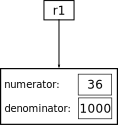
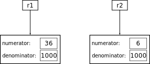

# 第六章：通过 OOPs 玩乐：面向对象的程序

> *我把物体描绘成我所思考的样子，而不是我所看到的。*
> 
> —巴勃罗·毕加索

## 6.1 介绍

在本章中，我们将开发我们自己的“杀手级应用”：一款名为“机器人对僵尸”的 3D 视频游戏。通过本章的学习，您将拥有开发各种交互式 3D 程序的工具，用于游戏、科学模拟或您能想象到的任何其他用途。

我们很狡猾！本章的*真正*目标是展示一个美丽而基本的概念，称为*面向对象编程*。面向对象编程不仅是 3D 图形和视频游戏中的秘密武器，它广泛用于大多数现代大型软件项目中。在本章中，您将了解一些面向对象编程的基本思想。是的，我们也会写那个视频游戏！

## 6.2 客观思考

在我们开始《机器人对僵尸》视频游戏之前，让我们想象一下以下情景。你是 Lunatix Games 的一名暑期实习生，这是一家主要的视频游戏开发商。他们其中一款热门游戏《Lunatix Lander》让玩家试图将太空飞船降落到行星表面。这需要玩家点火推进器以将太空飞船与着陆点对准，并减缓速度以达到合理的着陆速度。游戏会显示玩家剩余燃料量以及执行某些操作所需的燃料量。

当你测试游戏时，你会注意到它经常报告说没有足够的燃料来执行关键操作，而事实上，你确定应该有足够的燃料。你的任务是找出问题所在并找到解决方法。

火箭的两个燃料箱各自容量为 1000 单位；每个燃料箱的燃料计显示一个 0 到 1.0 之间的值，表示该箱中剩余容量与总容量的比例。这是你测试的一个示例，其中`fuelNeeded`表示执行操作所需的 1000 单位箱的比例，`tank1`和`tank2`表示两个燃料箱中各自容量的比例。最后一个语句是检查两个燃料箱中的燃料总量是否等于或超过执行操作所需的燃料量。

```
>>> fuelNeeded = 42.0/1000
>>> tank1 = 36.0/1000
>>> tank2 = 6.0/1000
>>> tank1 + tank2 >= fuelNeeded
False

```


*糟糕！*

注意到\(\frac{36}{1000} + \frac{6}{1000} = \frac{42}{1000}\)，而所需的燃料正好是\(\frac{42}{1000}\)。但奇怪的是，代码报告说没有足够的燃料来执行操作，导致飞船坠毁。

当你打印出`fuelNeeded`、`tank1`、`tank2`和`tank1 + tank2`的值时，你会发现问题所在：


*准确地说，不精确性是因为计算机仅使用固定数量的数据位来表示数据。因此，只能存储有限数量的不同量。特别是，浮点数的小数部分，即*尾数*，必须舍入为计算机可以存储的有限数量的值之一，导致我们在这里看到的意外行为类型的结果。*

```
>>> fuelNeeded
0.042000000000000003
>>> tank1
0.035999999999999997
>>> tank2
0.0060000000000000001
>>> tank1 + tank2
0.041999999999999996

```


*一个理性的事情！*

这个关于*数字不精确性*的例子是计算机试图将分数转换为浮点数（具有十进制表示的数字）时产生的固有误差的结果。然而，假设你的火箭上测量的所有量都是有理数——即分子和分母都是整数的分数——这个不精确性问题就可以避免！怎么做呢？整数不会受到不精确性的影响。因此，对于每个有理数，我们可以存储其整数分子和分母，然后使用整数进行所有算术运算。


*甚至是*它们全部的*一部分*。

例如，有理数\(\frac{36}{1000}\)可以存储为整数对\(36\)和\(1000\)，而不是将其转换为浮点数。要计算\(\frac{36}{1000} + \frac{6}{1000}\)，我们可以计算分子为\(36+6 = 42\)，分母为\(1000\)。将这与\(\frac{42}{1000}\)的`fuelNeeded`值进行比较，涉及分别比较分子和分母，涉及比较整数，因此不受数值不精确性的影响。

因此，如果 Python 有一种处理有理数的方法，将其作为整数对处理将会很好。也就是说，我们希望有一种“有理数”类型的数据（或*数据类型*，计算机科学家们喜欢这样称呼它），就像 Python 有整数数据类型、字符串数据类型和列表数据类型（以及其他类型）一样。此外，如果我们能够像处理整数一样轻松地进行这些有理数的算术和比较，那将会很好。

Python 的设计者不可能预测到程序员可能想要的所有不同数据类型。相反，Python（像许多其他语言一样）有一种很好的方式让你，程序员，定义自己的新类型，然后几乎和使用内置类型（如整数、字符串和列表）一样轻松地使用它们。

定义新类型数据的这种能力被称为*面向对象编程*或 OOP，这是本章的主题。

## 6.3 有理解决方案

让我们从定义有理数类型开始。为此，我们构建一个用于构造有理数的 Python“工厂”。这个工厂被称为*类*，看起来像这样：

```
class Rational:
    def __init__(self, num, denom):
        self.numerator = num
        self.denominator = denom

```

不要担心奇怪的语法；我们稍后将再次详细查看这一点。现在，大致的想法是一旦我们编写了这个 `Rational` 类（并将其保存在与文件名相同但以 `.py` 作为后缀的文件中，本例中为 `Rational.py`），我们就可以随心所欲地“制造”——或更准确地说是*实例化*——新的有理数。以下是调用此“工厂”来实例化两个有理数 \(\frac{36}{1000}\) 和 \(\frac{6}{1000}\) 的示例：

```
r1 = Rational(36, 1000)
r2 = Rational(6, 1000)

```

这里发生了什么？当 Python 看到指令

```
r1 = Rational(36, 1000)

```


*也许这是* Python 的 `self` *-ish。*

它做了两件事。首先，它实例化一个空对象，我们将其称为 `self`。实际上，`self` 是对此空对象的 *引用*，如图 6.1 所示。


图 6.1：`self` 指的是一个新的空对象。只是空了一会儿而已！

接下来，Python 查找名为 `__init__` 的函数的 `Rational` 类定义（请注意，“init” 一词之前和之后都有两个下划线字符）。这是一个有趣的名称，但这是 Python 中的一种约定。请注意，在上面的 `__init__` 定义中，该函数似乎接受 *三个* 参数，但是行 `r1 = Rational(36, 1000)` 只提供了 *两个*。这很奇怪，但是——您可能已经猜到——第一个参数由 Python 自动传递，并且是对我们刚刚实例化的新空 `self` 对象的引用。

`__init__` 函数获取我们称之为 `self` 的新空对象的引用，然后将一些数据添加到该对象中。值 \(36\) 和 \(1000\) 作为 `num` 和 `denom` 分别传递给 `__init__`。现在，当 `__init__` 函数执行行 `self.numerator = num` 时，它说：“进入由 `self` 引用的对象中，给它一个名为 `numerator` 的变量，并将该变量赋予作为 `num` 传入的值。” 类似地，行 `self.denominator = denom` 表示“进入由 `self` 引用的对象中，给它一个名为 `denominator` 的变量，并将该变量赋予作为 `denom` 传入的值。” 请注意，名称 `num`、`denom`、`numerator` 和 `denominator` 并不特殊——它们只是我们选择的名称。


*Python 使用“attributes”这个名称来表示属于类的变量。其他一些语言使用“数据成员”、“属性”、“字段”和“实例变量”等名称来表示相同的概念。*

`__init__` 函数中的变量 `numerator` 和 `denominator` 被称为 `Rational` 类的 `attributes`。一个类可以拥有您想为其定义的任意多个属性。很明显，有理数类至少必须有这两个属性！

行末的最后一件事

```
r1 = Rational(36, 1000)

```

现在变量`r1`被分配为对 Python 刚刚创建并初始化的对象的引用。我们可以如下查看有理数的内容：

```
>>> r1.numerator
36

```

当我们说`self.numerator = num`时，我们也在函数`__init__`中使用了“点”。在那里，“点”也在做同样的事情。它说，“进入`self`对象并查看名为`numerator`的属性。”图 6.2 现在显示了这种情况。



图 6.2：`r1`指向具有其`numerator`和`denominator`的`Rational`对象。

我们注意到，在本章的图中，我们以一种有些不同（更简单）的方式表示内存，而不是我们在第五章中使用的方式。例如，图 6.2 显示了分子和分母的值，就好像它们存储在变量内部一样。实际上，正如我们在第五章中看到的那样，整数值会存储在内存的其他位置，而变量将存储对这些值的引用。

在我们之前的例子中，我们两次“调用”`Rational`“工厂”来实例化下面示例中的两个不同有理数：

```
r1 = Rational(36, 1000)
r2 = Rational(6, 1000)

```

第一个调用，`Rational(36, 1000)`实例化了一个有理数，`self`，具有`numerator` \(36\) 和 `denominator` \(1000\)。这被称为`self`，但然后我们将`r1`赋给这个对象。同样，`r2.numerator`这一行是在说，“去到名为`r2`的对象并查看其名为`numerator`的属性。”重要的是要记住，由于`r1`和`r2`指向两个不同的对象，每个对象都有其“个人”的`numerator`和`denominator`。这在图 6.3 中显示。



图 6.3：具有引用`r1`和`r2`的两个`Rational`数。


*如果这就是整个故事，那这将是一个简短的章节！*

让我们回顾一下我们刚刚看到的内容。首先，我们定义了一个工厂——在技术上称为*类*——名为`Rational`。这个`Rational`类描述了制造一种新数据类型的模板。这个工厂现在可以用来实例化多种项目——在技术上称为*对象*——属于这种类型。每个对象都有自己的变量——或“属性”——在这种情况下是`numerator`和`denominator`，每个都有自己的值。

这很可爱，但这就是全部吗？记住，我们定义`Rational`数的动机是为了有一种方法来操作（相加、比较等）有理数，而不必将它们转换为浮点数世界，其中数值不精确可能会引起头痛（以及火箭失败等）。

Python 的内置数据类型（如整数、浮点数和字符串）具有可以相加、比较相等等功能。我们希望我们的`Rational`数也具有这些功能！我们将首先向`Rational`类添加一个函数，允许我们将一个 Rational 加到另一个上并返回和，这个和也将是一个`Rational`。在类内定义的函数有一个特殊的花哨名称——它被称为该类的*方法*。`__init__`方法被称为*构造方法*。

我们在`Rational`类中的`add`方法将像这样使用：

```
>>> r1.add(r2)

```

这应该返回一个`Rational`数，即`r1`和`r2`相加的结果。因此，我们应该能够写：

```
>>> r3 = r1.add(r2)

```

现在，`r3`将引用`add`方法返回的新`Rational`数。这里的语法可能一开始让你觉得有趣，但请容许我们；我们马上就会看到为什么这种语法是合理的。

让我们写这个`add`方法！如果`r1` \(= \frac{a}{b}\) 和 `r2` \(= \frac{c}{d}\) 那么 `r1+r2` \(= \frac{ad+bc}{bd}\)。请注意，由于分子和分母中可能有共同项，导致的结果分数可能会被简化，但现在我们不用担心这个。这里是带有全新`add`方法的`Rational`类：

```
class Rational:
    def __init__(self, num, denom):
        self.numerator = num
        self.denominator = denom

    def add(self, other):
        newNumerator = self.numerator * other.denominator +
                       self.denominator * other.numerator
        newDenominator = self.denominator*other.denominator
        return Rational(newNumerator, newDenominator)

```

这里发生了什么！？注意`add`方法接受两个参数，`self`和`other`，而我们上面的例子显示这个方法接受一个参数。 （停下来思考一下。这类似于我们之前看到的`__init__`方法。）

为了搞清楚这一切，让我们考虑以下顺序：

```
>>> r1 = Rational(1, 2)
>>> r2 = Rational(1, 3)
>>> r3 = r1.add(r2)

```

指令`r1.add(r2)`做了一些有趣的事情：它调用了`Rational`类的`add`方法。它似乎只传入`r2`到`add`方法，但这是一种视觉错觉！实际上，它传入了两个值：*首先*它*自动*传入了对`r1`的引用，*然后*传入了`r2`。这很棒，因为我们的`add`方法的代码期望两个参数：`self`和`other`。因此，`r1`进入`self`“槽”，`r2`进入`other`槽。现在，`add`方法可以对这两个`Rational`数进行操作，将它们相加，构造一个代表它们和的新`Rational`数，然后返回该新对象。


*“时髦”是一个技术术语。*

这是关键：考虑一些任意的类`Blah`。如果我们有一个类型为`Blah`的对象`myBlah`，那么`myBlah`可以使用`myBlah.foo(arg1, arg2, ..., argN)`的表示法调用一个名为`foo`的方法。方法`foo`将*首先*接收到对对象`myBlah`的引用，然后是所有显式传入的`N`个参数。Python 只知道第一个参数始终是自动传入的引用到“点”之前的对象。这种看似奇怪的系统之美在于方法由对象调用，方法“知道”哪个对象调用了它。时髦！

在执行上述一系列指令后，我们可以输入：

```
>>> r3.numerator
>>> r3.denominator

```

我们会看到什么？我们会看到`Rational`数`r3`的分子和分母。在这种情况下，分子将是\(5\)，分母将是\(6\)。

注意，与其在上面输入`r3 = r1.add(r2)`，我们可以输入`r3 = r2.add(r1)`。这里会发生什么？现在，`r2`将调用`add`方法，将`r2`传递给`self`，将`r1`传递给`other`。我们会得到与之前相同的结果，因为有理数的加法是可交换的。

## 6.4 重载


*“时髦”是另一个技术术语。*

到目前为止，我们已经构建了一个表示有理数的基本类。它既整洁又有用，但现在我们将使它更加时髦。

你可能注意到，添加两个`Rational`数的语法有点奇怪。当我们添加两个整数，比如\(42\)和\(47\)时，我们当然不会输入`42.add(47)`，而是输入`42+47`。

结果表明，我们也可以使用运算符“`+`”来相加`Rational`数！方法是：我们只需将我们的`add`方法更改为`__add__`。在单词`add`之前和之后有两个下划线字符。Python 有一个功能，它说“如果一个函数命名为`__add__`，那么当用户输入`r1 + r2`时，我将把它翻译成`r1.__add__(r2)`。” Python 如何知道这里的加法是`Rational`数的加法而不是整数的加法（这是内置的）？它只是看到`r1`是一个`Rational`，所以“`+`”符号必须表示`Rational`类中的`__add__`方法。我们也可以为其他类定义`__add__`方法，Python 将根据“`+`”符号前面的数据类型来确定应用哪个方法。


*这是“好”的重载。在一个学期中选修超过 18 学分则是“坏”的重载。*

这个特性被称为*重载*。

我们已经重载了“`+`”符号，赋予它根据使用环境而变化的含义。许多面向对象的编程语言支持重载，尽管不是所有的语言都支持。在 Python 中，重载加法只是冰山一角。Python 允许我们重载所有常规算术运算符以及所有比较运算符，如“`==`”、“`!=`”、“`<`”等等。

让我们思考一下关于比较有理数是否相等的问题。考虑以下情景，我们有两个不同的`Rational`对象，并将它们进行相等比较：

```
>>> r1 = Rational(1, 2)
>>> r2 = Rational(1, 2)
>>> r1 == r2
False

```


*“Blob”真的*是*一个技术术语！*

为什么 Python 说“`False`”？原因是尽管对于我们来说`r1`和`r2`*看起来*是一样的，但每一个都是指向*不同*对象的引用。这两个对象具有相同的内容，但它们仍然是不同的，就像两个相同的双胞胎是两个不同的人一样。另一种看待这个问题的方式是`r1`和`r2`指向不同的内存块，当 Python 看到它们询问`r1 == r2`时，它会说“不！这两个引用不是指向同一个内存位置的。”由于我们没有告诉 Python 如何以其他方式比较`Rational`，它只是比较`r1`和`r2`看它们是否指向完全相同的对象。

所以让我们“重载”“`==`”符号，使其对应于我们想要的比较函数。我们希望如果两个有理数的比值相同，即使它们的分子和分母不同，也被视为相等。例如\(\frac{1}{2} = \frac{42}{84}\)。一个测试相等的方法是使用我们在小学学到的“交叉乘法”方法：将一个分数的分子乘以另一个的分母，并检查这是否等于另一个分子乘以分母的乘积。让我们首先编写一个名为`__eq__`的方法，包含在我们的`Rational`数类中以测试相等性。

```
def __eq__(self, other):
    return self.numerator * other.denominator ==
           self.denominator * other.numerator

```

现在，如果我们有两个有理数，比如`r1`和`r2`，我们可以用`r1.__eq__(r2)`或者`r2.__eq__(r1)`来调用这个方法。但是因为我们用了特殊名称`__eq__`来命名这个方法，Python 会知道当我们写`r1 == r2`时，它应该被翻译成`r1.__eq__(r2)`。还有许多其他可以被重载的符号。（要查看 Python 乐意让你重载的方法的完整列表，请访问[`docs.python.org/2/reference/datamodel.html#special-method-names`](http://docs.python.org/2/reference/datamodel.html#special-method-names)。）


*这个例子再次强调了重载的美妙之处！*

例如，我们可以通过定义一个名为`__ge__`的方法（代表**g**reater than 或**e**qual）来重载“`>=`”符号。就像`__eq__`一样，这个方法接受两个参数：自动传入的调用对象的引用（`self`）和我们要进行比较的另一个对象的引用。因此，我们可以将我们的`__ge__`方法写成如下形式：

```
def __ge__(self, other):
    return self.numerator * other.denominator >=
           self.denominator * other.numerator

```

请注意，我们实现`__eq__`和`__ge__`方法之间只有微小的差异。花点时间确保您理解为什么`__ge__`起作��。


*我们希望您此时不感到过载。如果您对我们在这里所做的事情提出异议，我们会感到抱歉。*

最后，让我们重新审视我们在本章开始时遇到的原始燃料问题。回想一下，由于浮点数的数值不精确，我们曾经经历过任务失败：

```
>>> fuelNeeded = 42.0/1000
>>> tank1 = 36.0/1000
>>> tank2 = 6.0/1000
>>> tank1 + tank2 >= fuelNeeded
False

```

相比之下，我们现在可以使用我们新的`Rational`类来拯救任务！

```
>>>  fuelNeeded = Rational(42, 1000)
>>>  tank1 = Rational(36, 1000)
>>>  tank2 = Rational(6, 1000)
>>>  tank1 + tank2 >= fuelNeeded
True

```

任务完成！

## 6.5 打印一个对象

我们的`Rational`类现在非常有用。但是看看这个：


*0x6b918!? 这是什么鬼？！*

```
>>> r1 = Rational(1, 2)
>>> r2 = Rational(1, 3)
>>> r3 = r1 + r2
>>> r3
<Rational.Rational instance at 0x6b918>
>>> print(r3)
<Rational.Rational instance at 0x6b918>

```

注意当我们要求`r3`或尝试`print(r3)`时的奇怪输出。在这两种情况下，Python 告诉我们，“`r3`是一个`Rational`对象，我给它一个名为`0x`的特殊内部名称，等等，等等。”

实际上，至少当我们`print(r3)`时，我们希望 Python 以一种好看的方式显示数字，以便我们可以看到它！你可能还记得 Python 有一种方法，可以使用内置函数`str`将整数和浮点数转换为字符串。例如：

```
>>> str(1)
'1'
>>> str(3.142)
'3.142'

```

所以，由于`print`函数想要打印字符串，我们可以这样打印数字：

```
>>> print(str(1))
1
>>> print("My favorite number is " + str(42))
My favorite number is 42

```

实际上，其他 Python 类型如列表和字典也有`str`函数：

```
>>> myList = [1, 2, 3]
>>> print("Here is a very nice list: " + str(myList))
Here is a very nice list: [1, 2, 3]

```

Python 允许我们通过重载一个名为`__str__`的特殊方法为我们自己的类定义`str`函数。例如，对于`Rational`类，我们可以编写以下`__str__`方法：

```
def __str__(self):
    return str(self.numerator) + "/" + str(self.denominator)

```

这个函数返回什么？这是一个包含分子后跟分母的字符串。当我们输入`print(str(r3))`时，Python 将调用这个`__str__`方法。该函数首先调用`self.numerator`的`str`函数。这个调用`str(self.numerator)`是递归的吗？不是！由于`self.numerator`是一个整数，Python 知道在这里调用整数的`str`方法以获得该整数的字符串表示。然后，它将这个字符串与另一个包含斜杠`/`的字符串连接起来，表示分数线。最后，将分母的字符串表示连接到该字符串。现在，返回这个字符串。因此，在我们上面的运行示例中，`r3`是有理数\(\frac{5}{6}\)，我们可以如下使用我们的`str`方法：

```
>>> r3
<Rational.Rational instance at 0x6b918>
>>> print("Here is r3: "+str(r3))
Here is r3: 5/6

```

注意，在第一行当我们要求`r3`时，Python 只告诉我们它是一个`Rational`对象的引用。在第三行，我们要求将`r3`转换为字符串以在`print`函数中使用。顺便说一句，`__str__`方法有一个密切相关的名为`__repr__`的方法，你可以在网上阅读相关信息。

## 6.6 关于对象的一些补充说明

假设我们想要（出于某种原因）将`r1`的分子从当前值更改为 42。我们可以简单地输入

```
r1.numerator = 42

```

换句话说，`Rational`对象的内部可以被改变。换句话说，`Rational`类是可变的。（回想一下我们在第五章讨论的可变性。）*在 Python 中，我们自己定义的类是可变的（除非我们添加了特殊功能使其不可变）。*为了充分理解对象的可变性的重要性，请考虑以下一对函数：

```
def foo():
    r = Rational(1, 3)
    bar(r)
    print r

def bar(number):
    number.numerator += 1

```

当我们调用函数 `foo` 时会发生什么？注意，函数 `bar` 并不返回任何东西。然而，它接收到的变量 `number` 可能是一个 `Rational` 数，而 `foo` 会增加这个变量的 `numerator` 值。由于用户定义的类（如 `Rational`）是可变的，这意味着传入的 `Rational` 对象的 `numerator` 将被更改！

这实际上是如何工作的呢？注意，在函数 `foo` 中，变量 `r` 是对有理数 \(\frac{1}{3}\) 的引用。换句话说，这个 `Rational` 对象在计算机内存中的某个位置，而 `r` 是这块内存所在的地址。当 `foo` 调用 `bar(r)` 时，它将引用（内存位置）`r` 传递给 `foo`。现在，变量 `number` 引用了那个内存位置。当 Python 看到 `number.numerator += 1` 时，它首先访问 `number` 引用的内存地址，然后使用“点”来查看该对象的 `numerator` 部分，并将该值增加 1。当 `bar` 最终将控制权返回给调用函数 `foo` 时，`foo` 中的变量 `r` 仍然引用同一内存位置，但现在该内存位置的 `numerator` 已经被 `bar` 设置为新值。


*我们的法律团队反对我们在这里使用“一切”这个词，但它已经足够接近事实，所以我们就接受了。*

这带来了一个令人惊讶的事实：*Python 中的一切都是对象！*例如，Python 的列表数据类型就是一个对象。“等一下！”我们听到你惊叹道。“使用列表的语法看起来完全不像我们用于使用 `Rational` 的语法！”你说得有道理，但让我们仔细看看。

对于 `Rational` 的���况，我们必须通过以下方式创建一个新对象：

```
r = Rational(1, 3)

```

另一方面，我们可以更简单地创建一个新列表：

```
myList = [42, 1, 3]

```

事实上，你已经熟悉并喜爱的这种列表表示法只是 Python 设计者为我们提供的一种便利。实际上，这只是一个缩写：

```
myList = list()
myList.append(42)
myList.append(1)
myList.append(3)

```

现在，如果我们要求 Python 显示 `myList`，它会显示我们的列表是 `[42, 1, 3]`。注意，`myList = list()` 这一行类似于 `r = Rational(1, 3)`，只是我们没有为列表提供任何初始值。然后，列表类的 `append` 方法用于将项目附加到列表的末尾。列表是可变的，因此每个 `append` 都会改变列表！

实际上，列表类还有许多其他方法，你可以在网上了解到。例如，`reverse` 方法可以反转一个列表。以下是一个示例，基于我们之前创建的 `myList` 列表对象：

```
>>> myList
[42, 1, 3]
>>> myList.reverse()
>>> myList
[3, 1, 42]

```

注意，这个 `reverse` 方法并不返回一个新列表，而是改变了被调用的列表。

在继续之前，让我们稍微思考一下我们已经看到的关于合并两个列表的表示法：

```
>>> [42, 1, 3] + [4, 5]
[42, 1, 3, 4, 5]

```

你认为这里的“`+`”符号是如何工作的？你猜对了 - 这是列表类中的一个重载方法！也就是说，这是该类中的`__add__`方法！

字符串、字典，甚至整数和浮点数在 Python 中都是对象！然而，其中一些内置类型 - 如字符串、整数和浮点数 - 被设计为不可变的。回想一下前一章节中提到的，这意味着它们的内部不能被改变。你也可以定义自己的不可变对象，但这需要一些努力，而且很少是必要的，所以我们不会深入讨论。

## 6.7 使用面向对象编程进行图形化


*警告！本节包含图形化语言！*

我们已经看到面向对象编程是优雅的，希望你现在相信它是有用的。但是关于 3D 图形和我们的视频游戏呢？那就是我们接下来要去的地方！

要开始，你需要获取“Jupyter VPython” Python 3D 图形系统。你可以通过在命令提示符下运行`pip install vpython`来安装它。你还应该确保你安装了最新版本的 Anaconda。

安装了 VPython 后，从命令提示符运行`jupyter notebook`。一个窗口应该会在你的浏览器中弹出。在那个窗口中，选择右上角的新建按钮，然后在笔记本下选择 VPython。

在弹出的新窗口中，你需要按照以下方式导入``vpython：

```
>>> from vpython import *

```

接下来，在同一个单元格中，输入：

```
>>> b = box()

```

然后点击运行按钮。一个白色框应该会在单元格下方的一个小窗口中弹出（你输入的框）。如果你改变了代码并想要重新运行代码，你需要点击重新启动内核按钮（在运行按钮附近），然后点击弹出框中的红色重新启动按钮。然后等待右上角出现蓝色内核就绪消息，然后按运行。


*在显示窗口（显示盒子的地方），用鼠标右键点击并拖动（在 Macintosh 上按住命令键）。向左或向右拖动，你会围绕场景旋转。要围绕水平轴旋转，向上或向下拖动。用鼠标中键向上或向下拖动，可以使场景更近或更远（在 2 按钮鼠标上，按住左右按钮；在 1 按钮鼠标上，按住 Option 键）。*

现在你在屏幕上看到的是一个白色的盒子。它可能看起来更像一个白色的正方形，所以旋转它看看它实际上是一个 3D 对象。

正如你可能已经猜到的，`box`是在`vpython`模块中定义的一个类。命令

```
>>> b = box()

```

调用构造函数来创建一个新的`box`对象，我们让`b`成为该盒子的名称，或者更准确地说是“一个引用”。

就像我们的 `Rational` 数字类有 `numerator` 和 `denominator` 属性一样，`box` 类也有许多属性。其中包括盒子的长度、高度和宽度；它的位置、颜色，甚至材质属性。尝试在命令行中更改这些属性如下：

```
>>> b.length = 0.5  # the box's length just changed
>>> b.width = 2.0 # the box's width just changed
>>> b.height = 1.5  # the box's height just changed
>>> b.color = vector(1.0, 0.0, 0.0)  # the box turned red
>>> b.texture = textures.wood  # it's wood-grained!
>>> b.opacity = 0.42 # it's translucent!

```

当我们最初创建 `b = box()` 时，所有这些属性都具有“默认”值。`length`、`width` 和 `height` 属性都是 1.0，`color` 属性是白色，`textures` 属性是一个无聊的基本纹理。请注意，`box` 的一些属性相当明显：`length`、`width` 和 `height` 都是数字。然而，`color` 属性很奇怪。同样，`texture` 属性设置方式也很奇怪。让我们仔细看看其中一个属性，稍后您可以在 VPython 文档网站上阅读更多关于其他属性的信息。（您需要查阅‘Glowscript 文档’。如果您只搜索‘vpython 文档’，您只会找到 Classic VPython 的文档，这是 Jupyter VPython 的前身。）

清除您所在的单元格（除了导入语句）。让我们创建一个新的盒子，并通过运行以下代码询问 Python 其颜色属性：

```
>>> c = box()
>>> c.color
(1.0, 1.0, 1.0)

```

VPython 使用一个包含三个值的元组来表示颜色，每个值都介于 \(0.0\) 和 \(1.0\) 之间。元组中的三个元素分别表示对象颜色中的红色（从 \(0.0\)，即无色，到 \(1.0\)，即最大值），绿色和蓝色的量。


*如果您的室友看到您盯着手指看，只需解释您在做一些非常技术性的事情。*

因此，\((1.0, 1.0, 1.0)\) 意味着我们每种颜色都达到最大值，这相当于明亮的白色。元组 \((1.0, 0.0, 0.0)\) 是明亮的红色，元组 \((0.7, 0.0, 0.4)\) 是相当多的红色和较少的蓝色的混合。

`box` 类还有一个名为 `pos` 的属性，用于存储盒子中心的位置。VPython 使用的坐标系是所谓的“右手”坐标系：如果你伸出右手，将拇指、食指和中指垂直放置，手掌朝向你，正 \(x\) 轴是你的拇指，正 \(y\) 轴是你的食指，正 \(z\) 轴是你的中指。


*当您使用鼠标旋转场景时，实际上是在旋转整个坐标系。*

换句话说，在您用鼠标开始在显示窗口中旋转之前，水平轴是 \(x\) 轴，垂直轴是 \(y\) 轴，\(z\) 轴指向屏幕外。

通过添加对 `c.pos` 的调用来查看盒子的位置。当您重新运行代码时，您会看到这个：

```
>>> c.pos
<0.000000, 0.000000, 0.000000>

```


*向量类也被称为线性代数吗？*

VPython 有一个名为 `vector` 的类，而 `pos` 是这种类型的对象，我们可以通过向量表示法得知。好极了！`box` 类是使用 `vector` 类定义的。在 `box` 类内部使用 `vector` 类非常优雅！“好吧，”我们听到你勉强承认，“但是`vector` 有什么用？我们为什么不能只使用元组或列表呢？”事实是：`vector` 类中定义了一些用于执行向量操作的方法。例如，`vector` 类有一个重载的加法运算符用于将两个向量相加：

```
>>> v = vector(1, 2, 3)
>>> w = vector(10, 20, 30)
>>> v + w
<11.000000, 22.000000, 33.000000>

```

这个类还有许多其他向量操作。例如，`norm()`方法返回一个指向相同方向但大小（长度）为 1 的`vector`：

```
>>> u = vector(1, 1, 0)
>>> u.norm()
<0.707107, 0.707107, 0.000000>

```


*请查看 VPython 网站上丰富的其他向量操作，以便对你的 i 加点和你的 t 划线，或者更准确地说，对你的标量加点和你的向量划线！*

所以，虽然我们*可以*用列表表示向量，但我们没有一个好方法来进行添加、`norm`化和执行向量喜欢做的所有其他操作。

但是，我们现在的目标是改变我们盒子的 `pos` 向量以便移动它。例如，我们可以这样做：

```
>>> c.pos = vector(0, 1, 2)

```

虽然我们总是可以创建一个盒子然后稍后更改它的属性，但有时仅在盒子首次实例化时设置盒子的属性更方便。`box` 类构造函数允许我们在构造时设置属性值，像这样：

```
>>> d = box(length = 0.5, width = 2.0, height = 1.5, color = vector(1.0, 0.0, 0.0))

```

无论我们是否指定属性，它们都会得到默认值。例如，由于我们没有为 `pos` 指定一个向量值，盒子的初始位置将是原点。

VPython 除了盒子外还有许多其他形状类，包括球体、圆锥体、圆柱体等。虽然这些对象有其自己特定的属性（例如球体有一个半径），但所有 VPython 对象共享一些有用的方法。其中一个方法称为 `rotate`。毫不奇怪，这个方法旋转其对象。让我们试试 `rotate`！

试试将上面定义的盒子 `b` 用在这个上面：

```
>>> d.rotate(angle=pi/4)

```

我们要求 VPython 将盒子 `b` 旋转 \(\frac{\pi}{4}\) 弧度。默认情况下，旋转是关于 \(x\) 轴的弧度。

现在，让我们把这些组合起来，写几个简短的 VPython 程序，来展示我们的 3D 图形技能。首先，让我们写一个*非常*简短的程序，永远旋转一个红色的盒子（在复制此代码之前清空您的单元格）：

```
from vpython import *

def spinBox():
    myBox = box(color = vector(1.0, 0.0, 0.0))
    while True:
        # Slow down the animation to 60 frames per second.
        # Change the value to see the effect!
        rate(60)
        myBox.rotate(angle=pi/100)

```

第二，请看下面的程序。在运行之前试着弄清楚它在做什么。

```
from vpython import *
import random

def spinboxes():
    boxList = []
    for boxNumber in range(0,10):
        x = random.randint(-5,5)
        y = random.randint(-5,5)
        z = random.randint(-5,5)
        red = random.random()       # random number between 0 and 1
        green = random.random()     # random number between 0 and 1
        blue = random.random()      # random number between 0 and 1
        newBox = box()
        newBox.pos = vector(x, y, z)
        newBox.color = vector(red, green, blue)
        newBox.axis =
        random.choice([vector(1,0,0),vector(0,1,0),vector(0,0,1)]) # makes boxes rotate in random directions
        boxList.append(newBox)
    # the physics loop, which updates the world
    while True:
        rate(60)
        for myBox in boxList:
            myBox.rotate(angle=pi/100)
spinboxes()

```

这非常酷！我们现在有一个对象列表，我们可以遍历该列表并旋转其中的每一个。

## 6.8 机器人和僵尸，终于！

是时候制作我们的视频游戏了！我们游戏的前提是，我们将控制一个机器人在一个由僵尸群居住的圆盘表面（一个大平面圆柱体）上移动。玩家将通过一个由你制作的 GUI（图形用户界面）控制机器人的方向！我们的 GUI 应该包括以下内容：两个按钮用于加速和减速机器人，两个按钮用于左右转动机器人，以及一个按钮用于退出程序。（我们将为您提供 GUI 的代码，以便我们可以专注于制作我们的机器人和外星人。）与此同时，每个僵尸将独立地移动和转向随机量。

该程序将处于一个无限循环中。在每一步中，玩家的机器人将向前迈出一小步。按钮将同时控制机器人的转向量。同样，每个僵尸将转动一个随机量，然后向前迈出一小步。我们的游戏没有特定的目标，但如果您愿意，可以稍后添加一个。也许，目标是尽可能撞到尽可能多的僵尸 - 或者避开它们。

要开始，我们希望定义一个玩家机器人类，我们将用它来制造（“实例化”）玩家的机器人，以及另一个类，允许实例化僵尸。定义一个僵尸*类*是特别有意义的，因为一个类允许我们实例化许多*对象* - 而我们确实计划有许多僵尸！

实际上，玩家的机器人和僵尸有很多共同之处。它们都是 3D 实体，应该能够向前移动和转向。由于这种共性，如果我们完全分别定义一个机器人类和一个僵尸类，我们将会重复很多工作。另一方面，这两个类不会完全相同，因为玩家的机器人看起来与僵尸不同（我们希望如此），而且机器人将由玩家控制，而僵尸将自行移动。

所以，这里是关键思想：我们将定义一个类 - 让我们称之为`GenericBot` - 它具有我们游戏中任何实体 - 玩家机器人或僵尸 - 应该具有的所有属性。然后，我们将定义一个`PlayerBot`类和一个`ZombieBot`类，它们都“继承”了`GenericBot`的所有属性和方法，并*添加*了特殊的额外内容（例如，它们的外观如何）来区分它们。

我们的`GenericBot`类将有一个构造函数，一个`__init__`方法，它以机器人的初始位置、初始朝向（指向的方向）和速度（当我们要求它向前移动时每步移动的大小）作为输入。以下是代码；我们将在下面详细解释。

```
from vpython import *
import math
import random

class GenericBot:
    def __init__(self, position = vector(0, 0, 0),
                 heading = vector(0, 0, 1), speed = 1):
        self.position = position
        self.heading = heading.norm()
        self.speed = speed
        self.parts = []

    def update(self):
        self.turn(0)
        self.forward()

    def turn(self, angle):
        # convert angle from degrees to radians (VPython
        # assumes all angles are in radians)
        theta = math.radians(angle)
        self.heading = rotate(self.heading, angle = theta, axis = vector(0, 1, 0))
        for part in self.parts:
            part.rotate(angle = theta, axis = vector(0, 1, 0),
                        origin = self.position)

    def forward(self):
        self.position += self.heading * self.speed
        for part in self.parts:
            part.pos += self.heading * self.speed

```

让我们从`__init__`方法开始 - 所谓的“构造函数”方法。它接受三个输入参数：一个`position`（一个 VPython `vector`对象，表示机器人的初始位置），一个`heading`（一个表示机器人初始指向的向量），和`speed`（一个表示机器人在每次更新步骤时移动多远的数字）。请注意以下行：

```
def __init__(self, position = vector(0, 0, 0),
             heading = vector(0, 0, 1), speed = 1):

```

为这些输入提供了*默认值*。这意味着如果用户没有为这些输入参数提供值，输入将被设置为这些值。（您可能还记得 `box` 类也有默认参数。我们可以用 `b = box()` 来定义一个新的盒子，这样我们就得到了默认值，或者我们可以为这些参数指定我们自己的值。）如果用户只提供了一些输入参数，Python 将假定它们是从左到右的参数。例如，如果我们输入

```
>>> mybot = GenericBot(vector(1, 2, 3))

```

然后 Python 假设 `vector(1, 2, 3)` 应该进入 `position` 变量，并使用 `heading` 和 `speed` 的默认值。如果我们输入

```
>>> mybot = GenericBot(vector(1, 2, 3), vector(0, 0, 1))

```

然后第一个向量进入 `position` 参数，第二个进入 `heading` 参数。如果我们想提供违反从左到右顺序的值，我们总是可以告诉 Python 我们正在引用哪个值，就像这样：

```
>>> mybot = GenericBot(heading=vector(0, 1, 0))

```


*这是作者的责任！*

现在，Python 设置了给定值的 `heading` 并使用其他参数的默认值。

好了，就这么多了！`__init__` 方法然后设置它的位置（`self.position`）、朝向（`self.heading`）、速度（`self.speed`）和部件（`self.parts`）属性。`self.heading` 被规范化为使向量的长度成为单位向量（长度为 1 的向量），使用 `vector` 类的 `norm()` 方法。`self.parts` 列表将是由 VPython 3D 对象组成的列表 - 盒子、球体等等 - 构成机器人的主体。因为玩家机器人和僵尸机器人看起来会有所不同，所以我们还没有将这些身体部件放入列表中。这很快就会到来！

注意 `GenericBot` 还有三个额外的方法：`update`、`forward` 和 `turn`。事实上，`update` 方法简单地调用 `turn` 方法将机器人转向 0 弧度（我们可能以后会更改！），然后调用 `forward` 方法以给定的速度移动一步。`turn` 方法改变机器人的 `self.heading`，使其朝着由转向角引起的新方向前进，然后旋转机器人的 `self.parts` 列表中的每个部分相同的角度。

在 `turn` 方法的 `for` 循环中发生了一些**非常可爱**和微妙的事情！注意每个 `part` 都预期是一个 VPython 对象，像一个 `box` 或 `sphere` 或其他什么东西。每个对象都有一个 `rotate` 方法。Python 在这里说 “嘿 `part`，弄清楚你是什么类型的对象，然后调用你的 `rotate` 方法来旋转自己。” 所以，如果第一个 `part` 是一个 `box`，那么这将调用 `box` 的 `rotate` 方法。如果下一个部分是一个 `sphere`，那么这里将调用 `sphere` 的 `rotate` 方法。只要 `self.parts` 列表中的每个元素都有一个 `rotate` 方法，这一切都会很好地运行。幸运的是，所有 VPython 形状都有一个 `rotate` 方法。

我们也会快速指出一下这一行

```
part.rotate(angle = theta, axis = vector(0, 1, 0),
            origin = self.position)

```

告诉 `part` 绕与 `vector` `(0, 1, 0)`（即 \(y\)-轴）对齐的向量以 `theta` 角度旋转，但起始于 `self.position` 给定的向量。在我们假设 \(y\)-轴为“上”的情况下，这实际上使对象围绕一条从“脚到头”的中心线旋转。也就是说，它使身体部件以我们希望的方式旋转，而不是默认的围绕 \(x\)-轴旋转。

`forward` 方法通过将 `heading` 向量按照机器人的 `self.speed` 缩放添加到机器人的 `self.position` 向量中来改变机器人的位置。请注意，`self.position` 只是机器人自己对自己所在位置的概念。我们还需要移动机器人身体的所有部件，这是通过将 `self.parts` 列表中每个 VPython 对象的 `pos` 位置向量再次按照 `self.heading` 向量缩放 `self.speed` 来完成的。


*请鼓掌！*

接下来是整个过程中最令人惊奇的部分！我们现在定义了 `ZombieBot` 类，*继承* 了 `GenericBot` 的所有方法和属性，但添加了特定于僵尸的组件。以下是代码，我们稍后会讨论它。

```
class ZombieBot(GenericBot):
    def __init__(self, position = vector(0, 0, 0),
                 heading = vector(0, 0, 1)):
        GenericBot.__init__(self, position, heading)
        self.body = cylinder(pos = self.position,
                             axis = vector(0, 4, 0),
                             radius = 1,
                             color = vector(0, 1, 0))
        self.arm1 = cylinder(pos = self.position + vector(0.6, 3, 0),
                             axis = vector(0, 0, 2),
                             radius = .3,
                             color = vector(1, 1, 0))
        self.arm2 = cylinder(pos = self.position + vector(-0.6, 3, 0),
                             axis = vector(0, 0, 2),
                             radius = .3,
                             color = vector(1, 1, 0))
        self.halo = ring(pos = self.position + vector(0, 5, 0),
                             axis = vector(0, 1, 0),
                             radius = 1,
                             color = vector(1, 1, 0))
        self.head = sphere(pos = self.position + vector(0, 4.5, 0),
                             radius = 0.5,
                             color = vector(1, 1, 1))
        self.parts = [self.body, self.arm1, self.arm2,
                      self.halo, self.head]

    def update(self):
        # call turn with a random angle between -5 and 5
        # degrees
        self.turn(random.uniform(-5, 5))
        self.forward()

```

类定义以以下行开始：`class ZombieBot(GenericBot)`。括号中的 `GenericBot` 告诉 Python “这个类继承自 `GenericBot`”。换句话说，`ZombieBot` “是一种” `GenericBot`。具体来说，这意味着 `ZombieBot` 具有 `GenericBot` 的 `__init__`、`update`、`turn` 和 `forward` 方法。类 `GenericBot` 被称为 `ZombieBot` 的 *超类*。同样，`ZombieBot` 被称为 `GenericBot` 的 *子类* 或 *派生类*。

注意，`ZombieBot` 有自己的 `__init__` 构造方法。如果我们没有定义这个 `__init__`，那么每次我们构造一个 `ZombieBot` 对象时，Python 会自动调用 `ZombieBot` 继承自的超类 `GenericBot` 中的 `__init__`。然而，由于我们为 `ZombieBot` 定义了一个 `__init__` 方法，当我们实例化一个 `ZombieBot` 对象时，该方法将被调用。并不是说 `GenericBot` 的构造方法对我们没用，但我们还想做一些其他事情。具体来说，我们想用 VPython 形状填充身体部件列表 `self.parts`，构成一个僵尸。

我们通过首先让 `ZombieBot` 的 `__init__` 方法调用 `GenericBot` 的 `__init__` 方法来一举两得。这是通过 `GenericBot.__init__(self, position, heading)` 调用的。这是在说，“嘿，我知道我是一个 `ZombieBot`，但这意味着我是一种 `GenericBot`，因此，我可以调用任何 `GenericBot` 方法来帮助。特别是，由于 `GenericBot` 已经有一个做一些有用事情的 `__init__` 方法，我将调用它来设置我的 `position` 和 `heading` 属性。”

在调用`GenericBot`构造函数之后，`ZombieBot`构造函数继续自己做一些事情。 特别是，它定义了一些 VPython 对象，并将它们放在身体部件的`parts`列表中。 你可能注意到所有这些身体部位都是相对于`ZombieBot`的`position`定位的 - 这只是一个我们定义的向量，用于跟踪机器人在空间中的位置。

由于`ZombieBot`继承自`GenericBot`，它自动具有在`GenericBot`类中定义的`update`、`turn`和`forward`方法。 `turn`和`forward`方法都很好，但是`update`方法需要替换为随机转动`ZombieBot`。 因此，我们在`ZombieBot`类中提供了一个新的`turn`方法。

现在，想象我们做了以下操作：

```
>>> zephyr = ZombieBot()
>>> zephyr.update()

```

第一行创建了一个新的`ZombieBot`对象。 由于我们没有为构造函数提供任何输入，因此使用默认值，并且僵尸“zephyr”位于位置（0，0，0）并且朝向（0，0，1）。 第二行告诉“zephyr”更新自己。 Python 检查`ZombieBot`类是否包含一个`update`方法。 它确实包含，因此调用该方法。 该方法然后使用随机角度调用`turn`方法，角度范围为-5 至 5 度。 Python 检查`ZombieBot`类是否有自己的`turn`方法。 由于没有，Python 转到超类`GenericBot`，并在那里查找一个`turn`方法。 那里有一个，就是使用的！ 接下来，`update`方法调用`forward`方法。 由于在`ZombieBot`中没有定义`forward`方法，Python 再次转到超类并在那里使用`forward`方法。

这里非常好的一点是，`ZombieBot`从其派生的超类继承了许多东西，并且只更改了 - 或 *覆盖* - 那些它需要为僵尸自定义的方法。

现在，我们可以为玩家的机器人做类似的事情：

```
class PlayerBot(GenericBot):
    def __init__(self, position = vector(0, 0, 0),
                 heading = vector(0, 0, 1)):
        GenericBot.__init__(self, position, heading)
        self.body = cylinder(pos = self.position + vector(0, 0.5, 0),
                               axis = vector(0, 6, 0),
                               radius = 1,
                               color = vector(1, 0, 0))
        self.head = box(pos = vector(0, 7, 0) + self.position,
                               length = 2,
                               width = 2,
                               height = 2,
                               color = vector(0, 1, 0))
        self.nose = cone(pos = vector(0, 7, 1) + self.position,
                               radius = 0.5,
                               axis = vector(0, 0, 1),
                               color = vector(1, 1, 0))
        self.wheel1 = cylinder(pos = self.position + vector(1, 1, 0),
                               axis = vector(0.5, 0, 0),
                               radius = 1,
                               color = vector(0, 0, 1))
        self.wheel2 = cylinder(pos = self.position + vector(-1, 1, 0),
                               axis = vector(-0.5, 0, 0),
                               radius = 1,
                               color = vector(0, 0, 1))
        self.parts = [self.body, self.head, self.nose,
                      self.wheel1, self.wheel2]

    def update(self):
        self.turn(0) # we'll leave the turn handling up to our buttons...
        self.forward()

```

`PlayerBot`类也继承自`GenericBot`类。 它再次调用`GenericBot`的构造函数来帮助初始化一些属性，然后定义自己的属性。 它使用超类的`turn`和`forward`方法，虽然`update`方法没有任何不同，但它提醒我们机器人的输入来自 GUI 部分的按钮处理程序。

回想一下，不久之前我们注意到所有的 Python 形状都有一个`rotate`方法。 这是因为所有这些形状 - 矩形、球体、圆柱体、圆锥体和其他形状 - 都继承自一个形状超类，该超类定义了一个`rotate`方法。 因此，它们都“知道”如何旋转，因为它们从它们的父类那里继承了那个“知识”。 那个父类有许多功能 - 方法和属性 - 它的子类需要，就像我们的`GenericBot`类有子类`ZombieBot`和`PlayerBot`使用的功能一样。

最后，这是我们的游戏！在这个文件中，我们导入了`vpython`图形包；包含`GenericBot`、`ZombieBot`和`PlayerBot`类的`robot.py`文件，以及`random`和`math`包。`main`函数实例化了一个大的平面 VPython 圆柱体对象，我们将其命名为`ground`，这是机器人移动的表面。其半径由全局变量`GROUND_RADIUS`给出。然后我们实例化了一个名为`player`的单个`PlayerBot`，并调用一个名为`makeZombies`的辅助函数，该函数实例化了许多僵尸（数量由全局变量`ZOMBIES`给出），并返回一个在我们的圆柱形游戏区域上随机位置的`ZombieBot`对象列表。最后，`main`函数进入一个无限循环。在每次迭代中，我们检查玩家位置是否超出了游戏区域的半径，如果是，则将机器人旋转 180 度，以便其下一步有望在玩家区域内。现在，每个僵尸都通过调用其`update`方法进行更新。同样，在这里，如果僵尸走出了游戏区域，我们会随机旋转它（180 度加减 30 度）。然后，我们还包括了自己的代码来读取用户输入（我们这里不详细介绍）。所以，大功告成！

```
from vpython import *
from robot import *
import random
import math
import ipywidgets as widgets

# variable declarations
global userbot
global running
running = True
GROUND_RADIUS = 50
ZOMBIES = 20

# declare our buttons
fastButton = widgets.Button(description = 'F', width = '60px', height = '60px')
slowButton = widgets.Button(description = 'S', width = '60px', height = '60px')
leftButton = widgets.Button(description = 'L', width = '60px', height = '60px')
rightButton = widgets.Button(description = 'R', width = '60px', height = '60px')
fillerButton0 = widgets.Button(description = '', width = '60px', height = '60px')
resetButton = widgets.Button(description = 'Reset', width = '120px', height = '60px')
quitButton = widgets.Button(description = 'Quit', width = '120px', height = '60px')
fillerButton1 = widgets.Button(description = '', width = '120px', height = '60px')
scene.caption = "To use the directional pad, click on a marked direction. F = Faster, S = Slower, L = turn Left and R = turn Right."

# These functions set up our buttons to read in inputs
def fastButton_handler(s):
    global userbot
    userbot.speed += 0.1
fastButton.on_click(fastButton_handler)

def slowButton_handler(s):
    global userbot
    userbot.speed -= 0.1
slowButton.on_click(slowButton_handler)

def leftButton_handler(s):
    global userbot
    userbot.turn(5)
leftButton.on_click(leftButton_handler)

def rightButton_handler(s):
    global userbot
    userbot.turn(-5)
rightButton.on_click(rightButton_handler)

def quitButton_handler(s):
    global running
    running = False
    print("Exiting the main loop. Ending this vPython session...")
quitButton.on_click(quitButton_handler)

# now arrange and display our GUI
container0 = widgets.HBox(children = [fillerButton0, fastButton, fillerButton0, quitButton])
container1 = widgets.HBox(children = [leftButton, fillerButton0, rightButton, fillerButton1])
container2 = widgets.HBox(children = [fillerButton0, slowButton, fillerButton0, fillerButton1])
display(container0)
display(container1)
display(container2)

def main():
    global userbot
    global running
    ground = cylinder(pos = vector(0, -1, 0),
                      axis = vector(0, 1, 0),
                      radius = GROUND_RADIUS)
    userbot = PlayerBot()
    zombies = makeZombies()
    while running:
        rate(30)
        userbot.update()
        if mag(userbot.position) >= GROUND_RADIUS:
            userbot.turn(180)
        for z in zombies:
            z.update()
            if mag(z.position) >= GROUND_RADIUS:
                z.turn(random.uniform(150, 210))

def makeZombies():
    zombies = []
    for z in range(ZOMBIES):
        theta = random.uniform(0, 360)
        r = random.uniform(0, GROUND_RADIUS)
        x = r * cos(math.radians(theta))
        z = r * sin(math.radians(theta))
        zombies.append(ZombieBot(position = vector(x, 0, z)))
    return zombies
main()

```

## 6.9 结论


*我想“yucky”可能是另一个技术术语。*

这一切都非常棒，但为什么面向对象编程如此重要呢？正如我们在`Rational`示例中看到的，面向对象编程的一个好处是它允许我们定义新的数据类型。你可能会说，“当然，但我可以将有理数表示为两个项目的列表或元组，然后我可以编写用于比较、加法等操作的函数，而不使用任何类的东西。” 你是完全正确的，但这样一来，你就向用户暴露了很多不想知道的细节。例如，用户需要知道有理数被表示为列表或元组，并且需要记住使用您的比较和加法函数的约定。面向对象编程的一个美妙之处在于，所有这些“糟糕的”细节（更准确地说是“实现细节”）都被*隐藏*，为用户提供了在使用和实现有理数之间的*抽象层*。

抽象层？！*那*是什么意思？想象一下，每次你坐在汽车驾驶座上时，你都必须完全了解发动机、变速箱、转向系统和电子设备的各种组件才能操作汽车。幸运的是，汽车设计师为我们提供了一个很好的抽象层：方向盘、踏板和仪表盘。现在我们可以在不必考虑低级细节的情况下对我们的汽车进行有趣的操作。作为驾驶员，我们不需要担心转向系统是否使用齿轮齿条或完全不同的东西。这正是类为我们提供的。类的内部工作安全地“藏在引擎盖下”，如果需要的话可以使用，但不是关注的中心。类的用户不需要担心实现细节；他或她只需使用提供的方便和直观的方法。顺便说一句，你的类的“用户”往往是你自己！当你使用类时，你也不想被实现细节所困扰——在那时，你更愿意思考更大更好的事情。

面向对象设计是计算机科学版本的*模块化设计*，这是工程师们很早就开创并取得巨大成功的一个概念。类就是模块。它们封装了逻辑功能，使我们能够推理和使用该功能，而无需始终跟踪程序的每个部分。此外，一旦我们设计了一个良好的模块/类，我们可以在许多不同的应用程序中重复使用它。

最后，在我们的机器人和僵尸游戏中，我们看到了继承的重要概念。一旦我们构建了一个类，我们可以编写特殊版本，继承“父类”或超类的所有方法和属性，但也可以添加自己独特的特性。在大型软件系统中，类之间可以形成一个庞大而深入的*层次结构*：一个类有继承自它的子类，这些子类又有它们自己的子类，依此类推。这种设计方法允许我们在重用代码而不是重写代码方面效率极高。

**主要观点**：*类——面向对象设计和程序的构建模块——为我们提供了一种提供抽象的方式，使我们能够专注于使用这些构建模块，而不必担心它们的内部工作细节。此外，一旦我们拥有一个良好的构建模块，我们可以在各种不同类型的程序中反复使用它。*
