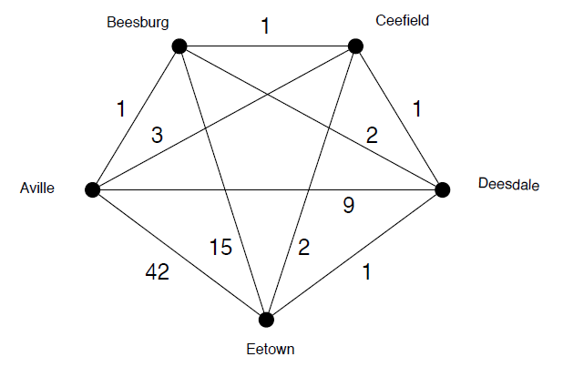
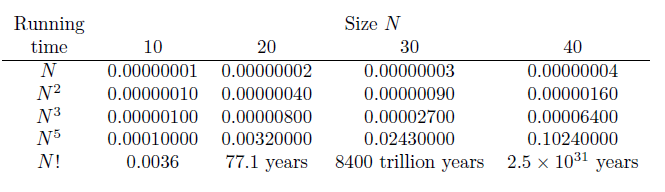
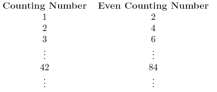
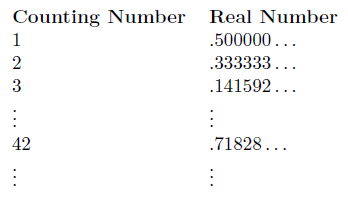
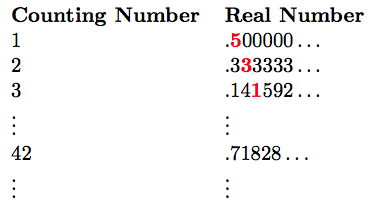
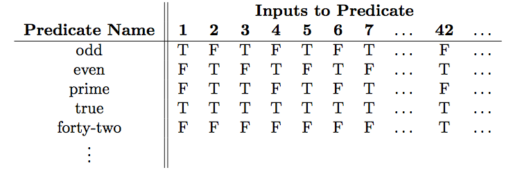
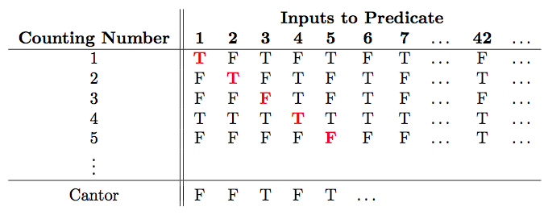

# 第七章：问题有多难？

> *认为你可以仅仅靠土豆解决任何重大问题是错误的。*
> 
> —道格拉斯·亚当斯

## 7.1 永不停止的程序

你很可能曾经编写过一个没有按预期工作的程序。我们中的许多人都有过特别令人沮丧的经历，运行我们的新程序，并观察到它似乎运行了很长时间，但没有产生我们期望的输出。“嗯，它现在已经运行了将近一分钟。我应该停止程序吗？或者，也许，既然我已经投入了这么多时间，我应该再给程序一分钟，看看它是否会完成，”你对自己说。又过了一分钟，你问自己是否应该让它运行更长时间还是现在退出。最终，你可能会决定程序可能被卡在某种循环中，不会停止运行，所以你按下 Control-C，程序停止了。但你不禁想，也许程序距离给出正确答案只有一步之遥。毕竟，问题可能只是本质上需要大量的计算时间。

有没有一种方法可以检查你的程序最终会停机？


*这个问题的答案是“是的！”当然，那将是很好的！*

然后，如果你知道你的程序不会停机，你可以开始调试它，而不是浪费时间看着它一直运行。

事实上，或许我们甚至可以编写一个程序，让我们称之为“停机检查器”，它将*任何*程序作为输入，简单地返回一个布尔值：如果输入程序最终停机，则返回`True`，否则返回`False`。回顾第三章，函数可以接受其他函数作为输入。因此，给出假设的停机检查器函数另一个函数作为输入并不是什么奇怪的事情。但是，如果你对这个想法不太放心，另一个选择是我们将给停机检查器一个字符串作为输入，该字符串将包含我们想要检查的 Python 函数的代码。然后，停机检查器将以某种方式确定该字符串中的函数是否最终停机。

例如，考虑以下我们称之为`myProgram`的字符串：

```
myProgram = 'def foo(): \
 return foo()'

```

这个字符串包含了名为`foo`的函数的 Python 代码。显然，该函数永远运行，因为该函数递归地调用自身，并且没有基本情况来停止它。因此，如果我们运行我们假设的`haltChecker`函数，它应该返回`False`：

```
>>> haltChecker(myProgram)
False

```

我们如何编写这样一个停机检查器？对于某些明显的问题，比如上面示例中程序`foo`中的问题，检查起来是很容易的。但似乎很难编写一个能够可靠评估*任何*我们给定的可能程序的停机检查器。毕竟，有些程序非常复杂，包含各种递归、`for`循环、`while`循环等。编写这样一个停机检查器程序可能吗？实际上，在本章中，我们将展示这个问题在计算机上是不可能解决的。也就是说，不可能编写一个停机检查器程序，告诉我们*任何*其他程序最终是否会停机。

如何能说这是不可能的！？这似乎是一个不负责任的说法。毕竟，仅仅因为还没有人成功地编写出这样的程序，就不能得出这是不可能的结论。你说得有道理 - 我们同意！然而，编写一个真正的停机检查器的任务确实是*不可能*的 - 它现在不存在，将来也永远不会存在。在本章中，我们将能够毫无疑问地证明这一点。

## 7.2 三种问题：简单、困难和不可能。

计算机科学家对衡量计算问题的“难度”感兴趣，以了解解决问题需要多少时间（或内存，或其他宝贵资源）。一般来说，时间是最宝贵的资源，所以我们想知道解决一个给定问题需要多少时间。粗略地说，我们可以将问题分为三类：“简单”、“困难”或“不可能”。


*请记住，“算法”是一种计算配方。它比“程序”更一般，因为它不特定于 Python 或任何其他语言。然而，程序实现了一个算法。*

“简单”问题是指存在一个程序 - 或算法 - 足够快，以至于我们可以在合理的时间内解决问题。到目前为止，在本书中我们考虑的所有问题都属于这种类型。我们在这里编写的程序没有花费几天或几年的计算机时间来解决。这并不是说我们作为计算机科学家总是很容易想出这个程序。这并不是我们在这个上下文中所说的“简单”的意思。相反，我们的意思是存在一个算法，运行速度足够快，问题可以在合理的时间内解决。你可能会问，“你所说的*合理*是什么意思？”这是一个合理的问题，我们很快会回到这个问题。

相比之下，“困难”问题是指我们可以找到一个解决方案的算法，但我们找到的每个算法都太慢了，以至于使程序几乎无用。正如我们在本章开头所暗示的，“不可能”问题确实就是那样 - 无论我们愿意让计算机花多少时间来解决它们，都是绝对、可以证明的不可能解决的！

### 7.2.1 简单问题

考虑将一个包含\(N\)个数字的列表，并找到该列表中最小的数字的问题。一个简单的算法只需“巡航”整个列表，记录迄今为止看到的最小数字。我们最终会查看列表中的每个数字一次，因此找到最小数字所需的步骤数量大约为\(N\)。计算机科学家会说，这个算法的运行时间“与\(N\)成比例增长”。

在第五章中，我们开发了一个名为*选择排序*的算法，用于按升序对项目进行排序。如果你不记得了，不用担心。简而言之，它的工作原理是这样的：想象一下我们有一个包含\(N\)个项目的列表 - 为简单起见，我们假设它们是数字 - 并且它们以任意顺序给出。我们的目标是将它们从小到大排序。在第五章中，我们需要这个排序算法作为我们音乐推荐系统中的一个步骤。

*选择排序*算法的工作原理如下。首先，它“巡航”整个列表，寻找最小的元素。正如我们刚才观察到的，这大约需要\(N\)步。现在算法知道了最小的元素，并通过简单地交换列表中的第一个元素和列表中的最小元素，将该元素放在列表的第一个位置。（当然，可能第一个元素就是列表中的最小元素，在这种情况下，这种交换实际上什么也没做 - 但无论如何，我们保证列表中的第一个元素现在是列表中的正确最小元素。）

在算法的下一个阶段，我们正在寻找列表中第二小的元素。换句话说，我们正在寻找列表中排除了现在已知为列表中第一个最小元素的第一个位置的元素的最小元素。因此，我们可以从列表中的第二个元素开始“巡航”，这个第二阶段将需要\(N-1\)步。接下来的阶段将需要\(N-2\)步，然后\(N-3\)步，一直到 1。因此，这个算法所需的总步数是\(N + (N-1) + (N-2) + \dots + 1\)。这个求和中有\(N\)个项，每个项最多为\(N\)。因此，总和肯定小于\(N²\)。事实证明，并不难证明，这个和实际上是\(\frac{N(N+1)}{2}\)，大约是\(\frac{N²}{2}\)。


*你可能会听到一位计算机科学家说：“运行时间是大 O 记号为* \(N²\) *” - 写作* \(O(N²)\)。 *这是计算机科学的说法，与我们这里讨论的内容相符。*

一位计算机科学家会说这个算法的运行时间“与\(N²\)成比例增长”。并不是说运行时间一定是\(N²\)，但无论是\(\frac{1}{2} N²\)还是\(42 N²\)，\(N²\)项决定了我们绘制运行时间作为\(N\)的函数时所得到的曲线形状。

另一个例子，使用你可能在早期数学课程中见过的方法来相乘两个\(N \times N\)矩阵需要的时间与\(N³\)成比例。这三种算法 - 寻找最小元素、排序和矩阵相乘 - 都具有形式为\(N^k\)的运行时间，其中\(k\)是某个数字：我们看到寻找最小值时\(k = 1\)，选择排序时\(k = 2\)，矩阵相乘算法时\(k = 3\)。运行时间与\(N^k\)成比例的算法被称为*多项式时间*，因为\(N^k\)是度为\(k\)的多项式。在实践中，多项式时间是合理的时间。虽然你可能会认为一个运行步骤为\(N^{42}\)的算法并不值得夸耀，但事实上，将多项式时间作为“合理”时间的定义是合理的 - 几乎可以立即看出的原因。

### 7.2.2 困难问题

现在想象一下，你是一名销售员，需要前往一系列城市向潜在客户展示你的产品。好消息是每对城市之间都有直达航班，并且对于每一对城市，你都知道在这两个城市之间飞行的成本。你的目标是从你的家乡出发，访问每个城市*仅一次*，并以最低总成本返回家乡。例如，考虑图 7.1 中显示的城市和航班集合，并想象你的出发城市是 Aville。



图 7.1：城市和航班成本。

解决这个问题的一种诱人方法是使用这样的方法：从我们的家乡阿维尔出发，乘坐最便宜的航班。这就是到 Beesburg 的成本为 1 的航班。从 Beesburg，我们可以乘坐最便宜的航班飞往我们尚未访问过的城市，即 Ceefield。然后，从 Ceefield 我们将乘坐最便宜的航班飞往我们尚未访问过的城市。 （请记住，问题规定你只飞往一个城市一次，可能是因为你很忙，你不想多次飞往任何城市 - 即使这样做可能更便宜。）所以现在，我们从 Ceefield 飞往 Deesdale，然后从那里飞往 Eetown。哦哦！现在，我们不能飞往一个城市两次的约束意味着我们被迫以 42 的成本从 Eetown 飞往 Aville。这个“城市之旅”的总成本为\(1 + 1 + 1 + 1 + 42 = 46\)。这种方法称为“贪婪算法”，因为在每一步中，它试图做看起来最好的事情，而不考虑那个决定的长期影响。这个贪婪算法在这里表现不佳。例如，一个更好的解决方案是从 Aville 到 Beesburg 到 Deesdale 到 Eetown 到 Ceefield 到 Aville，总成本为\(1 + 2 + 1 + 2 + 3 = 9\)。一般来说，贪婪算法速度快，但通常无法找到最优或甚至特别好的解决方案。

发现旅行推销员问题的最佳路径非常困难。当然，我们可以简单地列举所有可能的不同路径，评估每一条路径的成本，然后找到成本最低的路径。如果我们在具有 \(N\) 个城市的情况下采用这种方法，我们将不得不探索多少不同的路径？



表 7.1：使用具有不同运行时间的算法解决各种大小问题所需的时间，在每秒能执行十亿次操作的计算机上。时间以秒为单位，除非另有说明。


*我们在这里使用* \(N!\) *而不是* \((N-1)!\) *，简单起见。它们只相差一个因子* \(N\) *，在整体方案中是可以忽略不计的。*

注意，对于第一个要访问的城市，有 \(N-1\) 种第一选择。从那里开始，下一个城市有 \(N-2\) 种选择，然后是第三个城市的 \(N-3\) 种选择，依此类推。因此，总共有 \((N-1) \times (N-2) \times (N-3)\dots \times 1\)。该乘积称为“\(N-1\)阶乘”，记为 \((N-1)!\)。感叹号是适当的，因为这个数量增长非常迅速。虽然 \(5!\) 是一个适度的 \(120\)，\(10!\) 超过了 300 万，\(15!\) 超过了一万亿。计算机速度很快，但即使在最快的计算机上检查一万亿种不同的旅行方案也需要很长时间。


*这是很多感叹号啊！*

表 7.1 展示了像 \(N!\) 这样的函数与多项式函数如 \(N\)、\(N²\)、\(N³\) 和 \(N⁵\) 相比有多糟糕。在这个表中，我们假设一台计算机每秒能执行十亿次“操作”，这样我们的算法可以在时间与 \(N\) 成正比的情况下在一秒钟内找到一个包含十亿个项目的列表中的最小元素。我们在这里非常慷慨，假设这台计算机还可以在一秒钟内枚举十亿个旅行推销员的路径，但这只会让我们反对暴力枚举旅行推销员路径的论点更加坚定！

哎呀！\(N!\) 显然非常糟糕！有人可能会认为，在未来几年，当计算机变得更快时，这将不再是问题。遗憾的是，像 \(N!\) 这样的函数增长如此之快，以至于一个速度快 10 倍、100 倍或 1000 倍的计算机给我们带来的帮助微乎其微。例如，虽然我们的 \(N!\) 算法在当前每秒十亿次操作的计算机上花费 \(8400\) 万亿年来解决大小为 \(30\) 的问题，但在速度快 1000 倍的计算机上将花费 \(8.4\) 万亿年。这几乎不是好消息！

旅行推销员问题只是许多存在算法但速度太慢以至于无法使用的问题之一 - 无论未来计算机变得多快。事实上，旅行推销员问题属于一组 - 或称为 *NP-hard* 问题的类别。没有人知道如何高效解决这些问题（即，以多项式时间如 \(N\)、\(N²\) 或 \(N^k\) 解决，其中 \(k\) 是任意常数）。此外，这些问题都具有一个特性，即如果任何 *一个* 可以被高效解决（在多项式时间内），那么令人惊讶的是，*所有* 这些问题都可以被高效解决。

比喻地说，我们可以将 NP-hard 问题想象成一个巨大的圆圈，里面有非常大的多米诺骨牌 - 一个代表旅行推销员问题，另一个代表每个 NP-hard 问题。我们不知道如何推倒这些多米诺骨牌（比喻地说，如何高效解决它们）*但*我们知道，如果其中任何一个倒下，其他所有的也会倒下（可以通过高效算法解决）。

不幸的是，许多重要和有趣的问题都是 NP 难题。例如，确定蛋白质如何在三维空间中折叠是 NP 难题。这真的很不幸，因为如果我们能预测蛋白质的折叠方式，我们可以利用这些信息来设计更好的药物并对抗各种疾病。另一个例子是，想象一下我们有许多不同尺寸的物品，我们希望将它们打包到给定尺寸的运输容器中。我们应该如何将物品打包到运输容器中，以使使用的容器数量最小？这个问题也是 NP 难题。许多游戏和谜题也是 NP 难题。例如，确定大型数独谜题是否可解是 NP 难题，以及与解决扫雷游戏相关的问题以及许多其他问题。

好消息是，仅因为一个问题是 NP 难题并不意味着我们不能找到相当好的 - 尽管可能不完美的 - 解决方案。计算机科学家正在研究各种处理 NP 难题的策略。其中一种策略是所谓的*近似算法*。近似算法是一种能够快速运行（多项式时间）并且保证其解决方案在最佳解决方案的一定百分比范围内的算法。例如，对于某些类型的旅行推销员问题，我们可以快速找到解决方案，保证其不会比最佳路径贵出 50% 以上。你可能会合理地问，“当你没有办法有效地找到最优解时，如何保证解决方案在最优解的 50% 范围内？”这确实令人惊讶，看似神奇，但事实上确实可以做到这一点。这个主题通常在“算法”课程中研究。


*如果有任何课程是卖弄的话，那就是这个了！*

处理 NP 难题还有许多其他方法。其中一种方法称为*启发式*设计。启发式本质上是一种处理问题的“经验法则”。例如，对于旅行推销员问题，你可以使用我们之前提到的“贪婪”启发式，即从最便宜的城市开始访问。然后，访问您尚未访问的最便宜的城市。以此类推，直到您每个城市都访问过一次，然后回家。这是一个简单的规则，通常能找到相当好的解决方案，尽管有时候效果不佳，就像我们之前看到的那样。与近似算法相比，启发式不会对其表现做出任何承诺。处理 NP 难题还有许多其他方法，这是计算机科学中的一个活跃研究领域。有一个有趣的受生物启发的技术来处理 NP 难题的示例，请参见下文。

注:

**遗传算法：处理 NP 难题的生物启发方法。**

处理 NP-hard 问题的一种技术是借鉴自生物学。这个想法是通过在可能解决方案的群体上模拟进化来“演化”我们问题的合理解决方案。回到我们的旅行推销员示例，让我们用图 7.1 中的城市的首字母来称呼它们：\(A\)、\(B\)、\(C\)、\(D\) 和 \(E\)。我们可以用这些字母的某种顺序的序列来表示一次旅行，从 \(A\) 开始，每个字母只出现一次。例如，从 Aville 到 Beesburg 到 Deesdale 到 Eetown 到 Ceefield 再回到 Aville 的旅行将被表示为序列 \(ABDEC\)。注意，我们不包括结尾的 \(A\)，因为暗示我们最终会回到 \(A\)。

现在，让我们想象一组一定数量的排序，比如 \(ABDEC\)、\(ADBCE\)、\(AECDB\) 和 \(AEBDC\)。让我们把每个这样的排序看作一个“生物”，把这些排序的集合看作一个“群体”。进一步追求这个生物学的隐喻，我们可以通过简单地计算在给定顺序中城市之间飞行的成本来评估每个生物/排序的“适应度”。

现在让我们进一步推进这个想法。我们从一群生物/排序开始。我们评估每个生物/排序的适应度。现在，一些最适应的生物/排序“交配”，导致新的“子代”排序，其中每个子代都有来自每个“父代”的一些属性。我们现在为下一代构建这样的子代群体。希望下一代会更适应 - 也就是说，平均而言，它将有更便宜的旅行。我们重复这个过程一定数量的代数，跟踪我们找到的最适应的生物（成本最低的旅行），并在最后报告这次旅行。

“这是一个可爱的想法，”我们听到你说，“但是这一切与交配旅行推销员排序有什么关系？”这是一个很好的问题 - 我们很高兴你问！我们可以定义两个父代排序如何产生一个子代排序的过程有很多可能的方式。为了举例说明，我们将描述一个非常简单（并且不太复杂）的方法；更好的方法已经被提出并在实践中使用。

想象一下，我们从当前群体中选择两个父代排序进行繁殖（我们假设任意两个排序都可以交配）：\(ABDEC\) 和 \(ACDEB\)。我们选择一个点来分割第一个父代的序列，例如作为 \(ABD | EC\)。子代排序从这个父代接收 \(ABD\)。剩下要访问的两个城市是 \(E\) 和 \(C\)。为了在这个子代中获得第二个父代的“基因组”，我们按照它们在第二个父代中出现的顺序放置 \(E\) 和 \(C\)。在我们的例子中，第二个父代是 \(ACDEB\)，\(C\) 在 \(E\) 之前出现，所以子代是 \(ABDCE\)。

让我们再举一个例子。我们也可以选择\(ACDEB\)作为要分割的父代，并在\(AC | DEB\)处进行分割，例如。现在我们从这个父代中取\(AC\)。在另一个父代\(ABDEC\)中，剩下的城市\(DEB\)按顺序出现为\(BDE\)，因此后代将是\(ACBDE\)。

总之，遗传算法是一种有效模拟自然选择进化的计算技术。这种技术允许我们通过将候选解想象成隐喻性的生物体，将这些生物体的集合想象成种群，从而找到解决困难计算问题的好方法。种群通常不会包括每一个可能的“生物体”，因为通常会有太多了！相反，种群包括相对较小的一部分生物体，这个种群随着时间的推移而演化，直到我们（希望！）获得非常适应的生物体（也就是非常好的解决方案）来解决我们的问题。

## 7.3 不可能的问题！

到目前为止，我们已经讨论了“容易”问题 -那些可以在多项式时间内解决的问题-和“困难”问题-那些可以解决但似乎需要耗费不切实际的巨大时间来解决的问题。现在我们转向那些无论我们愿意花多少时间都不可能解决的问题。

首先，我们想要确定是否存在不可能的问题。我们将通过显示计算问题的数量远远大于不同程序的数量来做到这一点。因此，必须存在一些问题，对于这些问题不存在程序。这是一个奇怪而美丽的想法。这是奇怪的，因为最终它将使我们能够确定存在一些无法通过程序解决的问题，但它实际上并没有告诉我们这些问题是什么！这就是数学家所说的*存在证明*：我们展示某些东西存在（在这种情况下是不可计算的问题），而不实际识别具体的例子！这个想法也很美丽，因为它使用了不同大小的无限概念。简而言之，我们可以编写无限多个不同的程序，但是存在无限多个不同的计算问题。“更大的无限！？”我们听到你们惊叹。“你们教授们完全疯了吗？”也许是的，但这与此无关。让我们深入探讨我们在无限大和无限小中的冒险。

### 7.3.1 “小” 无限


*抱歉，你只能想象。毕竟，如果我们真的给了你们，你们可能会吃掉它们。*

想象一下，我们给了你三颗果冻豆。当然，你擅长计数，立刻就意识到你有三颗果冻豆，但请原谅我们，我们换一种方式来看待这个问题。你有三颗果冻豆，因为你可以将你的果冻豆与计数数的集合 \(\{1, 2, 3\}\) 进行匹配。数学家会说你的三颗果冻豆和计数数的集合 \(\{1, 2, 3\}\) 之间存在双射 - 或者称为“完美匹配”。

更准确地说，双射是从一个集合（例如我们的果冻豆集合）到另一个集合（例如我们的数字集合 \(\{1, 2, 3\}\)）的元素匹配，使得第一个集合中的每个元素都与第二个集合中的一个*不同*元素匹配，而第二个集合中的每个元素都与第一个集合中的某个元素匹配。换句话说，双射是我们两个集合之间元素的“完美匹配”。如果两个集合之间存在双射，我们就说这两个集合具有相同的*基数*（或“大小”）。

这似乎相当明显，有些啰嗦。但这里才有趣！一旦我们接受，如果两个集合之间存在双射，则它们具有相同的基数，自然而然地会想到当两个集合是无限的时候会发生什么。例如，考虑计数数的集合 \(\{1, 2, 3, 4, \dots \}\) 和偶数计数的集合 \(\{2, 4, 6, 8, \dots \}\)。这两个集合显然都是无限的。而且，看起来计数数的集合大约是偶数计数的集合的两倍大。然而，奇怪的是，这两个集合具有相同的基数：我们可以建立一个双射 - 一个完美的匹配 - 将它们联系起来！这就是它：



注意，在此映射中，每个计数数 \(x\) 都与偶数计数数 \(2x\) 相关联。让我们看看它是否真的是一个双射。每个计数数是否与一个不同的偶数计数数相关联？是的，因为每对计数数都与两个不同的偶数相关联。而且，每个偶数计数数是否以这种方式与某个计数数相关联？是的，因为任何偶数计数 \(y\) 都与计数数 \(y/2\) 相匹配。所以，奇怪的是，这两个集合具有相同的基数！

通过类似的论点，所有整数的集合（计数数，计数数的负数和 0）也与计数数具有双射，因此这两个集合也具有相同的大小。令人惊奇的是，甚至所有有理数的集合（形式为 \(\frac{p}{q}\) 的数，其中 \(p\) 和 \(q\) 是整数）也与计数数具有双射。这真是奇怪，因为乍看起来，有理数比计数数要多得多。但这就是无穷的现实！

### “更大”的无穷

任何与自然数具有相同基数的集合被称为*可数无限*。因此，正如我们上面所指出的，偶数自然数集、整数集和所有有理数集都是可数无限的。如果是这样，那么*所有*无限集合都是可数无限的吗？

令人惊讶的是，答案是“不”！

这个故事始于 19 世纪末的德国。一位名叫 Georg Cantor 的杰出数学家提出了一个美丽的论证，表明实数集 - 包括有理数和无理数在内的所有数字集合 - 包含比自然数集更“大”的无限元素。

Cantor 的证明使他那个时代的许多数学家感到非常不舒服，事实上，许多人在去世时仍然觉得 Cantor 的逻辑中一定有问题。Cantor 的证明不仅非常可靠，而且是数学中最重要的结果之一。此外，正如我们很快将看到的，这是证明存在不可计算问题的基础。

Cantor 的证明基于*反证法*的方法。（请参见有关反证法的侧边栏。）这种方法是假设某事物为真（例如，实数集是可数无限的），然后从中推导出矛盾（例如，\(1=2\)或其他显然错误的结论）。因此，我们被迫得出结论，即我们最初的假设（例如，实数集是可数无限的）也必须是错误的（因为如果我们假设它为真，我们会得出明显错误的结论）。

注

**关于反证法的简要介绍**

如果你之前没有见过*反证法*的技巧，让我们简要地演示一下，以一个追溯到古希腊时代的著名数学结果为例。

古希腊人曾经想知道所有数字是否都是有理数 - 也就是说，是否每个数字都可以表示为两个整数的比值，如\(\frac{1}{2}\)、\(-\frac{3}{7}\)等。根据传说，Metapontum 的 Hippasus 发现\(\sqrt{2}\)不是有理数 - 它不能写成两个整数的比值。古希腊人，同样根据传说，将这个结果视为官方机密，当 Hippasus 泄露这一结果时，他被谋杀。

这里是证明。假设\(\sqrt{2}\)是有理数。那么它可以写成两个整数的比值，\(\frac{p}{q}\)。每个分数都可以写成最简形式（即，消去公共因子），因此让我们假设\(\frac{p}{q}\)是最简形式。特别地，这意味着\(p\)和\(q\)不能*同时*为偶数，因为如果它们是偶数，当将分数写成最简形式时，我们会从\(p\)和\(q\)的各个倍数中消去\(2\)的倍数。

好吧，现在 \(\sqrt{2} = \frac{p}{q}\)。让我们两边平方得到 \(2 = \frac{p²}{q²}\)，现在让我们两边乘以 \(q²\) 得到 \(2q^{2} = p²\)。由于 \(2q²\) 是偶数，这意味着 \(p²\) 是偶数。如果 \(p²\) 是偶数，显然 \(p\) 必须是偶数（因为奇数的平方始终是奇数！）。既然 \(p\) 是偶数，让我们将其重写为 \(p = 2 \ell\)，其中 \(\ell\) 也是整数。所以现在，\(2q^{2} = p² = (2\ell)² = 4 \ell²\)。由于 \(2q² = 4 \ell²\)，我们可以两边除以 \(2\)，得到 \(q² = 2 \ell²\)。啊哈！所以 \(q²\) 是偶数！但这意味着 \(q\) 是偶数。这是一个矛盾，因为当我们写下 \(\sqrt{2} = \frac{p}{q}\) 时，我们规定 \(\frac{p}{q}\) 是最简形式，因此 \(p\) 和 \(q\) 不能 *同时* 是偶数。

如果 \(\sqrt{2} = \frac{p}{q}\) 是最简形式，那么 *同时* \(p\) 和 \(q\) 必须都是偶数，因此 \(\frac{p}{q}\) 不是最简形式。这就好比说如果下雨，那么就不下雨。在这种情况下，它不可能在下雨！同样，在我们的情况下，\(\sqrt{2}\) 不能写成一个分数。

简而言之，反证法证明了通过首先假设它是真的，然后推导出一个荒谬（即假）的结果来表明某事是错误的。这迫使我们得出结论，我们的假设是错误的，从而证明了我们所要证明的内容！

康托不仅证明了实数是不可数无穷的，他还证明了甚至在 0 和 1 之间的实数集也是不可数无穷的！他的证明方法是这样的：假设在 0 和 1 之间的实数集是可数无穷的。（注意，他正在用反证法来设置证明。他希望最终得出某种荒谬，因此迫使我们得出结论，这个假设是错误的！）那么，必须存在一个双射 - 一个完美的匹配 - 在计数数和 0 到 1 之间的实数集之间。我们不知道那个双射是什么样子，但它需要将每个计数数与 0 到 1 之间的一个不同的实数匹配起来。

0 和 1 之间的实数可以用一个小数点后面跟着无限位数的数字表示。例如，数字 \(.5\) 可以表示为 \(0.5000\dots\)。数字 \(\frac{1}{3}\) 可以表示为 \(.333\dots\)。π 的小数部分将是 \(.141592654\dots\)。因此，计数数之间的实数和 0 到 1 之间的实数之间的双射可以用一个看起来“像这样”的表格表示。我们说“像这样”，因为我们不知道计数数和实数之间的实际关联是什么，除了这个事实之外，它必须是一个双射，所以我们必须将一个不同的实数与每个计数数关联起来，并且每个实数必须在列表的右列某处出现。



现在，康托说：“啊哈！既然你给了我这个双射，我要看看这个双射，突出显示与自然数 1 匹配的实数的第一个数字，与自然数 2 匹配的实数的第二个数字，与自然数 3 匹配的实数的第三个数字，等等，一直到列表的底部。这是在下面的表格中以粗体显示的实数清单中沿着对角线往下走。



“现在，” 康托说，“看这个！我要写下一个新的数，方法如下：我的新数与与自然数 1 匹配的实数不同，因为它改变了第一个数字（例如，将 5 改为 6）。 同样，我的新数与与自然数 2 匹配的实数不同，因为它改变了第二个数字（例如，将 3 改为 4）。 它与与自然数 3 匹配的实数不同，因为它改变了第三个数字（例如，从 1 改为 2），等等。 一般来说，对于任何自然数 \(n\)，看看你的双射中与 \(n\) 匹配的实数。 我的数与该实数在第 \(n\) 位上不同。 例如，对于从上表开始的假设性双射，我构造的实数将以 \(.642\dots\) 开始。”

“这个数字是怎么回事？” 你问道。“嗯，” 康托说，“你答应过我，你有一个将自然数和介于 0 和 1 之间的实数一一对应的映射，并且我刚刚构造的实数肯定介于 0 和 1 之间。那么它在代表你的映射的表格中是什么位置呢？” 他说得有道理。 它在哪里呢？ 你可能会争辩说，“耐心点，它和列表中的某个非常大的自然数相匹配。” 但是如果是这样，你必须告诉康托这是哪个自然数。也许，康托的新数和自然数 \(10⁹\) 相匹配。 但是在这种情况下，按照康托构造他的新数的方式，它将在十亿位上与那个数不同。 这是个问题，因为我们断言我们已经建立了自然数和介于 0 和 1 之间的实数之间的双射，因此该范围内的每个实数，包括康托的新数，都必须出现在该双射中。

因此，结论是，无论我们尝试在自然数和介于 0 和 1 之间的实数之间建立什么样的双射，康托总是可以使用他的 *对角化方法*（沿对角线更改数字）来显示我们所谓的匹配不是双射。 换句话说，在自然数和介于 0 和 1 之间的实数之间不存在双射，我们已经证明实数是不可数无限的！

**一个细节：** 我们的律师建议我们在这里再说一件事。请注意，当我们使用无限小数展开时，一些实数有两种不同的表示。例如，\(0.3\)与\(0.2999\dots\)是相同的。事实上，问题出在有无限个 9 的地方。每个实数，其小数展开最终有一个无限的 9 序列的，都可以通过改变第一个 9 之前的数字，然后将所有 9 替换为零来表示。因此，康托在他的对角线证明中构造的新数字实际上可能与我们双射表中的所有数字*并无不同*，只是看起来*不同*，因为它有不同的表示。解决这个问题的方法是，当我们有选择时，始终同意使用“更好”的数字表示法 - 也就是说，永远不使用有无限个连续 9 的表示法。毕竟，这只是一个关于数字表示的问题，当我们有选择时，我们总是可以用其替代表示法来表示一个包含无限个 9 序列的数字！现在，当康托进行对角化时，他必须小心，不要构造一个具有无限个连续 9 的数字，因为我们决定避免那种表示法。解决这个问题的一个简单方法是让康托永远不要在他构造的新数字中写下数字 9。特别是，如果他正在改变表中某个实数的数字 8，那么不要让他将其改为 9（这可能导致无限个 9 的序列），而是让他将其改为除 8 或 9 之外的任何数字。这仍然会给他带来他所寻求的矛盾，同时避免了我们的律师一直担心的法律纠纷。


*我想知道他们为此收费了多少？*

### 7.3.2 不可计算函数

我们刚刚看到，0 到 1 之间的实数集是如此之大的无穷集，以至于它的元素无法与自然数完美匹配。但这与计算机科学有什么关系呢？


*你“最喜欢”的语言是官方的 Python，但对于任何编程语言都同样适用。*

我们的目标是证明存在一些问题是任何程序都无法解决的。我们将使用康托对角线法来实现这一点。计划如下：首先我们将展示所有程序的集合是可数无穷的；也就是说，在你最喜欢的语言中，自然数和所有程序的集合之间存在双射。

接着，我们将展示问题集合与自然数之间没有双射（它是一个更大的无穷集），因此程序和问题之间没有匹配。

让我们从程序集开始。 毕竟，程序只是一串我们解释为一系列指令的符号字符串。 我们的计划是：我们将按字母顺序列出所有可能的字符串，从短的到长的。 每次我们列出一个时，我们将检查它是否是有效的 Python 程序。 如果是，我们将将其匹配到下一个可用的计数数字。

标准计算机符号集中使用了 256 个不同的符号。 因此，我们首先列出长度为 1 的 256 个字符串。 它们中没有一个是有效的 Python 程序。 然后我们继续生成长度为 2 的\(256 \times 256\)个字符串。 这些都不是有效的 Python 程序。 最终，我们会找到一个有效的 Python 程序，然后将其与计数数字 1 匹配。 然后，我们继续前进，寻找下一个有效的 Python 程序。 那个程序将与 2 匹配，依此类推。

尽管这个过程很费力，但它确实表明我们可以在计数数字和 Python 程序之间找到一个双射。 每个计数数字将与一个不同的 Python 程序匹配，每个 Python 程序最终都将以这种方式生成，因此它将与某些计数数字匹配。 因此，计数数字集合与 Python 程序集合之间存在双射关系。 因此，Python 程序集合是可数无限的。

现在让我们来数一下问题的数量。 问题的问题在于它们有很多不同的种类！ 因此，为了让我们的生活更轻松，让我们将注意力限制在一种特殊的问题上，我们将一个计数数字作为输入并返回一个布尔值：`True` 或 `False`。 例如，考虑确定给定计数数字是否为奇数的问题。 也就是说，我们想要一个名为`odd`的函数，它接受任意计数数字作为输入，并在它是奇数时返回`True`，否则返回`False`。 这在 Python 中是一个容易写的函数。 这是它的样子：

```
def odd(X):
        return X % 2 == 1

```

接受任意计数数字作为输入并返回布尔值的函数称为*计数数字谓词*。 计数数字谓词显然是一种非常、非常特殊的问题。

将计数数字谓词表示为“T”（表示`True`）和“F”（表示`False`）符号的无限字符串会很方便。 我们将谓词的所有可能输入列在顶部，对于每个这样的输入，如果谓词对于此输入应返回`True`，我们就放置一个“T”，否则我们放置一个“F”。 例如，奇数谓词将表示为图 7.2 中所示


表 7.2：将奇数计数数字谓词表示为无限的“T”和“F”符号列表，每个可能的输入都有一个。

表 7.3 显示了几个计数编号谓词的列表。第一个是用于确定其输入是否为奇数的谓词。接下来的一个是用于确定其输入是否为偶数的谓词，下一个是用于素数的，等等。顺便说一句，所有这些谓词都有相对简单的 Python 函数。



表 7.3：几个样本计数编号谓词及其对小的非负整数返回的值。

现在，假设你声称在计数编号和计数编号谓词之间有一个双射。也就是说，你有一个列表，声称完美地将计数编号与计数编号谓词匹配起来。这样的双射可能看起来像表 7.4 中的某些内容。在这个表格中，每一行显示一个计数编号在左侧，与之匹配的谓词在右侧。在这个例子中，计数编号 1 被匹配到奇数谓词，计数编号 2 被匹配到偶数谓词，等等。但是，这只是一个例子！我们的计划是要证明，无论我们如何尝试将计数编号与谓词匹配，这种尝试都必然会失败。



表 7.4：将康托对角化应用于计数编号谓词。表格显示了将计数编号与谓词尝试进行一一对应的努力。康托对角化用于构造一个不在此列表中的谓词。

再次，康托出现了，挫败了你的计划。“啊哈！”他说。“我可以对你的谓词进行对角化，并创建一个不在你的列表中的谓词。

确实，他确实做到了，通过定义一个返回与你列出的所有内容不同的值的谓词。怎么做？对于与计数编号 1 匹配的谓词，他确保如果该谓词对 1 说“T”，那么他的谓词对 1 会说“F”（如果它对 1 说“F”，他的谓词会对 1 说“T”）。因此，他的谓词与与计数编号 1 匹配的谓词肯定不同。接下来，他的谓词被设计为在输入 2 时与与计数编号 2 匹配的谓词相反，依此类推下去！通过这种方式，他的新谓词与列表中的每个谓词都不同。这种对角化过程在表 7.4 中有所说明。

所以，康托已经证明了至少有一个谓词不在你的列表中，因此计数编号谓词必须是不可数无限的，就像实数一样。

我们在这里展示了什么？我们表明了计数编号谓词比计数编号更多。此外，我们之前已经表明程序的数量等于计数编号的数量。因此，计数编号谓词比程序更多，因此必定存在一些计数编号谓词，对于它们不存在程序。

换句话说，我们已经证明了存在一些“不可计算”的问题。 这令人惊讶和惊奇，但关键词是“存在”。 我们实际上还没有证明一个特定的不可计算问题。 这是我们的下一个任务。

## 7.4 一个不可计算的问题

在最后一节中，我们证明了存在一些函数，任何程序都无法计算出它们。 论证的关键在于问题比程序多，因此一定存在一些没有对应程序的问题。

这令人惊讶和惊奇，但看到一个确实不能通过程序解决的实际问题会更好。 这正是我们将在本节中做的事情！

### 7.4.1 停机问题

在本章开头，我们注意到拥有一个停机检查程序将非常有用，它将接受另一个程序（比如我们为家庭作业编写的程序）作为输入，并确定我们的输入程序最终是否会停机。 如果答案是“否”，这将告诉我们我们的程序可能有漏洞！

为了使事情更真实和有趣，我们注意到我们的家庭作业程序通常需要一些输入。 例如，这是我们为家庭作业编写的一个程序。（现在我们对这个家庭作业问题的目标完全不记得了！）

```
def homework1 (X):
        if X == "spam":  return homework1(X)
        else: return "That was not spam!"

```

注意，如果输入为`'spam'`，则此程序将永远运行，否则它会停机。（它返回一个字符串然后完成！）

现在，想象一下我们想要一个名为`haltChecker`的函数，它接受*两个*输入：一个包含程序`P`的字符串，和一个包含我们想要给该程序的输入的字符串`S`。 `haltChecker`然后在输入字符串`S`上运行程序`P`是否最终会停机时返回`True`，否则返回`False`。


*显然，你几乎可以在互联网上购买任何东西。*

我们*非常*希望拥有这个`haltChecker`。 我们在互联网上搜索并找到了一个出售的！ 广告上说：“嘿，程序员！ 你写过那些看起来似乎永远运行的程序，但你知道它们*应该*会停机吗？ 不要再浪费宝贵的时间让你的程序永远运行下去了！ 我们的新`haltChecker`接受*任何*程序`P`和*任何*字符串`S`作为输入，并返回`True`或`False`指示程序`P`在输入字符串`S`上运行时是否会停机。 它只售 99.95 美元，并配有一个漂亮的仿皮礼盒！”

“不要浪费你的钱！”——我们的一个朋友劝告我们。“我们可以自己编写`haltChecker`，只需让它运行程序`P`在字符串`S`上，看看会发生什么！”这很诱人，但你看到问题了吗？`haltChecker`必须*始终*返回`True`或`False`。如果我们让它简单地在输入字符串`S`上运行程序`P`，而且恰好`P`在`S`上永远运行，那么`haltChecker`也会永远运行，无法如约工作。因此，`haltChecker`可能需要以某种方式检查程序`P`和字符串`S`的内容，进行某种分析，并确定`P`在输入`S`上是否会停止。

但事实上，我们不应该在这个产品上浪费钱，因为我们将展示`haltChecker`是不存在的。然而，在这样做之前，我们的律师建议我们指出，*确实*可以编写一个对*某些*程序及其输入字符串有效的`haltChecker`，因为某些类型的无限循环是相当容易检测的。但这还不够！我们想要一个绝对可靠的，能为我们提供*任何*给定程序`P`和输入`S`的决策，`True`或`False`的`haltChecker`。

一个假设的`haltChecker`需要接受两个输入：一个程序和一个字符串。为简单起见，让我们假设程序实际上是以字符串形式给出的。也就是说，它是用引号括起来的 Python 代码。`haltChecker`将解释这个字符串作为程序并对其进行分析（以某种方式！）。因此，我们可能会用我们假设的`haltChecker`做一些类似这样的事情：

```
>>> P = ' def homework1 (X): \
 if X == "spam":  return homework1(X) \
 else: return "That was not spam!" '
>>> S = 'spam'
>>> haltChecker(P, S)
False
>>> haltChecker(P, 'chocolate')
True

```

我们将再次通过反证法证明`haltChecker`是不存在的。这是一种通用且强大的技术，用于证明某些事物是不存在的。

这里有一个比喻性的草图，描述我们即将要做的事情。假设有人走向你，告诉你：“嘿，我有这条美丽的魔法项链，上面挂着一个水晶神谕。如果你问它关于项链佩戴者可以用`True`或`False`回答的问题，它将始终正确回答。我只卖$99.95 给你。”

听起来很诱人，但这样的项链是不存在的。为了看清楚这一点，假设反证法项链确实存在。你可以迫使这条项链“说谎”：首先你戴上项链。然后，你的朋友问神谕项链：“我的朋友会接受这一把果冻豆吗？”如果神谕项链回答`True`，那么你的朋友可以问你“你想要这一把果冻豆吗？”你现在回答`False`，神谕就被抓到回答错误了！同样地，如果神谕项链回答`False`，那么当你的朋友问你是否想要果冻豆时，你回答`True`，你又抓到神谕在说谎。因此，我们不得不得出结论，一个总是准确的神谕项链是不存在的。

项链？神谕？果冻豆？“你们教授需要休假了，”我们听到你们说。谢谢你，的确快到休假时间了，但让我们先看看这个项链隐喻如何与`haltChecker`相关。

好的。我们开始吧！假设反证法存在一个`haltChecker`。然后，我们将把那个`haltChecker`函数放在一个文件中，该文件还包含下面的`paradox`程序：

```
def paradox(P):
        if haltChecker(P, P):
                while True:
                        print 'Look! I am in an infinite loop!'
        else: return

```

仔细看看这里发生了什么。这个`paradox`程序以单个字符串`P`作为输入。接下来，它将该字符串作为*两个*输入提供给`haltChecker`。这样做没问题吗？当然可以！`haltChecker`接受两个字符串作为输入，第一个被解释为 Python 程序，第二个是任意字符串。所以，让我们将`P`既用作第一个输入的程序字符串，也用作第二个输入的字符串。

现在，让我们将`paradox`函数的代码放在一个字符串中，并将该字符串命名为`P`，如下所示：

```
>>> P = "def paradox(P):
 if haltChecker(P, P):
 while True:
 print 'Look! I am in an infinite loop!'
 else: return"

```

最后，让我们将字符串`P`作为新的`paradox`函数的输入：

```
>>> paradox(P)

```

我们在这里所做的类似于你破解假设的神谕项链；在这种情况下，假设的神谕是`haltChecker`，你是调用`Paradox(P)`。

让我们仔细分析一下为什么。首先，注意到这个`paradox`程序要么进入无限循环（`while True`语句无限循环，每次循环都打印字符串`"Look! I am in an infinite loop!"`），要么返回，从而停止。

接下来，注意当我们在输入字符串`P`上运行`paradox`函数时，实际上是在包含程序`paradox`的输入字符串上运行程序`paradox`。然后调用`haltChecker(P, P)`，它必须返回`True`或`False`。如果`haltChecker(P, P)`返回`True`，它是在说“当在输入字符串`P`上运行时，你给我的程序`P`最终会停止。”在这种情况下，它实际上是在说，“当在输入程序`paradox`上运行时，你给我的程序`paradox`最终会停止。”此时，`paradox`程序进入无限循环。换句话说，如果`haltChecker`说程序`paradox`在输入`paradox`上最终会停止，那么当给定输入`paradox`时，程序`paradox`实际上会永远运行。这是一个矛盾；或者我们应该说，这是一个悖论！

相反，想象`haltChecker(P, P)`返回`False`。也就是说，它在说，“你给我的程序`P`在输入`P`上不会停止。”但在这种情况下，`P`是`paradox`，所以实际上是在说“程序`paradox`在输入`paradox`上不会停止。”但在这种情况下，我们设计了`paradox`程序会停止。在这里，我们再次遇到了矛盾。

如果我们只有一个`haltChecker`，我们可以很容易地编写`paradox`程序。然而，我们刚刚看到这导致了一个矛盾。因此，我们被迫得出结论，我们的一个假设 - 即存在一个`haltChecker` - 必须是错误的。同样，我们得出结论，神谕项链不可能存在，因为如果存在的话，我们就可以设计一个逻辑陷阱，就像我们在这里做的一样！

## 7.5 结论

在本章中，我们快速地介绍了计算机科学的两个主要领域：复杂性理论和可计算性理论。复杂性理论研究的是“容易”和“困难”的问题 - 即存在算法解决方案但运行时间（或内存或其他资源）可能从适度到极端不同的问题。事实上，复杂性理论使我们能够将问题分类为不仅仅是“容易”和“困难”，而是许多不同的类别，最终提供了对某些问题可通过有效算法解决，而其他问题则需要更多时间（或内存）的深刻而令人惊讶的见解。

> 
> 
> *感谢阅读！*

可计算性理论探讨了那些“不可能”解决的问题，例如停机问题和许多其他问题。事实上，可计算性理论为我们提供了一些非常强大和通用的定理，使我们能够快速确定哪些问题是不可计算的。其中一个定理说，几乎我们想要测试的有关程序行为的任何属性都是不可计算的。在停机问题的情况下，我们试图测试的行为是停机。我们可能感兴趣测试的另一个行为是具有将值写入计算机内存的病毒。可计算性理论的结果告诉我们，测试输入程序是否具有该属性也是不可计算的。因此，如果你的老板告诉你，“你的下一个项目是编写一个完全可靠的病毒检测器”，你可能需要多了解一些可计算性理论，这样你就可以向你的老板证明这不仅仅是难以做到，而且根本是不可能的。
