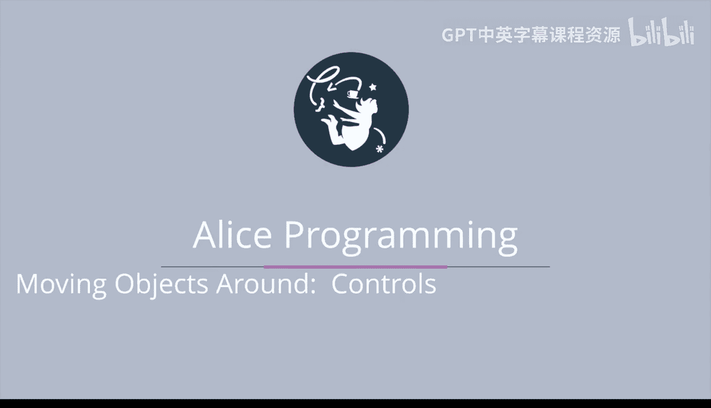
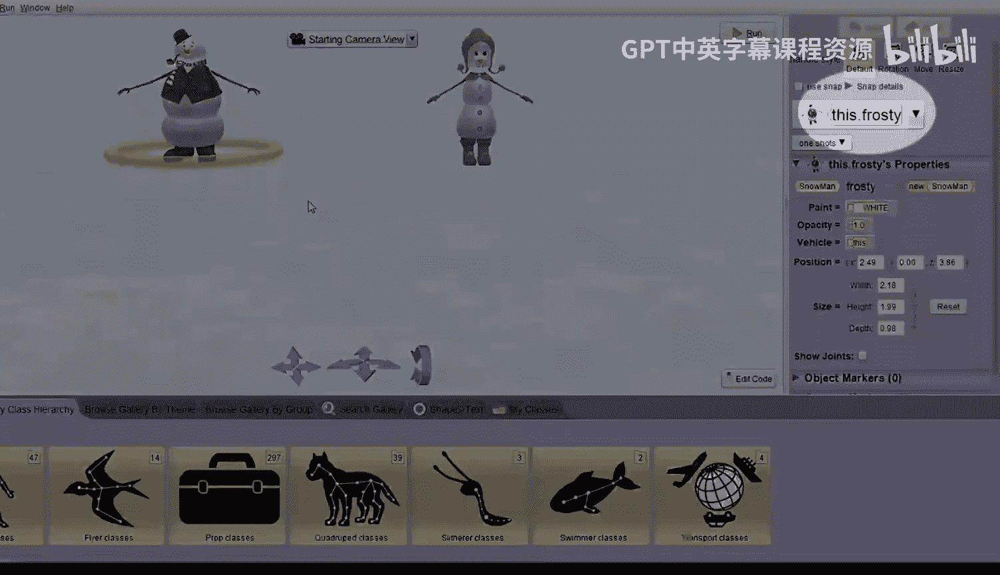

# 006：控制键与单次执行（PC版）🎮

在本节课中，我们将学习如何在场景设置阶段移动场景中的对象。在整个课程中，你将获得大量设置场景的实践经验。本节将演示几种不同的方法来操作对象，作为场景设置的一部分。你不需要精通所有方法，只需熟练掌握其中一种即可。

我们将从雪人场景开始。点击“场景”。在场景中移动和旋转对象主要有两种方式：使用鼠标移动对象，或使用爱丽丝软件内置的一些指令。

在移动对象之前，需要先选中它。有三种方法可以选中对象：
*   在屏幕左上角的对象列表中点击对象。
*   用鼠标点击场景中的对象。
*   在爱丽丝窗口右侧的下拉列表中选择对象。

让我们逐一查看这三种方法。首先，我们在屏幕左上角的对象树中点击“Sue”（技术上显示为 `this.Sue`）。这时会发生两件重要的事情：第一，在场景中，Sue周围会出现一个黄色圆环；第二，在屏幕右侧的框架中，`this.Sue` 被选中。

为了练习其他方法，我们先点击雪人。除了黄色圆环从Sue周围移动到Frosty周围，我们还会注意到左上角对象树中的 `this.Frosty` 被高亮显示，并且右侧框架中的 `this.Frosty` 也被选中。

现在，让我们从右侧框架的下拉列表中选择 `this.Sue`。注意黄色圆环如何重新出现在Sue周围，并且左侧对象树中的 `this.Sue` 现在也被选中了。

接下来，我们尝试将Sue移动到Frosty身后的位置。我们将使用的第一种方法是鼠标操作。首先，确保屏幕右侧的“手柄样式”设置为“默认”。“移动”手柄样式同样有效。就个人而言，我喜欢看到选中对象周围的黄色圆环，所以我们通常使用默认手柄样式。

选中Sue后，我们可以用鼠标将她拖拽到Frosty身后的位置。如果你不满意放置的位置，可以撤销这次移动。在Windows系统的PC上，有三种方法可以撤销移动：
*   第一种，选择菜单栏的“编辑”->“撤销”。
*   第二种，只需按住 `Ctrl` 键并点击 `Z` 键。注意，`Ctrl` 键位于空格键的左侧和右侧，你只需按住其中一个即可。
*   第三种，点击窗口右上角的“撤销”按钮。

你也可以通过指令来移动Sue。实际上，在右侧框架中 `this.Sue` 的正下方，有一个名为“单次执行”的下拉按钮。左键点击此按钮，我们可以选择“过程”，然后选择任意指令。例如，我们选择 `move to`，然后选择 `this.Frosty`。这会使Sue移动到与Frosty完全相同的位置。

让我们尝试另一个指令：点击“单次执行”，选择“过程”，然后选择 `move`，接着指定方向为 `backwards`，最后选择距离为 `2`。现在，Sue就站在Frosty正后方两单位的位置了。一般来说，用鼠标拖拽移动角色更快，而使用“单次执行”过程则更精确。

现在，让我们把Frosty和Sue都转过来，使他们背对摄像机。首先点击Frosty选中他，然后按住 `Ctrl` 键，接着点击并拖动，Frosty就会转身。因为Sue直接在Frosty身后，所以我们在对象树中点击Sue选中她。现在，我们使用“单次执行”过程让Sue `turn left` 半圈。

最后，让我们把Frosty升到空中。我们再次点击Frosty选中他，使他周围出现黄色圆环。现在，我们按住 `Shift` 键，同时用鼠标左键点击并拖动，就可以将Frosty升到空中，就像他在飞一样，或者也可以将他降到地面。或者，我们也可以使用“单次执行”按钮，选择相应的过程让Frosty向 `up` 或 `down` 方向移动。

虽然爱丽丝中还有其他移动对象的方法，但我们发现这些是最有用的。如果其中某种方法无法移动对象或停止工作，请保存你的项目并重启爱丽丝。完成操作后请务必保存你的工作。如果你不喜欢某些移动操作，只需使用 `Ctrl + Z` 即可撤销你对Frosty和Sue所做的任何或全部移动。

在本节课中，我们一起学习了在爱丽丝中移动对象的几种核心方法：通过鼠标拖拽、使用“单次执行”指令，以及如何利用 `Ctrl` 和 `Shift` 键配合鼠标进行旋转和升降操作。同时，我们也掌握了撤销操作的多种方式。这些是进行场景初始布局的基础技能。