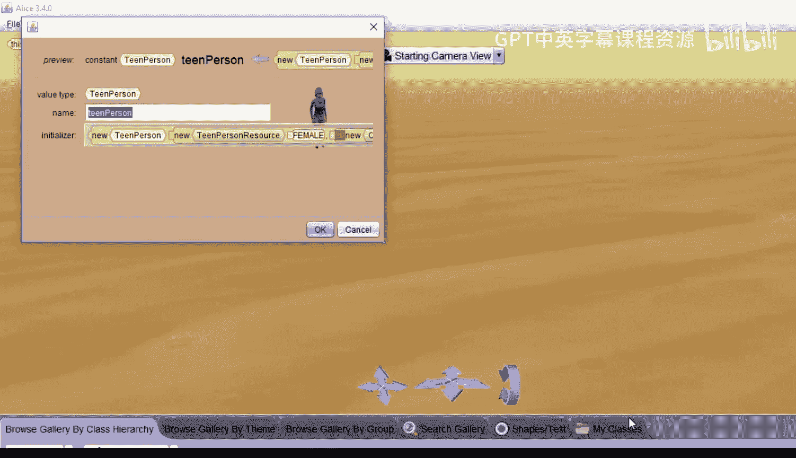

# 007：构建人物角色 👤

在本节课中，我们将学习如何在Alice 3中利用《模拟人生2》的角色构建器来创建和自定义属于你自己的动画角色。

Alice 3与电子艺界合作，引入了来自电子游戏《模拟人生2》的角色，其中包括一个角色构建器，让你可以创建自己的角色。你可以选择从幼儿到老人的各种人物类型，并为你的角色选择许多其他特征，例如服装、肤色和发型。

---

## 启动角色构建器 🚀

上一节我们介绍了角色构建器的来源，本节中我们来看看如何启动它。

首先，进入“设置场景”界面，选择“Biped”类。前五个类都代表《模拟人生2》角色构建器，点击其中任意一个即可。点击哪一个并不重要，因为它们都会启动相同的角色构建器。

---

## 选择年龄与性别 👶👴

启动构建器后，你可以从顶部的选项中选择人物的年龄范围：幼儿、儿童、青少年、成人或老人。点击不同选项时，你会看到服装风格随之改变。

以下是不同年龄段的服装特点：
*   **幼儿**：提供适合幼儿的服装。
*   **儿童**：提供有趣、活泼的儿童服装。
*   **青少年**：既有有趣的服装，也有一些成熟的服装。
*   **成人**与**老人**：拥有精致成熟的服装和制服。

你还可以通过点击“随机生成”按钮来创建一个随机人物。每次点击都会得到一个不同的人物，这很有趣。

我将选择创建一个青少年，所以点击“Teen”。接下来，你可以选择性别：女性或男性。我选择女性。

---

## 自定义外观特征 🎨

确定了基本类型后，我们可以深入定制角色的外观。

**选择肤色**
你可以从深色到浅色之间选择肤色。也可以点击“自定义颜色”选项，通过选择RGB值来设定特定颜色，例如蓝色，从而得到一个偏蓝的肤色。我将选择一个中等肤色。

**选择服装**
服装部分提供了多种选择：
*   **套装**：提供全身搭配好的服装。
*   **连衣裙**：专为女性角色设计。
*   **分体式套装**：已经协调搭配好的上衣和下装。
*   **特定主题服装**：包含大量特定款式的服装。

点击任何服装可以预览角色穿上的效果。你还可以自由搭配自己的上衣和下装，例如选择一件蓝色衬衫和一条绿色裤子，创造出独特的组合。

在窗口底部查看服装时，你还可以调整角色的腰围。滑块最右端代表宽腰围，向左移动则腰围会变细。我将选择中间位置。

**选择发型与发色**
点击“Hair”选项卡，你可以选择想要的发型和发色。角色有多种发色选择，例如红色、蓝色、紫色等。我喜欢紫色头发。

**调整面部与眼睛**
点击“Face”选项卡，可以尝试不同的脸型。滚动到底部，你甚至会发现“外星人”脸型选项。我选择其中一个脸型。在底部，你还可以选择眼睛的颜色，例如绿色、棕色或蓝色。我喜欢蓝色眼睛。

---

## 保存并放置角色 💾

在保存角色之前，请确保你对其服装、发型和肤色等所有特征都满意。一旦保存并将其放入世界，你将无法再更改这些特征。

如果满意，点击“OK”保存。默认的角色名是“teen person”，这不太有趣。我将她的名字改为“Sandra”，然后再次点击“OK”将其放入世界。

角色需要几秒钟才会出现，因为Alice需要根据你选择的特征来构建这个人物。看，她出现了，名字是Sandra。

---

## 总结 📝

本节课中我们一起学习了如何在Alice 3中使用角色构建器。我们逐步操作了选择年龄与性别、自定义肤色、服装、发型、面部特征，并最终保存和放置自定义角色的全过程。现在，你可以尽情为你的Alice世界构建独特的人物了。