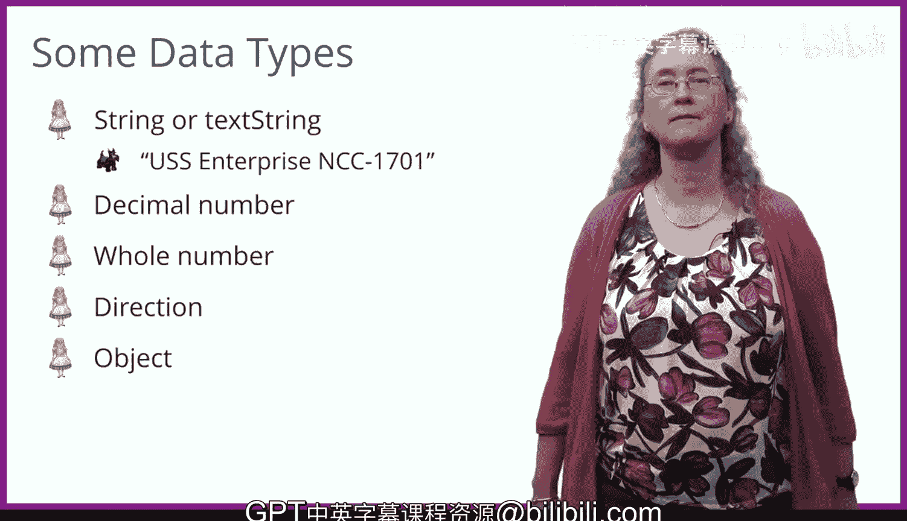

# 009：简单指令 🎬


在本节课中，我们将学习如何在爱丽丝（Alice）编程环境中编写代码，让场景中的对象执行简单的动画指令。我们将从放置对象过渡到编写指令，并了解几种基本的数据类型。

上一节我们介绍了如何在初始空白场景中放置和移动对象来设置起始场景。本节中，我们来看看如何开始编写代码来创建动画。

你已经学会了如何进入场景设置界面，在爱丽丝项目中放置对象。这里我放置了一只金猴和一只松鼠。设置完成后，点击“编辑代码”即可返回代码编辑器。

在代码编辑器视图中，右侧有三个主要部分：代码编辑器，你将在这里放置指令来创建动画。“我的第一个方法”标签页显示在此处，放置在该方法中的代码将会执行。“执行”是一个专业术语，意思是“运行”。当你点击运行按钮时，代码就会运行。

左上角是摄像机视图，显示你设置的场景图片。在图片中，你可以看到我在场景中放置了一只金猴和一只松鼠。这里的图片比场景编辑器视图中的要小，因为此视图的重点是编写代码。

图片下方有一个水平栏，上面有松鼠的图片并写着“this.squirrel”。这也被称为对象下拉列表。它显示当前选中的对象。你还会注意到松鼠图片周围有一个粗粗的金色圆环，这也意味着松鼠是当前选中的对象。

左下角可以看到“过程”标签页，其中列出了当前选中对象（松鼠）知道如何执行的一系列指令。你可以点击对象下拉列表中“this.squirrel”右侧的小三角形，选择另一个动物，或选择名为“this”的场景，或选择摄像机。

我将当前对象更改为金猴。让我们更仔细地看看金猴的过程或指令。你可以看到金猴知道如何做很多事情。它知道如何“说”些什么，这看起来像一个卡通气泡。它知道如何“移动”，知道如何“转身”以及许多其他事情。我们将更详细地探讨其中一些指令。

我们希望金猴说些什么，比如“欢迎来到我的世界”。

要将代码放入代码编辑器窗口，你需要点击指令并将其拖拽到“我的第一个方法”代码编辑器中。如果我们点击“说”指令并将其拖入，它会询问我们想让金猴说什么？我们可以选择“你好”，或者我们可以选择“自定义文本字符串”，然后输入我们想要的短语。

以下是我们输入“欢迎来到我的世界”后，“说”指令的样子：

```
this.goldenMonkey.say("欢迎来到我的世界")
```

当世界运行时，金猴将在一个卡通气泡中准确显示我们告诉它说的话：“欢迎来到我的世界”。

你可以选择的另一个指令是“移动”。“移动”指令需要两条信息：你希望金猴朝哪个方向移动？角色可以朝六个方向移动：上、下、左、右、前、后。选择方向后，你必须确定希望角色移动多远。这个量应该是一个小数。

我们这里能用整数吗？数学家使用术语“整数”而不是“整数”。那样不会给我们太多灵活性。那样金猴就只能以整数增量移动。如果你需要它只移动一点点，比如一半或0.25呢？对于移动多远来说，小数更有意义。

以下是“移动”指令的两个例子：

```
this.goldenMonkey.move(forward, 1)
this.goldenMonkey.move(up, 2.5)
```

在第一个例子中，金猴向前移动1个单位。在第二个例子中，金猴向上移动2.5个单位。当我们有多个指令时，它们按顺序执行。这里金猴先向前移动，然后金猴向上移动。

现在让我们看看“转身”指令。当你拖入“转身”指令时，它会询问你转身的方向和转多远。对象可以朝四个不同的方向转身：左、右、前、后。它不能向上或向下转。你还需要被询问转多远或旋转多少。

转多远的量与“圈”相关，并且必须是一个小数。在这里，整数值没有意义。1意味着转一整圈。如果值是整数类型，对象将只能转一整圈，永远无法停在不到一圈的位置。这就是为什么该值的类型需要是小数。0.5意味着转半圈，0.25意味着转四分之一圈。

以下是“转身”指令的两个例子：

```
this.squirrel.turn(right, 0.25)
this.goldenMonkey.turn(left, 0.5)
```

我们让松鼠向右转四分之一圈，然后让金猴向左转0.5圈，也就是转半圈。

在学习过程的同时，你也在学习几种不同的数据类型，因为过程需要这些数据类型。

以下是涉及的主要数据类型：

*   **字符串数据类型**：“说”指令使用字符串数据类型，也称为文本字符串。可以将其视为由双引号包围的字符序列。这些字符可以包括空格、数字和特殊字符，例如美元符号和英镑符号。例如，`"USS Enterprise NCC-1701"` 是一个字符串，代表星际迷航飞船的名称，这个字符串包括字母、数字和一个破折号。
*   **小数**：我们在“转身”和“移动”命令中都看到了小数类型，我们必须告诉对象移动多远或转多远。
*   **整数**：我们也讨论了整数，尽管我们还没有在任何指令中使用它们。我们稍后会用到。当你想在爱丽丝中使用数字时，你需要考虑使用整数还是小数是否有意义。如果使用一半、四分之一或小于一的值有用，那么你应该使用小数。
*   **方向数据类型**：我们在“移动”和“转身”指令中都看到了它。对于“移动”指令，对象可以朝六个方向移动：上、下、左、右、前、后。对于“转身”指令，对象可以朝四个方向转：左、右、前、后。
*   **对象数据类型**：另一个数据类型是对象，比如松鼠或金猴。每条指令都有一个与之关联的对象来执行该动作。你已经通过将对象放入爱丽丝世界来使用它们了。现在，你知道了如何通过将指令拖拽到代码编辑器中来让对象执行动作。

爱丽丝还有许多其他数据类型，你将在以后的学习中了解到。



本节课中我们一起学习了如何在爱丽丝中编写简单的动画指令，包括“说”、“移动”和“转身”。我们还介绍了执行这些指令所需的关键数据类型：字符串、小数、整数、方向和对象。通过拖拽指令并填写必要的信息，你已经可以开始创建基本的动画序列了。