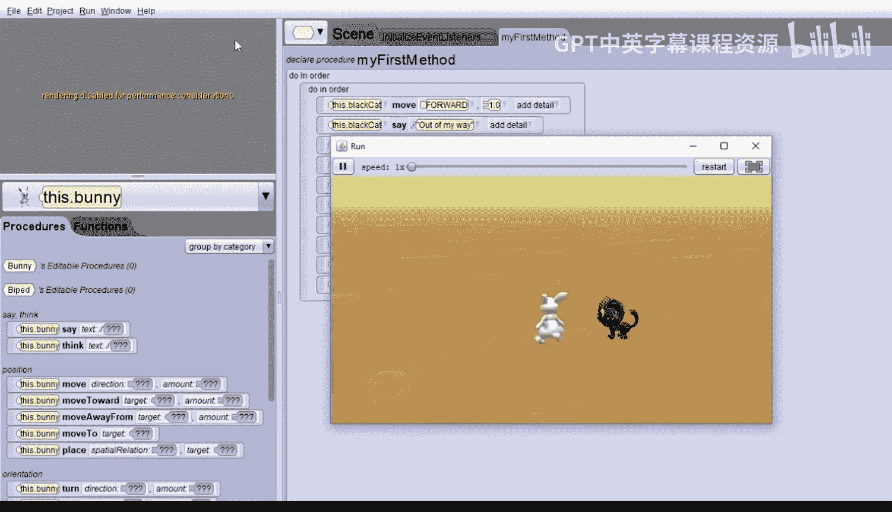

# 011：构建简单世界 🐰🐱

在本节课中，我们将学习如何使用Alice软件构建一个简单的动画世界。我们将通过一个关于兔子和猫互动的故事，逐步学习如何添加角色、设置场景、编写动画指令。

## 概述

我们将为以下简单故事构建动画：一只猫在兔子身后。猫走向兔子并告诉兔子让开。兔子向上跳起，猫从兔子身边经过。兔子引起猫的注意。猫转身面对兔子。兔子旋转并感到头晕，然后向后倒下。这就是整个故事。现在，让我们开始构建这个世界。

## 构建世界

首先，我们启动Alice软件，并选择任意地面。这里我们选择沙漠地面，它看起来像沙子。点击“确定”。

接着，我们进入场景设置。我们需要放入一只兔子和一只猫。兔子是两足站立的，因此我们在“两足动物”文件夹中寻找兔子。向右滚动，找到兔子。

将兔子放置在世界中心。旋转兔子，以便我们看到它的右侧。

在“两足动物”文件夹中还有一只黑猫。虽然猫有四条腿，但设计它的艺术家决定将其归为两足动物。

将黑猫放置在兔子身后的世界中。旋转它，使其面朝与兔子相同的方向。然后将黑猫紧贴在兔子身后，几乎要碰到它。

我们使用一个“单次移动”指令，将黑猫向后移动1.5个单位。移动方向选择“向后”，距离输入1.5。

至此，我们的场景设置完成。我们准备好编写动画代码了。

## 编写动画代码

点击“编辑代码”返回代码编辑视图。在放入任何指令之前，最好先拖入一个“顺序执行”模块来容纳所有代码。我们将在另一节课中更详细地讨论“顺序执行”。

对于我们的故事，首先发生的是猫走向兔子。

我们需要为黑猫拖入移动指令。如果黑猫未被选中，请先选中它。然后，你可以看到黑猫能执行的所有指令。我们知道黑猫在兔子身后1.5个单位处。

将黑猫的“移动”指令拖入“顺序执行”模块中。系统会询问移动方向，选择“向前”。然后询问移动距离，选择“1”。

现在你可以运行你的动画了。猫会向兔子靠近。运行后，关闭动画窗口。如果动画窗口未关闭，Alice将不允许你添加更多代码。

接下来，在我们的故事中，猫告诉兔子让开，然后兔子向上移动。

为猫拖入“说话”指令。选择“自定义文本字符串”，并输入“out of my way”。

我们希望兔子向上移动。我们需要将操作对象从黑猫切换到兔子。现在这些指令是兔子可以执行的。拖入“移动”指令，选择方向“向上”，距离选择“1”。

播放你的世界。猫向前移动，说“out of my way”，然后兔子向上移动。关闭窗口。

接下来，我们将让猫向前移动经过兔子，然后让兔子向下移动回到地面。

选中黑猫。然后将“移动”指令拖入“顺序执行”模块，作为最后一个指令。选择方向“向前”。然后选择一个能让黑猫经过兔子的距离，“2”应该可以。

然后选中兔子。拖入“移动”指令。让兔子向下移动。播放你的世界。

猫移动并说“out of my way”。兔子向上移动。猫向前移动。哎呀，兔子穿过了地面。我们把兔子向下移动得太远了。

我们需要让兔子向下移动的距离与它向上移动的距离相同，即1个单位。关闭运行窗口，将距离“2”改为“1”。

现在，播放你的世界。兔子向上移动，猫经过，兔子向下移动，正好回到原位，这样看起来好多了。关闭运行窗口。

现在，兔子将引起猫的注意。让兔子说“watch this”。拖入“说话”指令，选择“自定义文本字符串”，并输入“Watch this”。

然后选中猫，让它转身看向兔子。选中猫，拖入“转向”指令。转向多少？它应该转半圈，所以选择“向右”转半圈。

现在，让兔子旋转两圈。选中兔子，拖入“转向”指令，选择“向右”转两圈。

然后让兔子说“dizzy”。拖入“说话”指令，选择“自定义文本字符串”，输入“Dizzy”。

现在，我们希望兔子向后倒下。我们将使用“转向”指令，将其拖入。方向选择“向后”。兔子应该转多少？结果是四分之一圈，所以选择0.25。

这就是我们的故事。播放世界。

猫向前移动，说“out of my way”。兔子向上跳。猫向前移动经过。兔子落下并说“watch this”。它旋转两圈，感到头晕，然后向后倒下。

## 总结

在本节课中，我们一起学习了如何使用Alice构建一个简单的动画世界。我们从设置场景开始，添加了兔子和猫两个角色，并调整了它们的位置。然后，我们通过编写一系列顺序指令，实现了猫走向兔子、兔子跳跃、猫经过、兔子旋转并倒下等动画效果。整个过程涉及了选择对象、使用移动、转向、说话等基本指令，并通过调整参数来精确控制角色的动作。希望你能享受创作有趣故事的过程，并在此过程中学习编程。