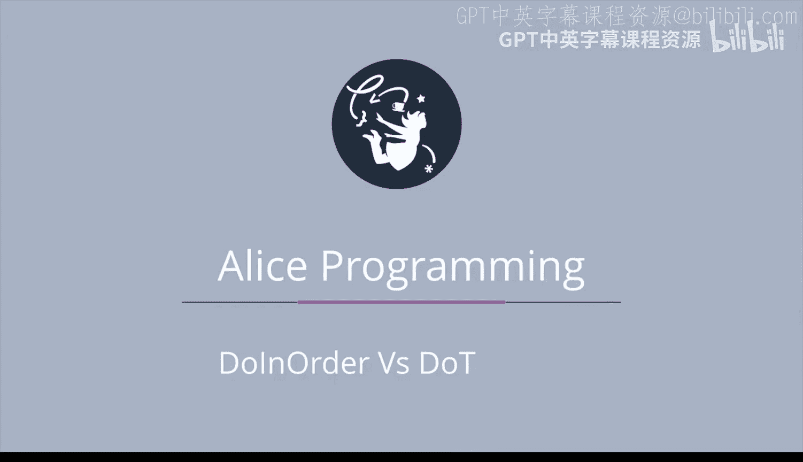

# 017：顺序执行与并行执行 🐒

在本节课中，我们将要学习爱丽丝编程中两种核心的指令执行方式：**顺序执行**与**并行执行**。我们将通过一个包含两只猴子和两棵棕榈树的场景，直观地理解这两种方式如何影响动画的运行效果和最终结果。

---

## 场景介绍

我们有一个预先构建好的爱丽丝项目。场景中有两只猴子，各自面对一棵棕榈树。

*   位于摄像机左侧的猴子被命名为 `left monkey`。
*   位于摄像机右侧的猴子被命名为 `right monkey`。

接下来，我们将通过不同的指令执行方式，让这两只猴子完成相同的动作，并观察其差异。

---

## 顺序执行：一个接一个地转身

首先，我们来看看让猴子们**按顺序**向左转身半圈的效果。

以下是执行过程：
1.  首先，`left monkey` 完成向左转身半圈的动作。
2.  之后，`right monkey` 才开始并完成向左转身半圈的动作。

在这种方式下，动作是依次发生的，后一个动作必须等待前一个动作完全结束后才开始。

---

## 并行执行：同时一起转身

现在，让我们看看让猴子们**一起**向左转身半圈的效果。请注意其中的区别。

与顺序执行不同，在并行执行中：
*   两只猴子**同时开始**转身。
*   它们**一起完成**转身动作，而不是等待另一只完成。

这种方式使得多个对象的动作可以同步进行。

---

## 深入比较：移动与转身的组合

上一节我们介绍了简单的转身动作，本节中我们来看看更复杂的动作组合。我们将有机会看到，使用 `do together`（并行执行）实际上会导致动画运行后对象处于不同的位置。

首先，我们对右侧的猴子使用 `do in order`（顺序执行）来执行一组指令。

以下是具体指令序列：
1.  它先向前移动2个单位。
2.  移动完成后，再向右旋转四分之一圈。

这一系列按顺序运行的动画指令的最终结果是：猴子最终停在了棕榈树的正前方，并且由于第二条指令而面朝右侧。

---

现在，我们对左侧的猴子使用 `do together`（并行执行）来执行完全相同的指令。

对于左侧的猴子：
*   它向前移动的同时，也在向右旋转四分之一圈。

请注意此时的区别。在这种情况下，左侧猴子的运动轨迹看起来像是绕其右侧画了一个四分之一圆。

它最终面朝的方向与右侧猴子相同（都是右侧），但所处的位置却不同：
*   它位于其棕榈树的右侧。
*   它没有右侧猴子那么靠前（离树更远一些）。

虽然它离树没有那么近这一点可能稍难察觉，但它明显更靠前（即Y轴方向位移更大）是很容易看出来的。

---

## 总结

本节课中我们一起学习了爱丽丝编程中 `do in order`（顺序执行）与 `do together`（并行执行）的核心区别。

*   **`do in order`**：指令**依次执行**，一个完成后才开始下一个。适用于需要严格先后顺序的步骤。
*   **`do together`**：指令**同时开始执行**，允许动作并发进行。适用于需要同步发生的动画效果。

通过观察猴子转身和移动旋转的组合动画，我们清晰地看到，执行方式的选择会直接影响动画的过程和对象的最终状态。建议多次运行此爱丽丝项目，以加深对这两种执行方式差异的理解。