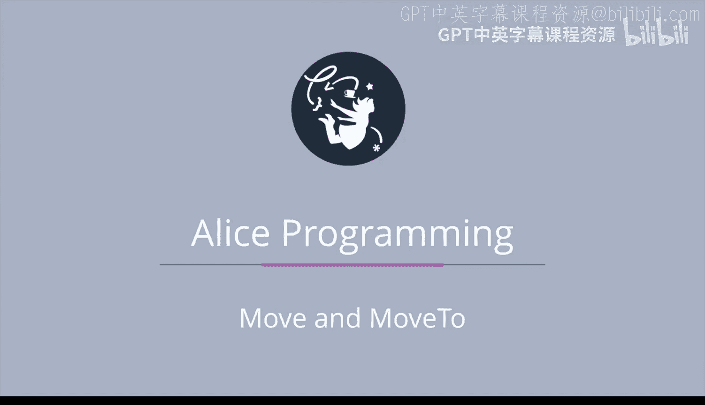

# 018：移动与移动到指令详解 🎬




在本节课中，我们将学习爱丽丝（Alice）编程环境中几种不同的移动指令。通过一个预先构建好的项目演示，我们将直观地比较`move`、`place`、`move toward`和`move to`等指令产生的不同动画效果，并理解它们各自的应用场景。

## 项目场景概述 🌳

演示项目中有五个孩子（Kid1到Kid5）围着一棵树，树上挂着一个风筝。我们将通过为每个孩子调用不同的移动指令，来观察他们行为的差异。

## 基础移动指令：转向与指向 🔄

首先，我们来看前两个孩子使用的常规`move`指令，并结合`turn to face`和`point at`指令。

以下是Kid1的指令序列：
```
Kid1.turn to face, theKite
Kid1.move, forward, 1 meter
```

当Kid1执行`turn to face`风筝时，他会左右转动身体，使自己面朝风筝在地面上的投影方向。随后，当他向前移动时，他会始终在地面上行走。

---

对于Kid2，我们使用不同的指令：
```
Kid2.point at, theKite
Kid2.move, forward, 1 meter
```

Kid2首先执行`point at`风筝。当他向前移动时，他会离开地面，呈现出“飞行”的效果。

`turn to face`和`point at`都是非常重要的指令，它们经常出现在`move forward`指令之前。但正如本例所示，两者有显著区别：`turn to face`让对象转身面向目标，而`point at`则让对象（的某个轴）指向目标，可能导致对象离开地面。

## 其他移动指令变体 🧭

除了基础的`move`指令，还有三个功能相似但效果不同的指令。

### 放置指令：Place 📍

`place`指令可以将对象瞬间放置在另一个对象的特定方位上。

例如，对于Kid3：
```
Kid3.place, theKite, inFrontOf, 0 meters
```

这条指令使Kid3立刻出现在风筝的正前方。我们也可以选择`toTheRightOf`、`toTheLeftOf`、`above`、`below`或`behind`等方位。这个指令非常实用，可以一键将对象移动到目标附近且不产生碰撞。但在本例中，由于风筝在树上，将Kid3“放置”在风筝前看起来就不太合理。

### 朝向移动指令：Move Toward ⚠️

`move toward`指令对学生来说可能较难掌握，通常不建议初学者使用。

对于Kid4：
```
Kid4.move toward, theKite, 1 meter
```

这条指令会让Kid4的中心点向风筝的中心点移动1米。问题在于，如果两个对象的中心点不在同一水平高度（例如风筝在空中），Kid4就会开始“飞行”；如果风筝的中心点更低，Kid4则可能“陷入”地面。此外，Kid4在移动前不会转身面向风筝，这有时看起来会不自然。

`move toward`的效果，与先执行`point at`再执行`move forward`的组合指令在最终位置上有些类似。

### 移动到指令：Move To 🎯

最后是`move to`指令，它也可能带来意想不到的效果。

对于Kid5：
```
Kid5.move to, theKite
```

这条指令会使Kid5的中心点与风筝的中心点完全重合。结果就是，风筝看起来像是穿过了Kid5的身体。虽然有时需要这种特效，但在当前场景下显得很奇怪。

## 总结与建议 📝

本节课我们一起学习了爱丽丝中几种核心的移动指令。总结如下：

*   **最常用**的是基础的`move`指令，通常与`turn to face`配合使用，来制作角色在地面行走的动画。
*   **`place`指令**适用于需要对象瞬间出现在特定位置的场景。
*   **`move toward`和`move to`指令**由于会直接操作对象的中心点，容易产生飞行或重叠的怪异效果，使用时应格外小心，通常只在制作飞行生物（如鸟、鱼）或特定特效时考虑使用。

建议你亲自尝试这些指令的不同变体，以加深理解。在大多数人物动画中，使用`turn to face`配合`move`是最安全、最自然的选择。