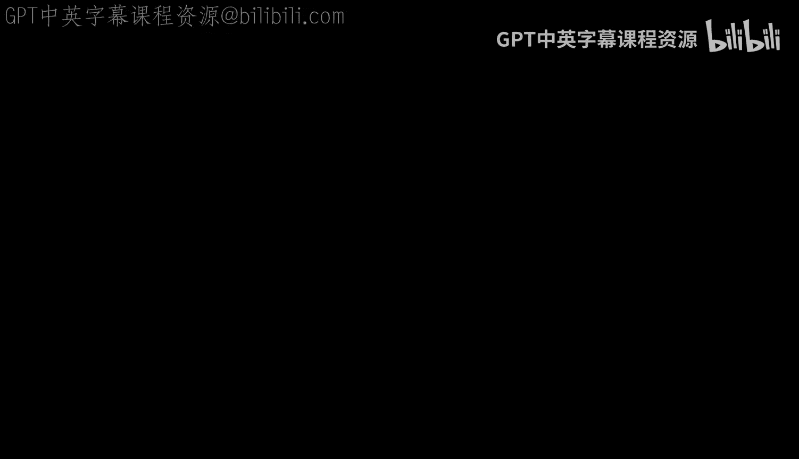
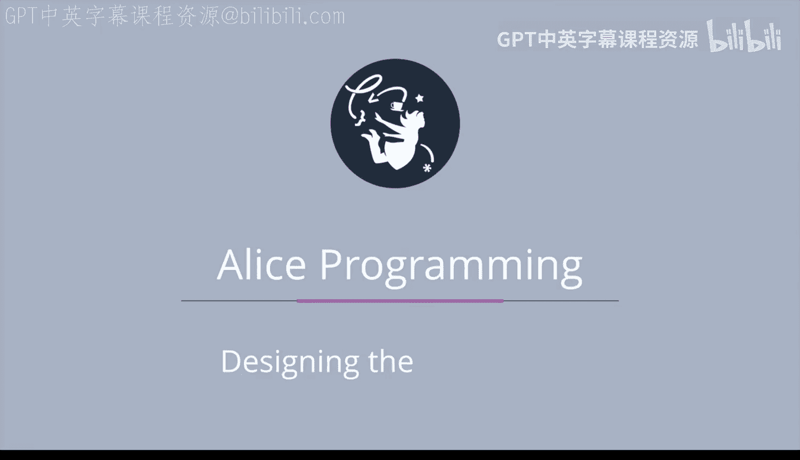

# 019：故事板设计 📝

在本节课中，我们将要学习动画创作中的一个关键前期步骤：故事板设计。我们将了解什么是故事板，为什么它很重要，以及如何为一个简单的故事创建自己的故事板。

## 概述

创建动画主要包含两个步骤。首先，你需要设计动画。你需要规划动画的每一个场景，包括每个对象的位置。这可以通过故事板来完成。一旦你完成了动画设计，就可以准备将设计转化为代码。你在设计阶段投入的时间和深度越多，在调试代码上花费的时间就会越少。

## 什么是故事板？

故事板是一系列简单的草图，展示了动画每个场景中发生的事情。你不需要成为艺术家。使用简笔画人物完全可以，只要你能分辨出他们面对的方向。

故事板中重要的是列出动画每个场景中的所有对象，并了解每个对象的位置及其与其他对象的空间关系。同时，包含对每个场景中希望发生事情的描述也很重要。

## 为什么需要创建故事板？

在现实世界中，像皮克斯这样的电影公司会为他们的电影创建故事板。编剧写出故事，然后交给艺术家，艺术家会画出所有场景的草图，并按顺序贴在墙上。接着是关键的时刻：编剧和艺术家通过草图和描述，向导演生动地讲述故事，使其“活”起来。这个“故事提案”环节非常重要，因为导演将据此决定是否制作这部电影。

## 故事板设计实践

现在，让我们来看一个我们想要为其设计故事板的故事。

**故事梗概：**
宇航员艾米在月球上。突然，一个外星人从岩石后面出现并发出声音。艾米尖叫着跑向宇宙飞船，外星人注视着。舱门打开让她进去，然后关闭。飞船起飞时摇晃了一下，外星人继续看着。外星人问道：“你不想玩吗？”，然后外星人很伤心。

### 确定所需元素

为了创建这个动画，我们需要确定以下内容：
*   我们需要使用月球作为地面，因为这个故事发生在月球上。
*   我们需要决定世界中需要哪些对象。我们需要一个宇航员、一艘宇宙飞船、一个外星人和一块供外星人藏身的岩石。
*   注意，我们的宇宙飞船需要有可以打开和关闭的舱门。

### 故事板分步解析

上一节我们确定了动画的基本元素，本节中我们来看看我为这个故事绘制的故事板草图。以下是每个场景的详细说明。

**场景1：初始设置**

场景1是动画的初始设置。我在场景中标注了对象。你也应该列出场景中的对象。请注意，我确实不是艺术家，用简笔画和形状团块完全可以。重要的是了解对象相对于其他对象的位置，这可以用简单的形状来完成。

**场景2：外星人出现**

场景2展示了动作的发生。当外星人从岩石后面出现时，艾米转身看向外星人。箭头可以用来表示运动。你还应该包含对每个场景中发生事情的描述。在这个场景中：有声音，外星人出现，艾米转向外星人。

**场景3：艾米跑向飞船**

场景3描述：艾米尖叫并移向宇宙飞船，外星人注视着。舱门打开让她进去。在这里你可以看到一个箭头表示艾米转向飞船，另一个箭头表示她移向飞船。还有一个箭头表示舱门正在打开，并且当艾米移向飞船时，外星人正转身看着她。

**场景4：舱门关闭**
（此场景在描述中提及，但未提供图片）
场景4显示宇宙飞船的舱门关闭。它还显示了正在看向飞船的外星人的背面。

**场景5：飞船起飞**
（此场景在描述中提及，但未提供图片）
场景5显示宇宙飞船摇晃并起飞，外星人注视着。有双箭头表示飞船摇晃，一个大箭头表示飞船起飞。你还可以看到外星人在飞船起飞时转身跟随飞船。

**场景6：外星人发问**
（此场景在描述中提及，但未提供图片）
场景6描述：外星人问道：“你不想玩吗？”，外星人很伤心。注意在这个场景中，只有两个对象：岩石和外星人，宇宙飞船和艾米已经不见了。

## 总结

本节课中我们一起学习了故事板设计。故事板是设计过程中的重要组成部分。草图展示了对象的位置、运动以及对象是否是场景的一部分。文字描述有助于解释每个场景中发生的事情。在绘制故事板上投入的额外努力将使实现故事变得更容易，也可能有助于减少调试故事代码的时间。