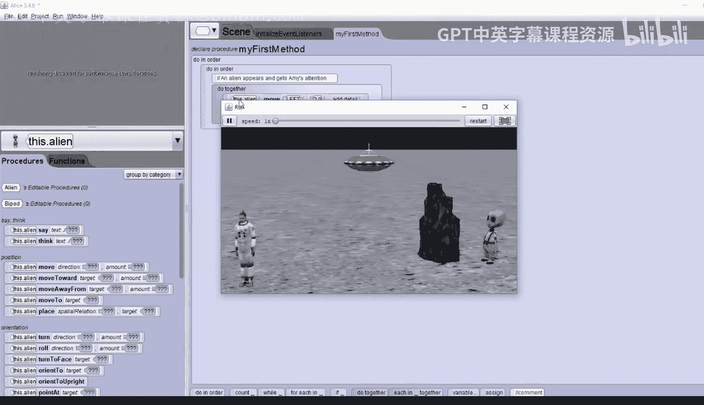
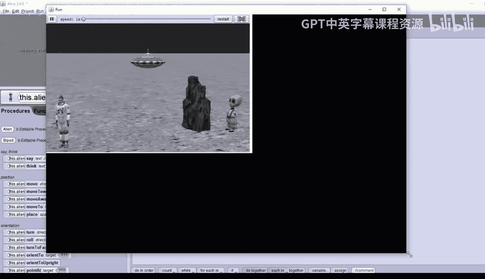
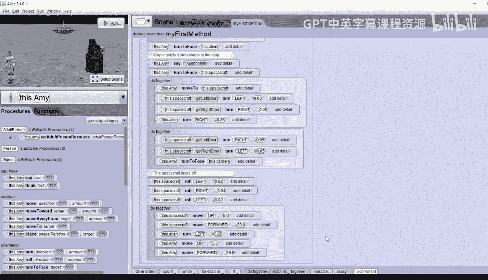

# 020：故事板实现 🚀

在本节课中，我们将学习如何将一个故事板转化为可执行的动画代码。我们将跟随宇航员艾米在月球上遇见外星人的故事，一步步在Alice中实现场景搭建、角色互动和动画编排。

## 概述

我们将实现一个简短的故事：宇航员艾米在月球上发现了一个外星人，她感到害怕并逃回飞船离开。外星人则显得很伤心。整个过程涉及场景设置、角色动作编排以及多个事件的同步执行。

## 场景搭建

首先，我们需要搭建故事发生的场景。以下是具体步骤：

1.  启动一个新的Alice项目，选择“moon”作为地面。
2.  点击“Setup Scene”按钮，开始添加对象。
3.  点击“Biped Class”，使用角色生成器创建宇航员。选择“Female Adult”。
4.  在服装列表中滚动到底部，选择太空服（只有成年男性和女性角色有此服装）。
5.  点击“OK”，为你的宇航员命名（例如：Amy）。将她向后移动一些，并放置在场景左侧。
6.  在对象库中找到绿色面孔的外星人，将其拖放到场景右侧，并稍向后移。
7.  点击“All Classes”，进入“Transport”类文件夹，选择“Aircraft”类，添加一个UFO。将其重命名为“Spacecraft”并放置到远处。
8.  在搜索栏中输入“rock”，添加一个小型岩石。如果它太大，可以使用“Resize”按钮适当缩小。将岩石放置在外星人前方。

## 初始动作设置

上一节我们搭建好了场景，本节中我们来看看如何设置故事的起始画面。我们需要让外星人转身面对艾米，并躲到岩石后面。

1.  选中外星人，使用“One Shot”功能，让它“Turn to face”艾米。
2.  将外星人移动到岩石后面，只露出一小部分绿色的脸。
3.  使用左侧的紫色箭头稍微调整摄像机角度，使其俯瞰整个场景。

## 编写动画代码

现在场景和初始位置已就绪，我们进入代码编辑器来实现故事板。

首先，从窗口底部拖入一个“Do in order”指令块。将所有代码放入此顺序块中，便于整体管理和后续调整。

### 第一步：外星人出现

以下是外星人出现并吸引艾米注意的步骤：

1.  添加注释：“An alien appears and gets Amy‘s attention.”
2.  拖入一个“Do together”块，让外星人的移动和说话同时进行。
3.  在外星人“Do together”块内，添加“move left”指令，移动2个单位，使其从岩石后移出。
4.  添加“say”指令，输入自定义文本，例如：“Sliy tove.”
5.  点击“Run”查看效果。运行后请关闭播放窗口。

### 第二步：艾米的反应

外星人出现后，接下来是艾米的反应。

1.  在第一个“Do together”块下方，选中艾米，添加“turn to face”指令，让她面对外星人。
2.  添加注释：“Amy is terrified and returns to the ship.”
3.  让艾米说：“Ah!”
4.  然后让艾米“turn to face”她的飞船。

### 第三步：逃向飞船

现在，我们需要让几个事件同时发生：艾米跑向飞船、飞船门打开、外星人转头观看。

1.  插入一个新的“Do together”块。
2.  让艾米“move to”飞船。
3.  选中飞船，找到其左门，添加“turn left”指令，角度设为0.05。
4.  选中飞船的右门，添加“turn right”指令，角度同样设为0.05。
5.  让外星人“turn right”约四分之一圈，注视艾米。

### 第四步：关闭舱门与起飞准备

艾米进入飞船后，舱门关闭，飞船准备起飞。

1.  插入一个“Do together”块来同步关闭两扇门。
2.  让左门“turn right” 0.05度。
3.  让右门“turn left” 0.05度。
4.  **关键修正**：在这个“Do together”块中，同时让艾米“turn to face”摄像机，这样她在飞船内方向就正确了。
5.  添加注释：“Spacecraft takes off.”
6.  让飞船轻微摇晃模拟启动：先“roll left” 0.02度，再“roll right” 0.04度，最后“roll left” 0.02度回正。

### 第五步：飞船起飞

飞船起飞时，需要同时上升、前进，并且外星人会抬头目送。

1.  插入一个“Do together”块。
2.  让飞船“move up” 5个单位，并“move forward” 20个单位。
3.  **关键修正**：在同一个“Do together”块中，让艾米执行完全相同的移动指令（“move up” 5 和 “move forward” 20），这样她才会和飞船一起移动。
4.  让外星人“turn left”约四分之一圈，看着飞船离开。

### 第六步：外星人的结局

故事最后，外星人感到伤心。

1.  在代码末尾添加注释：“The alien is sad.”
2.  让外星人说：“Don‘t you want to play?”
3.  为了让外星人看起来悲伤，选中它，通过层级箭头找到“head”，让它的头“turn forward”约0.125度，做出低头的动作。

## 总结

本节课中，我们一起学习了如何将故事板转化为Alice动画。我们完成了从场景搭建、角色定位，到编写复杂的顺序与并行代码的完整流程。关键点包括：使用“Do in order”组织整体流程，用“Do together”同步多个动作，以及注意角色相对方向对移动指令的影响。通过这个练习，你已经掌握了在Alice中实现叙事性动画的基本方法。