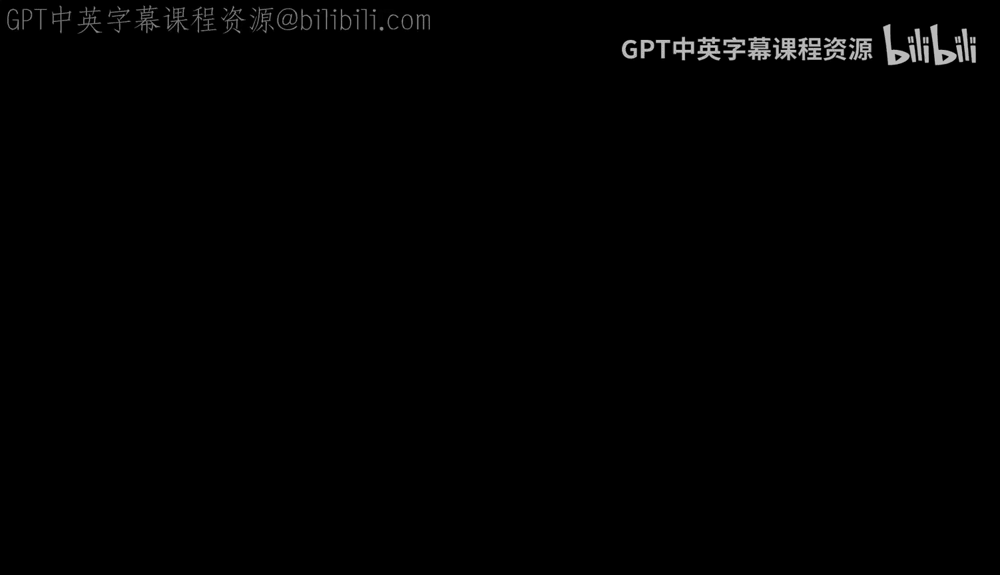
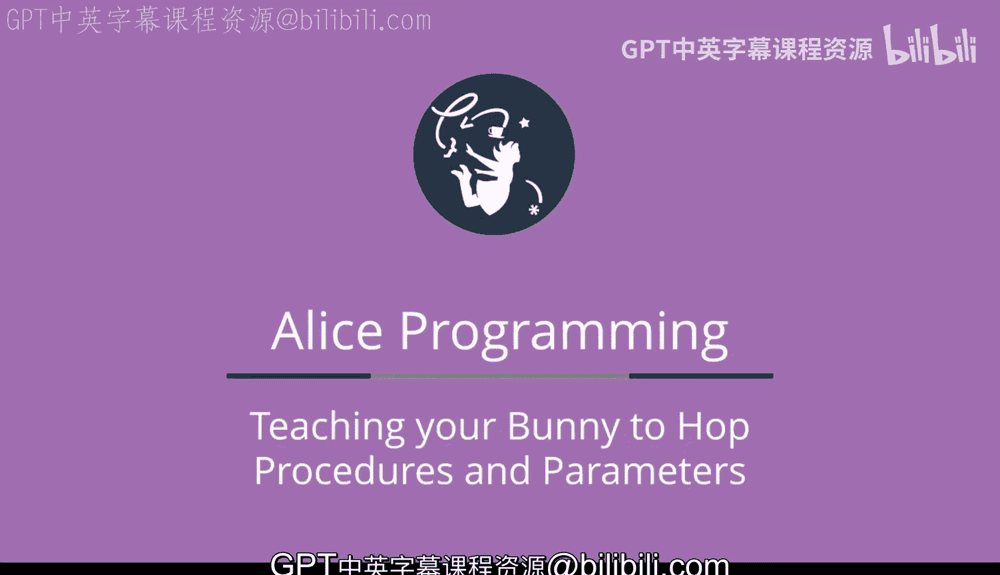
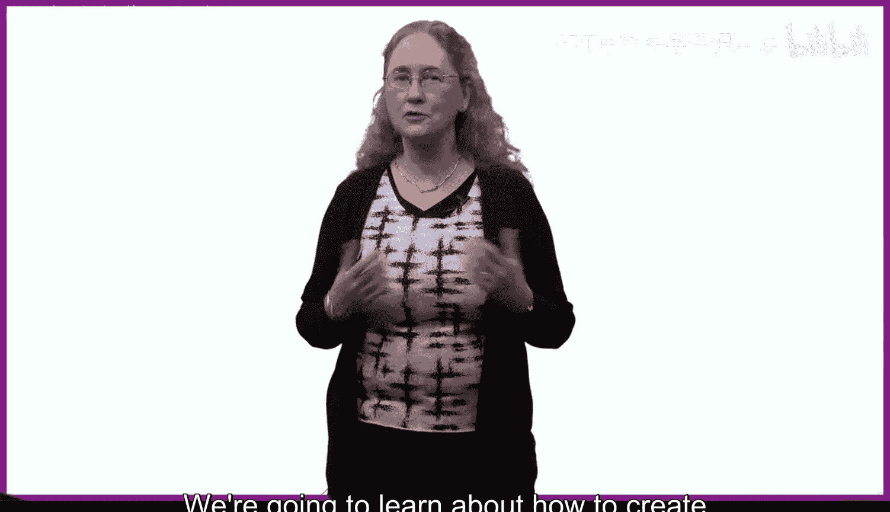
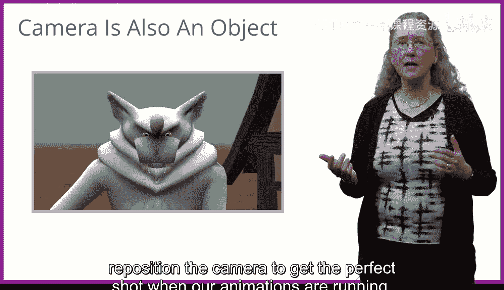
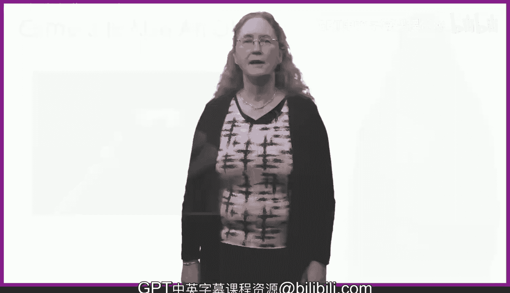

# 022：概述 🗺️





在本周课程中，我们将探索所有现代编程语言中一个绝对核心的构建模块。我们将学习如何创建自己的过程或指令，让编程变得更高效、更灵活。



## 创建自定义过程

上一节我们学习了使用爱丽丝内置的指令。本节中，我们来看看如何将多个指令组合成一个新的、可重复使用的指令。

我们将把几个爱丽丝指令（例如移动、转向、翻滚、转向面对等）组合在一起，并为这组指令命名，例如 `hop`。这样，我们就创建了一个名为“跳跃”的全新指令。之后，每当想让兔子跳跃时，我们无需记住所有构成跳跃的转向和移动指令，只需在程序中拖入一个 `hop` 指令块即可。

以下是创建自定义过程的好处：
*   **提高效率**：节省大量拖放操作。
*   **简化记忆**：记住一个单词 `hop` 比记住构成跳跃的大约7个指令要容易得多。

## 使用参数增强过程

在创建了几个自定义过程后，我们将学习如何通过使用参数，让我们的过程变得更强大、更通用。

我们已经在使用爱丽丝内置过程的参数了。例如，当我们使用 `move` 指令时，程序会要求提供更多信息：物体移动的方向和距离。参数的形式可以表示为：
```
move(direction, distance)
```

我们将学习如何为自己创建的过程添加参数。我们还将初步了解过程的“层级”。换句话说，如果我们为“兔子”类创建了一个 `hop` 过程，那么所有兔子对象都将知道如何跳跃。然而，如果我们为“双足动物”类创建 `hop` 过程，那么所有双足动物（如兔子、人类、白兔等）都将知道如何跳跃。

## 深入探索方向与运动

本周我们还将花更多时间探索物体朝向、方向与物体运动之间的关系。我们会研究物体的不同部分（例如人的肘部或膝盖），并了解物体部分的朝向通常与物体整体的朝向不同。

当尝试转动或翻滚物体的部分时，这种朝向差异将变得非常重要。理解这一点对于制作逼真的动画至关重要。

## 掌握摄像机的使用

本周要涵盖的最后一个主题是摄像机。在爱丽丝中，摄像机本身也是一个对象。和所有爱丽丝对象一样，摄像机可以在场景设置期间以及动画运行时被移动、转向、翻滚等。

您可能希望移动摄像机来获得对象的特写视图，或者从不同视角观看动画。例如，从房屋的顶部视图，以便看清哪些物体在房屋前面，哪些在后面。

鉴于我们几乎都是初露头角的“阿尔弗雷德·希区柯克”，我们都需要学习如何在动画运行时重新定位摄像机，以获取完美的镜头。

## 总结





本节课中，我们一起学习了第三周的核心内容：**创建自定义过程**、**使用参数**、**深入理解方向与运动**以及**操控摄像机**。这些是构建更复杂、更高效动画程序的基石。现在，让我们开始学习所有这些精彩的内容吧！