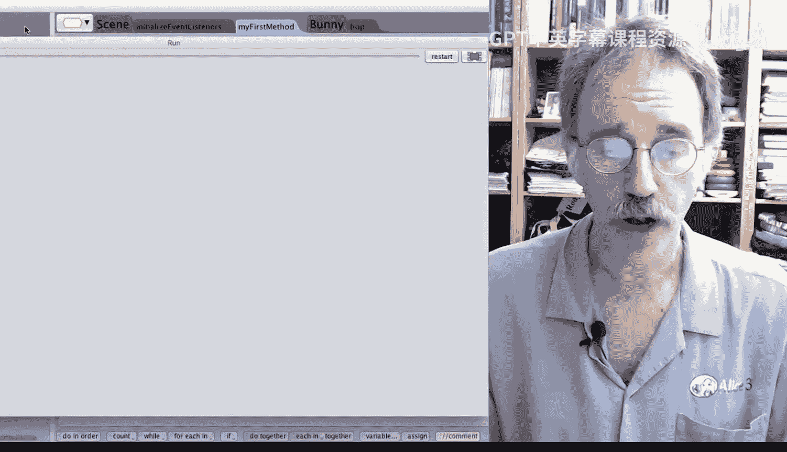

# 024：兔子跳跃过程 🐇


在本节课中，我们将学习如何创建自定义指令或过程。具体来说，我们将创建一个让兔子跳跃的指令。通过这个过程，你将理解如何将一系列复杂的动作封装成一个简单的、可重复使用的指令。

## 概述

我们将创建一个名为“跳跃”的过程，让兔子以三角形的轨迹跳跃。首先，兔子会转向芒果，然后同时向上和向前移动，最后同时向下和向前移动，完成一次跳跃。我们将使用“顺序执行”和“同时执行”指令块来组合这些动作。

## 创建跳跃过程

上一节我们介绍了本节课的目标，本节中我们来看看如何具体实现兔子的跳跃过程。

首先，我们进入编程模式，在“我的第一个方法”窗口中开始编写代码。我们需要让兔子完成转向和跳跃两个主要动作。

以下是实现跳跃的步骤：

1.  **转向芒果**：首先，我们需要让兔子转向芒果。为此，我们拖入一个“顺序执行”指令块，然后将“转向”指令放入其中，并指定目标为芒果。
    ```alice
    this.bunny turn to face this.mango
    ```

2.  **实现跳跃的第一部分**：接下来，我们需要让兔子同时向上和向前移动。我们在“转向”指令后，拖入一个“同时执行”指令块。
    *   在该指令块内，添加一个“移动”指令，方向设为“向上”，距离设为0.5米。
    *   同时，再添加一个“移动”指令，方向设为“向前”，距离设为0.5米。
    ```alice
    Do together {
        this.bunny move up 0.5 meters
        this.bunny move forward 0.5 meters
    }
    ```

3.  **实现跳跃的第二部分**：然后，我们需要让兔子同时向下和向前移动，回到地面。我们在第一部分后面，再拖入一个“同时执行”指令块。
    *   在该指令块内，添加一个“移动”指令，方向设为“向下”，距离设为0.5米。
    *   同时，再添加一个“移动”指令，方向设为“向前”，距离设为0.5米。
    ```alice
    Do together {
        this.bunny move down 0.5 meters
        this.bunny move forward 0.5 meters
    }
    ```

4.  **添加注释**：最后，为了代码清晰，我们可以在第一个“同时执行”指令块前添加一个注释，说明“兔子进行三角跳跃”。

运行程序，兔子会转向并朝芒果跳跃一次。

## 封装为自定义过程

虽然上述方法可行，但如果想让兔子跳跃多次，就需要重复拖放大量指令块，这非常低效。因此，我们将这个跳跃动作序列封装成一个自定义过程。

以下是创建自定义“跳跃”过程的步骤：

1.  **创建新过程**：点击屏幕顶部中央的黄色六边形右侧的小三角，从下拉列表中选择“兔子”，然后选择“添加兔子过程”。
2.  **命名过程**：将新过程命名为“hop”。
3.  **编写过程内容**：在新的“hop”方法编辑窗口中，重复我们之前编写的跳跃指令序列（包含两个“同时执行”指令块和内部的移动指令）。
4.  **调用过程**：完成编写后，点击返回“我的第一个方法”标签页。从左侧对象列表中选择“this.bunny”，然后找到并拖拽我们刚刚创建的“hop”过程到方法中。

现在，当点击运行时，兔子会执行一次跳跃。**过程的威力在于其可重用性**。如果我们想让兔子跳跃两次，只需将“hop”过程指令再拖入“我的第一个方法”中一次即可，无需重复编写所有细节代码。

```alice
// 在“我的第一个方法”中
this.bunny turn to face this.mango
this.bunny hop // 第一次跳跃
this.bunny hop // 第二次跳跃
```

## 总结



本节课中我们一起学习了如何创建和使用自定义过程。我们首先将兔子跳跃的复杂动作分解并组合实现，然后将其封装成一个名为“hop”的可重用指令。通过使用过程，我们避免了代码重复，让程序结构更清晰，也更容易修改和维护。这体现了编程中“抽象”和“模块化”的核心思想。