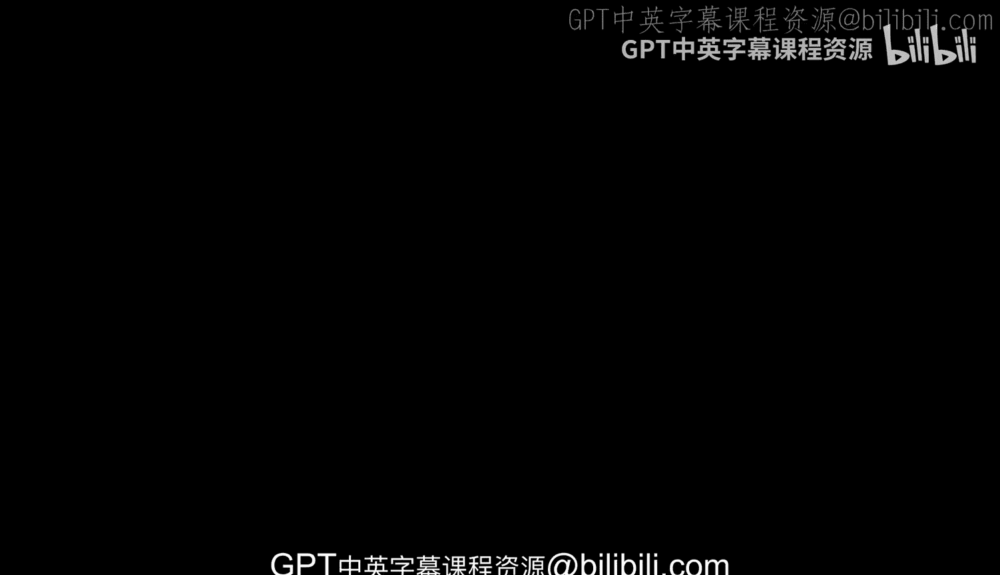
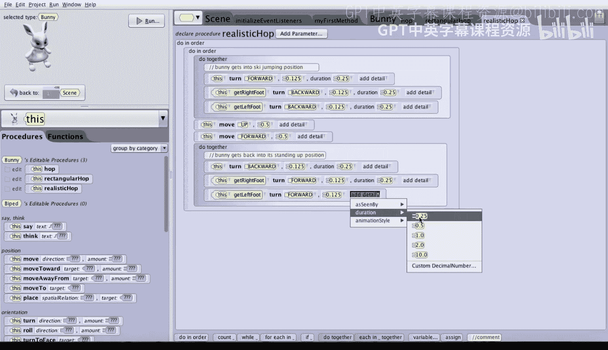

# 029：多种兔子跳跃方式 🐇

在本节课中，我们将学习如何创建新的指令或过程。我们将基于上一节课创建的常规三角跳，制作两种变体：一种更简单的跳跃，供后续课程使用；以及一种更真实、但更复杂的跳跃指令。

## 创建矩形跳 📐

上一节我们介绍了三角跳，本节中我们来看看如何创建一个矩形跳。在这种跳跃中，兔子将先向上移动，然后向前移动，最后向下移动。

以下是创建矩形跳的步骤：

1.  点击屏幕顶部中央的六边形图标。
2.  点击兔子对象，选择“添加兔子过程”。
3.  将新过程命名为 `rectangularHop`。请注意，我们使用“驼峰命名法”：第一个单词首字母小写，后续单词首字母大写，且单词间无空格。这是一种编程惯例。
4.  点击“确定”创建过程。
5.  在过程内部，按顺序添加以下指令：
    *   兔子向上移动 **1** 个单位。
    *   兔子向前移动 **0.5** 个单位。
    *   兔子向下移动 **1** 个单位。

创建完成后，我们可以在主方法中测试它。将旧的 `hop` 指令拖入垃圾桶，然后从“this”菜单中选择“this.bunny”，再将新的 `rectangularHop` 指令拖入。运行程序，可以看到兔子以矩形轨迹跳跃。

## 创建真实跳 🏃

现在，让我们创建一个更逼真的跳跃动作。这个动作模仿滑雪跳台运动员，包含四个步骤。

以下是创建真实跳的步骤：

1.  再次为兔子添加一个新过程，命名为 `realisticHop`。
2.  首先，我们需要一个故事板来规划动作：
    *   **场景0**：初始姿势。
    *   **场景1**：兔子身体前倾，呈起跳姿势。
    *   **场景2**：兔子腾空（类似三角跳）。
    *   **场景3**：兔子落地。
    *   **场景4**：兔子恢复直立姿势。
3.  在 `realisticHop` 过程中，首先添加一个“顺序执行”块。
4.  在“顺序执行”块内，第一步是让兔子身体前倾。这里需要一个动画技巧：我们让兔子整体向前转 **1/8** 圈，同时让它的两只脚向后转 **1/8** 圈，这样脚就保持在原地，只有身体前倾了。
    *   添加一个“同时执行”块。
    *   在“同时执行”块内，添加指令：`this.bunny turn forward 0.125 revolutions`。
    *   要操作兔子的脚，需要分别选择左脚和右脚。从“this”菜单中选择 `bunny’s right foot`，然后添加指令：`turn backward 0.125 revolutions`。对左脚重复此操作。
5.  接下来，让兔子向上移动 **0.5** 个单位。由于身体已经前倾，此时“向上”移动会同时包含向前和向上的分量。
6.  然后，让兔子向前移动 **0.5** 个单位，使其回到地面。
7.  最后，让兔子恢复直立姿势。我们可以复制第一步的“同时执行”块，然后将其粘贴到末尾，并将其中所有的 `forward` 改为 `backward`，所有的 `backward` 改为 `forward`。
8.  为了让动作更利落，我们可以调整动画时长。默认是1秒，我们可以将其改为0.25秒。分别修改起跳和恢复姿势两组指令中每个动作的“持续时间”属性。
9.  最后，添加注释说明代码块的功能，例如“兔子进入起跳姿势”和“兔子恢复站立姿势”。

现在，在主方法中用 `realisticHop` 替换掉 `rectangularHop` 后面的指令，并运行程序。你将看到兔子先做一个矩形跳，然后做一个更逼真的起跳、腾空、落地、恢复姿势的完整跳跃。

## 总结 📝

本节课中我们一起学习了如何创建自定义过程来扩展角色的行为。我们创建了两种新的跳跃方式：简单的矩形跳和复杂的真实跳。在创建真实跳的过程中，我们运用了“同时执行”块来实现复杂的协同动作，并通过调整动画时长和添加注释来优化代码的可读性与效果。这些技能是构建更复杂、更生动动画的基础。