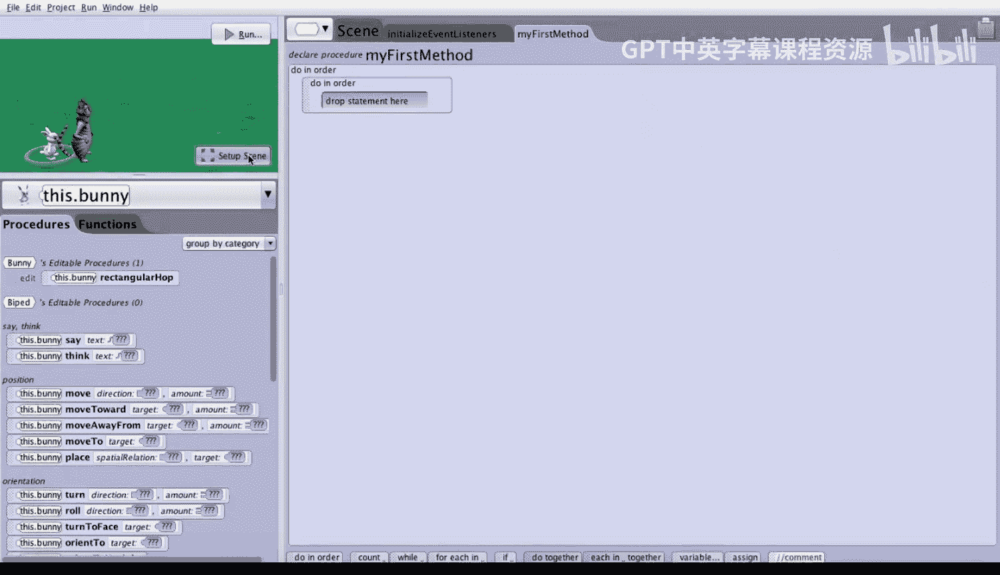

# 040：双足动物的继承跳跃 🐰🐱

在本节课中，我们将学习如何利用**继承**的概念，为双足动物（Biped）这一父类创建通用的跳跃方法，从而让不同子类（如兔子和柴郡猫）都能执行跳跃动作。

## 场景设置与观察

这个世界包含一只兔子和一只柴郡猫。柴郡猫站在兔子前方半个单位处，并且面朝同一个方向。我们将兔子的高度设置为半个单位，柴郡猫的高度设置为一个单位。

我们可以通过查看不同的摄像机视角来确认这些设置。点击“场景设置”，然后滚动到摄像机标记处。我们创建了三个摄像机标记。

以下是不同视角的观察结果：

*   **左视图**：显示兔子直接站在柴郡猫后方，兔子的高度大约是柴郡猫的一半。
*   **右视图**：显示柴郡猫站在兔子前方。由于柴郡猫更高，兔子被它完全挡住了。

让我们点击“编辑代码”以退出场景设置模式。

## 现有方法的局限性

在这个世界中，我们为兔子类创建了一个名为 `rectangularHop` 的方法。在 `myFirstMethod` 中，我们可以让兔子执行这个矩形跳跃。

然而，如果我们尝试让柴郡猫也执行 `rectangularHop`，会发现它无法做到，因为它不是兔子类的实例。这说明，在特定子类（如兔子）中创建的方法，无法被其他类（如柴郡猫）使用。

## 创建通用的双足动物方法

为了能让兔子和柴郡猫都能跳跃，我们需要在它们的父类——**双足动物（Biped）** 级别上创建方法。

以下是创建通用 `leapfrog` 方法的步骤：

1.  点击屏幕顶部的六边形图标。
2.  选择“Biped”，然后点击“添加Biped过程”。
3.  将新过程命名为 `leapfrog`（注意驼峰命名法）。
4.  为此方法添加一个参数，命名为 `howHigh`，类型设置为“十进制数”。

现在，我们来定义 `leapfrog` 方法的具体指令。它包含三个步骤：

*   **向上移动**：让双足动物向上移动 `howHigh` 个单位。
*   **向前移动**：让双足动物向前移动1个单位。
*   **向下移动**：让双足动物向下移动 `howHigh` 个单位。

通过将 `leapfrog` 创建为双足动物的方法，兔子和柴郡猫就都能执行这个跳跃动作了。兔子需要向上跳1个单位，而柴郡猫只需要跳0.5个单位。

## 实现交替跳跃动画

现在，我们回到 `myFirstMethod` 中，让两个角色交替跳跃三次。

以下是实现交替跳跃的代码序列：

1.  兔子执行 `leapfrog`，高度为1米。
2.  柴郡猫执行 `leapfrog`，高度为0.5米。
3.  重复上述两步，再执行两次。

运行世界，可以看到兔子和猫以各自合适的高度准确地轮流跳过对方。

## 添加多视角切换

为了让动画更生动，我们可以在跳跃过程中切换摄像机视角。

以下是添加摄像机切换的步骤：

*   在第一对跳跃指令之后，让摄像机移动并定位到“左视图”。
*   在第二对跳跃指令之后，让摄像机移动并定位到“右视图”。

这样，我们就能从三个不同的有趣视角来观看整个跳跃动画：起始的正面视角、从后方观察的左视图，以及从另一侧观察的右视图。

## 总结

本节课中，我们一起学习了方法创建的层级重要性。在子类（如兔子）级别创建方法，只允许该类的所有实例使用。而在父类（如双足动物）级别创建方法，则允许该父类下的**所有子类**（如兔子和柴郡猫）共享和使用此方法。这体现了面向对象编程中**继承**的核心优势，提高了代码的复用性和效率。