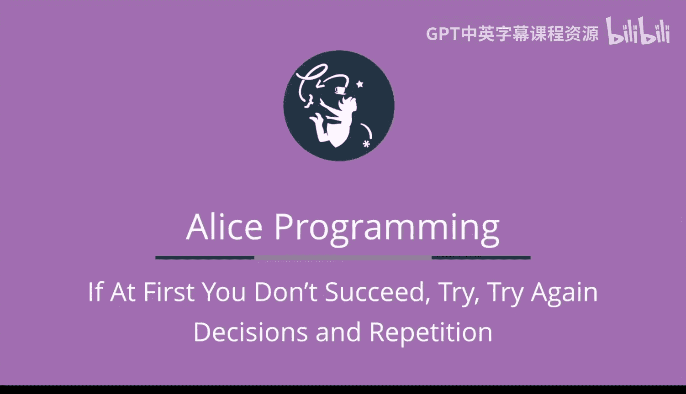

# 042：课程概述 🚀

在本节课中，我们将要学习第四周的核心内容。本周是课程中内容最丰富的一周，我们将显著扩展使用Alice所能讲述的故事类型。

## 本周内容概览 📚

我们将从学习Alice的一系列实用功能开始，这些功能不仅在本周，更会在后续课程中持续使用。

### 内置函数

首先，我们将介绍Alice的内置函数。函数用于计算数值，并可以替代硬编码的数字。例如，我们可以让一只鸟向上移动**大象的高度**。如果我们希望鸟能飞到象的顶部，这个功能就特别有用。

以下是几个关键的内置函数示例：
*   `object.height`：获取对象的高度。
*   `object.distance to`：计算两个对象之间的距离。

### 数学运算与动画功能

上一节我们介绍了函数，本节中我们来看看如何将简单的数学运算（如加法和减法）融入到Alice中。

接着，我们将探索几个有用的Alice动画特性：`as seen by`和`vehicle`属性。
*   `as seen by`：允许你以某个对象的视角来执行命令，例如围绕另一个对象旋转。
*   `vehicle`属性：如果你将一个人放入一辆车，并将此人的`vehicle`属性设置为这辆车，那么当车移动时，人也会随之移动。

### 对象属性：颜色与透明度

然后，我们将学习对象的两个极其有用的属性：**绘制颜色**和**不透明度**。
*   **绘制颜色**：你可以通过为对象绘制特定颜色来改变其色调。
*   **不透明度**：指对象的透明程度。通过将不透明度设置为`0`，我们可以使一个对象变得完全不可见。

### 相机标记与随机数

最后，对于在使用常规相机标记时遇到困难的学员，我们将学习如何使用不可见对象作为替代的相机标记。

在掌握了这些基础知识后，我们将了解Alice如何生成**随机数**。随机数对于制作游戏至关重要，它们能让游戏每次玩起来都不同，从而增加趣味性。目前，我们将把随机数与常量一起使用。

## 核心编程结构 🔧

在本周的后半部分，我们将学习三个非常重要的编程结构：`if`语句、计数循环（通常称为`for`循环）以及`while`循环（或称不定循环）。

*   **`if`语句**：允许在某个条件（例如，白兔是否靠近疯帽子）为真时运行一组动画指令，而在条件为假时运行另一组不同的指令。
*   **两种循环**：`for`循环和`while`循环用于连续多次运行一组动画指令。

## 角色复用：面向对象编程的优势 💾

最后，我们将学习Alice中一个非常实用的能力：**保存并复用角色**。我们可以将一个Alice程序中正在使用的角色，连同为该角色编写的所有过程和函数一起保存，然后在另一个程序中重复使用。

例如，一旦我们在一个Alice程序中教会了一只兔子跳跃，我们就希望能在其他程序中使用这只会跳的兔子，因为跳跃是所有兔子都应该会做的事情。这个功能为我们节省了大量拖放操作的时间和精力，这也是使用面向对象编程的一个重要优势。

## 总结 ✨

本节课中我们一起学习了第四周的课程概述。本周内容非常丰富，涵盖了从Alice的实用功能（如内置函数、对象属性、随机数）到核心编程结构（如条件判断和循环），最后还介绍了角色复用的强大功能。这些知识将极大地增强我们使用Alice创作复杂、动态动画和交互式故事的能力。让我们立刻开始学习吧！