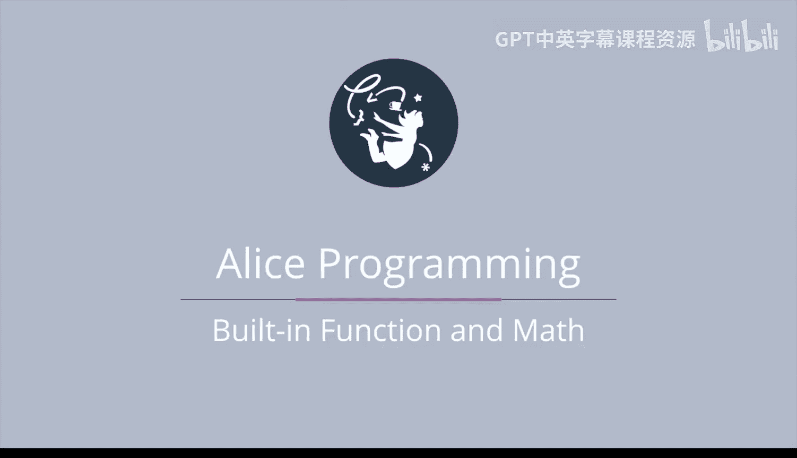
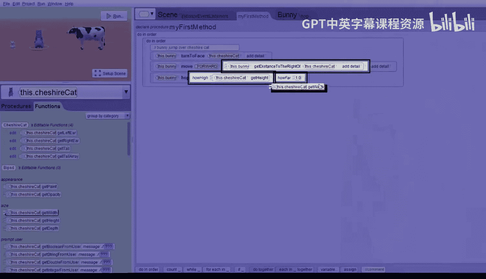
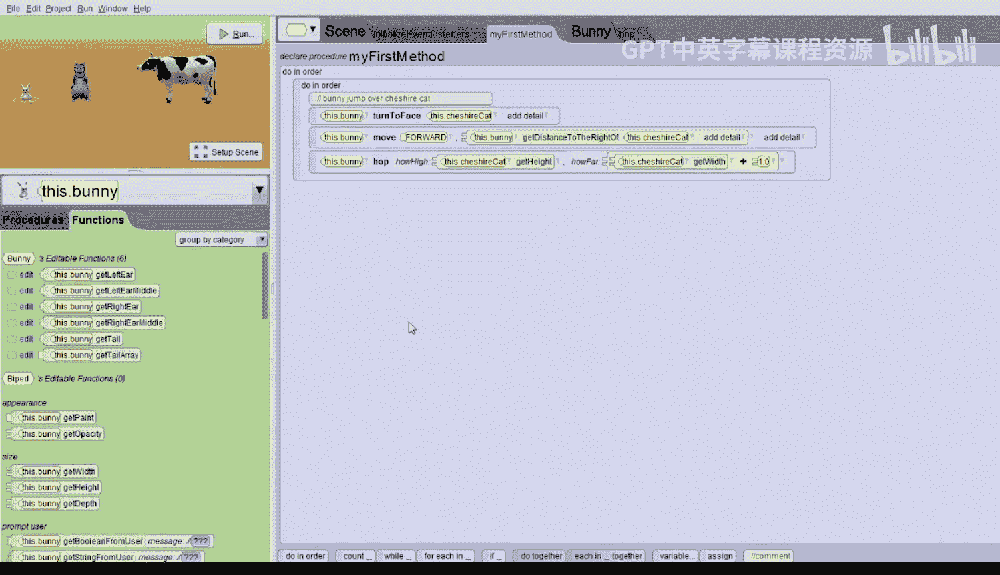
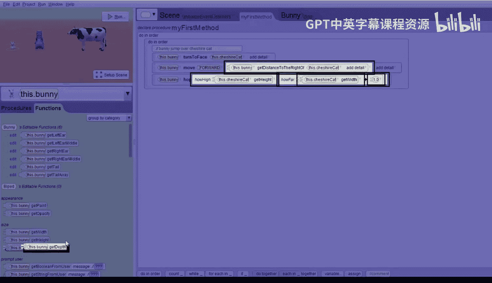
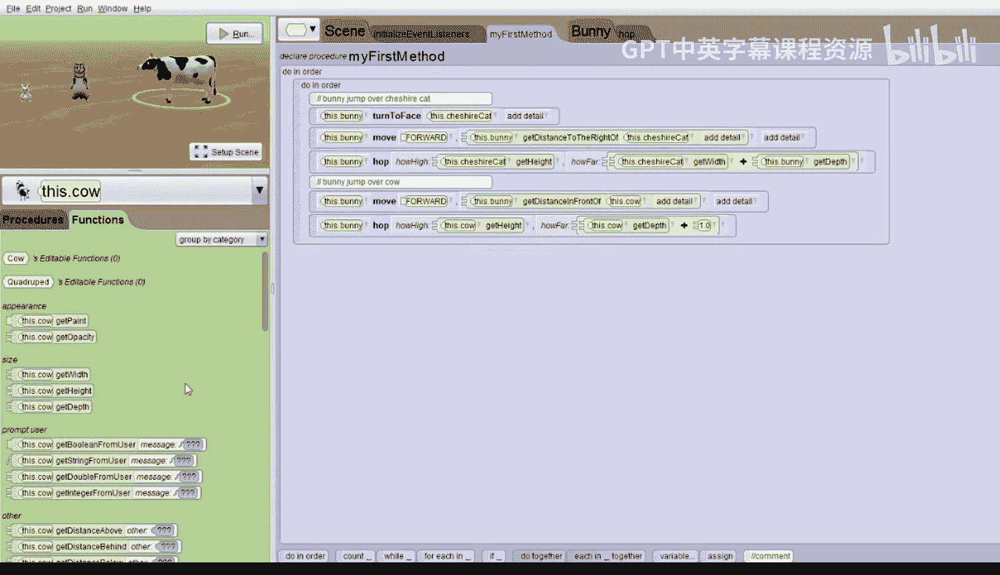
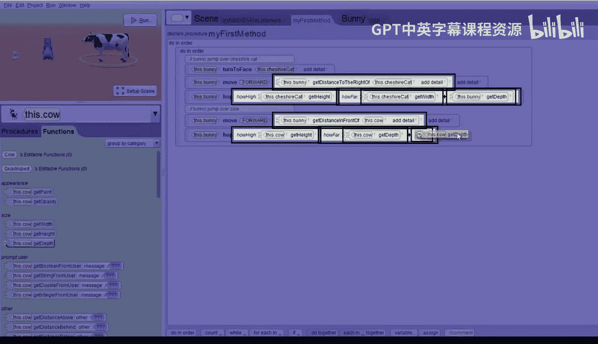
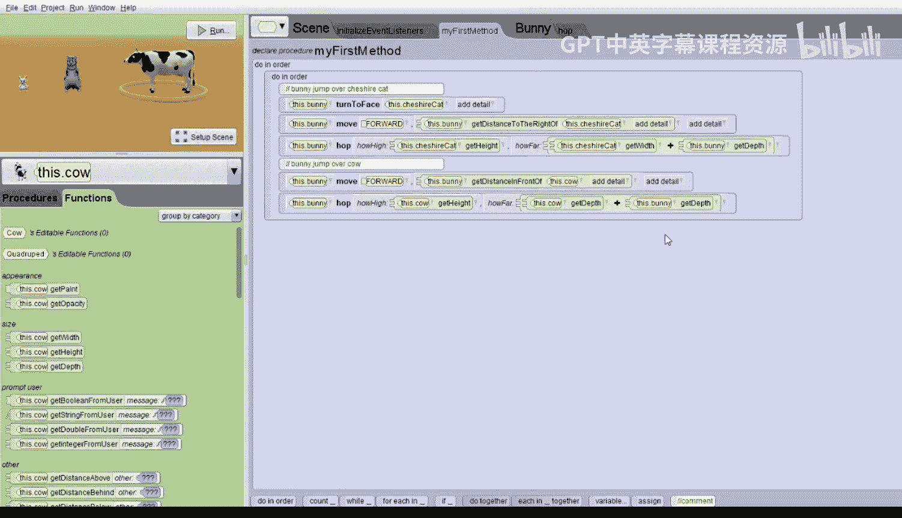
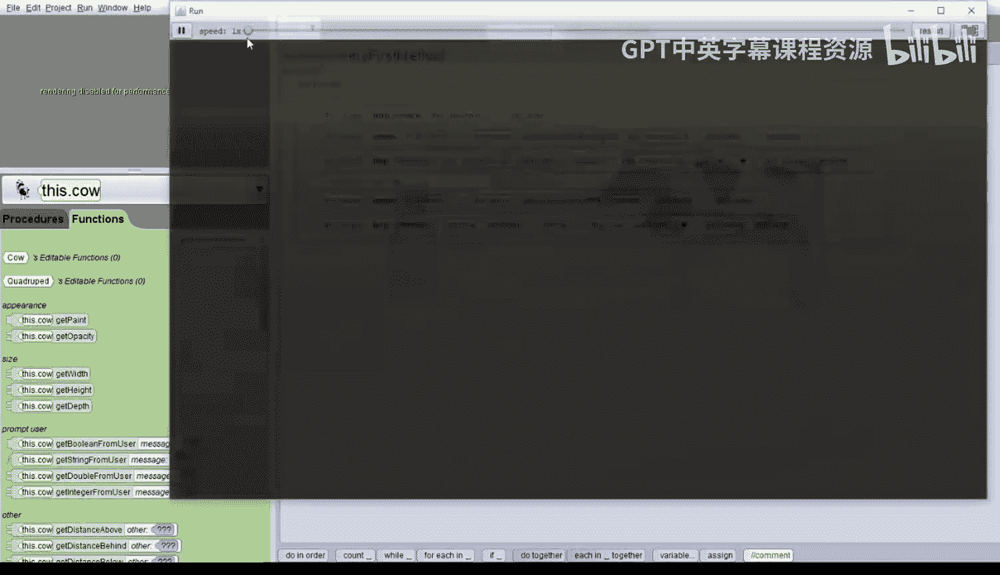

# 044：内置函数与数学运算 🧮

在本节课中，我们将学习如何使用爱丽丝的内置函数以及数学运算，让角色精确地移动和跳跃。

我们从一个包含兔子、柴郡猫和奶牛的世界开始。兔子和柴郡猫都面向摄像机，奶牛则侧身面向柴郡猫。我们的目标是编写一个动画：让兔子转向柴郡猫，跳过它，然后跳过奶牛。

## 准备工作与初始场景

上一节我们介绍了动画的基本概念，本节中我们来看看如何利用函数进行精确计算。

在场景设置模式下，从侧视图可以看到所有动物排成一条直线。回到代码模式，我们已经为兔子编写了一个名为 `hop` 的矩形跳跃过程。这个过程有两个参数：`howHigh`（跳跃高度）和 `howFar`（向前移动距离）。其核心逻辑是：兔子向上跳起，向前移动，然后落回地面。

## 让兔子跳向柴郡猫

首先，我们为整个故事添加一个顺序执行结构。

以下是第一步的详细指令：
*   添加注释：“兔子跳过柴郡猫”。
*   让兔子转向面对柴郡猫：`bunny.turnToFace(cheshireCat)`。
*   让兔子移动到柴郡猫面前。我们不知道具体距离，但爱丽丝可以计算。我们先输入一个占位数字 `1`，然后将其替换为函数 `bunny.getDistanceToRightOf(cheshireCat)`。这个函数能精确计算出兔子到柴郡猫右侧的距离。

运行世界，兔子会精确地移动到柴郡猫面前。

## 精确跳过柴郡猫

接下来，我们调用 `hop` 过程让兔子跳过柴郡猫。对于跳跃高度和距离，我们再次使用占位数字 `1`。

以下是替换占位符的步骤：
*   跳跃高度应等于柴郡猫的高度，因此用函数 `cheshireCat.getHeight` 替换第一个 `1`。
*   跳跃距离应至少等于柴郡猫的宽度。但第一次尝试后发现兔子跳得不够远。这是因为兔子需要跳过的是“柴郡猫的宽度 + 兔子自身的深度”。

我们可以用数学运算来修正。点击 `cheshireCat.getWidth` 旁边的下拉箭头，选择 **数学运算** -> **加法**，会生成 `cheshireCat.getWidth + 1` 的结构。然后，将加号后面的 `1` 替换为函数 `bunny.getDepth`。

现在，跳跃距离的公式是：`cheshireCat.getWidth + bunny.getDepth`。再次运行，兔子成功跳过了柴郡猫。

## 让兔子跳向并跳过奶牛

现在，我们添加第二部分：兔子跳过奶牛。

以下是实现步骤：
*   添加注释：“兔子跳过奶牛”。注意，此时兔子已经面向奶牛。
*   让兔子移动到奶牛面前。使用函数 `bunny.getDistanceInFrontOf(cow)` 来获取精确距离，替换移动指令中的占位数字。
*   让兔子跳过奶牛。再次调用 `hop` 过程，并用占位数字 `1` 初始化参数。
*   跳跃高度应等于奶牛的高度，用函数 `cow.getHeight` 替换第一个 `1`。
*   跳跃距离应等于“奶牛的深度 + 兔子的深度”。我们使用数学运算：先选择 `cow.getDepth + 1`，然后将加号后的 `1` 替换为 `bunny.getDepth`。

现在，跳跃距离的公式是：`cow.getDepth + bunny.getDepth`。运行世界，兔子会先跳过柴郡猫，移动到奶牛面前，然后成功地跳过奶牛。

## 总结

本节课中我们一起学习了爱丽丝内置函数与数学运算的应用。函数帮助我们计算出精确的距离、高度和宽度，从而让角色（如兔子）能够准确地移动到目标位置并完成跳跃动作。数学运算（如加法）则允许我们将多个测量值组合起来，以满足更复杂的移动需求。

请记住：任何可以计算出一个数字的函数，都可以用来替换指令中的具体数字。爱丽丝提供了大量内置函数，你可以灵活运用它们来创建更精确、更生动的动画。