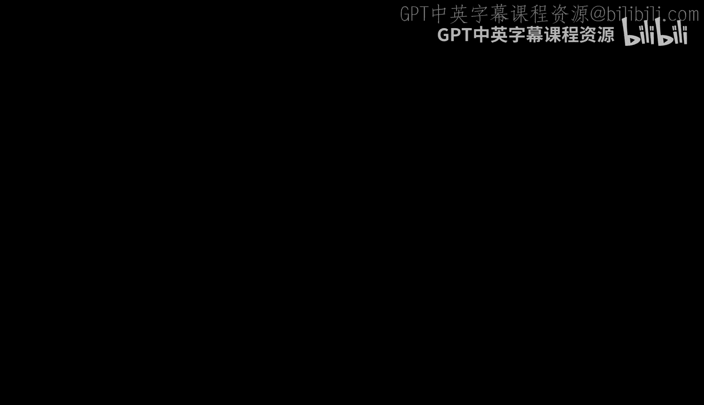
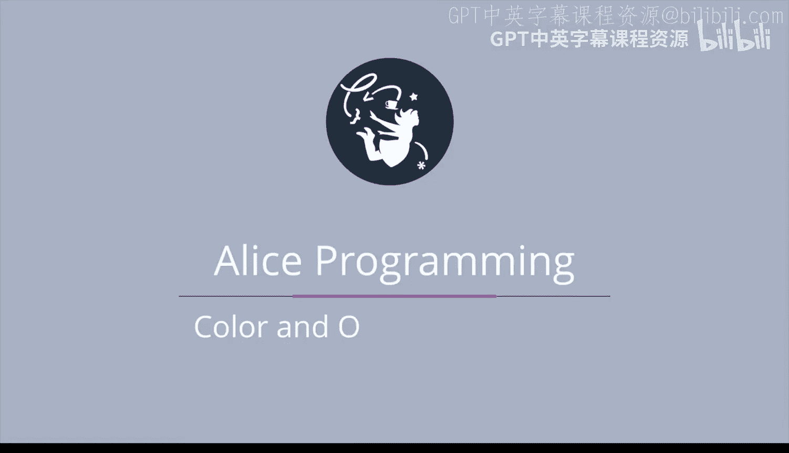
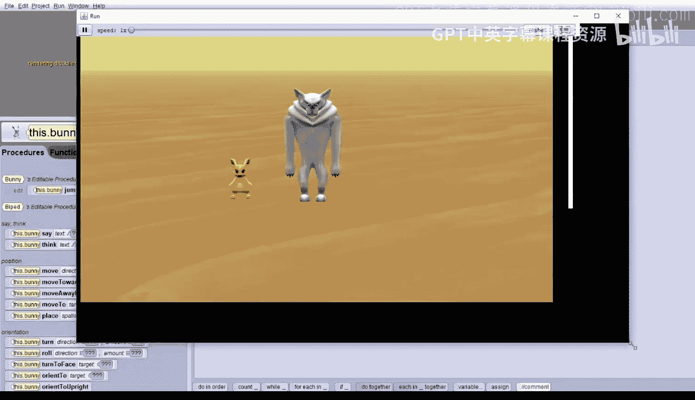
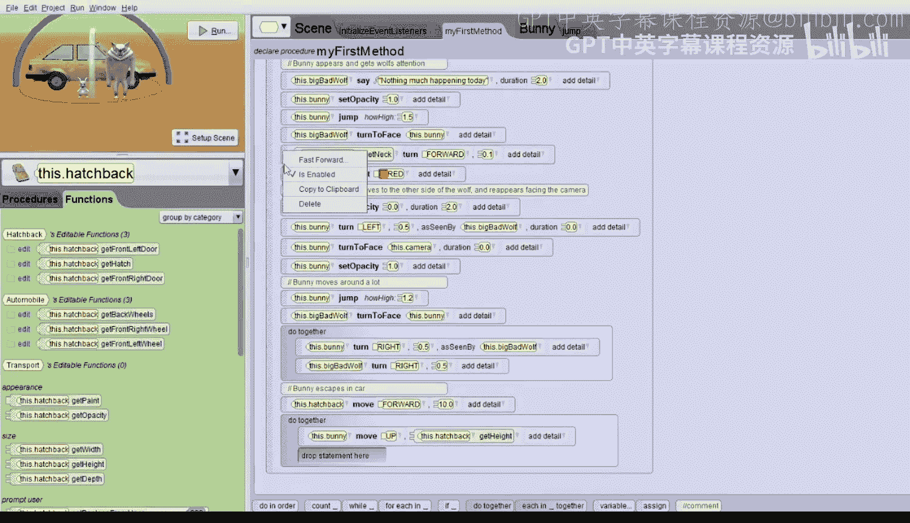

# 047：颜色与透明度属性 🎨

在本节课中，我们将学习如何使用对象的颜色（`paint`）和透明度（`opacity`）属性，并结合内置函数来创建一个生动的动画故事。我们将跟随一只饥饿的狼寻找兔子的情节，逐步实现多个场景的动画效果。

## 概述

我们将创建一个包含三个对象（狼、兔子和汽车）的世界。通过设置对象的初始属性（如颜色和透明度），并编写一系列动作指令，来实现兔子出现、移动、变色、消失，最终跳上汽车逃离的完整故事动画。

---

## 场景设置与初始属性

首先，我们需要设置动画的初始场景。这包括放置对象并调整它们的初始状态，例如将汽车移出屏幕，以及设置兔子的颜色和透明度。

以下是初始设置的具体步骤：

1.  点击 **场景（Scene）** 选项卡。
2.  找到并点击名为 **`perform custom setup`** 的特殊过程。
3.  在新打开的标签页中，添加以下指令：
    *   将汽车向后移动10个单位：`hatchback.move(backward, 10)`
    *   将兔子的颜色设置为黄色：`bunny.setPaint(yellow)`
    *   将兔子的透明度设置为0（完全透明）：`bunny.setOpacity(0)`

完成这些设置后，运行世界，你将只看到狼，而兔子和汽车已处于预设的初始位置和状态。

---

## 编写主动画逻辑

上一节我们完成了场景的初始化，本节中我们来看看如何编写主动画的逻辑。请确保在 **`my first method`** 标签页中编写以下代码，而不是在 `perform custom setup` 中。

我们首先添加一个注释，说明初始化已在自定义设置中完成，然后开始构建故事。

### 场景一：狼的独白与兔子登场

首先，让狼说话，然后让兔子出现并跳跃。

*   **狼说话**：`bigBadWolf.say(“Nothing much happening today.”, duration=2)`
*   **兔子出现**：将兔子的透明度设置为1（完全可见）：`bunny.setOpacity(1)`
*   **兔子跳跃**：调用我们预先写好的 `jump` 方法，例如：`bunny.jump(howHigh=1.5)`

### 场景二：狼的注视与兔子变色

接下来，让狼转身面对兔子，并低头看它，同时兔子改变颜色。

*   **狼转身面向兔子**：`bigBadWolf.turnToFace(bunny)`
*   **狼低头**：选择狼的颈部对象，让其向前转动一点：`bigBadWolf.neck.turn(forward, 0.1)`
*   **兔子变红**：`bunny.setPaint(red)`

### 场景三：兔子消失与重现

现在，让兔子消失，移动到狼的另一侧，然后重新出现并面向摄像机。

*   **兔子消失**：`bunny.setOpacity(0, duration=2)`
*   **兔子移动**：让兔子以狼为参照，向左转半圈（0.5圈），移动到另一侧：`bunny.turn(left, 0.5, asSeenBy=bigBadWolf, duration=0)`
*   **兔子转向摄像机**：`bunny.turnToFace(camera, duration=0)`
*   **兔子重现**：`bunny.setOpacity(1)`

### 场景四：兔子跳跃与狼转身

兔子再次跳跃，然后狼转身面对它。

*   **兔子跳跃**：`bunny.jump(howHigh=1.2)`
*   **狼转身面向兔子**：`bigBadWolf.turnToFace(bunny)`

### 场景五：兔子绕行与狼跟随

这是一个同步动作。我们使用 **`do together`** 块，让兔子绕狼半圈的同时，狼在原地转身跟随兔子。

*   **兔子绕行**：`bunny.turn(right, 0.5, asSeenBy=bigBadWolf)`
*   **狼跟随转身**：`bigBadWolf.turn(right, 0.5)`

### 场景六：汽车入场与兔子跳上车

汽车开回场景，然后兔子跳上车顶。

1.  **汽车入场**：`hatchback.move(forward, 10)` （这正好抵消了初始设置中向后移动的距离）。
2.  **同步动作一（兔子跳高，狼抬头）**：
    *   使用 **`do together`**。
    *   兔子向上移动的高度等于汽车的高度：`bunny.move(up, hatchback.height)`
    *   狼的颈部向后转动一点以抬头：`bigBadWolf.neck.turn(backward, 0.1)`
3.  **同步动作二（兔子向前移动到车顶，狼转头）**：
    *   使用另一个 **`do together`**。
    *   兔子向前移动的距离等于它到汽车的距离：`bunny.move(forward, bunny.distanceTo(hatchback))`
    *   狼向右转动一点以跟随兔子移动：`bigBadWolf.turn(right, 0.25)`
4.  **兔子调整方向**：在跳上车后，让兔子面向汽车：`bunny.turnToFace(hatchback)`
5.  **兔子与汽车绑定**：将兔子的 `vehicle` 属性设置为汽车，这样汽车移动时兔子会跟随：`bunny.setVehicle(hatchback)`
6.  **兔子与汽车方向一致**：让兔子的方向与汽车对齐：`bunny.orientTo(hatchback)`

### 场景七：汽车载着兔子逃离

最后，汽车载着兔子开走，狼无奈地转身并说话。

*   **同步动作（汽车开走，狼转身）**：
    *   使用 **`do together`**。
    *   汽车向前移动：`hatchback.move(forward, 10)`
    *   狼继续向右转身：`bigBadWolf.turn(right, 0.25)`
*   **狼的台词**：在同步动作后，让狼说：`bigBadWolf.say(“rats”)`

---

## 总结

本节课中我们一起学习了如何综合运用对象属性（颜色、透明度、载体）和内置函数（距离、高度）来构建一个复杂的多场景动画故事。关键步骤包括：
1.  使用 `perform custom setup` 进行初始状态设置。
2.  通过 `setPaint` 和 `setOpacity` 控制外观。
3.  利用 `do together` 实现同步动画。
4.  使用函数如 `object.height` 和 `a.distanceTo(b)` 获取精确值以控制移动。
5.  通过设置 `vehicle` 属性让一个对象随另一个对象移动。

通过这个练习，你不仅熟悉了属性的操作，也掌握了如何将多个简单指令组合成一个流畅的叙事性动画。享受使用属性和函数创造故事的乐趣吧！