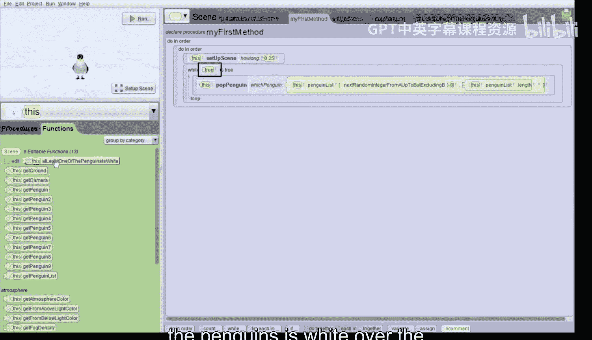

# 100：点击九只企鹅 🐧

在本节课中，我们将学习如何创建一个名为“点击九只企鹅”的游戏。这是一个类似“打地鼠”游戏的变体，但规则有所不同：玩家需要在九只企鹅中，点击每一只企鹅一次，将它们全部变为红色。游戏开始时，所有企鹅会随机从地面下弹出，玩家需要抓住时机点击它们。当所有企鹅都被点击并变为红色后，游戏结束，所有企鹅会一起升上地面。

## 项目概述与场景设置

首先，我们来看看项目的初始设置。项目中有一个包含九只企鹅的数组，它们最初都站在同一个位置。

在“场景”选项卡中，向下滚动，可以看到一个名为 `penguin list` 的企鹅数组，其中包含了位置0到8的九只企鹅。

回到“我的第一个方法”，我们看到它只包含一个调用：`set up scene`。点击并编辑这个方法，可以看到具体的设置代码：摄像机被移动到一个俯视地面的位置，九只企鹅被移动到一个3x3的网格位置，然后全部被移动到地面以下。

## 实现企鹅随机弹出

上一节我们设置了场景，本节中我们来看看如何让企鹅从地面下随机弹出。

回到“我的第一个方法”，在 `set up scene` 调用下方，我们拖入一个 `while` 循环，条件暂时设为 `true`，这将创建一个无限循环。

接下来，我们需要创建一个让企鹅弹出的过程。

以下是创建 `pop penguin` 过程的步骤：
1.  在“场景”中创建一个新的场景过程，命名为 `pop penguin`。
2.  为此过程添加一个类型为 `Penguin` 的参数，命名为 `whichPenguin`。
3.  在过程内部，拖入一个 `If` 语句。
4.  将 `If` 的条件设置为：`whichPenguin.getPaint == white`。这用于检查传入的企鹅当前是否为白色。
5.  在 `If` 语句的 `Do` 部分，按顺序添加以下动作：
    *   `whichPenguin.move(up, 1 meter, duration=0.25 seconds)`
    *   `whichPenguin.delay(1 second)` （这里我们将原教程的0.5秒改为1秒，以便更容易点击）
    *   `whichPenguin.move(down, 1 meter, duration=0.25 seconds)`

这个过程的作用是：如果传入的企鹅是白色的，它会快速向上移动1个单位（弹出地面），等待1秒，然后再快速移回地面下。

现在，回到“我的第一个方法”的 `while` 循环中，拖入我们刚创建的 `pop penguin` 过程。在参数选择上，我们不直接选择某一只企鹅，而是选择 `penguin list` 数组，并将其索引设置为一个随机数。

具体操作是：将参数从 `penguinList[0]` 改为 `penguinList[random(0, penguinList.length)]`。这将从企鹅数组中随机选择一只企鹅并传递给弹出过程。

运行项目，现在可以看到随机的企鹅从地面下弹出。

## 添加点击事件

现在企鹅可以随机弹出了，但我们还需要让玩家能够通过点击来“击中”它们。

我们需要为鼠标点击对象添加一个事件监听器。

以下是设置点击事件的步骤：
1.  点击“初始化事件监听器”选项卡。
2.  点击“添加事件监听器”按钮，选择“鼠标”，然后添加“鼠标点击对象”监听器。
3.  在“添加细节”中，将“视觉对象集”设置为我们的 `penguin list` 数组。这样点击任何一只数组中的企鹅都会触发事件。
4.  在事件触发的动作中，我们只需要将点击的企鹅变为红色。拖入 `penguin.setPaint` 动作，将颜色设置为 `red`。
5.  关键的一步是：将执行动作的对象从固定的 `penguin9` 改为 `getModelAtMouseLocation`。这个函数能返回我们刚刚点击的那个具体对象。

再次运行项目。现在，当企鹅弹出时，尝试点击它。被点击的企鹅会慢慢变成红色（因为我们设置了1秒的延迟，有足够时间点击）。

## 设置游戏结束条件

目前，即使点击了所有企鹅，游戏也不会结束，因为 `while` 循环的条件始终为 `true`。我们需要修改循环条件，使其在所有企鹅都变红后停止。

我们需要创建一个场景函数来检查是否还有白色的企鹅。

以下是创建 `atLeastOnePenguinIsWhite` 函数的步骤：
1.  创建一个新的场景函数，返回类型为 `Boolean`，命名为 `atLeastOnePenguinIsWhite`。
2.  在函数内部，拖入一个 `For each in` 循环，遍历 `penguin list` 数组中的每一只企鹅。我们将循环变量命名为 `penguinIterator`。
3.  在循环体内，拖入一个 `If` 语句。
4.  将 `If` 的条件设置为：`penguinIterator.getPaint == white`。这检查当前遍历的企鹅是否为白色。
5.  如果条件为真（即找到一只白色企鹅），我们拖入一个 `return true` 语句。这意味着函数立即返回 `true`，游戏应该继续。
6.  如果循环完整地执行完毕，都没有执行 `return true`（即没有找到任何白色企鹅），那么我们在循环结束后拖入一个 `return false` 语句。这意味着所有企鹅都不是白色，游戏应该结束。

现在，回到“我的第一个方法”，将 `while` 循环的条件从 `true` 改为我们刚创建的函数调用 `atLeastOnePenguinIsWhite`。

## 添加游戏结束动画

最后，当游戏循环结束（即没有白色企鹅）后，我们让所有企鹅一起升上地面作为胜利的庆祝动画。

在 `while` 循环结束后，拖入一个 `For each in together` 循环。同样遍历 `penguin list` 数组，变量名例如 `penguinIterator`。

在循环体内，让 `penguinIterator` 执行 `move(up, 1 meter)` 动作。使用 `together` 循环意味着所有企鹅会同时执行这个向上移动的动作。

## 总结与最终测试

本节课中，我们一起学习并完成了一个“点击九只企鹅”的游戏。

让我们总结一下实现的核心步骤：
1.  **初始化场景**：将九只企鹅排列成网格并隐藏到地下。
2.  **随机弹出**：使用无限循环和随机数，让白色企鹅随机弹出地面。
3.  **点击交互**：添加事件监听器，使玩家点击企鹅时能将其变为红色。
4.  **游戏逻辑**：创建函数检查游戏状态，当所有企鹅变红时结束弹出循环。
5.  **结束动画**：游戏结束后，让所有企鹅一起升上地面。

现在运行最终的项目。游戏开始，白色企鹅随机弹出。你需要抓住时机点击每一只弹出的企鹅。每点击一只，它就会变成红色。当九只企鹅全部变红后，游戏循环停止，所有企鹅会一同升起，游戏胜利！

这个项目涵盖了数组遍历、随机数、条件判断、循环控制以及事件处理等多个编程核心概念，是一个有趣且综合性强的练习。