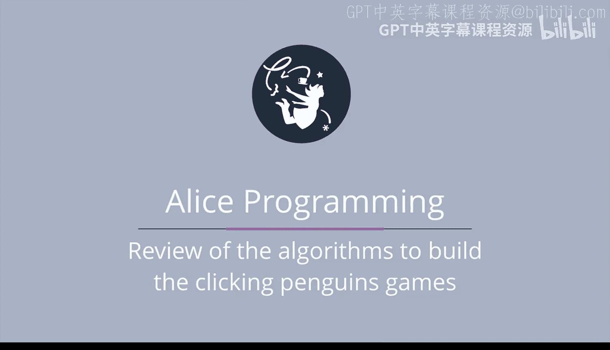

# 101：算法理论回顾 🧠




在本节课程中，我们将回顾之前构建的两个项目，通过对比分析来深入理解循环条件与数组在算法中的应用。我们将重点关注如何根据游戏状态动态调整程序逻辑。

---

## 概述

在本节中，我们将分析“点击两只企鹅”和“点击九只企鹅”两个游戏的代码。我们将探讨它们的相似之处与关键差异，特别是循环条件的构建方式以及如何利用数组和函数来简化多对象的管理。

---

## 项目回顾：从实践到理论

在之前的课程中，我们通常先介绍特定编程结构或技术的理论，再进行演示。本节我们将反其道而行之，通过对已完成的实践项目进行反思，来巩固对算法的理解。

### 点击两只企鹅的游戏 🐧🐧

首先，我们回顾“点击两只企鹅”游戏中的代码。游戏的核心逻辑是：只要至少有一只企鹅未被点击（颜色仍为白色），游戏就应继续。

因此，我们需要修改`while`循环的条件，以反映“至少一只企鹅为白色”这一状态。进入循环后，可能有两种情况：两只企鹅都仍是白色，或者其中一只已被点击并变为红色。

以下是处理逻辑的核心思路：

在循环内部，我们需要对每只企鹅进行单独检查。只有当某只企鹅仍为白色时，才让它随机移动并执行“弹出”动作。

### 点击九只企鹅的游戏 🐧🐧🐧...

“点击九只企鹅”的游戏则有所不同，主要体现在两个关键方面。

**第一个显著差异是循环条件的构建方式。**
我们意识到，为九只企鹅编写一个冗长的九重“或”条件是不现实的。例如，像 `penguin1是白色 或 penguin2是白色 或 penguin3是白色...` 这样的代码会非常臃肿。

取而代之，我们创建了一个函数。这个函数会检查数组中是否至少有一只企鹅是白色的，并返回`true`或`false`。使用数组起初可能感觉陌生，但它使我们能够灵活处理任意数量的企鹅对象。

以下是该函数的逻辑流程：
1.  遍历数组中的所有企鹅元素。
2.  如果遇到颜色为白色的企鹅，则立即返回 `true`。
3.  如果遍历完所有企鹅后都没有发现白色企鹅，则返回 `false`。

**第二个重要差异在于企鹅的行为逻辑。**
在九只企鹅的游戏中，并非所有白色企鹅都会随机移动。程序会从所有仍是白色的企鹅中**随机选择一只**，让这只被选中的企鹅执行“弹出并收回”的动作。

而在两只企鹅的游戏中，最初两只白色企鹅都会随机移动并弹出。

---

## 核心概念对比与总结

除了上述两点差异，两个游戏的基本框架非常相似。

当涉及的条件对象只有两个时（例如两只企鹅），直接使用逻辑“或”来构建循环条件通常是最简单直接的方法。

然而，一旦涉及三个或更多对象，使用函数配合数组遍历来检查条件就会变得清晰且高效。这种方法避免了代码重复，提升了可维护性和可扩展性。

建议重新运行这两个项目，仔细体会它们之间微妙的逻辑差异，这将帮助你更好地掌握条件判断和数组迭代的应用场景。

---

## 本节总结

本节课我们一起回顾并对比分析了两个点击企鹅游戏的算法实现。我们学习了：
1.  如何为不同数量的对象设计循环条件。
2.  如何利用**函数**和**数组迭代**来简化多对象的状态检查，其核心代码逻辑可概括为：
    ```python
    def check_any_white(penguin_array):
        for penguin in penguin_array:
            if penguin.color == "white":
                return True
        return False
    ```
3.  理解了在管理多个对象时，集中处理（如随机选择一只行动）与分散处理（每只独立行动）的不同策略。


通过这种从实践反推理论的方式，希望你能够更深刻地理解如何根据具体需求，灵活运用循环、条件和数据结构来构建有效的程序逻辑。