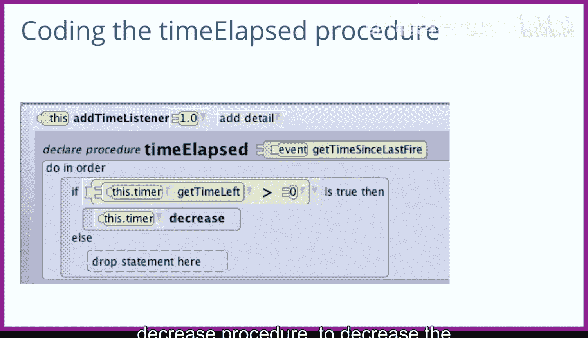

# 105：计时器 🕐


在本节课中，我们将学习如何在Alice中为游戏添加计时器功能。我们将修改“点击企鹅”游戏，挑战玩家在30秒内点击10只企鹅。实现这个目标需要我们理解并使用计时器，它与我们之前学过的分数系统既有相似之处，也有不同。

上一节我们介绍了如何使用分数来追踪玩家的成就。本节中，我们来看看它的“对立面”——计时器。分数值通常随着玩家的成功操作而增加，而计时器的值（剩余时间）则通常随着时间流逝而减少。

## 创建计时器显示

在Alice中实现计时器的方法与实现分数非常相似。首先，我们需要在场景中添加一个3D文本模型来显示时间。

以下是创建计时器显示文本的步骤：
1.  从模型库中添加一个“3D文本”模型。
2.  为其命名，例如 `timer`。
3.  设置其颜色（例如蓝色）和初始值（例如 `30`）。

## 添加时间属性

与分数一样，屏幕上显示的是**字符串**，但我们无法对字符串进行数学运算（如减1）。因此，我们需要一个单独的属性来存储实际的剩余时间数值。

我们创建一个名为 `timeLeft` 的**整数**属性，并将其初始值设为30。使用整数是因为时间通常以整秒为单位递减。

```alice
// 属性定义示例
property timeLeft: 30
```

## 编写更新计时器的过程

接下来，我们需要编写一个过程来更新计时器。这涉及“双重记账”：既要更新存储时间的属性，也要更新屏幕上显示的文本。

以下是 `decreaseTimer` 过程的内容：
1.  将 `timeLeft` 属性的值减1：`set timeLeft to timeLeft - 1`
2.  将 `timer` 3D文本的文本内容设置为 `timeLeft` 的新值。由于 `timeLeft` 是数字，我们需要将其转换为字符串才能显示。可以通过连接一个空字符串来实现：`set timer.text to "" + timeLeft`

## 设置定时事件

计时器与分数最大的不同在于其调用方式。分数通常在玩家完成某个动作（如点击企鹅）时通过事件触发增加。而计时器需要**每隔一秒钟**自动减少。

Alice提供了一个特殊的“时间监听器”事件来实现这个功能。

设置定时事件的步骤如下：
1.  在事件编辑器中，点击“创建新事件”，选择“While the world is running” -> “Every [1] seconds”。
2.  这会创建一个名为 `timeElapsed` 的过程，它每秒会自动被调用一次。

## 编写时间流逝逻辑

在 `timeElapsed` 过程中，我们需要判断游戏是否仍在进行。只要剩余时间大于0，我们就调用 `decreaseTimer` 过程来减少时间。

其逻辑代码如下：
```alice
// 在 timeElapsed 过程中
if timeLeft > 0
    decreaseTimer
end if
```

现在，让我们看看计时器在游戏中是如何运作的。当游戏开始时，计时器从30开始显示，并每秒减少1。这为玩家创造了一个时间压力，他们必须在时间归零前完成点击10只企鹅的目标。



本节课中，我们一起学习了如何在Alice中创建和使用计时器。我们了解了计时器与分数的异同，掌握了创建计时器显示、添加时间属性、编写更新过程以及设置定时事件监听的关键步骤。通过将这些概念结合起来，你就能为游戏添加时间限制，从而增加游戏的挑战性和趣味性。