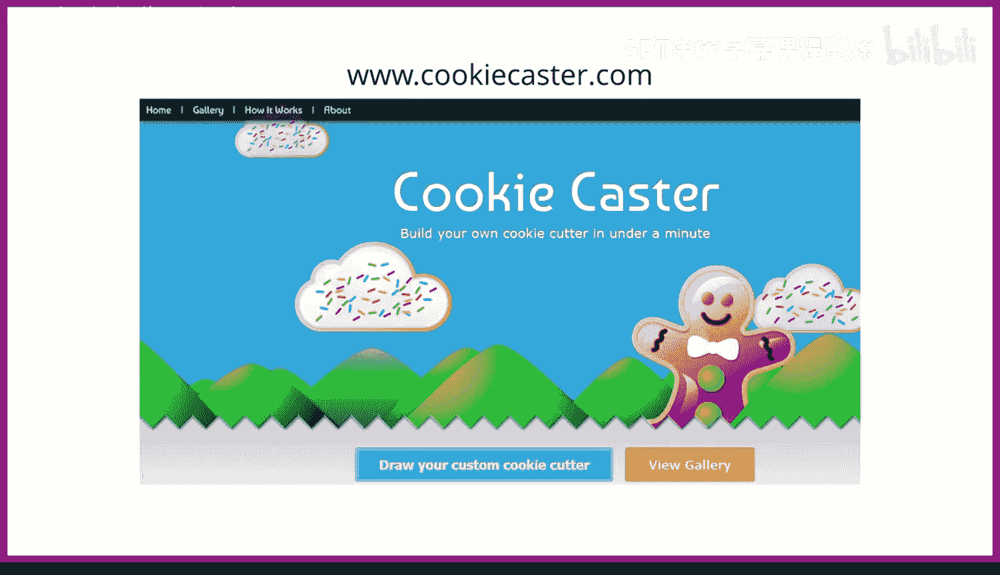
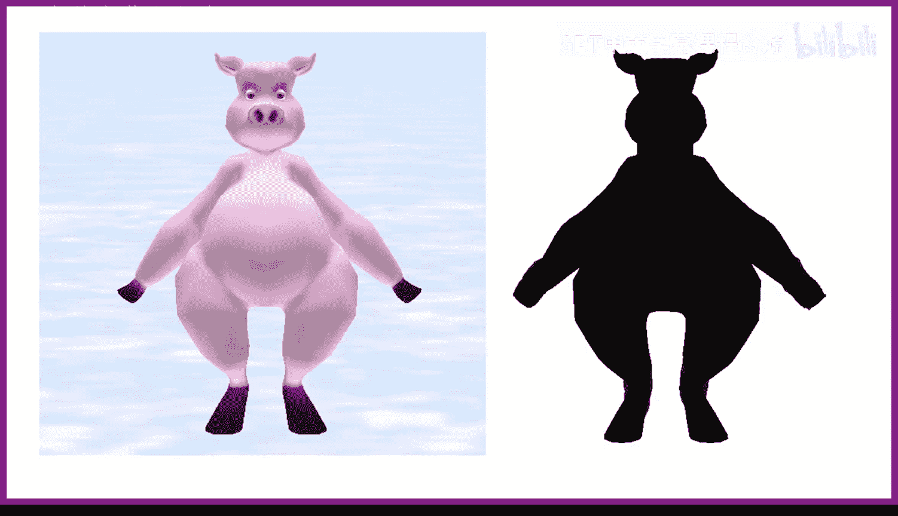
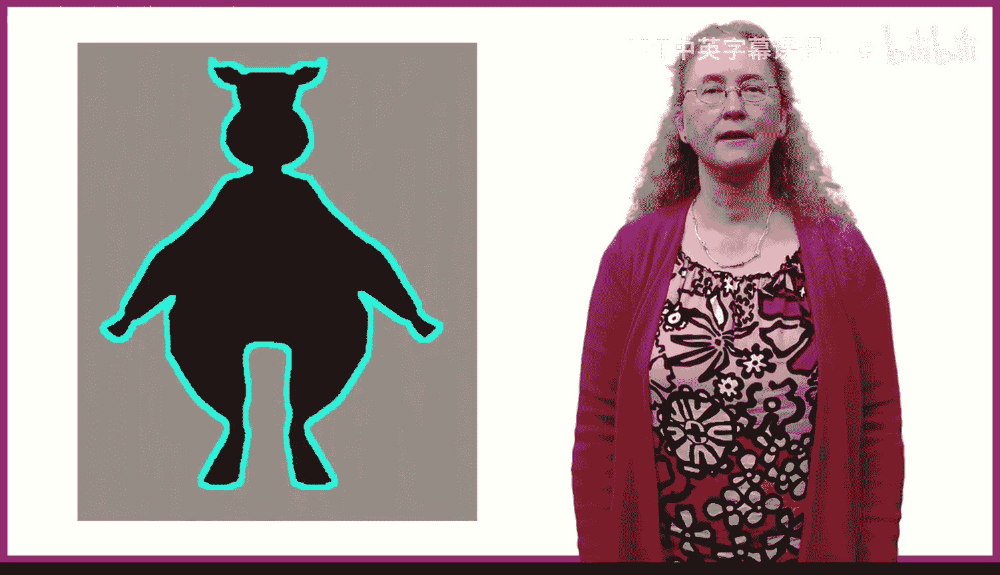
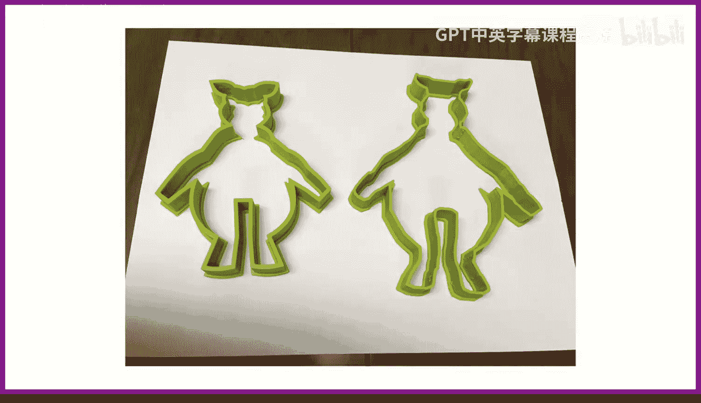
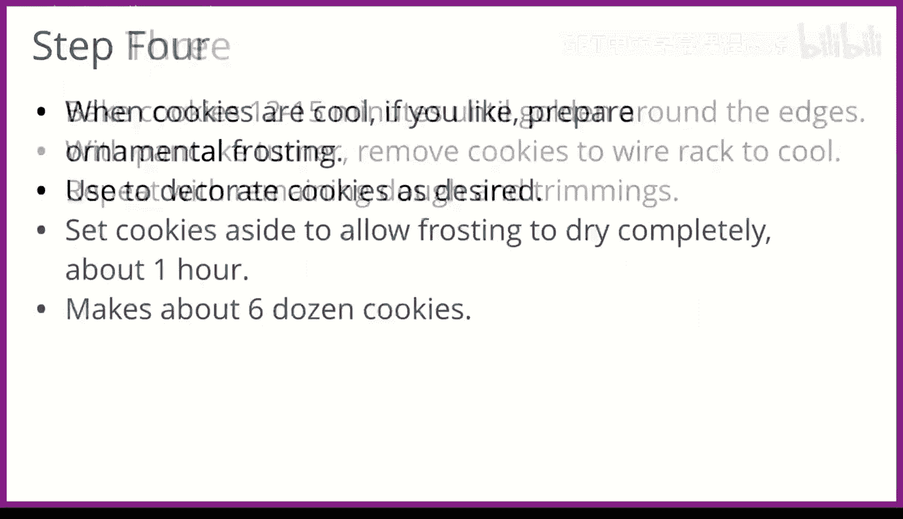

# 108：制作爱丽丝饼干 🍪

在本节课中，我们将学习如何将你喜爱的爱丽丝（Alice）编程环境中的角色对象，制作成美味的饼干。这是一个充满趣味的过程，我们将从选择角色开始，逐步介绍制作饼干模具、烘焙以及装饰的完整步骤。

---

## 选择角色与制作模具 🐷

上一节我们介绍了课程目标，本节中我们来看看如何选择角色并为其制作饼干模具。

首先，在爱丽丝中选择一个你想制作成饼干的角色。这里我们以猪（Pig）角色为例。制作与角色形状一致的饼干有多种方法，以下是三种常见方式：

1.  **使用3D打印机创建饼干模具**。
2.  **用刀具直接切割出形状**。
3.  **通过弯曲厚金属条自制饼干模具**。

本教程将主要聚焦于使用3D打印机制作饼干模具。即使你没有3D打印机，也可以将设计文件发送给专业的3D打印服务商进行制作。

我使用网站 `cookiecaster.com` 来设计猪形状的饼干模具。具体步骤如下：

1.  在爱丽丝项目中放入猪角色。
2.  进入场景设置（Scene Setup）。
3.  将猪涂成黑色以获得良好对比度。
4.  将地面设置为不可见（不透明度设为0）。
5.  选择场景，将大气颜色（Atmosphere Color）设为白色。
6.  最终得到一个白色背景上的黑色猪图像，对比鲜明。
7.  截取这张黑色猪的图片，并上传至 `cookiecaster.com` 网站。

该网站会自动追踪高对比度图像的轮廓。点击猪的图像后，它会自动绘制出饼干模具的形状。接着，下载生成的STL格式文件。找到3D打印机，将STL文件转换为打印机可识别的格式。在打印前，你可以预览3D饼干模具的样式。

打印过程可能需要数小时。最终，我制作了两个不同尺寸的猪形状饼干模具。

---

## 准备与烘焙饼干 🧑‍🍳

上一节我们完成了模具的制作，本节中我们来看看如何准备面团并烘焙饼干。

现在开始烘焙饼干。你需要先制作面团。我最喜欢的配方是一种简单的沙塔尔饼干（Sand Tart），原料包括面粉、糖、黄油、鸡蛋、香草精等。该配方源自1996年12月的《好管家》（Good Housekeeping）杂志。

我通常一次性制作两份面团，使用两个碗。每份面团再分成三个面团球。你可以将面团冷冻数天，待需要时再使用。

如果没有3D打印机（我很多年前也没有），可以采用以下替代方法：

*   打印出角色的图片，然后用刀具沿着图片轮廓切割面团。
*   使用金属条工具包，将金属条弯曲成所需形状来自制饼干模具。

面团准备好后，开始制作饼干。清理桌面区域，拿出烤盘、擀面杖，并在桌上撒些面粉。同时，准备一个放置烤好饼干的地方，铺上蜡纸。如果先润湿桌面，蜡纸会粘得更牢。

将解冻（可用微波炉快速解冻，但注意不要过度）的面团擀平。将擀平的面团转移到烤盘上再切割形状，比先切割再转移更容易，能避免形状损坏。

在烤盘的面团上，你可以手动切割饼干（这是我多年来制作爱丽丝饼干的方式），即把图片放在面团上，用锋利的刀沿着形状切割。但如果使用3D饼干模具，效率会高得多——只需将模具按压进面团即可。如果你计划制作大量饼干，强烈建议自制饼干模具。

转移一大片擀平的面团可能很困难，容易撕裂。替代方法是，将面团切成合适大小的块，再铺到烤盘上。然后用饼干模具按压，即可得到饼干坯。

将一整盘饼干坯放入烤箱烘烤，大约需要16分钟。烤好的饼干放在桌上铺好的蜡纸上冷却，它们冷却得很快，香气扑鼻。

---

## 装饰饼干 🎨

上一节我们完成了饼干的烘焙，本节中我们来看看如何为饼干上色装饰。

接下来装饰饼干。你需要糖霜（Icing）。我主要使用白色糖霜，它必须是纯白的。香草糖霜略带黄色，如果加入红色等其他颜色，黄色会将其变成橙色。如果在杂货店找不到，手工艺品店通常有售。

如果需要黑色，我发现最容易的方法是使用巧克力糖霜并加入黑色食用色素。如果向白色糖霜中加入黑色，需要大量色素才能使其变黑。

以猪饼干为例，我们需要以下颜色：
*   **粉色**用于身体。
*   **黑色**用于蹄子。
*   **灰色**用于鼻孔。
*   **白色和蓝色**用于眼睛。

我喜欢使用食用色素凝胶（Food Gel Colors），它们更浓稠，不会稀释糖霜。

首先，将少量粉色凝胶与白色糖霜混合，制作一大份粉色糖霜。然后将所有猪饼干涂成粉色。接着，用黑色糖霜添加蹄子、眼睛和鼻孔。装饰完成后，饼干看起来非常不错。我总共制作了超过100块猪饼干。

---

## 总结 📝

本节课中，我们一起学习了制作爱丽丝饼干的完整流程。我们从在爱丽丝中选择角色开始，介绍了三种制作饼干模具的方法，并重点讲解了利用3D打印技术设计并制作模具的步骤。接着，我们学习了如何准备面团、使用模具切割形状并进行烘焙。最后，我们探讨了使用不同颜色的糖霜来装饰饼干，使其更加生动逼真。希望你能享受制作属于你自己的爱丽丝饼干的乐趣！