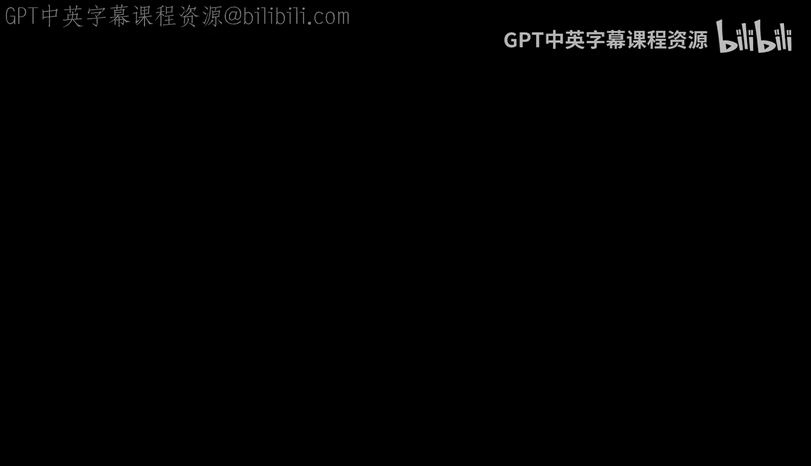
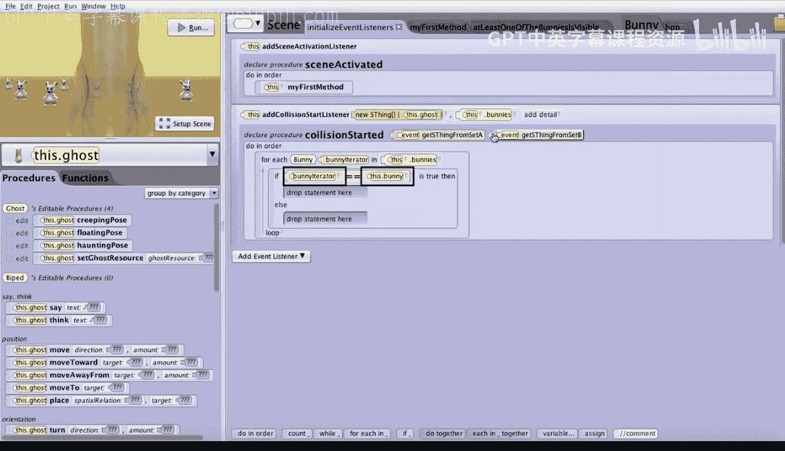
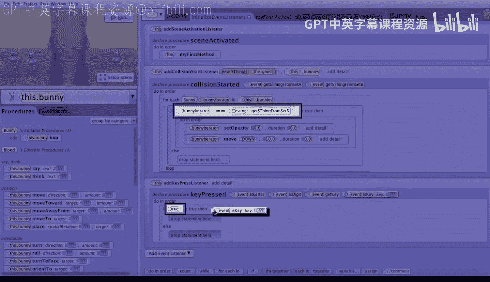

# 112：碰撞检测演示

在本节课中，我们将学习如何构建一个简单的游戏，其中幽灵角色需要与屏幕上的兔子发生碰撞。我们将重点实现游戏的主循环、碰撞检测逻辑以及键盘控制事件。

## 概述

我们将分步构建一个游戏。项目中已包含一个幽灵角色和一个兔子数组。幽灵的透明度被设置为0.7，以便玩家能部分看透它。摄像机被设置为幽灵的“载具”，这意味着玩家的视角将跟随幽灵移动。每个兔子都有一个名为 `hop` 的简单过程，使其在原地上下跳动。我们的目标是编写代码，让未被碰撞的兔子持续跳动，并处理幽灵与兔子之间的碰撞事件。

## 构建游戏主循环

上一节我们介绍了项目的基本设置，本节中我们来看看如何创建游戏的主驱动循环，让未被碰撞的兔子持续跳动。

首先，点击“我的第一个方法”，然后拖入一个 **`do in order`** 块。这是因为我们需要按顺序执行两件事：首先是一个 `while` 循环，只要还有兔子可见，就让它们跳动；其次是在游戏结束后，让幽灵发表一句祝贺玩家的声明。

让我们从 `while` 循环开始。将 `while` 块拖入 `do in order` 中，并暂时选择 `true` 作为占位符条件。实际上，我们希望进入循环的条件是：**至少有一只兔子仍然可见**。

我们需要编写一个布尔函数来判断是否至少有一只兔子可见。

以下是创建此函数的步骤：
1.  点击“场景”，然后添加一个场景函数。
2.  将返回类型设置为 **`Boolean`**，因为此函数将返回 `true` 或 `false`。
3.  将函数命名为“至少有一只兔子可见”。
4.  在函数体内，拖入一个 **`for each in`** 块。我们将遍历兔子数组，寻找可见的兔子。
5.  迭代器类型选择“图库类”中的 **`Bunny`**。
6.  将项目名称设为“bunnyIterator”，并将数组关联到我们的“bunnies”数组。
7.  在循环体内，拖入一个 **`if`** 语句，暂时选择 `true` 作为条件。
8.  将条件改为：检查迭代器兔子的不透明度是否大于0。这需要几个步骤：
    *   将条件改为关系判断（小数），选择“大于”。
    *   将左侧占位符改为 `this.bunny` 的“不透明度”属性。
    *   将 `this.bunny` 改为 `bunnyIterator`。
    *   将右侧值设为自定义小数 **`0`**。
9.  如果条件为真（即兔子可见），则立即 **`return true`**。
10. 在 `for each` 循环结束后，拖入一个 **`return false`** 语句。这表示如果遍历了所有兔子都没有找到可见的，则返回假。

**注意**：最后的 `return false` 语句必须放在函数末尾，而不是 `if` 语句的 `else` 分支中。否则，只要第一只兔子不可见，游戏就会错误地判定为结束。

现在，回到“我的第一个方法”。我们可以将 `while` 循环的条件从 `true` 替换为我们刚写的函数“至少有一只兔子可见”。这样，只要还有兔子可见，循环就会继续。

在 `while` 循环内部，我们需要让所有可见的兔子跳动。以下是实现步骤：
1.  拖入一个 **`for each in`** 块到 `while` 循环内。
2.  类型再次选择“图库类”中的 **`Bunny`**，项目名称设为“bunnyIterator”，关联到“bunnies”数组。
3.  在循环体内，拖入一个 **`if`** 语句，检查当前迭代的兔子是否可见（不透明度 > 0）。设置条件的方法与在函数中完全相同。
4.  如果兔子可见，则调用它的 `hop` 过程。这同样需要两步：先拖入 `this.bunny` 的 `hop` 过程，然后将 `this.bunny` 改为 `bunnyIterator`。

最后，在 `while` 循环结束后，让幽灵说一句话来祝贺玩家。将对象改为 `this.ghost`，然后拖入一个“说”指令，内容可以是“干得漂亮”，持续时间设为几秒。

现在运行项目，你会看到所有尚未被碰撞的兔子在同步地上下跳动。

## 实现碰撞检测事件

上一节我们完成了游戏的主循环，本节中我们来看看如何实现碰撞检测，让幽灵能够“抓住”兔子。

首先，点击“初始化事件监听器”，然后添加一个事件监听器。选择“位置与方向”类别，添加一个 **`碰撞开始监听器`**。

我们需要指定哪些对象可能发生碰撞：
*   **集合A**：设置为自定义数组，并添加 `this.ghost`（幽灵）。
*   **集合B**：设置为 `this.bunnies`（兔子数组）。

这样，我们就创建了一个监听幽灵与任何兔子之间碰撞的事件。

当碰撞发生时，我们需要找出具体是哪只兔子与幽灵相撞。以下是处理碰撞的步骤：
1.  在碰撞事件的处理块中，拖入一个 **`for each in`** 块，用于遍历兔子数组。
2.  类型选择“图库类”中的 **`Bunny`**，项目名称设为“bunnyIterator”，关联到“bunnies”数组。
3.  在循环体内，拖入一个 **`if`** 语句。我们需要检查当前迭代的兔子（`bunnyIterator`）是否就是碰撞事件中“集合B”的那个对象。
4.  将条件设置为关系判断中的“是同一事物”。左侧放入 `bunnyIterator`，右侧放入从事件中获取的“集合B中的项目”。
5.  如果匹配成功（即这只兔子就是被撞的），我们需要按顺序做两件事：将其不透明度设为0（使其不可见），然后将其向下移动10个单位（移出视野）。
6.  在 `if` 语句内拖入一个 **`do in order`** 块。
7.  在 `do in order` 内，首先设置兔子的不透明度为0：将对象改为 `bunnyIterator`，然后使用“设置不透明度为”指令，值设为 **`0`**。
8.  接着，让同一只兔子向下移动10个单位：使用“移动”指令，方向“下”，距离 **`10`** 米。
9.  将这两个指令的持续时间都设为 **`0`** 秒，使变化立即发生。

## 添加键盘控制事件

上一节我们实现了碰撞检测，本节中我们来看看如何添加键盘控制，让玩家能够操作幽灵移动。

我们需要添加一个按键事件来处理玩家按下左、右和上箭头键。

1.  再次点击“添加事件监听器”，选择“键盘”类别，添加一个 **`按键按下监听器`**。
2.  我们需要用 `if` 语句来检查具体按下了哪个键。首先拖入一个 **`if`** 语句。
3.  将条件设置为检查事件中的“按键是”属性，并选择“左箭头”键。
4.  如果左箭头键被按下，让幽灵向左转0.01圈。将对象改为 `this.ghost`，使用“转向”指令，方向“左”，量 **`0.01`** 圈，持续时间设为 **`0.1`** 秒使其反应迅速。
5.  在第一个 `if` 语句的“否则”分支后，添加另一个 **`if`** 语句，检查按键是否是“右箭头”键。
6.  如果是，让幽灵向右转0.01圈，持续时间同样为0.1秒。
7.  在第二个 `if` 语句的“否则”分支后，添加最后一个 **`if`** 语句，检查按键是否是“上箭头”键。
8.  如果是，让幽灵向前移动0.05米，持续时间设为0.1秒。

为了让按键可以持续响应（按住键时连续移动），我们需要修改事件策略。点击事件上的“添加细节”按钮，选择“多重事件策略”，然后选择“组合按键按下”。

## 总结

本节课中我们一起学习了如何构建一个完整的简单游戏。我们实现了游戏的主循环，让可见的兔子持续跳动；编写了碰撞检测逻辑，使幽灵与兔子碰撞后兔子会消失；并添加了键盘控制事件，让玩家能够操作幽灵移动。通过组合这些元素，我们创建了一个可交互的游戏体验。现在你可以运行项目，控制幽灵去碰撞兔子，看看效果如何。