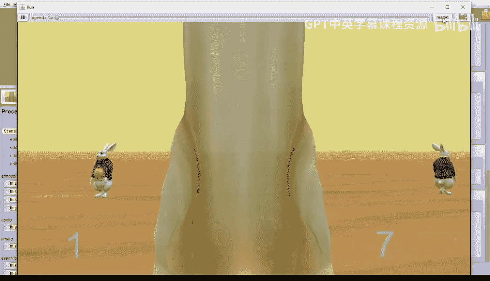

# 121：躲避障碍物碰撞兔子演示 🎮

在本节课中，我们将学习如何修改项目，让幽灵在追逐兔子的同时，学会躲避白色的兔子障碍物。我们将通过添加障碍物、设置碰撞事件以及让障碍物随机移动，来创建一个更具挑战性的游戏。

---

上一节我们介绍了游戏的基本框架，本节中我们来看看如何为游戏添加障碍物和碰撞检测。

我们首先对场景设置进行了几处修改。点击“设置场景”按钮，可以看到场景中已经添加了五只白色兔子作为障碍物。

此外，场景中还添加了一个对象标记，名为“幽灵起始位置”。当幽灵与任何一只白色兔子发生碰撞时，它将被移回这个起始位置。

点击“编辑代码”按钮，可以看到另外两处主要改动。

第一处改动在“场景”选项卡中。滚动到页面底部，会发现新增了一个场景属性。这是一个包含五只白色兔子的数组，名为 `obstacles`。

第二处改动在“白兔”对象中。为白兔新增了一个名为“漫游”的过程。这个过程会让白兔随机向前移动一小段距离，并随机向左或向右转动一小点角度。

---

为了让游戏一开始所有白兔就开始漫游，我们需要创建一个事件。

以下是创建该事件的步骤：

1.  转到“初始化事件监听器”选项卡，添加一个“场景激活监听器”。
2.  从列表底部添加名为“场景激活监听器”的事件监听器。
3.  我们希望当游戏剩余时间大于零时，所有白兔持续漫游。
4.  拖入一个 `while` 循环，将条件从 `true` 改为 `getTimeLeft() > 0`。
5.  在 `while` 循环内部，拖入一个 `each in together` 循环，用于同时遍历所有白兔。
6.  将循环类型设为 `Gallery.WhiteRabbit`，迭代器名称设为 `whiteRabbitIterator`，数组使用 `obstacles`。
7.  最后，在循环体内，调用 `whiteRabbitIterator` 的 `wander` 过程。

---

接下来，我们需要创建幽灵与白兔障碍物之间的碰撞事件。

以下是创建碰撞事件的步骤：

1.  点击底部的“添加事件监听器”，选择“位置与方向”，然后添加“碰撞开始监听器”。
2.  第一个碰撞集设为“自定义数组”，并只添加幽灵对象。
3.  第二个碰撞集直接选择我们之前创建的 `obstacles` 数组。
4.  在碰撞事件触发时，我们希望幽灵被移回起始位置。因此，在事件内部，拖入幽灵的 `moveAndOrientTo` 方法，并选择“幽灵起始位置”作为目标。

---

现在，游戏已经可以运行了。你的目标是点击白色和蓝色的兔子来得分，同时要小心躲避那些四处漫游的白色兔子障碍物。

点击运行，使用方向键控制幽灵。如果不小心撞到白兔，你会被弹回起点。努力在时间结束前获得尽可能高的分数吧！

---

本节课中我们一起学习了如何为游戏添加动态障碍物。我们创建了一个障碍物数组，为障碍物编写了随机移动的行为，并设置了碰撞检测事件来增加游戏难度。通过这些步骤，你的游戏变得更加丰富和具有挑战性。