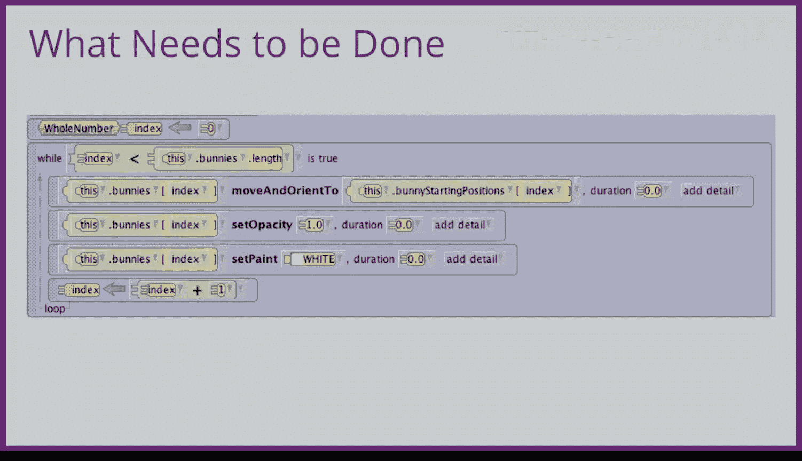

# 122：为游戏添加多关卡 🎮


在本节课中，我们将学习如何为碰撞得分游戏添加多关卡功能。通过引入不同难度级别的关卡，可以显著提升游戏的可玩性和挑战性。我们将重点讲解如何管理关卡状态，以及在玩家完成一个关卡后如何重置游戏场景。

---

## 概述

本节教程将指导你为游戏创建多个关卡。我们将构建一个包含两个关卡的示例，但你可以轻松扩展至更多。核心思想是让后续关卡比初始关卡更具挑战性。例如，我们可以要求玩家获得更高的分数、添加更多障碍物，或者让游戏对象的行为更复杂。在本例中，我们将在更难的关卡中让兔子在跳跃时随机移动，这比在原地跳跃的兔子更难被碰撞到。

---

## 核心挑战与解决方案

在游戏中处理多关卡存在两个概念上的挑战。

### 第一：关卡状态管理

游戏的每个部分都需要知道玩家当前处于哪个关卡。最简单的方法是使用一个**场景属性**或变量。

我们可以创建一个名为 `level` 的场景属性，并初始设置为 `1`，表示玩家从第一关开始。

**代码示例：**
```
场景属性：level = 1
```

### 第二：关卡重置

一旦玩家成功完成一个关卡，所有游戏元素都需要被重置，以便开始下一关。这包括重置计时器，可能还需要重置玩家的分数。

更具挑战性的是将所有场景对象恢复到其初始位置和状态：
*   幽灵需要回到初始位置。
*   所有兔子需要回到初始位置，颜色变回白色，不透明度重置为 `1`。
*   所有障碍物需要回到初始位置。

---

## 实现兔子位置重置

为了将兔子移回起始位置，我们将使用一个巧妙的编程技巧。

在场景设置阶段，我们为每只兔子添加了一个**对象标记**。然后，我们创建了另一个数组，其中包含了所有这些对象标记。

**关键步骤：**
*   如果 `Bunny1` 在兔子数组的 `0` 号位置，我们确保将 `Bunny1` 的标记放在“兔子起始位置”数组的 `0` 号位置。
*   如果 `Bunny2` 在兔子数组的 `1` 号位置，我们确保将 `Bunny2` 的标记放在“兔子起始位置”数组的 `1` 号位置。

这样，我们就得到了一对**并行数组**。

---

## 使用 While 循环遍历数组

为了同时处理这两个并行数组，我们需要一种新的遍历数组的方法：使用 **`while` 循环**（也称为数组索引循环），而不是 `for each in` 或 `each in together` 迭代器。

我们需要使用 `while` 循环的原因是，我们必须同时访问两个数组中相同索引位置的元素，而迭代器一次只能遍历一个数组。

**实现方法：**
1.  我们使用一个名为 `index` 的整数变量，并将其初始值设为 `0`。
2.  在循环中，我们可以让兔子数组中索引为 `index` 的元素，移动并朝向“兔子起始位置”数组中索引为 `index` 的元素。
3.  每次循环后，将 `index` 的值增加 `1`，直到遍历完所有兔子。

**代码逻辑示例：**
```
index = 0
while index < 兔子数组的长度
    兔子数组[index].moveTo(起始位置数组[index])
    兔子数组[index].setPaint(白色)
    兔子数组[index].setOpacity(1)
    index = index + 1
```

这种 `while` 循环方法虽然不如迭代器优雅，但它允许我们将所有10只兔子移回其原始位置，并将它们的颜色重置为白色，不透明度重置为 `1`。

---

## 完成重置并开始新关卡

在将兔子重置到初始场景中的原始位置并更新关卡级别后，游戏就准备就绪，可以再次开始了。

通过这种方式，我们建立了一个清晰的关卡推进和重置机制，为游戏增添了结构和可重复游玩的乐趣。

---

## 总结



本节课中，我们一起学习了如何为游戏添加多关卡系统。我们介绍了管理关卡状态的核心变量，并详细讲解了在关卡切换时如何重置游戏对象，特别是利用并行数组和 `while` 循环来精确恢复兔子的初始状态。掌握这些概念后，你就可以为自己的游戏设计出丰富多样的关卡挑战了。