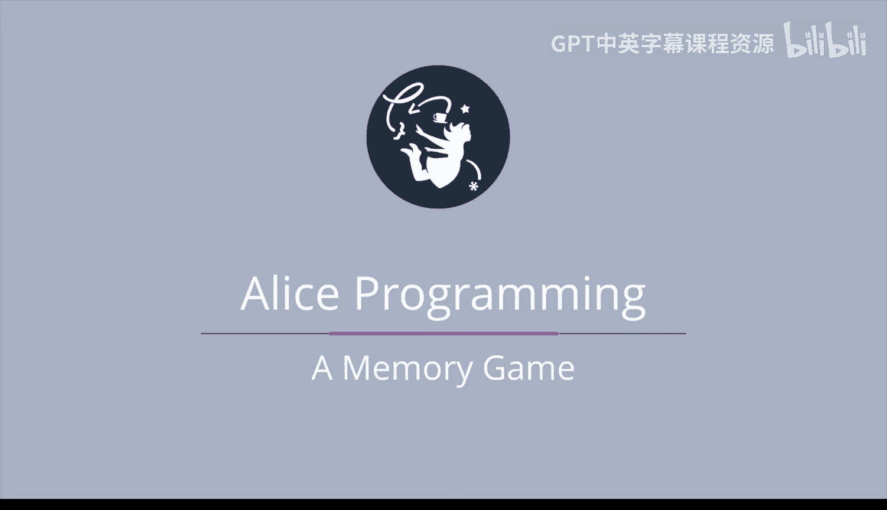

# 130：记忆游戏 🧠




在本节课中，我们将学习如何设计一个记忆游戏。玩家需要记住一组兔子变色的顺序，并按正确顺序点击它们。我们将探讨如何随机排列数组元素、如何向玩家展示顺序，以及如何验证玩家的输入。

---

## 游戏设计概述

上一节我们介绍了如何在爱丽丝中切换场景，本节中我们来看看如何设计三个游戏或任务。第一个游戏是记忆游戏。

我们将从一个兔子数组开始。每只兔子在数组中的位置会显示在兔子下方。例如，Bunny 1 在数组的位置 0，Bunny 2 在位置 1，依此类推。

在这个游戏中，我们会随机重新排列数组中兔子的顺序。请注意，兔子本身并没有移动，只是它们在数组中的位置被重新排列了。

---

## 随机交换数组元素

以下是实现随机交换的核心挑战：如何交换数组中两个兔子的位置。

我们可以通过生成两个 0 到 6 之间的随机数来选取要交换的位置。假设我们生成了 3 和 5。我们希望位置 3 的数组元素变成原来位置 5 的兔子，同时位置 5 的数组元素变成原来位置 3 的兔子。

直接交换很困难，这类似于试图同时交换两个杯子中的果汁而不洒出来。一个更简单的方法是引入一个临时变量。

在爱丽丝中，代码实现遵循同样的思路：
```javascript
// 假设 bunnies 是兔子数组，index1 和 index2 是要交换的两个索引
temp = bunnies[index1];
bunnies[index1] = bunnies[index2];
bunnies[index2] = temp;
```

首先，将位置 3 的兔子存入临时变量 `temp`。接着，将位置 5 的兔子放入位置 3。最后，将 `temp` 中的兔子放入位置 5。这样就完成了交换。

---

## 向玩家展示顺序

第二个挑战是在进行多次交换后，向玩家展示新的兔子顺序。

这很简单。我们只需要遍历兔子数组，对于遍历到的每只兔子，将其颜色变为紫色，然后再变回白色。这样玩家就能看到兔子依次变色的顺序。

---

## 验证玩家输入

第三个挑战有些技巧性：我们需要记住玩家点击兔子的顺序，并确保它与数组中兔子被重新排列后的顺序一致。

解决方案是创建一个场景变量 `index`，初始值设为 0。当用户点击一只兔子时，我们检查这只兔子是否与 `bunnies` 数组中位置 `index` 的兔子匹配。

如果匹配，我们将 `index` 增加 1。这样，下次用户点击时，我们会检查是否与数组中位置 1 的兔子匹配，依此类推。

然而，如果用户点击的兔子不匹配，我们立即将 `index` 设为 -1，表示玩家失败。因此，游戏在两种情况下结束：`index` 变为 -1（玩家失败），或 `index` 变为 7（玩家成功记住了从位置 0 到位置 6 的所有兔子顺序）。

---

## 总结


本节课中我们一起学习了如何构建一个记忆游戏。我们探讨了三个核心部分：使用临时变量随机交换数组元素、通过遍历和变色向玩家展示顺序，以及使用索引变量来跟踪和验证玩家的点击顺序。掌握这些概念后，你就可以在爱丽丝中创建自己的交互式记忆游戏了。