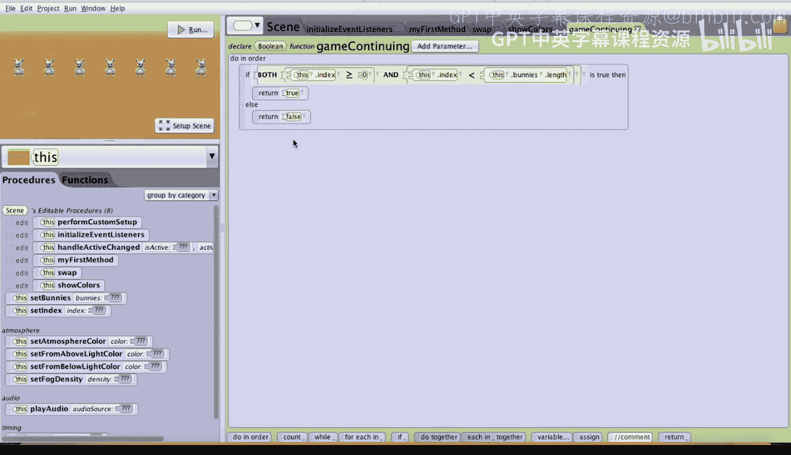
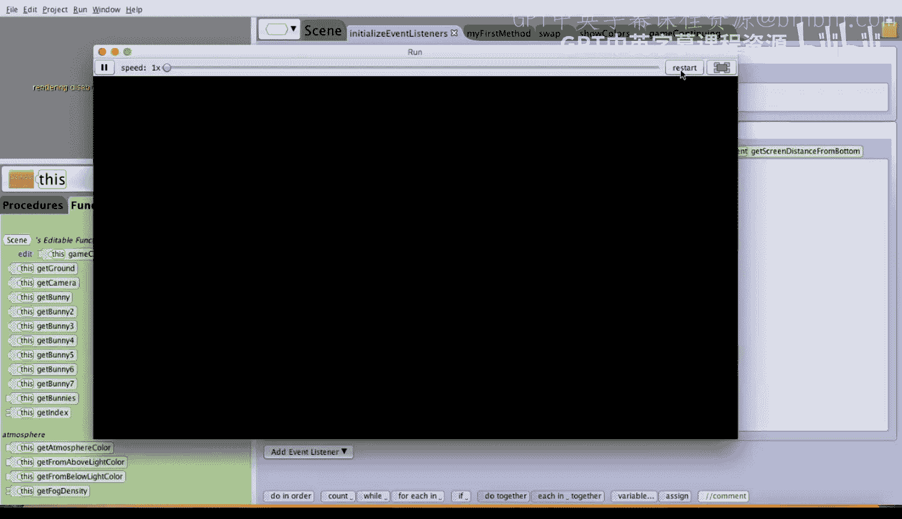
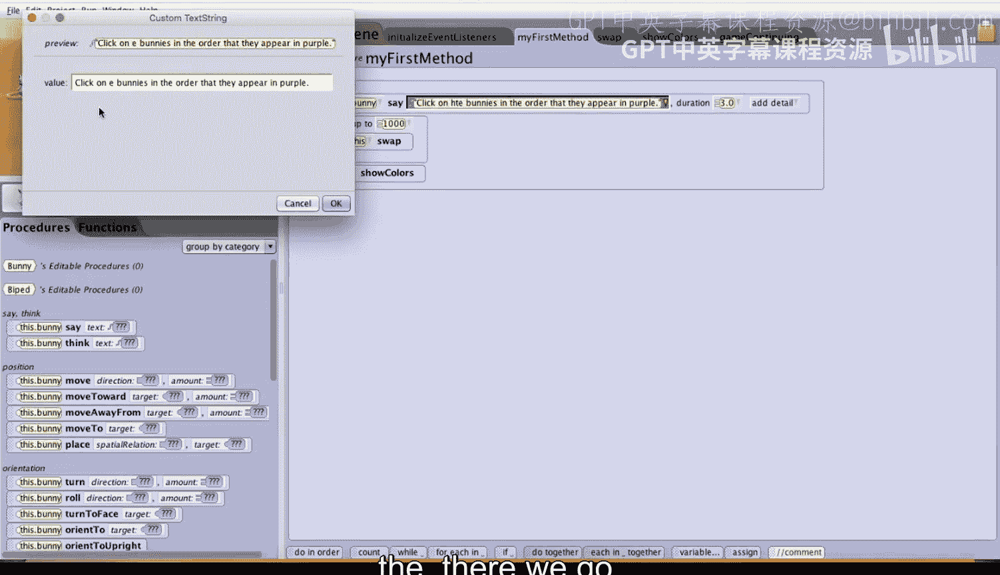

# 131：记忆游戏演示 🎮

在本节课中，我们将学习如何使用Alice创建一个简单的记忆游戏。游戏的核心玩法是：系统会打乱一组兔子模型的顺序并短暂展示，玩家需要按照它们展示的顺序依次点击兔子。我们将通过创建数组、编写随机交换算法、处理用户点击事件以及判断游戏胜负状态来完成这个项目。

---

## 场景与变量初始化 🐰

首先，我们来看看初始场景的设置。点击场景标签页，可以看到场景中唯一的对象是七只兔子。

一个名为 `Bunnies` 的数组已被创建，并按顺序填充了这七只兔子：`Bunny`, `Bunny2`, `Bunny3`, `Bunny4`, `Bunny5`, `Bunny6`, `Bunny7`。

此外，还有一个名为 `index` 的整数变量，其初始值被设置为 `0`。除了这些基础设置，目前还没有编写任何游戏逻辑。

---

## 第一步：打乱兔子顺序 🔀

上一节我们介绍了游戏的基础设置，本节中我们来看看如何打乱兔子的顺序。游戏的第一部分需要将数组中的兔子随机打乱顺序。

我们可以从创建一个场景级别的 `swap`（交换）过程开始。

以下是创建 `swap` 过程的步骤：

1.  **添加过程**：点击“添加场景过程”按钮，将其命名为 `swap`。
2.  **组织步骤**：首先拖入一个 `do in order` 图块，以确保步骤按顺序执行。
3.  **生成随机索引**：我们需要生成两个介于 `0` 和 `6` 之间的不同随机数。因为将数组中同一位置的兔子与自己交换没有意义。
    *   创建一个名为 `index1` 的整数变量，将其初始值设为 `0`。
    *   然后，将 `index1` 的值改为一个随机数。使用 `random` 函数，范围设为从 `0` 到 `this.bunnies.length`（但不包括这个最大值）。**公式**：`index1 = random(0, this.bunnies.length)`。使用 `this.bunnies.length` 而非固定数字 `7` 的好处是，如果后续增减数组中的兔子数量，代码无需修改。
    *   同理，创建第二个整数变量 `index2`，并用相同方法为其赋予一个随机值。
4.  **确保索引不同**：在交换之前，必须确保 `index1` 和 `index2` 不相等。我们使用一个 `while` 循环来实现。
    *   拖入一个 `while` 循环，将其条件设置为 `index1 == index2`。
    *   在循环体内，为 `index2` 重新分配一个新的随机数。这样，只要两个索引相同，就会持续为 `index2` 生成新值，直到它们不同为止。
5.  **执行交换**：现在可以交换数组中这两个位置的兔子了。这需要一个临时变量。
    *   创建一个类型为 `Bunny` 的变量，命名为 `temp`。
    *   执行交换的三步操作：
        1.  将 `this.bunnies[index1]` 赋值给 `temp`。
        2.  将 `this.bunnies[index2]` 赋值给 `this.bunnies[index1]`。
        3.  将 `temp` 赋值给 `this.bunnies[index2]`。

至此，`swap` 过程就完成了。

---

## 第二步：展示打乱后的顺序 🎨

为了验证我们的交换是否有效，需要让玩家看到打乱后的顺序。接下来，我们创建一个过程来短暂地展示每只兔子的颜色。

我们将创建一个名为 `showColors` 的场景过程。

以下是 `showColors` 过程的实现步骤：

1.  **遍历数组**：拖入一个 `for each in` 图块。将迭代器类型设为 `Bunny`，命名为 `bunnyIterator`，并指定要遍历的数组为 `this.bunnies`。
2.  **改变颜色**：在循环体内，我们分两步改变每只兔子的颜色：
    *   首先，将 `bunnyIterator` 的油漆颜色设置为紫色，持续 `0.5` 秒。
    *   然后，再将颜色设置回白色，同样持续 `0.5` 秒。

这样，运行程序时，兔子们就会依次快速闪一下紫色。

现在，回到 `my first method` 中，在调用 `swap` 之后，紧接着调用 `showColors`。运行程序，你就能看到交换后的兔子顺序了。

为了更彻底地打乱顺序，我们可以在一个循环中多次调用 `swap`。例如，循环 `1000` 次，这样每次运行游戏，兔子都会以完全随机的顺序出现。

---

## 第三步：处理玩家点击与游戏逻辑 🖱️

现在兔子顺序已经打乱，我们需要处理玩家的点击操作，并判断点击是否正确。

我们转到 `initializeEventListeners` 标签页，为“鼠标点击对象”添加一个事件监听器。

以下是实现点击逻辑的步骤：

1.  **检查点击对象**：在事件处理中，首先使用一个 `if` 语句判断被点击的兔子是否是数组中当前 `index` 位置的那只。
    *   条件为：`this.bunnies[index] == event.getMouseClickedObject()`。
2.  **处理正确点击**：如果点击正确（匹配）：
    *   将 `index` 的值增加 `1`，这样玩家接下来就需要点击数组中的下一只兔子。
    *   然后，检查玩家是否已经获胜。获胜条件是 `index` 的值等于数组的长度（即 `this.bunnies.length`）。如果满足，可以让某只兔子说“You win!”。
3.  **处理错误点击**：如果点击错误（不匹配）：
    *   将 `index` 设置为 `-1`，表示游戏结束，玩家失败。
    *   可以让兔子说“That is not the correct order.”。

---

## 第四步：游戏状态管理 🏁

我们还需要一个机制来控制游戏是否应该继续响应点击事件。

为此，我们创建一个场景级别的布尔函数，命名为 `gameContinuing`。

以下是 `gameContinuing` 函数的逻辑：

*   游戏继续的条件是：`index >= 0` 并且 `index < this.bunnies.length`。
*   如果 `index` 变为 `-1`（玩家失败）或等于数组长度（玩家获胜），则游戏结束，函数返回 `false`。

然后，回到鼠标点击事件的处理中，在最外层包裹一个 `if` 语句，条件就是 `gameContinuing()`。这样，只有当游戏仍在进行时，才会处理玩家的点击。

---

## 最终完善与总结 📝

最后，我们可以为游戏添加一些初始提示。例如，在打乱顺序并展示颜色后，让一只兔子说：“Click on the bunnies in the order that they appear in purple.”，持续几秒钟。

运行游戏，现在你可以尝试按照紫色兔子出现的顺序点击它们了。如果顺序全部点击正确，你将赢得游戏！

---

本节课中我们一起学习了如何构建一个完整的记忆游戏。我们涵盖了以下核心概念：
*   使用**数组**管理多个对象。
*   编写**随机交换算法**来打乱数组顺序。
*   利用**循环**和**条件判断**实现游戏逻辑。
*   通过**事件监听**处理用户交互。
*   创建**函数**来管理复杂的游戏状态。

通过这个项目，你将掌握在Alice中创建交互式游戏的基本流程和关键编程技巧。