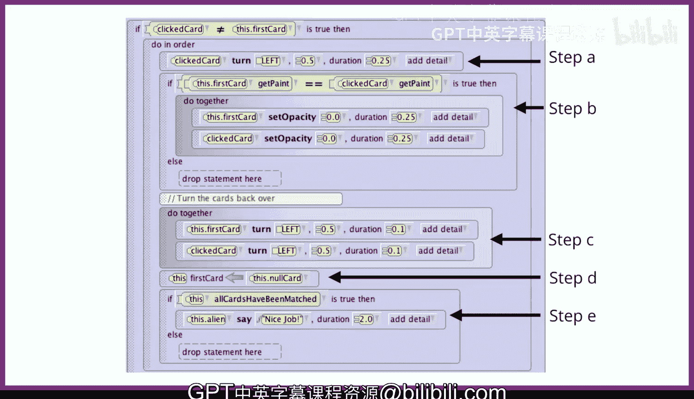

# 136：配对游戏 🃏


在本节课中，我们将学习如何创建一个经典的“配对游戏”。玩家需要点击翻转的卡片，找出颜色相同的配对。我们将学习如何使用变量来追踪游戏状态，以及如何处理玩家的点击事件。

---

## 游戏概述

我们将创建第三个也是最后一个游戏。具体来说，玩家需要通过点击卡片来匹配相同颜色的卡片对。

如图所示，游戏开始时，有12张背面朝上的卡片，隐藏了它们的颜色。由于爱丽丝没有标准的扑克牌，我们使用公告牌来模拟卡片。玩家点击卡片以尝试找到匹配的对。

在这个例子中，玩家点击了右上角的卡片，它是蓝色的。然后玩家点击了左下角的卡片，它是灰色的。它们不匹配，所以它们被重新翻转回去。

现在，假设玩家点击了左上角的卡片，然后点击了右上角的卡片。结果这两张卡片都是蓝色的，所以它们匹配，并从游戏中移除。

游戏继续进行，直到玩家找到所有六对匹配的卡片。此时，玩家获胜。

---

## 与记忆游戏的相似之处

这个游戏的一部分与记忆游戏非常相似。在记忆游戏中，我们需要打乱兔子的位置；在这里，我们打乱的是卡片，或者更准确地说，是卡片的颜色。

---

## 关键差异：追踪玩家点击

然而，存在一个显著的差异。这个差异取决于玩家的点击。

当玩家第一次点击一张卡片时，我们只是将卡片翻转过来。但是，一旦一张卡片被翻转，并且玩家点击了另一张卡片，爱丽丝就需要记住第一张被翻转的卡片是什么。然后我们可以比较两张卡片的颜色，看它们是否匹配。

记住一张卡片最简单的方法是使用一个变量。

---

## 使用变量追踪状态

我们可以从一个初始化为非12张游戏卡片的变量开始。我们添加了第13张卡片，并将其命名为 `null card`。我们最初将 `null card` 放置在玩家点击寻找配对卡片区域的左侧。

这张卡片用于追踪游戏玩家是在点击寻找配对的第一张卡片，还是第二张卡片。

如果 `first card` 变量的值是 `null card`，我们就知道玩家还没有点击任何卡片。

当游戏玩家第一次点击一张卡片时，我们将 `first card` 赋值为被点击的卡片。

当游戏玩家点击第二张卡片时，我们首先检查 `first card`。如果 `first card` 不是 `null card`，我们就知道玩家之前点击过一张卡片，我们可以比较这两张卡片（`first card` 和刚被点击的卡片）是否匹配。

因为我们实际上不希望游戏玩家点击 `null card`，我们会将 `null card` 放置在地面以下，这样玩家就看不到也无法点击它。

---

## 处理卡片点击的详细步骤

让我们更详细地了解一下处理卡片鼠标点击所涉及的步骤。我们需要做三件事：

1.  将点击到的 `S thing` 转换为一张卡片。
2.  处理“还没有被翻开的卡片”的情况。我们称这种情况为“处理第一张卡片”。
3.  处理“已经有一张被翻开的卡片”的情况。我们称这种情况为“处理第二张卡片”。

---

### 步骤一：转换点击对象

当我们处理鼠标点击事件时，爱丽丝会返回 `get model at mouse location`，这是一个 `S thing` 类型。因为爱丽丝不知道用户点击的是对象还是地面。

如果我们把 `get model at mouse location` 存储到一个 `S thing` 变量 `What got clicked` 中，我们需要遍历卡片列表来确定哪张卡片匹配。一旦找到匹配项，我们就可以将匹配的卡片存储到一个局部变量 `clicked card` 中。

**代码示例：**
```pseudocode
// 遍历所有卡片，找到被点击的那一张
for each card in listOfCards
    if card equals What got clicked
        set clicked card = card
    end if
end for
```

---

### 步骤二：处理第一张卡片

这是比较简单的情况。我们知道需要处理第一张卡片，如果场景变量 `first card` 被设置为 `null card`。

我们需要做两件事：
1.  将 `clicked card` 存储到 `first card` 中。
2.  将这张卡片翻转过来。

---

### 步骤三：处理第二张卡片

处理第二张卡片需要五个子步骤。在我们开始子步骤之前，我们需要确保玩家点击的是不同的卡片。如果玩家两次点击同一张卡片，我们可以直接忽略第二次点击。

以下是五个子步骤：

1.  **翻转第二张卡片**：这样玩家可以看到他们点击了什么。
2.  **检查颜色是否匹配**：如果两张卡片的颜色匹配，将它们的透明度设置为0（即隐藏）。
3.  **将两张卡片重新翻回去**：虽然从技术上讲，只有在卡片不匹配时才需要将它们翻回去，但我们每次都这样做。这样，如果我们想再玩一次游戏，所有卡片都会朝向同一个方向。
4.  **重置 `first card` 变量**：将 `first card` 重置为 `null card`。这样做的原因是，当下次玩家点击卡片时，我们希望爱丽丝将其作为第一张卡片处理。
5.  **检查游戏是否结束**：检查是否所有卡片都已匹配。如果玩家获胜，则祝贺他们。

**代码逻辑示例：**
```pseudocode
if first card is not null card
    // 子步骤1：翻转第二张卡片
    flip over clicked card

    // 子步骤2：检查是否匹配
    if color of first card equals color of clicked card
        set opacity of first card to 0
        set opacity of clicked card to 0
    end if

    // 子步骤3：将两张卡片翻回去（背面朝上）
    flip back first card
    flip back clicked card

    // 子步骤4：重置第一张卡片变量
    set first card = null card

    // 子步骤5：检查胜利条件
    if all cards are matched (opacity is 0)
        say "恭喜你赢了！"
    end if
end if
```

---

## 总结



本节课中，我们一起学习了如何构建一个配对游戏。我们介绍了如何使用一个额外的 `null card` 和 `first card` 变量来追踪玩家的游戏状态。我们详细分解了处理鼠标点击事件的三个主要步骤：转换点击对象、处理第一张卡片点击以及处理第二张卡片点击（包括匹配检查、状态更新和胜利判定）。通过这个项目，你掌握了在爱丽丝中创建交互式记忆游戏的核心逻辑。