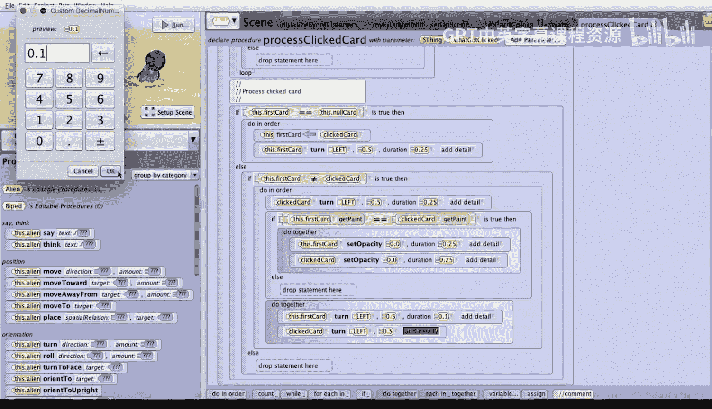
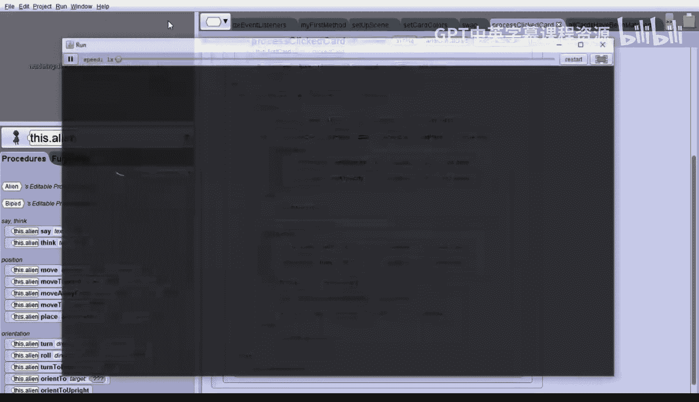
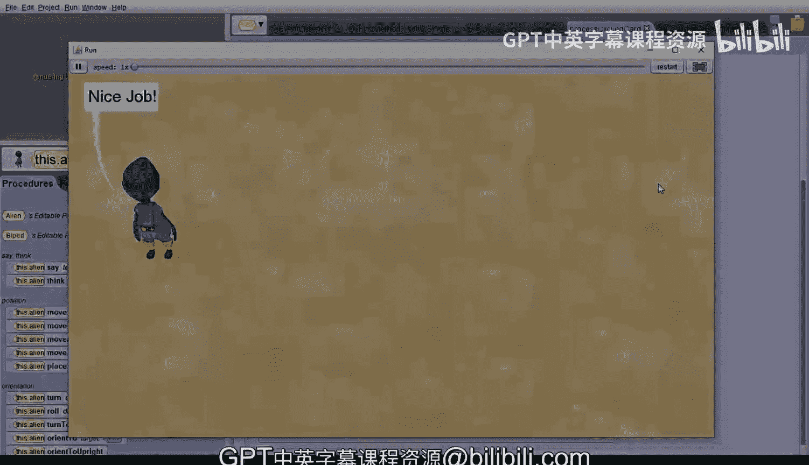

# 137：配对游戏演示 🃏

在本节课中，我们将学习如何为一个已搭建好场景的配对游戏编写核心交互逻辑。具体来说，我们将专注于创建处理卡牌点击的事件处理器。

---

## 概述

本节课的目标是为一个配对游戏编写鼠标点击事件的处理代码。游戏场景、卡牌阵列和洗牌逻辑已经预先设置完成。我们的核心任务是实现 `processClickedCard` 过程，它能响应用户点击，处理卡牌的翻转、匹配判断以及游戏胜利检测。

---

## 游戏初始化与现有代码

首先，我们运行项目以观察初始状态。可以看到12张卡牌出现，外星人给出了游戏说明。

关闭运行窗口后，我们查看已编写的代码。在 `my first method` 中，程序调用了两个过程：`setUpScene` 和 `setCardColors`，然后播放了外星人的指令。

点击进入 `setUpScene` 过程，可以看到其中包含了大量用于将12张卡牌定位成4x3网格的代码。卡牌实际上是方形卡片形状的公告板（billboard）。初始时，程序会调用 `swap` 过程1000次来随机打乱卡牌颜色顺序。

`swap` 过程的工作原理是生成两个0到11之间的随机数，然后交换数组中对应两张卡牌的颜色。这与我们之前制作的记忆游戏逻辑相似。

在场景（Scene）标签页底部，我们创建了两个场景变量（属性）：
*   `cards`：这是一个包含12张卡牌的数组。
*   `firstCard`：这是一个公告板类型的变量，初始化为 `nullCard`。

除了12张游戏卡牌，我们还创建了第13张名为 `nullCard` 的卡牌，并将其放置在地面之下。当需要表示尚未选中任何卡牌时，就将 `firstCard` 设置为 `nullCard`。

---

## 创建事件处理器

由于游戏场景已搭建完毕，我们只需为卡牌点击创建事件处理器。

首先，点击“创建事件监听器”，添加一个“当鼠标点击对象时”的事件。在详细信息中，我们将其限制为仅处理对 `cards` 数组元素的点击。这样，Alice就只会处理对那12张游戏卡牌的点击。

考虑到事件处理器的代码会比较长且复杂，我们不直接在这里编写所有逻辑，而是创建一个场景过程来封装它。

我们创建一个名为 `processClickedCard` 的场景过程，并为其添加一个 `SThing` 类型的参数 `whatGotClicked`。创建完成后，我们立即返回事件监听器标签页，在鼠标点击事件下调用这个过程，并将 `modelAtMouseLocation` 拖拽覆盖 `whatGotClicked` 参数。

现在，我们可以回到 `processClickedCard` 过程内部编写具体逻辑。

---

## 编写 `processClickedCard` 过程逻辑

如前所述，我们需要完成三个主要步骤。让我们在一个 `Do in order` 结构块中组织它们。

### 第一步：确定被点击的卡牌

我们首先添加注释“确定被点击的卡牌”。为了便于后续操作，我们创建一个 `Billboard` 类型的局部变量 `clickedCard`，并将其初始化为 `nullCard`。

接着，我们使用一个 `For each in` 循环遍历 `cards` 数组。在循环内部，使用一个 `If` 语句判断当前的 `cardIterator` 是否等于参数 `whatGotClicked`。如果相等，就将 `clickedCard` 变量设置为这个 `cardIterator`。这样就完成了对被点击卡牌的识别。

### 第二步：处理首次点击（翻开第一张卡牌）

我们添加注释“处理被点击的卡牌”。这里需要一个 `If` 语句来判断 `firstCard` 是否等于 `nullCard`。如果等于，说明玩家点击的是第一张卡牌。

在这种情况下，我们需要按顺序完成两件事：
1.  将 `firstCard` 赋值为 `clickedCard`。
2.  翻转这张卡牌。这通过一个两步动画实现：先让外星人向左旋转半圈（`0.25` 秒），然后将这个“外星人”角色替换为 `firstCard`，从而让卡牌执行翻转动作。

### 第三步：处理第二次点击（翻开并匹配第二张卡牌）

如果 `firstCard` 不是 `nullCard`，说明玩家正在点击第二张卡牌。我们首先需要确保玩家没有点击同一张卡牌两次。因此，使用一个 `If` 语句检查 `clickedCard` 是否不等于 `firstCard`。

如果点击的是不同的卡牌，我们需要按顺序完成五件事：

1.  **翻开第二张卡牌**：使用与第一步相同的方法，让外星人翻转并替换为 `clickedCard`。
2.  **检查颜色是否匹配**：使用一个 `If` 语句判断 `firstCard` 的 `paint` 属性是否等于 `clickedCard` 的 `paint` 属性。
    *   如果匹配，我们使用一个 `Do together` 块，同时将 `firstCard` 和 `clickedCard` 的 `opacity`（不透明度）设置为 `0`（持续 `0.25` 秒），使它们同时消失。
3.  **无论是否匹配，都将两张卡牌翻回背面**：使用一个 `Do together` 块，让 `firstCard` 和 `clickedCard` 同时快速（例如 `0.1` 秒）向左旋转半圈，翻回背面。
4.  **重置 `firstCard`**：将 `firstCard` 重新设置为 `nullCard`，为下一次配对做准备。
5.  **检查游戏是否胜利**：使用一个 `If` 语句调用我们预先写好的场景函数 `allCardsHaveBeenMatched`。
    *   如果函数返回 `true`，则让外星人说“Nice job!!”来祝贺玩家。

---

## 测试游戏

代码编写完成后，我们运行游戏进行测试。点击卡牌寻找匹配对。当点击两张颜色相同的卡牌时，它们会短暂显示后消失。点击不同颜色的卡牌，它们会显示后翻回。当所有卡牌都被成功匹配并消失后，外星人会说出“Nice job!!”，标志着游戏胜利。

---

## 总结

本节课中，我们一起为一个预先搭建好场景的配对游戏编写了核心交互逻辑。我们创建了 `processClickedCard` 过程来处理鼠标点击事件，实现了识别被点击卡牌、处理首次和第二次点击、判断颜色匹配、控制卡牌翻转与消失动画，并在游戏胜利时给出反馈。通过这个过程，你将事件处理、条件判断、循环遍历和动画控制结合运用，完成了一个完整的交互式游戏功能。