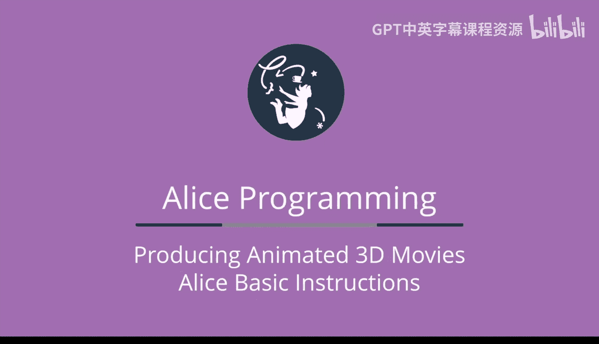
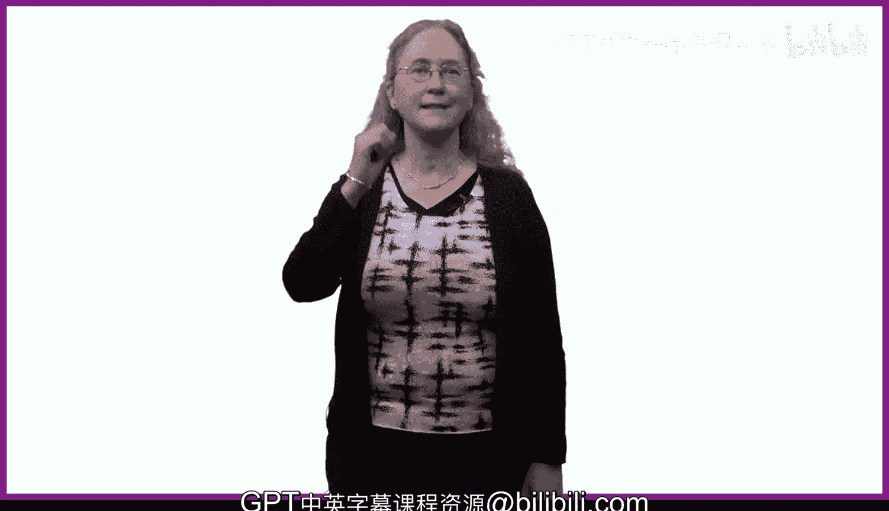

# 杜克大学《爱丽丝编程与动画入门｜Introduction to Programming and Animation with Alice》中英字幕 p01 001_02_02_第二周概述.zh_en -BV1QrB6BcEWW_p1-

This week， we begin our adventures with Alice。 We're going to have a great deal of fun in learning to tell and then animate great stories with animation techniques and programming。

😊，We need to start by setting up our scene。What objects will we want to have？

Where should those objects be placed relative to one another in the starting scene？

We'll learn how to add objects into an Aliceiceene。

 We also need to learn how to place those objects in the exact position where they should be when our animated story starts。

There are many different ways in Alice to position objects。

 and we'll explore several to hopefully find one or two that you like。😊。

The fun part for me is getting to tell a cool story。

We'll spend some time introducing storyboards the technique we'll be using in this course to tell stories。

 and then we get a chance to build the program to actually tell the story。

 We're going to need to introduce different Alice primitive instructions to help to animate our stories。

 We'll learn about object movement and the directions in which an object can move。😊。

We'll also learn about object rotation， basically having objects turning and rolling。

 We'll learn about the， say instruction， which has an object， say something using a speech bubble。

 The sort of thing we see in comic strips。We'll also begin the process of learning about many of Alice's more specialized instructions。

This week we'll learn about many of the specialized movement and turning instructions， for example。

 Alice has a special turn instruction to have one object turn to face a second object。

We'll also spend some time exploring the turning and rolling of an object's parts。

 such as how to turn a person's elbow or knee joint。

We're also going to learn this week about a very foundational choice in animation。😊。

Should animation instructions occur one at a time in order or at the same time together？

AlIS provides two tiles or blocks of code to help us to control the order in which animation instructions are to be run。

The do and order tile and the do together tile。 Well be able to combine different arrangements of do in order and do together tiles to build the perfect。

 animated story。😊，Periodically， throughout this course， we'll be introducing various animation。

 tips and techniques， things we've learned through the years from working with our students and classes。

Hopefully， you'll find many of these to be useful。Much of this week is going to be spent viewing Alice' programs that we have previously written for you。

The reason we do this is that there are many subtle differences between the different Alice instructions。

 and it's important to understand those differences。

We hope that the sample Alices programs will help you to see and understand those differences。

You'll be setting up scenes and building your own AliceIS programs this week。

 And then throughout the rest of the course。Let's get started。

