# 爱丽丝编程与动画入门：002：动画与计算机科学 🎬💻

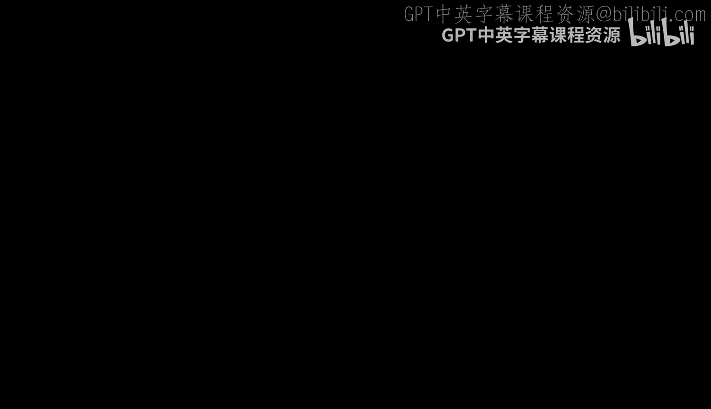

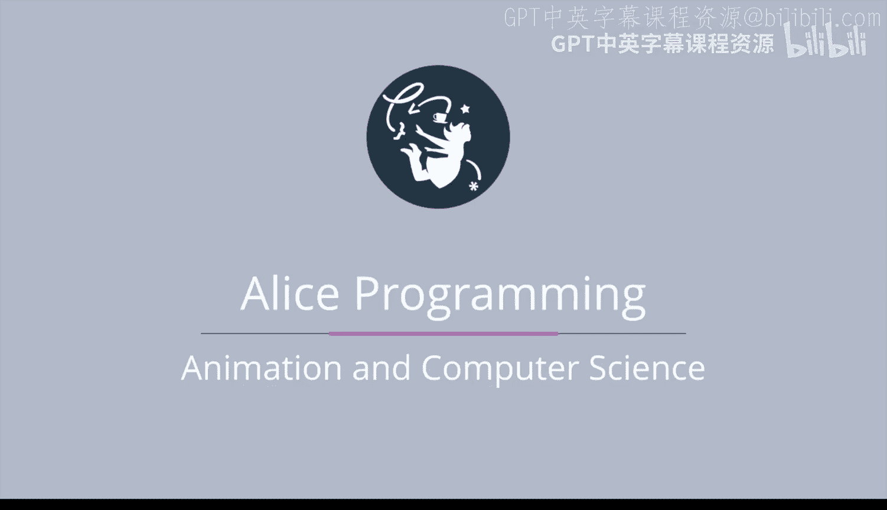

在本节课中，我们将介绍计算机科学、编程和动画的基本概念。你将了解这些领域是什么，以及它们如何相互关联，为后续学习奠定基础。

---

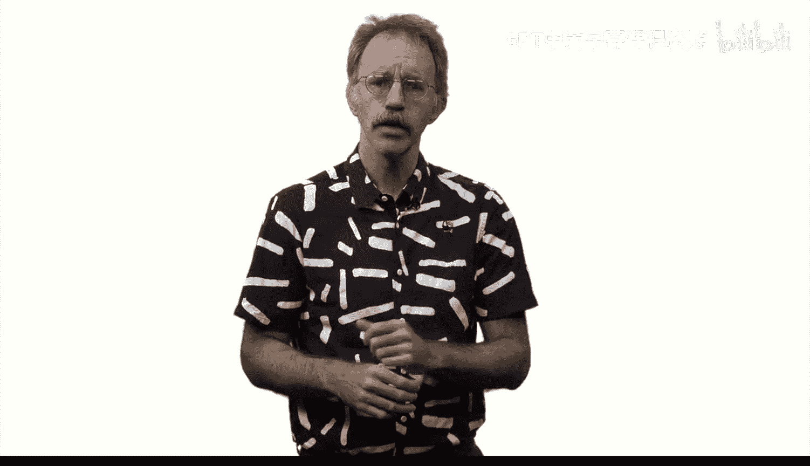

## 什么是计算机科学？ 🤔

上一节我们提到了本课程的目标，本节中我们来看看计算机科学的定义。根据计算机科学教师协会（CSTA）在2003年制定的K-12计算机科学模型课程，计算机科学被定义为：

> **计算机科学是对计算机和算法过程的研究，包括其原理、硬件和软件设计、应用以及对社会的影响。**

实际上，计算机科学如今被用于解决几乎所有领域的问题。以下是几个具体例子：

*   **生物学**：计算机科学家帮助生物学家进行全基因组测序，绘制每个人的DNA图谱。
*   **医学**：他们能帮助医生评估个人患特定疾病的风险。
*   **电影制作**：计算机科学家帮助电影制作人创作动画，例如让《怪物公司》及其续集《怪物大学》中动物的毛发看起来逼真，或让《海底总动员》及其续集《多莉去哪儿》中的水花效果显得真实。
*   **数据分析**：计算机科学帮助我们分析大量数据，例如用于天气预报或预测优秀的棒球运动员。
*   **日常生活**：它让生活更便捷，例如通过机器人清洁地板，或通过自动驾驶汽车载你上下班或上学。

---

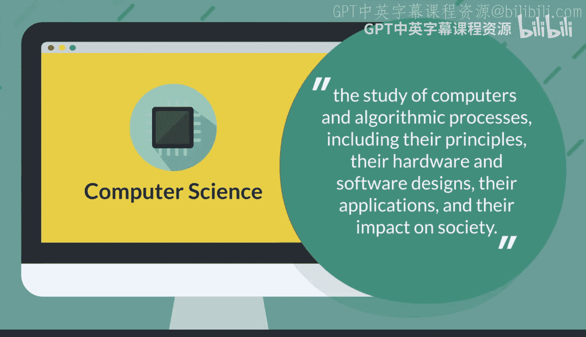

## 什么是编程？ ⌨️

了解了计算机科学的广泛应用后，我们来看看与计算机沟通的具体工具——编程。编程是计算机的语言。

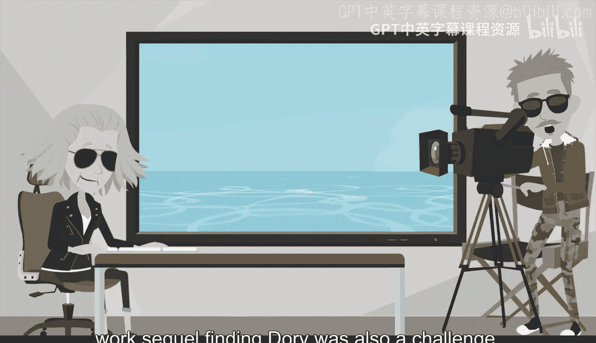

在本课程中，我们使用英语与你交流，英语是我们沟通关于Alice知识的语言。然而，英语作为与计算机沟通的语言存在许多问题。

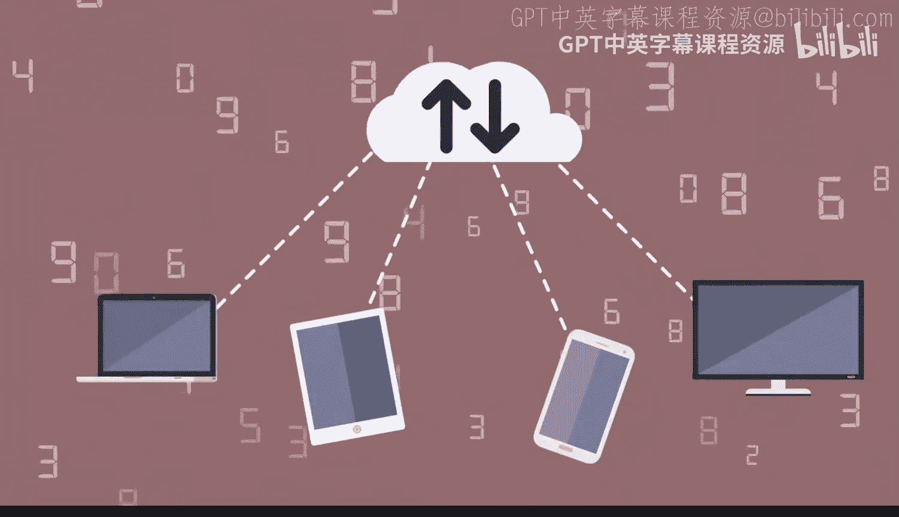

首先，它非常**模糊不清**。例如，考虑这个句子：
`The cat chased the mouse until it fell.`
我们无法确定追逐结束是因为猫摔倒了（老鼠逃走了），还是因为老鼠摔倒了（猫可能抓住了它）。如今的计算机无法很好地处理这种歧义。

我们需要使用一种更**精确**的语言与计算机交流，确保我们想让计算机做的事情没有歧义。英语作为与计算机沟通的语言还存在许多其他问题。

因此，有必要开发新的语言来与计算机交流，我们称这些语言为**编程语言**。**Alice** 就是这样一种编程语言。

---

## 什么是动画？ 🎞️

既然我们已经了解了驱动动画背后的科学（计算机科学）和工具（编程），现在让我们直接聚焦于动画本身。Techopedia 将动画定义为：

> **一种在屏幕上模拟物体运动的技术。**

我更喜欢通过例子来理解动画。例如，动画包括：
*   过去在电视上观看、现在在线观看的周六早间卡通片。
*   最新的皮克斯/迪士尼电影。
*   我们的学生和孩子们总是在玩的酷炫视频游戏。

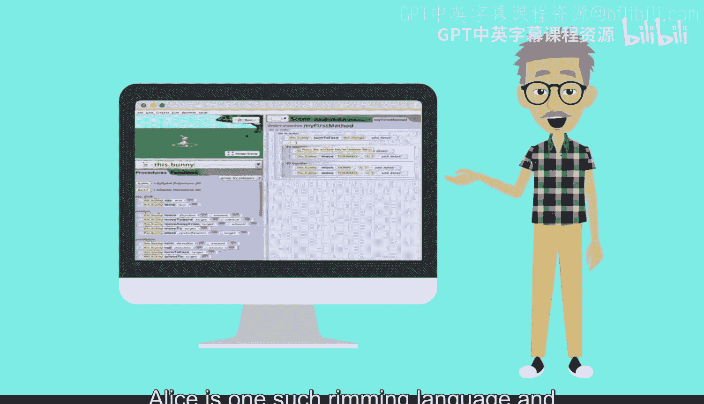

---

## 从消费者到创造者 🚀

美国作家兼媒体理论家道格拉斯·拉什科夫喜欢将世界分为两类人：**技术的消费者**和**技术的生产者**。我们希望你能通过本课程从第一类人转变为第二类人。

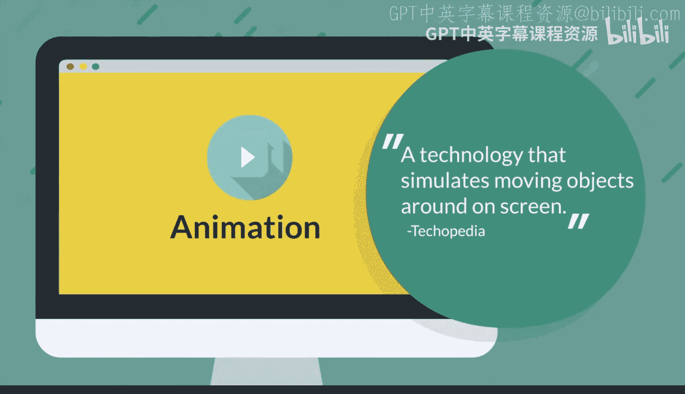

图灵奖（计算机科学界的诺贝尔奖）得主、才华横溢的艾伦·凯说过：“**预测未来最好的方式就是去发明它。**”

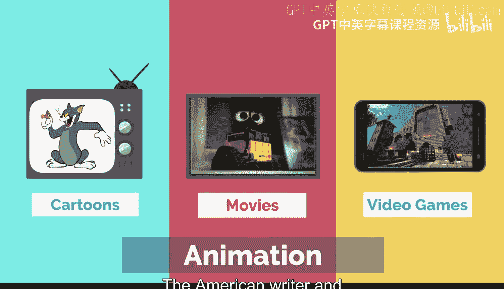

更谦虚地说，**最好玩的电子游戏是你自己创造的，最好看的动画视频是你自己制作的。** 欢迎来到激动人心的Alice世界！😊

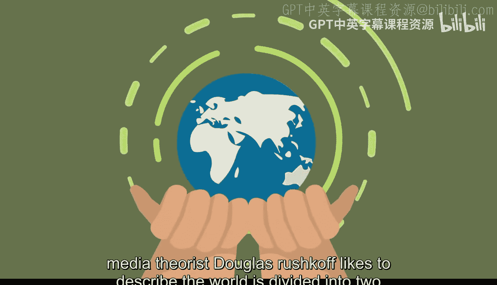

---

## 总结 📝

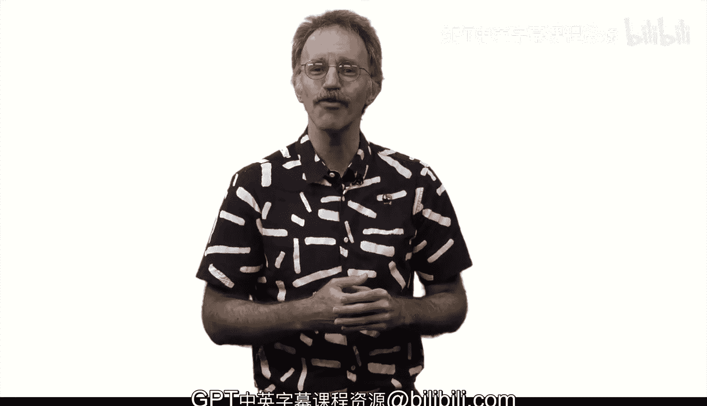

本节课我们一起学习了计算机科学、编程和动画的核心概念。我们了解到计算机科学是研究计算机和算法的广泛领域，编程是与计算机沟通的精确语言，而动画则是通过技术让物体在屏幕上运动起来。本课程的目标是帮助你使用Alice编程语言，从一个技术的消费者转变为能够创造自己动画和游戏的生产者。