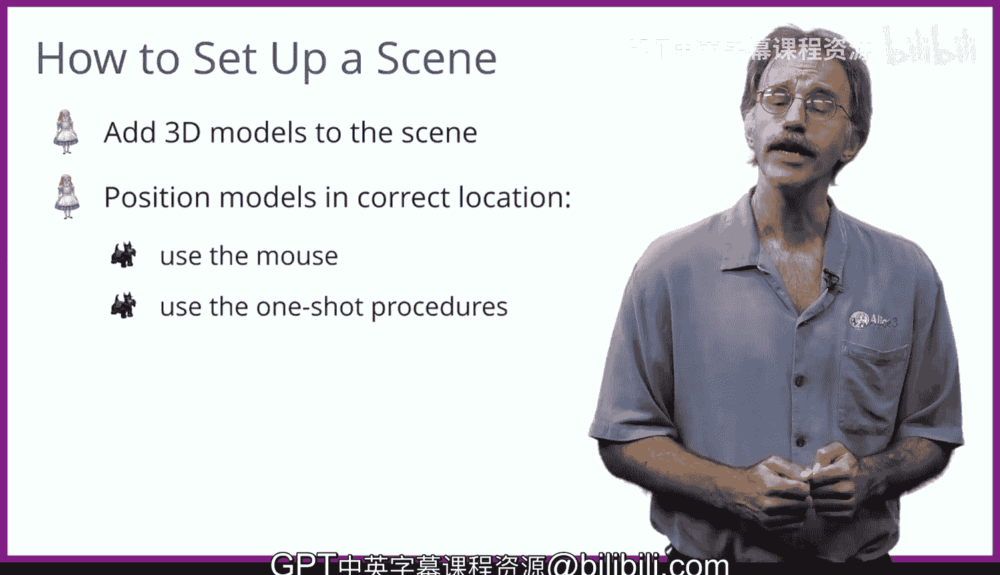

# 爱丽丝编程与动画入门：003：Alice软件概述 🎬

在本节课中，我们将学习如何创建一个Alice项目。创建项目主要分为两个部分：首先是设置初始场景，即决定动画中包含哪些3D模型以及它们的起始位置；其次是编写程序来讲述故事，让动画真正动起来。接下来的几讲将重点介绍第一部分——设置初始场景。

## 设置初始场景 🖼️

上一节我们介绍了创建Alice项目的两个主要部分。本节中，我们来看看如何具体设置初始场景。在Alice中设置场景，首先需要决定你的项目将包含哪些3D模型。

### 添加与定位模型

将模型添加到项目后，通常需要将它们放置在正确的位置。以下是两种主要的定位方法：

*   你可以使用鼠标来移动和旋转对象，进行直观的调整。
*   或者，你也可以使用“单步过程”功能来精确地定位对象。

## 总结 📝

本节课中我们一起学习了Alice项目创建的基础，特别是设置初始场景的步骤。我们了解到，这包括选择3D模型以及使用鼠标或程序指令来定位它们。掌握场景设置是制作动画故事的第一步。