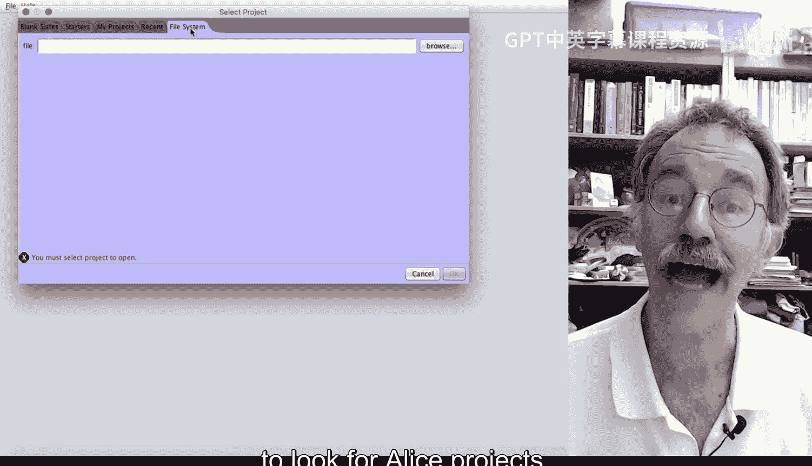
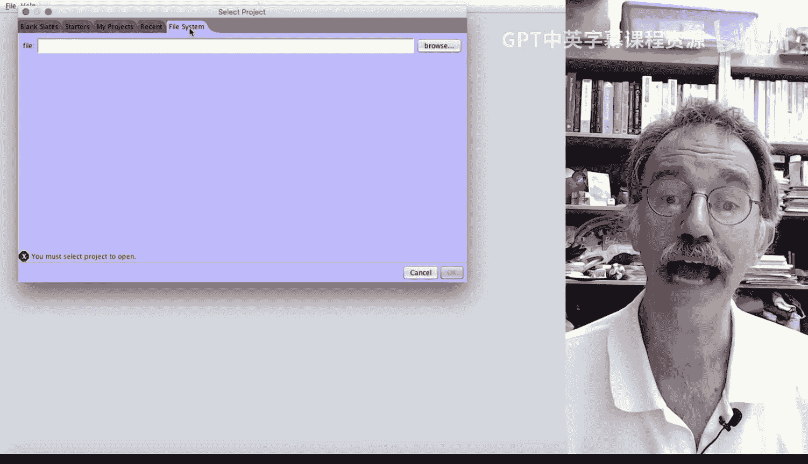
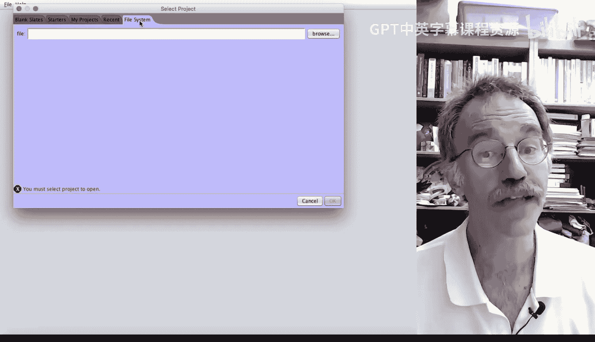
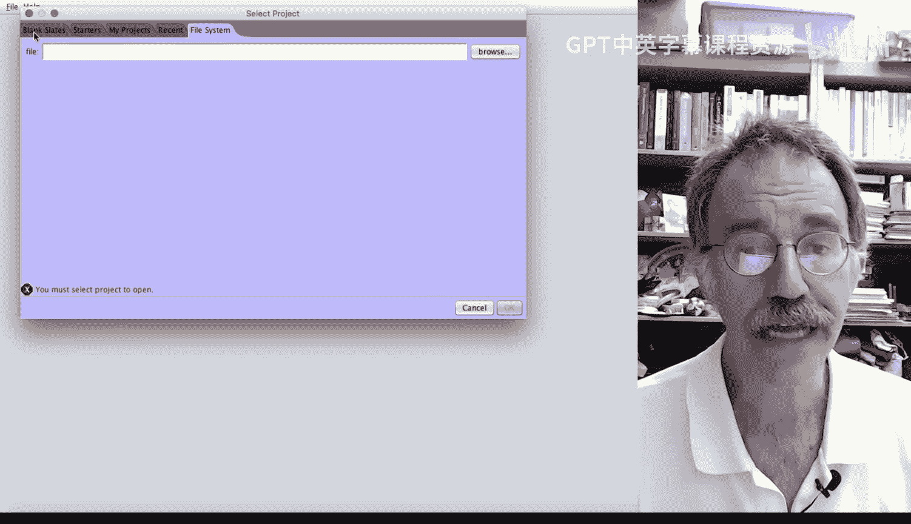

# 杜克大学《爱丽丝编程与动画入门｜Introduction to Programming and Animation with Alice》中英字幕 p04 004_02_05_向场景添加对象.zh_en -BV1QrB6BcEWW_p4-

The purpose of this demonstration will be to explore the Alice environment。In particular。

 you'll be learning how to add objects into a scene。When you first start Alice。

 the select project window appears。There are five tabs from which to select。By default。

 the blank slates tab is selected， which is good as that's the one we need。

It is worthwhile to say something about the other tabs。So we click on the starters tab。

tainsThis tab contains some prebuilt projects developed by the Alice developers at Carnegie Mellon。

The projects contain lots of models already added into a blank slate。

If we click on the My projectss tab， this tab allows you to open up Alice projects you have previously built that are located in a very specific folder。

Technically， AliceIS projects are the Alice virtual worlds you'll be building。

We will use the terms Alice World， Alice Virtual World。

 and Alice Project interchangeably throughout this course。

 as all of these refer to the Alice programs， you'll be building and writing。

We probably won't be using this tab too much in this course。

 though it can be quite useful if you choose to save your Alice Worlds or Alice projects in the default location。

The fourth tab is the recent tab later in this course you'll be using this tab a lot as you work to build and then modify Alice projects。

The fifth and last tab is to go to your computer's file system to look for Alice projects。

Later on in this course， you'll likely start to use this tab more frequently， if， like me。

 you frequently forget where you saved your Alice projects。

Let's go ahead and make sure that the blank Slates tab on the left has been selected。

Let's scroll down and select the snow slate and then click on the OK button at the lower right of this window。

Alice creates a project in which there's a snowy scene。

It is important to note that Alice has two modes。Edit code mode。

 This is where you will add all of the instructions to create animations and scene setup mode。

 This is where you will add the objects to your Alice project。

Because we'll be focusing this session on adding objects to your Alice project。

 let's go ahead and click on the button in the lower right part of the upper left window here to enter scene setup mode。

Alice always starts in edit code mode， so it will be necessary to click on this button every time when you start your AliceIS projects。

Now we see a much larger window containing snow。Now it's time to add some 3D models into our Alice project。

We're going to add a snowman and a snowwoman。AlIS comes with several thousand prebuilt 3D models for most of this course。

 we're going to be using those models in our Alice projects。The lower window contains several tabs。

 When you are playing with Alice， we encourage you to explore the class hierarchy tab。

 the theme tab and the group tab。They are quite useful if， for example， you know you want add a cat。

 since cats all have four legs， you can select the class hierarchy and then select the quadruped class。

For now， I cannot remember whether the model of a snowman contains two legs。

Which makes this model part of the BPD class。Or no legs。

 probably making the snowman part of the prop class。

 So instead we can click on the search gallery tab。In the filter line。We can type in snow。

This will go ahead and return all of the models that either have snow as part of their name or that Alice thinks are associated with snow。

There are two ways to add a model into a scene。Let's look at the first。

Let's click on the Snowman icon。A window pops up。We can name our snowman if we'd like。

 instead of typing anything， let's just click on the OK at the bottom right of the window。Vila。

A snowman appears on the screen。We'll learn how to move the snowman around the scene in a later session。

For now， we'd just like to add a snowwoman and place the snowwoman to the snowman's right。

 or to the camera's left。Let's go ahead and use the second approach to adding objects to a scene。

We can drag the snowwoman。And drag her to the right of the snowman while we're dragging the snowwoman on to the snow。

 we notice a box appear on the snow， showing the position where the snowman will be if we let go of the mouse。

This box is actually called a bounding box， it is the same height， width and depth as a snowwoman。

 so you can see how the snowman will fit into the scene。

So we can kind of put her a little bit closer to the snowman before letting go of the mouse。

Just like the snowman， we can name our snowwoman a particular name if we choose。

Let's go ahead and name our snowwoman Sue with a lowercase S。In Alice， by naming convention。

 we name objects beginning with a lower case letter。We click on OK。

And Sue appears to the right of Snowman。Suppose we'd like to change the name of this snowman。

You can right mouse click on the snowman。And select the Rename option。

And we can rename Snowman to Fsty。And click on， O。The last thing you need to do is to save your work。

Under file at the upper left hand corner， we scroll down and we go ahead and click on the Save button。

We'll name this file。Practice。Adding。Objects。To a。Seecen。

The default location in the My Projects folder is a fine place to save your work。By convention。

 we tend to name our Alice projects beginning with a capital letter， with subsequent words。

 also beginning with capital letters。 We click on the save button to save our work。That's it。

You've now built and saved your first Alice project。

