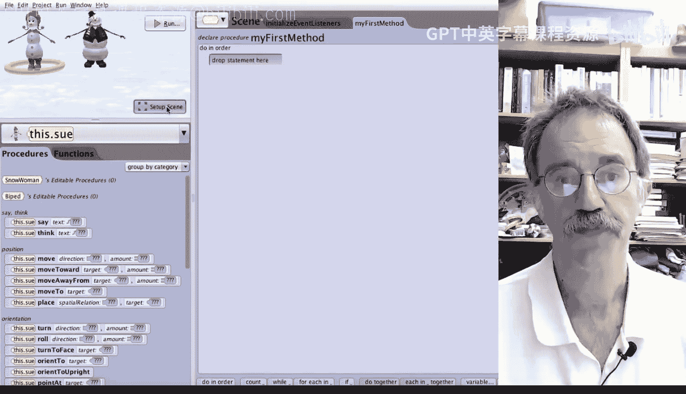

# 爱丽丝编程与动画入门：005：移动对象：控制键与单次执行（Mac版）🎮

在本节课中，我们将学习如何在场景设置阶段移动场景中的对象。您将在整个课程中获得更多设置场景的经验。本节将演示几种不同的操作对象的方法。您无需精通所有方法，只需熟练掌握其中一种即可。

## 选择对象

在移动对象之前，必须先选中它。有三种方法可以选择对象：

*   在屏幕左上角的**对象列表**中点击对象。
*   在场景中用**鼠标点击**对象。
*   在爱丽丝窗口右侧的**下拉列表**中选择对象。

让我们逐一查看。首先，点击对象列表中的 `Sue`。选中后，场景中的 `Sue` 周围会出现一个黄色圆环，同时右侧面板中也会显示 `Sue` 被选中。

接下来，练习其他方法。点击场景中央的雪人 `Frosty`。此时，黄色圆环会从 `Sue` 转移到 `Frosty` 周围，左上角的对象列表和右侧面板中 `Frosty` 均会高亮显示。

最后，尝试从右侧面板的下拉列表中选择 `Sue`。滚动列表并选择 `Sue`，您会看到黄色圆环重新出现在 `Sue` 周围，并且左侧对象列表中的 `Sue` 也被选中。

## 移动对象

现在，让我们尝试将 `Sue` 移动到 `Frosty` 身后。我们将使用两种主要方法：鼠标拖动和指令控制。

### 使用鼠标移动

首先，确保右侧面板的**手柄样式**设置为“默认”或“移动”。个人而言，我们更倾向于使用“默认”样式，以便看到对象周围的黄色圆环。

选中 `Sue` 后，您可以直接用鼠标将其拖拽到 `Frosty` 身后的位置。

在 Mac 上，有三种方法可以撤销操作：

1.  点击菜单栏的 **编辑** -> **撤销**。
2.  按住 **Command** 键（空格键左右两侧均有），然后按 **Z** 键。
3.  点击窗口右上角的 **撤销** 按钮。

### 使用指令移动

您也可以通过指令来移动 `Sue`。在右侧面板中 `Sue` 的下方，有一个名为 **单次执行** 的下拉按钮。点击此按钮，选择 **过程**，然后选择 **移动到**，并选择目标 `Frosty`。这将使 `Sue` 移动到与 `Frosty` 完全相同的位置。

接着，再次点击 **单次执行** -> **过程** -> **移动**，我们可以让 `Sue` 向后移动 2 个单位。现在，`Sue` 就站在 `Frosty` 正后方 2 个单位的位置。

通常，使用鼠标拖拽移动角色更快，而使用单次执行过程则更精确。

## 旋转与升降对象

上一节我们介绍了如何移动对象，本节中我们来看看如何改变对象的方向和高度。

### 旋转对象

接下来，我们将 `Frosty` 和 `Sue` 转身，使他们的背部朝向摄像机。首先点击选中 `Frosty`。如果直接点击对象周围的**黄色圆环**并拖动，可以使 `Frosty` 旋转。如图所示，我们点击并拖动圆环，让 `Frosty` 转过来。

因为 `Sue` 在 `Frosty` 正后方，我们通过左侧对象树点击选中 `Sue`。然后使用单次执行指令让她转身：点击 **单次执行** -> **过程** -> **转向** -> **左转** -> **0.5** 圈。

### 升降对象

最后，让我们将 `Frosty` 升到空中。再次选中 `Frosty`。此时，按住 **Shift** 键并用鼠标拖动，就可以将 `Frosty` 向上提升，就像在飞行一样。

或者，我们也可以使用 **单次执行** 按钮，选择 **过程** -> **移动** -> **向上** 的指令来达到同样效果。

## 总结与提示

本节课中我们一起学习了在爱丽丝中移动、旋转和升降对象的几种核心方法。虽然还有其他操作方式，但我们介绍的这些是最常用的。

如果发现某种方法（尤其是在 Mac 上）无法移动对象，请尝试保存项目并重启爱丽丝软件。完成操作后请务必保存您的工作。如果您对某些移动效果不满意，可以使用之前提到的任意一种撤销方法，来撤销对 `Frosty` 和 `Sue` 的所有操作。