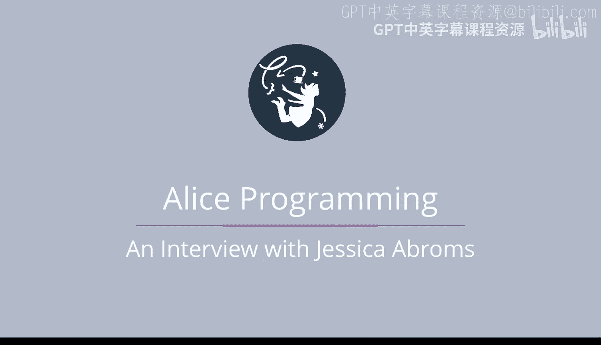

# 杜克大学《爱丽丝编程与动画入门｜Introduction to Programming and Animation with Alice》中英字幕 p08 008_02_10_杰西卡·阿布罗姆斯访谈.zh_en -BV1QrB6BcEWW_p8-

I'm here with Jessica Abrams。 She is a Duke alum。 She received her Bchelor of arts in computer science and literature from Duke University。

 Then she went to CMU， where she received her master's degree in human computer interaction。😊。

And she worked with Alice while she was there。She's also worked at Pixar and Disney。

 and she started her own company。When Jessica started here at Duke。

 I was also starting and she took my first computer science class that I taught a beginning programming course。

Well， Jessica， I'm delighted that you are here today。 Thank you。

 Can you tell us about the cool startup company you started tea time Media。😊，Yes。

 so at teatime Media， we make games for girls primarily The one that monetizes the best is called Mash Mansion Apart Shack house。

 And it was a girl game that I wanted to make back in 2010 and it still is doing well today。

 It is a game that I played in probably like 1980s on paper where you would write like four boys names。

 four kids， four cities。 And it's a game when you draw a little spiral and it says predicts your future。

 I'm gonna marry Tim and live in a house in San Francisco with my three kids。

 And it's a game people search for because they know it。 It has a name that people search for。

 So it's one of the。😊，First iPhone games， and it's actually still monetizes today。

 The other thing I do with Teatime media is I also do consulting。 and so if someone comes to me。

 I get a lot of questions like I have an app idea， how do I make this app and I sort of kind of prepare a plan for them and try to figure out what's the best way and budget and how to structure their app。

Well， let's go back a little bit。 Can you tell us about your experience at Duke and why you decided to major in computer science Yeah。

 so I actually filled out I said on my applications I'm going to major in computer science。

 It was sort of just a。Like a little be in my bonnet I had。

 I wanted to take a computer science class， my senior year。 I went to an allg school。

 and I always like physics and math， and I loved computers。

 And I was like I'd love to take a programming class。 And unfortunately， at the time。

 they did not offer any programming classes。 But the boys school had a programming class across like you know。

 that was a few miles away。 So they said， you can drive over to that school。

 And I was really mad about that。 And so for my applications， I'm like。

 I'm gonna major in computer science。 And this is what I want to learn And when I got to computer science。

 it was like very exciting for me to like sit in a lab and learn how about debugging skills and how to figure out。

😊，You know， you have this task and it's like a problem and it's really complicated to solve and you've got to figure out like the tunnel and the different ways to get there。

 So it was really rewarding when you actually fulfilled the task that you wanted to complete and I feel like the exercises sort of like prepared you for how to learn。

All the programming skills that came in the future。

So did you ever struggle when you were writing a program definitely and you get like stuck and you want to pull your hair out and you're just like。

 I feel one thing that's really good about college when you take the course is like you have a TA and people who you can help in the lab and you're all kind of struggling together so one of the best resources like I think is to take a break talk it out with someone figure out like oh well maybe if I try this。

 I could figure out a different path And so once you like go down a tunnel and you get to the wrong end。

 you're like， okay I got a backtrack and then start a new path and I think that's part of programming and it's definitely there's I think anyone who's ever program is gonna struggle at some point。

And what made you decide to go to CMU to get your master's in human computer interaction？

So when I finished Duke， I was actually had this double major in computer science and literature。

 and I wanted to like。Figure out the future。 I was like。

 I loved the all the like futuristic books that I was reading。

 And I was also looking at all the ways I could， you know。

 make this awesome new program or do all these things， but。😊。

The jobs I was finding were very much like consulting jobs or business and very motivated to business applications。

 which I was somewhat interested in， but never really excited about。

 So I don't even know how I happened upon the CMU master's program。

 I know I wanted to take go to the entertainment technology center。 And I wrote to them。

 But that master's degree wasn't ready yet。 So they offered a degree in human computer interaction。

 And I'm like， well， that sounds interesting。 I always liked the interface part of the programming classes as we like scaled up and we got more into groups。

 I always wanted to figure out how to make things easy to use and how to build an interface and how the product actually like looked and worked more than like。

 you know the just the backend of it。 So I decided to apply to that master's program and continue my studies rather than just take a。

😊，Random consulting job that I probably got a couple offers for， but just didn't really appeal to me。

So Randy Pouchuch taught the buildinging virtual Worlds class at CMU and you did that course and he's the inventor of Alex。

 what was that like？It was really exciting。 I mean， his class was like the class to take。

 and it wasn't even part of my master's degree because my master's degree was in human computer interaction。

 but a few of us， you know， were able to get into that class。 and it was a class of about 200 kids。

 I would say or 100 people at the time。 And everybody wanted to get in and there were very limited spots。

 So in order to get in I had to learn Alice。 and I never used it before。

 but I was also had to try to figure out what role I wanted to take。 you could either be a modeler。

 a programmer or an intangible。 and an intangible that was like more like the project manager。

 but it was really hard to get those roles。 So I said I was gonna be a modeler。

 even though I never used a 3D application package before。 So I had to learn a lot of tutorials。

 I opened up 3D studio Max for this first time。 And you know you're trying to like build something in a twodimensional world on the computer。

 and it's very complicated。 but that's like something that I really。😊。

I feel like I kind of pushed through and learned a lot of skills by actually getting some handson experience in a 3D program and they do like a big project in that class do you remember that project Yeah。

 so at the end project we built we would do like multiple projects every time I built a swimming world where you kind of swim through the environment with a VR headset on。

 which was kind of cool back in like 1999 because now VR is like taken off and then the one that for our final project where they everyone goes into an auditorium。

And。They put all the final projects on stage and people cheer and laugh。

 and all the teams get together。 And ours was like an Indiana Jones。😊，Roercoer ride。

 basically like the end of the Indiana Jones movie。

 and I had to model these tunnels and I found a really cool tutorial online where you could make the tunnels look like more realistic with a little like 3D mapping and programming and I worked with the programmer to figure out how the different arcs of the past can make so he could programmatically put the ride together and it actually ended up being like really fun like you felt like you were moving forward and you had some like gravity feel with it while you were inside the helmet and it actually looked really good because the tunnels just like looked realistic and with some lighting and they looked great yeah and Randy Pouch is now you know he has such a legacy to him and it was such a great and inspiring class and every all the kids。

 it was such an energy when you were in that class just because he would get up on stage and it was like a performance。

 It was like he was acting and everybody was so entertained within like when he spoke。😊。

So you also you were to Pixar What movies did you work on So I started on Mons Inc and then I worked on Find Nemo and the Incribles and Raatouili and finally up and I kind of call it like the golden Age at Pixar because it was all the original movies that are currently being made again today and even at Disney I had the good fortune of working on the Finding Dory app that went along with the movie and so it was like a full circle that I kind of went through Oh yeah So what was your favorite event while you were at Pixar。

At Pixstar， one of the greatest things they had what they would bring in all these speakers and was almost like I was at college again at the school I mean。

 at the company because they had a theater， they would bring in great speakers， great movies。

 and we could just go in and watch whatever we wanted。

 So my favorite one was when they brought in the Sherman Brothers who wrote the music for Mary Poppins。

 the original movie。 And， you know， they had a piano set up。

 And he just played a few bar of like feed the birds。

 And I think I was almost in tears just because it just felt so amazing to like witness like these are the songs that I grew up in watching now。

 And even today， you know， the Mary Poppins animation comes back with the sequel that's currently at。

 So what did you love about working on animations。😊，I think。The greatest part was just like。

 I have an eye。 I think I gained an eye and an appreciation for visual movies。

 And I learned about lighting and the art of like， you know。

 where you put the specular light in the shadow and how you have to make the world look realistic and for me。

 I focused a lot on hair and cloth simulation。 So how to make the hair move realistically putting like water ripples in the water and effects。

 And I think I just gained this appreciation and I for like all these moving pieces that I never saw in the world normally。

 And now I notice it。 And I'm like， oh， look at that painting。

 Look at the specular light that I never understood before I went to fix。

 So do you have a favorite animated movie。😊，I think finding Nemo is probably like the closest one to my heart that I worked on just because。

 you know， it came back to me later in the years and I love watching it with my kids now and I think it's just so sweet and it's not scary。

 it's calming you the movement of the water makes you sort of like relax and enjoy the film。

So I remember in the movie Raatouili cheff Gustuff motto is anyone can cook。

 so do you think that anyone can program？Definitely。

 I think anyone with like the motivation and just like。You have to have the inner drive to do it。

 can learn how to do it because I think it's just like solving any kind of problem in the real world。

 you know， even as like today I do a lot of project management。

 even as a project manager debugging is a skill that you need to have like okay。

 there's not enough food over here so how are we going to get the ingredients to make this cake with this limited amount of resources and you sort of have to make a new plan and figure out a new way to solve different problems。

And do you have any advice for people that are taking our course， These are all beginners。Yeah。

 I mean I think it's hard work so you've got to keep going even when it gets tough。

 like just keep swimming like Dory says or and just sort of push through all those pain points so that you can get through the course and get through the difficult parts and then you'll reap the rewards on the end。

Well， thanks for talking with us today。 Thank you。 Thank you for bringing me here。

