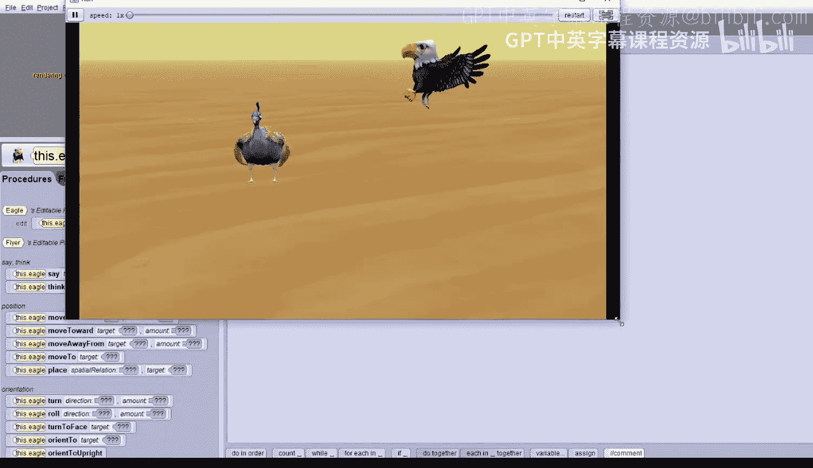

# 杜克大学《爱丽丝编程与动画入门｜Introduction to Programming and Animation with Alice》中英字幕 p10 010_02_04_单次执行与代码.zh_en -BV1QrB6BcEWW_p10-

In this demo， we will explore the difference between executing instructions as a one shot in scene setup。

Versus executing instructions in the code editor。1 shots happen instantly。

 making a change in scene set up for the location of or property of a character in the Alice project。

Instructions in the code editor happen as part of the animation when the run button is pressed。

Let's build a new Alice project with the desert for the ground。It looks like sand。

Let's find the Fer class we'll go to Se scene。And select the flyer class。

And let's add in a peacock right in the center。Just drag it in。Right there。Click， O。

Then added an eagle exactly on top of the peacock。Here's the eag。

And we'll put it right on top of the peacock。So they're both facing front。Now， obviously。

 this couldn't really happen。 but in Alice， it can。

We can use a one shot to know that these two birds are exactly two units apart from their sinners。

 We can have the eagle move to its left one unit with a one shot。 Make sure the eagle is selected。

 then select one shot。Procedures。Move。To its left。1 unit。

Then we can have the peacock move to its right one unit。Select peacock。We shot。Procedures。Move。😔。

To its right， one unit。Now the birds are exactly two units apart。No。

 we could have just clicked on each bird and moved them to these positions。

But then we wouldn't know the exact measurement of how far apart they are。

We can also use one shots in scene setup to move an object off screen a particular distance。

Then during the animation， we would know how far to move it back into the scene。

Let's put the eagle in the air and then move him off screen。First。

 let's do a one shot to get the eagle to spread its wings。

 Spread wings is a special instruction that comes with flyers。😊，Select the eag。Click on one shot。

 procedures， and spread wings is the first one。 Click on that。Oh， that looks pretty nice。

Then use a one shot to turn the eagle to its right a quarter， so it's facing the peacock。One shot。

 procedures。Curn。😔，To its left， one quarter。I meant right。Click Undo。

Let's have it do a one shot procedures。Turn to its right，1 quarter。Now， it's facing the peacock。

Let's have the eagle now move up one unit。One shot。Procedures。Move。😔，up。Wen。

Now we'll have the eagle move backward4， so it will be off screen。Move。😔，Backward。

We have to do custom deimbel number and type in four。The eagle is now off screen。

 but we know if it moves forward by four， it will be exactly where it was before we moved it off screen。

We also know it is one unit above the ground。We should save our world and give it a name。File。Save。

I'm going to call it。Pacock。And e。Simbo。😔，World。Now let's look at putting instructions in the code editor to create an animation。

 click on the editit code button。We can drag and code to the code editor。But first。

 before we drag in any code， it is always a good idea to drag in a do an order block where you can put in all of your code。

Your code instructions will execute in the order they appear in the Do and order block。Now。

 let's drag in that do an order block。Now we can drag code into the do in order。

 select the e if it's not already selected， the Proc tab shows instructions the e knows how to do。

Let's have the eagle fly in， or rather just move back into the view。Click on。Move。

And drag it into the do an order。Then， select forward。And，4。0。Now click on the Run button。

The eagle flies in and stops exactly where it was before we moved it off screen during the setup。Now。

 you can also make the run window larger。 I'm going to do that now。

Just grab the corners and make it larger。

There we go。Now you want to close the run window， you can click the X at the top of the screen。Note。

 it is very important to close the run window。 If you don't close it。

 Alice won't let you do anything because Alice is waiting for the animation to close。

 This is particularly bad when programming Alice on the Macintosh as the run window gets hidden and it's hard to find to close。

Once you close the run window， you can see the eagle is not there。Let's add more code。

After the eagle flies in。Let's have it move to the ground and close its wings。If you remember。

 we move the eagle up one unit with a one shot， so we know we need to move it down one unit。

Drag the move instruction into the do and order。Below the other code that we have there。Select down。

And then， one。Flyierers also have an instruction called Fold Ws that closes its wings up。

Let's drag that into the do order as the last instruction。We have to scroll down to find it。

It's all the way at the bottom fold wings， let's drag it right below as the move down so it's the last instruction。

Now， play your world。The instructions in the code editor execute one after another in the exact order they are shown。

Whenever you click on the run button。Notice the eagle is always off screen when you start。

Click the restart and we can see it happen again。The eagle flies in， moves down， and folds its wings。

To review the difference between one shot and instructions in the code editor is that one shots happen right in that instant and can only be run when setting up the world。

Instructions in the code editor happen when the run button is pressed and the animation is shown。

Enjoy programming with Alice。